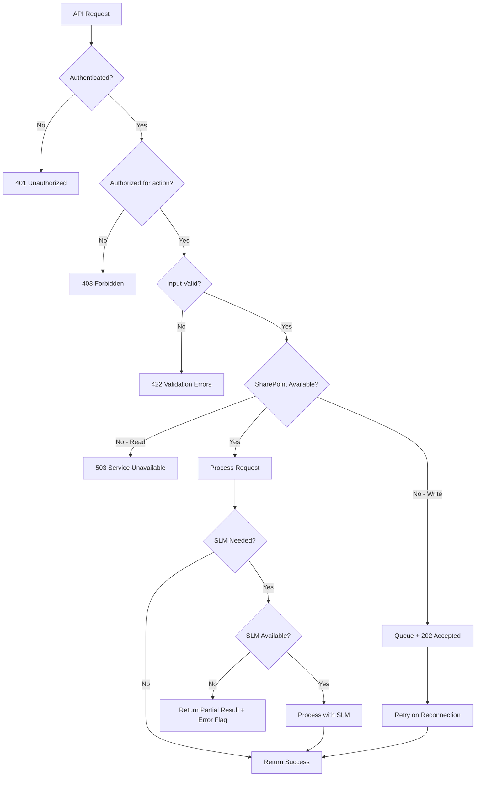

# Design Document: Build vs Buy Evaluation

## Overview

This feature adds a structured Build vs Buy evaluation platform to TVS PlanIQ, enabling teams to make evidence-based software investment decisions. Users compare 2–5 options (Build, Buy, Extend, Do Nothing) through a Gartner-style weighted scoring matrix (8 dimensions) and detailed multi-year TCO analysis. The tool produces ranked recommendations, executive dashboards with radar charts, and exportable PDF reports.

The system integrates with the existing SLM engine (Ollama gemma3:4b via `app/services/slm_engine.py`) for AI-assisted vendor proposal analysis, persists all data to SharePoint's `BuildVsBuy/` folder via the existing `SharePointClient`, and follows the established FastAPI router patterns.

### Key Design Decisions

| Decision | Rationale |
|----------|-----------|
| Single FastAPI router at `app/routers/build_vs_buy.py` | Consistent with existing router-per-module pattern (`estimations.py`, `prd_checker.py`) |
| Evaluation data in per-evaluation Excel workbooks (`BuildVsBuy/{id}.xlsx`) | Avoids concurrency issues with single-file writes; each evaluation is self-contained |
| Scoring weights configurable but defaulted | Allows future customization without breaking existing evaluations |
| SLM suggestions stored alongside manual scores (not overwriting) | Maintains audit trail; user always has final authority |
| TCO defaults unspecified years to last-specified year | Reduces input burden while producing reasonable projections |
| PDF generation via `reportlab` (already available in requirements.txt pattern) | Consistent with existing PDF export in estimations router |
| Radar chart rendered as SVG in frontend (Chart.js) and as static image in PDF | Chart.js for interactivity; server-side SVG/image for PDF export |
| Evaluation index stored in `BuildVsBuy/EvalIndex.xlsx` | Fast listing without opening every evaluation file |

## Architecture

```mermaid
graph TD
    subgraph Frontend [static/index.html]
        WIZ[Multi-step Wizard UI]
        DASH[Executive Dashboard]
        RADAR[Radar Chart - Chart.js]
    end

    subgraph API [app/routers/build_vs_buy.py]
        EP_CREATE[POST /api/build-vs-buy/evaluations]
        EP_GET[GET /api/build-vs-buy/evaluations/{id}]
        EP_LIST[GET /api/build-vs-buy/evaluations]
        EP_OPTIONS[POST /api/build-vs-buy/evaluations/{id}/options]
        EP_SCORES[PUT /api/build-vs-buy/evaluations/{id}/options/{opt_id}/scores]
        EP_TCO[PUT /api/build-vs-buy/evaluations/{id}/options/{opt_id}/tco]
        EP_SLM[POST /api/build-vs-buy/evaluations/{id}/options/{opt_id}/analyze-proposal]
        EP_REPORT[POST /api/build-vs-buy/evaluations/{id}/report]
        EP_STATUS[PATCH /api/build-vs-buy/evaluations/{id}/status]
    end

    subgraph Services
        BVB[BvB Evaluation Service]
        SM[Scoring Matrix Calculator]
        TCO[TCO Calculator]
        SLM[SLM Engine - existing]
        SP[SharePoint Client - existing]
        AUD[Audit Service - existing]
        RPT[Report Generator]
    end

    subgraph Storage [SharePoint - BuildVsBuy/]
        IDX[EvalIndex.xlsx]
        EVAL["{id}.xlsx (per evaluation)"]
        AUDIT_FILE["BvBAudit_YYYY-MM.xlsx"]
        REPORTS["Reports/{id}_Report_{date}.pdf"]
    end

    WIZ -->|API calls| EP_CREATE
    WIZ -->|API calls| EP_OPTIONS
    WIZ -->|API calls| EP_SCORES
    WIZ -->|API calls| EP_TCO
    WIZ -->|Upload proposal| EP_SLM
    DASH -->|Fetch| EP_GET
    DASH -->|Export| EP_REPORT

    EP_CREATE --> BVB
    EP_SCORES --> SM
    EP_TCO --> TCO
    EP_SLM --> SLM
    EP_REPORT --> RPT

    BVB --> SP
    BVB --> AUD
    SM --> BVB
    TCO --> BVB
    RPT --> SP

    SP --> IDX
    SP --> EVAL
    SP --> AUDIT_FILE
    SP --> REPORTS
```

### Data Flow

1. **Evaluation Creation**: User fills opportunity intake form → `POST /evaluations` → validates inputs → creates evaluation record → stores to SharePoint `{id}.xlsx` + updates `EvalIndex.xlsx` → returns evaluation ID.
2. **Option Management**: User adds options → `POST /evaluations/{id}/options` → validates 2–5 limit → appends to evaluation workbook.
3. **Scoring**: User scores each option per dimension (or uploads vendor proposal for SLM-assisted scoring) → `PUT /scores` → Scoring Matrix calculates weighted total → stores scores sheet.
4. **TCO Entry**: User enters cost breakdown per option → `PUT /tco` → TCO Calculator computes 3Y/5Y TCO, Annual Run Cost, Cost per User → stores TCO sheet.
5. **Dashboard**: Frontend fetches complete evaluation → renders radar chart, ranked table, recommendation.
6. **Report Export**: User triggers export → `POST /report` → Report Generator produces PDF → stores to SharePoint `Reports/` folder → returns download URL or binary.

## Components and Interfaces

### 1. Build vs Buy Router

**File**: `app/routers/build_vs_buy.py`

```python
from fastapi import APIRouter, Depends, HTTPException, UploadFile, File, status
from app.middleware.auth import get_current_user, AuthenticatedUser
from app.services.sharepoint_client import SharePointClient

router = APIRouter(prefix="/api/build-vs-buy", tags=["Build vs Buy"])

# --- Evaluation CRUD ---

@router.post("/evaluations", status_code=status.HTTP_201_CREATED)
async def create_evaluation(
    request: EvaluationCreateRequest,
    user: AuthenticatedUser = Depends(get_current_user),
) -> EvaluationResponse: ...

@router.get("/evaluations")
async def list_evaluations(
    user: AuthenticatedUser = Depends(get_current_user),
) -> EvaluationListResponse: ...

@router.get("/evaluations/{evaluation_id}")
async def get_evaluation(
    evaluation_id: str,
    user: AuthenticatedUser = Depends(get_current_user),
) -> EvaluationDetailResponse: ...

# --- Option Management ---

@router.post("/evaluations/{evaluation_id}/options")
async def add_option(
    evaluation_id: str,
    request: OptionCreateRequest,
    user: AuthenticatedUser = Depends(get_current_user),
) -> OptionResponse: ...

@router.put("/evaluations/{evaluation_id}/options/{option_id}")
async def update_option(
    evaluation_id: str,
    option_id: str,
    request: OptionUpdateRequest,
    user: AuthenticatedUser = Depends(get_current_user),
) -> OptionResponse: ...

@router.delete("/evaluations/{evaluation_id}/options/{option_id}")
async def remove_option(
    evaluation_id: str,
    option_id: str,
    user: AuthenticatedUser = Depends(get_current_user),
) -> dict: ...

# --- Scoring ---

@router.put("/evaluations/{evaluation_id}/options/{option_id}/scores")
async def submit_scores(
    evaluation_id: str,
    option_id: str,
    request: ScoreSubmitRequest,
    user: AuthenticatedUser = Depends(get_current_user),
) -> ScoreResponse: ...

# --- TCO ---

@router.put("/evaluations/{evaluation_id}/options/{option_id}/tco")
async def submit_tco(
    evaluation_id: str,
    option_id: str,
    request: TCOSubmitRequest,
    user: AuthenticatedUser = Depends(get_current_user),
) -> TCOResponse: ...

# --- SLM Analysis ---

@router.post("/evaluations/{evaluation_id}/options/{option_id}/analyze-proposal")
async def analyze_vendor_proposal(
    evaluation_id: str,
    option_id: str,
    file: UploadFile = File(...),
    user: AuthenticatedUser = Depends(get_current_user),
) -> ProposalAnalysisResponse: ...

# --- Report ---

@router.post("/evaluations/{evaluation_id}/report")
async def generate_report(
    evaluation_id: str,
    user: AuthenticatedUser = Depends(get_current_user),
) -> ReportResponse: ...

# --- Status ---

@router.patch("/evaluations/{evaluation_id}/status")
async def update_status(
    evaluation_id: str,
    request: StatusUpdateRequest,
    user: AuthenticatedUser = Depends(get_current_user),
) -> EvaluationResponse: ...
```

### 2. Scoring Matrix Calculator

**File**: `app/services/scoring_matrix.py`

```python
from dataclasses import dataclass
from typing import Optional

# Default Gartner-style dimension weights
DEFAULT_WEIGHTS: dict[str, float] = {
    "business_value": 0.20,
    "technology_fit": 0.15,
    "functional_fit": 0.15,
    "financial": 0.20,
    "operational_sustainability": 0.15,
    "business_agility": 0.05,
    "vendor_risk": 0.05,
    "ai_readiness": 0.05,
}

DIMENSIONS = list(DEFAULT_WEIGHTS.keys())
SCORE_MIN = 1
SCORE_MAX = 5


@dataclass
class DimensionScore:
    dimension: str
    score: int  # 1-5
    source: str  # "manual" or "slm_suggested"
    confidence: Optional[float] = None  # SLM confidence 0-1


@dataclass
class WeightedResult:
    option_id: str
    dimension_scores: list[DimensionScore]
    weighted_total: float  # 1.00 - 5.00
    scored_dimensions: int
    total_dimensions: int
    is_complete: bool


def validate_weights(weights: dict[str, float]) -> bool:
    """Validate weights sum to 1.0 (100%) within floating-point tolerance."""
    ...

def validate_score(score: int) -> bool:
    """Validate score is between 1 and 5 inclusive."""
    ...

def calculate_weighted_total(
    scores: dict[str, int],
    weights: dict[str, float] = DEFAULT_WEIGHTS,
) -> float:
    """Calculate weighted total from dimension scores and weights.
    
    Only includes scored dimensions in the calculation.
    Returns value in range [1.0, 5.0].
    """
    ...

def rank_options(results: list[WeightedResult]) -> list[WeightedResult]:
    """Rank options by weighted total, descending. Only ranks complete options."""
    ...
```

### 3. TCO Calculator

**File**: `app/services/tco_calculator.py`

```python
from dataclasses import dataclass, field
from typing import Optional


@dataclass
class Year0Costs:
    """Initial (Year 0) cost breakdown."""
    license: float = 0.0
    implementation: float = 0.0
    migration: float = 0.0
    infrastructure: float = 0.0
    training: float = 0.0
    professional_services: float = 0.0

    @property
    def total(self) -> float:
        return sum([
            self.license, self.implementation, self.migration,
            self.infrastructure, self.training, self.professional_services
        ])


@dataclass
class RecurringCosts:
    """Annual recurring costs (Year 1-5)."""
    license_renewal: float = 0.0
    cloud: float = 0.0
    infrastructure: float = 0.0
    storage: float = 0.0
    ktlo_people: float = 0.0
    vendor_amc: float = 0.0
    change_requests: float = 0.0
    upgrades: float = 0.0
    support: float = 0.0

    @property
    def total(self) -> float:
        return sum([
            self.license_renewal, self.cloud, self.infrastructure,
            self.storage, self.ktlo_people, self.vendor_amc,
            self.change_requests, self.upgrades, self.support
        ])


@dataclass
class TCOInput:
    """Complete TCO input for one option."""
    option_id: str
    year_0: Year0Costs = field(default_factory=Year0Costs)
    yearly_costs: list[RecurringCosts] = field(default_factory=list)  # Index 0=Year1, up to 4=Year5
    user_count: Optional[int] = None


@dataclass
class TCOResult:
    """Computed TCO metrics for one option."""
    option_id: str
    year_0_total: float
    three_year_tco: float
    five_year_tco: float
    annual_run_cost: float
    cost_per_user: Optional[float]  # None if user_count not provided
    yearly_totals: list[float]  # [Y0, Y1, Y2, Y3, Y4, Y5]


def validate_costs(costs: Year0Costs | RecurringCosts) -> list[str]:
    """Validate all cost values are non-negative. Returns list of invalid field names."""
    ...

def calculate_tco(tco_input: TCOInput) -> TCOResult:
    """Calculate 3-Year TCO, 5-Year TCO, Annual Run Cost, and Cost per User.
    
    - Unspecified years default to last-specified year's values.
    - Annual Run Cost = average of Year 1-5 recurring costs.
    - Cost per User = 5-Year TCO / user_count (if provided).
    """
    ...

def get_year_costs(tco_input: TCOInput, year: int) -> RecurringCosts:
    """Get costs for a specific year (1-5), defaulting to last specified if not present."""
    ...
```

### 4. BvB Evaluation Service

**File**: `app/services/bvb_evaluation_service.py`

```python
"""Orchestration service for Build vs Buy evaluations.

Coordinates between scoring, TCO calculation, SharePoint persistence,
and audit logging.
"""

async def create_evaluation(
    request: EvaluationCreateRequest,
    user: AuthenticatedUser,
    sp: SharePointClient,
) -> EvaluationResponse:
    """Create new evaluation, persist to SharePoint, log audit event."""
    ...

async def load_evaluation(evaluation_id: str, sp: SharePointClient) -> EvaluationDetail:
    """Load complete evaluation from SharePoint by ID."""
    ...

async def save_evaluation(evaluation: EvaluationDetail, sp: SharePointClient) -> None:
    """Persist full evaluation state to SharePoint workbook."""
    ...

async def add_option(evaluation_id: str, option: OptionCreateRequest, sp: SharePointClient) -> Option:
    """Add an option to an evaluation (validates 2-5 constraint)."""
    ...

async def remove_option(evaluation_id: str, option_id: str, sp: SharePointClient) -> None:
    """Remove option and all associated scores/TCO data."""
    ...

async def submit_scores(
    evaluation_id: str, option_id: str, scores: dict[str, int], sp: SharePointClient
) -> WeightedResult:
    """Store scores for an option, recalculate weighted total."""
    ...

async def submit_tco(
    evaluation_id: str, option_id: str, tco_input: TCOInput, sp: SharePointClient
) -> TCOResult:
    """Store TCO data for an option, calculate metrics."""
    ...

async def get_recommendation(evaluation_id: str, sp: SharePointClient) -> Recommendation:
    """Generate ranked recommendation from complete evaluation."""
    ...

def determine_status(evaluation: EvaluationDetail) -> EvaluationStatus:
    """Determine evaluation status based on data completeness."""
    ...
```

### 5. Vendor Proposal Analyzer (SLM Integration)

**File**: `app/services/proposal_analyzer.py`

```python
"""SLM-powered vendor proposal analysis for Build vs Buy evaluations."""

from app.services.slm_engine import SLMEngine, SLMOptions
from app.services.document_processor import extract_text_from_file

ANALYSIS_PROMPT_TEMPLATE = """
You are analyzing a vendor proposal for a Build vs Buy evaluation.
Extract the following structured data from the document:

1. Proposed cost breakdown (license, implementation, support, etc.)
2. Implementation timeline (months/phases)
3. Team size and composition
4. Technology stack
5. Support model and SLA commitments
6. Risk indicators (vendor lock-in, hidden costs, unclear terms, deprecation risks)

Additionally, suggest scores (1-5) for these evaluation dimensions:
- Technology Fit: How well does the proposed technology align?
- Functional Fit: How well does it meet functional requirements?
- Operational Sustainability: How maintainable is the solution?
- Vendor Risk: Rate the vendor risk (5=lowest risk, 1=highest risk)
- AI Readiness: How AI-ready is the solution?

Respond ONLY in JSON format:
{json_schema}

Document content:
{document_text}
"""


@dataclass
class ProposalExtractionResult:
    proposed_costs: dict[str, float]
    timeline_months: Optional[int]
    team_size: Optional[int]
    technology_stack: list[str]
    support_model: Optional[str]
    sla_commitments: list[str]
    risk_flags: list[str]
    suggested_scores: dict[str, int]  # dimension -> score (1-5)
    confidence: float  # 0-1


async def analyze_proposal(
    file_content: bytes,
    filename: str,
    slm_engine: SLMEngine,
) -> ProposalExtractionResult:
    """Extract data and suggest scores from a vendor proposal document.
    
    Supports PDF and DOCX formats.
    Falls back gracefully if SLM fails (returns empty result with error flag).
    """
    ...
```

### 6. Report Generator

**File**: `app/services/bvb_report_generator.py`

```python
"""PDF report generator for Build vs Buy evaluations."""

from reportlab.lib.pagesizes import A4
from reportlab.platypus import SimpleDocTemplate, Table, Paragraph, Spacer, Image

def generate_bvb_report(evaluation: EvaluationDetail) -> bytes:
    """Generate a PDF report for a complete Build vs Buy evaluation.
    
    Contents:
    - Header: evaluation date, owner, report ID
    - Opportunity metadata
    - Options summary table
    - Scoring matrix with weighted totals
    - TCO comparison table (INR in lakhs/crores notation)
    - Radar chart visualization (rendered as image)
    - Ranked recommendation
    - Risk flags from SLM analysis
    - Data completeness notes (if applicable)
    """
    ...

def _format_inr(amount: float) -> str:
    """Format amount in INR with lakhs/crores notation."""
    ...

def _render_radar_chart_image(evaluation: EvaluationDetail) -> bytes:
    """Render radar chart as PNG image for PDF embedding."""
    ...
```

### 7. Frontend Components

**File**: `static/index.html` (additions to existing SPA)

The frontend extends the existing PlanIQ SPA with:

```javascript
// === Build vs Buy Module ===

// Navigation: activates from existing left-nav "Build vs Buy" section
// Sub-nav tabs: "New Evaluation" | "History"

// Multi-step Wizard (New Evaluation)
const BVB_STEPS = [
    { id: 'intake', label: 'Opportunity Intake', icon: '📋' },
    { id: 'options', label: 'Define Options', icon: '🔀' },
    { id: 'scoring', label: 'Score Options', icon: '⭐' },
    { id: 'tco', label: 'Enter TCO', icon: '💰' },
    { id: 'dashboard', label: 'Review Dashboard', icon: '📊' },
];

function renderBvBWizard(step, evaluationData) { ... }
function renderIntakeForm() { ... }
function renderOptionsStep(evaluation) { ... }
function renderScoringStep(evaluation) { ... }
function renderTCOStep(evaluation) { ... }
function renderDashboard(evaluation) { ... }

// Dashboard Components
function renderRadarChart(canvasId, options, scores) { ... }  // Chart.js radar
function renderRankedTable(options) { ... }
function renderTCOComparison(options) { ... }
function renderRecommendationCard(topOption) { ... }

// History View
function renderEvaluationHistory(evaluations) { ... }
function renderEvaluationRow(evaluation) { ... }
```

## Data Models

### Evaluation (Core Entity)

| Field | Type | Required | Description |
|-------|------|----------|-------------|
| `id` | `str (UUID)` | Yes | Unique evaluation identifier |
| `opportunity_name` | `str` | Yes | Name of the business opportunity |
| `problem_statement` | `str` | Yes | Description of the problem being solved |
| `business_unit` | `str` | Yes | Owning business unit |
| `budget_min` | `float` | Yes | Minimum budget in INR |
| `budget_max` | `float` | Yes | Maximum budget in INR |
| `target_decision_date` | `str (ISO date)` | Yes | Target date for decision |
| `owner_corporate_id` | `str` | Yes | Creator's corporate ID |
| `owner_display_name` | `str` | Yes | Creator's display name |
| `status` | `EvaluationStatus` | Yes | Current lifecycle status |
| `created_at` | `str (ISO datetime)` | Yes | Creation timestamp |
| `updated_at` | `str (ISO datetime)` | Yes | Last modification timestamp |

### Option

| Field | Type | Required | Description |
|-------|------|----------|-------------|
| `id` | `str (UUID)` | Yes | Unique option identifier |
| `evaluation_id` | `str` | Yes | Parent evaluation ID |
| `name` | `str` | Yes | Option name (e.g., "Build In-House") |
| `type` | `OptionType` | Yes | One of: Do_Nothing, Build, Buy, Extend |
| `vendor_name` | `str` | Conditional | Required when type=Buy |
| `description` | `str` | No | Brief description |

### DimensionScore

| Field | Type | Required | Description |
|-------|------|----------|-------------|
| `dimension` | `str` | Yes | Dimension key (e.g., "business_value") |
| `score` | `int` | Yes | Score 1–5 |
| `source` | `str` | Yes | "manual" or "slm_suggested" |
| `confidence` | `float` | No | SLM confidence (0–1) |

### TCO Data (Per Option)

| Field | Type | Required | Description |
|-------|------|----------|-------------|
| `option_id` | `str` | Yes | Parent option ID |
| `year_0` | `Year0Costs` | Yes | Initial costs (6 categories) |
| `yearly_costs` | `list[RecurringCosts]` | Yes | Year 1–5 recurring costs (9 categories each) |
| `user_count` | `int` | No | Number of users (for Cost per User) |

### TCOResult (Computed)

| Field | Type | Description |
|-------|------|-------------|
| `three_year_tco` | `float` | Year 0 + Year 1 + Year 2 + Year 3 |
| `five_year_tco` | `float` | Year 0 + sum(Year 1–5) |
| `annual_run_cost` | `float` | Average of Year 1–5 totals |
| `cost_per_user` | `float | None` | 5Y TCO / user_count |

### EvaluationStatus (Enum)

| Value | Transition From | Description |
|-------|----------------|-------------|
| `Draft` | (initial) | Evaluation just created |
| `In_Progress` | Draft | Options added, scoring started |
| `Scoring_Complete` | In_Progress | All options fully scored + TCO entered |
| `Recommended` | Scoring_Complete | User confirmed recommendation |
| `Archived` | Any | Manually archived |

### SharePoint Storage Layout

```
BuildVsBuy/
├── EvalIndex.xlsx              # Evaluation list (ID, name, status, owner, dates)
├── {evaluation_id}.xlsx        # Per-evaluation workbook
│   ├── Sheet: Metadata         # Opportunity intake fields
│   ├── Sheet: Options          # Option definitions
│   ├── Sheet: Scores           # Dimension scores per option
│   ├── Sheet: TCO              # Cost data per option
│   └── Sheet: Recommendation   # Computed results + ranking
├── BvBAudit_YYYY-MM.xlsx       # Monthly audit log
└── Reports/
    └── {id}_Report_{YYYY-MM-DD}.pdf  # Generated reports
```

### Pydantic Request/Response Models

```python
# --- Enums ---
class OptionType(str, Enum):
    DO_NOTHING = "Do_Nothing"
    BUILD = "Build"
    BUY = "Buy"
    EXTEND = "Extend"

class EvaluationStatus(str, Enum):
    DRAFT = "Draft"
    IN_PROGRESS = "In_Progress"
    SCORING_COMPLETE = "Scoring_Complete"
    RECOMMENDED = "Recommended"
    ARCHIVED = "Archived"

# --- Requests ---
class EvaluationCreateRequest(BaseModel):
    opportunity_name: str = Field(..., min_length=1)
    problem_statement: str = Field(..., min_length=1)
    business_unit: str = Field(..., min_length=1)
    budget_min: float = Field(..., ge=0)
    budget_max: float = Field(..., ge=0)
    target_decision_date: str  # ISO date
    
class OptionCreateRequest(BaseModel):
    name: str = Field(..., min_length=1)
    type: OptionType
    vendor_name: Optional[str] = None  # Required if type=Buy
    description: Optional[str] = None

class ScoreSubmitRequest(BaseModel):
    scores: dict[str, int]  # dimension_key -> score (1-5)

class TCOSubmitRequest(BaseModel):
    year_0: Year0CostsInput
    yearly_costs: Optional[list[RecurringCostsInput]] = None
    user_count: Optional[int] = Field(None, gt=0)

class StatusUpdateRequest(BaseModel):
    status: EvaluationStatus

# --- Responses ---
class EvaluationResponse(BaseModel):
    id: str
    opportunity_name: str
    status: EvaluationStatus
    owner_display_name: str
    created_at: str
    updated_at: str

class EvaluationDetailResponse(BaseModel):
    evaluation: EvaluationResponse
    options: list[OptionResponse]
    scores: dict[str, list[DimensionScoreResponse]]  # option_id -> scores
    tco_results: dict[str, TCOResultResponse]  # option_id -> TCO
    recommendation: Optional[RecommendationResponse] = None

class ScoreResponse(BaseModel):
    option_id: str
    scores: list[DimensionScoreResponse]
    weighted_total: float
    is_complete: bool
    unscored_dimensions: list[str]

class TCOResponse(BaseModel):
    option_id: str
    three_year_tco: float
    five_year_tco: float
    annual_run_cost: float
    cost_per_user: Optional[float]

class ProposalAnalysisResponse(BaseModel):
    extracted_data: dict
    suggested_scores: dict[str, int]
    risk_flags: list[str]
    confidence: float
    error: Optional[str] = None

class ReportResponse(BaseModel):
    report_url: Optional[str]
    report_filename: str
    generated_at: str
```


## Correctness Properties

*A property is a characteristic or behavior that should hold true across all valid executions of a system — essentially, a formal statement about what the system should do. Properties serve as the bridge between human-readable specifications and machine-verifiable correctness guarantees.*

### Property 1: Intake validation accepts valid and rejects invalid inputs

*For any* opportunity intake with fields (opportunity_name, budget_min, budget_max), the Evaluation_Engine SHALL accept the intake if and only if opportunity_name is non-empty AND budget_max >= budget_min. When rejected, the error response SHALL identify each invalid field.

**Validates: Requirements 1.2, 1.4**

### Property 2: Created evaluations have unique IDs

*For any* sequence of valid evaluation creation requests, all returned evaluation IDs SHALL be distinct from each other.

**Validates: Requirements 1.3**

### Property 3: Option count constraint enforced

*For any* evaluation with N options defined, the system SHALL reject attempts to add a 6th option, and SHALL reject attempts to proceed to scoring when N < 2.

**Validates: Requirements 2.1, 2.3, 2.4**

### Property 4: Cascading option removal

*For any* evaluation with options that have associated scores and TCO data, removing an option SHALL result in zero remaining score entries and zero remaining TCO entries for that option's ID.

**Validates: Requirements 2.5**

### Property 5: Editing option metadata preserves scores

*For any* option with existing dimension scores, updating the option's name, description, or vendor_name SHALL leave all associated dimension scores and the computed weighted total unchanged.

**Validates: Requirements 2.6**

### Property 6: Weight sum validation

*For any* set of dimension weights, the Scoring_Matrix SHALL accept the weights if and only if they sum to 1.0 (100%) within floating-point tolerance (±0.001).

**Validates: Requirements 3.2**

### Property 7: Score range validation

*For any* integer value submitted as a dimension score, the Scoring_Matrix SHALL accept the value if and only if it is in the range [1, 5] inclusive.

**Validates: Requirements 3.3, 3.6**

### Property 8: Weighted total calculation correctness

*For any* valid set of dimension scores (each 1–5) with weights summing to 1.0, the calculated weighted total SHALL equal the sum of (score_i × weight_i) for all dimensions, and the result SHALL be in the range [1.00, 5.00] inclusive.

**Validates: Requirements 3.4, 3.5**

### Property 9: Score storage round-trip

*For any* valid set of dimension scores submitted for an option, storing the scores then retrieving them SHALL return identical dimension scores and the same computed weighted total.

**Validates: Requirements 4.5**

### Property 10: Partial scoring reports correct unscored dimensions

*For any* subset S of the 8 dimensions that are scored for an option, the reported unscored_dimensions SHALL equal the set of all 8 dimensions minus S.

**Validates: Requirements 4.2**

### Property 11: Ranking correctness with completeness filtering

*For any* evaluation with a mix of complete and incomplete options, the recommendation ranking SHALL contain only options with complete scores across all dimensions, and those options SHALL be ordered by weighted total in descending order.

**Validates: Requirements 4.3, 7.5**

### Property 12: Cost validation rejects negative values

*For any* TCO cost input, the TCO_Calculator SHALL reject the input if and only if any cost field contains a negative value, and the error SHALL identify each negative field.

**Validates: Requirements 5.3, 5.4**

### Property 13: TCO calculation correctness

*For any* valid TCO input with Year 0 costs and Year 1–5 recurring costs (unspecified years defaulting to last specified):
- 3-Year TCO SHALL equal Year_0_total + Year_1_total + Year_2_total + Year_3_total
- 5-Year TCO SHALL equal Year_0_total + sum(Year_1 through Year_5 totals)
- Annual Run Cost SHALL equal the average of Year 1 through Year 5 totals
- Cost per User (when user_count provided) SHALL equal 5-Year TCO / user_count

**Validates: Requirements 6.1, 6.2, 6.3, 6.4**

### Property 14: 3-Year TCO never exceeds 5-Year TCO

*For any* valid TCO input with non-negative costs, the computed 3-Year TCO SHALL be less than or equal to the computed 5-Year TCO for the same option.

**Validates: Requirements 6.5**

### Property 15: INR formatting correctness

*For any* non-negative numeric amount, the `_format_inr` function SHALL produce a string representation using lakhs (for amounts ≥ 1,00,000) or crores (for amounts ≥ 1,00,00,000) notation with correct grouping, and parsing the formatted string back to a numeric value SHALL approximate the original amount.

**Validates: Requirements 9.3**

### Property 16: Evaluation persistence round-trip

*For any* valid evaluation state (including metadata, options, scores, and TCO data), serializing to the Excel workbook format then deserializing SHALL produce an evaluation state equivalent to the original.

**Validates: Requirements 10.7, 1.5**

### Property 17: Status determination reflects evaluation completeness

*For any* evaluation, the determined status SHALL be:
- Draft if no options have been added
- In_Progress if options exist but scoring/TCO is incomplete
- Scoring_Complete if all options have complete scores and TCO data
- Furthermore, transitioning to Archived SHALL succeed from any current status.

**Validates: Requirements 12.3, 12.4, 12.6**

### Property 18: Role-based access control enforcement

*For any* evaluation and any user, if the user has Admin role they SHALL be able to view, edit, and delete the evaluation; if the user has User role they SHALL be able to edit only evaluations where they are the owner, and SHALL have read-only access to all other evaluations.

**Validates: Requirements 14.2, 14.3, 14.4**

## Error Handling

| Error Scenario | Handling Strategy | HTTP Status | User Impact |
|---|---|---|---|
| Invalid opportunity intake (empty name, budget_max < budget_min) | Return validation errors with field names | 422 | User sees which fields to fix |
| Option count exceeded (>5) | Return descriptive error | 400 | User informed of maximum limit |
| Option count too low (<2) for scoring | Return descriptive error | 400 | User told to add more options |
| Score out of range (not 1-5) | Return validation error | 422 | User sees valid range |
| Negative cost value in TCO | Return error identifying negative field(s) | 422 | User corrects the value |
| SLM inference failure during proposal analysis | Return graceful error, allow manual scoring | 200 (partial) | User proceeds manually; error noted in response |
| SLM timeout during proposal analysis | Retry once, then return timeout error | 504 | User can retry or score manually |
| Unsupported document format (not PDF/DOCX) | Return format error | 415 | User uploads correct format |
| SharePoint unavailable during write | Queue write, retry on reconnection | 202 (accepted) | Data saved eventually; user notified of pending state |
| SharePoint unavailable during read | Return service unavailable error | 503 | User retries later |
| Evaluation not found by ID | Return not found error | 404 | User navigates to valid evaluation |
| Unauthorized access (no auth token) | Return unauthorized | 401 | User redirected to login |
| Forbidden (User editing another's evaluation) | Return forbidden | 403 | User informed of access restriction |
| Report generation failure (incomplete data) | Generate partial report with completeness notes | 200 | User gets report with warnings |
| Invalid status transition (non-existent) | Return validation error | 422 | User informed of valid transitions |
| Concurrent edit conflict on SharePoint file | Retry with exponential backoff (3 attempts) | 409 after retries | User asked to retry |

### Error Recovery Flow



## Testing Strategy

### Property-Based Tests (using `hypothesis`)

The project uses `hypothesis` for property-based testing. Property tests will generate random inputs to verify universal properties hold across the input space.

**Configuration:**
- Minimum 100 examples per property test (`@settings(max_examples=100)`)
- Each test tagged with: `# Feature: build-vs-buy-evaluation, Property N: <title>`

**Test files:**
- `tests/test_scoring_matrix.py` — Properties 6, 7, 8, 10, 11
- `tests/test_tco_calculator.py` — Properties 12, 13, 14
- `tests/test_bvb_evaluation_service.py` — Properties 1, 2, 3, 4, 5, 9, 16, 17
- `tests/test_bvb_access_control.py` — Property 18
- `tests/test_bvb_report.py` — Property 15

**PBT Library:** `hypothesis` (already in project dependencies)

**Strategies:**
- Scores: `st.integers(min_value=1, max_value=5)` for valid; `st.integers()` for validation tests
- Costs: `st.floats(min_value=0, max_value=1e12)` for valid; `st.floats()` for validation
- Weights: `st.floats(min_value=0.01, max_value=1.0)` normalized to sum=1.0
- Option counts: `st.integers(min_value=0, max_value=10)`
- Evaluation metadata: composite strategy with `st.text(min_size=1)` for names, `st.floats(min_value=0)` for budgets

### Unit Tests (Example-Based)

| Test | File | Validates |
|------|------|-----------|
| Default weights match Gartner spec | `test_scoring_matrix.py` | Req 3.1 |
| Valid intake accepted | `test_bvb_evaluation_service.py` | Req 1.1 |
| New evaluation has Draft status | `test_bvb_evaluation_service.py` | Req 12.2 |
| Recommendation confirmed → Recommended status | `test_bvb_evaluation_service.py` | Req 12.5 |
| SLM failure returns graceful error | `test_proposal_analyzer.py` | Req 8.4 |
| PDF and DOCX formats accepted | `test_proposal_analyzer.py` | Req 8.5 |
| Report contains required sections | `test_bvb_report.py` | Req 9.1 |
| Report filename matches pattern | `test_bvb_report.py` | Req 9.5 |
| Incomplete evaluation report has completeness section | `test_bvb_report.py` | Req 9.4 |
| Unauthenticated request returns 401 | `test_bvb_access_control.py` | Req 14.5 |
| Audit entry logged on create | `test_bvb_audit.py` | Req 11.1 |
| Audit entry logged on modify | `test_bvb_audit.py` | Req 11.2 |
| Audit entry logged on report generation | `test_bvb_audit.py` | Req 11.3 |
| Wizard step restoration from evaluation state | `test_bvb_frontend.py` | Req 13.3 |
| Step navigation blocked when incomplete | `test_bvb_frontend.py` | Req 13.2 |

### Integration Tests

| Test | Validates |
|------|-----------|
| Full evaluation lifecycle (create → options → score → TCO → report) | End-to-end Req 1-9 |
| SharePoint persistence and retrieval | Req 10.1-10.5 |
| Audit log written to correct monthly file | Req 11.4 |
| SLM proposal analysis with real model | Req 8.1, 8.3 |
| SharePoint retry on unavailability | Req 10.6 |

### Test Organization

```
tests/
├── test_scoring_matrix.py           # Property + unit tests for scoring logic
├── test_tco_calculator.py           # Property + unit tests for TCO calculations
├── test_bvb_evaluation_service.py   # Property + unit tests for evaluation orchestration
├── test_bvb_access_control.py       # Property + unit tests for RBAC
├── test_bvb_report.py              # Property + unit tests for report generation
├── test_proposal_analyzer.py        # Unit + integration tests for SLM analysis
├── test_bvb_audit.py              # Unit tests for audit logging
└── test_bvb_frontend.py           # Frontend logic tests (step determination, navigation)
```
