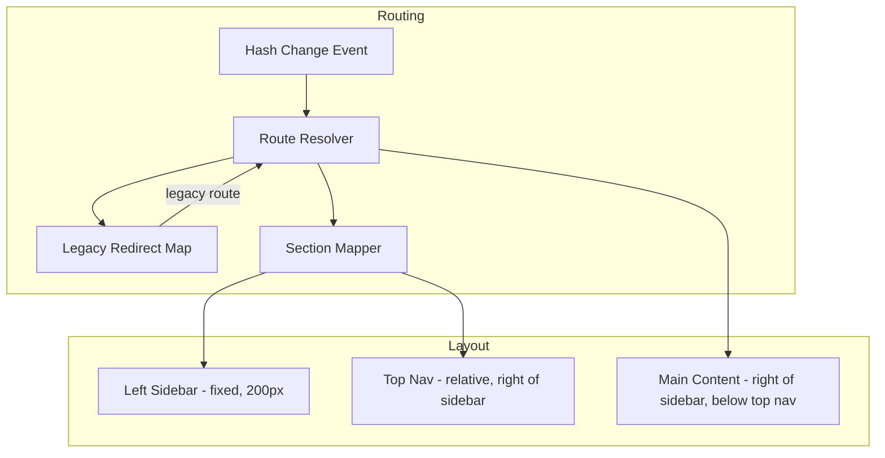

# Design Document: Left Nav Restructure

## Overview

This design restructures the Project Estimation Tool's navigation from a single top navigation bar to a two-tier layout: a persistent left sidebar for primary sections and a contextual top navigation bar for sub-pages. The change is purely frontend — modifying only `static/index.html` — and preserves all existing functionality through backward-compatible URL routing.

The existing architecture uses:
- A single `<div class="header">` with inline nav links
- Hash-based routing via `navigateTo(hash)` / `window.onhashchange` → `router()`
- Page divs with class `page` toggled via `.active` class
- All CSS inline in a `<style>` block; all JS in a `<script>` block

The restructure introduces:
- A fixed left sidebar (`<nav class="left-sidebar">`) with 5 section icons/labels
- A modified top nav showing contextual sub-links based on active section
- An extended router supporting new hierarchical routes and legacy redirects
- Placeholder page divs for future features (PRD Completeness, Build vs Buy, etc.)
- Responsive collapse at ≤768px viewport width

## Architecture



### Layout Architecture

The layout uses CSS fixed positioning for the sidebar and adjusts the top nav and content area with `margin-left`:

```
┌──────────────────────────────────────────────────┐
│ ┌──────────┐ ┌─────────────────────────────────┐ │
│ │          │ │         Top Nav                  │ │
│ │          │ ├─────────────────────────────────┤ │
│ │  Left    │ │                                 │ │
│ │  Sidebar │ │       Main Content              │ │
│ │  (fixed) │ │       (scrollable)              │ │
│ │          │ │                                 │ │
│ │          │ │                                 │ │
│ └──────────┘ └─────────────────────────────────┘ │
└──────────────────────────────────────────────────┘
     200px              remaining width
```

## Components and Interfaces

### 1. Left Sidebar Component

**HTML Structure:**
```html
<nav class="left-sidebar" id="left-sidebar">
    <div class="sidebar-nav">
        <a class="sidebar-item" data-section="estimate" onclick="navigateTo('#estimate/dashboard')">
            <span class="sidebar-icon">📊</span>
            <span class="sidebar-label">Estimate Project</span>
        </a>
        <a class="sidebar-item" data-section="prd" onclick="navigateTo('#prd-check')">
            <span class="sidebar-icon">📋</span>
            <span class="sidebar-label">PRD Completeness</span>
        </a>
        <a class="sidebar-item" data-section="vendors" onclick="navigateTo('#vendors')">
            <span class="sidebar-icon">🔄</span>
            <span class="sidebar-label">Compare Vendors</span>
        </a>
        <a class="sidebar-item" data-section="build-vs-buy" onclick="navigateTo('#build-vs-buy')">
            <span class="sidebar-icon">⚖️</span>
            <span class="sidebar-label">Build vs Buy</span>
        </a>
        <a class="sidebar-item" data-section="settings" onclick="navigateTo('#settings/users')">
            <span class="sidebar-icon">⚙️</span>
            <span class="sidebar-label">Settings</span>
        </a>
    </div>
</nav>
```

**CSS:**
```css
.left-sidebar {
    position: fixed;
    top: 0;
    left: 0;
    width: 200px;
    height: 100vh;
    background: #1a237e;
    z-index: 101;
    display: flex;
    flex-direction: column;
    transition: width 0.3s ease;
}

.sidebar-item {
    display: flex;
    align-items: center;
    gap: 12px;
    padding: 14px 20px;
    color: rgba(255,255,255,0.75);
    text-decoration: none;
    cursor: pointer;
    transition: background 0.2s, color 0.2s;
}

.sidebar-item:hover {
    background: rgba(255,255,255,0.1);
    color: white;
}

.sidebar-item.active {
    background: rgba(255,255,255,0.15);
    color: white;
}
```

### 2. Top Nav Component (Modified Header)

The existing `.header` is modified to sit to the right of the sidebar and show contextual sub-navigation:

```html
<div class="header" id="app-header">
    <div class="left">
        <h1>📊 Project Estimation Tool</h1>
        <div class="nav-links" id="sub-nav-links">
            <!-- Dynamically populated based on active section -->
        </div>
    </div>
    <div class="user-info">
        <span id="user-display-name">User</span>
        <span class="user-badge" id="user-role-badge">User</span>
    </div>
</div>
```

**CSS modifications:**
```css
.header {
    margin-left: 200px; /* Push right of sidebar */
    position: sticky;
    top: 0;
    /* Existing gradient and styling preserved */
}
```

### 3. Router Extension

**New function signatures:**

```javascript
// Determines which section a route belongs to
// Input: hash string (without #)
// Output: section key string ('estimate'|'prd'|'vendors'|'build-vs-buy'|'settings')
function getActiveSection(hash) { ... }

// Returns sub-nav configuration for a section
// Input: section key string
// Output: Array of {label: string, route: string}
function getSubNavItems(section) { ... }

// Updates top nav links and active states
// Input: section key, current hash
// Output: void (mutates DOM)
function updateNavState(section, hash) { ... }

// Resolves legacy routes to new routes (returns null if not legacy)
// Input: hash string (without #)
// Output: new hash string or null
function resolveLegacyRoute(hash) { ... }

// Extended router function (replaces existing router())
function router() { ... }
```

### 4. Section-to-SubNav Mapping

```javascript
const SECTION_CONFIG = {
    estimate: {
        label: 'Estimate Project',
        icon: '📊',
        defaultRoute: '#estimate/dashboard',
        subNav: [
            { label: 'Dashboard', route: '#estimate/dashboard' },
            { label: 'New Estimation', route: '#estimate/new' },
            { label: 'Audit Log', route: '#estimate/audit-log' }
        ]
    },
    prd: {
        label: 'PRD Completeness',
        icon: '📋',
        defaultRoute: '#prd-check',
        subNav: [
            { label: 'Check Document', route: '#prd-check' }
        ]
    },
    vendors: {
        label: 'Compare Vendors',
        icon: '🔄',
        defaultRoute: '#vendors',
        subNav: [
            { label: 'Compare', route: '#vendors' },
            { label: 'History', route: '#vendors/history' }
        ]
    },
    'build-vs-buy': {
        label: 'Build vs Buy',
        icon: '⚖️',
        defaultRoute: '#build-vs-buy',
        subNav: [
            { label: 'Evaluate', route: '#build-vs-buy' },
            { label: 'History', route: '#build-vs-buy/history' }
        ]
    },
    settings: {
        label: 'Settings',
        icon: '⚙️',
        defaultRoute: '#settings/users',
        subNav: [
            { label: 'Users', route: '#settings/users' },
            { label: 'Config', route: '#settings/config' },
            { label: 'Templates', route: '#settings/templates' }
        ]
    }
};
```

### 5. Legacy Route Redirect Map

```javascript
const LEGACY_ROUTES = {
    'dashboard': '#estimate/dashboard',
    'new-estimation': '#estimate/new',
    'audit-log': '#estimate/audit-log',
    'admin': '#settings/users'
};

// Pattern-based legacy routes (with :id param)
const LEGACY_PATTERNS = [
    { pattern: /^results\/(.+)$/, redirect: (id) => `#estimate/results/${id}` },
    { pattern: /^re-estimate\/(.+)$/, redirect: (id) => `#estimate/re-estimate/${id}` },
    { pattern: /^vendor-compare\/(.*)$/, redirect: () => '#vendors' },
    { pattern: /^vendor-compare$/, redirect: () => '#vendors' }
];
```

### 6. Placeholder Pages

New page divs added for upcoming features:

```html
<div class="page" id="page-prd-check">
    <div class="container">
        <div class="card placeholder-card">
            <h2>📋 PRD Completeness</h2>
            <p class="subtitle">Analyze your PRD for completeness and quality</p>
            <div class="coming-soon">🚧 Coming Soon</div>
            <p>Upload your PRD document to get an automated completeness score...</p>
        </div>
    </div>
</div>

<div class="page" id="page-build-vs-buy">...</div>
<div class="page" id="page-vendors-history">...</div>
<div class="page" id="page-build-vs-buy-history">...</div>
<div class="page" id="page-settings-config">...</div>
<div class="page" id="page-settings-templates">...</div>
```

## Data Models

### Route Resolution Model

```
Hash String → Route Resolution:

1. Strip leading '#'
2. Check LEGACY_ROUTES exact match → redirect if found
3. Check LEGACY_PATTERNS regex match → redirect if found
4. Match against new route patterns:
   - 'estimate/dashboard' → page-dashboard
   - 'estimate/new' → page-new-estimation
   - 'estimate/results/:id' → page-results (load data for :id)
   - 'estimate/re-estimate/:id' → page-re-estimate (load data for :id)
   - 'estimate/audit-log' → page-audit-log
   - 'prd-check' → page-prd-check
   - 'vendors' → page-vendor-compare
   - 'vendors/history' → page-vendors-history
   - 'build-vs-buy' → page-build-vs-buy
   - 'build-vs-buy/history' → page-build-vs-buy-history
   - 'settings/users' → page-admin
   - 'settings/config' → page-settings-config
   - 'settings/templates' → page-settings-templates
5. Default → redirect to #estimate/dashboard
```

### Section Determination Model

```
Hash → Section mapping:

- estimate/* routes → 'estimate' section
- prd-check → 'prd' section
- vendors, vendors/* → 'vendors' section
- build-vs-buy, build-vs-buy/* → 'build-vs-buy' section
- settings/* → 'settings' section
```

### Navigation State Model

```typescript
interface NavState {
    activeSection: string;        // key from SECTION_CONFIG
    activeSubRoute: string;       // current hash
    sidebarHighlight: string;     // data-section value to highlight
    subNavItems: SubNavItem[];    // links to render in top nav
    activeSubNavIndex: number;    // which sub-nav link is active
}

interface SubNavItem {
    label: string;
    route: string;
}
```

## Correctness Properties

*A property is a characteristic or behavior that should hold true across all valid executions of a system — essentially, a formal statement about what the system should do. Properties serve as the bridge between human-readable specifications and machine-verifiable correctness guarantees.*

### Property 1: Route-to-UI-state consistency

*For any* valid hash route in the application, the determined active section SHALL correctly drive: (a) exactly one sidebar item being highlighted, (b) the top nav displaying the correct sub-navigation links for that section, and (c) the correct sub-nav link being highlighted.

**Validates: Requirements 1.7, 2.1, 2.2, 2.3, 2.4, 2.5, 2.7**

### Property 2: Route resolution correctness

*For any* valid new-format hash route (including parameterized routes with arbitrary IDs), the router SHALL resolve to exactly one page being visible, with all other pages hidden.

**Validates: Requirements 4.1, 4.2, 4.3, 4.4, 4.5**

### Property 3: Legacy route redirect preservation

*For any* legacy-format hash route (including those with arbitrary ID parameters), the router SHALL redirect to the corresponding new-format route, and parameterized routes SHALL preserve the original ID in the redirected URL.

**Validates: Requirements 4.6, 4.7, 4.8, 4.9, 4.10, 4.11, 4.12, 4.13**

## Error Handling

### Unknown Routes
- Any unrecognized hash route defaults to `#estimate/dashboard`
- The router should never leave the user on a blank page

### Admin Access Control
- The existing admin role check is preserved: navigating to `#settings/users` when `currentUser.role !== 'Admin'` redirects to `#estimate/dashboard`
- Other settings sub-pages (config, templates) should apply the same guard

### Missing Page Elements
- If a page element is not found by ID, the router logs a warning and shows the dashboard
- Placeholder pages gracefully degrade to "Coming Soon" content

### Responsive Edge Cases
- Sidebar width transition uses CSS only (no JS resize handlers needed)
- Content area adjusts via CSS `margin-left` matching sidebar width
- At exactly 768px, collapsed mode applies (using `max-width: 768px` media query)

## Testing Strategy

### Unit Tests (Example-Based)

Since this is a single-file vanilla JS application embedded in HTML, testing will use a DOM-testing approach:

1. **Sidebar rendering**: Verify 5 items in correct order with correct icons
2. **Section defaults**: Click each section, verify correct hash
3. **Placeholder pages**: Navigate to each placeholder route, verify title and "Coming Soon"
4. **Responsive behavior**: Mock viewport width, verify sidebar width changes
5. **CSS properties**: Verify gradient, colors, transitions on elements
6. **Existing page rendering**: Navigate to each existing route, verify correct page div is visible

### Property-Based Tests

Property-based testing is appropriate for the routing logic since:
- Route resolution is a pure mapping function (hash string → page ID + section)
- Legacy redirect is a pure mapping function (legacy hash → new hash)
- The ID parameter space is effectively infinite (any string)
- The `getActiveSection` function is pure (hash → section key)

**Library**: fast-check (JavaScript property-based testing)
**Configuration**: Minimum 100 iterations per property test
**Test file**: A separate test file that imports/extracts the routing functions

Each property test will:
- Generate random valid route strings (including random IDs for parameterized routes)
- Verify the routing functions produce correct outputs
- Tag format: `Feature: left-nav-restructure, Property {N}: {description}`

### Integration Tests

- Full page load with hash navigation between all routes
- Legacy URL bookmarks resolve correctly
- Admin role guard still prevents unauthorized access
- Back/forward browser navigation works correctly
