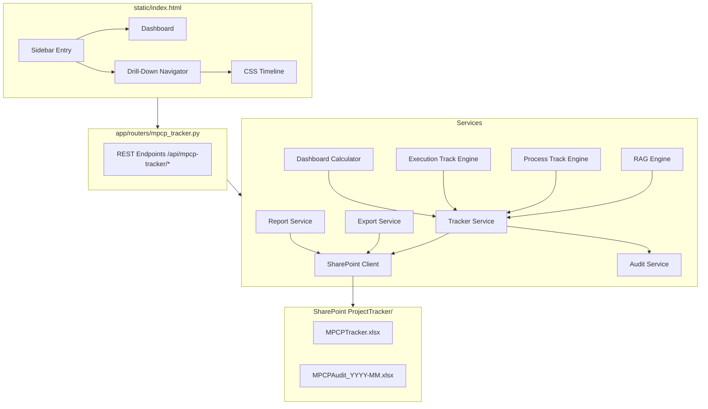

# Technical Design: MPCP Project Tracker

## 1. Architecture Overview

### Module Placement

The MPCP Project Tracker is a new module within TVS PlanIQ, following the same architectural pattern as existing modules (Estimations, Build vs Buy, PRD Checker, Vendor Compare):

```
┌─────────────────────────────────────────────────────────────────┐
│                 Frontend (static/index.html)                      │
│  Dashboard │ Estimations │ BvB │ Vendor │ PRD │ ★ MPCP Tracker  │
└────────────────────────────┬────────────────────────────────────┘
                             │ REST API (/api/mpcp-tracker/*)
┌────────────────────────────▼────────────────────────────────────┐
│                  FastAPI Backend (main.py)                        │
│  Routers: ... │ mpcp_tracker.py (NEW)                            │
│  Services: mpcp_tracker_service.py (NEW)                         │
└─────────┬───────────────────────────────────────────────────────┘
          │
┌─────────▼─────────────┐
│   SharePoint Client    │
│ ProjectTracker/ folder │
│ MPCPTracker.xlsx       │
└────────────────────────┘
```

### New Files

| Layer | File | Purpose |
|-------|------|---------|
| Router | `app/routers/mpcp_tracker.py` | FastAPI endpoints |
| Models | `app/models/mpcp_schemas.py` | Pydantic schemas |
| Service | `app/services/mpcp_tracker_service.py` | Business logic |
| Frontend | `static/js/mpcp-tracker.js` | UI logic |
| Frontend | `static/css/mpcp-tracker.css` | Module styles |

### Navigation Flow

```
Sidebar: "📈 MPCP Tracker"
    ├── Overview Dashboard (default)
    ├── MP List View (filterable by theme)
    │     └── CP List View (breadcrumb: MP > CPs)
    │           └── Project Detail View (MP > CP > Project)
    │                 ├── Tab: Process Track (8-stage stepper)
    │                 └── Tab: Execution Track (timeline + table)
    └── Search/Filter (cross-cutting)
```


---

## 2. Data Models (Pydantic Schemas)

File: `app/models/mpcp_schemas.py`

### Enums

```python
class MPTheme(str, Enum):
    A = "A - Customer Satisfaction"
    B = "B - Profit & Profitability"
    C = "C - Business Growth"
    D = "D - New Product Development"
    E = "E - Effectiveness of People & System"
    F = "F - Digitalization & AI"

class RAGStatus(str, Enum):
    GREEN = "Green"
    YELLOW = "Yellow"
    RED = "Red"

class ProjectType(str, Enum):
    FIXED_BID = "Fixed_Bid"
    SPECIAL = "Special"
    BUG = "Bug"
    ENHANCEMENT = "Enhancement"

class ProcessStage(str, Enum):
    BRD = "BRD"
    PRD = "PRD"
    RFP = "RFP"
    PO = "PO"
    KICKOFF = "Kickoff"
    EXECUTION_START = "Execution_Start"
    ROLLED_OUT_TO_PROD = "Rolled_Out_To_Prod"
    SUCCESS_FAILURE = "Success_Failure"

class StageStatus(str, Enum):
    NOT_STARTED = "Not_Started"
    IN_PROGRESS = "In_Progress"
    COMPLETED = "Completed"
    SKIPPED = "Skipped"
```
## Architecture



### Data Flow

1. **Hierarchy CRUD**: Create MP → CP → Project → validate → persist to SharePoint → audit log
2. **Process Track**: Update stage → validate sequential progression → persist → RAG recalc
3. **Execution Track**: Add/edit milestones → compute slippage → persist → render CSS bars
4. **RAG Changes**: Set RAG → validate context for Yellow/Red → persist history → propagation on read
5. **Dashboard**: Load entities → aggregate by status/vendor/PO/type/LoB → return metrics
6. **Export**: Load filtered data → generate openpyxl workbook with RAG formatting → download
7. **Weekly Report**: Assemble HTML email → send via Microsoft Graph API

### New Files

| Layer | File | Purpose |
|-------|------|---------|
| Router | `app/routers/mpcp_tracker.py` | REST endpoints |
| Models | `app/models/mpcp_schemas.py` | Pydantic schemas |
| Service | `app/services/mpcp_tracker_service.py` | Hierarchy CRUD |
| Service | `app/services/rag_engine.py` | RAG logic |
| Service | `app/services/process_track_engine.py` | Stage management |
| Service | `app/services/execution_track_engine.py` | Milestones |
| Service | `app/services/dashboard_calculator.py` | Aggregation |
| Service | `app/services/mpcp_export_service.py` | Excel export |
| Service | `app/services/mpcp_report_service.py` | Email report |

## Components and Interfaces

### 1. MPCP Tracker Router (`app/routers/mpcp_tracker.py`)

```python
router = APIRouter(prefix="/api/mpcp-tracker", tags=["MPCP Tracker"])

# Managing Points
GET  /mps                          → MPListResponse (filterable by theme)
POST /mps                          → MPResponse (201)
PUT  /mps/{mp_id}                  → MPResponse
DEL  /mps/{mp_id}                  → 204

# Check Points
GET  /mps/{mp_id}/cps              → CPListResponse
POST /mps/{mp_id}/cps              → CPResponse (201)
PUT  /cps/{cp_id}                  → CPResponse
DEL  /cps/{cp_id}                  → 204

# Projects
GET  /cps/{cp_id}/projects         → ProjectListResponse
POST /cps/{cp_id}/projects         → ProjectResponse (201)
PUT  /projects/{project_id}        → ProjectResponse
DEL  /projects/{project_id}        → 204

# Process Track
GET  /projects/{id}/process-track           → ProcessTrackResponse
PUT  /projects/{id}/process-track/{stage}   → ProcessTrackResponse

# Execution Track
GET  /projects/{id}/execution-track                    → ExecutionTrackResponse
POST /projects/{id}/execution-track/milestones         → MilestoneResponse
PUT  /projects/{id}/execution-track/milestones/{m_id}  → MilestoneResponse
DEL  /projects/{id}/execution-track/milestones/{m_id}  → 204

# RAG Status
PUT  /{entity_type}/{entity_id}/rag         → RAGResponse
GET  /{entity_type}/{entity_id}/rag/history → RAGHistoryResponse

# Dashboard & Search
GET  /dashboard         → DashboardResponse (with optional filters)
GET  /projects/search   → ProjectSearchResponse (q + filters)

# Export & Report
GET  /export            → Excel binary download (with filters)
POST /weekly-report     → WeeklyReportResponse
```


### Core Models

```python
class RAGContext(BaseModel):
    why: str                  # Root cause
    path_to_green: str        # Action to resolve
    owner: str                # Responsible person
    eta: date                 # Resolution date

class ManagingPointCreate(BaseModel):
    code: str                 # Pattern: ^[A-F]\d+$ (e.g. A3, B1)
    name: str
    theme: MPTheme
    owner: str
    lob: str                  # IND-2W, CMB, IB

class ManagingPoint(ManagingPointCreate):
    id: str                   # UUID
    rag_status: RAGStatus = RAGStatus.GREEN
    rag_context: Optional[RAGContext] = None
    propagated_rag: Optional[RAGStatus] = None
    created_at: datetime
    updated_at: datetime
    cp_count: int = 0
    project_count: int = 0

class CheckPointCreate(BaseModel):
    code: str                 # Pattern: ^[A-F]\d+\.\d+$ (e.g. A3.1)
    name: str
    owner: str
    description: Optional[str] = None
    parent_mp_id: str

class CheckPoint(CheckPointCreate):
    id: str
    rag_status: RAGStatus = RAGStatus.GREEN
    rag_context: Optional[RAGContext] = None
    propagated_rag: Optional[RAGStatus] = None
    created_at: datetime
    updated_at: datetime
    project_count: int = 0

class ProjectCreate(BaseModel):
    name: str
    project_type: ProjectType
    vendor: str               # Validated: Exathought|Deloitte|TVSD|Evontech|Autovyn
    product_owner: str        # Validated: 6 known POs
    lob: str
    description: Optional[str] = None
    parent_cp_id: str

class Project(ProjectCreate):
    id: str
    rag_status: RAGStatus = RAGStatus.GREEN
    rag_context: Optional[RAGContext] = None
    current_stage: ProcessStage = ProcessStage.BRD
    created_at: datetime
    updated_at: datetime
```


### Track Models

```python
class ProcessTrackStage(BaseModel):
    project_id: str
    stage: ProcessStage
    status: StageStatus = StageStatus.NOT_STARTED
    planned_date: Optional[date] = None
    actual_date: Optional[date] = None    # Required when Completed
    remarks: Optional[str] = None
    skip_reason: Optional[str] = None     # Required when Skipped

class ExecutionMilestoneCreate(BaseModel):
    name: str
    vendor: str
    planned_start: date
    planned_end: date
    remarks: Optional[str] = None

class ExecutionMilestone(ExecutionMilestoneCreate):
    id: str
    project_id: str
    actual_start: Optional[date] = None
    actual_end: Optional[date] = None
    slippage_days: int = 0    # Computed: (actual_end - planned_end).days
    is_delayed: bool = False  # Computed: slippage_days > 0
    rag_status: RAGStatus = RAGStatus.GREEN

class RAGHistoryEntry(BaseModel):
    entity_type: str          # "MP", "CP", "Project"
    entity_id: str
    previous_status: RAGStatus
    new_status: RAGStatus
    rag_context: Optional[RAGContext] = None
    changed_by: str
    timestamp: datetime

class DashboardMetrics(BaseModel):
    total_projects: int
    green_count: int
    yellow_count: int
    red_count: int
    by_vendor: dict           # {vendor: {total, green, yellow, red}}
    by_po: dict               # {po: {total, green, yellow, red}}
    by_type: dict             # {type: count}
    by_lob: dict              # {lob: {total, green, yellow, red}}
    critical_items: List[dict]
```
### 2. MPCP Tracker Service (`app/services/mpcp_tracker_service.py`)

```python
VALID_VENDORS = ["Exathought", "Deloitte", "TVSD", "Evontech", "Autovyn"]
VALID_POS = ["Ashish Thakur", "Akshay Bhosle", "Prakash Bharati",
             "Avinash Kumar", "Bibin", "Sumitra Rathod"]
VALID_LOBS = ["IND-2W", "CMB", "IB"]
MP_THEMES = {"A": "Customer Satisfaction", "B": "Profit & Profitability",
             "C": "Business Growth", "D": "New Product Development",
             "E": "Effectiveness of People & System", "F": "Digitalization & AI"}

async def load_hierarchy(sp) -> dict: ...
async def create_mp(request, user, sp) -> dict: ...
async def create_cp(mp_id, request, user, sp) -> dict: ...
async def create_project(cp_id, request, user, sp) -> dict: ...
async def delete_mp(mp_id, sp) -> None: ...  # Rejects if has children
async def delete_cp(cp_id, sp) -> None: ...  # Rejects if has children
async def delete_project(project_id, sp) -> None: ...  # Cascades track deletion
```

### 3. RAG Propagation Engine (`app/services/rag_engine.py`)

```python
from enum import IntEnum

class RAGSeverity(IntEnum):
    GREEN = 0
    YELLOW = 1
    RED = 2

def compute_propagated_rag(children_rag_statuses: list[str]) -> str:
    """Worst-child-wins: returns max severity. Empty list → 'Green'.
    Commutative — order doesn't affect result."""
    ...

def validate_rag_context(status: str, context: dict | None) -> list[str]:
    """Returns list of missing fields. Empty = valid.
    Yellow/Red require: why, path_to_green, owner, eta."""
    ...

async def update_rag(entity_type, entity_id, new_status, context, user, sp) -> dict: ...
def get_rag_with_propagation(entity_type, entity_id, hierarchy) -> dict: ...
```

### 4. Process Track Engine (`app/services/process_track_engine.py`)

```python
PROCESS_STAGES = ["BRD", "PRD", "RFP", "PO", "Kickoff",
                  "Execution_Start", "Rolled_Out_To_Prod", "Success_Failure"]

def validate_stage_transition(stages, target_stage, new_status) -> str | None:
    """Returns error if invalid, None if valid.
    Rule: In_Progress only if all preceding are Completed/Skipped."""
    ...

def compute_current_stage(stages) -> str:
    """First In_Progress, or first Not_Started if none In_Progress."""
    ...

def initialize_process_track(project_id) -> list[dict]:
    """8 stages, all Not_Started."""
    ...
```

### 5. Execution Track Engine (`app/services/execution_track_engine.py`)

```python
from datetime import date

def compute_slippage(planned_end: date, actual_end: date | None) -> int | None:
    """(actual - planned).days. None if no actual_end."""
    ...

def is_delayed(planned_end: date, actual_end: date | None) -> bool:
    """True iff actual_end > planned_end."""
    ...

def sort_milestones(milestones: list[dict]) -> list[dict]:
    """Sort by planned_start_date ascending."""
    ...

def compute_time_axis(milestones: list[dict]) -> tuple[date, date]:
    """(min planned_start, max planned_end) for Gantt scaling."""
    ...
```


---

## 3. API Design (FastAPI Endpoints)

File: `app/routers/mpcp_tracker.py` — Prefix: `/api/mpcp-tracker/`

### Managing Points

| Method | Path | Description |
|--------|------|-------------|
| GET | `/mps` | List all MPs with RAG, theme, counts |
| POST | `/mps` | Create MP |
| GET | `/mps/{mp_id}` | Get MP detail |
| PUT | `/mps/{mp_id}` | Update MP metadata |
| DELETE | `/mps/{mp_id}` | Delete MP (must have 0 CPs) |

### Check Points

| Method | Path | Description |
|--------|------|-------------|
| GET | `/mps/{mp_id}/cps` | List CPs under MP |
| POST | `/mps/{mp_id}/cps` | Create CP under MP |
| GET | `/cps/{cp_id}` | Get CP detail |
| PUT | `/cps/{cp_id}` | Update CP metadata |
| DELETE | `/cps/{cp_id}` | Delete CP (must have 0 projects) |

### Projects

| Method | Path | Description |
|--------|------|-------------|
| GET | `/cps/{cp_id}/projects` | List projects under CP |
| POST | `/cps/{cp_id}/projects` | Create project under CP |
| GET | `/projects/{id}` | Get project detail |
| PUT | `/projects/{id}` | Update project metadata |
| DELETE | `/projects/{id}` | Delete project + all track data |

### Process Track

| Method | Path | Description |
|--------|------|-------------|
| GET | `/projects/{id}/process-track` | Get all 8 stages |
| PUT | `/projects/{id}/process-track/{stage}` | Update stage status/dates |

### Execution Track

| Method | Path | Description |
|--------|------|-------------|
| GET | `/projects/{id}/milestones` | List milestones (chronological) |
| POST | `/projects/{id}/milestones` | Add milestone |
| PUT | `/milestones/{mid}` | Update milestone actuals |
| DELETE | `/milestones/{mid}` | Remove milestone |

### RAG Status

| Method | Path | Description |
|--------|------|-------------|
| PUT | `/rag/{entity_type}/{id}` | Update RAG (context required for Y/R) |
| PUT | `/rag/{entity_type}/{id}/context` | Update context without status change |
| GET | `/rag/{entity_type}/{id}/history` | Get RAG change history |

### Dashboard, Search, Export

| Method | Path | Description |
|--------|------|-------------|
| GET | `/dashboard` | Aggregated portfolio metrics |
| GET | `/search?q=&rag=&vendor=&po=&type=&lob=` | Filter/search projects |
| GET | `/export` | Download formatted Excel report |
| POST | `/weekly-report` | Generate & send email report |
| GET | `/weekly-report/config` | Get email recipients |
| PUT | `/weekly-report/config` | Update email recipients |


---

## 4. SharePoint Storage Design

### Folder & File

```python
# Constants added to sharepoint_client.py
FOLDER_PROJECT_TRACKER = "ProjectTracker"
FOLDER_PROJECT_TRACKER_AUDIT = "ProjectTracker/Audit"
FILE_MPCP_TRACKER = "ProjectTracker/MPCPTracker.xlsx"
```

### Workbook Sheets

**MPs sheet:** id, code, name, theme, owner, lob, rag_status, rag_context_json, propagated_rag, created_at, updated_at

**CPs sheet:** id, code, name, owner, description, parent_mp_id, rag_status, rag_context_json, propagated_rag, created_at, updated_at

**Projects sheet:** id, name, project_type, vendor, product_owner, lob, description, parent_cp_id, rag_status, rag_context_json, current_stage, created_at, updated_at

**ProcessTracks sheet:** project_id, stage, status, planned_date, actual_date, remarks, skip_reason
> 8 rows per project (one per stage, created on project init)

**ExecutionMilestones sheet:** id, project_id, name, vendor, planned_start, planned_end, actual_start, actual_end, slippage_days, is_delayed, rag_status, remarks

**RAGHistory sheet:** entity_type, entity_id, previous_status, new_status, why, path_to_green, owner, eta, changed_by, timestamp

### Initialization

```python
async def initialize_mpcp_tracker_structure(self):
    """Called on first boot — creates folder + workbook with headers."""
    await self.ensure_folder_exists(FOLDER_PROJECT_TRACKER)
    await self.ensure_folder_exists(FOLDER_PROJECT_TRACKER_AUDIT)
    await self.create_workbook_with_sheets(FILE_MPCP_TRACKER, {
        "MPs": [col headers as above],
        "CPs": [...],
        "Projects": [...],
        "ProcessTracks": [...],
        "ExecutionMilestones": [...],
        "RAGHistory": [...],
    })
```
### 6. Dashboard Calculator (`app/services/dashboard_calculator.py`)

```python
def compute_dashboard_metrics(hierarchy, filters=None) -> dict:
    """Aggregates: RAG breakdown, by vendor, by PO, by type, by LoB, critical items.
    Applies filters before aggregation if provided."""
    ...

def apply_filters(projects, filters) -> list[dict]:
    """AND-logic filtering: rag_status, vendor, po, project_type, lob, text_search."""
    ...
```

### 7. Export Service (`app/services/mpcp_export_service.py`)

```python
from openpyxl import Workbook
from openpyxl.styles import PatternFill

RAG_FILLS = {
    "Green": PatternFill(start_color="92D050", end_color="92D050", fill_type="solid"),
    "Yellow": PatternFill(start_color="FFC000", end_color="FFC000", fill_type="solid"),
    "Red": PatternFill(start_color="FF0000", end_color="FF0000", fill_type="solid"),
}

def generate_export_workbook(hierarchy, filters=None) -> bytes:
    """4 sheets: Overview, Hierarchy, Projects, Execution. RAG cell coloring."""
    ...

def get_export_filename() -> str:
    """MPCP_Tracker_Report_YYYY-MM-DD.xlsx"""
    ...
```

### 8. Weekly Report Service (`app/services/mpcp_report_service.py`)

```python
async def generate_weekly_report_html(hierarchy) -> str:
    """HTML with RAG counts, Red/Yellow items with context, top 5 slippages.
    'All projects on track' if no Yellow/Red."""
    ...

async def send_report_email(html_body, recipients, sp) -> bool:
    """Send via Microsoft Graph API /me/sendMail."""
    ...
```

### 9. Frontend (additions to `static/index.html`)

```javascript
// Drill-Down Navigator
function renderMPCPTracker() { }     // Route controller
function renderMPCPDashboard() { }   // Cards + tables
function renderMPList(mps) { }       // MP list with RAG badges
function renderCPList(mp, cps) { }   // CPs under MP
function renderProjectList(cp, projects) { }
function renderProjectDetail(project) { } // Process + Execution tabs
function renderBreadcrumb(path) { }  // Clickable hierarchy path
function renderFilterBar() { }       // Dropdowns for all filter axes
function renderGanttTimeline(milestones) { } // CSS-only bars
```

#### CSS Timeline (pure CSS Gantt)

```css
.gantt-container { overflow-x: auto; }
.gantt-row { display: flex; height: 32px; margin-bottom: 4px; }
.gantt-label { width: 150px; flex-shrink: 0; font-size: 12px; }
.gantt-bar { position: absolute; height: 12px; border-radius: 3px; }
.gantt-bar--planned { background: #4A90D9; opacity: 0.6; }
.gantt-bar--actual-ok { background: #92D050; }
.gantt-bar--actual-delayed { background: #FF4444; }
```


---

## 5. Frontend Design

### Sidebar Entry

```html
<li class="nav-item" data-module="mpcp-tracker">
    <span class="nav-icon">📈</span>
    <span class="nav-text">MPCP Tracker</span>
</li>
```

### URL Hash Routing

```
#mpcp-tracker               → Overview Dashboard
#mpcp-tracker/mps           → MP List
#mpcp-tracker/mps/{id}      → CP List under MP
#mpcp-tracker/projects/{id} → Project Detail
```

### 5.1 Overview Dashboard

- **Metric cards:** Green/Yellow/Red counts + Total (using existing `.metric-card` class)
- **By-Vendor table:** vendor name, total count, RAG dot breakdown
- **By-PO table:** PO name, total count, RAG dot breakdown
- **By-Type table:** project type counts
- **By-LoB table:** LoB with RAG distribution
- **Critical Items table:** All Red projects showing Why, Owner, ETA
- **Download Report button:** triggers GET `/api/mpcp-tracker/export`

### 5.2 MP List View

- Table: Code, Name, Theme, Owner, RAG (propagated), CP Count
- Theme filter dropdown (6 themes)
- [+ New MP] button → Create MP modal
- Click row → navigate to CP List

### 5.3 CP List View

- Breadcrumb: `MPs > {MP Code} - {MP Name} > Check Points`
- Table: Code, Name, Owner, RAG (propagated), Project Count
- [+ New CP] button → Create CP modal
- Click row → Project list under that CP

### 5.4 Project Detail View

- Full breadcrumb: `MP > CP > Project Name`
- Metadata header: Type, Vendor, PO, LoB, RAG [Edit]
- Two tabs: **Process Track** | **Execution Track**
## Data Models

### Managing Point (MP)

| Field | Type | Required | Description |
|-------|------|----------|-------------|
| `id` | `str (UUID)` | Yes | Unique identifier |
| `mp_code` | `str` | Yes | Code e.g., A3, B1 |
| `name` | `str` | Yes | MP name |
| `theme` | `str` | Yes | Theme key A-F |
| `owner` | `str` | Yes | MP owner |
| `lob` | `str` | Yes | Line of Business |
| `rag_status` | `str` | Yes | Green/Yellow/Red |
| `rag_context` | `RAGContext?` | If Yellow/Red | Context fields |
| `created_at` | `str (ISO)` | Yes | Timestamp |
| `created_by` | `str` | Yes | Creator |

### Check Point (CP)

| Field | Type | Required | Description |
|-------|------|----------|-------------|
| `id` | `str (UUID)` | Yes | Unique identifier |
| `mp_id` | `str` | Yes | Parent MP |
| `cp_code` | `str` | Yes | Code e.g., A3.1 |
| `name` | `str` | Yes | CP name |
| `owner` | `str` | Yes | CP owner |
| `description` | `str` | No | Optional |
| `rag_status` | `str` | Yes | Green/Yellow/Red |
| `rag_context` | `RAGContext?` | If Yellow/Red | Context |

### Project

| Field | Type | Required | Description |
|-------|------|----------|-------------|
| `id` | `str (UUID)` | Yes | Unique identifier |
| `cp_id` | `str` | Yes | Parent CP |
| `name` | `str` | Yes | Project name |
| `project_type` | `ProjectType` | Yes | Fixed_Bid/Special/Bug/Enhancement |
| `vendor` | `str` | Yes | From configured list |
| `product_owner` | `str` | Yes | From configured list |
| `lob` | `str` | Yes | Line of Business |
| `rag_status` | `str` | Yes | Green/Yellow/Red |
| `rag_context` | `RAGContext?` | If Yellow/Red | Context |

### RAG Context

| Field | Type | Description |
|-------|------|-------------|
| `why` | `str` | Root cause |
| `path_to_green` | `str` | Resolution action |
| `owner` | `str` | Responsible person |
| `eta` | `str (ISO date)` | Resolution date |

### Process Track Stage

| Field | Type | Description |
|-------|------|-------------|
| `project_id` | `str` | Parent project |
| `stage_name` | `str` | One of 8 stages |
| `stage_order` | `int` | Position 0-7 |
| `status` | `StageStatus` | Not_Started/In_Progress/Completed/Skipped |
| `planned_date` | `str?` | Planned completion |
| `actual_date` | `str?` | Actual (required if Completed) |
| `remarks` | `str?` | Notes |
| `skip_reason` | `str?` | Required if Skipped |

### Execution Track Milestone

| Field | Type | Description |
|-------|------|-------------|
| `id` | `str (UUID)` | Unique ID |
| `project_id` | `str` | Parent project |
| `name` | `str` | Milestone name |
| `vendor` | `str` | Assigned vendor |
| `planned_start_date` | `str` | Planned start |
| `planned_end_date` | `str` | Planned end |
| `actual_start_date` | `str?` | Actual start |
| `actual_end_date` | `str?` | Actual end |
| `slippage_days` | `int?` | Computed: actual_end - planned_end |
| `is_delayed` | `bool` | Computed: actual_end > planned_end |
| `remarks` | `str?` | Context |


### 5.5 Process Track Tab — Horizontal Stepper

```
●━━━━━●━━━━━●━━━━━○━━━━━○━━━━━○━━━━━○━━━━━○
BRD   PRD   RFP   PO    Kick  Exec  Prod  S/F
Done  Done  Done  ←Now
1/15  2/01  2/20       (plan:3/10)
```

Visual states:
- ● Completed (green fill, actual date below)
- ◐ In Progress (blue, pulse animation, planned date)
- ○ Not Started (gray outline)
- ⊘ Skipped (gray, strikethrough, reason on hover)

Click stage → inline editor for status, dates, remarks.
Sequential enforcement: UI disables non-advanceable stages.

```css
.process-stepper { display: flex; align-items: center; }
.stage-node { width: 48px; height: 48px; border-radius: 50%; }
.stage-node.completed { background: #92D050; color: white; }
.stage-node.in-progress { background: #2196F3; animation: pulse 1.5s infinite; }
.stage-node.not-started { border: 2px solid #ccc; }
.stage-connector { flex: 1; height: 3px; background: #ccc; }
.stage-connector.done { background: #92D050; }
```

### 5.6 Execution Track Tab — Timeline + Table

**Timeline (pure CSS, above table):**
- Blue bars = planned date range
- Green overlay = actual (on track)
- Red overlay = actual (delayed)
- Auto-scaled time axis from earliest to latest dates
- Horizontally scrollable on narrow viewports

```css
.timeline-container { position: relative; overflow-x: auto; }
.bar-planned { position: absolute; height: 14px; background: #90CAF9; }
.bar-actual.on-track { background: #92D050; }
.bar-actual.delayed { background: #FF5252; }
```

Width/offset calculated in JS:
```javascript
const totalSpan = maxDate - minDate;
bar.style.left = ((start - minDate) / totalSpan * 100) + '%';
bar.style.width = ((end - start) / totalSpan * 100) + '%';
```

**Milestone Table (below timeline):**
- Columns: Name, Vendor, Planned Start/End, Actual Start/End, Slippage, RAG
- [+ Add Milestone] → modal
- Inline edit for actual dates
- Slippage: red text if positive, green if zero/negative
### Enums

```python
class ProjectType(str, Enum):
    FIXED_BID = "Fixed_Bid"
    SPECIAL = "Special"
    BUG = "Bug"
    ENHANCEMENT = "Enhancement"

class StageStatus(str, Enum):
    NOT_STARTED = "Not_Started"
    IN_PROGRESS = "In_Progress"
    COMPLETED = "Completed"
    SKIPPED = "Skipped"

class RAGStatus(str, Enum):
    GREEN = "Green"
    YELLOW = "Yellow"
    RED = "Red"
```

### SharePoint Storage Layout

```
ProjectTracker/
├── MPCPTracker.xlsx
│   ├── Sheet: ManagingPoints
│   ├── Sheet: CheckPoints
│   ├── Sheet: Projects
│   ├── Sheet: ProcessTracks
│   ├── Sheet: ExecutionTracks
│   └── Sheet: RAGHistory
├── MPCPAudit_YYYY-MM.xlsx
└── Exports/
    └── MPCP_Tracker_Report_{date}.xlsx
```

### Pydantic Request Models

```python
class MPCreateRequest(BaseModel):
    mp_code: str = Field(..., pattern=r"^[A-F]\d+$")
    name: str = Field(..., min_length=1)
    theme: str = Field(..., pattern=r"^[A-F]$")
    owner: str = Field(..., min_length=1)
    lob: str

class CPCreateRequest(BaseModel):
    cp_code: str = Field(..., min_length=1)
    name: str = Field(..., min_length=1)
    owner: str = Field(..., min_length=1)
    description: Optional[str] = None

class ProjectCreateRequest(BaseModel):
    name: str = Field(..., min_length=1)
    project_type: ProjectType
    vendor: str
    product_owner: str
    lob: str
    description: Optional[str] = None

class StageUpdateRequest(BaseModel):
    status: StageStatus
    planned_date: Optional[str] = None
    actual_date: Optional[str] = None
    remarks: Optional[str] = None
    skip_reason: Optional[str] = None

class MilestoneCreateRequest(BaseModel):
    name: str = Field(..., min_length=1)
    vendor: str
    planned_start_date: str
    planned_end_date: str

class RAGUpdateRequest(BaseModel):
    status: RAGStatus
    why: Optional[str] = None
    path_to_green: Optional[str] = None
    owner: Optional[str] = None
    eta: Optional[str] = None
```


### 5.7 Modals

All use existing PlanIQ overlay + card pattern.

| Modal | Fields |
|-------|--------|
| Create/Edit MP | Code, Name, Theme (dropdown), Owner, LoB (dropdown) |
| Create/Edit CP | Code (auto-prefix parent MP), Name, Owner, Description |
| Create/Edit Project | Name, Type, Vendor, PO, LoB, Description |
| Add/Edit Milestone | Name, Vendor, Planned Start/End, Actual Start/End, Remarks |
| RAG Update | Status radios + conditional Why/Path/Owner/ETA (required for Y/R) |

RAG Update modal: Submit disabled until all required fields filled.

---

## 6. RAG Propagation Logic

### Algorithm: Worst-Child-Wins

```python
RAG_SEVERITY = {"Green": 0, "Yellow": 1, "Red": 2}

def compute_propagated_rag(children: List[RAGStatus]) -> Optional[RAGStatus]:
    if not children:
        return None  # No children → no propagation
    return max(children, key=lambda s: RAG_SEVERITY[s])

async def propagate_rag_upward(project_id: str):
    # 1. Recompute parent CP's propagated_rag
    project = await get_project(project_id)
    cp = await get_checkpoint(project.parent_cp_id)
    siblings = await list_projects_by_cp(cp.id)
    cp.propagated_rag = compute_propagated_rag([p.rag_status for p in siblings])
    await save_checkpoint(cp)

    # 2. Recompute parent MP's propagated_rag
    mp = await get_managing_point(cp.parent_mp_id)
    sibling_cps = await list_cps_by_mp(mp.id)
    effective = [c.propagated_rag or c.rag_status for c in sibling_cps]
    mp.propagated_rag = compute_propagated_rag(effective)
    await save_managing_point(mp)
```

### Triggers

- Project RAG changes → recompute CP → MP
- Project created/deleted → recompute CP → MP
- CP created/deleted → recompute MP

### Manual vs Propagated

- `rag_status`: manually set value
- `propagated_rag`: computed from children (null if no children)
- Display: propagated when present; tooltip shows both if they differ
- Confluence: `max()` is commutative/associative → order-independent (R7.6)
## Correctness Properties

*A property is a characteristic or behavior that should hold true across all valid executions of a system — essentially, a formal statement about what the system should do. Properties serve as the bridge between human-readable specifications and machine-verifiable correctness guarantees.*

### Property 1: Entity creation produces unique IDs and Green initial RAG

*For any* valid entity creation request (MP, CP, or Project), the returned identifier SHALL be unique across all previously created entities of that type, and the initial RAG_Status SHALL be "Green" with no RAG_Context.

**Validates: Requirements 1.2, 2.2, 3.2**

### Property 2: Deletion blocked when children exist

*For any* Managing Point containing one or more Check Points, or any Check Point containing one or more Projects, a deletion request SHALL be rejected. Deletion SHALL succeed only when the entity has zero children.

**Validates: Requirements 1.6, 1.7, 2.4, 2.5**

### Property 3: CP code pattern validation

*For any* CP code string and parent MP code, the CP code SHALL be accepted if and only if it matches the pattern `{parent_mp_code}.{numeric_suffix}` (e.g., parent "A3" accepts "A3.1", "A3.2" but rejects "B1.1", "A3", "A3.x").

**Validates: Requirements 2.3**

### Property 4: Configured enum-list validation

*For any* string submitted as a vendor or Product Owner, the system SHALL accept it if and only if it appears in the respective configured list.

**Validates: Requirements 3.3, 3.4**

### Property 5: Cascading project deletion removes all track data

*For any* Project with associated Process Track stages and Execution Track milestones, deleting the project SHALL result in zero remaining track records for that project ID.

**Validates: Requirements 3.6**

### Property 6: Process Track initialization correctness

*For any* newly created Project, the initialized Process Track SHALL contain exactly 8 stages in fixed order (BRD, PRD, RFP, PO, Kickoff, Execution_Start, Rolled_Out_To_Prod, Success_Failure), each with status "Not_Started".

**Validates: Requirements 4.1**

### Property 7: Sequential stage enforcement

*For any* Process Track state and target stage transition to "In_Progress", the transition SHALL be accepted if and only if all preceding stages have status "Completed" or "Skipped". Skipped stages are non-blocking.

**Validates: Requirements 4.4, 4.5, 4.6**

### Property 8: Completed stage requires actual date

*For any* stage update to "Completed", the system SHALL accept iff actual_date is provided. For "Skipped", SHALL accept iff skip_reason is provided.

**Validates: Requirements 4.3, 4.6**

### Property 9: Current stage computation

*For any* valid Process Track state, the computed current stage SHALL be the first "In_Progress" stage, or the first "Not_Started" stage if none are "In_Progress".

**Validates: Requirements 4.7**

### Property 10: Slippage computation and delay detection

*For any* milestone with planned_end_date and actual_end_date, slippage SHALL equal `(actual_end - planned_end).days`, and `is_delayed` SHALL be True iff `actual_end > planned_end`. If actual_end is None, slippage is None and is_delayed is False.

**Validates: Requirements 5.3, 5.4**


---

## 7. Export & Email Design

### 7.1 Excel Export (openpyxl)

**Endpoint:** `GET /api/mpcp-tracker/export?rag=&vendor=&po=&type=&lob=`

**Sheets:** Overview (RAG summary), MP-CP Hierarchy, Projects, Execution (milestones)

**Conditional formatting:**
```python
RAG_FILLS = {
    "Green": PatternFill(start_color="92D050", fill_type="solid"),
    "Yellow": PatternFill(start_color="FFC000", fill_type="solid"),
    "Red": PatternFill(start_color="FF0000", fill_type="solid"),
}
```

**Filename:** `MPCP_Tracker_Report_{YYYY-MM-DD}.xlsx`
**Response:** `StreamingResponse` with attachment header.

### 7.2 Weekly Email Report (Microsoft Graph API)

**Authentication:** Reuses existing SharePoint service account creds (MSAL client credentials).

**API call:** `POST /v1.0/users/{service_account}/sendMail`

**Email content:**
- RAG summary (green/yellow/red counts as colored table cells)
- All Red items with Why + Owner + ETA
- All Yellow items with Why + Owner + ETA
- Top 5 milestone slippages
- Link back to TVS PlanIQ
- If no Y/R items: "All projects on track ✅"

**Recipients:** Configured in Config.xlsx sheet "MPCPTrackerConfig" (to/cc as comma-separated emails, editable via admin API).

**Trigger:** On-demand via UI button or external cron/scheduler.

---

## 8. Implementation Notes

**Access Control:** Existing SSO middleware. Admin: full CRUD. User: update own projects (where PO matches). All: read access.

**Audit:** Existing `audit_service.py` logs all CUD to `ProjectTracker/AuditLog_YYYY-MM.xlsx`.

**Error Handling:** 404 not found, 400 validation, 403 forbidden, 500 SharePoint errors (with retry).

**Performance:** 60s in-memory cache for hierarchy. Sync RAG propagation (max 3 levels). Server-side dashboard aggregation. Streamed Excel export.

**Key Decisions:**

| Decision | Rationale |
|----------|-----------|
| Single router file | Per-module pattern consistency |
| Single workbook, 6 sheets | Coupled hierarchy avoids cross-file issues |
| Propagation on write | Avoids recomputation on every read |
| CSS-only timeline bars | No charting library (vanilla constraint) |
| Sequential stage enforcement | Data integrity |
| Graph API email | Reuses existing service account |
| URL hash navigation | Link sharing + browser back/forward |
| openpyxl export | Existing dependency, proven pattern |
### Property 11: Milestone independence

*For any* Execution Track with multiple milestones, adding, editing, or removing one milestone SHALL leave all other milestones unchanged.

**Validates: Requirements 5.5**

### Property 12: Milestone chronological ordering

*For any* set of milestones, the listing SHALL be sorted ascending by planned_start_date.

**Validates: Requirements 5.6**

### Property 13: RAG context validation and lifecycle

*For any* RAG update to "Yellow" or "Red", it SHALL be accepted iff all four context fields (why, path_to_green, owner, eta) are non-empty. Setting "Green" SHALL clear stored context.

**Validates: Requirements 6.2, 6.3, 6.4**

### Property 14: RAG worst-child-wins propagation with confluence

*For any* set of child RAG statuses (Green=0 < Yellow=1 < Red=2), propagated RAG SHALL equal the maximum severity. Result is the same regardless of child processing order. Empty children → manual RAG preserved.

**Validates: Requirements 7.1, 7.2, 7.3, 7.4, 7.6**

### Property 15: RAG history accuracy

*For any* sequence of N RAG changes on an entity, history SHALL contain exactly N records with accurate previous/new status, context, user, and timestamp.

**Validates: Requirements 6.5**

### Property 16: Dashboard aggregation correctness

*For any* set of projects, RAG breakdown counts (Green+Yellow+Red) SHALL equal total. Same for per-vendor, per-PO, and per-type groupings.

**Validates: Requirements 9.1, 9.2, 9.3, 9.4, 9.5**

### Property 17: Critical items list completeness

*For any* hierarchy state, critical items SHALL contain exactly those entities with Red RAG status, each with RAG_Context.

**Validates: Requirements 9.8**

### Property 18: Filter correctness with AND logic

*For any* combination of filter criteria, all returned projects SHALL satisfy ALL criteria simultaneously. Text search matches case-insensitive substring of project name.

**Validates: Requirements 10.1, 10.2, 10.3**

### Property 19: Filtered dashboard consistency

*For any* filter criteria, dashboard metrics with filter active SHALL equal metrics computed on the pre-filtered subset.

**Validates: Requirements 10.4**

### Property 20: SharePoint round-trip persistence

*For any* valid MPCP hierarchy state, serializing to Excel then deserializing SHALL produce an equivalent state.

**Validates: Requirements 11.6**

### Property 21: Time axis scaling

*For any* non-empty milestone set, the time axis SHALL span from min(planned_start_date) to max(planned_end_date).

**Validates: Requirements 15.3**

### Property 22: Weekly report content completeness

*For any* hierarchy state, the report SHALL contain RAG counts, all Red items with context, all Yellow items with context, and top 5 slippages. If no Yellow/Red, SHALL contain "All projects on track".

**Validates: Requirements 17.2, 17.6**

