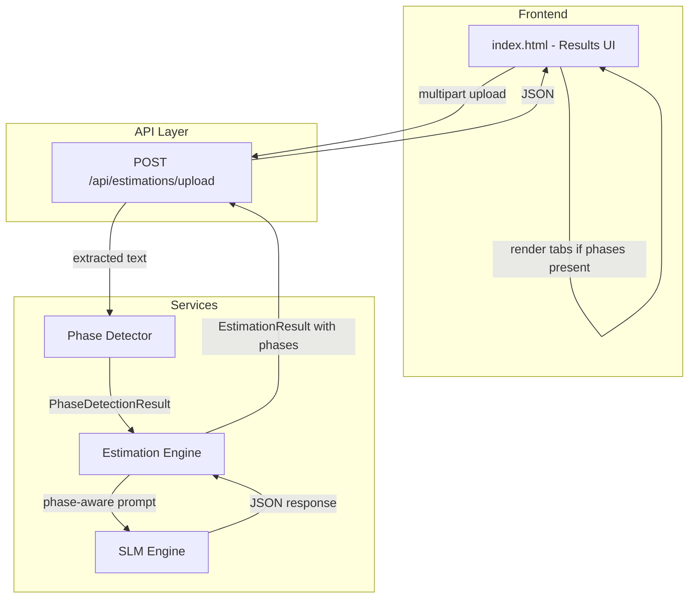
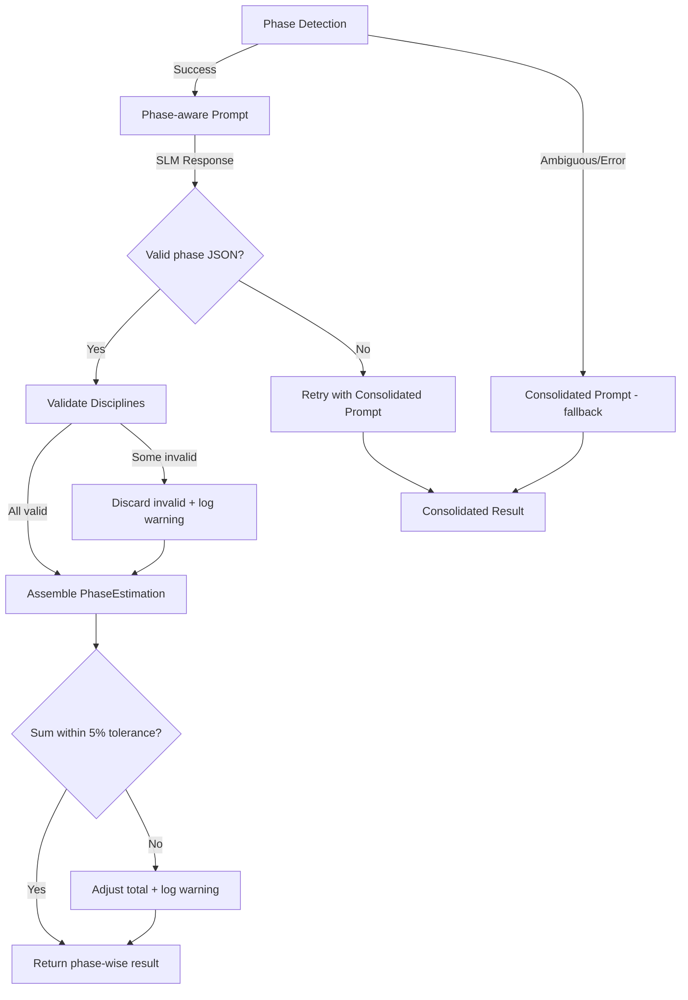

# Design Document: Phase-wise Estimation

## Overview

This feature extends the Project Estimation Tool to automatically detect phased delivery plans within uploaded documents and produce per-phase effort breakdowns. The system currently generates a single consolidated estimation; this design introduces a **Phase Detector** module, modified SLM prompting, an extended response schema, and a tabbed frontend view — all while maintaining backward compatibility for non-phased documents.

Additionally, discipline names are constrained to a fixed enumeration to ensure consistency across estimations.

### Key Design Decisions

| Decision | Rationale |
|----------|-----------|
| Phase detection as a separate utility module (`app/services/phase_detector.py`) | Separation of concerns; testable in isolation without SLM dependency |
| Regex + heuristic approach for detection (no SLM call) | Fast, deterministic, and cost-free — SLM is only invoked for estimation |
| `phases` field is `Optional[list]` on `EstimationResult` | Backward compatible — existing consumers see `null`/absent field |
| Fixed `Discipline` enum in schemas | Single source of truth; validates both prompt instructions and parsed output |
| Tabs in frontend (not accordion) | Consistent with existing card-based layout; better for comparing phases |

## Architecture



### Data Flow

1. User uploads BRD/PRD documents via the existing form.
2. Router extracts text content (unchanged).
3. **New**: `detect_phases(text)` is called on the PRD/BRD text content.
4. If phases are detected, `_build_estimation_prompt` receives phase context and constructs a per-phase prompt.
5. If no phases detected, existing single-prompt path is used (backward compatible).
6. SLM response is parsed; per-phase effort breakdown is validated against the `Discipline` enum.
7. `EstimationResult` is returned with the optional `phases` array populated (or `null`).
8. Frontend checks for `phases` — if present, renders tabbed view; otherwise, renders existing consolidated view.

## Components and Interfaces

### 1. Phase Detector Module

**File**: `app/services/phase_detector.py`

```python
from dataclasses import dataclass
from typing import Optional


@dataclass
class PhaseInfo:
    """A detected phase with its name and assigned use cases."""
    name: str
    use_cases: list[str]  # Raw text snippets or use case IDs


@dataclass
class PhaseDetectionResult:
    """Result of phase detection on document text."""
    phases: list[PhaseInfo]
    detection_method: Optional[str]  # e.g., "heading", "table", "inline"
    warning: Optional[str]  # Set if ambiguous references found


def detect_phases(text: str) -> PhaseDetectionResult:
    """Scan document text for phase indicators and extract phase structure.

    Detection strategies (in priority order):
    1. Numbered headings: "## Phase 1: ...", "### Release 2 - ..."
    2. Tabular assignments: rows with Phase/Release column
    3. Inline annotations: "UC#1 [Phase 1]", "[Sprint 1-3]"
    4. Milestone groupings: "Milestone 1 - MVP"

    Returns PhaseDetectionResult with empty phases list if no phases found.
    Returns single-phase documents as non-phased (empty list + no warning).
    """
    ...


def _detect_heading_phases(text: str) -> list[PhaseInfo]:
    """Detect phases from numbered headings (## Phase N, ### Release N)."""
    ...


def _detect_table_phases(text: str) -> list[PhaseInfo]:
    """Detect phases from tabular use case assignments."""
    ...


def _detect_inline_phases(text: str) -> list[PhaseInfo]:
    """Detect phases from inline annotations like [Phase 1]."""
    ...


def _detect_milestone_phases(text: str) -> list[PhaseInfo]:
    """Detect phases from milestone-based groupings."""
    ...
```

### 2. Discipline Enum & Validation

**File**: `app/models/schemas.py` (additions)

```python
from enum import Enum


class Discipline(str, Enum):
    """Fixed set of allowed discipline names."""
    DIGITAL_ENGINEERING = "Digital Engineering"
    DATA_ENGINEERING = "Data Engineering"
    DATA_SCIENCE = "Data Science"
    DEVOPS = "DevOps"
    QA_TESTING = "QA/Testing"
    TECH_COE = "Tech COE"
    PRODUCT_DESIGN = "Product/Design"
```

**Discipline mapping utility** (in `app/services/phase_detector.py` or a shared utils):

```python
DISCIPLINE_ALIASES: dict[str, Discipline] = {
    "backend": Discipline.DIGITAL_ENGINEERING,
    "frontend": Discipline.DIGITAL_ENGINEERING,
    "fullstack": Discipline.DIGITAL_ENGINEERING,
    "software engineering": Discipline.DIGITAL_ENGINEERING,
    "ml": Discipline.DATA_SCIENCE,
    "machine learning": Discipline.DATA_SCIENCE,
    "analytics": Discipline.DATA_SCIENCE,
    "data pipeline": Discipline.DATA_ENGINEERING,
    "etl": Discipline.DATA_ENGINEERING,
    "bi": Discipline.DATA_ENGINEERING,
    "ci/cd": Discipline.DEVOPS,
    "infrastructure": Discipline.DEVOPS,
    "testing": Discipline.QA_TESTING,
    "qa": Discipline.QA_TESTING,
    "quality assurance": Discipline.QA_TESTING,
    "cloud": Discipline.TECH_COE,
    "architecture": Discipline.TECH_COE,
    "security": Discipline.TECH_COE,
    "design": Discipline.PRODUCT_DESIGN,
    "ux": Discipline.PRODUCT_DESIGN,
    "product": Discipline.PRODUCT_DESIGN,
    "product management": Discipline.PRODUCT_DESIGN,
}


def normalize_discipline(raw_name: str) -> Optional[Discipline]:
    """Map a raw discipline string to the fixed enum.

    1. Exact match (case-insensitive) against enum values.
    2. Alias lookup from DISCIPLINE_ALIASES.
    3. Substring match against alias keys.
    4. Returns None if no match found (caller logs warning and discards).
    """
    ...
```

### 3. Estimation Engine Modifications

**File**: `app/services/estimation_engine.py` (modifications)

Key changes to the existing estimation engine:

```python
# New import
from app.services.phase_detector import detect_phases, PhaseDetectionResult

# Modified generate_estimation function signature (same, but internal flow changes)
async def generate_estimation(
    request: EstimationRequest,
    input_tier: InputTier,
    slm_engine: SLMEngine,
    sharepoint_client: SharePointClient,
) -> EstimationResult:
    """Extended to detect phases and produce per-phase breakdowns."""
    ...
    # NEW: Phase detection step (between validation and prompt construction)
    phase_result = detect_phases(request.documents.prd.textContent)
    if not phase_result.phases and request.documents.brd:
        phase_result = detect_phases(request.documents.brd.textContent)

    # Route to phase-aware or consolidated prompt
    if phase_result.phases:
        prompt = _build_phase_estimation_prompt(request, input_tier, config, phase_result)
    else:
        prompt = _build_estimation_prompt(request, input_tier, config)
    ...


def _build_phase_estimation_prompt(
    request: EstimationRequest,
    input_tier: InputTier,
    config: dict[str, str],
    phase_result: PhaseDetectionResult,
) -> str:
    """Construct SLM prompt for per-phase effort estimation.

    Includes phase names, use case assignments, and instructions for
    the SLM to produce a separate effortBreakdown per phase.
    """
    ...


def _parse_phase_estimation_response(content: str) -> Optional[dict]:
    """Parse SLM response for phase-wise estimation.

    Expected structure:
    {
        "phases": [
            {
                "phaseName": "Phase 1: Identity & Rides",
                "effortBreakdown": [...],
                "assumptions": [...]
            },
            ...
        ],
        "documentDetailScore": 70,
        "requirementClarityScore": 80
    }
    """
    ...


def _validate_disciplines(effort_breakdown: list[dict]) -> list[DisciplineEffort]:
    """Validate and normalize discipline names in parsed SLM output.

    - Maps recognized names to the Discipline enum.
    - Discards entries with unmappable discipline names (logs warning).
    - Merges duplicate disciplines (sums person-days).
    """
    ...
```

### 4. Phase-wise Response Schema

**File**: `app/models/schemas.py` (additions)

```python
class PhaseEstimation(BaseModel):
    """Per-phase effort estimation breakdown."""
    phaseName: str = Field(..., min_length=1, description="Phase name as detected from document")
    effortBreakdown: list[DisciplineEffort]
    totalPersonDays: float = Field(..., gt=0)
    totalPersonMonths: float = Field(..., gt=0)
    teamComposition: list[TeamMember] = Field(default_factory=list)
    calendarDuration: Optional[float] = Field(None, gt=0, description="Calendar months for this phase")
    costProjection: Optional[CostProjection] = None
    assumptions: list[str] = Field(default_factory=list)


# Modified EstimationResult — add optional phases field
class EstimationResult(BaseModel):
    """Complete estimation output (extended with phase support)."""
    # ... all existing fields unchanged ...
    phases: Optional[list[PhaseEstimation]] = Field(
        default=None,
        description="Per-phase estimation breakdown. Null if document is not phased."
    )
```

### 5. Frontend Tabbed Display

**File**: `static/index.html` (additions to results rendering)

```javascript
function renderPhaseResults(result) {
    // If no phases, delegate to existing renderConsolidatedResults
    if (!result.phases || result.phases.length === 0) {
        renderConsolidatedResults(result);
        return;
    }

    // Build tab bar: "Consolidated" + one tab per phase
    const tabBar = buildTabBar(['Consolidated', ...result.phases.map(p => p.phaseName)]);
    
    // Build tab content panels
    const consolidatedPanel = buildEffortPanel(result);  // existing view
    const phasePanels = result.phases.map(phase => buildPhasePanel(phase));

    // Render with "Consolidated" tab active by default
    showTab('Consolidated');
}

function buildPhasePanel(phase) {
    // Renders: effort breakdown table, totals, team composition,
    // calendar duration, cost projection for a single phase
}

function buildTabBar(tabNames) {
    // Renders horizontal tab buttons with click handlers
}
```

## Data Models

### PhaseInfo (Internal)

| Field | Type | Description |
|-------|------|-------------|
| `name` | `str` | Phase name as extracted from document |
| `use_cases` | `list[str]` | Use case IDs or text snippets assigned to this phase |

### PhaseDetectionResult (Internal)

| Field | Type | Description |
|-------|------|-------------|
| `phases` | `list[PhaseInfo]` | Detected phases (empty if non-phased) |
| `detection_method` | `Optional[str]` | Method used: "heading", "table", "inline", "milestone" |
| `warning` | `Optional[str]` | Warning if ambiguous references found |

### Discipline Enum (Public Schema)

| Value | Description |
|-------|-------------|
| `Digital Engineering` | Backend, frontend, mobile, middleware, APIs |
| `Data Engineering` | Data pipelines, BI, ETL, data warehouse |
| `Data Science` | ML models, analytics algorithms |
| `DevOps` | CI/CD, build/deploy automation, monitoring |
| `QA/Testing` | Test automation, quality assurance |
| `Tech COE` | Cloud infra, architecture, security, platform |
| `Product/Design` | UX/UI design, product management |

### PhaseEstimation (Public Response)

| Field | Type | Required | Description |
|-------|------|----------|-------------|
| `phaseName` | `str` | Yes | Phase name |
| `effortBreakdown` | `list[DisciplineEffort]` | Yes | Per-discipline effort for this phase |
| `totalPersonDays` | `float` | Yes | Sum of person-days in this phase |
| `totalPersonMonths` | `float` | Yes | Sum of person-months in this phase |
| `teamComposition` | `list[TeamMember]` | No | Recommended team for this phase |
| `calendarDuration` | `float` | No | Calendar months for this phase |
| `costProjection` | `CostProjection` | No | Cost for this phase |
| `assumptions` | `list[str]` | No | Phase-specific assumptions |

### EstimationResult (Modified — additions only)

| Field | Type | Required | Description |
|-------|------|----------|-------------|
| `phases` | `Optional[list[PhaseEstimation]]` | No | Per-phase breakdown; `null` if not phased |

All existing fields remain unchanged. The `phases` field is additive and optional.


## Correctness Properties

*A property is a characteristic or behavior that should hold true across all valid executions of a system — essentially, a formal statement about what the system should do. Properties serve as the bridge between human-readable specifications and machine-verifiable correctness guarantees.*

### Property 1: Phase detection extracts correct structure

*For any* document text containing phase indicators (headings, tables, inline annotations, or milestones) with known phase-to-use-case mappings, `detect_phases` SHALL return a `PhaseDetectionResult` where each phase name and its assigned use cases match the embedded structure.

**Validates: Requirements 1.1, 1.2**

### Property 2: Non-phased documents produce empty phase list

*For any* document text that does not contain phase-related keywords or structures (no "Phase", "Release", "Sprint", "Milestone" patterns), `detect_phases` SHALL return a `PhaseDetectionResult` with an empty phases list.

**Validates: Requirements 1.3**

### Property 3: Phase-aware prompt contains all phase context

*For any* `PhaseDetectionResult` with N phases (N ≥ 2), the prompt produced by `_build_phase_estimation_prompt` SHALL contain every phase name and every use case string from the input phases, plus instructions for per-phase timeline and team composition.

**Validates: Requirements 2.1, 2.3, 2.4**

### Property 4: Discipline normalization correctness

*For any* string input to `normalize_discipline`, the result SHALL be either a valid `Discipline` enum member or `None`. Furthermore, for any string that exactly matches a `Discipline` enum value (case-insensitive), the function SHALL return that enum member (identity property).

**Validates: Requirements 3.1, 3.2**

### Property 5: Discipline validation filters invalid entries

*For any* list of effort breakdown dictionaries containing a mix of valid and invalid discipline names, `_validate_disciplines` SHALL return only `DisciplineEffort` entries whose discipline field is a valid `Discipline` enum value, and SHALL discard all entries with unmappable names.

**Validates: Requirements 3.4**

### Property 6: Phase effort sums to total (consistency invariant)

*For any* valid `EstimationResult` containing a non-empty `phases` array, the sum of `phase.totalPersonDays` across all phases SHALL equal `result.totalEffortPersonDays` within a 5% tolerance.

**Validates: Requirements 4.3**

### Property 7: Per-discipline round-trip consistency

*For any* valid `EstimationResult` containing a non-empty `phases` array, summing `personDays` for each discipline across all phases SHALL produce values consistent with the top-level `effortBreakdown` per-discipline totals (within 5% tolerance per discipline).

**Validates: Requirements 4.4**

### Property 8: Multi-format phase detection

*For any* document text containing phase indicators in any supported format (numbered headings, tabular assignments, milestone groupings, or sprint groupings), `detect_phases` SHALL return a non-empty phases list with at least as many phases as are present in the source text.

**Validates: Requirements 7.1, 7.2, 7.3, 7.4**

### Property 9: Single phase treated as non-phased

*For any* document text where all use cases are assigned to exactly one phase, `detect_phases` SHALL return an empty phases list (treating the document as non-phased to avoid a redundant single-phase breakdown).

**Validates: Requirements 7.5**

### Property 10: Non-phased backward compatibility

*For any* non-phased document processed through the estimation pipeline, the resulting `EstimationResult` SHALL have `phases` set to `None` and all existing fields (effortBreakdown, totalEffortPersonDays, costProjection, etc.) SHALL remain present and valid.

**Validates: Requirements 6.1**

## Error Handling

| Error Scenario | Handling Strategy | User Impact |
|---|---|---|
| Phase detection encounters malformed text | Fall back to non-phased; log warning | User gets consolidated estimation (graceful degradation) |
| SLM returns invalid phase-wise JSON structure | Retry with consolidated prompt (fallback) | User gets consolidated estimation with note |
| SLM returns unknown discipline names | `normalize_discipline` maps or discards; logged | Minor effort may be lost if completely unmappable |
| Phase effort sum doesn't match total (>5% drift) | Log warning; adjust top-level total to match sum | User sees consistent numbers |
| SLM returns empty effort for a phase | Discard that phase from results; log warning | Phase omitted from output |
| Document contains conflicting phase structures | Fall back to non-phased with warning in response | User sees consolidated view + warning |

### Error Recovery Flow



## Testing Strategy

### Property-Based Tests (using `hypothesis`)

The project already includes `hypothesis>=6.92.0` in its test dependencies. Property-based tests will use Hypothesis strategies to generate:

- Random document text with embedded phase indicators (various formats)
- Random strings for discipline normalization testing
- Random effort breakdowns with valid/invalid discipline names
- Random `PhaseEstimation` objects for consistency invariant testing

**Configuration:**
- Minimum 100 examples per property test (`@settings(max_examples=100)`)
- Each test tagged with: `# Feature: phase-wise-estimation, Property N: <title>`

**Test file:** `tests/test_phase_detector.py` (new) and `tests/test_estimation_engine.py` (extended)

### Unit Tests (example-based)

| Test | File | Validates |
|------|------|-----------|
| Heading format detection (specific examples) | `test_phase_detector.py` | Req 7.1 |
| Table format detection (specific examples) | `test_phase_detector.py` | Req 7.2 |
| Milestone format detection | `test_phase_detector.py` | Req 7.3 |
| Sprint format detection | `test_phase_detector.py` | Req 7.4 |
| Ambiguous references fallback | `test_phase_detector.py` | Req 1.5 |
| Consolidated prompt unchanged when no phases | `test_estimation_engine.py` | Req 2.2 |
| Prompt includes all 7 discipline names | `test_estimation_engine.py` | Req 3.3 |
| Non-phased result has null phases field | `test_estimation_engine.py` | Req 4.2 |
| Tabbed UI renders when phases present | Frontend test | Req 5.1-5.5 |
| Existing UI unchanged without phases | Frontend test | Req 6.2 |
| No new mandatory API fields | `test_estimation_engine.py` | Req 6.3 |

### Integration Tests

| Test | Validates |
|------|-----------|
| Full pipeline with phased PRD document produces phases in result | End-to-end Req 1-4 |
| Full pipeline with non-phased PRD produces null phases | End-to-end Req 6 |
| API endpoint accepts existing request format without changes | Req 6.3 |

### Test Organization

```
tests/
├── test_phase_detector.py          # Unit + property tests for phase detection
├── test_discipline_validation.py   # Property tests for discipline normalization
├── test_estimation_engine.py       # Extended with phase-wise pipeline tests
└── test_phase_frontend.py          # UI rendering tests (if applicable)
```
