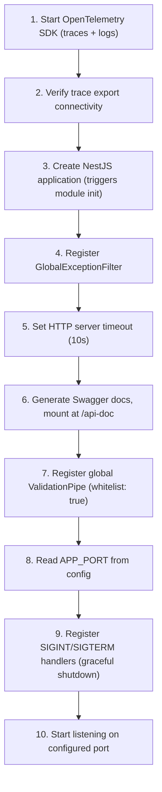
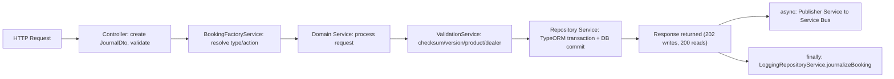

# Booking CRUD Services — High-Level Code Document

---

## 1. Application Overview

Booking CRUD Services is a backend microservice for TVS Motor Company's vehicle booking platform (Booking 2.0). It manages the complete lifecycle of vehicle bookings — from creation through payment, vehicle allocation, invoicing, and delivery, including cancellation and refund workflows.

| Attribute | Value |
|-----------|-------|
| **Service Name** | booking-crud-services |
| **Framework** | NestJS 11 (TypeScript) |
| **Runtime** | Node.js 26.x |
| **Database** | Azure SQL (MSSQL) via TypeORM |
| **Messaging** | Azure Service Bus (topics with sessions) |
| **Deployment** | Docker (Alpine) on Azure, CI/CD via Azure DevOps |
| **Observability** | OpenTelemetry (OTLP HTTP — traces + logs) |
| **API Docs** | Swagger at `/api-doc` |

**Core Responsibilities:**
- Create bookings (online, offline, pre-booking)
- Modify bookings (payment, vehicle allocation, dealer change, invoice, gate pass, HSRP, retail finance, BTO status)
- Cancel bookings with transactional refund orchestration
- Retrieve/search bookings (customer, dealer, CRM, BTO, count)
- Process refund webhooks from payment gateways (CPG, JusPay)
- Sync with DMS (Dealer Management System), ATP (Available-to-Promise), and MDP (Master Data Platform) via Service Bus

---

## 2. Module Summary

| Module | File | Responsibility |
|--------|------|----------------|
| **AppModule** | `src/app.module.ts` | Root module — wires ConfigModule (global), TypeORM (MSSQL with Azure AD auth), and feature modules |
| **BookingsModule** | `src/bookings/bookings.module.ts` | Core business logic — 1 controller, 60+ services, all booking entities registered |
| **CloudConductorModule** | `src/cloud-conductor/cloud-conductor.module.ts` | Azure infrastructure — Key Vault, Service Bus publisher, 4 topic listeners, model transformer |
| **LoggingModule** | `src/logger/logging.module.ts` | Winston-based logging with daily file rotation |

### BookingsModule Breakdown

| Sub-area | Services |
|----------|----------|
| **Creation** | `OnlineBookingService`, `OfflineBookingService`, `PreBookingService`, `BookingNumberGenerationService` |
| **Modification** | `PaymentService`, `VehicleAllocationService`, `VehicleDeallocationService`, `DealerChangeService`, `InvoiceUpdateService`, `InvoiceCancellationService`, `GatepassService`, `HsrpService`, `RetailFinanceService`, `CustomerInfoUpdateService`, `VehicleUpdateService`, `BTOStatusUpdateService`, `DealerAssignService`, `WholeBookingUpdateService`, `BTOFrameNumberAdditionService`, `Noise` |
| **Cancellation** | `BookingCancellationWorkflowService`, `BookingCancellationService` |
| **Retrieval** | `CustomerBookingRetrievalService`, `DealerRetrievalService`, `CRMBookingRetrievalService`, `BtoBookingRetrievalService`, `BookingCountRetrievalService` |
| **Refund** | `BookingRefundService`, `BookingFnFRefundService`, `CpgRefundService`, `JusPayRefundService`, `CcavenueRefundService`, `BookingRefundStatusUpdateService`, `CCAvenueRefundStatusUpdateService` |
| **Repositories** | `BookingRepositoryService`, `PaymentRepositoryService`, `VehicleRepositoryService`, `CancellationRepositoryService`, `RefundRepositoryService`, `MDPRepositoryService`, `LoggingRepositoryService` |
| **Publishers** | `BookingCreationPublisherService`, `BookingModificationPublisherService`, `BookingCancellationPublisherService`, `BookingRefundPublisherService`, `BookingRefundStatusUpdatePublisherService`, `ATPHandlerPublisherService`, `DMSIntegrationPublisherService`, `BTOStatusUpdatePublisher` |
| **Validation** | `ValidationService` (checksum, version, product/dealer existence) |
| **External Calls** | `CPGService` (payment gateway), `JusPayService` (payment gateway), `LeadService` (CRM lead update), `DealerMasterService` (MDP sync) |

### CloudConductorModule Breakdown

| Service | Role |
|---------|------|
| `SecretService` | Azure Key Vault secret retrieval |
| `TopicPublisherService` | Publishes messages to Service Bus topic with OTel trace propagation |
| `TopicModelTransformerService` | Transforms domain DTOs → Service Bus message payloads |
| `TopicListenerService` | Listens for `BOOKING_CANCELLED`, `BOOKING_REFUND_CCAVENUE_STATUS` |
| `DMSTopicListenerService` | Listens for `DMS_BOOKING_CREATED` from DMS topic |
| `ATPTopicListenerService` | Listens for ATP vehicle ETA and comms events |
| `MDPDealerTopicListenerService` | Listens for dealer CRUD events (30 concurrent sessions) |

---

## 3. Dependency Overview

### Runtime

| Package | Purpose |
|---------|---------|
| `@nestjs/core`, `@nestjs/common`, `@nestjs/config` | NestJS framework + config |
| `@nestjs/typeorm`, `typeorm`, `mssql`, `tedious` | ORM + SQL Server driver |
| `@azure/service-bus` | Azure Service Bus messaging |
| `@azure/keyvault-secrets`, `@azure/identity` | Secret management (Azure AD auth) |
| `@nestjs/swagger` | Auto-generated API documentation |
| `class-validator`, `class-transformer` | Request DTO validation (whitelist mode) |
| `winston`, `winston-daily-rotate-file` | Structured logging |
| `@opentelemetry/*` | Distributed tracing + log export (OTLP HTTP) |
| `axios` | HTTP client for CPG, JusPay, Lead System APIs |
| `ioredis` | Redis caching |
| `decimal.js` | Precision arithmetic for financial calculations |
| `fast-xml-parser` | XML parsing for payment gateway responses |

### Dev

| Package | Purpose |
|---------|---------|
| `jest`, `ts-jest`, `supertest` | Unit + e2e testing |
| `eslint`, `prettier` | Linting + formatting |
| `typescript` | Language (target ES2022) |
| `@nestjs/cli` | Build tooling |

### Build Commands

| Command | Action |
|---------|--------|
| `yarn build` | Compile + copy package.json + install prod deps in dist/ |
| `yarn test` | Run unit tests |
| `yarn test:cov` | Tests with coverage |
| `yarn lint` | ESLint with auto-fix |
| `yarn start:dev` | Dev server with hot-reload |

---

## 4. Runtime Flow

### Bootstrap Sequence (`main.ts`)

### Module Initialization (automatic on app creation)

- `CloudConductorModule` initializes first (global module):
  - `SecretService` connects to Azure Key Vault
  - `TopicPublisherService` initializes Service Bus sender
  - All 4 listeners start consuming from their respective topics
- `BookingsModule` initializes:
  - TypeORM registers all 20+ entities
  - All 60+ service providers are instantiated via DI

### Request Processing Pattern

### Concurrency Control

Every booking carries **UUID** + **checksum** + **version**:
1. Client sends current `checkSum` and `version` with modification requests
2. Service validates they match stored values (rejects with 400 if mismatch)
3. New checksum = SHA-256(previous checksum), version incremented
4. New values returned in response for next operation

---

## 5. Key Services

### Orchestration

| Service | Pattern | What It Does |
|---------|---------|--------------|
| `BookingFactoryService` | Factory/Strategy | Maps enum types (`BOOKING_CREATE_TYPE`, `BOOKING_UPDATE_TYPE`, `BOOKING_RETRIEVAL_TYPE`) to concrete service implementations |
| `BookingCancellationWorkflowService` | Orchestrator | Transaction: validate → cancel → refund → publish → commit (rollback on failure) |
| `TopicModelTransformerService` | Transformer | Converts domain state + request data into Service Bus message payloads with correct event types and targets |

### Business Logic

| Service | Trigger | Core Logic |
|---------|---------|------------|
| `OnlineBookingService` | `POST /bookings` (online) | Validate product/dealer → save booking + vehicle + location + products (upsert by leadId) |
| `OfflineBookingService` | `POST /bookings` (offline) | Same + generate booking number + save payment |
| `PaymentService` | `PUT /bookings` (payment update) | Save payment record → update booking status (Initiated→Open on partial, Open→Invoiced on full) |
| `DealerChangeService` | `PUT /bookings` (dealer change) | Generate new UUID → create new booking entry → cancel old via lead system |
| `BTOStatusUpdateService` | `POST /bookings/bto_status` | Update BTO status + date columns based on lifecycle stage |
| `BookingCancellationService` | Via workflow | Update status to Cancelled → save cancellation record → initiate refund |
| `BookingFnFRefundService` | `POST /bookings/fnfrefund` | Call CPG or JusPay API for FnF refund → save refund transaction |
| `ATPHandlerService` | ATP Topic events | Update vehicle ETA in DB → publish ATP_BOOKING_CREATED/ATP_FULL_PAYMENT to Comms |
| `DMSIntegrationService` | DMS Topic events | Save DMS booking number → publish DMS_BOOKING_NO_UPDATED to LS/EMS/Comms |
| `DealerMasterService` | MDP Topic events | Upsert dealer + contacts + locations + flags → LLP migration (update bookings + republish) |

### Infrastructure

| Service | What It Does |
|---------|--------------|
| `TopicPublisherService` | Sends messages to Service Bus with OTel trace context injection, logs every publish |
| `SecretService` | Reads secrets from Azure Key Vault (DB config, Service Bus endpoints, API keys) |
| `CPGService` | Handles CPG payment gateway: AES encryption/decryption, token generation, refund API calls |
| `JusPayService` | Handles JusPay: OAuth2 token (cached with TTL), FnF/auto refund calls with retry |
| `LeadService` | Updates CRM lead status via Azure APIM (OAuth2 + subscription key) |
| `ValidationService` | Validates checksum/version match, checks booking existence, validates product partId/modelId and dealer code against MDP data |
| `ExceptionHandlerService` | Translates domain errors to NestJS HTTP exceptions |
| `LoggingRepositoryService` | Persists journal entries, topic logs, DMS logs, ATP logs, MDP logs, request logs |

---

## 6. Integration Summary

### Inbound Sources

| Source | Entry Point | Events/Actions |
|--------|-------------|----------------|
| EV Website | `POST /bookings` (online) | Create online booking |
| ICE Website | `POST /bookings` (online) | Create online booking |
| EMS (Dealer App) | `POST /bookings` (offline), `PUT /bookings` | Create offline booking, modify bookings |
| DMS | `POST /bookings` (offline), `PUT /bookings` | Create booking, modify (invoice, gatepass, vehicle allocation) |
| SAP | `POST /bookings/bto_status` | BTO lifecycle updates (manufactured → packed → dispatched → at dealership) |
| CRM | `PUT /bookings` (updateSource: CRM) | Booking modifications |
| Marketplace (Amazon/Flipkart) | `POST /bookings` (offline) | Marketplace-initiated bookings |
| CPG Webhook | `POST /bookings/refundstatus` | CPG refund status callback (encrypted) |
| JusPay Webhook | `POST /bookings/juspayrefundstatus` | JusPay refund status callback |
| DMS Topic (Service Bus) | `DMSTopicListenerService` | `DMS_BOOKING_CREATED` → link DMS booking number |
| ATP Topic (Service Bus) | `ATPTopicListenerService` | `VEHICLE_ETA`, `COMMS` triggers |
| MDP Topic (Service Bus) | `MDPDealerTopicListenerService` | `DEALER_CREATED`, `DEALER_UPDATED`, `ONE_TIME_MIGRATION` |
| Booking Topic - Self (Service Bus) | `TopicListenerService` | `BOOKING_CANCELLED` (auto-refund), `BOOKING_REFUND_CCAVENUE_STATUS` |

### Outbound Targets

| Target | Method | Events Published |
|--------|--------|-----------------|
| Lead System (LS) | Service Bus topic | BOOKING_CREATED, FULL_PAYMENT_UPDATED, BOOKING_CANCELLED, DEALER_UPDATED, VEHICLE_ALLOCATION, INVOICE_UPDATE, etc. |
| EMS | Service Bus topic | BOOKING_INITIATED, BOOKING_CREATED, BOOKING_CANCELLED, all modification events |
| DMS | Service Bus topic | BOOKING_CREATED, FULL_PAYMENT_UPDATED, BOOKING_CANCELLED, VEHICLE_ALLOCATION, INVOICE_UPDATE, DMS_BOOKING_UPDATE, BTO status events |
| Comms | Service Bus topic (some with 7-day scheduled delivery) | BOOKING_CREATED, DMS_BOOKING_NO_UPDATED, BTO status events, ATP events, DEALER_UPDATED |
| ATP | Service Bus topic | BOOKING_CREATED (when ATP configured), DEALER_UPDATED |
| Marketplace Service (RS) | Service Bus topic | HSRP_INITIATED, BOOKING_CREATED (for EMS-sourced bookings) |
| BS (self) | Service Bus topic | BOOKING_CANCELLED (triggers auto-refund), BOOKING_REFUND_CCAVENUE_STATUS (scheduled CCAvenue check) |
| CPG Gateway | HTTP (Axios) | Token generation + FnF/Auto refund API (AES encrypted payloads) |
| JusPay Gateway | HTTP (Axios) | Token generation (OAuth2) + FnF/Auto refund API (with retry) |
| Lead System API | HTTP (Axios via APIM) | Update lead status to "enquiry_converted" (OAuth2 + APIM subscription key) |

### Event Types Published (Complete List)

| Event | When | Targets |
|-------|------|---------|
| `BOOKING_INITIATED` | Online booking created | EMS |
| `BOOKING_CREATED` | Offline booking or partial payment confirmed | LS, DMS, EMS, Comms/ATP |
| `FULL_PAYMENT_UPDATED` | Full payment received | LS, DMS, EMS |
| `FAILED_PAYMENT_UPDATE` | Payment failed | LS (+DMS conditionally) |
| `BOOKING_CANCELLED` | Booking cancelled | DMS, EMS, LS, Comms, BS |
| `DEALER_UPDATED` | Dealer changed | DMS, EMS, LS, Comms, ATP |
| `VEHICLE_UPDATED` | Vehicle details modified | DMS, EMS, LS, Comms |
| `CUSTOMER_INFO_UPDATED` | Customer info modified | DMS, EMS, LS |
| `VEHICLE_ALLOCATION` | Frame/engine allocated | LS, EMS, DMS |
| `VEHICLE_DEALLOCATION` | Vehicle deallocated | LS, EMS, DMS |
| `GATEPASS_UPDATE` | Gate pass issued | DMS, EMS, LS |
| `HSRP_INITIATED` | HSRP process started | Marketplace Service |
| `INVOICE_UPDATE` (INVOICED) | Invoice attached | EMS, LS, DMS |
| `INVOICE_CANCEL` | Invoice cancelled | EMS, LS, DMS |
| `RETAIL_FINANCE_UPDATE` | Finance details updated | DMS, EMS |
| `DMS_BOOKING_UPDATE` | DMS-triggered update | DMS, EMS, LS |
| `DMS_BOOKING_NO_UPDATED` | DMS booking number linked | LS, EMS, Comms (+ATP) |
| `ORDER_MANUFACTURED/PACKED/DISPATCHED/AT_DEALERSHIP` | BTO lifecycle | Comms, DMS |
| `ATP_BOOKING_CREATED` | ATP confirmation (initial ETA) | Comms |
| `ATP_FULL_PAYMENT_UPDATED` | ATP full payment flag set | Comms |
| `BOOKING_REFUND_INITIATED/SUCCESS/FAILURE` | Refund lifecycle | EMS, DMS, Comms, LS |
| `FNF_BOOKING_REFUND_*` | FnF refund lifecycle | EMS, DMS, Comms, LS |
| `BOOKING_REFUND_CCAVENUE_STATUS` | Scheduled CCAvenue check | BS (self) |

---

*This document is for architectural reference and vendor onboarding. It does not contain credentials, secrets, or proprietary business logic details.*
