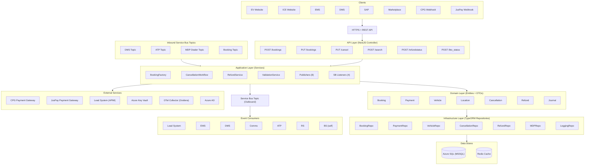
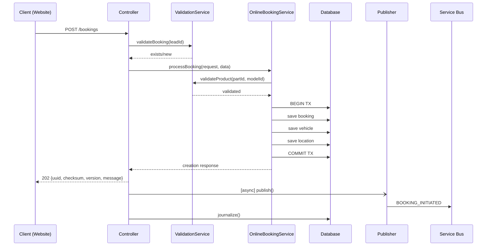
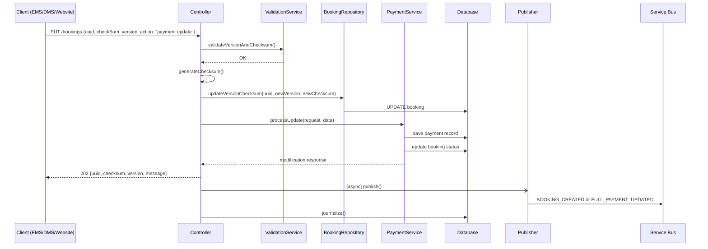
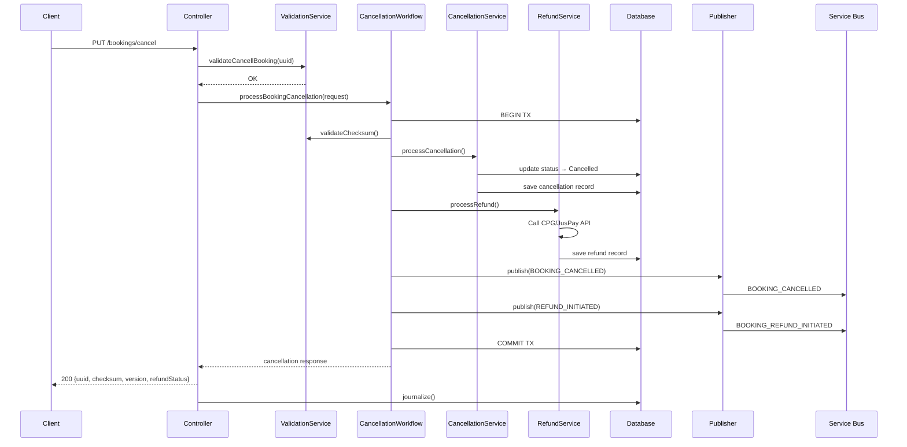
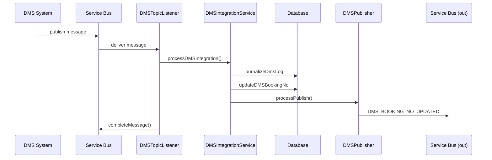
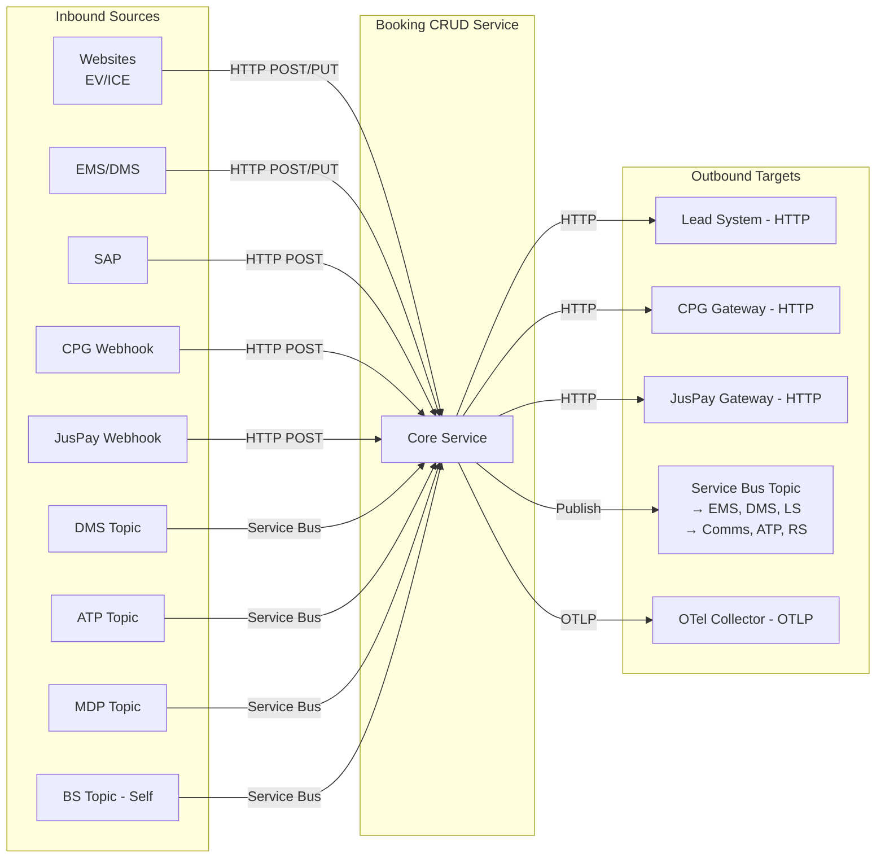
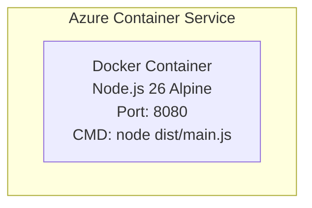

# High Level Design — Booking CRUD Services

---

## Overview

Booking CRUD Services is the core backend microservice responsible for managing the complete lifecycle of vehicle bookings on the TVS Motor D2C platform (Booking 2.0). It provides a unified API for booking creation, modification, cancellation, retrieval, and refund processing — serving multiple client systems including the EV/ICE websites, EMS (dealer app), DMS (dealer management system), SAP, CRM, and marketplace integrations.

The service acts as the **single source of truth** for booking state and orchestrates asynchronous communication with downstream systems via Azure Service Bus topics.

---

## Tier Classification

**Tier 1: Mission Critical Application**

This service directly impacts revenue and customer experience. Any downtime blocks new bookings, payment processing, and dealer operations across all channels.

---

## Background

This service was built as part of the Booking 2.0 initiative to replace the previous booking system with a scalable, event-driven architecture. Key drivers:

- Support multiple booking sources (website, EMS, DMS, marketplace) through a single API
- Enable asynchronous integration with downstream systems (CRM, DMS, ATP, Comms) via event-driven messaging
- Provide optimistic concurrency control for high-volume concurrent booking modifications
- Support BTO (Build-to-Order) vehicle lifecycle tracking through SAP integration
- Enable multi-gateway refund processing (CPG, JusPay, CCAvenue)

---

## Requirements

### Functional

- Create bookings from multiple sources (online, offline, pre-booking, marketplace)
- Process partial and full payments with multiple payment gateways
- Support vehicle allocation/deallocation with frame and engine numbers
- Enable dealer changes (transfer booking between dealers with new UUID)
- Handle BTO lifecycle tracking (Order Received → Confirmed → Manufactured → Packed → Dispatched → At Dealership)
- Process booking cancellation with automatic and FnF refunds
- Provide booking search/retrieval for customers, dealers, CRM, and BTO contexts
- Sync booking numbers from DMS
- Update vehicle ETA from ATP system
- Maintain dealer master data from MDP

### Non-Functional

- HTTP response time < 10 seconds (server timeout configured)
- Eventual consistency via async event publishing (non-blocking responses)
- Optimistic concurrency control (UUID + checksum + version)
- Transactional integrity for cancellation + refund workflows
- Graceful shutdown on SIGINT/SIGTERM
- Distributed tracing across Service Bus messages (W3C TraceContext)
- Journaling of all operations for auditability
- High-throughput dealer master ingestion (30 concurrent Service Bus sessions)

---

## System Architecture (HLD)

---

### Key Components

| Component | Technology | Role |
|-----------|-----------|------|
| **API Layer** | NestJS Controller + ValidationPipe + Swagger | HTTP entry point, request validation, response formatting |
| **Factory/Router** | BookingFactoryService | Routes requests to correct service based on type/action enum |
| **Domain Services** | 30+ NestJS Injectable services | Business logic for creation, modification, cancellation, retrieval, refund |
| **Repository Layer** | Custom services wrapping TypeORM | Data access with transactions, entity mapping |
| **Publisher Layer** | 8 publisher services | Transforms domain events → Service Bus messages |
| **Listener Layer** | 4 topic listener services | Consumes inbound events from external systems |
| **Infrastructure** | SecretService, TopicPublisherService, LoggingService | Cross-cutting concerns |

### Interactions and Boundaries

- **Synchronous boundary**: REST API → Service Layer → DB (within a single request)
- **Asynchronous boundary**: Publisher → Service Bus → Downstream consumers (non-blocking, fire-and-forget via `setImmediate`)
- **Transactional boundary**: TypeORM transactions for multi-table writes (creation, cancellation + refund)

### External Dependencies (highlighted)

- 🔴 Azure Service Bus (4 topics — booking, DMS, ATP, MDP dealer)
- 🔴 Azure SQL (MSSQL) — primary data store
- 🔴 Azure Key Vault — all secrets and configuration
- 🟡 CPG Payment Gateway — refund initiation
- 🟡 JusPay Payment Gateway — refund initiation
- 🟡 Lead System API (via Azure APIM) — CRM lead updates
- 🟢 Redis — caching (dealer/product master data)
- 🟢 OpenTelemetry Collector — observability

### Pros
- Event-driven decoupling: API responses aren't blocked by downstream processing
- Single service owns all booking state — no distributed data consistency issues
- Factory pattern makes adding new booking/modification types straightforward
- Journaling provides complete audit trail

### Cons
- Single monolithic service — all booking operations in one deployable unit
- 60+ services in one NestJS module creates a large dependency graph
- Service Bus session-based listeners are long-running and resource-intensive
- No circuit breaker for external API calls (CPG, JusPay, Lead System)

---

## Data Flow / Sequence Diagrams

### 1. Online Booking Creation

### 2. Booking Modification (Payment Update)

**Modification types follow the same pattern** — the factory resolves the correct service:

| Action | Service Resolved | Key DB Operation | Event Published |
|--------|-----------------|------------------|-----------------|
| `payment update` | `PaymentService` | Save payment, update booking status | `BOOKING_CREATED` (partial) or `FULL_PAYMENT_UPDATED` (full) |
| `vehicle allocation` | `VehicleAllocationService` | Assign frame/engine number to vehicle | `VEHICLE_ALLOCATION` |
| `vehicle deallocation` | `VehicleDeallocationService` | Remove frame/engine number | `VEHICLE_DEALLOCATION` |
| `dealer change` | `DealerChangeService` | Generate new UUID, create new booking | `DEALER_UPDATED` |
| `invoice update` | `InvoiceUpdateService` | Store invoice details, update status | `INVOICE_UPDATE` (INVOICED) |
| `invoice cancel update` | `InvoiceCancellationService` | Remove invoice, revert status | `INVOICE_CANCEL` |
| `gatepass update` | `GatepassService` | Store gate pass details | `GATEPASS_UPDATE` |
| `hsrp initiated` | `HsrpService` | Record HSRP initiation date | `HSRP_INITIATED` |
| `vehicle update` | `VehicleUpdateService` | Update vehicle model/variant/color | `VEHICLE_UPDATED` |
| `customer update` | `CustomerInfoUpdateService` | Update customer details | `CUSTOMER_INFO_UPDATED` |
| `retail finance update` | `RetailFinanceService` | Store retail finance details | `RETAIL_FINANCE_UPDATE` |
| `bto status update` | `BTOStatusUpdateService` | Update BTO date columns | `ORDER_MANUFACTURED/PACKED/DISPATCHED/AT_DEALERSHIP` |
| `dealer assign update` | `DealerAssignService` | Assign DSE to booking | (via modification publisher) |
| `booking update` | `WholeBookingUpdateService` | Bulk update booking fields | `DMS_BOOKING_UPDATE` |
| `bto frame number allocation` | `BTOFrameNumberAdditionService` | Add frame/engine to BTO vehicle | `VEHICLE_ALLOCATION` |

### 3. Booking Cancellation with Refund

### 4. Inbound DMS Event Processing

### Error Handling & Retry

- **HTTP errors**: GlobalExceptionFilter catches all unhandled exceptions → returns structured error response
- **Service Bus listener errors**: Messages are abandoned (not completed) → Service Bus redelivers with backoff
- **Payment gateway failures**: CPG service throws, JusPay retries up to 2 attempts with 300ms backoff
- **Transaction rollback**: Cancellation workflow rolls back DB transaction if refund fails (unless refund already processed)
- **Service Bus publish failures**: Logged to `BookingTopicLog` table with status "failed" — no automatic retry (eventual consistency accepted)

---

## Infrastructure Topology

```mermaid
graph TB
    subgraph "Azure Subscription"
        subgraph Compute
            Container[Container Instance / App Service<br/>booking-crud-services<br/>Node.js 26 Alpine<br/>Port 8080 &#124; Timeout 10s]
        end

        subgraph "Data Layer"
            SQL[(Azure SQL - MSSQL<br/>Auth: Azure AD SP<br/>20+ entities)]
            RedisCache[(Redis Cache<br/>dealer/product master)]
        end

        subgraph Messaging
            BookingTopic[Booking Topic<br/>pub + sub, Sessions: Yes]
            DMSTopic[DMS Topic<br/>sub only, Sessions: Yes]
            ATPTopic[ATP Topic<br/>sub only, Sessions: Yes]
            MDPTopic[MDP Topic<br/>sub only, 30 concurrent]
        end

        subgraph "Security & Config"
            KeyVault[Azure Key Vault<br/>DB config, SB endpoints<br/>API keys/secrets]
            AzureAD[Azure AD<br/>Service Principal<br/>DB + KV authentication]
        end

        subgraph Observability
            OTelCollector[OTel Collector<br/>otel-gw-logs.tvsmotor.com<br/>Traces: /v1/traces<br/>Logs: /v1/logs<br/>W3C TraceContext + Baggage]
        end

        subgraph "CI/CD - Azure DevOps"
            DEV[DEV Pipeline] --> UAT[UAT Pipeline]
            UAT --> Scan[Image Scan]
            Scan --> PROD[PROD Pipeline]
        end
    end

    Container -->|TypeORM| SQL
    Container -->|ioredis| RedisCache
    Container -->|pub/sub| BookingTopic
    Container -->|subscribe| DMSTopic
    Container -->|subscribe| ATPTopic
    Container -->|subscribe| MDPTopic
    Container -->|secrets| KeyVault
    KeyVault -->|auth| AzureAD
    Container -->|OTLP HTTP| OTelCollector
```

### Infrastructure Dependencies

| Resource | Type | Purpose | Criticality |
|----------|------|---------|-------------|
| Azure SQL (MSSQL) | Database | Primary data store (24 entities) | 🔴 Critical — service cannot function without it |
| Azure Key Vault | Secret Store | All runtime configuration (DB, SB, API keys) | 🔴 Critical — service cannot start without it |
| Azure Service Bus | Messaging | 4 topics for pub/sub communication | 🔴 Critical — event-driven flows blocked |
| Redis | Cache | Dealer/product master data caching | 🟡 Important — degrades to DB queries on failure |
| OTel Collector | Observability | Trace and log export | 🟢 Non-critical — service functions without it |
| Azure AD | Identity | Service principal authentication for DB + Key Vault | 🔴 Critical — auth dependency |

---

## External Integrations

| System | Direction | Protocol | Authentication | Endpoint Config Source |
|--------|-----------|----------|----------------|----------------------|
| **CPG Payment Gateway** | Outbound | HTTPS (REST) | Bearer token (from CPG token endpoint with encrypted client secret) | Key Vault |
| **JusPay Payment Gateway** | Outbound | HTTPS (REST) | OAuth2 client_credentials (cached token with TTL) | Key Vault |
| **Lead System (CRM)** | Outbound | HTTPS via Azure APIM | OAuth2 client_credentials + `Ocp-Apim-Subscription-Key` header | Key Vault |
| **DMS** | Inbound (SB) + Outbound (SB) | Azure Service Bus (session-based topics) | Service Bus connection string (from Key Vault) | Key Vault |
| **ATP** | Inbound (SB) + Outbound (SB) | Azure Service Bus (session-based topics) | Service Bus connection string | Key Vault |
| **MDP (Dealer Master)** | Inbound (SB) | Azure Service Bus (30 concurrent sessions) | Service Bus connection string | Key Vault |
| **EMS** | Outbound (SB) | Azure Service Bus topic events | N/A (shared topic) | Key Vault |
| **Comms** | Outbound (SB) | Azure Service Bus topic events (some scheduled +7 days) | N/A (shared topic) | Key Vault |
| **SAP** | Inbound (HTTP) | REST (`POST /bookings/bto_status`) | No service-level auth in code (likely API gateway) | — |
| **Marketplace (Amazon/Flipkart)** | Inbound (HTTP) | REST (`POST /bookings`) | No service-level auth in code (likely API gateway) | — |

### Integration Flow Summary

---

## Deployment & Rollout Plan

### Deployment Architecture

| Environment | Pipeline |
|-------------|----------|
| DEV | `AST_Website_Corporate_booking_crud_services_DEV_Pipeline.yml` |
| UAT | `azure-pipelines/ast-booking-crud-uat-pipeline.yaml` |
| PROD | `azure-pipelines/ast-booking-crud-prod-pipeline.yaml` |

### Build Process
1. Multi-stage Docker build (builder → runner)
2. `yarn install --frozen-lockfile` → `yarn build` (NestJS compile)
3. Production image contains only `dist/` + `node_modules`
4. Image security scan: `ast-image-scan-booking-crud-pipeline.yaml`

### Rollout Strategy
- Phased deployment: DEV → UAT → PROD
- No feature flags currently implemented
- Rollback: redeploy previous Docker image version

### Rollback & Hotfix Strategy
- Revert to previous container image in pipeline
- Database migrations use TypeORM with `revert-migration` command available
- Service Bus listeners auto-recover on restart (session-based with retry loops)

---

## Metrics to be Tracked

| Category | Metric |
|----------|--------|
| **Availability** | Service uptime (health check: `GET /bookings/health`) |
| **Latency** | API response time per endpoint (via OTel traces) |
| **Throughput** | Bookings created/modified/cancelled per minute |
| **Errors** | HTTP 4xx/5xx rate, unhandled exceptions |
| **Messaging** | Service Bus publish success/failure rate (logged in `BookingTopicLog`) |
| **Refunds** | CPG/JusPay API call success/failure/latency |
| **Listeners** | Session accept rate, message processing time, abandon rate |
| **DB** | Query latency, connection pool usage |
| **OTel** | Trace export success, span sampling rate |

---

## Data Analytics / Data Engineering

| Table | Purpose |
|-------|---------|
| `BookingJournal` | Audit log of every booking operation (source, request, response, status) |
| `BookingTopicLog` | Every Service Bus message published (event type, payload, status) |
| `RequestLog` | Raw API request logging |
| `AtpLog` | ATP event processing log |
| `MdpLog` | MDP dealer master event log |
| `DmsLog` | DMS integration event log |
| `RefundTransactionLog` | Payment gateway refund transaction details |

These tables serve as the data source for analytics/reporting. Data lake enablement status should be confirmed with the data engineering team.

---

## Alternatives Considered

### Option A: Microservice per Domain (Split by Operation Type)

Separate services for booking-creation, booking-modification, booking-cancellation, booking-retrieval.

- **Pros**: Independent scaling, isolated deployments, smaller blast radius
- **Cons**: Distributed transactions across services, shared DB complexity, increased operational overhead for a small team

### Option B: CQRS with Event Sourcing

Separate read and write models with event store as source of truth.

- **Pros**: Natural fit for event-driven architecture, complete audit trail built-in
- **Cons**: Significant complexity increase, eventual consistency on reads, team learning curve, overkill for current scale

### Why Current Approach (Monolithic Service + Async Events)

- Single deployable unit simplifies operations and debugging
- Shared DB with transactions ensures data consistency for complex workflows (cancellation + refund)
- Async event publishing provides decoupling without full CQRS complexity
- Factory pattern allows extensibility without service proliferation

---

## Risks (If Any)

| Risk | Impact | Mitigation |
|------|--------|------------|
| Single point of failure (monolith) | Full booking flow down if service crashes | Container auto-restart, health checks, graceful shutdown |
| Service Bus session exhaustion | Listener stops processing events | Retry loops with backoff, session pool limits (30 for MDP) |
| Payment gateway timeout | Refund stuck in initiated state | Refund status webhooks from CPG/JusPay, manual FnF refund endpoint |
| Azure Key Vault unavailability at startup | Service fails to start (no DB/SB config) | Process exits cleanly, container orchestrator restarts |
| DB connection pool exhaustion | Requests fail or timeout | TypeORM connection pooling, 10s HTTP timeout |
| No circuit breaker on external APIs | Cascading failures from slow CPG/JusPay | JusPay has 2-attempt retry; CPG has no retry (fail-fast) |
| Large journal table growth | Query performance degradation | Indexing strategy needed; consider archival/TTL policy |
| `setImmediate` publisher failures | Events lost (fire-and-forget) | TopicLog table tracks success/failure; no auto-retry mechanism |

---

## Appendix

### Glossary

| Term | Meaning |
|------|---------|
| **ATP** | Available-to-Promise — inventory/ETA tracking system |
| **BTO** | Build-to-Order — custom vehicle orders tracked through manufacturing |
| **Comms** | Communications service — sends SMS/email/push to customers |
| **CPG** | Corporate Payment Gateway — TVS payment processing platform |
| **CRM** | Customer Relationship Management |
| **DMS** | Dealer Management System |
| **DSE** | Dealer Sales Executive |
| **EMS** | Enterprise Management System (dealer-facing app) |
| **FnF** | Full and Final (refund type) |
| **HSRP** | High Security Registration Plate |
| **LLP** | Lead Level Propagation (dealer migration event) |
| **LS** | Lead System (CRM lead management) |
| **MDP** | Master Data Platform (dealer/product master) |
| **RS** | Referral System |
| **UUID** | 20-character unique booking identifier |

### Acronyms

| Acronym | Expansion |
|---------|-----------|
| APIM | Azure API Management |
| OTLP | OpenTelemetry Protocol |
| OTel | OpenTelemetry |
| SB | Service Bus |
| SPD | Single Point Dealer |

---

*This document is for external engineering partner reference. It does not contain credentials, secrets, or confidential business logic.*
