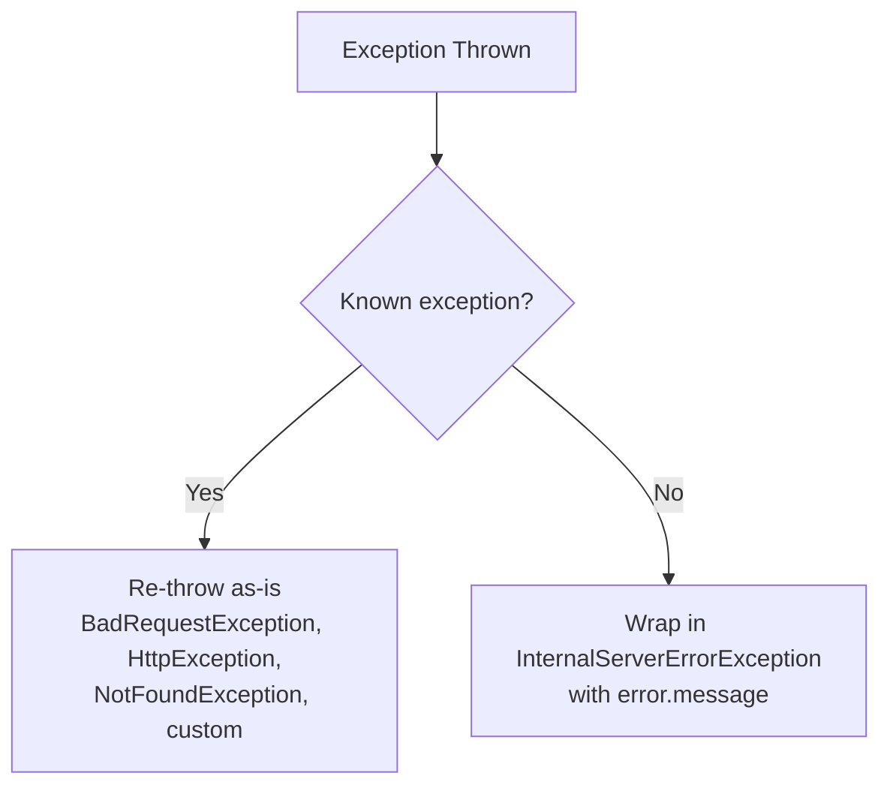
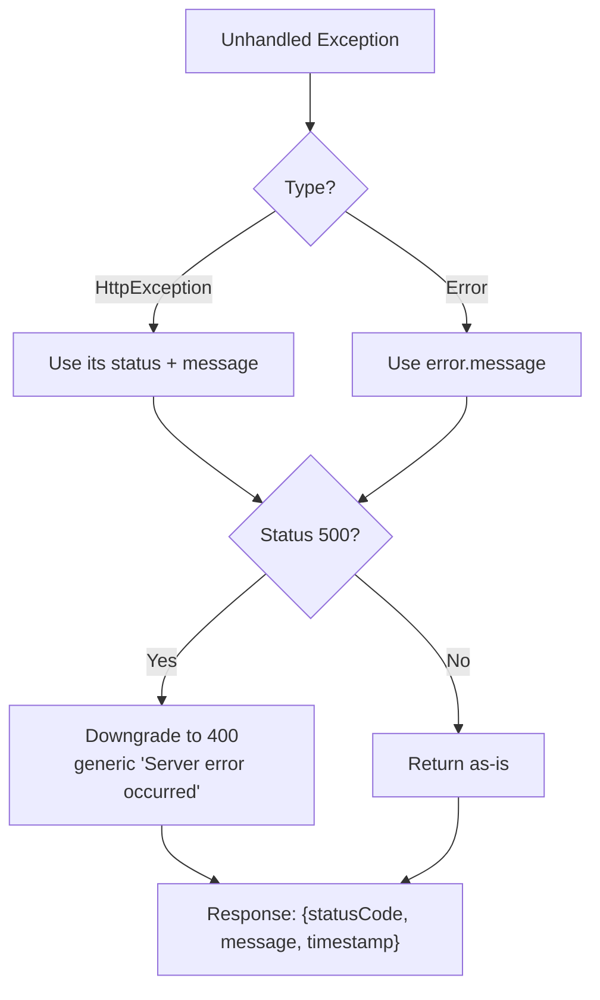
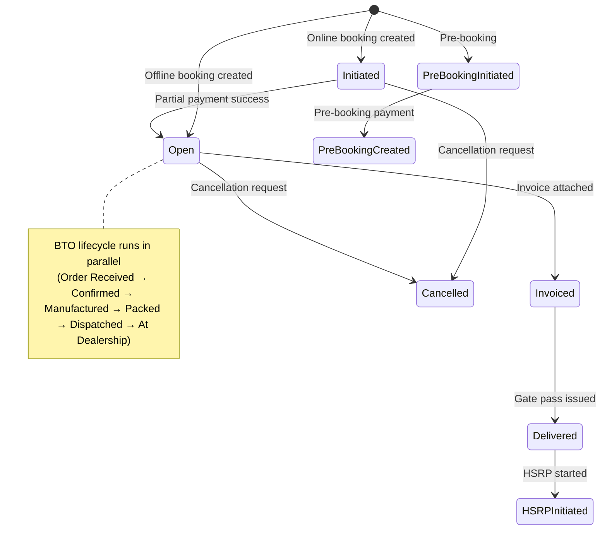

# Low Level Design — Booking CRUD Services

---

## Overview

This document provides implementation-level details of the Booking CRUD Services microservice. It is intended for engineering vendors who need to understand class responsibilities, API contracts, data models, validation rules, error handling patterns, and business logic to effectively contribute to the codebase.

---

## High Level Design - Quick Recap

Reference doc: [HIGH_LEVEL_DESIGN.md](./HIGH_LEVEL_DESIGN.md)

- NestJS 11 monolithic service with TypeORM (MSSQL)
- Factory pattern routes requests to domain-specific services
- Event-driven publishing via Azure Service Bus
- Optimistic concurrency: UUID + SHA-256 checksum + version
- 4 Service Bus listeners for inbound event processing

---

## Assumptions

- All external API calls (CPG, JusPay, Lead System) use OAuth2/token-based auth with secrets from Azure Key Vault
- Redis is used for dealer/product master data caching
- All APIs are behind an API gateway (no service-level auth in this codebase)
- Database schema is managed manually (synchronize: false) — no auto-migrations
- Service Bus topics use session-based message delivery (sessionId = booking UUID)
- `class-validator` with `whitelist: true` strips unknown properties from request bodies

---

## Components

### Controller Layer

| Component | File | Responsibility |
|-----------|------|----------------|
| `BookingsController` | `src/bookings/controllers/bookings.controller.ts` | Single controller handling all HTTP endpoints. Creates JournalDto, orchestrates validation → factory → service → publish → journal |

### Factory Layer

| Component | File | Responsibility |
|-----------|------|----------------|
| `BookingFactoryService` | `src/bookings/services/booking-factory.service.ts` | Maps enum types to service instances via Record maps. Throws `BadRequestException` for invalid types |

### Domain Services (Creation)

| Service | File | Responsibility |
|---------|------|----------------|
| `OnlineBookingService` | `services/booking-creation/online-booking/online-booking.service.ts` | Validates product/dealer, upserts booking by leadId (transaction) |
| `OfflineBookingService` | `services/booking-creation/offline-booking/offline-booking.service.ts` | Creates confirmed booking with booking number + payment |
| `PreBookingService` | `services/booking-creation/pre-booking/pre-booking.service.ts` | Creates pre-booking (status: Pre Booking Initiated) |
| `BookingNumberGenerationService` | `services/booking-creation/booking-number-genration/booking-number-generation.service.ts` | Generates sequential booking number per dealer+branch |

### Domain Services (Modification)

| Service | File | Responsibility |
|---------|------|----------------|
| `PaymentService` | `services/booking-modification/payment/payment.service.ts` | Saves payment record, updates booking status/dates based on payment type |
| `VehicleAllocationService` | `services/booking-modification/vehicle-allocation/vehicle-allocation.service.ts` | Assigns frame/engine numbers to vehicle |
| `VehicleDeallocationService` | `services/booking-modification/vehicle-allocation/vehicle-deallocation.service.ts` | Removes frame/engine allocation |
| `DealerChangeService` | `services/booking-modification/dealer/dealer-change.service.ts` | Generates new UUID, creates new booking, validates home delivery |
| `InvoiceUpdateService` | `services/booking-modification/invoice/invoice-update.service.ts` | Attaches invoice, sets status to Invoiced |
| `InvoiceCancellationService` | `services/booking-modification/invoice/invoice-cancellation.service.ts` | Removes invoice, reverts status |
| `GatepassService` | `services/booking-modification/gate-pass/gate-pass.service.ts` | Records delivery date, sets status to Delivered |
| `HsrpService` | `services/booking-modification/hsrp/hsrp.service.ts` | Records HSRP initiation date |
| `CustomerInfoUpdateService` | `services/booking-modification/customer/customer.service.ts` | Updates customer fields |
| `VehicleUpdateService` | `services/booking-modification/vehicle/vehicle.service.ts` | Updates vehicle model/variant/color |
| `RetailFinanceService` | `services/booking-modification/retail-finance/retail-finance.service.ts` | Stores retail finance JSON |
| `BTOStatusUpdateService` | `services/booking-modification/bto-status-update/bto-status-update.service.ts` | Updates BTO status + date columns + refundable amount |
| `DealerAssignService` | `services/booking-modification/dse-assign/dealer-assign.service.ts` | Assigns DSE to booking |
| `WholeBookingUpdateService` | `services/booking-modification/booking-update/whole-booking-update.service.ts` | Bulk field update (from DMS) |
| `BTOFrameNumberAdditionService` | `services/booking-modification/vehicle-allocation/bto-frame-number-addition.service.ts` | Frame/engine for BTO vehicles |

### Domain Services (Cancellation & Refund)

| Service | File | Responsibility |
|---------|------|----------------|
| `BookingCancellationWorkflowService` | `services/booking-cancellation/booking-cancellation-workflow.service.ts` | Orchestrator: TX begin → validate → cancel → refund → publish → commit |
| `BookingCancellationService` | `services/booking-cancellation/booking-cancellation.service.ts` | Updates status, saves cancellation record |
| `BookingRefundService` | `services/booking-refund/booking-refund.service.ts` | Auto-refund processing (from Service Bus event) |
| `BookingFnFRefundService` | `services/booking-refund/booking-fnf-refund.service.ts` | FnF refund via API endpoint |
| `CpgRefundService` | `services/booking-refund/cpg-refund.service.ts` | CPG-specific refund logic |
| `JusPayRefundService` | `services/booking-refund/jusPay-refund.service.ts` | JusPay-specific refund logic |
| `CcavenueRefundService` | `services/booking-refund/ccavenue-refund.service.ts` | CCAvenue-specific refund logic |
| `BookingRefundStatusUpdateService` | `services/booking-refund-status-update/booking-refund-status-update.service.ts` | Processes CPG/JusPay refund status webhooks |

### Repository Layer

| Service | Responsibility |
|---------|----------------|
| `BookingRepositoryService` | CRUD on Booking entity + related entities (location, product). All writes use transactional EntityManager |
| `PaymentRepositoryService` | Payment entity CRUD |
| `VehicleRepositoryService` | Vehicle entity CRUD (allocation, deallocation) |
| `CancellationRepositoryService` | BookingCancellation entity operations |
| `RefundRepositoryService` | BookingRefund + RefundTransactionLog operations |
| `MDPRepositoryService` | DealerMaster + DmsVehicleMaster + DealerContact + DealerFlag + DealerLocation operations |
| `LoggingRepositoryService` | BookingJournal, BookingTopicLog, RequestLog, AtpLog, MdpLog, DmsLog writes |

### Infrastructure Services

| Service | Responsibility |
|---------|----------------|
| `CPGService` | AES-128/256 encryption/decryption, token generation, refund API calls (transient scope) |
| `JusPayService` | OAuth2 token (cached, singleton), refund API with retry (transient scope) |
| `LeadService` | OAuth2 token + APIM subscription key, updates lead status |
| `ValidationService` | Checksum/version validation, product/dealer existence, cancellation eligibility |
| `ExceptionHandlerService` | Routes known exceptions as-is, wraps unknown as InternalServerError |

---

## API Design

### POST /bookings — Create Booking

**Input:**
```json
{
  "type": "online | offline | pre-booking",
  "isATPConfigured": true,
  "booking": {
    "bookingSource": "EV Website | ICE Website | EMS | DMS | MARKETPLACE_AMAZON | MARKETPLACE_FLIPKART",
    "customer": { "customerId", "name", "phone", "email", "gender", "dob" },
    "enquiry": { "leadId", "enquiryMode", "enquiryType", "enquirySource" },
    "dealer": { "dealerId", "branchId", "dealerPinCode" },
    "vehicle": { "partId", "modelId", "vehicleType": "EV|ICE|BTO" },
    "location": { "cityName", "stateName", "bookingPinCode" },
    "homeDeliverySelected": false,
    "paymentDetails": [{ "paymentStatus", "paymentType", "amountPaid", "paymentId" }],
    "products": { "data": [{ "productType", "quantity", "unitPrice" }] }
  }
}
```

**Output (202):**
```json
{
  "message": "Booking Initiated Successfully",
  "checkSum": "sha256-hash",
  "version": 1,
  "uuid": "20-char-uuid"
}
```

### PUT /bookings — Update Booking

**Input:**
```json
{
  "uuid": "booking-uuid",
  "checkSum": "current-checksum",
  "version": 2,
  "action": "payment update | vehicle allocation | dealer change | ...",
  "updateSource": "EV Website | EMS | DMS | CRM",
  "bookingUpdate": { /* action-specific payload */ }
}
```

**Output (202):** Same structure as create.

### PUT /bookings/cancel — Cancel Booking

**Input:**
```json
{
  "uuid": "booking-uuid",
  "checkSum": "current-checksum",
  "version": 3,
  "cancellationSource": "EV Website | EMS | DMS",
  "cancellationReason": "string",
  "clientAppUserID": "required for EV Website"
}
```

**Output (200):**
```json
{
  "message": "Cancellation Initiated Successfully",
  "checkSum": "new-checksum",
  "version": 4,
  "uuid": "booking-uuid",
  "refundStatus": "Refund Initiated",
  "cpgResponseMessage": "...",
  "jusPayResponseMessage": "..."
}
```

### POST /bookings/search — Retrieve Bookings

**Input:**
```json
{
  "retrievalType": "customer | dealer | bto | crm | count",
  "pageNumber": 1,
  "pageSize": 10,
  /* type-specific filters */
}
```

### Status Codes

| Code | Meaning |
|------|---------|
| 200 | Success (search, cancel, refund status) |
| 202 | Accepted (create, modify — async processing follows) |
| 400 | Validation error (checksum mismatch, invalid type, business rule violation) |
| 500 | Unexpected server error (translated to 400 by GlobalExceptionFilter) |

### Error Response Format

```json
{
  "statusCode": 400,
  "message": "Version or Checksum Mismatch Error",
  "timestamp": "2026-06-07T10:30:00.000Z"
}
```

### Idempotency Rules

- **Create**: If a booking already exists for the same `leadId` with status ≠ Initiated → returns `BOOKING_ALREADY_EXISTS` response (no new booking created)
- **Create (Initiated)**: If booking exists with status = Initiated → updates the existing record (upsert behavior)
- **BTO Status**: If `btoStatus` matches current stored value → returns `BTO_STATUS_ALREADY_UPDATED` (no-op)

---

## Data Model / Schema Changes

### Core Entity: Booking

| Column | Type | Nullable | Purpose |
|--------|------|----------|---------|
| UUID | VARCHAR(20) | PK | Unique booking identifier (truncated UUIDv4) |
| customerId | VARCHAR | Yes | Customer reference |
| customerName | VARCHAR(200) | No | Customer display name |
| customerMobileNumber | VARCHAR(10) | No | Customer phone |
| leadId | VARCHAR | No | CRM lead reference |
| dealerId | VARCHAR | Yes | Dealer SAP code |
| branchId | VARCHAR | Yes | Branch code |
| bookingSource | VARCHAR(20) | No | Origin system |
| bookingStatus | VARCHAR(50) | No | Current lifecycle state |
| btoStatus | VARCHAR(50) | Yes | BTO lifecycle state |
| version | INT | No | Optimistic concurrency counter |
| checksum | NVARCHAR(MAX) | No | SHA-256 hash for concurrency |
| bookingNumber | INT | Yes | Sequential per dealer+branch |
| preBooked | BIT | No | Pre-booking flag |
| dirty | BIT | No | Master data validation failed |
| dirtyMessage | NVARCHAR(MAX) | Yes | Validation failure reason |
| refundableAmount | DECIMAL(10,2) | Yes | BTO refundable amount (calculated) |
| isATPConfigured | BIT | Yes | ATP flag |
| bookingType | VARCHAR(100) | Yes | VEHICLE, NOISE, ACCESSORIES |

### Related Entities

| Entity | Relation | Key Columns |
|--------|----------|-------------|
| `Vehicle` | One-to-Many | frameNumber, engineNumber, vehicleType, model, variant, color, partId, modelId, vehicleAllocated, btoKitDetails |
| `Payment` | One-to-Many | paymentId, paymentType, paymentStatus, totalAmountPaid, paymentChannel, paymentGateway, onlinePayment |
| `Location` | One-to-One | cityName, cityType, stateName, bookingPinCode, bookingAddress, residentType |
| `Product` | One-to-Many | productType, productReferenceId, quantity, unitPrice, totalPrice |
| `BookingCancellation` | One-to-One | cancellationReason, cancellationSource, cancellationDate |
| `SubOrders` | One-to-Many | Sub-order/noise booking records |
| `BookingTopicLog` | One-to-Many | eventType, payload, status (success/failed) |

### DB Indexes

```sql
INDEX [IX_customerId] ON Booking(customerId)
INDEX [IX_createdOn_dealerId_branchId] ON Booking(createdOn, dealerId, branchId)
INDEX [IX_dealerId_branchId_bookingStatus] ON Booking(dealerId, branchId, bookingStatus)
INDEX [IX_dealerId_branchId_bookingNumber] ON Booking(dealerId, branchId, bookingNumber)
```

---

## Class & Interface Design

### Interface Hierarchy

```mermaid
classDiagram
    class ICreateBookingService~T~ {
        +processBooking(bookingInfo: T, data: BookingPostProcessorDto) BookingCreationResponseDto
    }

    class IModifyBookingService~T_U~ {
        +processUpdate(bookingUpdateInfo: T, additionalBookingInfo: U) BookingModificationResponseDto
    }

    class IRetrievalBookingService~T_U~ {
        +fetchBookings(request: BookingRetrievalRequestDto) U
    }

    class ICancellationBookingService {
        +processCancellation(request, manager?) CancellationResponseDto
        +processCancellationRefund(request, manager?) BookingRefundDto
    }

    class IMessagePublisherService~T_U~ {
        +processPublish(request: T, bookingInfo?, response?) void
    }

    class IBookingRepositoryService {
        +saveBooking()
        +findBookingByUUID()
        +updateVersionChecksum()
        +updateBooking()
        +updateCustomer()
        +updateBtoStatus()
        +updateDMSBookingNumber()
        +getBookingInfoByLeadId()
    }

    class IValidationService {
        +validateVersionAndChecksum()
        +validateBooking()
        +validateProductAndDealer()
        +validateCancellBooking()
    }
```



### Dependency Injection Pattern

All services use interface-driven injection:
```typescript
@Inject(BookingRepositoryService)
private readonly bookingRepository: IBookingRepositoryService
```

The concrete class token is used for injection, but code depends on the interface type.

---

## Error Handling & Retries

### Custom Exception Classes

| Exception | HTTP Status | Message | Trigger |
|-----------|-------------|---------|---------|
| `InvalidUUIDException` | 400 | "Invalid UUID" | Booking not found by UUID |
| `InvalidVersionOrChecksumException` | 400 | "Version or Checksum Mismatch Error" | Optimistic concurrency conflict |
| `BookingLockedException` | 400 | "Booking is locked" | version == -1 |
| `BookingCancelledException` | 400 | "Booking is already cancelled" | version == 0 |
| `BookingUpdateNotAllowed` | 400 | "Booking Update Not Allowed" | Vehicle allocated + trying vehicle/dealer/booking update |
| `BookingOpenException` | 400 | "Booking is open" | FnF refund on non-cancelled booking |
| `InitiatedBookingCancellException` | 400 | "Cancellation is not allowed for initiated bookings" | Non-marketplace initiated booking cancel |
| `InvoicedBookingCancelException` | 400 | "Booking is invoiced, cannot cancel" | Marketplace booking in Invoiced state |
| `DeliveredBookingCancelException` | 400 | "Booking is delivered, cannot cancel" | Marketplace booking in Delivered state |
| `SPDVehicleModificationLockedException` | 400 | "Vehicle modification is not allowed for SPD bookings after payment" | SPD dealer + successful payment exists |
| `InvalidActionOrType` | 400 | "Invalid Action or Type" | Unknown action in generateResponse |
| `InvalidDealerCodeException` | 400 | "Invalid dealer code" | Dealer not found in MDP |
| `InvalidPartOrModelIdException` | 400 | "Invalid partId or modelId" | Product not found in MDP |

### ExceptionHandlerService Logic



### GlobalExceptionFilter (catch-all)



### Retry Logic

| Component | Retry Strategy |
|-----------|---------------|
| JusPay refund API | 2 attempts, 300ms backoff, retries only if error message is generic "Error" |
| JusPay token | 2 attempts, 200ms backoff |
| Service Bus listeners | Infinite retry loop with 5s delay between session accepts |
| CPG refund API | No retry (fail-fast) |
| Service Bus publish | No retry (logged as failed in TopicLog) |

### Timeout Thresholds

| Component | Timeout |
|-----------|---------|
| HTTP server | 10 seconds |
| MDP listener session idle | 10 seconds → close session |
| MDP listener max session | 5 minutes → force close |

---

## Security and Compliance

### Encryption

| Context | Method |
|---------|--------|
| CPG request/response payloads | AES-128-CBC (base64 key/IV from Key Vault) |
| CPG client secret | AES-128-CBC encrypted before transmission |
| JusPay response decryption | AES-128/256-CBC (hex key, zero IV) |
| Database connection | TLS (Azure SQL enforced) |
| Service Bus | TLS (Azure enforced) |

### Token Management

| System | Token Type | Caching | TTL |
|--------|-----------|---------|-----|
| CPG | Custom bearer token | None (per-request) | N/A |
| JusPay | OAuth2 access_token | Static class-level cache | `expires_in` from response - 5s |
| Lead System | OAuth2 access_token | Instance-level | 3 seconds (short-lived) |

### PII Handling

Booking entities store customer PII (name, phone, email, DOB, gender). No encryption at rest beyond Azure SQL TDE. No explicit data masking in responses.

---

## RBAC (Role-Based Access Control)

No application-level RBAC is implemented in this service. Access control is assumed to be handled at the API gateway/network layer. The service trusts all incoming requests.

---

## Configuration Rules & Feature Flags

### Configuration Source

All configuration is stored in Azure Key Vault under a single secret (`BOOKING_SERVICE_CONFIG`) as a JSON object containing:
- Database connection details (host, port, database, tenantId)
- Service Bus connection strings and topic/subscription names
- CPG API URLs, client codes, crypto keys
- JusPay API URLs, client credentials
- Lead System URLs, APIM keys

### Environment Variables (required)

| Variable | Purpose |
|----------|---------|
| `BOOKING_SERVICE_DB_CONFIG` | Key Vault secret name for DB config |
| `BOOKING_SERVICE_CONFIG` | Key Vault secret name for service config |
| `KEYVAULT_URL` | Azure Key Vault endpoint |
| `BAS_DB_CLIENT_ID` | Azure AD service principal client ID |
| `BAS_DB_CLIENT_SECRET` | Azure AD service principal secret |
| `APP_PORT` | HTTP listen port |
| `OTEL_EXPORTER_OTLP_ENDPOINT` | OTel collector endpoint |
| `OTEL_SERVICE_NAME` | Service name for traces |
| `DEPLOYMENT_ENVIRONMENT` | Environment label (dev/uat/prod) |

### Feature Flags

| Flag | Source | Effect |
|------|--------|--------|
| `isATPConfigured` | Per-request (client sends) | Determines if ATP events are published and ATP is included in event targets |
| `dirty` flag | Computed at creation time | If product/dealer validation fails, booking is saved with dirty=true |

### BookingConfig Entity

A `BookingConfig` entity exists in the database (registered in TypeORM) for runtime configuration, though its current usage is limited.

---

## Dependencies

### Internal Dependencies

| Dependency | Required By | Impact if Unavailable |
|------------|-------------|----------------------|
| Azure SQL | All services | Complete service failure |
| Azure Key Vault | App startup | Service cannot start |
| Azure Service Bus | Publishers + Listeners | Events not published/consumed |
| Redis | MDPRepositoryService | Falls back to DB queries |

### External Dependencies

| Dependency | Required By | Impact if Unavailable |
|------------|-------------|----------------------|
| CPG Gateway | CpgRefundService | Auto/FnF refunds fail |
| JusPay Gateway | JusPayRefundService | Auto/FnF refunds fail |
| Lead System API | LeadService | Lead status not updated (silent failure — catch block returns) |

### Guarantees

- DB writes are transactional (TypeORM QueryRunner/transaction)
- Service Bus messages use session-based delivery guaranteeing ordered processing per booking UUID
- Checksum validation ensures no lost updates from concurrent modifications
- Journal entries are written in `finally` blocks ensuring audit even on failure

---

## Key Algorithms & Business Rules

### 1. UUID Generation
```
UUID = uuidv4().substring(0, 20)  // Truncated to 20 characters
```

### 2. Checksum Chain
```
initial_checksum = SHA-256(uuid)
next_checksum = SHA-256(current_checksum)  // Each modification chains from previous
```

### 3. Booking Number Generation
```
SELECT MAX(bookingNumber) FROM Booking WHERE dealerId = ? AND branchId = ?
new_number = max + 1
```

### 4. BTO Refundable Amount Calculation
```
btoKitPrice = dynamicPackage + dynamicProPackage + specialEditionColor
nonKitAmount = totalOnlineAmountPaid - btoKitPrice
refundableAmount = nonKitAmount + (percentage * btoKitPrice)

Percentage by status:
  Order Confirmed:    75%
  Order Manufactured: 50%
  Order Packed:       25%
  Order Dispatched:    0%
  Order At Dealership: 0%
```

### 5. Booking Status Transitions



### 6. Payment Update Status Logic
```
Partial payment (success) → bookingStatus = Open, bookingConfirmedDate = now
Full payment (success)    → fullPaymentDate = now, bookingStatus remains (or Open if no bookingNumber)
Pre-booking payment       → bookingStatus = Pre Booking Created
Payment failure           → no status change, event published for tracking
```

### 7. SPD Vehicle Modification Lock
```
If dealer type == SPD AND booking has any successful payment
  → Block vehicle update (throw SPDVehicleModificationLockedException)
```

### 8. Dealer Change Flow
```
1. Validate home delivery update (if homeDelivery flag changed, just update + return)
2. Generate new UUID for the new booking
3. Create new booking record with new UUID
4. Old booking retains its UUID (linked via oldBookingUUID)
5. New lead is generated for CRM
```

### 9. DMS Source Filter
```
If bookingSource == DMS → remove DMS from event targets (avoid echo)
```

### 10. Scheduled Message Delivery
```
Invoice COMMS event → scheduled +7 days from now
If scheduled hour >= 17:00 or < 08:00 → reschedule to next day 11:00 AM
```

---

## Trade-offs & Alternatives Considered

| Decision | Chosen | Alternative | Reason |
|----------|--------|-------------|--------|
| Concurrency control | Checksum chain (SHA-256) | Database row locking | Checksum enables stateless validation without DB locks |
| Async publishing | `setImmediate` fire-and-forget | Outbox pattern with guaranteed delivery | Simpler, TopicLog provides visibility; eventual consistency acceptable |
| Refund orchestration | Single transaction (cancel + refund + publish) | Saga pattern with compensation | Simpler for current scale; refund failure doesn't roll back cancel |
| Factory pattern | Single factory with Record maps | Separate controller per operation type | Keeps single controller, easy to add new types |
| Token caching | Class-level static for JusPay, instance-level for LeadService | Redis-based token cache | JusPay is high-frequency (shared cache helps); LeadService is low-frequency |
| Listener recovery | Infinite while(true) loop with delay | Azure Service Bus auto-complete + processor | Session-based listeners require explicit accept; loop provides control |
| Schema | JSON columns for complex nested data (invoiceDetails, RFDetails, vehicleETA, btoKitDetails) | Normalized tables | Flexibility for evolving structures; read/write in single operation |

---

## Open Questions

- Is there a plan to implement circuit breakers for CPG/JusPay API calls?
- Should `setImmediate` publisher failures trigger a dead-letter retry mechanism?
- What is the data retention policy for `BookingJournal` and `BookingTopicLog` tables?
- Is there a requirement for RBAC/API-level authentication within this service?
- Should the `dirty` flag trigger an automated retry for master data validation?

---

*This document is for engineering vendor onboarding. It does not contain credentials, secrets, or confidential business logic.*
