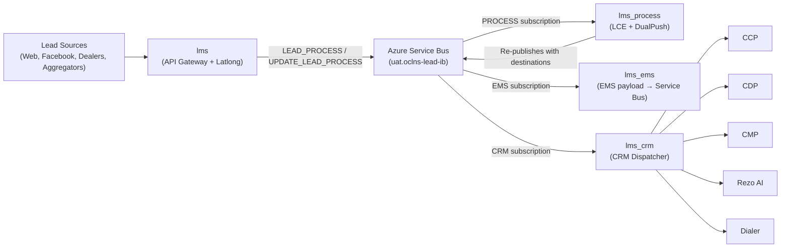
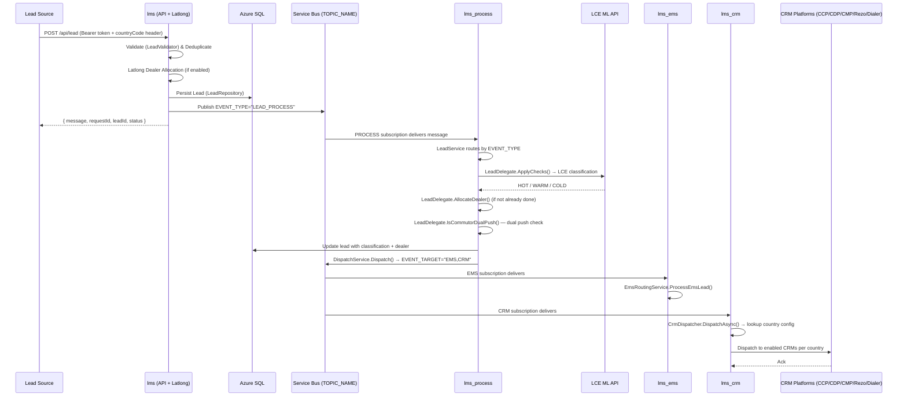

# Lead Management System (LMS) — High-Level Context

## Service Identity

| Field | Value |
|-------|-------|
| Service Name | Lead Management System (LMS) |
| Repos | TVSM-DMS/lms, TVSM-DMS/lms_process, TVSM-DMS/lms_ems, TVSM-DMS/lms_crm |
| Branch | ls_uat_ib |
| Team | App Engineering — Lead Service |
| Tech Lead | Arun Kumar Reddy (@arunkumar.reddy) |
| Deployment | Azure App Service |

## Ownership & Contacts

| Role | Person / Team | Contact |
|------|---------------|---------|
| App Engineering Lead | Suman Kumar | Suman.Kumar@tvsmotor.com |
| Tech Lead | Arun Kumar Reddy | Arunkumar.Reddy@tvsd.ai |
| Product Owner | Prakash Bharati | Prakash.Bharati@tvsmotor.com |
| DevOps | Koyel Nath | Koyel.Nath@tvsmotor.com |
| Backend Dev | Nikhil Reddy | nikhil.reddy@tvsmotor.com |
| Backend Dev | Sriniketh | Sriniketh@tvsmotor.com |

---

## 1. Application Overview

The Lead Management System (LMS) is a distributed, event-driven platform built on .NET 6/7 that captures leads from multiple sources (web forms, Facebook, dealerships, third-party aggregators), processes them through classification and allocation logic, and routes them to downstream EMS and CRM systems. It consists of **4 independently deployable services** communicating via Azure Service Bus.

---

## 2. Module Summary (IB — `ls_uat_ib`)

In IB, there are **4 services** and only **2 downstream subscriptions** (ems + crm). All CRM integrations for all countries are in `lms_crm`.

| Repository | Subscription | Role | Description |
|---|---|---|---|
| **lms** | — (Publisher) | API Gateway | Exposes 13 REST endpoints. Validates, deduplicates, performs latlong dealer allocation, persists leads, and publishes events to Service Bus. |
| **lms_process** | `process_subscription` | Processing Consumer | Consumes lead events. Classifies via LCE ML API, applies dual-push rules, determines destinations (EMS/CRM), and re-publishes to topic. |
| **lms_ems** | `ems_subscription` | EMS Consumer | Constructs EMS payload and publishes back to Service Bus. Also has Booking listener (session-based, separate bus). |
| **lms_crm** | `crm_subscription` | CRM Dispatcher | Identifies country from the lead, routes to country-specific CRM handler (India/Nepal/Sri Lanka). All CRM integrations (CCP/CDP/CMP/Rezo/Dialer) for all countries in one codebase. |

---

## 3. Technology Stack

| Technology | Version | Purpose |
|---|---|---|
| .NET | 6/7 | Application runtime (ASP.NET Core) |
| Entity Framework Core | 7.x | ORM / Data access |
| Azure Service Bus | SDK 7.x | Async messaging (Topics/Subscriptions) |
| Azure SQL Server | — | Persistent data storage (per country) |
| Azure App Service | — | Hosting |
| AutoMapper | — | DTO mapping |
| FluentValidation | — | Request validation (lms) |
| IMemoryCache | — | CRM config caching (lms_crm) |
| Newtonsoft.Json | — | Serialization |

---

## 4. Runtime Flow



---

## 5. Key Services Per Repository

### lms (API Gateway — `leadLogs/`)

| Service | Responsibility |
|---------|---------------|
| LeadLogService | Core orchestrator — validates, deduplicates, routes to ProcessValid/ProcessDuplicate/ProcessInvalid |
| LeadValidator | Validates incoming lead request fields |
| ProcessValidLeadService | Creates lead in DB, dispatches to Service Bus |
| ProcessDuplicateLeadService | Handles duplicate lead logic |
| ProcessInvalidLeadService | Handles invalid lead logic |
| UpdateLeadService | Processes lead updates + dealer transfers |
| LeadDispatchService | Publishes ServiceBusMessage to topic (EVENT_TYPE, EVENT_TARGET, etc.) |
| LatlongService | Calls latlong APIs for dealer allocation (OAuth2 flow) |
| DealerAllocationFactory | Factory pattern — selects EV vs General allocation strategy |
| EvDealerAllocationService | EV-specific dealer allocation |
| GeneralDealerAllocationService | General (non-EV) dealer allocation |
| DealerTransferService | Handles dealer transfer events |
| CommsService | Processes communication status updates |
| WebhookService | Facebook webhook lead ingestion |
| LeadGetService | Lead retrieval (count, details, all, filter) |
| LeadOneViewService | Lead one-view event aggregation |
| MdpService | MDP dealer data service |
| LogicService | Business logic helpers |
| DtoService | DTO construction/transformation |
| CountryCodeMiddleWare | Extracts countryCode from header, sets CountryContext |
| ApiExchangeService | External HTTP calls (latlong token, latlong API, old LMS) |
| StaticTokenAuthenticationHandler | Bearer token validation |

### lms_process (Processing Consumer — `processLeadService/`)

| Service | Responsibility |
|---------|---------------|
| QueueConsumer | Subscribes to PROCESS_SUBSCRIPTION, routes by EVENT_TYPE |
| MdpConsumer | Subscribes to MDP_TOPIC (session-based), processes dealer master data |
| LeadService | Message router — routes to TwoWheelerService / UpdateLeadService / RetryService |
| LeadDelegate | Core business logic — LCE classification, dealer allocation, dual-push check |
| TwoWheelerService | Processes new 2W leads (main flow) |
| UpdateLeadService | Processes lead update events |
| RetryService | Handles retried leads |
| DispatchService | Publishes processed messages back to topic with destinations |
| ModelComparer | Compares model data for enrichment |
| ModelMasterService | Model master data operations |

### lms_ems (EMS Consumer — `emsService/`)

| Service | Responsibility |
|---------|---------------|
| EmsListenerService | Subscribes to EMS_SUBSCRIPTION, routes to EmsRoutingService |
| BookingListenerService | Subscribes to BOOKING_TOPIC (session-based, separate bus) |
| EmsRoutingService | Routes EMS leads by event type |
| EmsService | Core EMS business logic |
| EmsDelegate | EMS processing delegation |
| BookingService | Processes booking events |
| ProcessBookingService | Booking-specific processing |
| RepushService | Re-push failed EMS leads |
| DispatchService | Outbound Service Bus publishing |

### lms_crm (CRM Dispatcher — `crmService/`)

| Service | Responsibility |
|---------|---------------|
| CrmListenerService | Subscribes to CRM_SUBSCRIPTION, routes by EVENT_TYPE |
| CrmDispatcher | Multi-CRM router — looks up country config (cached), dispatches to matching ICrmService |
| CcpService | HTTP client for CCP |
| CdpService | HTTP client for CDP |
| CmpService | HTTP client for CMP |
| DialerService | HTTP client for Dialer |
| DialerTokenService | Auth token management for Dialer |
| RezoService | HTTP client for Rezo AI |
| RetryService | Retry failed CRM dispatches |
| LogService | CRM push logging |
| ModelService | Model data for CRM payloads |
| ExternalApiService | Generic external API caller |
| Country-specific (India/Nepal/Sri Lanka) | ICrmService implementations per country |

---

## 6. Integration Summary

| External System | Protocol | Purpose | Called By |
|---|---|---|---|
| Latlong APIs (Ronin, RTR, EV, 3W, Common) | HTTP REST (OAuth2) | Dealer allocation by lat/long proximity | lms (API layer) |
| LCE ML API | HTTP REST | Lead classification (HOT/WARM/COLD) | lms_process |
| CCP | HTTP REST | Customer Communication Platform | lms_crm |
| CDP | HTTP REST | Customer Data Platform | lms_crm |
| CMP | HTTP REST | Campaign Management Platform | lms_crm |
| Rezo AI | HTTP REST | AI-based calling automation | lms_crm |
| Dialer | HTTP REST | Automated dialing (with token auth) | lms_crm |
| Facebook Graph API | HTTP REST | Retrieve lead ad form data | lms (WebhookService) |
| MDP | Service Bus (session-based) | Master data sync (dealers) | lms_process (MdpConsumer) |

---

## 7. Folder Structure

```
lms/                              (API Gateway)
├── leadLogs/
│   ├── Controllers/
│   │   ├── LeadAcquisitionController.cs  (5 endpoints)
│   │   ├── LeadGetController.cs          (5 endpoints)
│   │   ├── LeadCommsController.cs        (1 endpoint)
│   │   └── WebhooksController.cs         (2 endpoints, no auth)
│   ├── Services/
│   │   ├── LeadLogService.cs             (Core orchestrator)
│   │   ├── ProcessValidLeadService.cs
│   │   ├── ProcessDuplicateLeadService.cs
│   │   ├── ProcessInvalidLeadService.cs
│   │   ├── LeadDispatchService.cs        (Service Bus publish)
│   │   ├── LatlongService.cs             (Dealer allocation)
│   │   ├── UpdateLeadService.cs
│   │   ├── CommsService.cs
│   │   ├── WebhookService.cs
│   │   ├── LeadGetService.cs
│   │   ├── LeadOneViewService.cs
│   │   ├── LeadValidator.cs
│   │   ├── UpdateValidator.cs
│   │   ├── DealerTransferService.cs
│   │   ├── MdpService.cs
│   │   ├── LogicService.cs
│   │   ├── DtoService.cs
│   │   └── CountryCodeMiddleWare.cs
│   ├── Repository/
│   │   ├── LeadRepository.cs
│   │   ├── LeadLogRepository.cs
│   │   ├── BrandRepository.cs
│   │   ├── DuplicateLeadRepository.cs
│   │   ├── LatlongRepository.cs
│   │   ├── LeadGetRepository.cs
│   │   ├── LeadSourceRepository.cs
│   │   ├── MdpRepository.cs
│   │   └── ... (16 total)
│   ├── Latlong/
│   │   ├── DealerAllocationFactory.cs
│   │   ├── EvDealerAllocationService.cs
│   │   ├── GeneralDealerAllocationService.cs
│   │   └── IDealerAllocationService.cs
│   ├── ExchangeService/
│   │   └── ApiExchangeService.cs
│   ├── Token/
│   │   └── StaticTokenAuthenticationHandler.cs
│   └── Const/
│       ├── Constants.cs
│       └── AppSettingsService.cs
├── lms.config/                   (Shared entities/config)
│   └── Entities/                 (All EF Core entity classes)
└── persistLeadService/           (Unused on this branch)

lms_process/                      (Processing Consumer)
├── processLeadService/
│   ├── ListenerService/
│   │   ├── QueueConsumer.cs      (PROCESS subscription)
│   │   └── MdpConsumer.cs        (MDP topic, session-based)
│   ├── Services/
│   │   ├── LeadService.cs        (Message router)
│   │   ├── LeadDelegate.cs       (LCE + allocation + dual push)
│   │   ├── TwoWheelerService.cs  (New lead flow)
│   │   ├── UpdateLeadService.cs
│   │   ├── RetryService.cs
│   │   ├── ThresholdService.cs
│   │   ├── DispatchService.cs    (Re-publish to topic)
│   │   └── ModelComparer.cs
│   ├── Latlong/
│   ├── LeadQualification/        (LCE integration)
│   ├── MdpService/
│   └── Startup.cs

lms_ems/                          (EMS Consumer)
├── emsService/
│   ├── ListenerService/
│   │   ├── EmsListenerService.cs     (EMS subscription)
│   │   └── BookingListenerService.cs (Booking topic, session-based)
│   ├── Services/
│   │   ├── EmsRoutingService.cs
│   │   ├── EmsService.cs
│   │   ├── EmsDelegate.cs
│   │   ├── BookingService.cs
│   │   ├── ProcessBookingService.cs
│   │   ├── RepushService.cs
│   │   └── DispatchService.cs
│   └── Startup.cs

lms_crm/                          (CRM Dispatcher)
├── ListenerService/
│   └── CrmListenerService.cs     (CRM subscription)
├── Services/
│   ├── CrmDispatcher.cs          (Multi-CRM router)
│   ├── CcpService.cs
│   ├── CdpService.cs
│   ├── CmpService.cs
│   ├── DialerService.cs
│   ├── DialerTokenService.cs
│   ├── RezoService.cs
│   ├── RetryService.cs
│   ├── LogService.cs
│   ├── ExternalApiService.cs
│   ├── Services/India/           (Country-specific CRM)
│   ├── Services/Nepal/
│   └── Services/Sri Lanka/
└── Startup.cs
```

---

## 8. Important Entry Points

| Entry Point | Location | Description |
|---|---|---|
| API Startup | `lms/leadLogs/Startup.cs` | Configures auth, DI, middleware, routing |
| Lead Creation | `POST /{prefix}/api/lead` | Primary lead ingestion endpoint |
| Lead Update | `POST /{prefix}/api/lead/update` | Update existing lead |
| Facebook Webhook | `GET/POST /{prefix}/api/b2b/lead` | Webhook verify + lead callback |
| Process Consumer | `lms_process/processLeadService/Startup.cs` | Registers QueueConsumer + MdpConsumer |
| EMS Consumer | `lms_ems/emsService/Startup.cs` | Registers EmsListenerService + BookingListenerService |
| CRM Consumer | `lms_crm/Startup.cs` | Registers CrmListenerService |

---

## 9. High-Level Data Flow



---

## 10. Service Bus Topology

### Single Shared Topic: `TOPIC_NAME`

```
[lms API] publishes → TOPIC_NAME
    Properties: EVENT_TYPE="LEAD_PROCESS" | "UPDATE_LEAD_PROCESS" | "PARTIAL_LEAD_PROCESS"

[lms_process] subscribes → PROCESS_SUBSCRIPTION
    After processing, publishes BACK to same TOPIC_NAME with new EVENT_TARGET

[lms_ems] subscribes → EMS_SUBSCRIPTION
    Consumes messages targeted to EMS

[lms_crm] subscribes → CRM_SUBSCRIPTION  
    Consumes messages targeted to CRM
    Routes: LEAD_CREATE_EVENT → CrmDispatcher.DispatchAsync()
            Other events → CrmDispatcher.DispatchUpdatesAsync()
```

### Additional Topics

| Topic | Subscription | Service | Notes |
|-------|-------------|---------|-------|
| `MDP_TOPIC_NAME` | `MDP_LMS_SUBSCRIPTION` | lms_process (MdpConsumer) | Session-based, dealer data sync |
| `BOOKING_TOPIC_NAME` | `BOOKING_SUBSCRIPTION` | lms_ems (BookingListenerService) | Separate connection string, session-based |

---

## 11. External Integrations

| System | URL (Staging/UAT) | Purpose | Auth | Called By |
|---|---|---|---|---|
| Latlong Token | `stagingapi.latlong.in/oauth/token` | OAuth2 token for dealer APIs | client_credentials | lms, lms_process |
| Latlong Ronin | `stagingapi.latlong.in/v2/brands/514/find.json` | Ronin dealer allocation | OAuth2 | lms, lms_process |
| Latlong RTR | `stagingapi.latlong.in/v2/brands/370/find.json` | RTR dealer allocation | OAuth2 | lms, lms_process |
| Latlong Common | `stagingapi.latlong.in/v2/brands/301/find.json` | Default brand allocation | OAuth2 | lms, lms_process |
| Latlong 3W | `stagingapi.latlong.in/v2/brands/273/find.json` | 3-Wheeler allocation | OAuth2 | lms, lms_process |
| Latlong EV | `stagingapi.latlong.in/v2/brands/406/find.json` | EV brand allocation | OAuth2 | lms, lms_process |
| LCE HO | `tvsmazlceappdev01-digital.azurewebsites.net/api/lce/ho` | Lead classification (HO model) | Token | lms_process |
| LCE Databricks | `adb-*.azuredatabricks.net/serving-endpoints/*` | ML classification | OAuth2 | lms_process |
| TVS Accelerator EMS | `api.tvsaccelerator.com/api/push-online-enquiry` | Push to EMS | API Key | lms_ems |
| TVS Accelerator Aggregator | `api.tvsaccelerator.com/api/save-ems-enquiry` | Aggregator EMS push | API Key | lms_ems |
| EMS Search | `api.tvsaccelerator.com/api/enquiry-search` | Enquiry lookup | API Key | lms |
| CCP (Salesforce) | `tvsm-c360a.sandbox.my.salesforce.com/services/data/v60.0/sobjects` | CRM platform | OAuth2 | lms_crm, lms_ems |
| CDP (Salesforce C360) | `c360a.salesforce.com/api/v1/ingest/sources/...` | Customer Data Platform | OAuth2 | lms_crm |
| CMP (Marketing Cloud) | `mc5p40ygdypg3k1wtyb0ckp02fnm.rest.marketingcloudapis.com` | Campaign Management | OAuth2 | lms_crm, lead_comms |
| Rezo AI | `tvsmotors.rezo.ai/tvsapi/Controller/dataupload` | AI-based calling | Basic Auth | lms_crm, lead_comms |
| Dialer (C-Zentrix) | `admin.c-zentrixcloud.com/CZ_API/bulklead` | Automated dialing | Token | lms_crm, lead_comms |
| TVS Credit | `leadsapiuatoci.tvscredit.com/LMSEXT/InsertLMSDatavendor` | Finance lead push | API Key | tvs_credit |
| Facebook Graph API | `graph.facebook.com/v23.0` | Lead ad form data | Page Token | lms |
| Old LMS | `api.tvsmotor.com/Tvsapi.svc/UATUpdateLmstwoApiResponse` | Legacy sync | API Key | lms_ems |

---

## 12. Data Storage

| Store | Type | Purpose |
|-------|------|---------|
| Azure SQL (DOM_DB_CONN) | MSSQL | India lead data + config |
| Azure SQL (SRILANKA_DB_CONN) | MSSQL | Sri Lanka lead data |
| Azure Service Bus | Messaging | Async event-driven processing |
| IMemoryCache | Cache | CRM country config (lms_crm, configurable TTL) |

---

## 13. Events & Messaging

### Topic

All services share the same topic: **`uat.oclns-lead-ib`**. Only subscription names differ.

### Topics Published To

| Topic | Events | Publisher |
|-------|--------|-----------|
| `uat.oclns-lead-ib` | LEAD_PROCESS, UPDATE_LEAD_PROCESS, PARTIAL_LEAD_PROCESS | lms (LeadDispatchService) |
| `uat.oclns-lead-ib` | Routed messages with EVENT_TARGET=EMS,CRM | lms_process (DispatchService) |
| `uat.oclns-lead-ib` | Constructed EMS payload | lms_ems (DispatchService) |

### Subscriptions Consumed (on `uat.oclns-lead-ib`)

| Subscription | Consumer | Purpose |
|--------------|----------|---------|
| `process_subscription` | lms_process (QueueConsumer) | LCE classification, dual-push, route to EMS/CRM |
| `ems_subscription` | lms_ems (EmsListenerService) | Construct EMS payload → publish to Service Bus |
| `crm_subscription` | lms_crm (CrmListenerService) | Identify country → dispatch to country-specific CRM |

### Additional Topics (separate Service Bus connections)

| Topic | Subscription | Consumer | Notes |
|-------|-------------|---------|-------|
| `dev.mdp.dealer_data` | `lms` | lms_process (MdpConsumer) | Session-based, dealer master sync |
| `uat.booking` | `ls-booking-subscription` | lms_ems (BookingListenerService) | Session-based, separate connection |

---

*Document Version: 2.0 | Last Updated: July 2026*
