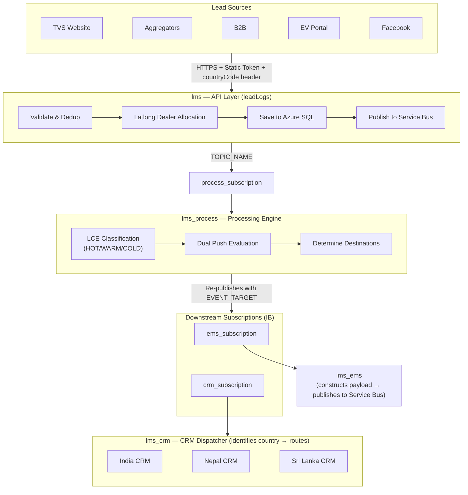
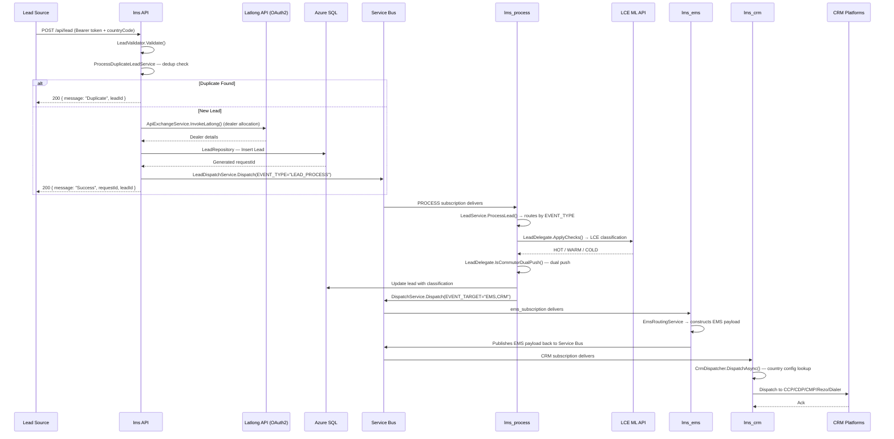
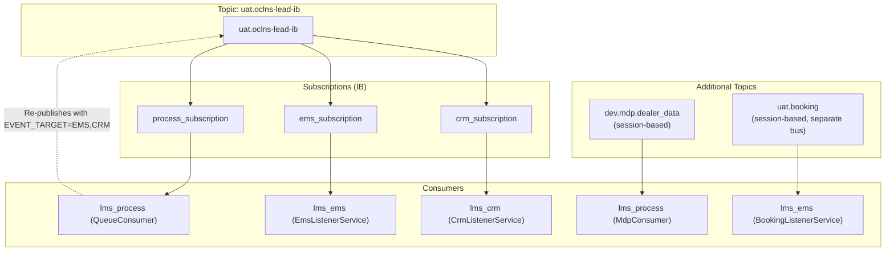
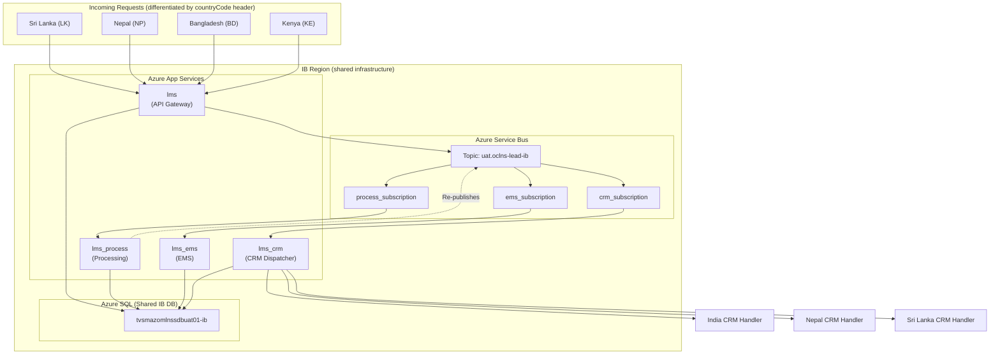

# Lead Management System (LMS) — High-Level Design

## Service Identity

| Field | Value |
|-------|-------|
| Service Name | Lead Management System (LMS) |
| Repos | TVSM-DMS/lms, TVSM-DMS/lms_process, TVSM-DMS/lms_ems, TVSM-DMS/lms_crm |
| Branch | ls_uat_ib |
| Team | App Engineering — Lead Service |
| Tech Lead | Arun Kumar Reddy (@arunkumar.reddy) |
| Deployment | Azure App Service |

## Ownership & Contacts

| Role | Person / Team | Contact |
|------|---------------|---------|
| App Engineering Lead | Suman Kumar | Suman.Kumar@tvsmotor.com |
| Tech Lead | Arun Kumar Reddy | Arunkumar.Reddy@tvsd.ai |
| Product Owner | Prakash Bharati | Prakash.Bharati@tvsmotor.com |
| DevOps | Koyel Nath | Koyel.Nath@tvsmotor.com |
| Backend Dev | Nikhil Reddy | nikhil.reddy@tvsmotor.com |
| Backend Dev | Sriniketh | Sriniketh@tvsmotor.com |

---

## 1. Overview

This document describes the High-Level Design of the Lead Management System (LMS), a distributed event-driven platform for capturing, classifying, allocating, and routing automotive leads. The system consists of 4 microservices communicating via Azure Service Bus topics/subscriptions.

---

## 2. Tier Classification

| Attribute | Value |
|---|---|
| **Tier** | Tier 1 — Mission Critical |
| **Availability Target** | 99.9% uptime |
| **RPO** | < 5 minutes |
| **RTO** | < 15 minutes |
| **Impact of Downtime** | Lead loss, revenue impact, dealer SLA breach |

---

## 3. Background

TVS Motor Company requires a centralized lead management platform to:
- Ingest leads from diverse sources (web, social media, dealerships, aggregators)
- Allocate leads to the nearest appropriate dealer (lat/long based, brand-specific)
- Classify lead quality using ML-based models (LCE)
- Apply dual-push business rules
- Route leads to EMS and CRM systems
- Support country-specific business rules and CRM configurations
- Operate with country-level database isolation

---

## 4. System Components (IB — `ls_uat_ib`)

In IB, there are only **4 services** and **2 downstream subscriptions** (ems_subscription + crm_subscription). All CRM integrations for all countries are handled within `lms_crm`.

| Component | Repository | Subscription | Role |
|---|---|---|---|
| **lms** | TVSM-DMS/lms | — (Publisher) | API Gateway — validates, deduplicates, allocates dealer (latlong), persists, publishes to Service Bus |
| **lms_process** | TVSM-DMS/lms_process | `process_subscription` | Processing Consumer — LCE classification, dual-push rules, determines destinations (EMS/CRM), re-publishes to topic |
| **lms_ems** | TVSM-DMS/lms_ems | `ems_subscription` | EMS Consumer — constructs EMS payload and publishes back to Service Bus. Also handles Booking events (session-based, separate bus). |
| **lms_crm** | TVSM-DMS/lms_crm | `crm_subscription` | CRM Dispatcher — identifies country from the lead, routes to country-specific CRM handler (India/Nepal/Sri Lanka). Handles ALL CRM integrations (CCP/CDP/CMP/Rezo/Dialer) for all countries in one codebase. |

---

## 5. Current Architecture

---

## 6. Processing Responsibilities (Corrected)

### What happens WHERE:

| Step | Service | Details |
|------|---------|---------|
| Validate request | **lms** (API) | LeadValidator, UpdateValidator |
| Deduplicate | **lms** (API) | ProcessDuplicateLeadService |
| **Dealer Allocation (Latlong)** | **lms** (API) | LatlongService → DealerAllocationFactory → EV/General strategy. OAuth2 token → Latlong API call |
| Persist lead | **lms** (API) | LeadRepository → Azure SQL |
| Publish to Service Bus | **lms** (API) | LeadDispatchService.Dispatch() → TOPIC_NAME |
| **LCE Classification** | **lms_process** | LeadDelegate.ApplyChecks() → calls LCE ML API → HOT/WARM/COLD |
| **Dual Push Evaluation** | **lms_process** | LeadDelegate.IsCommutorDualPush() — state + brand rules |
| Determine destinations | **lms_process** | Decides which subscriptions to target (EMS, CRM) |
| Re-publish routed message | **lms_process** | DispatchService.Dispatch() → back to TOPIC_NAME with EVENT_TARGET |
| EMS processing | **lms_ems** | EmsRoutingService → EmsService → EMS-specific logic |
| CRM dispatch | **lms_crm** | CrmDispatcher → country-specific CRM services → external APIs |

---

## 7. Data Flow / Sequence Diagram

---

## 8. Scalability Approach

All services are hosted on Azure App Service with **auto-scaling** enabled. Instances scale horizontally based on CPU/memory metrics and Service Bus queue depth. The event-driven architecture decouples ingestion from processing — the API layer responds immediately while consumers scale independently based on message backlog. Service Bus dead-letter queues ensure no data loss during scale-in events.

---

## 9. Service Bus Architecture

### Topic Name

All services share the same topic: **`uat.oclns-lead-ib`**

In IB, only **2 downstream subscriptions** exist after processing:

### Subscriptions (on topic `uat.oclns-lead-ib`)

| Subscription Name | Consumer | Purpose |
|---|---|---|
| `process_subscription` | lms_process | LCE classification, dual-push, routes to EMS/CRM |
| `ems_subscription` | lms_ems | Constructs EMS payload, publishes back to Service Bus |
| `crm_subscription` | lms_crm | Identifies country from lead → dispatches to country-specific CRM handler (India/Nepal/Sri Lanka) |

### Additional Topics

| Topic Name | Subscription | Consumer | Connection | Notes |
|---|---|---|---|---|
| `dev.mdp.dealer_data` | `lms` | lms_process (MdpConsumer) | Separate `MDP_SERVICE_BUS_CONNECTION_STRING` | Session-based, dealer master sync |
| `uat.booking` | `ls-booking-subscription` | lms_ems (BookingListenerService) | Separate `BOOKING_SERVICE_BUS_CONNECTION_STRING` | Session-based |

### Message Properties

| Property | Type | Description |
|---|---|---|
| EVENT_TYPE | string | "LEAD_PROCESS", "UPDATE_LEAD_PROCESS", "PARTIAL_LEAD_PROCESS", "RETRY_PROCESS" |
| EVENT_SOURCE | string | "LEAD_ACQUISITION" (lms), "PROCESS" (lms_process), "LsScheduler" (ls_scheduler) |
| EVENT_TARGET | string | Comma-separated: "PROCESS", "EMS", "CRM", "COMMS", "FINANCE", "accelerator,crm" |
| CREATED_AT | string | Timestamp |
| VERSION | string | Message version |

---

## 10. Deployment Topology

Deployment is **region-wise**. All countries within a region share the same App Service instances and database. Data and requests are differentiated by the `countryCode` header.

All services connect to the same Service Bus topic: **`uat.oclns-lead-ib`**. Only the subscription name differs per service.

| Region | Countries | DB |
|--------|-----------|-----|
| International Business (IB) | LK, NP, BD, KE, etc. | Shared IB DB (differentiated by countryCode) |

---

## 11. External Integrations

| System | Protocol | Purpose | Auth | Called By |
|--------|----------|---------|------|-----------|
| Latlong API (Ronin) — `stagingapi.latlong.in/v2/brands/514/find.json` | HTTPS | Dealer allocation (Ronin brand) | OAuth2 client_credentials (`LATLONG_RONIN_CLIENT_ID/SECRET`) | lms, lms_process |
| Latlong API (RTR) — `stagingapi.latlong.in/v2/brands/370/find.json` | HTTPS | Dealer allocation (RTR brand) | OAuth2 client_credentials (`LATLONG_RTR_CLIENT_ID/SECRET`) | lms, lms_process |
| Latlong API (Common) — `stagingapi.latlong.in/v2/brands/301/find.json` | HTTPS | Dealer allocation (default brands) | OAuth2 client_credentials (`LATLONG_COMMON_CLIENT_ID/SECRET`) | lms, lms_process |
| Latlong API (3W) — `stagingapi.latlong.in/v2/brands/273/find.json` | HTTPS | Dealer allocation (3-Wheeler) | OAuth2 client_credentials (`LATLONG_3W_CLIENT_ID/SECRET`) | lms, lms_process |
| Latlong API (EV) — `stagingapi.latlong.in/v2/brands/406/find.json` | HTTPS | Dealer allocation (EV brand) | OAuth2 client_credentials (`LATLONG_EV_CLIENT_ID/SECRET`) | lms, lms_process |
| Latlong Token — `stagingapi.latlong.in/oauth/token` | HTTPS | OAuth2 token endpoint | client_credentials | lms, lms_process |
| LCE ML API — Azure Databricks | HTTPS | Lead classification (HOT/WARM/COLD) | OAuth2 (`LCE_CLIENT_ID/SECRET`) | lms_process |
| LCE HO API — `tvsmazlceappdev01-digital.azurewebsites.net` | HTTPS | LCE classification (HO model) | Token | lms_process |
| TVS Accelerator EMS — `api.tvsaccelerator.com/api/push-online-enquiry` | HTTPS | Push leads to EMS | API Key | lms_ems |
| TVS Accelerator EMS (Aggregator) — `api.tvsaccelerator.com/api/save-ems-enquiry` | HTTPS | Push aggregator leads to EMS | API Key | lms_ems |
| CCP (Salesforce) — `tvsm-c360a.sandbox.my.salesforce.com` | HTTPS | Customer Communication Platform | OAuth2 (`CCP_CLIENT_ID/SECRET`) | lms_crm, lms_ems |
| CDP (Salesforce C360) — `g-ygkmzym0zwgzrwgq2tqnrygq.c360a.salesforce.com` | HTTPS | Customer Data Platform | OAuth2 | lms_crm |
| CMP (Salesforce Marketing Cloud) — `mc5p40ygdypg3k1wtyb0ckp02fnm.rest.marketingcloudapis.com` | HTTPS | Campaign Management Platform | OAuth2 (`CMP_CLIENT_ID/SECRET`) | lms_crm, lead_comms |
| Rezo AI — `tvsmotors.rezo.ai/tvsapi/Controller/dataupload` | HTTPS | AI-based calling automation | Basic Auth (`REZO_AUTH_KEY`) | lms_crm, lead_comms |
| Dialer (C-Zentrix) — `admin.c-zentrixcloud.com/CZ_API/bulklead` | HTTPS | Automated dialing | Token (`DIALER_TOKEN_URL`) | lms_crm, lead_comms |
| TVS Credit — `leadsapiuatoci.tvscredit.com/LMSEXT/InsertLMSDatavendor` | HTTPS | Finance lead push | API Key | tvs_credit |
| TVS Credit Dealers — `leadsapi.tvscredit.com/LMSINT/RefDealerTVSCS_TVSM` | HTTPS | Dealer reference data | API Key | tvs_credit |
| Facebook Graph API | HTTPS | Lead ad form data retrieval | Page Access Token (`FACEBOOK_VERSION: v23.0`) | lms |
| Old LMS — `api.tvsmotor.com/Tvsapi.svc/UATUpdateLmstwoApiResponse` | HTTPS | Legacy LMS sync (limited use) | API Key | lms_ems |
| EMS Search — `api.tvsaccelerator.com/api/enquiry-search` | HTTPS | Enquiry search/lookup | API Key | lms |

---

## 12. Data Storage

| Store | Type | Purpose |
|-------|------|---------|
| Azure SQL (DOM_DB_CONN) | MSSQL | India lead data, config, entities |
| Azure SQL (SRILANKA_DB_CONN) | MSSQL | Sri Lanka lead data |
| Azure Service Bus | Messaging | Async event processing between 4 services |
| IMemoryCache | Cache | CRM country config (lms_crm, configurable TTL) |

---

## 13. Risks

| Risk | Probability | Impact | Mitigation |
|---|---|---|---|
| Service Bus outage | Low | High | Dead-letter queues, retry policies, alerts |
| LCE API unavailability | Medium | Medium | Fallback classification logic in LeadDelegate |
| Latlong API timeout | Medium | Medium | OAuth2 token caching, retry logic |
| CRM platform downtime | Medium | Low | RetryService in lms_crm, DLQ after max retries |
| Token compromise | Low | High | Token rotation, IS_TOKEN_REQUIRED toggle |
| DB connection failure | Low | High | Connection string per country, retry policy |
| MaxConcurrentCalls=1 bottleneck | Medium | Medium | Scale out App Service instances |

---

## 14. Glossary

| Term | Definition |
|---|---|
| LCE | Lead Classification Engine — ML model (HOT/WARM/COLD) |
| Latlong API | Geographic API for dealer proximity allocation (5 brand-specific endpoints) |
| CCP | Customer Communication Platform |
| CDP | Customer Data Platform |
| CMP | Campaign Management Platform |
| MDP | Master Data Platform (session-based Service Bus) |
| EMS | Enterprise Management System |
| Dual Push | Business rule pushing leads to multiple destinations (state + brand rules) |
| Deduplication | Logic preventing duplicate leads (mobile + dealer + branch + active) |
| AppPrefix | Route prefix for all endpoints |
| DLQ | Dead-Letter Queue for unprocessable messages |
| QueueConsumer | lms_process Service Bus listener for PROCESS subscription |
| CrmDispatcher | lms_crm router using country config to select CRM services |

---

*Document Version: 2.0 | Last Updated: July 2026*
