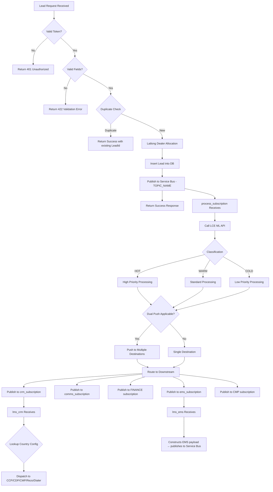
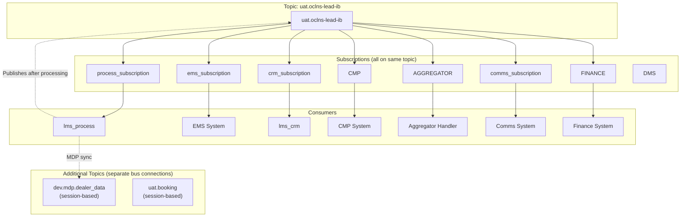

# Lead Management System (LMS) — Low-Level Design

## 1. Overview

This document provides the Low-Level Design for the Lead Management System (LMS). It covers API specifications, data models, class designs, processing flows, business rules, and configuration details for all three repositories.

**HLD Reference:** See [HLD.md](./HLD.md) for architecture context, tier classification, and deployment strategy.

---

## 2. Assumptions

| # | Assumption |
|---|---|
| 1 | Each region operates independently with its own database and Service Bus namespace |
| 2 | Static token authentication is sufficient for all API consumers (machine-to-machine) |
| 3 | Facebook webhook endpoints do not require token authentication |
| 4 | LCE ML API and Lat/Long API are always available (circuit breaker handles transient failures) |
| 5 | CRM configuration is stored in CountryMaster.CrmConfigJson and cached for 30 minutes |
| 6 | All API request fields use snake_case naming convention |
| 7 | AppPrefix environment variable is mandatory and prepends all routes |
| 8 | Service Bus uses Standard tier with topic/subscription model |
| 9 | MDP topic uses session-based messaging |
| 10 | Deduplication window is defined by "active" lead status (not time-based) |

---

## 3. Components

| Component | Repository | Type | Responsibility |
|---|---|---|---|
| LeadAcquisitionController | lms | API Controller | Lead create, update, bulk, reassign, Facebook |
| LeadGetController | lms | API Controller | Lead retrieval (by ID, mobile, filters, status, history) |
| LeadCommsController | lms | API Controller | Communication status updates |
| WebhooksController | lms | API Controller | Facebook webhook verify & callback |
| StaticTokenAuthenticationHandler | lms | Auth Handler | Validates Bearer token against TOKEN env var |
| ServiceBusPublisher | lms | Service | Publishes messages to lead-events topic |
| DeduplicationService | lms | Service | Checks mobile + dealer + branch + active |
| ValidationService | lms | Service | Request field validation |
| LeadProcessConsumer | lms_process | Consumer | Listens to PROCESS subscription |
| LeadClassificationService | lms_process | Service | Calls LCE ML API |
| DealerAllocationService | lms_process | Service | Calls Lat/Long API (brand-specific) |
| DualPushService | lms_process | Service | State + brand dual push routing |
| RouteService | lms_process | Service | Publishes to downstream subscriptions |
| CrmConsumer | lms_crm | Consumer | Listens to CRM subscription |
| CrmDispatcherService | lms_crm | Service | Routes to appropriate CRM platform |
| CrmConfigCache | lms_crm | Cache | CountryMaster.CrmConfigJson (30-min TTL) |
| CcpDispatcher | lms_crm | Dispatcher | Sends to CCP |
| CdpDispatcher | lms_crm | Dispatcher | Sends to CDP |
| CmpDispatcher | lms_crm | Dispatcher | Sends to CMP |
| RezoAiDispatcher | lms_crm | Dispatcher | Sends to Rezo AI |
| AutoDialerDispatcher | lms_crm | Dispatcher | Sends to Auto-Dialer |

---

## 4. API Design

### 4.1 All Endpoints

| # | Method | Route | Controller | Auth Required | Purpose |
|---|---|---|---|---|---|
| 1 | POST | `/{prefix}/api/lead` | LeadAcquisition | Yes | Create new lead |
| 2 | POST | `/{prefix}/api/lead/update` | LeadAcquisition | Yes | Update existing lead |
| 3 | POST | `/{prefix}/api/lead/bulk` | LeadAcquisition | Yes | Bulk lead creation |
| 4 | POST | `/{prefix}/api/lead/reassign` | LeadAcquisition | Yes | Reassign lead to different dealer |
| 5 | POST | `/{prefix}/api/lead/facebook` | LeadAcquisition | Yes | Facebook lead ingestion |
| 6 | GET | `/{prefix}/api/lead/{id}` | LeadGet | Yes | Get lead by ID |
| 7 | GET | `/{prefix}/api/lead/mobile/{number}` | LeadGet | Yes | Get leads by mobile number |
| 8 | POST | `/{prefix}/api/lead/filter` | LeadGet | Yes | Filter leads by criteria |
| 9 | GET | `/{prefix}/api/lead/status/{id}` | LeadGet | Yes | Get lead processing status |
| 10 | GET | `/{prefix}/api/lead/history/{id}` | LeadGet | Yes | Get lead history/audit trail |
| 11 | POST | `/{prefix}/api/comms/status` | LeadComms | Yes | Update communication status |
| 12 | GET | `/{prefix}/api/webhook/facebook` | Webhooks | **No** | Facebook webhook verification |
| 13 | POST | `/{prefix}/api/webhook/facebook` | Webhooks | **No** | Facebook webhook callback |

### 4.2 POST /api/lead — Request Fields

| Field | Type | Required | Description |
|---|---|---|---|
| customer_name | string | Yes | Full name of the customer |
| mobile_number | string | Yes | 10-digit mobile number |
| email | string | No | Customer email address |
| source_id | int | Yes | Lead source identifier |
| brand_code | string | Yes | Brand code (e.g., TVS, Norton) |
| model_id | int | No | Vehicle model identifier |
| dealer_code | string | No | Preferred dealer code |
| state_id | int | No | State identifier |
| city_id | int | No | City identifier |
| pincode | string | No | Postal/PIN code |
| latitude | decimal | No | Customer latitude |
| longitude | decimal | No | Customer longitude |
| utm_source | string | No | Marketing UTM source |
| utm_medium | string | No | Marketing UTM medium |
| utm_campaign | string | No | Marketing UTM campaign |
| remarks | string | No | Additional remarks |
| reference_id | string | No | External reference identifier |

### 4.3 Standard Response Format

```json
{
  "Status": 1,
  "Message": "Lead created successfully",
  "RequestId": 123456,
  "LeadId": "LMS-IN-20250101-000001"
}
```

| Field | Type | Description |
|---|---|---|
| Status | int | 1 = Success, 0 = Failure |
| Message | string | Human-readable message |
| RequestId | long | Internal request tracking ID |
| LeadId | string | Unique lead identifier |

---

## 5. Data Model / Schema

Based on actual entity files from `lms.config/Entities/` on branch `ls_uat_ib` (51 entities total):

```mermaid
erDiagram
    leads ||--|| lead_logs : "lead_log_id"
    leads }o--|| lead_sources : "source_id"
    leads }o--|| brand_master : "brand_code"
    leads ||--o{ lead_followups : "lead_id"
    leads ||--o{ lead_test_rides : "lead_id"
    leads ||--o{ lead_invoice_details : "lead_id"
    leads ||--o{ lead_push_logs : "lead_id"
    leads ||--o{ referral_customer_details : "lead_id"
    leads ||--o{ lead_event_logs : "lead_id"
    leads ||--o{ lead_extra_attributes : "lead_id"
    leads ||--o{ additional_details : "lead_id"
    leads ||--o{ lead_brand_details : "lead_id"
    leads ||--o{ lead_catalogue_details : "lead_id"
    leads ||--o{ lead_enquiry_tags : "lead_id"
    leads ||--o{ finance_details : "lead_id"
    leads ||--o{ classified_leads : "lead_id"
    leads ||--o{ leads_comms_mappings : "lead_id"
    leads ||--o{ brand_detail_log_mappings : "lead_id"
    leads ||--o{ test_ride_log_mappings : "lead_id"
    lead_logs ||--o{ leads : "lead_log_id"
    lead_logs ||--o{ brand_detail_log_mappings : "lead_log_id"
    lead_logs ||--o{ lead_acquisition_logs : "lead_log_id"
    lead_logs ||--o{ lead_event_logs : "lead_log_id"
    lead_logs ||--o{ lead_extra_attributes : "lead_log_id"
    lead_logs ||--o{ test_ride_log_mappings : "lead_log_id"
    lead_sources ||--o{ lead_flow_configuration : "source_id"
    lead_sources ||--o{ brand_detail_log_mappings : "source_id"
    lead_sources ||--o{ lead_comms : "source_id"
    lead_sources ||--o{ lead_event_logs : "source_id"
    lead_sources ||--o{ lead_extra_attributes : "source_id"
    lead_sources ||--o{ test_ride_log_mappings : "source_id"
    brand_master ||--o{ model_id_part_id_master : "brand_code"
    brand_master ||--o{ leads : "brand_code"
    lead_test_rides ||--o{ test_ride_log_mappings : "test_ride_id"
    lead_followups }o--|| leads : "lead_id"
```



### All Tables (51 entities)

| Table | Purpose | FK Relationships |
|-------|---------|-----------------|
| `leads` | Primary lead record | → lead_logs, → lead_sources, → brand_master |
| `lead_logs` | Raw request JSON log | ← leads (one-to-many) |
| `lead_sources` | Source master (website, aggregator, etc.) | ← leads, ← lead_flow_configuration |
| `brand_master` | Brand/model lookup | ← leads, ← model_id_part_id_master |
| `model_id_part_id_master` | Model-part mapping per brand | → brand_master |
| `lead_flow_configuration` | Per-source validation/push config | → lead_sources |
| `lead_followups` | Follow-up records per lead | → leads |
| `lead_test_rides` | Test ride requests | → leads |
| `lead_invoice_details` | Invoice data on conversion | → leads |
| `lead_push_logs` | Outbound push logs (EMS/CRM) | → leads |
| `referral_customer_details` | Referral customer info | → leads |
| `additional_details` | Additional customer details | → leads |
| `additional_details_log_mapping` | Maps additional details to log | → leads, → lead_logs, → lead_sources |
| `brand_detail_log_mappings` | Brand-log mapping | → leads, → lead_logs, → lead_sources |
| `lead_event_logs` | Event logs per lead | → leads, → lead_logs, → lead_sources |
| `lead_extra_attributes` | Custom key-value attributes | → leads, → lead_logs, → lead_sources |
| `test_ride_log_mappings` | Test ride-log mapping | → leads, → lead_logs, → lead_sources, → lead_test_rides |
| `lead_brand_details` | Interested brands per lead | → leads |
| `lead_catalogue_details` | Catalogue details per lead | → leads |
| `lead_enquiry_tags` | Tags per lead | → leads |
| `finance_details` | Finance application per lead | → leads |
| `classified_leads` | LCE classification result | → leads |
| `lead_comms` | Communication records | → lead_sources |
| `leads_comms_mappings` | Lead-comms junction | → leads |
| `lead_acquisition_logs` | Acquisition event logs | → lead_logs |
| `lead_log_mappings` | Log mapping records | — |
| `lead_log_responses` | Log response records | — |
| `lead_quotations` | Quotation records per lead | — |
| `lead_events` | Event master/config | — |
| `duplicate_leads` | Duplicate lead records | — |
| `dealer_master` | Dealer master data (MDP synced) | — |
| `dealer_master_list` | Dealer list data | — |
| `dealer_locations` | Dealer geo locations | — |
| `dealer_contacts` | Dealer contact info | — |
| `dealer_flags` | Dealer feature flags | — |
| `dealer_mediation_controls` | Dealer mediation config | — |
| `country_master` | Country config (CRM config JSON) | — |
| `account_master` | Account master data | — |
| `event_configurators` | Event configuration | — |
| `form_masters` | Facebook form master | — |
| `form_configurations` | Facebook form config | — |
| `form_brand_mappings` | Form-to-brand mapping | — |
| `page_masters` | Facebook page master | — |
| `pincode_masters` | Pincode lookup | — |
| `status_codes` | Status code master | — |
| `latlong_push_logs` | Latlong API call logs | — |
| `comms_brand_details` | Comms brand details | — |
| `comms_link_details` | Comms link tracking | — |
| `meta_logs` | Meta/Facebook logs | — |
| `webhook_logs` | Webhook call logs | — |

---

## 6. Class & Interface Design

### 6.1 lms (API Gateway)

| Class/Interface | Type | Responsibility |
|---|---|---|
| ILeadService | Interface | Lead CRUD operations contract |
| LeadService | Class | Implements lead creation, update, dedup logic |
| IServiceBusPublisher | Interface | Message publishing contract |
| ServiceBusPublisher | Class | Publishes to Azure Service Bus topics |
| IDeduplicationService | Interface | Dedup check contract |
| DeduplicationService | Class | Checks mobile + dealer + branch + active |
| StaticTokenAuthenticationHandler | Class | AuthenticationHandler — compares Bearer token with TOKEN env var |
| LeadAcquisitionController | Controller | 5 endpoints for lead ingestion |
| LeadGetController | Controller | 5 endpoints for lead retrieval |
| LeadCommsController | Controller | 1 endpoint for comms status |
| WebhooksController | Controller | 2 endpoints for Facebook (no auth) |

### 6.2 lms_process (Consumer)

| Class/Interface | Type | Responsibility |
|---|---|---|
| ILeadClassificationService | Interface | LCE API contract |
| LeadClassificationService | Class | Calls LCE ML API, returns HOT/WARM/COLD |
| IDealerAllocationService | Interface | Dealer allocation contract |
| DealerAllocationService | Class | Calls Lat/Long API (brand-specific endpoints) |
| IDualPushService | Interface | Dual push rules contract |
| DualPushService | Class | Evaluates state + brand rules for dual routing |
| LeadProcessConsumer | Class | Service Bus message handler |

### 6.3 lms_crm (Dispatcher)

| Class/Interface | Type | Responsibility |
|---|---|---|
| ICrmDispatcher | Interface | Common dispatch contract |
| CcpDispatcher | Class | HTTP client for CCP |
| CdpDispatcher | Class | HTTP client for CDP |
| CmpDispatcher | Class | HTTP client for CMP |
| RezoAiDispatcher | Class | HTTP client for Rezo AI |
| AutoDialerDispatcher | Class | HTTP client for Auto-Dialer |
| CrmConfigCache | Class | In-memory cache (30-min TTL) for CrmConfigJson |
| CrmConsumer | Class | Service Bus CRM subscription handler |

---

## 7. Error Handling & Retries

| Scenario | Handling | Retry Policy |
|---|---|---|
| Invalid request (400) | Return validation errors immediately | No retry |
| Unauthorized (401) | Return 401, log attempt | No retry |
| Unprocessable entity (422) | Return field-level errors | No retry |
| LCE API timeout | Circuit breaker, fallback classification | 3 retries, exponential backoff |
| Lat/Long API failure | Default dealer assignment | 3 retries, exponential backoff |
| Service Bus publish failure | Retry with backoff, log error | 5 retries, exponential backoff |
| Service Bus consume failure | Abandon message (retry by bus), DLQ after max | Auto-retry by Service Bus (10 attempts) |
| CRM dispatch failure | Retry, then dead-letter | 3 retries, exponential backoff |
| Database timeout | Retry transient errors | 3 retries, 1s interval |
| Unhandled exception (500) | Log, return generic error | No automatic retry |

---

## 8. Security and Compliance

| Aspect | Implementation |
|---|---|
| Authentication | Static Bearer token — StaticTokenAuthenticationHandler compares header token with TOKEN env var |
| Webhook Auth | Facebook verify_token hardcoded as "lms" |
| Transport | HTTPS only (enforced by App Service) |
| Data at rest | Azure SQL TDE (Transparent Data Encryption) |
| Secrets management | Azure Key Vault references in App Service config |
| PII handling | Mobile numbers stored; access controlled by token |
| Audit trail | LeadHistory table tracks all mutations |
| IP restriction | Configurable via App Service networking (per region) |
| CORS | Disabled (API-to-API only) |

---

## 9. Configuration Rules & Feature Flags

| Configuration | Source | Description | Cache |
|---|---|---|---|
| TOKEN | Environment variable | Static auth token per region | — |
| AppPrefix | Environment variable | Route prefix (e.g., "in", "bd", "ke") | — |
| CrmConfigJson | CountryMaster table | CRM routing rules per country | 30 min |
| ICE Comms Sources | Hardcoded | Source IDs: 8, 1 | — |
| EV Comms Sources | Hardcoded | Source IDs: 46, 48, 67, 82, 47 | — |
| Aggregator Sources | Hardcoded | Source IDs: 3, 4, 11 | — |
| Commuter Dual Push States | Configuration | State list for commuter dual push | — |
| LCE API URL | Environment variable | ML classification endpoint | — |
| Lat/Long API URLs | Environment variable | 5 brand-specific endpoints | — |
| Service Bus Connection | Environment variable | Connection string per region | — |
| Database Connection | Environment variable | SQL connection string per region | — |

---

## 10. Dependencies

### 10.1 Internal Dependencies

| From | To | Protocol | Purpose |
|---|---|---|---|
| lms | Azure SQL | EF Core | Lead persistence |
| lms | Azure Service Bus | AMQP | Event publishing |
| lms_process | Azure SQL | EF Core | Lead updates |
| lms_process | Azure Service Bus | AMQP | Consume & publish |
| lms_crm | Azure SQL | EF Core | CRM config reads |
| lms_crm | Azure Service Bus | AMQP | Consume CRM events |

### 10.2 External Dependencies

| System | Protocol | Purpose | SLA |
|---|---|---|---|
| LCE ML API | HTTPS | Lead classification | Best-effort |
| Lat/Long API (Ronin) | HTTPS | Dealer allocation — Ronin brand | Best-effort |
| Lat/Long API (RTR) | HTTPS | Dealer allocation — RTR brand | Best-effort |
| Lat/Long API (EV) | HTTPS | Dealer allocation — EV brand | Best-effort |
| Lat/Long API (3W) | HTTPS | Dealer allocation — 3W brand | Best-effort |
| Lat/Long API (Common) | HTTPS | Dealer allocation — Common/default | Best-effort |
| CCP | HTTPS | CRM platform | Best-effort |
| CDP | HTTPS | Customer Data Platform | Best-effort |
| CMP | HTTPS | Campaign Management Platform | Best-effort |
| Rezo AI | HTTPS | AI calling platform | Best-effort |
| Auto-Dialer | HTTPS | Automated dialing | Best-effort |
| Facebook Graph API | HTTPS | Webhook lead ads | Best-effort |

---

## 11. Trade-offs & Alternatives

| Decision | Choice Made | Alternative | Rationale |
|---|---|---|---|
| Messaging | Azure Service Bus | RabbitMQ, Kafka | Azure-native, managed, team expertise |
| Auth mechanism | Static token | JWT, OAuth2, API Key | Simple M2M auth, low overhead |
| Database | Azure SQL (per region) | CosmosDB, PostgreSQL | Relational model fits, team expertise |
| Hosting | Azure App Service | AKS, Azure Functions | Simpler ops, sufficient for workload |
| Caching | In-memory (30 min) | Redis | Single-instance consumers, Redis not needed |
| ORM | EF Core 7 | Dapper, raw ADO.NET | Productivity, migrations support |
| Config storage | DB (CountryMaster) | Azure App Configuration | Allows per-country config without redeployment |

---

## 12. Open Questions

| # | Question | Status | Owner |
|---|---|---|---|
| 1 | Should static token be rotated on a schedule? | Open | Security Team |
| 2 | What is the maximum lead volume per region per day? | Open | Product |
| 3 | Should LCE fallback classification be WARM or COLD? | Open | Data Science |
| 4 | Is there a plan to migrate from EF Core 7 to EF Core 8? | Open | Engineering |
| 5 | Should webhook verify_token be configurable instead of hardcoded? | Open | Engineering |
| 6 | What is the DLQ monitoring/alerting threshold? | Open | DevOps |

---

## 13. Processing Flow



---

## 14. Service Bus Architecture



### Message Properties

| Property | Type | Description |
|---|---|---|
| MessageType | string | Event type (LeadCreated, LeadUpdated, LeadClassified, etc.) |
| SourceId | int | Originating source |
| BrandCode | string | Brand for routing filters |
| Region | string | Region code (IN, BD, KE, etc.) |
| Priority | string | HOT/WARM/COLD (after classification) |
| SessionId | string | Used for MDP topic (session-based delivery) |

---

## 15. Validation Rules

| Field | Rule | Error Message |
|---|---|---|
| customer_name | Required, max 200 chars | "Customer name is required" |
| mobile_number | Required, 10 digits, numeric only | "Invalid mobile number" |
| source_id | Required, must exist in Source table | "Invalid source" |
| brand_code | Required, must be valid brand | "Invalid brand code" |
| email | Optional, valid email format if provided | "Invalid email format" |
| latitude | Optional, range -90 to 90 | "Invalid latitude" |
| longitude | Optional, range -180 to 180 | "Invalid longitude" |
| pincode | Optional, 6 digits (India) | "Invalid pincode" |
| model_id | Optional, must exist if provided | "Invalid model" |
| dealer_code | Optional, must exist if provided | "Invalid dealer code" |

---

## 16. Business Rules

### 16.1 Deduplication

A lead is considered duplicate if ALL conditions match:
- Same `mobile_number`
- Same `dealer_code` (allocated dealer)
- Same `branch_code`
- Existing lead is **active** (IsActive = true)

Duplicate leads return success with existing LeadId (no new record created).

### 16.2 LCE Classification

The Lead Classification Engine (LCE) uses an ML model to score leads:

| Classification | Meaning | Routing Priority |
|---|---|---|
| HOT | High purchase intent | Immediate dealer contact |
| WARM | Moderate interest | Standard follow-up |
| COLD | Low intent / informational | Nurture campaign |

### 16.3 Dealer Allocation (Lat/Long API)

Five brand-specific endpoints allocate the nearest dealer:

| Brand | Endpoint | Logic |
|---|---|---|
| Ronin | Lat/Long Ronin API | Ronin-specific dealer network |
| RTR | Lat/Long RTR API | RTR-specific dealer network |
| EV | Lat/Long EV API | EV-certified dealers only |
| 3W | Lat/Long 3W API | Three-wheeler dealer network |
| Common | Lat/Long Common API | Default/all other brands |

Allocation is based on geographic proximity (latitude/longitude) to the customer's location.

### 16.4 Dual Push

Dual push sends a lead to multiple dealers when:
- The customer's **state** is in the Commuter dual push states list AND
- The **brand** matches dual push brand rules

This ensures coverage in regions where dealer density requires multiple touchpoints.

### 16.5 Source-Specific Routing

| Source Category | Source IDs | Special Routing |
|---|---|---|
| ICE Comms | 8, 1 | Routes to ICE-specific communication templates |
| EV Comms | 46, 48, 67, 82, 47 | Routes to EV-specific communication templates |
| Aggregators | 3, 4, 11 | Uses CMP_AGGREGATOR subscription |

---

## 17. Environment Variables

### lms (API Gateway)

| Variable | Description | Example |
|---|---|---|
| TOKEN | Static authentication token | `abc123-secret-token` |
| AppPrefix | Route prefix for all endpoints | `in`, `bd`, `ke` |
| ConnectionStrings__DefaultConnection | Azure SQL connection string | `Server=...;Database=LMS_IN;` |
| ServiceBus__ConnectionString | Azure Service Bus connection | `Endpoint=sb://...` |
| ServiceBus__TopicName | Topic name | `lead-events` |
| ASPNETCORE_ENVIRONMENT | Runtime environment | `Production` |

### lms_process (Consumer)

| Variable | Description | Example |
|---|---|---|
| ConnectionStrings__DefaultConnection | Azure SQL connection string | `Server=...;Database=LMS_IN;` |
| ServiceBus__ConnectionString | Azure Service Bus connection | `Endpoint=sb://...` |
| ServiceBus__TopicName | Topic name | `lead-events` |
| ServiceBus__SubscriptionName | Subscription | `PROCESS` |
| LceApi__BaseUrl | LCE ML API base URL | `https://lce-api.tvs.com` |
| LatLongApi__RoninUrl | Lat/Long Ronin endpoint | `https://latlong.tvs.com/ronin` |
| LatLongApi__RtrUrl | Lat/Long RTR endpoint | `https://latlong.tvs.com/rtr` |
| LatLongApi__EvUrl | Lat/Long EV endpoint | `https://latlong.tvs.com/ev` |
| LatLongApi__ThreeWheelerUrl | Lat/Long 3W endpoint | `https://latlong.tvs.com/3w` |
| LatLongApi__CommonUrl | Lat/Long Common endpoint | `https://latlong.tvs.com/common` |
| MdpTopic__ConnectionString | MDP Service Bus connection | `Endpoint=sb://...` |
| MdpTopic__TopicName | MDP topic name | `mdp-events` |

### lms_crm (Dispatcher)

| Variable | Description | Example |
|---|---|---|
| ConnectionStrings__DefaultConnection | Azure SQL connection string | `Server=...;Database=LMS_IN;` |
| ServiceBus__ConnectionString | Azure Service Bus connection | `Endpoint=sb://...` |
| ServiceBus__TopicName | Topic name | `lead-events` |
| ServiceBus__SubscriptionName | Subscription | `CRM` |
| CrmConfig__CacheDurationMinutes | CRM config cache TTL | `30` |
| CcpApi__BaseUrl | CCP API endpoint | `https://ccp.tvs.com` |
| CdpApi__BaseUrl | CDP API endpoint | `https://cdp.tvs.com` |
| CmpApi__BaseUrl | CMP API endpoint | `https://cmp.tvs.com` |
| RezoAi__BaseUrl | Rezo AI endpoint | `https://rezo.ai/api` |
| AutoDialer__BaseUrl | Auto-Dialer endpoint | `https://dialer.tvs.com` |

---

*Document Version: 1.0 | Last Updated: 2025*
