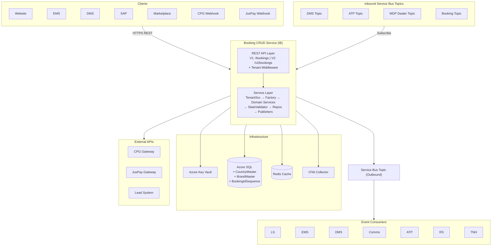
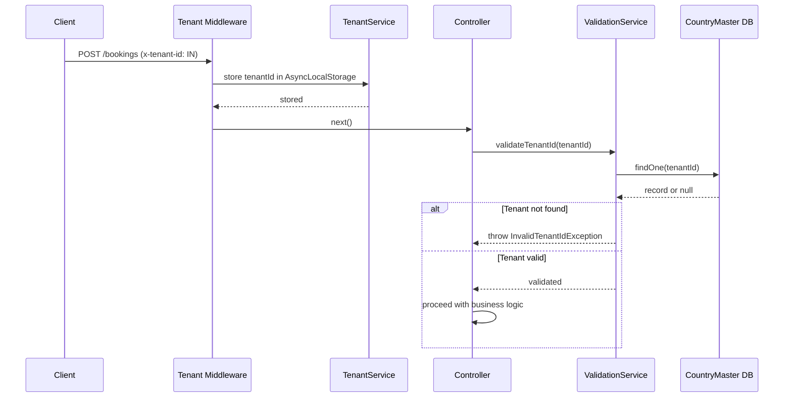
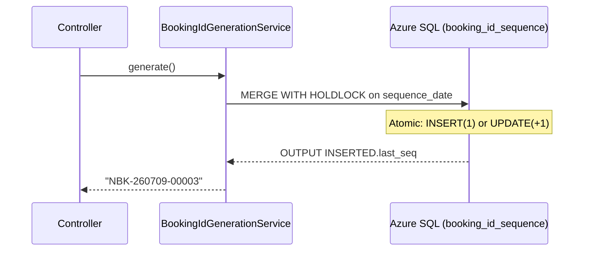
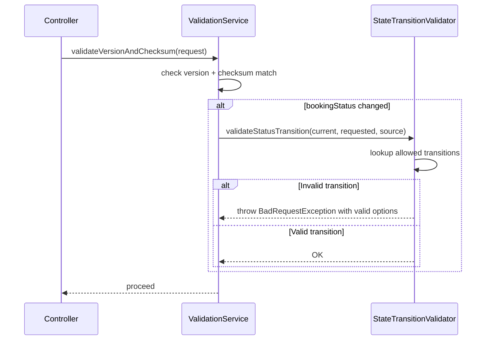
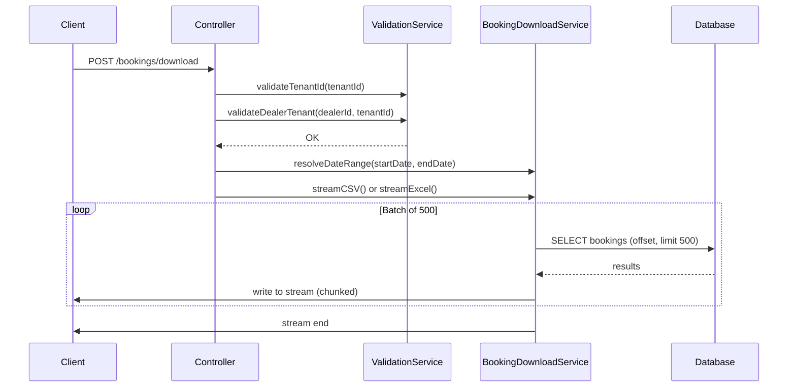
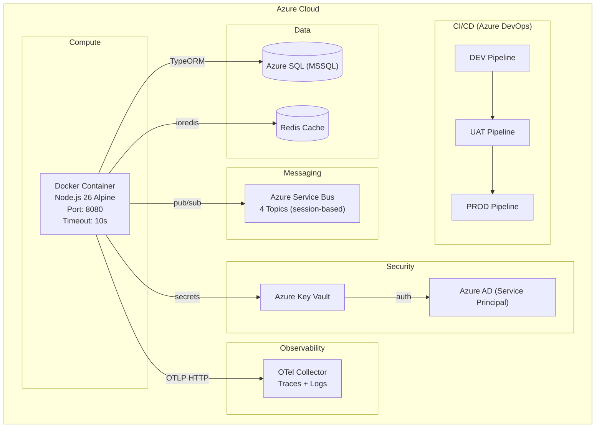

# High Level Design — Booking CRUD Services (International Business)

**Branch**: `main_IB`

---

## Overview

Booking CRUD Services (IB) is the international variant of TVS Motor's vehicle booking microservice. It extends the domestic platform with multi-tenant support, structured booking IDs, state-machine-based status validation, reservation booking flows, and data export capabilities — serving international dealer networks across multiple countries.

---

## Tier Classification

**Tier 1: Mission Critical Application**

---

## Background

The IB branch was created to support TVS Motor's international expansion. Key drivers:

- Multi-country operations require tenant isolation and country-specific configuration
- International dealers need structured booking IDs (`NBK-YYMMDD-XXXXX`) instead of opaque UUIDs
- Different markets have different booking flows (normal vs reservation)
- Regulatory requirements demand explicit state machine validation for status transitions
- International operations need bulk data export (CSV/Excel) for reporting

---

## Requirements

### Functional (IB-Specific)

- Multi-tenant support via `x-tenant-id` header with CountryMaster validation
- Structured booking ID generation (daily sequence, format: `NBK-YYMMDD-XXXXX`)
- Reservation booking flow (Reserved → Confirmed → Ordered → Allocated → Invoiced → Delivered)
- State machine validation for all status transitions
- Brand validation for reservation bookings
- Booking data download as CSV or Excel (streaming, paginated)
- Duplicate booking prevention per customer phone number + source
- Line-item-level product/vehicle ID validation
- Dealer-tenant association validation

### Non-Functional

- Same as domestic (10s timeout, eventual consistency, OTel tracing, journaling)
- Additional: tenant context propagation via AsyncLocalStorage
- Additional: atomic booking ID generation with HOLDLOCK (no duplicates under concurrency)

---

## System Architecture



---

## IB-Specific Components (★ = new vs domestic)

| Component | Technology | Role |
|-----------|-----------|------|
| ★ **Tenant Middleware** | AsyncLocalStorage | Extracts `x-tenant-id` header, propagates via request context |
| ★ **TenantService** | NestJS Injectable | Resolves tenant from context or config fallback |
| ★ **BookingIdGenerationService** | SQL MERGE + HOLDLOCK | Atomic daily sequence for `NBK-YYMMDD-XXXXX` |
| ★ **StateTransitionValidatorService** | State machine maps | Validates status change legality per booking type |
| ★ **BookingDownloadService** | ExcelJS + PassThrough streams | Batch-paginated CSV/Excel export |
| ★ **V2 Controller** | NestJS Controller | `/v2/bookings` — auto-generates leadId, delegates to V1 |
| ★ **CountryMaster entity** | TypeORM | Tenant registry |
| ★ **BrandMaster entity** | TypeORM | Brand validation for reservations |
| ★ **BookingIdSequence entity** | TypeORM | Daily sequence counter table |
| ★ **Invoice entity** | TypeORM | Normalized invoice storage |

### Pros
- Multi-tenant isolation enables single deployment for all countries
- State machine prevents invalid status transitions at validation layer
- Structured booking IDs are human-readable and debuggable
- Download feature reduces need for direct DB access by operations teams

### Cons
- Additional DB round-trip for tenant validation on every request
- Booking ID generation holds DB lock briefly (potential bottleneck at extreme scale)
- State machine adds complexity for every new status or booking type

---

## Data Flow / Sequence Diagrams

### 1. Multi-Tenant Request Flow



### 2. Booking ID Generation



### 3. State Machine Validation



### 4. Booking Download (CSV/Excel Streaming)



### 5. Creation, Modification, Cancellation

Same as domestic (see `docs/HLD.md`) with these IB additions:
- **Creation**: `BookingIdGenerationService.generate()` replaces `generateUUID()`
- **Creation**: `validateTenantId()` + `validateOpenBookingByCustomerNumber()` called first
- **Modification**: `validateVehicleUpdateProductIds()` validates line-item IDs
- **Modification**: `StateTransitionValidatorService` validates bookingStatus changes
- **V2 Create**: Auto-generates `leadId` if not provided

---

## Scalability Approach

| Aspect | Strategy |
|--------|----------|
| **Concurrent bookings** | Optimistic concurrency (UUID + checksum + version) — no DB-level locks for reads |
| **Booking ID generation** | HOLDLOCK scope limited to single row per day — minimal contention |
| **Download large datasets** | Streaming with batches of 500 — constant memory regardless of result size |
| **Service Bus processing** | MDP listener: serial session processing. ATP/DMS: session-per-message with infinite retry loop |
| **Multi-tenant** | Single deployment serves all tenants — horizontal scaling via container replicas |
| **External API calls** | JusPay token cached (TTL-based, singleton). CPG per-request. Fire-and-forget publishing via `setImmediate` |
| **HTTP timeout** | 10 seconds — prevents slow requests from blocking the pool |

---

## Error Handling Strategy

| Layer | Strategy |
|-------|----------|
| **HTTP Validation** | `ValidationPipe` with `whitelist: true` — rejects unknown/invalid fields with 400 |
| **Business Validation** | Custom exceptions (`InvalidUUIDException`, `BookingLockedException`, etc.) → re-thrown as 400 |
| **State Machine** | Invalid transitions throw `BadRequestException` with valid options listed |
| **Tenant Errors** | Missing/invalid tenant → `InvalidTenantIdException` (400) |
| **External API Failures** | CPG: fail-fast (no retry). JusPay: 2 attempts with 300ms backoff |
| **Service Bus Listeners** | Messages abandoned on error → Service Bus redelivers (up to max delivery count) |
| **Service Bus Publish** | Failures logged to `BookingTopicLog` with status "failed" — no retry (eventual consistency) |
| **Transaction Rollback** | Cancellation workflow uses QueryRunner transaction — rolls back on failure |
| **Global Exception Filter** | Catches unhandled exceptions → returns structured `{statusCode, message, timestamp}` |
| **Graceful Shutdown** | SIGINT/SIGTERM → close app → shutdown OTel → exit |

---

## Deployment Topology



### Environments

| Environment | Pipeline |
|-------------|----------|
| DEV | `AST_Website_Corporate_booking_crud_services_DEV_Pipeline.yml` |
| UAT | `azure-pipelines/ast-booking-crud-uat-pipeline.yaml` |
| PROD | `azure-pipelines/ast-booking-crud-prod-pipeline.yaml` |

### IB-Specific Configuration

| Variable | Purpose |
|----------|---------|
| `TENANT_ID_REQUIRED` | `true` = `x-tenant-id` header mandatory; `false` = use fallback |
| `DEFAULT_TENANT_ID` | Fallback tenant ID when header not required |
| `IS_NORTON_BOOKING` | Controls Norton-specific event target routing |

---

## Key Design Decisions

| Decision | Chosen | Alternative | Reason |
|----------|--------|-------------|--------|
| Booking ID | DB MERGE + HOLDLOCK | Redis INCR | DB guarantees uniqueness; Redis risks duplicates on failure |
| Multi-Tenancy | `x-tenant-id` header | URL-path-based (`/{tenantId}/bookings`) | Simpler, backward-compatible API routes |
| State Machine | Hardcoded maps in code | DB-configurable transitions | Simpler, version-controlled; not enough states to justify DB |
| Download | ExcelJS streaming + PassThrough | Generate full file in memory | Memory-safe for large datasets |
| V2 API | Separate controller delegating to V1 | Duplicate logic | DRY — V2 only adds leadId auto-generation |

---

## Metrics to be Tracked

| Category | Metric |
|----------|--------|
| **Availability** | Health check uptime (`GET /bookings/health`) |
| **Latency** | API response time per endpoint (OTel traces) |
| **Multi-Tenancy** | Requests per tenant, invalid tenant rejections |
| **Booking IDs** | Sequence generation rate, lock contention |
| **Downloads** | Download requests per dealer, file sizes, stream durations |
| **State Machine** | Invalid transition attempts (signals integration issues) |
| **Messaging** | Publish success/failure rate (from BookingTopicLog) |
| **Refunds** | CPG/JusPay API call success/failure/latency |

---

## Risks

| Risk | Impact | Mitigation |
|------|--------|------------|
| Booking ID lock contention | Slow ID generation under burst traffic | HOLDLOCK is brief; sequence per day limits contention |
| Tenant header missing | Request rejected or wrong tenant | `TENANT_ID_REQUIRED` config + `DEFAULT_TENANT_ID` fallback |
| State machine mismatch | Valid operations rejected | Comprehensive transition maps + clear error messages |
| Download OOM for large datasets | Service crash | Streaming with batches of 500, never loads all into memory |
| ATP/DMS listener not configured | Listener fails to start | Skip initialization if endpoint is empty (Norton use case) |

---

## Appendix

### IB-Specific Glossary

| Term | Meaning |
|------|---------|
| **NBK** | Norton Booking (booking ID prefix) |
| **Tenant** | Country/region identifier for multi-tenant isolation |
| **Reservation Booking** | Website Reservation flow with brand validation and Reserved initial state |
| **State Machine** | Allowed status transition map per booking type |
| **PAM** | Parts, Accessories, Merchandise (booking type) |
| **TNH** | Norton event target (TVS Norton Holdings) |

### Booking ID Format

```
NBK-YYMMDD-XXXXX
 │    │       │
 │    │       └── 5-digit zero-padded daily sequence
 │    └────────── UTC date (year-month-day)
 └─────────────── Fixed prefix (Norton Booking)
```
---
