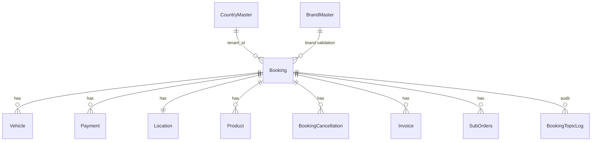

# Low Level Design — Booking CRUD Services (International Business)

**Branch**: `main_IB`

---

## Overview

Booking CRUD Services (IB) is the international variant of TVS Motor's vehicle booking backend. It manages the full booking lifecycle (creation, modification, cancellation, retrieval, refund, data export) for international dealer networks. The IB variant extends the domestic service with multi-tenant isolation, structured booking IDs (`NBK-YYMMDD-XXXXX`), state-machine-based status validation, reservation booking flows, and CSV/Excel download capabilities.

---

## High Level Design - Quick Recap

Reference doc: [docs/IB/HLD.md](./HLD.md)

- NestJS 11 monolithic service with TypeORM (MSSQL)
- Multi-tenant via `x-tenant-id` header + AsyncLocalStorage propagation
- Structured booking IDs: `NBK-YYMMDD-XXXXX` (DB sequence with HOLDLOCK)
- State machine validation for all status transitions
- Factory pattern routes requests to domain-specific services
- Event-driven publishing via Azure Service Bus
- Optimistic concurrency: UUID + SHA-256 checksum + version
- 4 Service Bus listeners for inbound event processing
- V2 API layer delegates to V1 with auto-generated leadId

---

## Assumptions

- All external API calls (CPG, JusPay, Lead System) use OAuth2/token-based auth with secrets from Azure Key Vault
- Redis is used for dealer/product master data caching
- All APIs are behind an API gateway (no service-level auth in this codebase)
- Database schema is managed manually (synchronize: false) — no auto-migrations
- Service Bus topics use session-based message delivery (sessionId = booking UUID)
- `class-validator` with `whitelist: true` strips unknown properties from request bodies
- `country_master` table must be pre-populated with valid tenant records
- `brand_master` table must be populated for reservation booking validation
- ATP and DMS listeners skip initialization when their endpoint is empty (Norton use case)
- `IS_NORTON_BOOKING` config flag determines TNH event target routing

---

## Code Structure

```
src/
├── main.ts                          # Bootstrap (OTel → NestJS → Swagger → Listen)
├── app.module.ts                    # Root module
├── otel.ts                          # OpenTelemetry setup (traces + logs)
│
├── bookings/                        # Core feature module
│   ├── controllers/
│   │   ├── bookings.controller.ts   # V1 REST API (all endpoints)
│   │   └── v2Bookings.controller.ts # V2 REST API (delegates to V1)
│   ├── middleware/
│   │   ├── tenant.middleware.ts     # x-tenant-id extraction → AsyncLocalStorage
│   │   └── tenant.context.ts       # AsyncLocalStorage instance
│   ├── dto/                         # Request/response DTOs with class-validator
│   │   ├── booking-creation/
│   │   ├── booking-modification/
│   │   ├── booking-retrieval/
│   │   ├── booking-refund-status-update/
│   │   ├── refund/
│   │   └── support-operations/
│   └── services/
│       ├── booking-factory.service.ts        # Routes requests by type/action
│       ├── tenant/tenant.service.ts          # Tenant resolution ★
│       ├── state-transition-validator/       # Status state machine ★
│       ├── booking-creation/
│       │   ├── online-booking/
│       │   ├── offline-booking/
│       │   ├── pre-booking/
│       │   └── booking-id-generation/        # NBK-YYMMDD-XXXXX ★
│       ├── booking-modification/
│       │   ├── payment/
│       │   ├── vehicle/
│       │   ├── dealer/
│       │   ├── customer/
│       │   ├── invoice/
│       │   ├── gate-pass/
│       │   ├── bto-status-update/
│       │   ├── retail-finance/
│       │   ├── vehicle-allocation/
│       │   ├── dse-assign/
│       │   └── booking-update/
│       ├── booking-cancellation/
│       ├── booking-refund/
│       ├── booking-refund-status-update/
│       ├── booking-retrieval/
│       │   └── booking-download.service.ts   # CSV/Excel streaming ★
│       ├── noise/                            # Sub-order/noise booking logic
│       ├── validation/validation.service.ts
│       ├── publisher/                        # 8 event publishers
│       ├── custom-repositories/              # Data access layer
│       │   ├── booking-repository/
│       │   ├── payment-repository/
│       │   ├── vehicle-repository/
│       │   ├── cancellation-repository/
│       │   ├── refund-repository/
│       │   ├── mdp-repository/
│       │   └── logging-repository/
│       ├── cpg.service.ts
│       ├── jusPay.service.ts
│       ├── lead-service/
│       ├── atp-handler/
│       ├── dms-integration/
│       ├── mdp/
│       └── exception-handler/
│
├── cloud-conductor/                 # Azure integration module
│   └── services/
│       ├── keyvault/                # Secret retrieval
│       ├── listener/                # 4 Service Bus consumers
│       │   ├── topic-listener.service.ts        # BS subscription
│       │   ├── atp-topic-listener.service.ts    # ATP subscription
│       │   ├── dms-topic-listener.service.ts    # DMS subscription
│       │   └── mdp-dealer-topic-listener.service.ts  # MDP subscription
│       ├── publisher/               # Service Bus producer
│       └── model-transformer/       # DTO → SB message transformers
│
├── database/entities/               # TypeORM entity definitions
│   ├── booking.entity.ts
│   ├── payment.entity.ts
│   ├── vehicle.entity.ts
│   ├── location.entity.ts
│   ├── product.entity.ts
│   ├── booking-cancellation.entity.ts
│   ├── booking-id-sequence.entity.ts  ★
│   ├── country-master.entity.ts       ★
│   ├── brand-master.entity.ts         ★
│   ├── invoice.entity.ts             ★
│   └── ... (20+ entities total)
│
├── logger/                          # Winston + OTel logging service
└── shared/
    ├── constants/constants.ts       # All enums and constants
    ├── exceptions/                  # Custom exception classes
    └── utils.ts                     # UUID, checksum, response helpers
```

★ = IB-specific additions (not in domestic branch)

---

## Components

### Controller Layer

| Component | File | Responsibility |
|-----------|------|----------------|
| `BookingsController` | `src/bookings/controllers/bookings.controller.ts` | V1 controller — all HTTP endpoints. Creates JournalDto, orchestrates validation → factory → service → publish → journal |
| `V2BookingsController` | `src/bookings/controllers/v2Bookings.controller.ts` | V2 controller — delegates to V1. Auto-generates `leadId` if missing on create |

### Middleware Layer

| Component | File | Responsibility |
|-----------|------|----------------|
| `TenantMiddleware` | `src/bookings/middleware/tenant.middleware.ts` | Extracts `x-tenant-id` header, stores in AsyncLocalStorage. Skips for `/health` and Swagger |
| `tenantStorage` | `src/bookings/middleware/tenant.context.ts` | AsyncLocalStorage instance holding `{ tenantId: string }` |

### Factory Layer

| Component | File | Responsibility |
|-----------|------|----------------|
| `BookingFactoryService` | `src/bookings/services/booking-factory.service.ts` | Maps enum types to service instances via Record maps. Throws for invalid types |

### Domain Services (Creation)

| Service | File | Responsibility |
|---------|------|----------------|
| `OnlineBookingService` | `services/booking-creation/online-booking/online-booking.service.ts` | Validates product/dealer/brand, upserts booking by leadId (transaction) |
| `OfflineBookingService` | `services/booking-creation/offline-booking/offline-booking.service.ts` | Creates confirmed booking with booking number + payment |
| `PreBookingService` | `services/booking-creation/pre-booking/pre-booking.service.ts` | Creates pre-booking (status: Pre Booking Initiated) |
| `BookingIdGenerationService` | `services/booking-creation/booking-id-generation/booking-id-generation.service.ts` | Atomic `NBK-YYMMDD-XXXXX` ID via SQL MERGE + HOLDLOCK |

### Domain Services (Modification)

| Service | File | Responsibility |
|---------|------|----------------|
| `PaymentService` | `services/booking-modification/payment/payment.service.ts` | Saves payment record, updates booking status/dates |
| `VehicleAllocationService` | `services/booking-modification/vehicle-allocation/` | Assigns frame/engine numbers |
| `VehicleDeallocationService` | `services/booking-modification/vehicle-allocation/` | Removes frame/engine allocation |
| `DealerChangeService` | `services/booking-modification/dealer/dealer-change.service.ts` | Generates new NBK ID, creates new booking, cancels old |
| `InvoiceUpdateService` | `services/booking-modification/invoice/` | Attaches invoice(s), updates status |
| `InvoiceCancellationService` | `services/booking-modification/invoice/` | Removes invoice, reverts status |
| `GatepassService` | `services/booking-modification/gate-pass/` | Records delivery date, updates status |
| `CustomerInfoUpdateService` | `services/booking-modification/customer/` | Updates customer fields |
| `VehicleUpdateService` | `services/booking-modification/vehicle/` | Updates vehicle model/variant/color/products |
| `RetailFinanceService` | `services/booking-modification/retail-finance/` | Stores retail finance JSON |
| `BTOStatusUpdateService` | `services/booking-modification/bto-status-update/` | Updates BTO status + dates + refundable amount |
| `DealerAssignService` | `services/booking-modification/dse-assign/` | Assigns DSE to booking |
| `WholeBookingUpdateService` | `services/booking-modification/booking-update/` | Bulk field update (from DMS) |
| `BTOFrameNumberAdditionService` | `services/booking-modification/vehicle-allocation/` | Frame/engine for BTO vehicles |

### Domain Services (Cancellation & Refund)

| Service | File | Responsibility |
|---------|------|----------------|
| `BookingCancellationWorkflowService` | `services/booking-cancellation/booking-cancellation-workflow.service.ts` | Orchestrator: TX → validate → cancel → refund → publish → commit |
| `BookingCancellationService` | `services/booking-cancellation/booking-cancellation.service.ts` | Updates status, saves cancellation record |
| `BookingRefundService` | `services/booking-refund/booking-refund.service.ts` | Auto-refund (from SB event) |
| `BookingFnFRefundService` | `services/booking-refund/booking-fnf-refund.service.ts` | FnF refund via API endpoint |
| `CpgRefundService` | `services/booking-refund/cpg-refund.service.ts` | CPG-specific refund logic |
| `JusPayRefundService` | `services/booking-refund/jusPay-refund.service.ts` | JusPay-specific refund logic |
| `CcavenueRefundService` | `services/booking-refund/ccavenue-refund.service.ts` | CCAvenue-specific refund logic |
| `BookingRefundStatusUpdateService` | `services/booking-refund-status-update/` | Processes CPG/JusPay/CCAvenue status webhooks |

### Domain Services (IB-Specific)

| Service | File | Responsibility |
|---------|------|----------------|
| `TenantService` | `services/tenant/tenant.service.ts` | Resolves tenant from AsyncLocalStorage or `DEFAULT_TENANT_ID` fallback |
| `StateTransitionValidatorService` | `services/state-transition-validator/state-transition-validator.service.ts` | Validates booking status transitions per booking type |
| `BookingDownloadService` | `services/booking-retrieval/booking-download.service.ts` | Streams booking data as CSV or Excel (batch of 500) |

### Repository Layer

| Service | Responsibility |
|---------|----------------|
| `BookingRepositoryService` | CRUD on Booking entity + related entities. All writes use transactional EntityManager |
| `PaymentRepositoryService` | Payment entity CRUD |
| `VehicleRepositoryService` | Vehicle entity CRUD (allocation, deallocation, status sync) |
| `CancellationRepositoryService` | BookingCancellation entity operations |
| `RefundRepositoryService` | BookingRefund + RefundTransactionLog operations |
| `MDPRepositoryService` | DealerMaster + DmsVehicleMaster + BrandMaster + DealerContact + DealerFlag operations |
| `LoggingRepositoryService` | BookingJournal, BookingTopicLog, RequestLog, AtpLog, MdpLog, DmsLog writes |

### Infrastructure Services

| Service | Responsibility |
|---------|----------------|
| `CPGService` | AES-128/256 encryption/decryption, token generation, refund API calls (transient scope) |
| `JusPayService` | OAuth2 token (cached singleton with TTL), refund API with retry (transient scope) |
| `LeadService` | OAuth2 token + APIM subscription key, updates lead status |
| `ValidationService` | Checksum/version, tenant, dealer-tenant, product/dealer/brand, state machine, line-item IDs |
| `ExceptionHandlerService` | Routes known exceptions as-is, wraps unknown as InternalServerError |
| `TopicPublisherService` | Sends messages to Service Bus, logs every publish to BookingTopicLog |
| `SecretService` | Reads secrets from Azure Key Vault |

### Publisher Layer

| Service | Events Published |
|---------|-----------------|
| `BookingCreationPublisherService` | BOOKING_INITIATED, BOOKING_CREATED |
| `BookingModificationPublisherService` | FULL_PAYMENT_UPDATED, VEHICLE_UPDATED, CUSTOMER_INFO_UPDATED, DMS_BOOKING_UPDATE, INVOICED, INVOICE_CANCEL, VEHICLE_ALLOCATION, VEHICLE_DEALLOCATION, GATEPASS_UPDATE, RETAIL_FINANCE_UPDATE, DEALER_UPDATED |
| `BookingCancellationPublisherService` | BOOKING_CANCELLED |
| `BookingRefundPublisherService` | BOOKING_REFUND_INITIATED/SUCCESS/FAILURE, FNF_BOOKING_REFUND_* |
| `BookingRefundStatusUpdatePublisherService` | Refund status update events |
| `ATPHandlerPublisherService` | ATP_BOOKING_CREATED, ATP_FULL_PAYMENT_UPDATED |
| `DMSIntegrationPublisherService` | DMS_BOOKING_NO_UPDATED |
| `BTOStatusUpdatePublisher` | ORDER_MANUFACTURED/PACKED/DISPATCHED/AT_DEALERSHIP |

### Listener Layer

| Listener | Topic | Events Consumed | Action |
|----------|-------|-----------------|--------|
| `TopicListenerService` | `prod.booking` (bs-booking-subscription) | BOOKING_CANCELLED, BOOKING_REFUND_CCAVENUE_STATUS | Auto-refund, CCAvenue status |
| `ATPTopicListenerService` | ATP Topic | Vehicle ETA, Comms, milestones | Update ETA, process ATP |
| `DMSTopicListenerService` | DMS Topic | DMS_BOOKING_CREATED | Link DMS booking number |
| `MDPDealerTopicListenerService` | MDP Dealer Topic | DEALER_CREATED/UPDATED, VEHICLE_CREATED/UPDATED, LLP events | Sync master data |

---

## API Design

### Endpoints

| Method | Route | Status | Description |
|--------|-------|--------|-------------|
| POST | `/bookings` | 202 | Create booking |
| PUT | `/bookings` | 202 | Update booking |
| POST | `/bookings/bto_status` | 202 | Update BTO status |
| POST | `/bookings/search` | 200 | Search bookings |
| PUT | `/bookings/cancel` | 200 | Cancel booking |
| POST | `/bookings/fnfrefund` | 200 | FnF refund |
| POST | `/bookings/refundstatus` | 200 | CPG webhook |
| POST | `/bookings/juspayrefundstatus` | 200 | JusPay webhook |
| POST | `/bookings/download` | 200 | Download CSV/Excel |
| POST | `/bookings/testbookingtopic` | 200 | Test publish |
| GET | `/bookings/health` | 200 | Health check |
| POST | `/v2/bookings` | 202 | V2 create (auto leadId) |
| PUT | `/v2/bookings` | 202 | V2 update (delegates V1) |
| GET | `/v2/bookings/health` | 200 | V2 health |

### Status Codes

| Code | Meaning |
|------|---------|
| 200 | Success (search, cancel, refund, download) |
| 202 | Accepted (create, modify — async publishing follows) |
| 400 | Validation error (checksum, invalid type, state machine, tenant) |

### Error Codes

| Error | Trigger |
|-------|---------|
| `Invalid UUID` | Booking not found |
| `Version or Checksum Mismatch Error` | Optimistic concurrency conflict |
| `Booking is locked` | version = -1 |
| `Booking is already cancelled` | version = 0 |
| `Invalid tenant ID` | Tenant not in CountryMaster |
| `Dealer X does not belong to tenant Y` | Dealer-tenant mismatch |
| `Invalid status transition...` | State machine rejection |
| `brandCode is required for Reservation Booking` | Reservation without brand |
| `Invalid brandCode` | Brand not in BrandMaster |
| `Invalid product Id X for booking Y` | Line-item ID not found |
| `Invalid vehicle Id X for booking Y` | Vehicle ID not found |
| `Booking is open` | Duplicate marketplace booking by phone |

### Idempotency Rules

- **Create**: Same `leadId` with status ≠ Initiated → returns `BOOKING_ALREADY_EXISTS`
- **Create (Initiated)**: Same `leadId` with Initiated → upserts existing record
- **BTO Status**: Same `btoStatus` as current → returns `BTO_STATUS_ALREADY_UPDATED` (no-op)
- **V2 Create**: Auto-generates `leadId` if not provided → always unique

---

## Data Model / Schema Changes

### Core Entity: Booking

| Column | Type | Purpose |
|--------|------|---------|
| UUID | VARCHAR(20) PK | Booking ID (`NBK-YYMMDD-XXXXX`) |
| customerName | VARCHAR(200) | Customer name |
| customerMobileNumber | VARCHAR(18) | Phone |
| leadId | VARCHAR | CRM lead reference |
| dealerId | VARCHAR | Dealer SAP code |
| branchId | VARCHAR | Branch code |
| bookingSource | VARCHAR(20) | Origin system |
| bookingStatus | VARCHAR(50) | Current lifecycle state |
| btoStatus | VARCHAR(50) | BTO lifecycle state |
| tenant_id | VARCHAR(20) | Tenant association ★ |
| dse_name | VARCHAR(200) | DSE name ★ |
| version | INT | Optimistic concurrency |
| checksum | NVARCHAR(MAX) | SHA-256 hash |
| bookingNumber | INT | Sequential per dealer+branch |
| dirty | BIT | Master data validation failed |
| refundableAmount | DECIMAL(10,2) | BTO refundable |

★ = IB-specific columns

### IB-Specific Entities

**BookingIdSequence** (`booking_id_sequence`)

| Column | Type | Purpose |
|--------|------|---------|
| sequence_date | DATE (PK) | UTC date for the sequence |
| last_seq | INT | Current sequence number |

**CountryMaster** (`country_master`)

| Column | Type | Purpose |
|--------|------|---------|
| country_code | VARCHAR(10) PK | ISO code |
| tenant_id | VARCHAR(20) | Tenant identifier |
| country_name | VARCHAR(100) | Display name |
| created_at | DATETIME | Record creation |

**BrandMaster** (`brand_master`)

| Column | Type | Purpose |
|--------|------|---------|
| brand_code | INT (PK) | Brand identifier |
| tenant_id | VARCHAR(20) (PK) | Tenant association |
| model_name | VARCHAR(50) | Model name |
| created_on | DATETIME | Record creation |

**Invoice** (`invoice`)

| Column | Type | Purpose |
|--------|------|---------|
| Id | INT (PK, Identity) | Auto-increment |
| bookingUUID | VARCHAR(20) FK | Booking reference |
| invoiceId | VARCHAR(100) | Invoice reference |
| invoiceValue | DECIMAL(10,2) | Amount |
| nortonInvoiceNumber | VARCHAR(100) | Norton-specific |
| vehicleId | INT | Line-item reference |
| productId | INT | Line-item reference |
| tenant_id | VARCHAR(20) | Tenant |
| is_active | BIT | Active flag |

### Relationships



### DB Indexes

```sql
INDEX [IX_customerId] ON Booking(customerId)
INDEX [IX_createdOn_dealerId_branchId] ON Booking(createdOn, dealerId, branchId)
INDEX [IX_dealerId_branchId_bookingStatus] ON Booking(dealerId, branchId, bookingStatus)
INDEX [IX_dealerId_branchId_bookingNumber] ON Booking(dealerId, branchId, bookingNumber)
INDEX [IX_bookingUUID] ON Invoice(bookingUUID)
INDEX [IX_bookingUUID_invoiceId] ON Invoice(bookingUUID, invoiceId)
```

---

## Class & Interface Design

### Interface Hierarchy

```mermaid
classDiagram
    class ICreateBookingService {
        +processBooking(request, data) BookingCreationResponseDto
    }
    class IModifyBookingService {
        +processUpdate(request, data) BookingModificationResponseDto
    }
    class IRetrievalBookingService {
        +fetchBookings(request) any
    }
    class ICancellationBookingService {
        +processCancellation(request, manager?) CancellationResponseDto
    }
    class IMessagePublisherService {
        +processPublish(request, bookingInfo, response?) void
    }
    class IBookingIdGenerationService {
        +generate() string
    }
    class IValidationService {
        +validateVersionAndChecksum()
        +validateBooking()
        +validateTenantId()
        +validateDealerTenant()
        +validateVehicleUpdateProductIds()
        +validateOpenBookingByCustomerNumber()
    }
```



### Dependency Injection Pattern

All services use interface-driven injection:
```typescript
@Inject(BookingRepositoryService)
private readonly bookingRepository: IBookingRepositoryService
```

---

## Error Handling & Retries

### Custom Exception Classes

| Exception | HTTP Status | Trigger |
|-----------|-------------|---------|
| `InvalidUUIDException` | 400 | Booking not found |
| `InvalidVersionOrChecksumException` | 400 | Concurrency conflict |
| `BookingLockedException` | 400 | version = -1 |
| `BookingCancelledException` | 400 | version = 0 |
| `BookingUpdateNotAllowed` | 400 | Vehicle allocated + restricted action |
| `BookingOpenException` | 400 | FnF on non-cancelled / duplicate marketplace |
| `InvalidTenantIdException` | 400 | Tenant not found in CountryMaster |
| `InitiatedBookingCancellException` | 400 | Non-marketplace Initiated cancel |
| `InvoicedBookingCancelException` | 400 | Marketplace invoiced cancel |
| `DeliveredBookingCancelException` | 400 | Marketplace delivered cancel |

### Retry Logic

| Component | Strategy |
|-----------|----------|
| JusPay refund API | 2 attempts, 300ms backoff |
| JusPay token | 2 attempts, 200ms backoff, singleton promise dedup |
| CPG refund API | No retry (fail-fast) |
| Service Bus listeners | Infinite while(true) loop with retry |
| Service Bus publish | No retry (logged as failed) |

### Timeout Thresholds

| Component | Timeout |
|-----------|---------|
| HTTP server | 10 seconds |
| Lead System token | 3 second TTL |
| JusPay token | `expires_in` from response - 5s |

---

## Security and Compliance

### Encryption

| Context | Method |
|---------|--------|
| CPG request/response payloads | AES-128-CBC (base64 key/IV from Key Vault) |
| CPG client secret | AES-128-CBC encrypted before transmission |
| JusPay response decryption | AES-128/256-CBC (hex key, zero IV) |
| Database connection | TLS (Azure SQL enforced) |
| Service Bus | TLS (Azure enforced) |

### Token Management

| System | Caching | TTL |
|--------|---------|-----|
| CPG | None (per-request) | N/A |
| JusPay | Static class-level singleton | `expires_in` - 5s |
| Lead System | Instance-level | 3 seconds |

### PII Handling

Booking entities store customer PII (name, phone, email, DOB, gender). No encryption at rest beyond Azure SQL TDE. No explicit data masking in responses.

---

## RBAC (Role-Based Access Control)

No application-level RBAC is implemented. Access control is handled at the API gateway/network layer. The service trusts all incoming requests.

Multi-tenancy provides data isolation: `validateDealerTenant()` ensures a dealer request from one tenant cannot access another tenant's dealers.

---

## Configuration Rules & Feature Flags

### Configuration Source

All configuration is in Azure Key Vault under `BOOKING_SERVICE_CONFIG` as JSON containing:
- Database connection, Service Bus endpoints, CPG/JusPay API URLs, Lead System config, crypto keys

### Environment Variables

| Variable | Description |
|----------|-------------|
| `APP_PORT` | HTTP server port |
| `KEYVAULT_URL` | Azure Key Vault endpoint |
| `BOOKING_SERVICE_DB_CONFIG` | KV secret name for DB config |
| `BOOKING_SERVICE_CONFIG` | KV secret name for service config |
| `BAS_DB_CLIENT_ID` | Azure AD service principal ID |
| `BAS_DB_CLIENT_SECRET` | Azure AD service principal secret |
| `OTEL_EXPORTER_OTLP_ENDPOINT` | OTel collector endpoint |
| `OTEL_SERVICE_NAME` | Service name for traces |
| `DEPLOYMENT_ENVIRONMENT` | Environment label |
| `TENANT_ID_REQUIRED` | Whether `x-tenant-id` header is mandatory |
| `DEFAULT_TENANT_ID` | Fallback tenant when header not required |
| `IS_NORTON_BOOKING` | Controls TNH event target routing |

### Feature Flags

| Flag | Source | Effect |
|------|--------|--------|
| `TENANT_ID_REQUIRED` | Env var | If `false`, uses DEFAULT_TENANT_ID when header missing |
| `IS_NORTON_BOOKING` | Env/Config | Adds TNH to event targets for booking initiation |
| `isATPConfigured` | Per-request | Determines ATP event publishing |
| Reservation source | `bookingSource` value | Triggers brand validation + Reserved initial state |

---

## Dependencies

### Internal

| Dependency | Required By | Impact if Unavailable |
|------------|-------------|----------------------|
| Azure SQL | All services | Complete service failure |
| Azure Key Vault | App startup | Service cannot start |
| Azure Service Bus | Publishers + Listeners | Events not published/consumed |
| Redis | MDPRepositoryService | Falls back to DB queries |

### External

| Dependency | Endpoint | Impact if Unavailable |
|------------|----------|----------------------|
| CPG Gateway | `https://pay.tvsmotor.com/api/*` | Auto/FnF refunds fail |
| JusPay Gateway | `https://apim.tvsmotor.com/cpg/api/v1/*` | Auto/FnF refunds fail |
| Lead System | `https://apim.tvsmotor.com/lead-service/api/lead/update` | Lead status not updated (silent failure) |
| CCAvenue | `https://api.ccavenue.com/apis/servlet/DoWebTrans` | CCAvenue verification fails |

### NPM (IB-Specific)

| Package | Purpose |
|---------|---------|
| `exceljs` | Excel file generation for download |
| `yamljs` | Swagger YAML output |

---

## Trade-offs & Alternatives Considered

| Decision | Chosen | Alternative | Reason |
|----------|--------|-------------|--------|
| Booking ID | DB MERGE + HOLDLOCK | Redis INCR | DB guarantees uniqueness; Redis risks duplicates on failure |
| Tenant propagation | AsyncLocalStorage | Request decoration | Cleaner — no need to pass through every method |
| State machine | Hardcoded maps | DB-configurable | Simpler, version-controlled |
| Download | ExcelJS streaming | Full in-memory generation | Memory-safe for large datasets |
| V2 API | Delegate to V1 | Duplicate logic | DRY — V2 only adds leadId |
| Concurrency | Checksum chain (SHA-256) | DB row locking | Stateless validation without locks |
| Async publish | `setImmediate` fire-and-forget | Outbox pattern | Simpler; TopicLog provides visibility |
| Token caching | Class-level singleton (JusPay) | Redis cache | JusPay is high-frequency; Lead System is low-frequency |

---

## Key Algorithms & Business Rules

### 1. Booking ID Generation
```
dateKey = format(now(), 'YYYY-MM-DD')
MERGE booking_id_sequence WITH (HOLDLOCK) ON sequence_date = dateKey
  WHEN MATCHED → UPDATE last_seq = last_seq + 1
  WHEN NOT MATCHED → INSERT (dateKey, 1)
  OUTPUT INSERTED.last_seq
bookingId = "NBK-" + YYMMDD + "-" + padStart(seq, 5, '0')
```

### 2. State Machine Transitions
```
NORMAL: Initiated → Confirmed → Ordered → Allocated → Invoiced → Delivered
RESERVATION: Reserved → Confirmed → (same as Normal)
Terminal states: Delivered, Cancelled (no further transitions)
Cancelled allowed from: most non-terminal states
```

### 3. Checksum Chain
```
initial_checksum = SHA-256(uuid)
next_checksum = SHA-256(current_checksum)
```

### 4. BTO Refundable Amount
```
btoKitPrice = dynamicPackage + dynamicProPackage + specialEditionColor
nonKitAmount = totalOnlineAmountPaid - btoKitPrice
refundableAmount = nonKitAmount + (percentage * btoKitPrice)

Percentage: Confirmed=75%, Manufactured=50%, Packed=25%, Dispatched=0%
```

### 5. Tenant Validation
```
1. Middleware extracts x-tenant-id → AsyncLocalStorage
2. Controller calls validateTenantId(tenantId)
3. Query CountryMaster WHERE tenantId = value
4. If not found → throw InvalidTenantIdException
5. For dealer operations: validateDealerTenant(dealerId, tenantId)
```

### 6. RS Event Target Logic
```
if bookingSource NOT IN (DMS, MARKETPLACE_AMAZON, MARKETPLACE_FLIPKART):
  add RS to event targets
```

### 7. DMS Source Filter
```
if updateSource == DMS → remove DMS from event targets (avoid echo)
```

---

## Testing Strategy

### Framework & Tools

| Tool | Purpose |
|------|---------|
| Jest 30 | Unit testing framework |
| ts-jest | TypeScript transformer |
| Supertest | HTTP integration testing |
| jest --coverage | Istanbul-based coverage |

### Commands

| Command | Description |
|---------|-------------|
| `yarn test` | Run all unit tests |
| `yarn test:watch` | Watch mode |
| `yarn test:cov` | Coverage report (HTML + lcov) |
| `yarn test:e2e` | End-to-end tests |

### Test File Convention

- Co-located: `*.spec.ts` next to source files
- Coverage excludes: DTOs, modules, migrations, interfaces, main.ts, database entities

### Key Test Patterns

| Pattern | Description |
|---------|-------------|
| **Mocked dependencies** | All injected services mocked via `jest.fn()` |
| **EntityManager mocks** | TypeORM `EntityManager`, `QueryRunner`, `DataSource` mocked |
| **External API mocks** | CPG, JusPay, Lead System HTTP calls mocked (no network) |
| **Transaction testing** | `QueryRunner` mock verifies commit/rollback flows |
| **Tenant context** | AsyncLocalStorage mocked for tenant propagation |
| **State machine** | Every valid + invalid transition path tested |

### IB-Specific Test Scenarios

| Component | Key Test Cases |
|-----------|---------------|
| `BookingIdGenerationService` | Sequence increment, daily reset, concurrent calls, format validation |
| `StateTransitionValidatorService` | Valid transitions pass, invalid throw with options, terminal states block all |
| `TenantService` | Resolves from context, falls back to default, returns undefined when mandatory |
| `ValidationService` (IB) | Tenant validation, dealer-tenant match, duplicate phone, brand validation, line-item IDs |
| `BookingDownloadService` | CSV format, Excel format, streaming, empty results, date range defaults |
| `V2BookingsController` | LeadId auto-generation, delegation to V1 |

### Coverage Goals

| Metric | Target |
|--------|--------|
| Line coverage | 80%+ |
| Branch coverage | 70%+ |
| State machine paths | 100% |
| Booking ID generation | 100% |
| Critical flows (cancel + refund) | 90%+ |

---

## Open Questions

- Should state machine transitions be configurable per tenant/country?
- Is there a plan for tenant-specific payment gateway configurations?
- Should the download endpoint have a max row limit?
- What is the retention policy for `booking_id_sequence` rows?
- Should `IS_NORTON_BOOKING` be moved to per-tenant config instead of env var?
- Is there a need for tenant-specific event targets on Service Bus?

---
