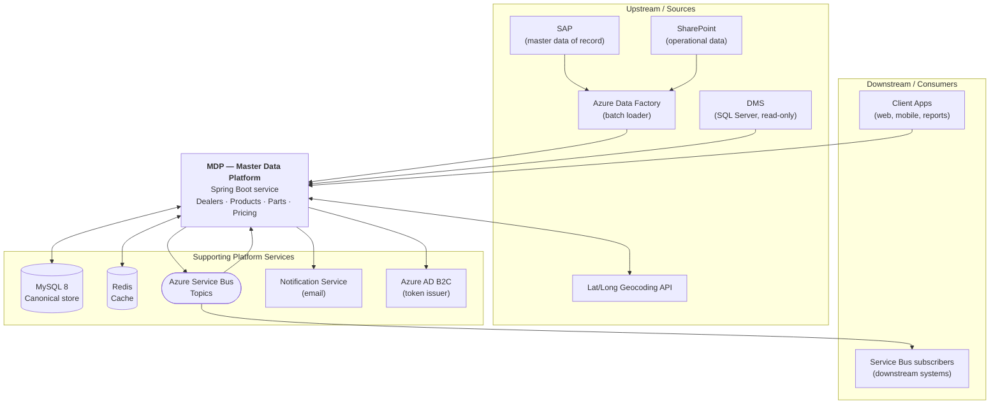
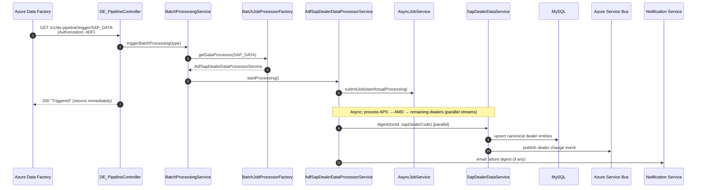
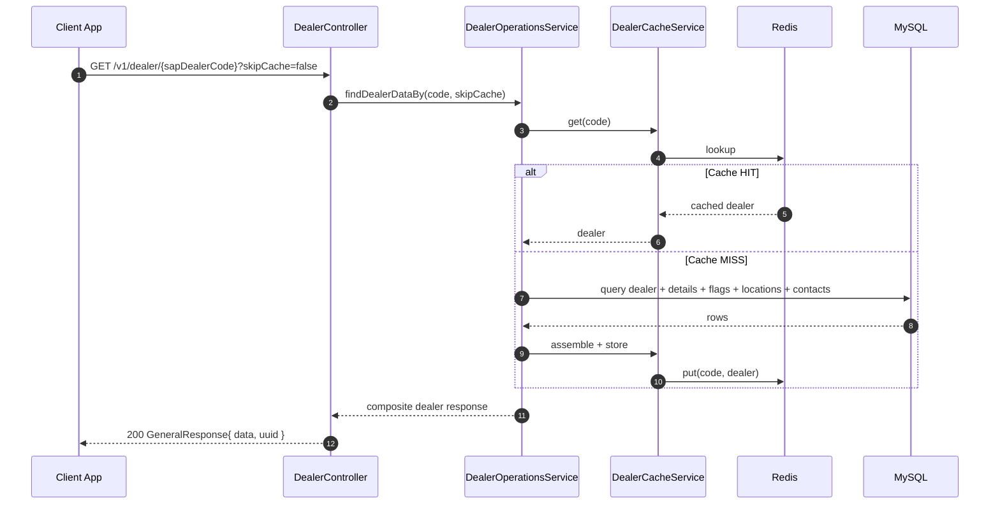
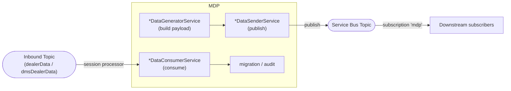
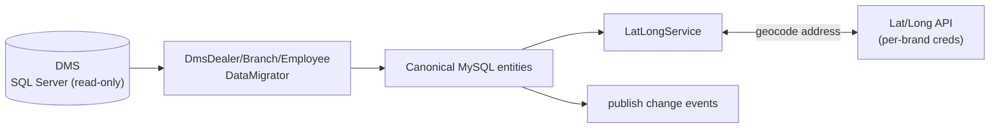
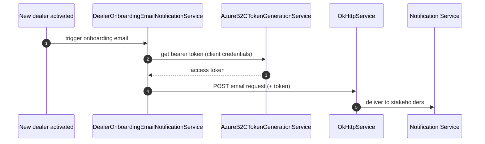
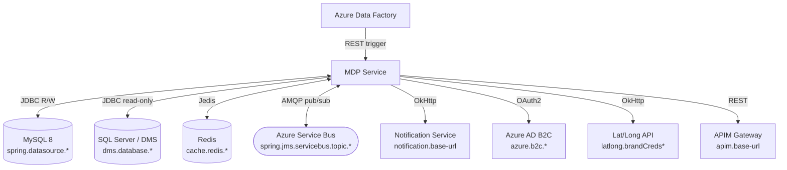
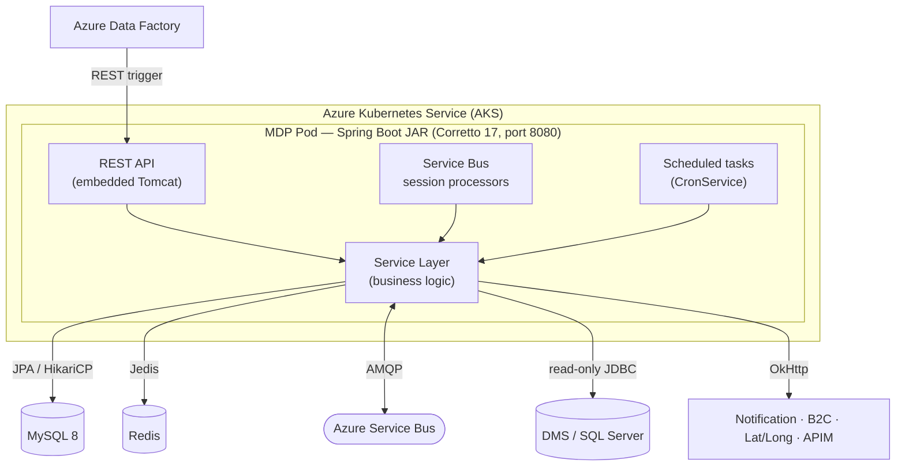
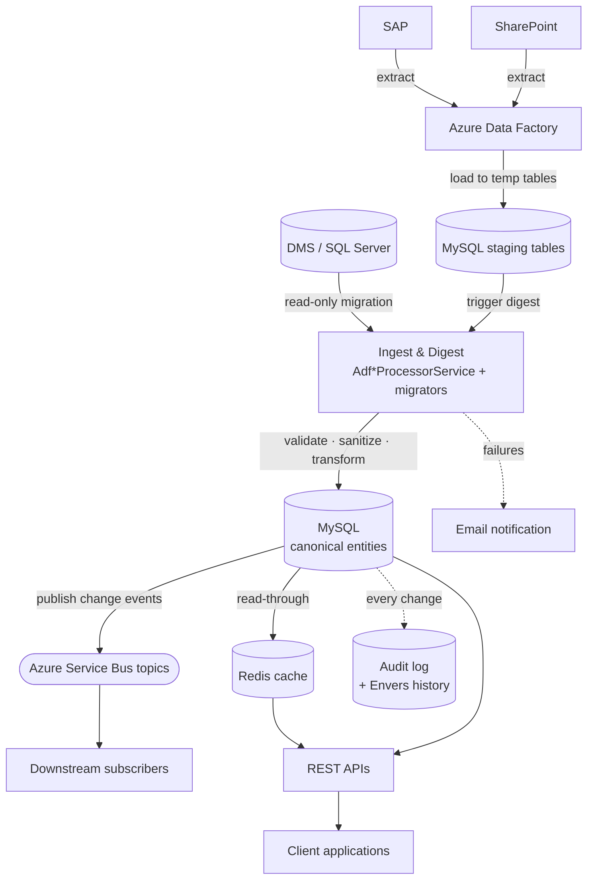

# MDP — Master Data Platform
## High-Level Code Document (Vendor Onboarding)

> Audience: engineers and partners onboarding to the Master Data Platform (MDP).
> Goal: understand the whole system — what it does, how it is structured, how data flows, and where to start reading code — without exposing secrets or sensitive business logic.
>
> Diagrams in this document use [Mermaid](https://mermaid.js.org/), which renders natively on GitHub and most Markdown viewers. The companion Confluence page hosts the same diagrams as editable draw.io diagrams.

---

## Table of Contents

1. [Application Overview](#1-application-overview)
2. [Major Modules / Components](#2-major-modules--components)
3. [Folder Structure Explanation](#3-folder-structure-explanation)
4. [Core Business Workflows](#4-core-business-workflows)
5. [Key Services / Classes](#5-key-services--classes)
6. [External Integrations](#6-external-integrations)
7. [Major Dependencies](#7-major-dependencies)
8. [Runtime Architecture](#8-runtime-architecture)
9. [Important Entry Points](#9-important-entry-points)
10. [High-Level Data Flow](#10-high-level-data-flow)
11. [Appendix: CI/CD & Conventions](#11-appendix-cicd--conventions)

---

## 1. Application Overview

MDP (Master Data Platform) is a Spring Boot service that is the **single source of truth and distribution hub** for TVS Motor Company's core master data. It ingests data from upstream systems, normalizes it into a canonical model, caches it for fast reads, serves it through versioned REST APIs, and publishes change events to downstream consumers.

The master-data domains it owns are: **Dealers** (and branches, contacts, employees, locations, flags, test-ride vehicles), **Vehicle Products**, **Product MnA**, **Parts**, **Vehicle Pricing**, and **Part Pricing**.

| Attribute | Value |
|-----------|-------|
| Language | Java 17 (Amazon Corretto) |
| Framework | Spring Boot 3.5.12 |
| Build Tool | Maven 3.9.x |
| Packaging | JAR (embedded Tomcat) |
| Primary Database | MySQL 8 |
| Secondary Source | SQL Server (DMS, read-only) |
| Cache | Redis (Jedis, standalone) |
| Messaging | Azure Service Bus (topics + subscriptions) |
| Auth | OAuth2 / Azure AD B2C (Bearer JWT) + client allow-list |
| Deployment | Docker → Azure Container Registry → Azure Kubernetes Service (AKS) |
| Port / Context | `8080` / `/mdp` |
| API Docs | Swagger UI at `/mdp/swagger-ui/index.html` (non-prod) |

**System context** — where MDP sits among the systems it talks to:



---

## 2. Major Modules / Components

MDP is organized into **self-contained domain modules** plus shared infrastructure, all under the base package `com.tvsmotor.mdp`. Each domain module repeats the same internal shape (`controller → service → repository + cache + service_bus + batch_processing`).

```mermaid
flowchart LR
    subgraph Domains["Business Domain Modules"]
        DEALER["Dealer\n(root packages)"]
        PROD["product\n(vehicles)"]
        MNA["product_mna"]
        PART["product_part"]
        PRICE["price\n(vehicle pricing)"]
        PPRICE["part_price"]
    end

    subgraph Shared["Shared Infrastructure (common/, config/, aop/)"]
        BATCH["batch_processing\nfactory + processors"]
        CACHE["cache\n(Redis)"]
        AUDIT["audit log\n(AuditLog + Envers)"]
        AOPX["aop\nauth · timing · prod-guard"]
        EXC["exceptions\n+ global handler"]
        UTIL["utils\nConstants · Context"]
    end

    Domains --> Shared
```



| Module | Responsibility |
|--------|----------------|
| **Dealer** (root: `controller`, `service`, `entity`, `repository`) | Dealers, branches, contacts, employees, locations, flags, test-ride vehicles, status; DMS migration; geocoding |
| **product** | Vehicle models, parts, specifications |
| **product_mna** | Product MnA data (legacy `ProductMna` + `ProductMnaNew`) |
| **product_part** | Parts master catalog + part markets |
| **price** | Vehicle pricing by location/market |
| **part_price** | Spare-part pricing |
| **common** | Shared infra: batch processing, cache, audit log, exceptions, utilities, generic service contracts |
| **config** | Spring beans: Service Bus clients, DMS datasource, OkHttp, request filter |
| **aop** | Cross-cutting: authentication, authorization, method timing, prod-only guards |

---

## 3. Folder Structure Explanation

```
src/main/java/com/tvsmotor/mdp/
├── MdpApplication.java              # Spring Boot entry point (@EnableCaching/Scheduling/Retry)
├── aop/                             # Aspect-Oriented Programming
│   ├── annotations/                 #   @Timed, @Authorization, @DisableOnProd
│   ├── AuthenticateAspect.java      #   JWT authentication enforcement
│   ├── AuthorizationAspect.java     #   Client allow-list / role enforcement
│   ├── DisableOnProdAspect.java     #   Blocks diagnostic endpoints in prod
│   └── TimedAspect.java             #   Method execution timing
├── common/                          # Shared infrastructure
│   ├── batch_processing/            #   AzureDataLakeDataBatchProcessor contract + factory
│   ├── cache/                       #   Redis cache abstraction (CacheService)
│   ├── config/                      #   ObjectMapper, Redis config
│   ├── entity/                      #   AuditLog, geographic state data
│   ├── enums/                       #   AuditLogType, CacheName, etc.
│   ├── exceptions/                  #   Custom exceptions + RestExceptionHandler
│   ├── model/                       #   Shared DTOs (redis, request, response, service_bus)
│   ├── repository/                  #   AuditLog repository
│   ├── service/                     #   AuditLogService, CronService, JsonHelperService, ServiceBusMessageConsumer
│   └── utils/                       #   Constants, Context (thread-local), GeneralUtils
├── config/                          # Application-level configuration
│   ├── DealerMasterServiceBusConfig #   Service Bus sender + session processor beans
│   ├── DmsDatabaseConfig            #   Secondary SQL Server (DMS) raw JDBC connection
│   ├── OkHttpClientConfig           #   Outbound HTTP client
│   ├── MdpOncePerRequestFilter      #   Per-request filter → populates Context
│   └── CustomConfiguration          #   Server/pod identifiers
├── controller/                      # REST API layer (dealer domain)
│   ├── DealerController             #   /v1/dealer/*, /v1/dealers/*
│   ├── DealerFlagsController(s)     #   Dealer feature flags (legacy + New)
│   ├── DealerStatusController       #   Dealer status operations
│   ├── DE_PipelineController        #   /v1/de-pipeline/trigger/{type} (ADF batch trigger)
│   ├── LatLongDetailsController     #   Geo-location endpoints
│   └── migration/                   #   One-time data-migration controllers
├── entity/                          # JPA entities (dealer domain) + batch_processing temp entities
├── enums/                           # DealerType, MdpDealerStatus, MdpClient, BatchProcessingType, ...
├── model/                           # Request/response DTOs, redis cache models, token models
├── repository/                      # Spring Data JPA repositories (dealer domain)
├── service/                         # Core dealer business logic
│   ├── batch_processing/            #   ADF processors (SAP dealer, sales-center, SharePoint)
│   ├── interfaces/                  #   Service contracts (Validateable, Sanitizeable, Saveable, ...)
│   ├── migration/                   #   DMS/Dealer/LatLong migrators
│   ├── notification_service/        #   Email notifications
│   └── service_bus/                 #   Producers + consumers (DealerData, DmsData)
├── product/  product_mna/  product_part/  price/  part_price/
│                                    # Self-contained domain modules (same internal shape)
└── utils/                           # JWT utilities, validation helpers

src/main/resources/
├── application.properties           # Base (non-environment-specific) config
├── application-{local,dev,uat,prod}.properties
├── db/migration/                    # Forward-only SQL migrations (v1.1 → v1.44)
└── logback-spring.xml               # Logging configuration

Dockerfile                           # Multi-stage build (Maven → Amazon Corretto 17)
azure-pipelines/                     # Per-environment CI/CD YAMLs
ci-pipeline.yaml / cd-pipeline.yaml  # Primary CI/CD entry points
```

---

## 4. Core Business Workflows

### 4.1 Batch Ingestion from SAP (via Azure Data Factory)

ADF dumps SAP extracts into MySQL **temp/staging tables**, then calls a single secured trigger endpoint. MDP digests the staged rows into the canonical model, asynchronously and in parallel.



`BatchProcessingType` routes each load to its processor: `SAP_DATA`, `SHAREPOINT_DATA`, `PRICE_VEHICLE_SAP_DATA`, `PRODUCT_VEHICLE_SAP_DATA`, `PRODUCT_MNA_SAP_DATA`, `PRODUCT_MNA_NEW_SAP_DATA`, `PART_SAP_DATA`, `PART_PRICE_SAP_DATA`.

### 4.2 Dealer Data Retrieval (Read API, cache-first)



### 4.3 Event Publishing & Consumption



- **Outbound:** after a digest/update, domain `*DataSenderService` classes publish change events to the relevant topic.
- **Inbound:** `DealerMasterServiceBusConfig` builds **session-based `ServiceBusProcessorClient`** beans (PEEK_LOCK) that route messages to `DealerDataConsumerService` and `DmsDataConsumerService`. The DMS consumer drives dealer/branch/employee migration.

### 4.4 DMS Migration & Geocoding



### 4.5 Dealer Onboarding Notification



---

## 5. Key Services / Classes

### Controllers (REST API layer)

| Class | Base Path | Purpose |
|-------|-----------|---------|
| `DealerController` | `/v1` | Dealer fetch by code, branches, filter, pincode, proximity, bulk, active counts |
| `DealerFlagsController` / `DealerFlagsNewController` | `/v1` | Dealer feature-flag management |
| `DealerStatusController` | `/v1` | Dealer status operations |
| `DE_PipelineController` | `/v1/de-pipeline/trigger` | ADF batch-processing trigger (authorized as `ADF`) |
| `LatLongDetailsController` | `/v1` | Geo-location services |
| `controller/migration/*` | `/v1` | One-time / ongoing data-migration triggers |
| Per-domain controllers | `/v1` | `ProductVehicleController`, `PriceVehicleController`, etc. |

### Core services

| Class | Responsibility |
|-------|----------------|
| `DealerOperationsService` | Orchestrates dealer reads (by code, pincode, bulk, counts, branches) |
| `DealerApisOperationsService` | Complex queries: type/status/flag filters, proximity search |
| `DealerCacheService` | Read-through Redis caching for dealer data |
| `SapDealerDataService` | Core SAP-to-canonical digest logic, per `sapDealerCode` |
| `DealerService` / `DealerDetailsService` / `DealerContactService` / `DealerEmployeeService` / `DealerLocationService` / `DealerTestRideVehicleService` | Per-entity CRUD with validation & sanitization |
| `DmsDealerOperationalService` + `service/migration/*` | DMS → canonical migration |
| `LatLongService` | Address geocoding via external API |
| `AsyncJobService` / `ParallelJobExecutor` | Async + parallel batch execution |
| `AuditLogService` | Persistent audit logging (`AuditLog` entity + Hibernate Envers) |
| `CronService` | Logs JVM / executor metrics periodically (every ~60s) |
| `AuthClientUserService` | Resolves API caller `clientId` → `AuthClientUser` |
| `NotificationSenderService` / `DealerOnboardingEmailNotificationService` | Outbound email via notification service |
| `AzureB2CTokenGenerationService` | Acquires outbound OAuth2 bearer tokens |
| Per-domain analogs | `ProductVehicleService`, `ProductMnaNewService`, `PartService`, `PriceVehicleService`, `PartPriceService` (+ their `*OperationService`, `*SapDataService`, `*CacheService`, `*DataSenderService`, `*DataConsumerService`) |

### Batch processing

| Class | Purpose |
|-------|---------|
| `BatchProcessingService` | Entry orchestrator for batch jobs |
| `BatchJobProcessorFactory` | Returns the right processor for a `BatchProcessingType` |
| `AzureDataLakeDataBatchProcessor` | Common processor contract (`startProcessing()`) |
| `AdfSapDealerDataProcessorService` | Digests staged SAP dealer data (APS → AMD → rest) |
| `AdfSharepointDataProcessorService` | Digests staged SharePoint data |
| `Adf{PriceVehicle,ProductVehicle,ProductMna,Part,PartPrice}...ProcessorService` | Per-domain SAP digests |

### Cross-cutting (AOP)

| Class | Purpose |
|-------|---------|
| `AuthenticateAspect` | JWT validation on annotated endpoints |
| `AuthorizationAspect` | Enforces `@Authorization(allowedUsers=...)`; `SYSTEM` user bypasses, others matched by `userType` |
| `TimedAspect` | Logs method execution time (`@Timed`) |
| `DisableOnProdAspect` | Blocks `@DisableOnProd` endpoints in production |

---

## 6. External Integrations

> Connection details are referenced by **config key name only**; no secrets are shown here.



| System | Protocol | Direction | Config key (placeholder) |
|--------|----------|-----------|--------------------------|
| MySQL 8 | JDBC | Read/Write | `spring.datasource.url/username/password` |
| SQL Server (DMS) | JDBC (read-only) | Read | `dms.database.url/username/password` |
| Redis | Jedis | Read/Write | `cache.redis.host/password` |
| Azure Service Bus | AMQP | Pub/Sub | `spring.jms.servicebus.topic.*.connection-string/name` |
| Azure Data Factory | REST (inbound trigger) | Inbound | calls `/v1/de-pipeline/trigger/{type}` |
| Notification Service | REST (OkHttp) | Outbound | `notification.base-url`, `notification.email.*` |
| Azure AD B2C | REST (OAuth2) | Outbound | `azure.b2c.token.url/client.id/client.secret/scope` |
| Lat/Long API | REST (OkHttp) | Outbound | `latlong.brandCreds[*]` |
| APIM Gateway | REST | Outbound | `apim.base-url` |

### Azure Service Bus topics (config key → purpose)

| Config key prefix | Purpose |
|-------------------|---------|
| `topic.dealerData` | Dealer master-data events (inbound + outbound) |
| `topic.dmsDealerData` | DMS dealer-data events (drives migration) |
| `topic.productVehicleData` | Vehicle product events |
| `topic.priceVehicleData` | Vehicle pricing events |
| `topic.productMnaData` | Product MnA events |
| `topic.partData` | Parts data events |
| `topic.partPriceData` | Part pricing events |

All consumers use subscription `mdp` with PEEK_LOCK, session-based processing.

---

## 7. Major Dependencies

| Dependency | Version | Purpose |
|------------|---------|---------|
| Spring Boot Starter Web | 3.5.12 | REST API framework |
| Spring Boot Starter Data JPA | 3.5.12 | ORM / data access (Hibernate 6.6) |
| Spring Boot Starter Actuator | 3.5.12 | Health checks & metrics |
| Spring Data Redis | 3.5.1 | Redis integration |
| Jedis | 5.2.0 | Redis client |
| Hibernate Envers | 6.6.13.Final | Entity audit/versioning |
| MySQL Connector/J | 8.4.0 | MySQL JDBC driver |
| MSSQL JDBC | 12.10.2 | SQL Server (DMS) JDBC driver |
| Azure Messaging Service Bus | 7.17.17 | Service Bus client |
| OkHttp | 4.12.0 | Outbound HTTP |
| Spring Retry | 1.3.4 | Retry on transient failures |
| Lombok | 1.18.26 | Boilerplate reduction |
| SpringDoc OpenAPI | 2.8.9 | Swagger UI / OpenAPI |
| OpenCSV | 5.8 | CSV parsing for batch loads |
| Google Guava | 32.1.1 | Utility collections |
| Jackson Datatype JSR310 | 2.21.2 | Java 8 date/time JSON |
| Commons BeanUtils | 1.11.0 | Bean property copying |
| JaCoCo | 0.8.11 | Coverage reporting |
| H2 / JUnit 4 / Mockito Inline | 2.2.224 / 4.13.2 / 3.12.4 | Test stack |

---

## 8. Runtime Architecture



**Key runtime characteristics**

- JVM: Amazon Corretto 17, `-XX:MaxRAMPercentage=75` (75% of container RAM).
- DB pool: HikariCP, min idle 20, max pool 50.
- Port 8080, context path `/mdp`, timezone Asia/Kolkata.
- `@EnableCaching` (Redis), `@EnableScheduling` (cron), `@EnableRetry` (transient retries).
- Profiles via `ACTIVE_ENVIRONMENT` → `spring.profiles.active` (`local`/`dev`/`uat`/`prod`); Swagger disabled on prod.
- Service Bus consumers: dealerData uses 1 concurrent session; dmsDealerData uses up to 250.

---

## 9. Important Entry Points

| Entry point | Type | Notes |
|-------------|------|-------|
| `MdpApplication.main()` | Bootstrap | `@EnableCaching/Scheduling/Retry` |
| `DealerController` and per-domain controllers | REST | Base URL `http://<host>:8080/mdp/v1/...` |
| `DE_PipelineController` | REST (batch trigger) | `GET /v1/de-pipeline/trigger/{type}`, authorized as `ADF` |
| `DealerDataConsumerService`, `DmsDataConsumerService` | Service Bus listeners | Wired in `DealerMasterServiceBusConfig` |
| Per-domain `*DataConsumerService` | Service Bus listeners | Vehicle, price, MnA, part topics |
| `CronService.logMetricsPeriodically()` | Scheduled | JVM/executor metrics |
| `MdpOncePerRequestFilter` + auth aspects | Filter / AOP | Populate `Context` (clientId, transactionId, serverId) |

### Selected API endpoints

| Method | Path | Description |
|--------|------|-------------|
| GET | `/v1/dealer/{sapDealerCode}` | Full dealer data (cache-first; `?skipCache=true` to bypass) |
| GET | `/v1/dealer/{sapDealerCode}/branches` | Dealer branches |
| POST | `/v1/dealers/basedOnFilters` | Filter dealers by type/status/flags |
| POST | `/v1/dealers/listOfSapDealerCode/basedOnFilters` | Filtered dealer codes only |
| POST | `/v1/dealers/listOfDealerDetails/basedOnProximity` | Proximity (geo) search |
| GET | `/v1/dealers?pincode={pincode}` | Dealers by pincode |
| POST | `/v1/dealers/data` | Bulk fetch by set of codes |
| GET | `/v1/dealers/active-counts` | Active dealer counts |
| GET | `/v1/de-pipeline/trigger/{type}` | Trigger a batch load (ADF only) |

---

## 10. High-Level Data Flow



**Summary**

1. **Ingest** — SAP/SharePoint via ADF into MySQL staging tables; DMS via read-only migration.
2. **Process** — staged data validated, sanitized, transformed to the canonical model (async + parallel).
3. **Store** — persisted to MySQL with a full audit trail (Hibernate Envers + custom `AuditLog`).
4. **Cache** — hot data (dealer profiles, catalogs) cached read-through in Redis.
5. **Publish** — changes emitted as Service Bus events to downstream subscribers.
6. **Serve** — versioned REST APIs serve consumers, authorized per `AuthClientUser` / `MdpClient`.
7. **Notify** — batch failures and onboarding events trigger emails via the notification service.

### Architectural constraints (conventions)

- **Soft deletes only** — no physical row deletion.
- **Service-to-service** — services never call another module's repository directly.
- **App-generated timestamps** — `createdAt`/`updatedAt` set in Java, not the DB.
- **Optimistic locking** — `@Version` column on entities.
- **`sapDealerCode`** — the unique dealer key originating in SAP.

---

## 11. Appendix: CI/CD & Conventions

| Pipeline | Purpose |
|----------|---------|
| `ci-pipeline.yaml` / `cd-pipeline.yaml` | Primary build + multi-env deploy |
| `azure-pipelines/uat.ci.yml`, `prod.ci.yml` | Per-env image build + push to ACR |
| `azure-pipelines/uat_cd_yaml`, `prod.cd.yml` | Per-env deploy to AKS |
| `AST_Image_Scan_MDP_Pipeline.yml` | Container image security scan gate |

**Build flow:** PR static analysis → merge to env branch → CI builds multi-stage Docker image (Maven + Corretto 17) → push to ACR → AST image scan → CD deploys to AKS (UAT/Prod require manual approval). Rollback = redeploy the previous image tag; schema migrations are forward-only (expand-then-contract).

**Glossary:** `sapDealerCode` (SAP dealer key) · AMD (Authorized Main Dealer) · APS (Authorized Parts Stockist) · BRANCH (branch under an AMD) · DMS (Dealer Management System) · ADF (Azure Data Factory) · APIM (Azure API Management) · AKS (Azure Kubernetes Service) · Envers (Hibernate versioning).

---

*Document prepared for vendor onboarding. No secrets, credentials, or sensitive business logic are exposed.*
