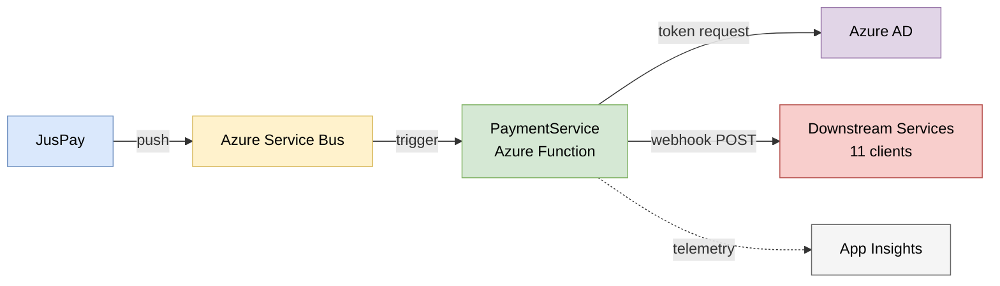
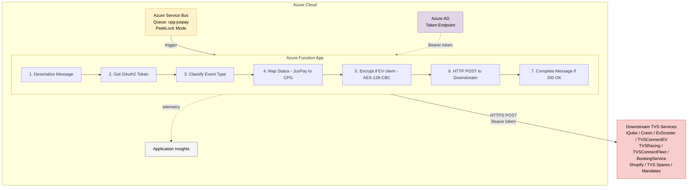
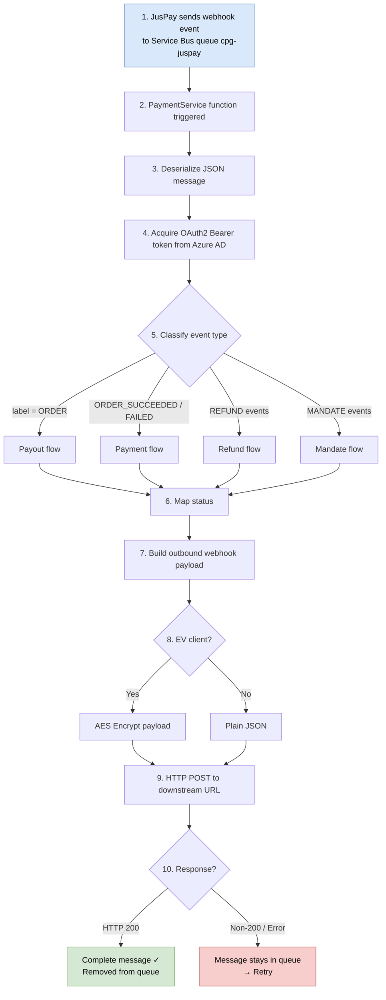

# High Level Code Document — PaymentService

**TVS Motor Company Ltd — Common Backend Services**

---

## 1. What Does This Service Do? (Plain English)

PaymentService is a **webhook relay**. It sits between JusPay (a third-party payment gateway) and TVS Motor Company's internal services. Its job is simple:

1. **Listen** for payment events from JusPay (delivered via Azure Service Bus)
2. **Translate** JusPay's status codes into TVS internal status codes
3. **Forward** the translated data to the correct downstream TVS service

Think of it as a **mail sorter**: it receives incoming letters (payment events), reads the address (client code), puts them in the right format (status mapping + optional encryption), and delivers them to the right mailbox (downstream service URL).

**Important**: This service does NOT call JusPay APIs. JusPay pushes events to an Azure Service Bus queue, and this function picks them up from there.

---

## 2. Application Facts

| Property | Value |
|----------|-------|
| Type | Azure Function (serverless) |
| Runtime | .NET 8 (Isolated Worker Model) |
| Trigger | Azure Service Bus queue: `cpg-juspay` |
| State | Completely stateless (no database) |
| Hosting | Azure Functions v4 |
| Language | C# |

---

## 3. Major Modules

The service has 6 logical modules:

| Module | Folder | What It Does |
|--------|--------|--------------|
| **Function** | `Functions/` | The entry point. Receives messages, orchestrates the entire flow. |
| **Models** | `Models/` | Data shapes — what comes in from JusPay, what goes out to downstream services. |
| **Mappers** | `Mappers/` | Translates JusPay statuses (e.g., "CHARGED") to internal statuses (e.g., "Success"). |
| **Helpers** | `Helpers/` | AES encryption for EV client payloads. |
| **Constants** | `Constants/` | Hardcoded values — client codes, event names, JusPay status strings. |
| **Enums** | `Enums/` | Internal status enumerations (payment, refund, payout statuses). |

---

## 4. Folder Structure Explained

```
PaymentService/
├── Constants/                     ← String constants used throughout the code
│   ├── ClientCode.cs              ← Names of all downstream clients (11 total)
│   ├── EventName.cs               ← JusPay event type strings (14 events)
│   ├── General.cs                 ← Config keys, HTTP headers, content types
│   ├── JusPayPaymentStatus.cs     ← JusPay payment status strings (9 values)
│   ├── JusPayPayoutStatus.cs      ← JusPay payout status strings (4 values)
│   └── JusPayRefundStatus.cs      ← JusPay refund status strings (4 values)
│
├── Enums/                         ← Internal CPG status codes
│   ├── CPGPaymentStatus.cs        ← Payment outcomes (Success, Failure, OnHold, etc.)
│   └── CPGRefundStatus.cs         ← Refund + Payout outcomes
│
├── Functions/                     ← Azure Function trigger (the "main" code)
│   └── JusPayWebhooks.cs         ← ALL processing logic lives here
│
├── Helpers/                       ← Utility code
│   └── AesCrypto.cs              ← AES-128-CBC encryption
│
├── Mappers/                       ← Status translation
│   └── StatusMapper.cs           ← 3 methods: payment, refund, payout mapping
│
├── Models/                        ← Data transfer objects
│   ├── MessageBody.cs            ← Inbound: main JusPay message structure
│   ├── PayoutsMessageBody.cs     ← Inbound: payout-specific message structure
│   ├── MandateBody.cs            ← Inbound: mandate data from JusPay
│   ├── PaymentWebhook.cs         ← Outbound: payment callback payload
│   ├── RefundWebhook.cs          ← Outbound: refund callback payload
│   ├── PayoutWebhook.cs          ← Outbound: payout callback payload
│   ├── MandateWebhook.cs         ← Outbound: mandate callback payload
│   ├── TokenRequest.cs           ← OAuth2 token request shape
│   └── TokenResponse.cs          ← OAuth2 token response shape
│
├── payment-service-docs/             ← Documentation (you are here)
├── Program.cs                     ← Application startup (host builder, DI)
├── PaymentService.csproj          ← .NET project file (dependencies)
├── PaymentService.sln             ← Visual Studio solution file
├── host.json                      ← Azure Functions runtime config
└── local.settings.json            ← Local dev config (NEVER deployed)
```

---

## 5. Core Business Workflows

### 5.1 The Four Event Types This Service Handles

| # | Event Type | Trigger Events | What Happens |
|---|-----------|----------------|--------------|
| 1 | **Payment** | `ORDER_SUCCEEDED`, `ORDER_FAILED` | Maps JusPay status → CPG status, forwards to client determined by `udf5` field |
| 2 | **Refund** | `REFUND_INITIATED`, `ORDER_REFUNDED`, `ORDER_REFUND_FAILED` | Iterates each refund item, routes based on ID patterns |
| 3 | **Payout** | Messages where `label = "ORDER"` | Builds payout webhook, forwards to client in `info.udf5` |
| 4 | **Mandate** | `MANDATE_CREATED`, `MANDATE_ACTIVATED`, `MANDATE_FAILED` | Builds mandate webhook, sends encrypted to TVSConnectEV |

### 5.2 How Routing Works (Which Downstream Service Gets the Callback)

**For Payments**: The `udf5` field in the JusPay message contains the client code (e.g., "iQubeWebsite", "BookingService"). The service looks up the URL from environment variables using this code.

**For Refunds**: The routing is based on patterns in the refund ID:
- ID ends with `-S` → goes to Shopify (iceWebsiteShopify)
- Order ID starts with `SPR-` → goes to TVS Spares (TVSSparesAutoRefunds)
- Everything else → goes to Booking Service

**For Mandates**: If the order ID starts with `TE` → goes to TVSConnectEVMandate

### 5.3 EV Clients Get Encrypted Payloads

Some clients receive AES-encrypted data instead of plain JSON:

| Delivery Method | Clients | Payload Shape |
|----------------|---------|---------------|
| **Encrypted** (AES-128-CBC) | iQubeWebsite, CreonWebsite, iQubeHDCB, EvScooter, TVSConnectEV, TVSRacing, TVSConnectFleet, iceWebsiteShopify, TVSSparesAutoRefunds, TVSConnectEVMandate | `{ "data": "<base64-encrypted-json>", "clientcode": "" }` |
| **Plain JSON** | BookingService, others | Full JSON webhook object |

---

## 6. Key Classes and Their Jobs

### JusPayWebhooks (Functions/JusPayWebhooks.cs)

This is the **only function** in the service. It does everything:

| Method | What It Does |
|--------|--------------|
| `Run()` | Entry point. Triggered by Service Bus. Classifies the event, calls the appropriate handler logic. |
| `GenerateToken()` | Gets an OAuth2 Bearer token from Azure AD. Used to authenticate with downstream services. |
| `PostToClient()` | Sends plain JSON to a downstream service. Includes APIM subscription key header. |
| `EVPostToClient()` | Sends AES-encrypted data to a downstream service. No APIM key. |
| `PaymentStatusPostToClient()` | Sends a typed PaymentWebhook as plain JSON. Includes APIM subscription key. |

### StatusMapper (Mappers/StatusMapper.cs)

Translates JusPay statuses to internal CPG statuses:

| Method | Input Example | Output Example |
|--------|--------------|----------------|
| `GetPaymentStatus("CHARGED")` | JusPay status string | `"Success"` |
| `GetRefundStatus("SUCCESS")` | JusPay refund status | `"RefundConfirmed"` |
| `GetPayoutStatus("FULFILLMENTS_SUCCESSFUL")` | JusPay payout status | `"Success"` |

### AesCrypto (Helpers/AesCrypto.cs)

Encrypts JSON payloads using AES-128-CBC before sending to EV clients. Takes a Base64 key and IV from environment variables.

---

## 7. External Integrations



| System | Direction | Purpose | Protocol |
|--------|-----------|---------|----------|
| **JusPay** | Inbound (via Service Bus) | Source of payment/refund/payout/mandate events | AMQP (Service Bus) |
| **Azure AD (Entra ID)** | Outbound | Get OAuth2 Bearer token for downstream auth | HTTPS (OAuth2 client_credentials) |
| **TVS EV APIs** | Outbound | Deliver encrypted payment callbacks | HTTPS + Bearer + AES |
| **Booking Service** | Outbound | Deliver plain refund callbacks | HTTPS + Bearer + APIM Key |
| **Shopify / ICE** | Outbound | Deliver encrypted refund callbacks | HTTPS + Bearer + AES |
| **TVS Spares** | Outbound | Deliver encrypted refund callbacks | HTTPS + Bearer + AES |
| **TVS Connect EV** | Outbound | Deliver encrypted mandate/payment callbacks | HTTPS + Bearer + AES |
| **Application Insights** | Outbound | Monitoring and telemetry | Azure SDK |

---

## 8. Major Dependencies (NuGet Packages)

| Package | Purpose |
|---------|---------|
| `Microsoft.Azure.Functions.Worker` (2.0.0) | Azure Functions isolated worker model |
| `Microsoft.Azure.Functions.Worker.Extensions.ServiceBus` (5.22.0) | Service Bus trigger binding |
| `Microsoft.ApplicationInsights.WorkerService` (2.22.0) | Monitoring/telemetry |
| `Microsoft.Azure.Functions.Worker.Extensions.Http.AspNetCore` (2.0.0) | HTTP extensions |
| `Microsoft.Extensions.Configuration` (8.0.0) | Configuration abstractions |
| `Newtonsoft.Json` (implicit via Functions SDK) | JSON serialization |

---

## 9. Runtime Architecture



**Key points:**
- The function auto-scales based on queue depth (more messages = more instances)
- Each instance processes messages independently (stateless)
- Failed messages automatically retry (Service Bus PeekLock behavior)
- Messages that fail too many times go to a Dead Letter Queue for manual investigation

---

## 10. High-Level Data Flow



**Step-by-step summary:**

1. JusPay sends a webhook event to Azure Service Bus queue "cpg-juspay"
2. PaymentService function is triggered by the message
3. Function deserializes the JSON message into C# objects
4. Function acquires an OAuth2 Bearer token from Azure AD
5. Function classifies the event (Payment / Refund / Payout / Mandate)
6. Function maps JusPay status → internal CPG status
7. Function builds the outbound webhook payload
8. Function determines the target (client from udf5, encrypted vs plain)
9. Function POSTs the payload to the downstream service URL
10. If HTTP 200 → message completed; If failure → message stays for retry

---

## 11. Important Entry Points

| Entry Point | Location | When It Runs |
|-------------|----------|--------------|
| `Program.cs` | Root | Application startup — configures host, DI, App Insights |
| `JusPayWebhooks.Run()` | Functions/JusPayWebhooks.cs | Every time a message arrives on the `cpg-juspay` queue |

There is only **one function** in this entire service. All logic flows through `JusPayWebhooks.Run()`.

---

## 12. Status Mapping Reference (Quick Lookup)

### Payment Statuses

| JusPay Says | We Translate To | Meaning |
|-------------|----------------|---------|
| CHARGED | Success | Payment went through |
| AUTHENTICATION_FAILED | Failure | Customer auth failed |
| AUTHORIZATION_FAILED | Failure | Bank rejected the payment |
| JUSPAY_DECLINED | OnHold | JusPay declined it (needs review) |
| AUTHORIZING | OnHold | Still being authorized |
| STARTED | OnHold | Payment started but not complete |
| AUTO_REFUNDED | OnHold | Was auto-refunded (needs review) |
| PENDING_VBV | InProgress | Waiting for 3D Secure/VBV verification |
| NEW | Initiated | Just created, nothing happened yet |

### Refund Statuses

| JusPay Says | We Translate To |
|-------------|----------------|
| SUCCESS | RefundConfirmed |
| PENDING | RefundAwaited |
| MANUAL_REVIEW | RefundAwaited |
| FAILURE | RefundFailed |

### Payout Statuses

| JusPay Says | We Translate To |
|-------------|----------------|
| FULFILLMENTS_SUCCESSFUL | Success |
| FULFILLMENTS_FAILURE | Failure |
| FULFILLMENTS_MANUAL_REVIEW | Awaited |
| FULFILLMENTS_CANCELLED | Rejected |

---

*Document for vendor onboarding — TVS Motor Company Ltd*
