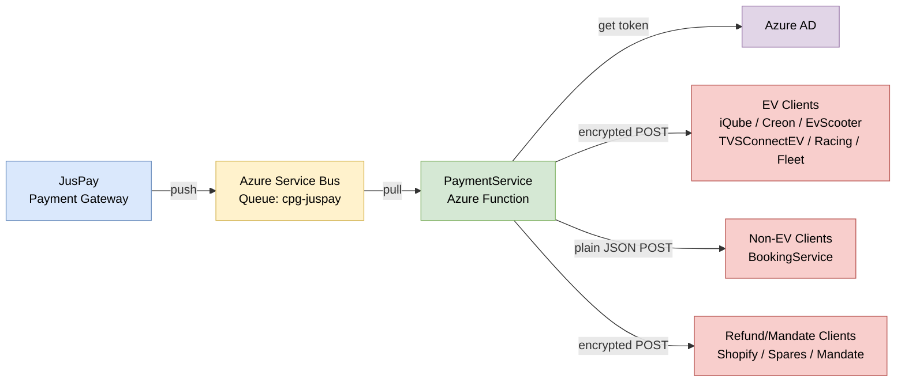
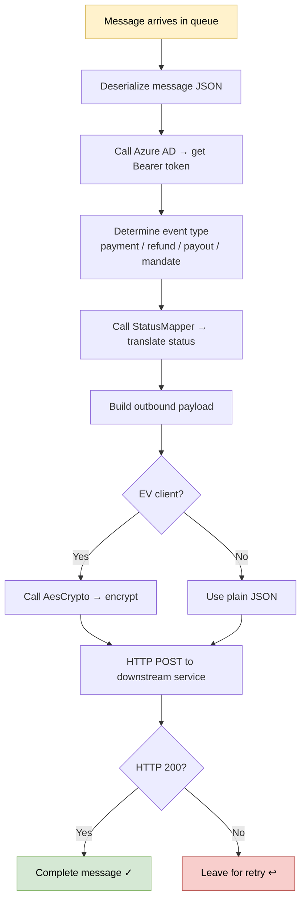
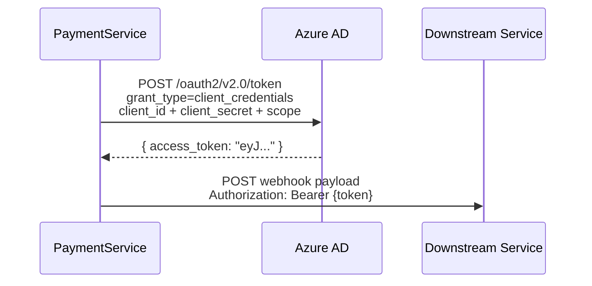
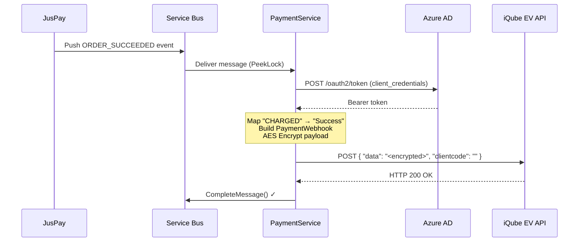
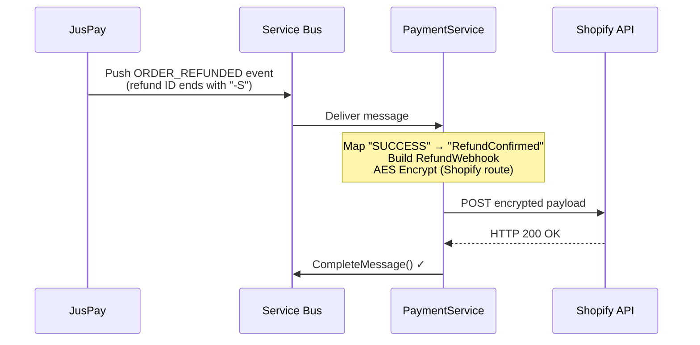
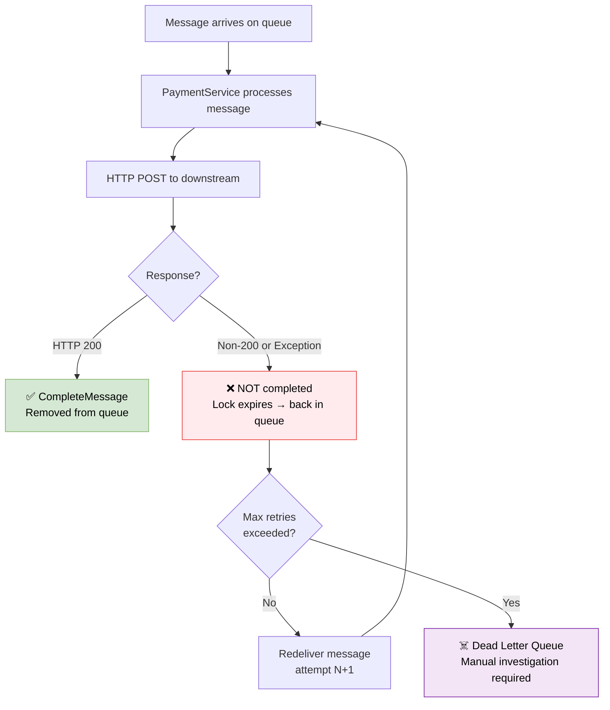

# High Level Design (HLD) — PaymentService

**TVS Motor Company Ltd — Common Backend Services**

---

## 1. Service Identity

| Field | Value |
|-------|-------|
| Service Name | PaymentService |
| Team | Common Backend Services |
| Tech Lead | Arun Kumar Reddy |
| Product Owner | Avinash Kumar |
| Developer | Rachel Bennet |
| Deployment | Azure Functions v4 (Consumption/Premium plan) |
| Runtime | .NET 8 (Isolated Worker) |

---

## 2. System Purpose

PaymentService is a **stateless, serverless message relay** that:
- Receives payment events from JusPay (via Azure Service Bus)
- Transforms and routes them to the correct internal TVS service
- Does NOT store any data or call back to JusPay

It is deployed as a single Azure Function with one Service Bus-triggered entry point.

---

## 3. Architecture Overview



---

## 4. Key Architecture Decisions

| Decision | Why |
|----------|-----|
| Serverless (Azure Functions) | Auto-scales with queue depth; no servers to manage |
| Service Bus trigger (not HTTP) | JusPay pushes to Service Bus; function pulls reliably with retry built-in |
| Stateless (no database) | Simplicity — just transforms and forwards; downstream services own their data |
| Single function | All 4 event types share one queue, so one function handles all routing |
| AES encryption for EV clients | Application-level payload protection for sensitive EV payment data |
| OAuth2 per-message | Simple implementation; no token cache complexity |

---

## 5. Major Components

| Component | What It Is | What It Does |
|-----------|-----------|--------------|
| **Azure Service Bus** | Message queue | Buffers JusPay events; provides reliable delivery with retry |
| **JusPayWebhooks Function** | Azure Function (C#) | The processing engine — deserializes, classifies, transforms, routes |
| **Azure AD / Entra ID** | Identity service | Issues OAuth2 Bearer tokens for authenticating downstream calls |
| **StatusMapper** | In-code utility | Translates JusPay status strings to internal status strings |
| **AesCrypto** | In-code utility | AES-128-CBC encrypts payloads for EV clients |
| **Downstream Services** | 11 TVS internal APIs | Receive the final webhook callbacks |

---

## 6. Processing Flow



---

## 7. Deployment Architecture

### 7.1 Azure Resources

| Resource | Service | Purpose |
|----------|---------|---------|
| Function App | Azure Functions (Consumption/Premium) | Runs the webhook processing code |
| Service Bus Namespace | Azure Service Bus (Standard tier) | Hosts the `cpg-juspay` queue |
| Azure AD Tenant | Microsoft Entra ID | Provides OAuth2 tokens |
| App Settings | Azure Function configuration | Stores all URLs, keys, secrets |
| Application Insights | Azure Monitor | Logging, metrics, diagnostics |
| API Management | Azure APIM | Gateway for some downstream calls |

### 7.2 Deployment Flow

```
Code (Git) → dotnet restore → dotnet build → dotnet publish → Deploy to Azure Function App
```

### 7.3 Environments

Configuration is entirely driven by Azure App Settings (environment variables). The same code runs in all environments — only the configuration values change.

---

## 8. Authentication & Security

### Security Layers

| Layer | Mechanism | Purpose |
|-------|-----------|---------|
| 1 | Service Bus SAS Key | Only authorized publishers (JusPay) can put messages on the queue |
| 2 | OAuth2 Bearer Token | This function authenticates to downstream services via Azure AD |
| 3 | API Management Subscription Key | Additional gateway-level auth for non-encrypted calls |
| 4 | AES-128-CBC Payload Encryption | EV payload data is encrypted at the application level |

### OAuth2 Flow



---

## 9. Sequence Flows

### 9.1 Payment Success (EV Client)



### 9.2 Refund (Shopify)



### 9.3 Failure & Retry



---

## 10. Scalability & Resiliency

### Scalability

| Factor | How It's Handled |
|--------|-----------------|
| More messages in queue | Azure Functions auto-spawns more instances |
| Multiple messages in parallel | Each instance handles its own message independently (stateless) |
| Downstream service slow | Message lock holds; if too slow, message will retry |

### Resiliency

| Failure Scenario | Built-in Protection |
|-----------------|-------------------|
| Downstream service temporarily down | Service Bus retries the message automatically |
| Too many failures | Message goes to Dead Letter Queue (for manual review) |
| Function crashes mid-processing | Message lock expires → auto-redelivered |
| Azure AD temporarily unavailable | Message retries (token acquisition will succeed next time) |

---

## 11. Known Limitations / Technical Debt

| Issue | Impact | Potential Fix |
|-------|--------|---------------|
| No token caching | A fresh Azure AD call for every single message | Cache token until `expires_in` |
| No circuit breaker | If downstream is down, we keep retrying every message | Add Polly or similar circuit breaker |
| No idempotency key | Downstream services might receive duplicate webhooks on retry | Add deduplication logic or unique request ID tracking |
| `HttpClient` created per-request | Connection pool exhaustion under high load | Use `IHttpClientFactory` via DI |
| Single large `Run()` method | Hard to test and maintain | Decompose into smaller methods/services |

---

## 12. Client Routing Summary

### Payment Events — Routed by `udf5` field

| Client Code (udf5) | Target Service | Encrypted? |
|--------------------|---------------|------------|
| iQubeWebsite | TVS EV Web API | Yes |
| CreonWebsite | TVS EV Web API | Yes |
| iQubeHDCB | TVS EV Web API | Yes |
| EvScooter | TVS EV Web API (slot-UAT) | Yes |
| TVSConnectEV | TVS Connect EV API | Yes |
| TVSRacing | TVS Racing API | Yes |
| TVSConnectFleet | TVS Fleet API | Yes |
| BookingService | Booking Service API | No (plain + APIM key) |
| Any other / null URL | Message completed (no delivery) | N/A |

### Refund Events — Routed by ID patterns

| Pattern | Target Service | Encrypted? |
|---------|---------------|------------|
| Refund ID ends with `-S` | Shopify (iceWebsiteShopify) | Yes |
| Order ID starts with `SPR-` | TVS Spares (TVSSparesAutoRefunds) | Yes |
| Default (no pattern match) | Booking Service | No (plain + APIM key) |

### Mandate Events — Routed by order ID prefix

| Pattern | Target Service | Encrypted? |
|---------|---------------|------------|
| Order ID starts with `TE` | TVSConnectEVMandate | Yes |

### Payout Events — Routed by `info.udf5`

| Client Code (info.udf5) | Target Service | Encrypted? |
|--------------------------|---------------|------------|
| Dynamic (from env vars) | Varies | No (plain + APIM key) |

---

## 13. External Systems

| System | Relationship | Criticality |
|--------|-------------|-------------|
| **JusPay** | Sends payment events to our Service Bus queue | Critical — without it, no events arrive |
| **Azure AD** | Provides auth tokens for all outbound calls | Critical — without it, no downstream delivery |
| **Azure Service Bus** | Message queue between JusPay and this function | Critical — the trigger mechanism |
| **Azure APIM** | API gateway for some downstream calls | High — some routes go through it |
| **Application Insights** | Monitoring & diagnostics | Medium — service works without it |

---

## 14. Infrastructure Dependencies

| Dependency | What Happens If It's Down |
|-----------|--------------------------|
| Azure Service Bus | No messages delivered; events buffer within retention limits |
| Azure Functions Runtime | Service is completely offline |
| Azure AD | All downstream deliveries fail (can't get auth token) |
| Network/DNS | Can't reach downstream services |
| API Management | Some specific routes fail (non-EV plain JSON calls) |
| Application Insights | Loss of monitoring only; processing continues |

---

*This document is for engineering teams. Credentials and sensitive business logic have been excluded.*
