# TVS Connect iOS — High-Level Code Document (HLC)

**Purpose:** Vendor engineering onboarding reference  
**Last Updated:** June 2025  
**Audience:** Senior iOS developers joining the project

---

## Table of Contents

1. [Application Overview](#1-application-overview)
2. [Module Summary](#2-module-summary)
3. [Dependency Overview](#3-dependency-overview)
4. [Major Modules/Components](#4-major-modulescomponents)
5. [Folder Structure Explanation](#5-folder-structure-explanation)
6. [Core Business Workflows](#6-core-business-workflows)
7. [Key Services/Classes](#7-key-servicesclasses)
8. [External Integrations](#8-external-integrations)
9. [Major Dependencies (Categorized)](#9-major-dependencies-categorized)
10. [Runtime Architecture](#10-runtime-architecture)
11. [Important Entry Points](#11-important-entry-points)
12. [High-Level Data Flow](#12-high-level-data-flow)

---

## 1. Application Overview

### Purpose & Audience

TVS Connect is the official companion mobile app for TVS Motor Company
two-wheelers (motorcycles and scooters). It connects to vehicles via
Bluetooth Low Energy (BLE) to deliver:

- Real-time vehicle telemetry and diagnostics
- Turn-by-turn navigation projected to vehicle cluster
- Ride statistics, eco scoring, and trip history
- Over-the-air (OTA) firmware updates
- EV battery management (iQube series)
- Voice assist(English Language only), geofencing, SOS alerts

### Platform Details

| Attribute | Value |
|-----------|-------|
| Language | Swift 5.x (Objective-C bridging header present) |
| UI Framework | UIKit (primary) + SwiftUI (newer modules) |
| Min Deployment Target | iOS 14.0 |
| Xcode Version | 16+ recommended |
| Workspace | `SourceCode/TVS.xcworkspace` |
| Dependency Manager | CocoaPods and SPM|

### Multi-Region Deployment Strategy

The app serves 8 geographic markets via separate Xcode targets sharing
a common codebase. Each target has its own bundle ID, Info.plist,
App Store listing, and region-specific backend configuration.

| Target | Markets | Notes |
|--------|---------|-------|
| `TVS-SEA` | Indonesia, Vietnam, Mongolia etc | Google Maps + HERE |
| `TVS-LATAM` | Peru, Brazil etc | Language: Spanish/Portuguese |
| `TVS-Middle-East` | Lebanon etc | Turkish support |
| `TVS-Srilanka` | Sri Lanka | — |
| `TVS-NEPAL` | Nepal | English Support |
| `TVS-AFRICA` | African markets | French English Supoort|
| `TVS-EUROPE` | Italy | Italian, French localization Suppport based on device language|

**How it works:** All targets call `tvs_pods` (shared pod function).
Region is determined at build time via `AppTarget.current` which reads
compiler flags. `NetworkConfiguration.shared.country` is set in
`AppDelegate.setBuildEnvironment()` before any API call.

### App Store Distribution

- Each regional target is a separate App Store listing
- Distribution via Apple App Store (public)
- Enterprise/Ad-hoc builds for internal QA
---

## 2. Module Summary

### Complete Module List (44 modules in `TVS/Modules/`)

#### Vehicle IOT Modules (20)

| Module | Vehicle | Description |
|--------|---------|-------------|
| `IOT-U279` | Apache series | BLE dashboard, ride modes |
| `IOT-U368` | Jupiter 125 | Cluster display, navigation |
| `IOT-U399C` | RR 310 | Sport telemetry, lap timer |
| `IOT-U400` | Raider | Connected features |
| `IOT-U408` | NTorq (older) | Legacy NTorq integration |
| `IOT-U445` | Jupiter (variant A) | Scooter telemetry |
| `IOT-U445B` | Jupiter (variant B) | Updated protocol |
| `IOT-U449` | Apache RTR series | Sport mode, lean angle |
| `IOT-U458` | Newer variant | Extended telemetry |
| `IOT-U532` | — | Connected features |
| `IOT-U566` | — | Connected features |
| `IOT-U796` | — | Latest protocol |
| `IOT-N109` | NTorq 125 | BLE cluster, SmartXonnect |
| `IOT-N112` | NTorq Race Ed. | Race telemetry |
| `IOT-N251` | NTorq 125 (updated) | Enhanced protocol |
| `IOT-N360` | iQube (IOT layer) | EV BLE layer |
| `IOT-N597` | — | Newer vehicle |
| `IOT-NTORQ` | NTorq (generic) | Shared NTorq logic |
| `IOT-NonIOT` | Non-connected bikes | Manual data entry |
| `IOT-Common` | — | Shared IOT utilities |

#### Core Feature Modules (16)

| Module | Description |
|--------|-------------|
| `Dashboard` | Legacy home screen with bike status |
| `Login` | Authentication (OTP, social login) |
| `Navigation` | Turn-by-turn navigation (Mappls/Google/HERE) |
| `Profile` | User profile management |
| `OTA` | Over-the-air firmware updates |
| `VoiceAssist` | Voice-controlled ride features |
| `Tpms` | Tire pressure monitoring |
| `Tour-N112` | Ride recording and tour management |
| `Help` | FAQ, support, user guides |
| `Feedbacks` | User feedback collection |
| `NonIOT` | Non-connected vehicle features |

#### Supporting Modules (8)

| Module | Description |
|--------|-------------|
| `BottomTAB` | Tab bar controller/navigation |
| `Common` | Shared UI components, base classes |
| `SideMenu` | Side navigation drawer |
| `EventHub` | Azure EventHub telemetry upload |
| `Apache` | Apache-specific customizations |
| `BluArmor` | Smart helmet integration |
| `U408Setting` | Vehicle-specific settings UI |

### Module Interdependencies (High Level)

```
Login ──→ Dashboard ──→ IOT-{Vehicle} ──→ BluetoothService
                    ├──→ Navigation ──→ MapManager

All Modules ──→ Services/ (BikeService, RealmService, etc.)
All Modules ──→ SupportingFiles/ (DataManager, CommonMethods)
```

### Entry Points for Major Modules

| Module | Entry Point | Storyboard |
|--------|-------------|------------|
| Login | `LoginVC` | `Login.storyboard` |
| Dashboard | `DashboardVC` / `UnifiedDashboardVC` | `Dashboard.storyboard` / `UnifiedDashboard.storyboard` |
| Navigation | `NavigationVC` | `Navigation.storyboard` |
| IOT-N109 | Via Dashboard routing | `IOT-N109.storyboard` |
| IOT-U399C | Via Dashboard routing | `IOT-U399C-Storyboard/` |
| OTA | Via Settings/Notification | Within vehicle module |
| Profile | `ProfileVC` | `Profile.storyboard` |
---

## 3. Dependency Overview

### CocoaPods Dependencies (Complete)

#### Networking

| Pod | Version | Purpose |
|-----|---------|---------|
| `Alamofire` | latest | HTTP networking (REST APIs) |
| `Apollo` | latest | GraphQL client (P360 platform) |
| `Apollo/WebSocket` | latest | GraphQL subscriptions (live tracking) |
| `CocoaMQTT` | 2.0.9 | MQTT messaging (real-time vehicle data) |
| `ReachabilitySwift` | latest | Network status monitoring |

#### Database & Storage

| Pod | Version | Purpose |
|-----|---------|---------|
| `RealmSwift` | ~> 10.49.1 | Local database (vehicle data, rides, settings) |
| `SwiftyJSON` | latest | JSON parsing (legacy code) |
| `CryptoSwift` | ~> 1.6.0 | AES/SHA encryption, data signing |
| `CSVImporter` | ~> 1.9 | CSV file parsing (data import) |
| `Zip` | latest | Archive compression/decompression |

#### UI Components

| Pod | Version | Purpose |
|-----|---------|---------|
| `IQKeyboardManagerSwift` | ~> 6.5.13 | Keyboard handling |
| `DropDown` | 2.3.13 | Dropdown menus |
| `Toast-Swift` | 5.0.1 | Toast notifications |
| `SideMenu` | 6.5.0 | Side navigation drawer |
| `FSPagerView` | latest | Pager/carousel views |
| `iCarousel` | ~> 1.8.3 | 3D carousel |
| `AMPopTip` | ~> 4.0.1 | Tooltip popups |
| `JVFloatLabeledTextField` | latest | Animated text fields |
| `HGCircularSlider` | latest | Circular slider (EV charge) |
| `UPCarouselFlowLayout` | latest | Horizontal scrolling layout |
| `DGCharts` | latest | Charts and graphs |
| `Cartography` | ~> 4.0.0 | Auto Layout DSL |
| `Introspect` | ~> 0.2.3 | SwiftUI ↔ UIKit bridge |
| `ChameleonFramework` | latest | Color/theme utilities |
| `SwiftyGif` | latest | GIF animation display |
| `YoutubePlayer-in-WKWebView` | ~> 0.3.8 | YouTube video embedding |

#### Image Loading

| Pod | Version | Purpose |
|-----|---------|---------|
| `Kingfisher` | latest | Async image loading/caching |
| `SDWebImage` | ~> 5.2.3 | Image loading (legacy) |
| `SVGKit` | 3.x branch | SVG rendering |

#### Maps & Navigation

| Pod | Version | Purpose |
|-----|---------|---------|
| `MapplsMap` | latest | Mappls map rendering (India) |
| `MapplsAPIKit/Base` | latest | Mappls geocoding/routing |
| `MapplsAPICore` | latest | Mappls auth/config |
| `MapplsFeedbackKit` | latest | Mappls user feedback |
| `GoogleMaps` | latest | Google Maps (international) |
| `GoogleNavigation` | latest | Google turn-by-turn |
| `GooglePlaces` | latest | Place search/autocomplete |

#### Analytics & Monitoring

| Pod | Version | Purpose |
|-----|---------|---------|
| `AppDynamicsAgent` | 2022.5.0 | APM (performance monitoring) |
| Firebase | — | Commented out in Podfile; imported via SPM or manual |

#### IoT & Serialization

| Pod | Version | Purpose |
|-----|---------|---------|
| `Protobuf` | latest | Protocol Buffers (BLE data serialization) |

#### Architecture & DI

| Pod | Version | Purpose |
|-----|---------|---------|
| `Swinject` | ~> 2.7.1 | Dependency injection container |

#### Third-Party Integrations

| Pod | Version | Purpose |
|-----|---------|---------|
| `KogoAuto` | Production branch | Partner integration (connected features) |
| `HyperWebView` | 1.0.2 | Embedded web views (hybrid content) |

### Vendor xcframeworks (Embedded)

| Framework | Location | Purpose |
|-----------|----------|---------|
| `BluConnect.xcframework` | `Frameworks/` + root | BLE connectivity library |
| `MapplsCoreNavigation.xcframework` | `Frameworks/` | Mappls navigation engine |
| `MapplsNavigationUI.xcframework` | `Frameworks/` | Mappls nav UI components |
| `Solar.xcframework` | `Frameworks/` | Sunrise/sunset calculation |
| `what3words.framework` | `Frameworks/` | what3words location addressing |
| `Ark.xcframework` | Root `SourceCode/` | Voice assistant engine |
| `ArkTwoWheeler.xcframework` | Root `SourceCode/` | Two-wheeler voice profiles |
| `heresdk.xcframework` | Root `SourceCode/` | HERE Maps SDK |
| `QuecBleChannelKit.framework` | Root `SourceCode/` | Quectel BLE module communication |

### watchOS Dependencies

| Pod | Purpose |
|-----|---------|
| `Apollo` + `Apollo/WebSocket` | GraphQL for watch |
| `SwiftyJSON` | JSON parsing |
| `Kingfisher` | Image loading |
| `ZIPFoundation` | Archive handling |
| `CryptoSwift` | Encryption |

### Version Constraints & Compatibility Notes

- `RealmSwift ~> 10.49.1` — Schema version 49; increment on any model change
- `CryptoSwift ~> 1.6.0` — Pinned for `BUILD_LIBRARY_FOR_DISTRIBUTION`
- `DropDown 2.3.13` — Exact version pinned (MMI SDK compatibility)
- `AMPopTip ~> 4.0.1` — Version locked pending MMI SDK update
- `CocoaMQTT 2.0.9` — Exact version for stability
- `AppDynamicsAgent 2022.5.0` — Legacy version pinned
- Simulator builds exclude `arm64` architecture

---

## 4. Major Modules/Components

### 4.1 Dashboard (Legacy + UnifiedDashboard)

**Legacy Dashboard** (`Modules/Dashboard/`)
- Original home screen post-login
- Storyboard: `Dashboard.storyboard`
- Shows connected vehicle status, quick actions
- Vehicle-specific dashboard routing based on `BLEType`

**UnifiedDashboard** (`UnifiedDashboard/`)
- Newer replacement dashboard (MVVM, cleaner architecture)
- Files: `UnifiedDashboardVC.swift`, `UnifiedDashboardViewModel.swift`
- Sub-modules: ErrorHandling, NonConnectedUsers, SOS, U716-specific
- Storyboard: `UnifiedDashboard.storyboard`
- Handles both connected and non-connected states

> 📍 **Vendor note:** New dashboard work should target UnifiedDashboard.
> Legacy Dashboard remains for backward compatibility.

### 4.2 Vehicle IOT Modules (20+ variants)

Each IOT module follows a consistent structure:
```
IOT-{VehicleCode}/
├── Controller/    # Vehicle-specific ViewControllers
├── ViewModel/     # Business logic, BLE data processing
├── Model/         # Data models for this vehicle's telemetry
├── View/          # XIBs, custom views
└── DataSource/    # Table/Collection data sources
```

**Vehicle routing:** `DataManager.shared.selectedBike.vehicleTypeId` →
`BLEType` enum → module selection in Dashboard.

**Key vehicle families:**
- **Apache series** (U279, U399C, U449): Sport-focused, lean angle, lap timer
- **NTorq series** (N109, N112, N251, U408, NTORQ): Scooter SmartXonnect
- **Jupiter series** (U368, U445, U445B): Commuter telemetry
- **iQube/EV** (N360 + TVS_EV module): Battery, charging, range

### 4.3 Navigation Module

**Architecture:** Protocol-based map abstraction (`MapServiceProtocol`)
supporting 3 providers:

```
MapManager/
├── MapServiceProtocol.swift      # Abstract interface
├── MapsServiceManager.swift      # Provider routing
├── GoogleMaps/                   # Google implementation
├── HereMap/                      # HERE implementation
└── Mappls/                       # Mappls implementation (India)
```

**Provider selection logic:**
- India → Mappls (primary), Google (fallback)
- International → Google Maps + HERE SDK
- Navigation data sent to vehicle cluster via BLE

### 4.4 EV Module (iQube — `TVS_EV/`)

The EV module is a large self-contained subsystem for iQube electric
scooters, with its own services, storyboards, and BLE layer.

```
TVS_EV/
├── EV_Modules/          # EV feature screens (dashboard, charging)
├── EV_Services/         # EV-specific API services
├── EV_Storyboard/       # EV UI flows
├── EV_SupportingFiles/  # EV helpers (EVDataManager, EVBluetoothService)
├── EV_Assets/           # EV image assets
├── EV_Resources/        # EV fonts/resources
├── U388/, U546/         # Specific EV model variants
├── OtherBikes/          # Non-TVS EV support
├── VoiceAssist/         # EV voice features (Ark SDK)
├── iQubeQueries.graphql # GraphQL queries for EV telemetry
└── CommonModules/, CustomViews/, DataSource/
```

**Key EV singletons (parallel to main app):**
- `EVDataManager.shared` — EV app state
- `EVBluetoothService.shared` — EV BLE communication
- `EVNetworkConfiguration.shared` — EV environment/hosts

> 📍 **Vendor note:** EV has a parallel architecture with `EV`-prefixed
> versions of core singletons. Detection via `CommonMethods.isiQubeSeries()`.

### 4.5 Bluetooth/BLE Layer

Central singleton `BluetoothService.shared` with vehicle-specific
extensions and protobuf-based parsers.

```
SupportingFiles/BluetoothService/
├── BluetoothService.swift              # Core CoreBluetooth manager
├── BluetoothService+{Vehicle}.swift    # Per-vehicle extensions
├── BluetoothService+PeripheralDelegate.swift  # CBPeripheralDelegate
├── BluetoothServiceDelegate.swift      # Callback protocol
├── BLEType.swift                       # Vehicle type enum
├── BluetoothDataConversion.swift       # Byte parsing helpers
├── BluetoothMockDataService.swift      # Testing/simulation
└── {Vehicle}BLEDataParser/             # 14 protobuf parser dirs
```

**Vehicle-specific senders** (separate classes):
`U279BLESender`, `U399CBLESender`, `U400BLESender`, `U368BLESender`,
`U449BLESender`, `N251BLESender`, `N360BLESender`, `N597BLESender`,
`NtorqBLESender`, `U408BLESender`, etc.

**Responsibilities:** pairing, telemetry streaming, ride mode commands,
OTA transfer, diagnostics, find-my-vehicle.

### 4.6 Authentication/Login

- Module: `Modules/Login/`, entry `LoginVC`
- Storyboard: `Login.storyboard`
- OTP-based authentication (mobile number)
- Token storage via Keychain + Realm
- Region-aware backend (country set before login)
- Session restoration on app launch

### 4.7 OTA Updates

- Module: `Modules/OTA/`
- Firmware delivered to vehicle via BLE in chunks
- Update package downloaded from backend (versioned)
- Progress tracking, resume support, integrity verification
- Triggered via notification or settings
- Uses `Zip`/`ZIPFoundation` for package handling

### 4.8 NPS

| NPS | `NPS/` | In app Feedback |

---

## 5. Folder Structure Explanation

### Annotated Top-Level Tree

```
tvs-connect-ios-app/
├── SourceCode/                  # All source code + project files
│   ├── TVS.xcworkspace          # ← ALWAYS open this
│   ├── TVS.xcodeproj/           # Project definition
│   ├── Podfile                  # 8 regional targets + watchOS
│   ├── TVS/                     # Main app target (see below)
│   ├── TVS Watch App/           # watchOS companion app
│   ├── TVSTests/                # Unit tests
│   ├── TVSUITests/              # UI tests
│   ├── Model/                   # Shared data models
│   ├── Frameworks/              # Vendor xcframeworks
│   ├── Pods/                    # CocoaPods output (gitignored)
│   ├── IQubeShareExtension/     # EV share extension
│   ├── LocationSharingWidget/   # Location widget
│   ├── WatchAppWidget/          # Watch widget
│   ├── RemoteNotification/      # Notification service extension
│   ├── *.xcframework            # Root-level vendor SDKs (Ark, HERE, etc.)
│   └── sonar-project.properties # SonarQube config
├── Certificates/                # Provisioning profiles & APNS certs
├── docs/                        # Documentation (this file)
└── .kiro/                       # Kiro specs and steering rules
```

### Main App Target (`SourceCode/TVS/`)

| Directory | Purpose |
|-----------|---------|
| `Application/` | AppDelegate, lifecycle, migrations, localizations (10 languages) |
| `AppConfig/` | `AppConfig.swift`, xcconfig files (one per region) |
| `Modules/` | 44 feature modules (MVVM) |
| `Services/` | 54 shared service files (Bike, Realm, Ride) |
| `NewService/` | Newer protocol-based service pattern |
| `UnifiedDashboard/` | Newer dashboard UI (replaces legacy) |
| `Onboarding flow Module/` | Onboarding, accessories, vehicle garage |
| `SupportingFiles/` | Core infra: BLE, Maps, WebService, Helpers |
| `DataSource/` | Generic reusable data sources |
| `Storyboard/` | Shared + vehicle-specific storyboards |
| `Resources/` | Fonts, assets |
| `TVS_EV/` | EV-specific subsystem (iQube) |
| `CODPSchema/` | Apollo GraphQL generated code (P360) |
| `InAppNudge/` | In-app messaging |
| `Referral/` | Referral program |
| `Rewards/` | Rewards system |
| `SideMenu/` | Side navigation |
| `Migration/` | Region-specific Realm migrations |
| `hereMap/`, `Heremap_Upgrade/` | HERE map integration |
| `sslcert/` | SSL pinning certificates |
| `*.xcassets` | Vehicle-specific image catalogs |
| `schema.graphqls` | P360 GraphQL schema |

### SupportingFiles Breakdown

```
SupportingFiles/
├── BluetoothService/   # BLE core + 14 vehicle parsers
├── WebService/         # NetworkConfiguration, NetworkManager, APIList
├── MapManager/         # Protocol-based maps (Google/HERE/Mappls)
├── HelperClass/        # 50+ files: DataManager, CommonMethods, LocationManager
├── Charts/             # Chart rendering helpers
├── GA Analytics/       # Google Analytics handlers
├── Handler/            # Event/state handlers
├── MMI/                # Mappls-specific code not applicable for IB
├── What3Words/         # what3words integration
├── WifiModule/         # WiFi-based vehicle communication
├── SettingsBundle/     # iOS Settings.bundle helpers
└── Services/           # Misc supporting services
```

### Asset Catalog Organization (17+ vehicle-specific catalogs)

Each vehicle has a dedicated `.xcassets` catalog for cluster/UI imagery:

| Catalog | Type |
|---------|------|
| `N109.xcassets`, `N112.xcassets`, `N251.xcassets`, `N360.xcassets`, `N597.xcassets` | NTorq/iQube series |
| `U279.xcassets`, `U368.xcassets`, `U399C.xcassets`, `U408.xcassets` | Apache/Jupiter |
| `U445.xcassets`, `U445B.xcassets`, `U449.xcassets`, `U458.xcassets` | Variants |
| `U532.xcassets`, `U566.xcassets`, `U711.xcassets`, `U796.xcassets` | Newer models |
| `NTORQ_U716.xcassets` | NTorq U716 |
| `AppHome.xcassets`, `Assets.xcassets`, `Vehicle.xcassets` | Shared/common |
| `BluArmor.xcassets`, `Navigation-White.xcassets`, `Onboarding.xcassets`, `WifiSetup.xcassets` | Feature-specific |

### Configuration File Locations

| File | Location | Purpose |
|------|----------|---------|
| xcconfig | `TVS/AppConfig/TVS-Dev.xcconfig` (+ regional) | Build settings per environment |
| Entitlements | `TVS.entitlements`, `TVSDebug.entitlements` | Capabilities |
| Info.plist | Per-target (TVS SEA, LATAM, EUROPE, etc.) | App metadata, permissions |
| GraphQL schema | `TVS/schema.graphqls` | Apollo codegen source |
| Apollo config | `TVS/apollo-codegen-config.json` | GraphQL codegen settings |
| SonarQube | `SourceCode/sonar-project.properties` | Static analysis |
| Jazzy | `SourceCode/.jazzy.yaml` | API doc generation |

### Generated Code Locations

| Location | Generated From |
|----------|----------------|
| `CODPSchema/` | Apollo codegen from `schema.graphqls` (P360 platform) |
| `CODPSchema/Operations/` | GraphQL query/mutation operations |
| `CODPSchema/Schema/` | GraphQL type definitions |
| `TVS_EV/` GraphQL | `iQubeQueries.graphql` (EV telemetry) |

> 📍 **Vendor note:** Do not hand-edit files in `CODPSchema/`. Regenerate
> via Apollo codegen when the schema changes.

---

## 6. Core Business Workflows

### 6.1 User Onboarding & Vehicle Registration

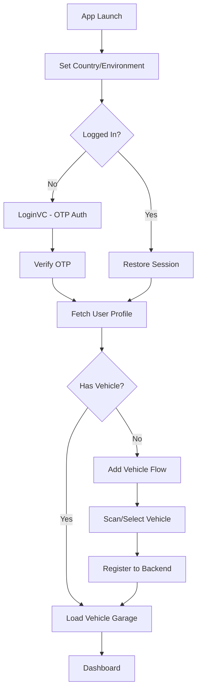

### 6.2 BLE Pairing & Connection Lifecycle

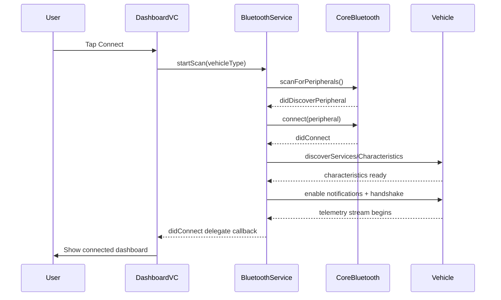

**Key states:** scanning → connecting → discovering → handshake →
connected → streaming. Reconnection handled automatically on disconnect.

### 6.3 Real-Time Telemetry Data Flow (BLE → App → EventHub/MQTT)

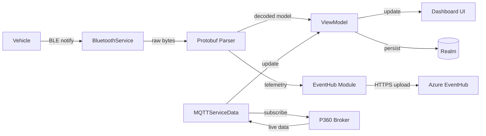

**Two telemetry paths:**
- **BLE (local):** Direct vehicle connection → parsed → UI + Realm + EventHub
- **MQTT/GraphQL (remote):** P360 platform for geofencing, live tracking
  when vehicle not in BLE range

### 6.4 Navigation Session Lifecycle

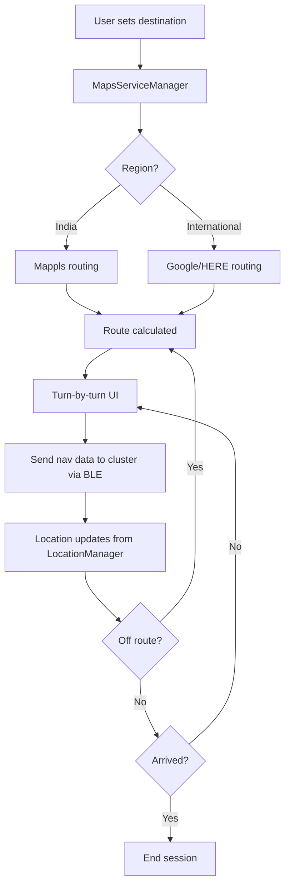


### 6.6 OTA Firmware Update Process

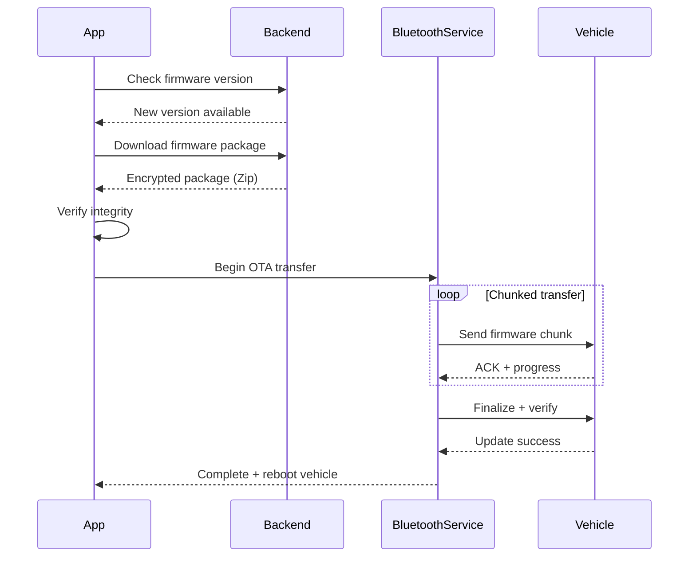

---

## 7. Key Services/Classes

| Class | Type | Responsibility |
|-------|------|----------------|
| `DataManager.shared` | Singleton | App-wide state, selected vehicle, session timing |
| `BluetoothService.shared` | Singleton | BLE communication (+ vehicle extensions) |
| `NetworkConfiguration.shared` | Singleton | Environment, country, API host resolution |
| `NetworkManager.sharedInstance` | Singleton | HTTP request execution (Alamofire) |
| `BikeService.shared` | Singleton | Vehicle management (+ vehicle extensions) |
| `RealmService` | Static | Local persistence (+ vehicle extensions) |
| `LocationManager.shared` | Singleton | GPS/location services |
| `MQTTServiceData.shared` | Singleton | Real-time messaging via MQTT |
| `CommonMethods` | Static | Utility functions (analytics, formatting, checks) |
| `EVDataManager.shared` | Singleton | EV-specific app state |
| `EVBluetoothService.shared` | Singleton | EV BLE communication |

### 7.1 DataManager
- App-wide state container (`DataManager.shared`)
- Holds `selectedBike`, session timestamps, BLE connection flags
- Generic key-value store: `set(_:_:)`, typed getters
- Flags: `isIntentionalBLEDisConnection`, `isTourOn`, `isResetDashboard`

### 7.2 BluetoothService
- Wraps `CBCentralManager` / `CBPeripheral`
- Vehicle logic isolated in `BluetoothService+{Vehicle}.swift`
- Delegates results via `BluetoothServiceDelegate`
- `cancelPeripheralConnection()` on terminate/logout

### 7.3 NetworkConfiguration
- Resolves base URLs by `country` + `buildEnvironment`
- Environments: debug, development, staging, production
- Set in `AppDelegate.settingEnvironment()` at launch
- EV parallel: `EVNetworkConfiguration.shared`

### 7.4 NetworkManager
- HTTP layer over Alamofire
- SSL certificate pinning (`sslcert/`)
- Endpoints centralized in `APIList.swift` (500+ endpoints)
- Companion clients: `CommonAPIClient`, `OnboardAPIClient`
- Error handling via `ErrorHandling.swift`, `NetworkResponse.swift`

### 7.5 RealmService
- Static methods for Realm persistence
- Per-vehicle extensions and widget managers
- Schema version 49 — increment on model change (in AppDelegate)
- Migrations in `Migration/` (region-specific)

### 7.6 LocationManager
- Wraps `CLLocationManager`
- Background location for ride tracking and geofencing
- Feeds navigation and telemetry

### 7.7 MQTTServiceData
- CocoaMQTT wrapper for real-time telemetry
- Subscribes to `{telematicsOrganizationId}/{telematicsVehicleId}`
- Unsubscribes/disconnects on app terminate

### 7.8 CommonMethods
- Static utility namespace
- Analytics (`firbaseAnalytics`, GA events), formatting
- Vehicle series checks (`isiQubeSeries()`), app language

---

## 8. External Integrations

| Integration | Purpose | Where to Look |
|-------------|---------|---------------|
| Firebase Crashlytics | Crash reporting | `AppDelegate` (`Crashlytics.crashlytics()`) |
| Firebase Messaging | Push notifications (FCM) | `AppDelegate` (`Messaging.messaging()`) |
| Firebase Analytics | Event tracking | `CommonMethods.firbaseAnalytics`, `GAAnalyticsHandler` |
| AppDynamics | APM/performance monitoring | `AppDelegate` (ADEUM keys) |
| Mappls SDK | Maps/navigation (India) | `MapManager/Mappls/`, `setupMMISDKKeys()` |
| Google Maps/Nav/Places | Maps (international) | `MapManager/GoogleMaps/`, `setupGoogleMap()` |
| HERE SDK | Maps (international) | `hereMap/`, `HeremapsAPIManager` |
| what3words | Location addressing | `SupportingFiles/What3Words/` |
| P360 Platform | Vehicle backend (GraphQL) | `CODPSchema/`, Apollo client |
| Azure EventHub | Telemetry ingestion | `Modules/EventHub/` |
| KogoAuto | Partner connected features | `KogoAuto` pod, AppDelegate Kogo hooks |
| Garmin Watch SDK | Garmin wearable | `GarminManager.shared` |
| Apple Watch | Companion app | `TVS Watch App/` |

> 📍 **Security note:** All SDK keys and credentials are resolved at
> runtime via `AppKeys` and are NOT hardcoded in documentation. SSL
> certificate pinning protects all network traffic.

---

## 9. Major Dependencies (Categorized)

### Networking Layer
- **Alamofire** — REST HTTP client
- **Apollo** (+ WebSocket) — GraphQL queries, mutations, subscriptions
- **CocoaMQTT** — MQTT real-time messaging
- **ReachabilitySwift** — Connectivity monitoring

### Database Layer
- **RealmSwift** — Primary local database (schema v49)
- **SwiftyJSON** — Legacy JSON parsing
- **CryptoSwift** — Encryption
- **CSVImporter** — CSV import
- **Zip / ZIPFoundation** — Archive handling (OTA packages)

### UI Framework Layer
- **UIKit + Storyboards/XIBs** — Primary UI
- **SwiftUI** (+ Introspect) — Newer modules
- **DGCharts** — Data visualization
- **FSPagerView, iCarousel, UPCarouselFlowLayout** — Carousels
- **SideMenu** — Navigation drawer
- **IQKeyboardManagerSwift** — Keyboard handling
- **DropDown, Toast-Swift, AMPopTip** — UI helpers
- **Kingfisher, SDWebImage, SVGKit, SwiftyGif** — Images
- **Cartography** — Auto Layout DSL
- **ChameleonFramework** — Theming

### Security
- **CryptoSwift** — AES/SHA encryption
- **SSL certificate pinning** — Network security (`sslcert/`)

### Analytics
- **Firebase** (Crashlytics, Messaging, Analytics)
- **AppDynamics** — APM monitoring

### Maps & Navigation
- **Mappls SDK** (Map, APIKit, APICore, FeedbackKit, Navigation)
- **Google Maps / Navigation / Places**
- **HERE SDK** (heresdk.xcframework)
- **what3words** — Location addressing
- **Solar** — Sunrise/sunset (auto theme)

### BLE & IoT
- **CoreBluetooth** — BLE communication
- **Protobuf** — BLE data serialization
- **BluConnect** — BLE connectivity helper
- **QuecBleChannelKit** — Quectel module communication
- **Ark / ArkTwoWheeler** — Voice assistant engine

---

## 10. Runtime Architecture

### 10.1 App Lifecycle (AppDelegate Flow)

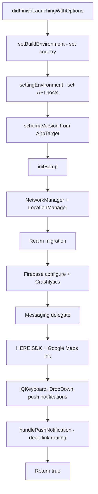

**Key launch steps (in order):**
1. `setBuildEnvironment()` — country MUST be set first
2. `settingEnvironment()` — resolve API hosts per environment
3. `initSetup()` / `initEVSetup()` — managers, Realm, SDKs
4. Firebase + Crashlytics + Messaging
5. Push notification registration + deep link handling

### 10.2 Background Modes

| Mode | Purpose |
|------|---------|
| Bluetooth LE accessories | Maintain vehicle connection in background |
| Location updates | Ride tracking, geofencing |
| Remote notifications | Push (FCM/APNs) |
| Audio | Voice assist during rides |
| Background fetch | App version check, data sync |

Configured in each target's `Info.plist` (`UIBackgroundModes`).

### 10.3 Memory Management Patterns

- **Singletons** — `.shared` / `.sharedInstance` for app-wide services
- **Weak delegates** — All delegate properties are `weak` (avoid retain cycles)
- **`[weak self]`** — Used in closures (e.g., Kogo event, async setup)
- **Explicit teardown** — BLE/MQTT disconnect on terminate/logout

### 10.4 Threading Model

| Work | Queue |
|------|-------|
| UI updates | Main queue (`DispatchQueue.main`) |
| Network requests | Background (Alamofire managed) |
| BLE callbacks | Delegate queue → marshalled to main for UI |
| Map/Place SDK init | `userInitiated` global queue |
| Heavy parsing | Background, results posted to main |

### 10.5 Push Notification Handling Flow

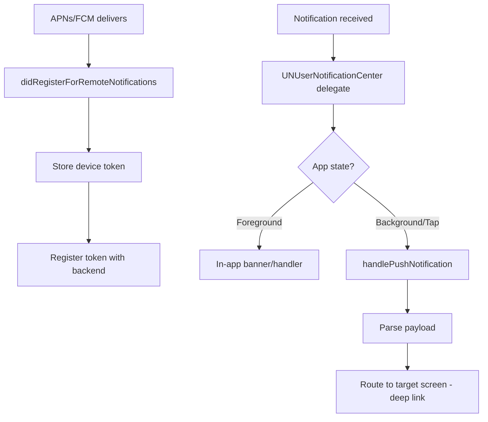

### 10.6 Deep Linking Architecture

- Push payloads carry routing info → `handlePushNotification(launchOptions)`
- `notificationHandler` closure routes to target screen
- Partner deep links: `AppDelegate.isFromKogoDeeplink` (KogoAuto)
- URL schemes registered in Info.plist
- Flags: `isRedirectFromDeeplinking`, `fromScreen: ScreenFlow`

---

## 11. Important Entry Points

| Entry Point | File | Role |
|-------------|------|------|
| `AppDelegate` | `Application/AppDelegate.swift` | App lifecycle, bootstrap, push/deep link |
| `LoginVC` | `Modules/Login/` | Authentication entry |
| `DashboardVC` | `Modules/Dashboard/` | Legacy main screen post-login |
| `UnifiedDashboardVC` | `UnifiedDashboard/` | Newer main screen |
| `BottomTABController` | `Modules/BottomTAB/` | Root tab navigation |
| `BluetoothService.shared` | `SupportingFiles/BluetoothService/` | BLE entry point |
| `NetworkConfiguration.shared` | `SupportingFiles/WebService/` | Environment bootstrap |
| `EVBluetoothService.shared` | `TVS_EV/EV_SupportingFiles/` | EV BLE entry point |

**Bootstrap order:**
```
AppDelegate.didFinishLaunching
  → NetworkConfiguration (environment)
  → DataManager (state)
  → LoginVC OR session restore
  → BottomTABController → DashboardVC/UnifiedDashboardVC
  → BluetoothService (on connect)
```

---

## 12. High-Level Data Flow

### 12.1 User Action Flow (MVVM)

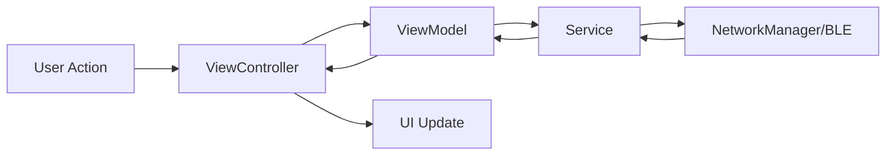

### 12.2 BLE Data Flow

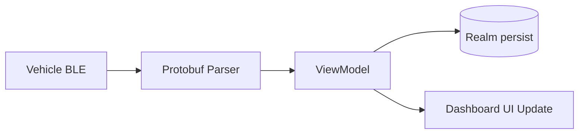

### 12.3 Push Notification → Navigation

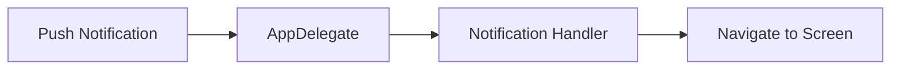

### 12.4 GraphQL Subscription → Live UI

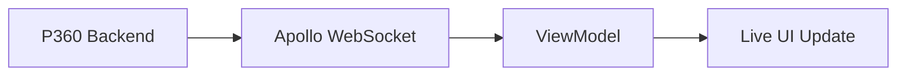

### Data Flow Summary Table

| Source | Path | Destination |
|--------|------|-------------|
| User tap | VC → ViewModel → Service → Network/BLE | Backend/Vehicle |
| BLE telemetry | Vehicle → Parser → ViewModel | UI + Realm + EventHub |
| Push notification | APNs/FCM → AppDelegate → Handler | Target screen |
| Live tracking | P360 → Apollo subscription → ViewModel | Live UI |
| Remote telemetry | P360 → MQTT → ViewModel | UI |

---

## Appendix: Quick Reference for New Vendors

### First Day Setup
```bash
cd SourceCode
pod install
open TVS.xcworkspace   # Never open .xcodeproj
```

### Build a Region (Dev)
```bash
xcodebuild -workspace TVS.xcworkspace -scheme "TVS-Region DEV/UAT/Staging/Prod" \
  -sdk iphonesimulator \
  -destination 'platform=iOS Simulator,name=iPhone 15' build
```

### Where to Look for More Detail

| Topic | Location |
|-------|----------|
| All API endpoints | `SupportingFiles/WebService/APIList.swift` |
| BLE protocol per vehicle | `SupportingFiles/BluetoothService/{Vehicle}BLEDataParser/` |
| Environment config | `SupportingFiles/WebService/NetworkConfiguration.swift` |
| App bootstrap | `Application/AppDelegate.swift` |
| GraphQL schema | `TVS/schema.graphqls`, `CODPSchema/` |
| EV subsystem | `TVS_EV/` |
| Build settings | `AppConfig/*.xcconfig` |
| Steering/conventions | `.kiro/steering/` |

### Conventions Cheat Sheet

| Element | Pattern | Example |
|---------|---------|---------|
| ViewController | `*VC` | `DashboardVC` |
| ViewModel | `*ViewModel` | `DashboardViewModel` |
| Protocol | `*Protocol` / `*Delegate` | `MapServiceProtocol` |
| Vehicle module | `IOT-{Code}` | `IOT-U399C` |
| Extension | `Type+Feature.swift` | `BikeService+N109.swift` |

---

*End of High-Level Code Document. For implementation-level detail,
consult the referenced source files and `.kiro/steering/` guidelines.*


---

## Document Ownership

| Role | Person / Team | Contact |
|------|---------------|---------|
| **Project Manager** | Smaranika Tripathy | smaranika.tripathy@tvsmotor.com |
| **Product Owner** | ISSM Team / Malavika | malavika@tvsmotor.com |
| **Owner** | Sumit Prajapat | sumit.prajapat@tvsmotor.com |
