# TVS Connect iOS — High Level Design (HLD)

> Template Reference: TVS Motor Company HLD Template (Confluence DE2 space)

---

## 1. Document Information

| Field | Value |
|-------|-------|
| Document Title | TVS Connect iOS — High Level Design |
| Version | 1.0 (Draft) |
| Date | 24-Jun-2026 |
| Author | TVS Motor Company |
| Owner | TVS Motor Company  |
| Status | Draft for Review |
| Classification | Internal — Engineering Partner Use |

### Review History

| Version | Date | Author | Description of Change | Reviewer |
|---------|------|--------|-----------------------|----------|
| 0.1 | _TBD_ | _TBD_ | Initial draft | _TBD_ |
| 1.0 | _TBD_ | _TBD_ | First baseline | _TBD_ |

### Approval

| Role | Name | Signature | Date |
|------|------|-----------|------|
| Engineering Lead | _TBD_ | | |
| Solution Architect | _TBD_ | | |
| Product Owner | _TBD_ | | |
| Security Reviewer | _TBD_ | | |

---

## 2. Introduction

### 2.1 Purpose

This document describes the high-level design of the TVS Connect iOS
application. It explains the system architecture, major components,
service interactions, deployment topology, and integration points to
enable engineering partners and architects to understand the solution
without needing to read the entire codebase first.

### 2.2 Scope

In scope:
- The TVS Connect iOS application (7 regional targets)
- Client-side architecture and component design
- Integration with backend, telemetry, maps, and vehicle (BLE) systems

Out of scope:
- Backend service internal design (P360, EventHub) — owned by separate teams
- Vehicle ECU firmware internals
- Detailed API contracts (see referenced API documentation)

### 2.3 Intended Audience

- Engineering vendors / partner development teams
- Solution and mobile architects
- QA and DevOps engineers
- Security reviewers

### 2.4 References and Related Documents

| Document | Location |
|----------|----------|
| High-Level Code Document (HLC) | `docs/HLC.md` |
| TVS HLD Template | Confluence DE2 space |
| API Endpoint List | `SourceCode/TVS/SupportingFiles/WebService/APIList.swift` |
| GraphQL Schema (P360) | `SourceCode/TVS/schema.graphqls` |
| Build/Steering Conventions | `.kiro/steering/` |
| Apollo Codegen Config | `SourceCode/TVS/apollo-codegen-config.json` |

---

## 3. System Architecture

### 3.1 Overall System Topology

TVS Connect operates across three tiers: the **mobile client**, the
**backend services** (REST + GraphQL + telemetry), and the **vehicle ECU**
(connected over BLE).

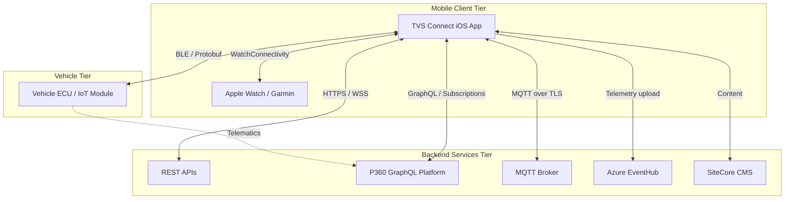

### 3.2 Client-Side Architecture

The app follows **MVVM + Singleton Services + Protocol-based DI (Swinject)**.

- **MVVM**: ViewControllers bind to ViewModels; ViewModels hold business logic
- **Singletons**: Shared services (`DataManager`, `BluetoothService`, etc.)
- **Protocol-based DI**: Newer modules inject protocol-typed dependencies

### 3.3 Multi-Target Build Architecture

A single codebase produces 8 regional app variants via Xcode targets that
share a common `tvs_pods` dependency set. Region behavior is selected at
build time through compiler flags and `AppTarget.current`.

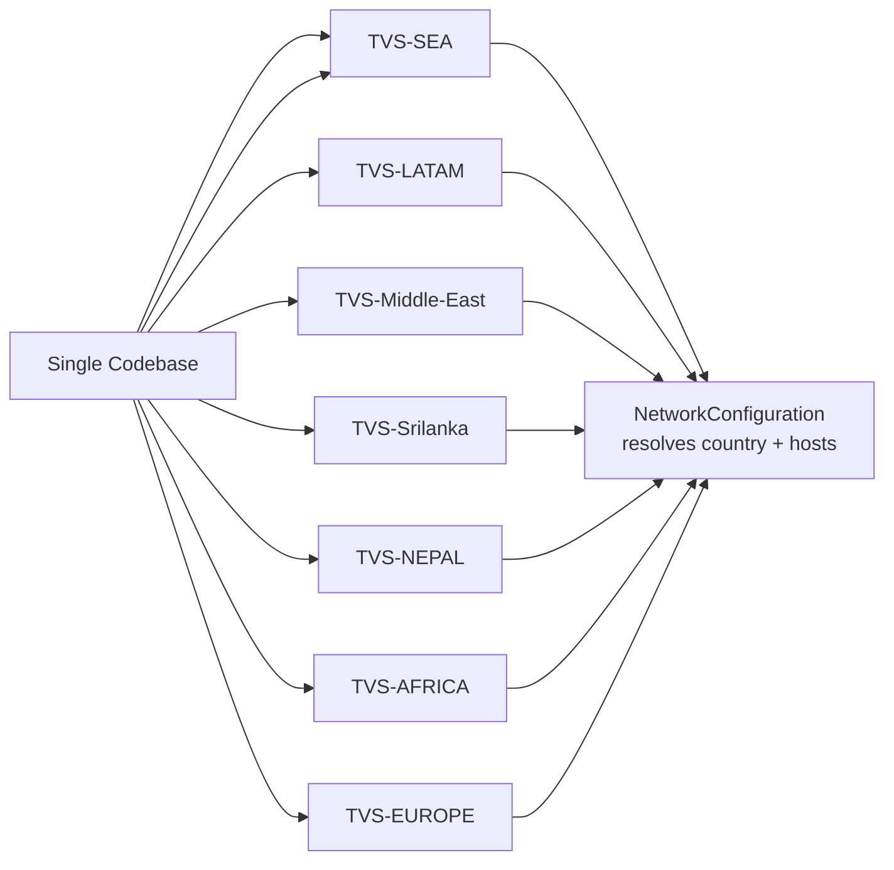

### 3.4 Layered Architecture

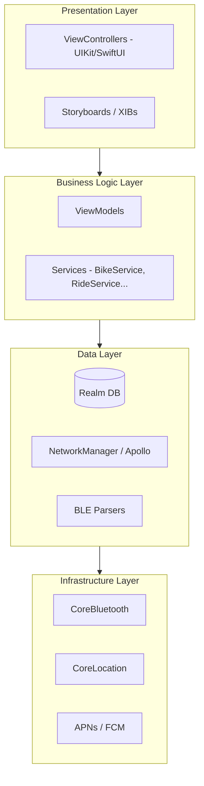

| Layer | Responsibility | Key Elements |
|-------|----------------|--------------|
| Presentation | UI rendering, user interaction | `*VC`, Storyboards, SwiftUI views |
| Business Logic | Domain logic, orchestration | `*ViewModel`, `*Service` |
| Data | Persistence, network, parsing | Realm, NetworkManager, Apollo, Protobuf parsers |
| Infrastructure | OS framework access | CoreBluetooth, CoreLocation, Push |

---

## 4. Architecture Diagram Description

### 4.1 Component Interaction Diagram

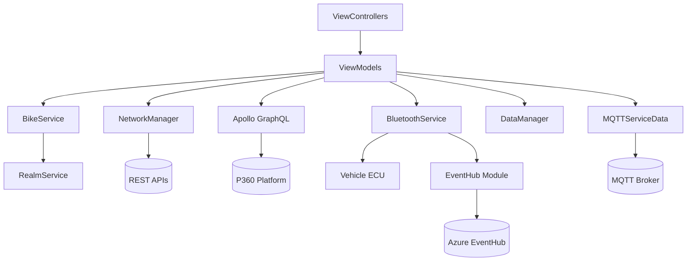

### 4.2 Data Flow: App ↔ REST ↔ GraphQL ↔ MQTT ↔ EventHub

| Channel | Protocol | Use Case | Direction |
|---------|----------|----------|-----------|
| REST | HTTPS (Alamofire) | CRUD, profile, service booking | Request/Response |
| GraphQL | HTTPS + WSS (Apollo) | Vehicle mgmt, geofencing, live tracking | Query/Mutation/Subscription |
| MQTT | MQTT over TLS (CocoaMQTT) | Real-time telemetry streaming | Pub/Sub |
| EventHub | HTTPS | Telemetry upload per vehicle | Upload (App → Cloud) |

### 4.3 BLE Communication Diagram

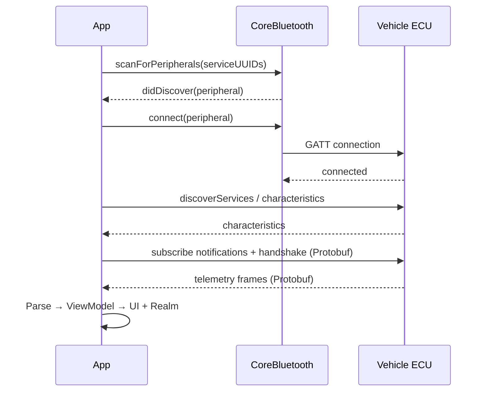

### 4.4 Maps Integration & Provider Selection

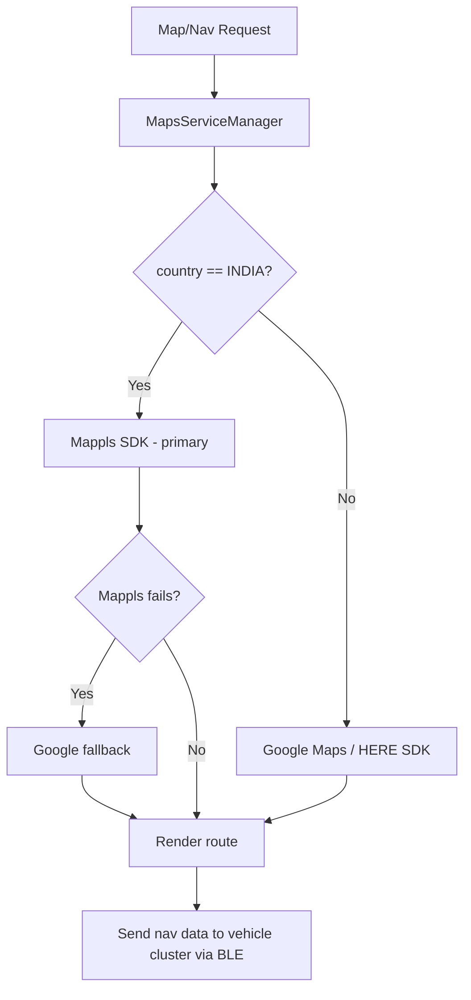

> Provider abstraction lives behind `MapServiceProtocol`, implemented by
> `MapManager/Mappls/`, `MapManager/GoogleMaps/`, `MapManager/HereMap/`.

---

## 5. Major Components/Services

| # | Component | Responsibility | Key Classes |
|---|-----------|----------------|-------------|
| 1 | Authentication Service | OTP login, token mgmt, session | `LoginVC`, `CommonAPIClient`, `OnboardAPIClient` |
| 2 | Vehicle Management | Multi-vehicle CRUD, selection | `BikeService` (+ extensions) |
| 3 | BLE Communication | Pairing, telemetry, commands | `BluetoothService` (+ 14 parsers/senders) |
| 4 | Telemetry Pipeline | BLE → Protobuf → EventHub/MQTT | `EventHub` module, `MQTTServiceData` |
| 5 | Navigation Service | Multi-provider routing/nav | `MapsServiceManager`, `MapServiceProtocol` |
| 6 | Dashboard Engine | Real-time data binding | `DashboardVC`, `UnifiedDashboardVC` |
| 7 | EV Management | iQube battery | `EVBluetoothService`, `EVDataManager` |
| 8 | OTA Service | Firmware download & flash | `OTA` module + BLE senders |
| 9 | Push Notification | FCM/APNs handling | `AppDelegate`, `NotificationService` |
| 10 | Local Storage | Offline-first persistence | `RealmService`, `RealmManager` |

### 5.1 Authentication Service
- OTP-based phone authentication; region set before login
- Token storage via Keychain + Realm; session restore on launch
- RSA-based token generation for secure API calls

### 5.2 Vehicle Management (BikeService)
- Supports multiple vehicles per user (garage)
- Vehicle-specific extensions (`+N109`, `+N251`, `+N360`, `+U408`, `+NonIOT`)
- Bridges backend vehicle data ↔ local Realm models

### 5.3 BLE Communication (BluetoothService)
- Single `CBCentralManager`-based manager
- 14 vehicle-specific Protobuf parsers + per-vehicle senders
- Handles pairing, telemetry, ride modes, OTA, diagnostics, find-me

### 5.4 Telemetry Pipeline
- BLE frames → Protobuf decode → ViewModel → UI + Realm
- Parallel upload to Azure EventHub (per-vehicle endpoint)
- Remote path via MQTT/GraphQL when out of BLE range

### 5.5 Navigation Service
- Protocol-based multi-provider (Mappls / Google / HERE)
- Region-driven provider selection with fallback
- Turn-by-turn projected to vehicle cluster

### 5.6 Dashboard Engine
- Legacy `DashboardVC` + newer `UnifiedDashboardVC` (MVVM)
- Real-time binding to BLE/MQTT telemetry streams
- Vehicle-specific dashboards via `BLEType` routing

### 5.7 EV Management (iQube)
- Parallel `EV`-prefixed singletons subsystem (`TVS_EV/`)
- Battery state, range, trip planner
- P360 platform + MQTT for low-cost telematics

### 5.8 OTA Service
- Version check → encrypted package download → chunked BLE transfer
- Integrity verification, resume support, vehicle reboot coordination

### 5.9 Push Notification Service
- Firebase Cloud Messaging + APNs
- Token registration with backend, deep-link routing on tap

### 5.10 Local Storage (Realm)
- Offline-first; UI reads from Realm, syncs with backend
- Schema v49, migrations managed in `AppDelegate` + `Migration/` using xcconfig file region based

---

## 6. Service Interaction

### 6.1 Login & Authentication

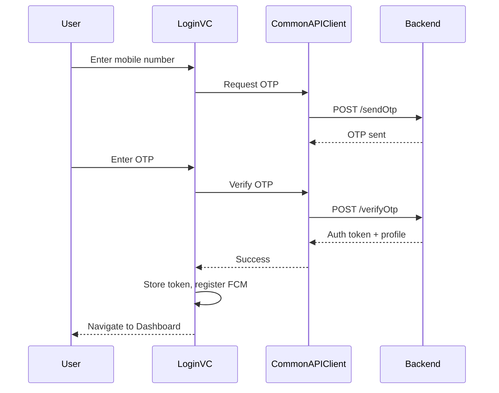

### 6.2 Vehicle BLE Pairing

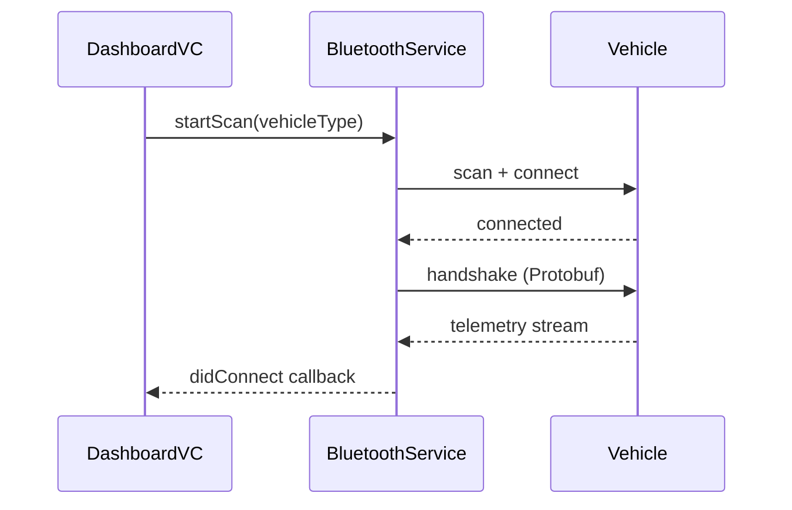

### 6.3 Real-time Dashboard Data

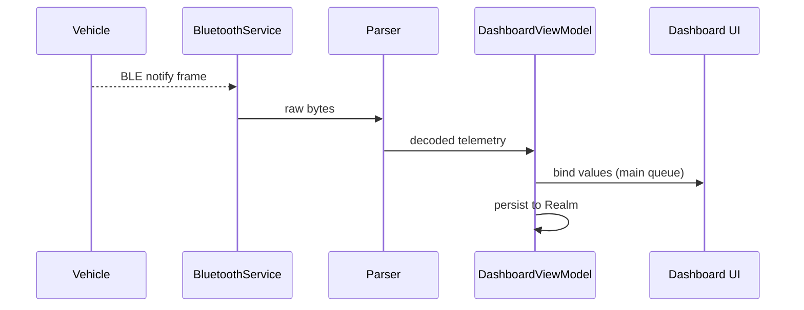

### 6.4 Navigation Session

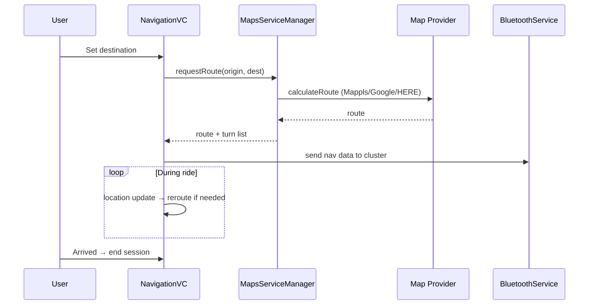

### 6.5 OTA Update Process

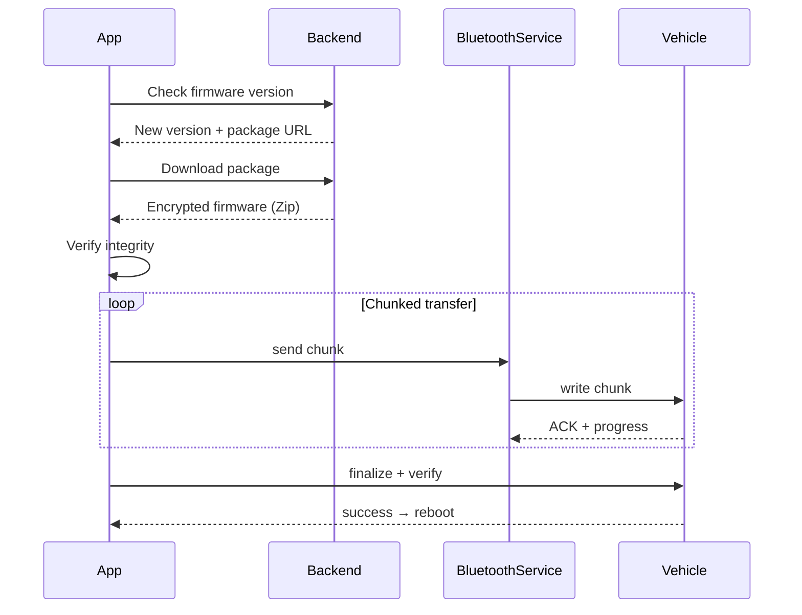

### 6.6 Inter-Service Communication Patterns

| Pattern | Mechanism | Usage |
|---------|-----------|-------|
| Request/Response | Closures, `Result<T, Error>` | API calls |
| Delegation | `weak` delegate protocols | BLE callbacks, VC↔VM |
| Broadcast events | `NotificationCenter` | Cross-module events (e.g., stop voice assist) |
| Shared state | Singletons | `DataManager`, `NetworkConfiguration` |
| Reactive streams | Apollo subscriptions / MQTT | Live tracking, telemetry |

---

## 7. Deployment Architecture

### 7.1 App Store Deployment
- Single codebase → 7 regional targets → 7 App Store listings
- Each target: unique bundle ID, Info.plist, signing assets

### 7.2 Build Pipeline

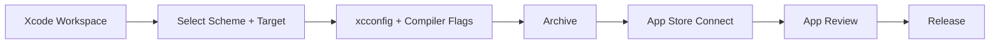

### 7.3 CI/CD & Code Quality
- **TVSCI** scheme for CI builds
- **SonarQube** static analysis via `sonar-project.properties`
- **SwiftLint** reports feed SonarQube
- **Jazzy** for API documentation generation

### 7.4 Certificate Management

| Asset | Purpose | Location |
|-------|---------|----------|
| Development Certificate | Dev signing | `Certificates/DevelopmentCertificates.p12` |
| Distribution Certificate | Release signing | `Certificates/DistributionCertificates.p12` |
| APNs Certificates | Push (per region) | `Certificates/APNSCertificates*.p12` |
| Provisioning Profiles | Per region/build | `Certificates/*.mobileprovision` |

### 7.5 Environment Switching

| Scheme | Environment | Flag |
|--------|-------------|------|
| TVS-Region DEV | Development | `DEV_DEBUG` / `DEV_RELEASE` |
| TVS-Region Staging/UAT | QA | — |
| TVS-Region | Production | `PROD_RELEASE` |

Hosts resolved by `NetworkConfiguration.shared` using `country` +
`buildEnvironment`, set in `AppDelegate.settingEnvironment()`.

---

## 8. Infrastructure Topology

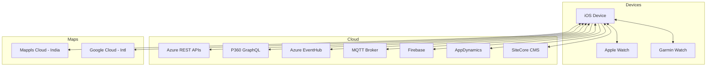

| Tier | Component | Notes |
|------|-----------|-------|
| Client | iOS + Apple Watch + Garmin | Companion wearables |
| Backend | Azure REST + P360 GraphQL | Connected vehicle backend |
| Telemetry | Azure EventHub | Ingestion per vehicle |
| Real-time | MQTT Broker | Live streaming |
| Maps | Mappls (India), Google (Intl) | Provider by region |
| Analytics | Firebase + AppDynamics | Crash + APM |
| CMS | SiteCore | Community content |

---

## 9. Database Interactions

### 9.1 Realm Local Database

- **Schema version:** - (incremented on any model change in `xcconfig file for each region`)
- **Migration strategy:** `Migration.shared.realmMigration(schemaVersion)`
  on launch; region-specific migrations in `Migration/` (Africa, ME, SEA)
- **Offline-first:** UI reads from Realm; network updates write back to Realm

### 9.2 Key Object Models (Representative)

| Model | Purpose |
|-------|---------|
| Vehicle | Selected/registered vehicle metadata, type, theme |
| User | Profile, session, preferences |
| Ride | Trip records, stats, eco scoring |
| Telemetry | Cached vehicle sensor data |
| Notification | Stored push payloads |

> 📍 _Exact Realm object definitions: see `Model/` and `Services/Realm*`._

### 9.3 Migration Strategy

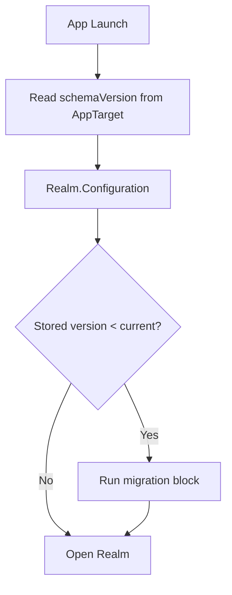

### 9.4 Caching Strategy
- Realm as primary cache (offline-first)
- Image caching via Kingfisher / SDWebImage
- API responses persisted to Realm for offline display

---

## 10. API Integrations

| Integration | Tech | Scope |
|-------------|------|-------|
| REST APIs | Alamofire | 500+ endpoints (`APIList.swift`) |
| GraphQL (P360) | Apollo | Device mgmt, geofencing, live tracking |
| GraphQL Subscriptions | Apollo WebSocket | Live vehicle status |
| MQTT | CocoaMQTT | Real-time telemetry stream |
| EventHub | HTTPS | Telemetry upload per vehicle type |
| Mappls | SDK + REST | Maps/nav (India) |
| Google Maps | SDK | Maps/nav (Intl) |
| HERE | SDK | Maps/nav (Intl) |
| what3words | SDK | Location addressing |
| KogoAuto | SDK | Partner connected features |

### 10.1 GraphQL Operations (P360)
- **Queries:** vehicle list, device status, geofence config
- **Mutations:** geofence create/update, device commands
- **Subscriptions:** live location, real-time vehicle state
- Generated code in `CODPSchema/` (do not hand-edit)

> 📍 _Detailed API contracts and payloads: TBD — vendor to reference
> backend API documentation and `schema.graphqls`._

---

## 11. Authentication / Authorization Flow

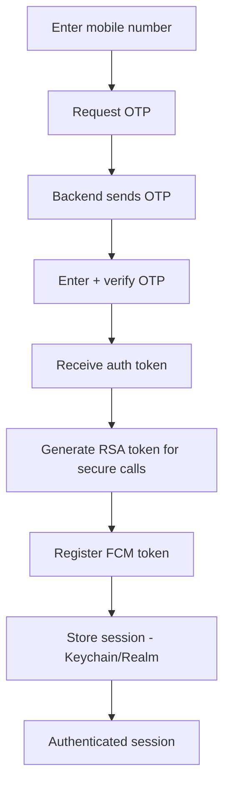

| Aspect | Mechanism |
|--------|-----------|
| Primary auth | OTP via mobile number |
| Token storage | Keychain + Realm |
| Secure API calls | RSA token generation |
| Session restore | On app launch |
| Multi-session | Logout-from-all-clients supported |
| Push registration | FCM token registered post-login |
| Social/Apple Sign-In | Present but commented/disabled (`//APPSTORE2.2`) |

---

## 12. External Systems

| System | Role | Integration |
|--------|------|-------------|
| P360 Platform | Connected vehicle backend | GraphQL (Apollo) |
| Azure EventHub | Telemetry ingestion | HTTPS upload |
| Firebase | Crashlytics, FCM, Analytics | SDK |
| AppDynamics | APM monitoring | SDK (ADEUM) |
| Google | Maps/Nav/Places (Intl) | SDK |
| HERE | Maps (Intl) | SDK |

---

## 13. Infrastructure Dependencies (Apple Frameworks)

| Framework | Purpose |
|-----------|---------|
| APNs | Push notification delivery |
| CoreBluetooth | BLE vehicle communication |
| CoreLocation | GPS, ride tracking, geofencing |
| Network / Reachability | Connectivity monitoring |
| CallKit | Call state detection (ride safety) |
| BackgroundTasks | Telemetry upload, background refresh |
| UserNotifications | Local + remote notification handling |
| AVFoundation (Audio) | Voice assist audio session |

---

## 14. High-Level Sequence Flows

### 14.1 App Launch → Environment → Login → Dashboard

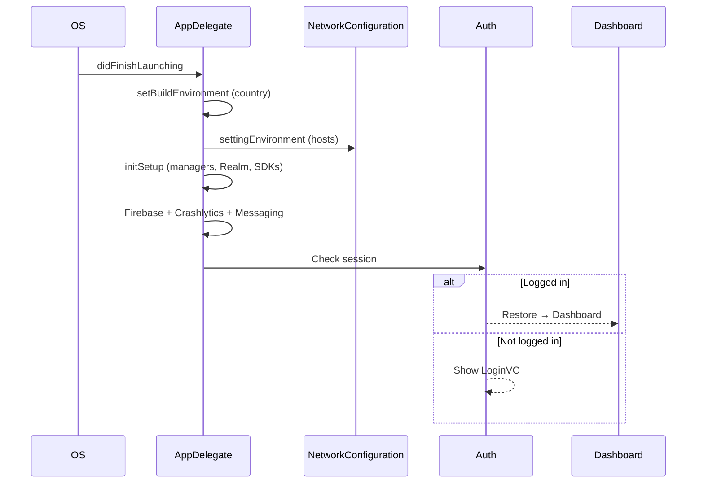

### 14.2 Vehicle Discovery → Pairing → Telemetry Stream

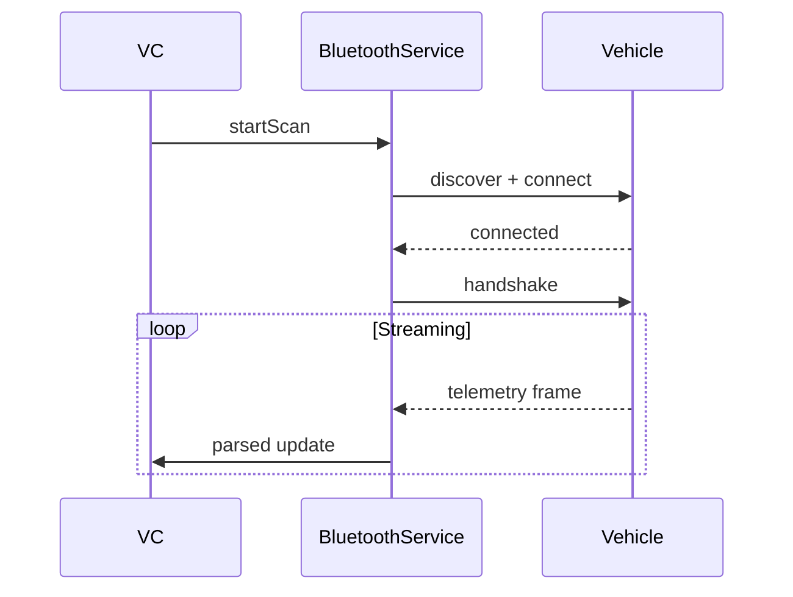

### 14.3 Ride Start → Collection → End → Sync

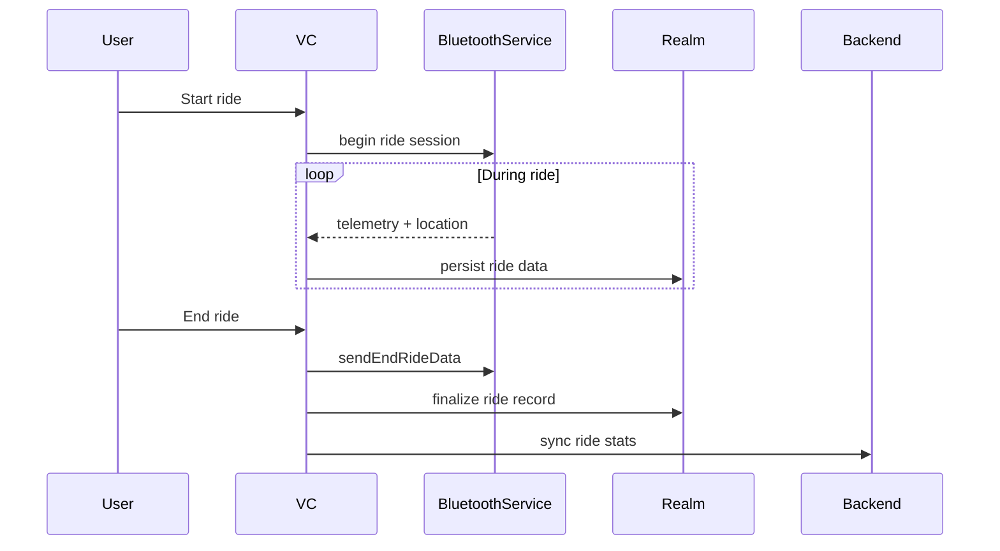

### 14.4 Push Notification → Deep Link → Feature Screen

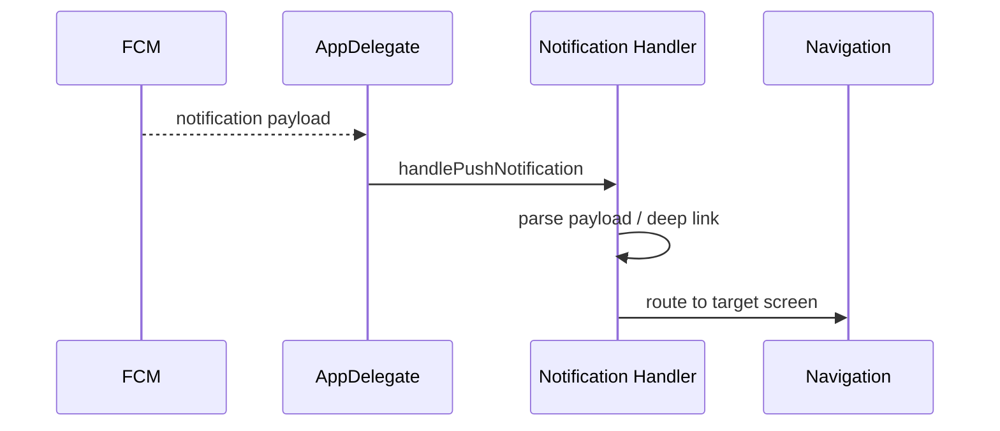

### 14.5 OTA Check → Download → Flash → Verify

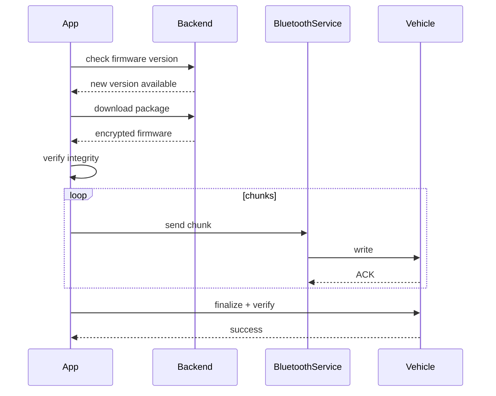

---

## 15. Scalability and Resiliency Considerations

| Concern | Approach |
|---------|----------|
| Offline availability | Offline-first via Realm local storage |
| BLE reliability | Auto-reconnection logic (exponential backoff — _strategy TBD/verify_) |
| Network failures | Alamofire retry + reachability monitoring |
| Background telemetry | BackgroundTasks for upload while backgrounded |
| Memory | Singleton lifecycle + `weak` delegates to avoid retain cycles |
| Multi-vehicle | Dynamic BLE parser selection via `BLEType` |
| Regional failover | Per-country URL config in `NetworkConfiguration` |
| Crash recovery | Firebase Crashlytics + uncaught exception handler |
| Performance monitoring | AppDynamics APM |

### 15.1 Resiliency Detail

- **BLE reconnection:** On unexpected disconnect, the service attempts
  reconnection; intentional disconnects flagged via
  `DataManager.isIntentionalBLEDisConnection`.
- **Graceful teardown:** On terminate/logout, end-ride data is sent and
  BLE/MQTT connections are cancelled (`applicationWillTerminate`).
- **Telemetry durability:** Local persistence before upload ensures data
  is not lost if upload fails.

### 15.2 Open Items / Vendor Input Needed (TBD)

| Item | Owner | Notes |
|------|-------|-------|
| Exact BLE backoff/retry parameters | _TBD_ | Confirm from BluetoothService impl |
| Network retry policy specifics | _TBD_ | Alamofire interceptor config |
| API rate limits / quotas | _TBD_ | Backend team |
| EventHub partitioning strategy | _TBD_ | Telemetry team |
| Token refresh/expiry windows | _TBD_ | Auth/security team |
| Detailed Realm object schemas | _TBD_ | Reference `Model/` |

---

## Appendix A — Glossary

| Term | Meaning |
|------|---------|
| BLE | Bluetooth Low Energy |
| ECU | Electronic Control Unit (vehicle) |
| P360 | TVS connected vehicle backend platform |
| OTA | Over-the-Air (firmware update) |
| FCM | Firebase Cloud Messaging |
| APM | Application Performance Monitoring |
| MVVM | Model-View-ViewModel |
| DI | Dependency Injection |
| iQube | TVS electric scooter series |

## Appendix B — Where to Find More Detail

| Topic | Source |
|-------|--------|
| Code-level architecture | `docs/HLC.md` |
| API endpoints | `SupportingFiles/WebService/APIList.swift` |
| GraphQL schema | `TVS/schema.graphqls`, `CODPSchema/` |
| BLE protocols | `SupportingFiles/BluetoothService/` |
| Environment config | `WebService/NetworkConfiguration.swift` |
| Conventions | `.kiro/steering/` |

---

> **Security Notice:** This document intentionally omits API keys, tokens,
> credentials, and proprietary business logic. Implementation-specific
> secrets are resolved at runtime via `AppKeys` and protected by SSL
> certificate pinning.

*End of High Level Design Document.*

---

## Document Ownership

| Role | Person / Team | Contact |
|------|---------------|---------|
| **Project Manager** | Smaranika Tripathy | smaranika.tripathy@tvsmotor.com |
| **Product Owner** | ISSM Team / Malavika | malavika@tvsmotor.com |
| **Owner** | Sumit Prajapat | sumit.prajapat@tvsmotor.com |
