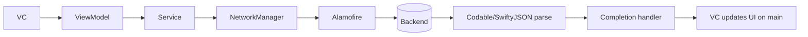
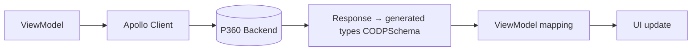
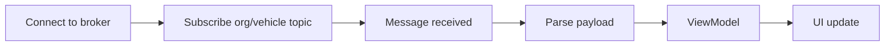
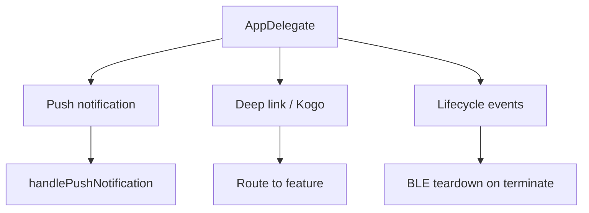
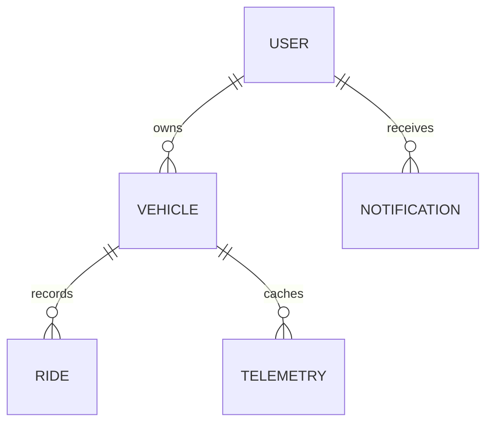
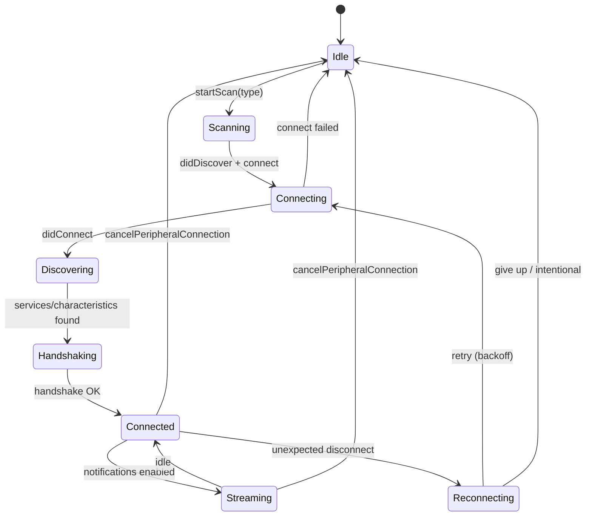

# TVS Connect iOS — Low Level Design (LLD)

> Template Reference: TVS Motor Company LLD Template (Confluence DE2 space)

---

## 1. Document Information

| Field | Value |
|-------|-------|
| Document Title | TVS Connect iOS — Low Level Design |
| Version | 1.0 (Draft) |
| Date | _TBD_ |
| Author | _TBD (Vendor / iOS Developer)_ |
| Owner | TVS Motor Company — Digital Engineering |
| Status | Draft for Review |
| Classification | Internal — Engineering Partner Use |

### Change History

| Version | Date | Author | Description |
|---------|------|--------|-------------|
| 0.1 | _TBD_ | _TBD_ | Initial draft |
| 1.0 | _TBD_ | _TBD_ | First baseline |

### Conventions Used in This Document

- `[VEHICLE-SPECIFIC]` — behavior varies per vehicle code (U399C, N251, etc.)
- Code snippets are pseudocode reflecting actual project conventions
- File paths are relative to `SourceCode/TVS/`

---

## 2. Detailed Module Breakdown

### 2.1 Login Module

| Attribute | Detail |
|-----------|--------|
| Location | `Modules/Login/` |
| Storyboard | `Storyboard/Login.storyboard` |
| Controllers | `LoginVC`, OTP verification VC |
| ViewModels | `LoginViewModel` |
| Models | `UserInfo`, login response (Codable) |
| Dependencies | `CommonAPIClient`, `OnboardAPIClient`, `NetworkConfiguration`, `RealmService` |
| Entry Point | `LoginVC` (shown when no valid session) |

Public interface:
```swift
final class LoginViewModel {
    func requestOTP(mobile: String, completion: @escaping (Result<Void, Error>) -> Void)
    func verifyOTP(mobile: String, otp: String, completion: @escaping (Result<UserInfo, Error>) -> Void)
}
```

### 2.2 Dashboard Module (Legacy + Unified)

| Attribute | Legacy | Unified |
|-----------|--------|---------|

| Location | `Modules/Dashboard/` | `UnifiedDashboard/` |
| Controller | `DashboardVC` | `UnifiedDashboardVC` |
| ViewModel | `DashboardViewModel` | `UnifiedDashboardViewModel` |
| Storyboard | `Dashboard.storyboard` | `UnifiedDashboard.storyboard` |
| Sub-features | Vehicle-specific cells | ErrorHandling, NonConnectedUsers, SOS, U716 |
| Dependencies | `BluetoothService`, `BikeService`, `DataManager`, `RealmService` |

Public interface:
```swift
final class UnifiedDashboardViewModel {
    weak var delegate: DashboardViewDelegate?
    func loadSelectedVehicle()
    func startTelemetryBinding()      // subscribes to BLE/MQTT updates
    func handleConnectionState(_ state: BLEConnectionState)
}
```

### 2.3 Vehicle IOT Module (IOT-Common + IOT-U399C) [VEHICLE-SPECIFIC]

| Attribute | Detail |
|-----------|--------|
| Common Location | `Modules/IOT-Common/` |
| Example Vehicle | `Modules/IOT-U399C/` (Apache RR 310) |
| Structure | `Controller/`, `ViewModel/`, `Model/`, `View/`, `DataSource/` |
| Storyboard | `Storyboard/IOT-U399C-Storyboard/` |
| BLE Parser | `BluetoothService/U399CBLEDataParser/` |
| BLE Sender | `U399CBLESender` |
| Realm | `RealmServiceU399C`, `RealmWidgetMgtU399C` |
| EventHub | `eventHubEndpointU399C` (per-vehicle topic) |

`IOT-Common` provides shared base controllers, common BLE command
abstractions, and reusable dashboard widgets. Each `IOT-{Code}` module
specializes presentation and data handling for that vehicle.

### 2.4 Navigation Module

| Attribute | Detail |
|-----------|--------|
| Location | `Modules/Navigation/`, `SupportingFiles/MapManager/` |
| Controller | `NavigationVC` |
| Storyboard | `Navigation.storyboard` |
| Abstraction | `MapServiceProtocol`, `MapsServiceManager` |
| Providers | `MapManager/Mappls/`, `/GoogleMaps/`, `/HereMap/` |
| Dependencies | `LocationManager`, `BluetoothService` (cluster projection) |

```swift
protocol MapServiceProtocol {
    func calculateRoute(from: Coordinate, to: Coordinate,
                        completion: @escaping (Result<Route, MapError>) -> Void)
    func startNavigation(route: Route)
    func stopNavigation()
}
```

### 2.5 BLE Layer (BluetoothService + Parsers + Senders)

| Attribute | Detail |
|-----------|--------|
| Location | `SupportingFiles/BluetoothService/` |
| Core | `BluetoothService.swift` (singleton, `CBCentralManager`) |
| Delegate | `BluetoothServiceDelegate`, `BluetoothService+PeripheralDelegate` |
| Type Enum | `BLEType.swift` (vehicleTypeId → vehicle) |
| Parsers | 14 dirs, e.g. `U399CBLEDataParser/`, `N251BLEDataParse/` |
| Senders | `U279BLESender`, `U399CBLESender`, `N251BLESender`, ... |
| Conversion | `BluetoothDataConversion.swift` |
| Mock | `BluetoothMockDataService.swift` |
| Extensions | `BluetoothService+{N109/N112/N251/U399C/U408/FindMe}.swift` |

```swift
final class BluetoothService: NSObject {
    static let shared = BluetoothService()
    weak var delegate: BluetoothServiceDelegate?
    func startScan(for type: BLEType)
    func connect(_ peripheral: CBPeripheral)
    func cancelPeripheralConnection()
    func connectedPeripheralName() -> String?
}
```

### 2.6 EV Module (TVS_EV/)

| Attribute | Detail |
|-----------|--------|
| Location | `TVS_EV/` |
| Sub-dirs | `EV_Modules/`, `EV_Services/`, `EV_Storyboard/`, `EV_SupportingFiles/` |
| Singletons | `EVDataManager`, `EVBluetoothService`, `EVNetworkConfiguration` |
| Models | `U388/`, `U546/` (EV vehicle variants) |
| GraphQL | `iQubeQueries.graphql` |
| Detection | `CommonMethods.isiQubeSeries()` |
| Dependencies | Apollo, MQTT, P360 platform |

> The EV subsystem mirrors the main app with `EV`-prefixed singletons.
> Routing into EV occurs when the selected vehicle is iQube series.

### 2.7 OTA Module

| Attribute | Detail |
|-----------|--------|
| Location | `Modules/OTA/` |
| Dependencies | `BluetoothService` (+ vehicle senders), `Zip`/`ZIPFoundation`, backend version API |
| Trigger | Settings or push notification |
| Flow | Version check → download → integrity check → chunked BLE flash → verify |

### 2.8 Profile Module

| Attribute | Detail |
|-----------|--------|
| Location | `Modules/Profile/` |
| Controller | `ProfileVC` |
| ViewModel | `ProfileViewModel` |
| Storyboard | `Profile.storyboard` |
| Service | `ManageProfile`, `UserAddressService` |
| Dependencies | `NetworkManager`, `RealmService`, `DataManager` |

### 2.9 Services Layer (BikeService, RealmService, RideService)

| Service | Location | Responsibility |
|---------|----------|----------------|
| `BikeService` | `Services/BikeService.swift` (+ extensions) | Vehicle CRUD, selection |
| `RealmService` | `Services/RealmManager.swift` + extensions | Static DB operations |
| `RideService` | `Services/RideService+*.swift` | Ride lifecycle per vehicle |

Vehicle extensions follow `Type+Feature.swift` convention:
`BikeService+N109.swift`, `RealmServiceU399C.swift`, `RideService+U408.swift`.

### 2.10 Network Layer (WebService/)

| File | Responsibility |
|------|----------------|
| `NetworkConfiguration.swift` | Host URLs by country + environment |
| `NetworkManager.swift` | HTTP execution (Alamofire) |
| `APIList.swift` | 500+ endpoint definitions |
| `CommonAPIClient.swift` | Shared API calls (token, notifications) |
| `OnboardAPIClient.swift` | Onboarding/auth API calls |
| `ErrorHandling.swift` | Error mapping |
| `NetworkResponse.swift` | Response wrapper |
| `TvsUserAgent.swift` | User-Agent header construction |

Per-vehicle API service dirs: `U399CApiServices/`, `U449ApiServices/`,
`U368ApiServices/`, `U400ApiServices/`, `N597ApiServices/`.

---

## 3. Class/Service Responsibilities

### 3.1 Singletons

| Class | Responsibility | Thread Safety | Key Methods |
|-------|----------------|---------------|-------------|
| `DataManager` | App state, selected vehicle, session timing | Main thread | `set(_:_:)`, `selectedBike`, flags |
| `BluetoothService` | BLE lifecycle, telemetry | Dedicated/CB queue → main for UI | `startScan`, `connect`, `cancelPeripheralConnection` |
| `NetworkConfiguration` | URL/host management | Main thread (set at launch) | `country`, `buildEnvironment`, host vars |
| `NetworkManager` | HTTP execution | Background (Alamofire) | `request`, `execute` |
| `BikeService` | Vehicle CRUD, garage | Main thread | `getUserVehicles`, `selectVehicle` |
| `LocationManager` | GPS, geofencing | Background (CL delegate) | `startUpdatingLocation`, geofence APIs |
| `MQTTServiceData` | MQTT connection/stream | Background | `connect`, `subscribe`, `disconnectToServer` |
| `EVBluetoothService` | EV BLE lifecycle | Dedicated queue | `connect`, `cancelPeripheralConnection` |

### 3.2 ViewModels Pattern

**Protocol-based DI (newer code):**
```swift
protocol VehicleAPIProtocol {
    func fetchVehicles(completion: @escaping (Result<[Vehicle], Error>) -> Void)
}

final class GarageViewModel {
    private let api: VehicleAPIProtocol
    init(api: VehicleAPIProtocol = VehicleAPI()) { self.api = api }
}
```

**Delegate-based VC communication:**
```swift
protocol DashboardViewDelegate: AnyObject {
    func didUpdateTelemetry(_ data: TelemetryModel)
    func didChangeConnectionState(_ state: BLEConnectionState)
}
// VC holds: weak var to VM delegate; VM holds weak delegate to VC
```

**Completion handler patterns:**
| Style | Usage |
|-------|-------|
| `Result<T, Error>` | Newer code |
| `(Bool, [String: Any]?)` | Legacy code |

### 3.3 Data Models

| Model Type | Tech | Usage |
|------------|------|-------|
| Persisted | Realm `Object` | Vehicle, User, Ride, Telemetry cache |
| API responses | `Codable` | Newer network responses |
| Legacy parsing | SwiftyJSON | Older API responses |
| BLE data | Protobuf | Vehicle telemetry frames |

---

## 4. API Flow Details

### 4.1 REST Request Lifecycle



### 4.2 GraphQL Flow



### 4.3 MQTT Flow



### 4.4 Error Handling Per Layer

| Layer | Handling |
|-------|----------|
| Alamofire | HTTP status + `AFError` → mapped in `ErrorHandling.swift` |
| Service | Wrap into domain error / `Result.failure` |
| ViewModel | Decide retry vs surface to VC |
| VC | Display Toast/Alert |
| Apollo | GraphQL `errors[]` array parsing |
| MQTT | Connection state callbacks, resubscribe |

### 4.5 Token Refresh Interceptor (Logic)

```
On 401/expired:
  1. Pause outgoing requests
  2. Request new token (RSA-signed) via auth endpoint
  3. On success → retry queued requests with new token
  4. On failure → force logout (LogoutViewModel.clearLoggedinUserData)
```
---

## 5. Internal Component Interactions

### 5.1 VC ↔ ViewModel
- VC owns ViewModel; binds via delegate callbacks and closures
- ViewModel never imports UIKit views directly (logic only)

### 5.2 ViewModel ↔ Service
- Direct method calls returning via completion handlers
- Services are singletons or protocol-injected

### 5.3 BLE Events → NotificationCenter → Listeners
```swift
NotificationCenter.default.post(name: .stopAllVoiceAssistActivities, object: nil)
// Multiple modules observe shared events (e.g., disconnect, ride state)
```

### 5.4 AppDelegate Event Routing



### 5.5 Swinject Container
```swift
let container = Container()
container.register(VehicleAPIProtocol.self) { _ in VehicleAPI() }
// Resolution:
let api = container.resolve(VehicleAPIProtocol.self)
```
> 📍 _Container bootstrap location: TBD — confirm DI assembly setup._

---

## 6. Database Schema Usage

### 6.1 Realm Configuration
- **Schema version:** - (set via `AppTarget.current.realmDBSchemaVersion()`)
- Migration entry: `Migration.shared.realmMigration(schemaVersion)` on launch

### 6.2 Key Realm Objects & Relationships



| Object | Key Fields (representative) |
|--------|------------------------------|
| Vehicle | vehicleTypeId, series, theme, registration |
| User | profile, session, preferences |
| Ride | start/end, distance, ecoScore |
| Telemetry | cached sensor values |

> 📍 _Exact object definitions: see `Model/` and `Services/Realm*`._

### 6.3 Migration Strategy
- Incremental: bump `schemaVersion` whenever a Realm model changes
- Region-specific migrations under `Migration/` (Africa, ME, SEA)

### 6.4 Read/Write Patterns
```swift
// RealmService uses static methods
RealmService.getLastAddedOrUpdatedVehicle()
RealmService.save(object)   // wrapped in write transaction
```

### 6.5 Thread Safety
- Realm objects are thread-confined
- Access on the thread that opened the Realm; pass IDs across threads, not objects

### 6.6 Data Expiry / Cleanup
- On logout: `LogoutViewModel.clearLoggedinUserData()`
- Telemetry cache cleanup policy: _TBD_

---

## 7. Request/Response Lifecycle

### 7.1 Typical REST API Call (Step-by-Step)

1. VC triggers action (e.g., button tap)
2. VC calls ViewModel method
3. Service constructs request: headers, auth token (RSA), body
4. `NetworkManager` executes via Alamofire
5. Response parsed (Codable or SwiftyJSON)
6. Success/failure propagated via completion handler
7. VC updates UI on main thread

```swift
profileVM.updateProfile(payload) { [weak self] result in
    DispatchQueue.main.async {
        switch result {
        case .success: self?.showToast("Updated")
        case .failure(let e): self?.showAlert(e.localizedDescription)
        }
    }
}
```

### 7.2 GraphQL Query/Mutation
1. ViewModel builds operation (generated `CODPSchema` type)
2. `apollo.fetch(query:)` / `apollo.perform(mutation:)`
3. P360 responds; Apollo returns typed `data` + `errors`
4. ViewModel maps to domain model
5. UI update on main thread

### 7.3 BLE Write/Read Operation [VEHICLE-SPECIFIC]
1. ViewModel requests command (e.g., set ride mode)
2. Vehicle sender encodes Protobuf frame (`U399CBLESender`)
3. `BluetoothService` writes to characteristic
4. ECU notifies result frame
5. Parser decodes → delegate callback → ViewModel → UI

### 7.4 MQTT Publish/Subscribe
1. `MQTTServiceData.connect()` to broker (TLS)
2. Subscribe `"{orgId}/{vehicleId}"`
3. Incoming message → parse → ViewModel
4. Unsubscribe + `disconnectToServer()` on terminate

---

## 8. Validation Logic

| Input | Validation |
|-------|------------|
| Phone number | Length + country code format |
| OTP | Numeric, fixed length, expiry window |
| VIN | Format + checksum [VEHICLE-SPECIFIC] |
| BLE frame | Protocol version + checksum before parse |
| API response | Status code + schema/Codable decode |
| Realm write | Required fields non-nil before transaction |
| Deep link URL | Scheme allowlist + parameter validation |

```swift
guard frame.isValidChecksum, frame.protocolVersion == expectedVersion else {
    return  // discard malformed BLE frame
}
```

---

## 9. Error Handling

| Source | Strategy |
|--------|----------|
| Network (Alamofire) | Map `AFError` + HTTP status → domain error |
| BLE | Handle disconnect, timeout, invalid data; auto-reconnect |
| Realm | `try`/`catch` around write transactions |
| GraphQL | Parse `errors[]`, surface user-friendly message |
| User-facing | Toast (non-blocking), Alert (blocking) |
| Crash | Firebase Crashlytics + `NSSetUncaughtExceptionHandler` |
| Analytics | GA + AppDynamics error events |

```swift
// Uncaught exception capture (AppDelegate.addException)
NSSetUncaughtExceptionHandler { exception in
    Crashlytics.crashlytics().record(exceptionModel: ...)
}
```

---

## 10. Key Algorithms / Business Rules

### 10.1 BLE Parser Selection [VEHICLE-SPECIFIC]
```swift
let bleType = BLEType(rawValue: selectedBike.vehicleTypeId) ?? .none
switch bleType {
case .U399C:  U399CParser.parse(frame)
case .N251, .U716, .U577: Ntorq/N251Parser.parse(frame)
case .U400, .U796, .U797: U400Parser.parse(frame)
case .U408:   U408Parser.parse(frame)
// ... one branch per supported vehicle
default: break
}
```
`BLEType` maps `vehicleTypeId` (Int) → vehicle (e.g., `U399C = 23`,
`N251 = 9`, `U408 = 22`, `N597 = 42`).

### 10.2 Ride Scoring Inputs
- Inputs: speed profile, acceleration/braking events, distance, eco metrics
- Output: ride score persisted to Realm `Ride` object
- _Exact weighting formula: TBD (business-sensitive)_

### 10.3 Fuel/Battery Level from Raw BLE [VEHICLE-SPECIFIC]
- Raw bytes → scaled value via `BluetoothDataConversion`
- Mapped to UI bars (fuel) or SOC percentage (EV)

### 10.4 Geofence Breach Detection
- Geofence config from P360 (GraphQL)
- Location updates compared against boundary → breach event → alert

### 10.5 OTA Version Comparison
```
if remoteVersion > installedVersion && vehicleEligible {
    offerUpdate()
}
```

### 10.6 Token Refresh Timing
- Refresh on expiry/401; force logout on refresh failure

### 10.7 Multi-Vehicle Switching
- `DataManager.shared.selectedBike` drives module/parser/dashboard routing
- Switching triggers BLE disconnect of previous + reconnect of new

### 10.8 Country/Region & Environment Selection
```swift
// AppDelegate.setBuildEnvironment()
switch AppTarget.current {
case .Africa:       country = .AFRICA
case .SouthEastAsia:country = .INDONESIA
case .Nepal:        country = .NEPAL
case .MiddleEast:   country = .LEBANON
case .Srilanka:     country = .SRILANKA
case .Latam:        setUpCountryForLATAM()  // PERU/BRAZIL by language
case .Europe:       country = .ITALY
default:            country = .INDIA
}
```

---

## 11. Configuration Handling

| Mechanism | Detail |
|-----------|--------|
| xcconfig | `AppConfig/TVS-Dev.xcconfig` + regional configs |
| AppConfig.swift | Reads build-time values from Info.plist |
| NetworkConfiguration | Runtime host/URL resolution by country + env |
| Compiler flags | `#if DEV_DEBUG`, `#if RELEASE` for env branching |
| Realm version | `schemaVersion` set per target |
| Firebase | `GoogleService-Info.plist` per target/region |

### 11.1 Environment Branching
```swift
#if DEBUG
    NetworkConfiguration.shared.buildEnvironment = .staging
#elseif RELEASE
    NetworkConfiguration.shared.buildEnvironment = currentEnvironment
#else
    NetworkConfiguration.shared.buildEnvironment = .production
#endif
```

### 11.2 Feature Flags / A/B Testing
- `Work_In_Progress` module gates under-development features
- A/B testing approach: _TBD — confirm (Firebase Remote Config?)_

---

## Appendix A — BLE Connection State Diagram



**State notes:**
- Intentional disconnects flagged via `DataManager.isIntentionalBLEDisConnection`
- On app terminate, vehicle-specific end-ride data is sent before
  `cancelPeripheralConnection()` [VEHICLE-SPECIFIC]

---

## Appendix B — Module Dependency Quick Reference

| Module | Primary Dependencies |
|--------|----------------------|
| Login | NetworkManager, RealmService, DataManager |
| Dashboard | BluetoothService, BikeService, DataManager |
| IOT-{Vehicle} | BluetoothService, RealmService{Vehicle}, IOT-Common |
| Navigation | MapsServiceManager, LocationManager, BluetoothService |
| EV | EVBluetoothService, EVDataManager, Apollo, MQTT |
| OTA | BluetoothService, Zip, backend version API |
| Profile | NetworkManager, RealmService, ManageProfile |

---

## Appendix C — Open Items (Vendor Input / Verification Needed)

| Item | Status |
|------|--------|
| Token refresh interceptor specifics | TBD |
| Swinject container assembly location | TBD |
| Ride scoring formula | TBD (business-sensitive) |
| BLE reconnection backoff parameters | TBD |
| Telemetry cache expiry policy | TBD |
| A/B testing / Remote Config usage | TBD |
| Exact Realm object schemas | Reference `Model/` |

---

> **Security Notice:** This document omits credentials, keys, and
> proprietary algorithm details. Secrets are resolved at runtime via
> `AppKeys`; network traffic uses SSL certificate pinning.

*End of Low Level Design Document.*


---

## Document Ownership

| Role | Person / Team | Contact |
|------|---------------|---------|
| **Project Manager** | Smaranika Tripathy | smaranika.tripathy@tvsmotor.com |
| **Product Owner** | ISSM Team / Malavika | malavika@tvsmotor.com |
| **Owner** | Sumit Prajapat | sumit.prajapat@tvsmotor.com |
