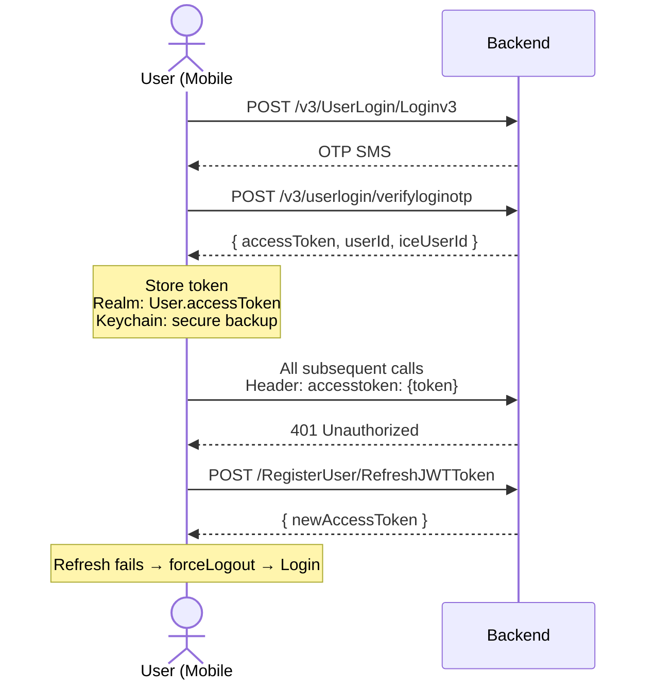

# API Specification Document — TVS Connect iOS App

> **Version:** 3.2 | **Last Updated:** July 8, 2026  
> **Format:** OpenAPI 3.0 compatible structure  
> **Purpose:** Complete API contract reference for backend teams and engineering partners.

| Version | Date | Changes |
|---------|------|---------|
| 3.2 | July 8, 2026 | Added Service Dependency Mapping template (Section 29) |
| 3.1 | June 8, 2026 | Added Active vs Inactive endpoint analysis (code-verified) |
| 3.0 | June 2, 2026 | Full endpoint extraction, GraphQL queries, real-time contracts, sync APIs |
| 2.0 | June 2, 2026 | Added environment matrix, push payloads, security |
| 1.0 | June 2, 2026 | Initial creation |

---

## Executive Summary — API Inventory

### Total API Count: 178 REST + 5 GraphQL + 6 Event Hubs + MQTT = **190+ Endpoints**

| # | Domain / Module | REST Endpoints | GraphQL Ops | Other | Total | Primary Method | Source File/Struct |
|---|----------------|:-:|:-:|:-:|:-:|---|---|
| 1 | **Authentication & Login** | 14 | — | — | **14** | POST | `APIList.Main` |
| 2 | **Vehicle Management** | 16 | — | — | **16** | GET/POST | `APIList.AddBike`, `DeleteAndRenameBike`, `Service` |
| 3 | **Dashboard & Home** | 20 | — | — | **20** | GET/POST | `APIList.Dashboard` |
| 4 | **Ride & Tour (IOT)** | 21 | 1 | — | **22** | POST/GET | `APIList.IOT`, `U399C_API`, `U400_API`, `U368_API`, `N597_API` |
| 5 | **Service & Maintenance** | 13 | — | — | **13** | GET/POST | `APIList.Service`, `NewService/ServiceAPI` |
| 6 | **Community (SiteCore)** | 21 | — | — | **21** | GET/POST | `APIList.Community` |
| 7 | **Profile & Account** | 9 | — | — | **9** | POST | `APIList.Profile`, `ManageProfile` |
| 8 | **Notifications** | 7 | — | — | **7** | GET/POST | `APIList.Notification`, `PushNotification` |
| 9 | **Geofence** | 6 | — | — | **6** | GET/POST/PUT/DELETE | `APIList.GeoFence` |
| 10 | **EV / P360 Platform** | 35 | 3 | — | **38** | GET/POST | `APIList.P360Apis` |
| 11 | **Navigation & Location** | 5 | — | — | **5** | GET/POST | `APIList.Navigation`, `ShareExtension` |
| 12 | **Weather, News & Content** | 5 | — | — | **5** | GET | `APIList.Weather`, `News` |
| 13 | **Settings & Configuration** | 8 | — | — | **8** | GET/POST | `APIList.UserSetting`, `UserAddress`, `VehicleConfigurationList` |
| 14 | **Accessories (BluArmor)** | 3 | — | — | **3** | GET/POST/DELETE | `APIList.BluArmor` |
| 15 | **Merchandise (E-Commerce)** | 17 | — | — | **17** | GET/POST | `APIList.Merchandise` |
| 16 | **OTA & Voice Assist** | 7 | — | — | **7** | GET/POST | `APIList.OTA`, `VoiceAssist` |
| 17 | **Help & Feedback** | 5 | — | — | **5** | GET/POST | `APIList.Help` |
| 18 | **Breakdown Assistance** | 2 | — | — | **2** | GET/POST | `APIList.Breakdown` |
| 19 | **Kogo Integration** | 1 | — | — | **1** | GET | `APIList.Kogo` |
| 20 | **Web Pages (WebView)** | 7 | — | — | **7** | — (URLs) | `APIList.TVSWeb` |
| 21 | **Telemetry (Event Hubs)** | — | — | 6 | **6** | POST (SAS) | `NetworkConfiguration` |
| 22 | **Real-Time (MQTT)** | — | — | per-vehicle | **∞** | Subscribe | `MQTTServiceData` |
| 23 | **GraphQL (Apollo)** | — | 5 queries + 1 subscription | — | **6** | POST/WS | `.graphql` files |
| | | | | | | | |
| | **GRAND TOTAL** | **178** | **6** | **6+** | **190+** | | |

### By Protocol

| Protocol | Count | Library | Transport |
|----------|:-----:|---------|-----------|
| REST (HTTPS) | 178 | Alamofire | JSON over HTTPS |
| GraphQL | 5 queries + 1 subscription | Apollo | HTTPS + WebSocket |
| Event Hubs | 6 topics | URLSession | HTTPS + SAS Token |
| MQTT | Per-vehicle topics | CocoaMQTT | MQTT 3.1.1 (TLS) |

### By HTTP Method

| Method | Count | Usage |
|--------|:-----:|-------|
| GET | 89 | Data fetching, list queries |
| POST | 76 | Create, update, actions, auth |
| PUT | 5 | Update geofence, location, timefence |
| DELETE | 5 | Remove geofence, accessory, location |
| Multipart POST | 3 | Image upload (profile, community, OTA) |

### By Authentication Requirement

| Auth Type | Count | Endpoints |
|-----------|:-----:|-----------|
| JWT Required | 165 | All authenticated endpoints |
| No Auth (Public) | 8 | Login, OTP, Register, App Version |
| SAS Token | 6 | Azure Event Hubs |
| OAuth2 | 2 | LatLong.in dealer API |
| API Key (SDK) | — | Mappls, Google Maps (SDK-level) |

### By API Version

| Version | Count | Status |
|---------|:-----:|--------|
| v3 (latest) | 14 | Current — use for new development |
| v2 | 8 | Active — stable |
| v1 (unversioned) | 156 | Legacy — most endpoints |

### Active vs Inactive Endpoints (Code Analysis — June 8, 2026)

Analysis performed by grepping all endpoint constant references across 3,700+ Swift files.
An endpoint is **Active** if its constant is referenced outside its definition file.
An endpoint is **Inactive** (dead code) if it exists only in `APIList.swift` or `EVAPIList.swift` with zero callers.

#### Summary

| Registry File | Active Structs | Active Endpoints | Dead Structs | Dead Endpoints | Usage % |
|:--------------|:--------------:|:----------------:|:------------:|:--------------:|:-------:|
| `APIList.swift` (ICE) | 31 | ~244 | 2 | 5 | **98%** |
| `EVAPIList.swift` (EV) | 27 | ~214 | 8 | 13 | **94%** |
| **Total** | **58** | **~458** | **10** | **18** | **96%** |

#### ICE — Active Endpoint Modules (`APIList.swift`)

| # | Struct | Endpoints | Status | Primary Consumers |
|:-:|:-------|:---------:|:------:|:------------------|
| 1 | `APIList.Main` | 29 | ✅ Active | OnboardingApiService, AddVehicleService, ProfileVCWorker |
| 2 | `APIList.Dashboard` | 25 | ✅ Active | UnifiedDashboardViewModel, InAppNudgeViewModel, NonConnectedApiService |
| 3 | `APIList.IOT` | 27 | ✅ Active | ApacheAPIClient, U400APIClient, U449APIClient, EVRideService |
| 4 | `APIList.Service` | 22 | ✅ Active | OnboardingApiService, UNGarageViewModel, EVAboutWorker |
| 5 | `APIList.Community` | 22 | ✅ Active | CommunityServices, RideStoryDetailViewModel |
| 6 | `APIList.Merchandise` | 17 | ✅ Active | MerchandiseServices |
| 7 | `APIList.P360Apis` | 50 | ✅ Active | P360ApiServices, P360APIManager |
| 8 | `APIList.AddBike` | 12 | ✅ Active | OnboardingApiService, EmergencyContactAddEditWorker |
| 9 | `APIList.Profile` | 8 | ✅ Active | ProfileVCWorker, UNProfileViewModel, EVBikeService |
| 10 | `APIList.GeoFence` | 6 | ✅ Active | P360APIManager |
| 11 | `APIList.Navigation` | 4 | ✅ Active | NavigationAPIService, U796SearchVCWorker |
| 12 | `APIList.Notification` | 4 | ✅ Active | NotificationApiService, EVNotificationService |
| 13 | `APIList.Help` | 4 | ✅ Active | UserFeedbackViewModel, EVHelpFaqViewModel |
| 14 | `APIList.U399C_API` | 4 | ✅ Active | U399CAPIClient, WidgetAPIclientU399C |
| 15 | `APIList.U400_API` | 4 | ✅ Active | U400APIClient, WidgetAPIclientU400 |
| 16 | `APIList.N597_API` | 4 | ✅ Active | ApacheAPIClient, ApacheWidgetAPIclient |
| 17 | `APIList.U368_API` | 3 | ✅ Active | U449APIClient, U368APIClient, WidgetAPIclientU368 |
| 18 | `APIList.Weather` | 2 | ✅ Active | WeatherServices, WeatherAPIClient |
| 19 | `APIList.News` | 3 | ✅ Active | NewsAPIService |
| 20 | `APIList.OTA` | 2 | ✅ Active | OTAService |
| 21 | `APIList.UserSetting` | 2 | ✅ Active | SettingsWorker, EVSettingService |
| 22 | `APIList.UserAddress` | 2 | ✅ Active | UserAddressService |
| 23 | `APIList.BluArmor` | 2 | ✅ Active | AccessoriesAPIService, BluArmorDashboardWorker |
| 24 | `APIList.PushNotification` | 2 | ✅ Active | P360ApiServices |
| 25 | `APIList.DeleteAndRenameBike` | 2 | ✅ Active | BikeService, EVBikeService |
| 26 | `APIList.Common` | 2 | ✅ Active | CommonAPIClient, FeaturesViewModal |
| 27 | `APIList.Kogo` | 2 | ✅ Active | CommonAPIClient |
| 28 | `APIList.VoiceAssist` | 1 | ✅ Active | VoiceAssistActivateStatusWorker |
| 29 | `APIList.VehicleConfigurationList` | 1 | ✅ Active | VehicleConfigAPIService |
| 30 | `APIList.ShareExtension` | 1 | ✅ Active | ShareExtAPICall |
| 31 | `APIList.CrashDetect` | 1 | ✅ Active | CrashAlertViewModel |

#### ICE — Dead Endpoint Modules (`APIList.swift`)

| # | Struct | Endpoints | Status | Recommendation |
|:-:|:-------|:---------:|:------:|:---------------|
| 1 | `APIList.Breakdown` | 2 | ❌ Dead | Safe to remove — zero references |
| 2 | `APIList.ManageProfile` | 3 | ❌ Dead | Safe to remove — superseded by `APIList.Profile` |

#### EV — Active Endpoint Modules (`EVAPIList.swift`)

| # | Struct | Endpoints | Status | Primary Consumers |
|:-:|:-------|:---------:|:------:|:------------------|
| 1 | `EVAPIList.Main` | 30 | ✅ Active | OnboardingApiService, UNVehicleGarageWorker |
| 2 | `EVAPIList.P360Apis` | 50 | ✅ Active | P360ApiServices |
| 3 | `EVAPIList.Service` | 14 | ✅ Active | EVAboutWorker, TermsAndConditionsVC |
| 4 | `EVAPIList.SubscriptionAPIs` | 14 | ✅ Active | SBPaymentWebViewModel, HomeScreenWorker |
| 5 | `EVAPIList.AddBike` | 13 | ✅ Active | OnboardingApiService, UNGarageViewModel |
| 6 | `EVAPIList.Dashboard` | 11 | ✅ Active | EVDashboardViewModel, HomeScreenWorker |
| 7 | `EVAPIList.IOT` | 9 | ✅ Active | EVRideService, EVRideService+U347 |
| 8 | `EVAPIList.Rewards` | 9 | ✅ Active | RewardsApiService |
| 9 | `EVAPIList.ChagingStation` | 8 | ✅ Active | ChargingStatusWorker, DeviceListWorker |
| 10 | `EVAPIList.KazamApi` | 7 | ✅ Active | HomeScreenWorker, DeviceListLayoutWorker |
| 11 | `EVAPIList.Profile` | 7 | ✅ Active | UNProfileViewModel, EVBikeService |
| 12 | `EVAPIList.Notification` | 6 | ✅ Active | EVNotificationService |
| 13 | `EVAPIList.Referral` | 5 | ✅ Active | ReferralsApiService |
| 14 | `EVAPIList.VehicleAccess` | 5 | ✅ Active | VehicleAccessWorker |
| 15 | `EVAPIList.Accessories` | 5 | ✅ Active | GarminWorker, OnboardingApiService |
| 16 | `EVAPIList.BuyerNPS` | 4 | ✅ Active | BuyerSurveyFormViewModel |
| 17 | `EVAPIList.AppExperience` | 4 | ✅ Active | EVAppExperienceDescriptionViewModel |
| 18 | `EVAPIList.Navigation` | 4 | ✅ Active | EVNavigationWorker |
| 19 | `EVAPIList.UserSetting` | 4 | ✅ Active | EVSettingService |
| 20 | `EVAPIList.CustomSMSAPIs` | 3 | ✅ Active | CallObserverCustomSMSHandler |
| 21 | `EVAPIList.AddonAPIs` | 3 | ✅ Active | SBAPIService |
| 22 | `EVAPIList.VehicleStats` | 3 | ✅ Active | VehicleStatsWorker |
| 23 | `EVAPIList.Help` | 3 | ✅ Active | EVUserGuideService |
| 24 | `EVAPIList.VoiceAssist` | 2 | ✅ Active | VoiceAssistActivateStatusWorker |
| 25 | `EVAPIList.DeleteAndRenameBike` | 2 | ✅ Active | EVBikeService |
| 26 | `EVAPIList.RoadsideAssistanceAPIs` | 2 | ✅ Active | RoadsideAssistanceWorker |
| 27 | `EVAPIList.TNCUpdate` | 1 | ✅ Active | TNCViewModel |

#### EV — Dead Endpoint Modules (`EVAPIList.swift`)

| # | Struct | Endpoints | Status | Recommendation |
|:-:|:-------|:---------:|:------:|:---------------|
| 1 | `EVAPIList.Breakdown` | 2 | ❌ Dead | Safe to remove — zero references |
| 2 | `EVAPIList.Common` | 3 | ❌ Dead | Safe to remove — functionality moved elsewhere |
| 3 | `EVAPIList.HomeChargingStation` | 1 | ❌ Dead | Safe to remove — superseded by P360Apis charger endpoints |
| 4 | `EVAPIList.HomeCSVerifyOTP` | 2 | ❌ Dead | Safe to remove — zero references |
| 5 | `EVAPIList.UserAddress` | 2 | ❌ Dead | Safe to remove — ICE `APIList.UserAddress` used instead |
| 6 | `EVAPIList.WeatherDataAPI` | 1 | ❌ Dead | Safe to remove — `APIList.Weather` used instead |
| 7 | `EVAPIList.CrashDetect` | 1 | ❌ Dead | Safe to remove — ICE `APIList.CrashDetect` used instead |
| 8 | `EVAPIList.Maps` | 1 | ❌ Dead | Safe to remove — zero references |

---

## Table of Contents

- [1. API Overview & Environment Matrix](#1-api-overview--environment-matrix)
- [2. Authentication & Headers](#2-authentication--headers)
- [3. Auth APIs (Main struct)](#3-auth-apis)
- [4. Vehicle Management APIs (AddBike, DeleteAndRenameBike)](#4-vehicle-management-apis)
- [5. Dashboard APIs](#5-dashboard-apis)
- [6. Ride & Tour APIs (IOT struct)](#6-ride--tour-apis)
- [7. Service & Maintenance APIs (Service struct + NewService)](#7-service--maintenance-apis)
- [8. Community APIs](#8-community-apis)
- [9. Profile APIs](#9-profile-apis)
- [10. Notification APIs](#10-notification-apis)
- [11. Geofence APIs](#11-geofence-apis)
- [12. EV / P360 APIs](#12-ev--p360-apis)
- [13. Navigation & Location APIs](#13-navigation--location-apis)
- [14. Weather, News & Content APIs](#14-weather-news--content-apis)
- [15. Vehicle Settings & Configuration APIs](#15-vehicle-settings--configuration-apis)
- [16. Accessories & BluArmor APIs](#16-accessories--bluarmor-apis)
- [17. Merchandise APIs](#17-merchandise-apis)
- [18. OTA & Voice APIs](#18-ota--voice-apis)
- [19. Event Hub Telemetry](#19-event-hub-telemetry)
- [20. MQTT Real-Time Contracts](#20-mqtt-real-time-contracts)
- [21. GraphQL API](#21-graphql-api)
- [22. External API Dependencies](#22-external-api-dependencies)
- [23. Error Handling & Validation](#23-error-handling--validation)
- [24. Push Notification Payloads](#24-push-notification-payloads)
- [25. Data Synchronization](#25-data-synchronization)
- [26. API Versioning & Deprecation](#26-api-versioning--deprecation)
- [27. API Security](#27-api-security)
- [28. Rate Limits & Performance](#28-rate-limits--performance)
- [29. Service Dependency Mapping](#29-service-dependency-mapping-template-for-backend-teams)

---

## 1. API Overview & Environment Matrix

### 1.1 Protocol Summary

| Protocol | Library | Count | Use Case |
|----------|---------|-------|----------|
| REST (HTTPS) | Alamofire | 170+ endpoints | Core business APIs |
| GraphQL | Apollo | 20+ queries/mutations | EV telemetry, P360 |
| MQTT | CocoaMQTT 2.0.9 | Per-vehicle topics | Real-time state |
| Event Hubs | HTTPS POST | 6 vehicle topics | Telemetry upload |
| WebSocket | Apollo | Subscriptions | Live data streams |

### 1.2 Environment URL Matrix

| Environment | ICE API | EV API | Compiler Flag |
|-------------|---------|--------|---------------|
| Development | `https://dev-tvsconnectapi.tvsmotor.net/{variant}-api/api` | `https://dev-tvsconnectevapi.tvsmotor.net/{variant}-api/api` | `DEV_DEBUG` |
| UAT | `https://uat-tvsconnectapi.tvsmotor.net/api` | `https://uat-tvsconnectevapi.tvsmotor.net/{variant}/api` | `DEBUG`/`RELEASE` |
| Production | `https://{prod-host}/api` | `https://{prod-ev-host}/api` | default (no flag) |
| Nepal | `https://tvs-ibasia-nepal.azurewebsites.net/api` | — | Country: .NEPAL |
| Sri Lanka/BD | `https://tvs-ibasia.azurewebsites.net/api` | — | Country: .SRILANKA/.BANGLADESH |

### 1.3 URL Construction Pattern

```
serverURL = NetworkConfiguration.shared.hostURL + "/api"
Full URL  = serverURL + "/{endpoint_path}"

Example: {host}/api/v3/UserLogin/Loginv3
```

---

## 2. Authentication & Headers

### 2.1 Standard Auth Headers

```yaml
# Required for ALL authenticated endpoints:
accesstoken: "{JWT_TOKEN}"           # From login/refresh
userId: "{USER_ID}"                  # String of Int user ID
Content-Type: "application/json"

# Conditional (added when includeHeader: true):
ICEUserId: "{ICE_USER_ID}"          # ICE platform user ID
EVUserId: "{EV_USER_ID}"            # EV platform user ID (EV vehicles)
```

### 2.2 Token Lifecycle Diagram



### 2.3 Other Auth Mechanisms

| Mechanism | Used For | Acquisition |
|-----------|----------|-------------|
| JWT Token | All TVS APIs | Login → OTP → Token |
| SAS Token | Azure Event Hubs | Pre-configured per vehicle |
| OAuth2 | LatLong.in dealer API | `POST api.latlong.in/oauth/token` |
| API Key | Mappls SDK | App build configuration |
| API Key | Google Maps SDK | Info.plist configuration |
| Kogo JWT | KogoAuto integration | `GET /UserLogin/getkogojwt` |

---

## 3. Auth APIs

**Source:** `APIList.Main` struct

| # | Endpoint | Method | Auth | Purpose |
|---|----------|--------|------|---------|
| 1 | `/api/v3/UserLogin/Loginv3` | POST | None | Request OTP |
| 2 | `/api/v3/userlogin/verifyloginotp` | POST | None | Verify OTP, get JWT |
| 3 | `/api/UserLogin/Logout` | GET | Required | End session |
| 4 | `/api/RegisterUser/RefreshJWTToken` | POST | Expired token | Refresh JWT |
| 5 | `/api/RegisterUser/CreateUser` | POST | None | New user registration |
| 6 | `/api/RegisterUser/VerifyOTP` | POST | None | Signup OTP verify |
| 7 | `/api/RegisterUser/GenerateOTP` | POST | None | Resend OTP |
| 8 | `/api/v3/userlogin/replaceICEnumber` | POST | Required | Migrate ICE→EV user |
| 9 | `/api/UserLogin/getAppVersion` | GET | None | Version check |
| 10 | `/api/v3/secret?platform=ios` | GET | Required | Get third-party SDK keys |
| 11 | `/api/userconsent` | GET | Required | Get consent status |
| 12 | `/api/v3/userconsent` | POST | Required | Submit consent |
| 13 | `/api/InAppFeedback` | POST | Required | In-app feedback |
| 14 | `/api/UpgradeToken` | POST | Required | Upgrade token version |

### Sample: Login Flow

```bash
# Step 1: Request OTP
curl -X POST "{host}/api/v3/UserLogin/Loginv3" \
  -H "Content-Type: application/json" \
  -d '{"mobileNumber": "9876543210", "countryCode": "+91"}'

# Response (200):
{
  "StatusCode": 200,
  "Message": "OTP sent successfully",
  "Result": "success",
  "Data": { "isNewUser": false, "isICEUser": true }
}

# Step 2: Verify OTP
curl -X POST "{host}/api/v3/userlogin/verifyloginotp" \
  -H "Content-Type: application/json" \
  -d '{"mobileNumber": "9876543210", "otp": "123456"}'

# Response (200):
{
  "StatusCode": 200,
  "Message": "Login successful",
  "Data": {
    "userId": 12345,
    "accessToken": "eyJhbGciOi...",
    "name": "User Name",
    "iceUserId": "ICE12345",
    "evUserId": "EV12345",
    "mobileNumber": "9876543210"
  }
}

# Error Response (400):
{
  "StatusCode": 400,
  "Message": "Invalid OTP",
  "Result": "failure"
}
```

---

## 4. Vehicle Management APIs

**Source:** `APIList.AddBike`, `APIList.DeleteAndRenameBike`, `APIList.Service` structs

| # | Endpoint | Method | Auth | Purpose |
|---|----------|--------|------|---------|
| 1 | `/api/v3/vehicle/vehiclelistdetails?mobileNo=` | GET | Required | Get all vehicles |
| 2 | `/api/v3/vehicle/vehiclelist?mobileNumber=` | GET | Required | DMS vehicle list |
| 3 | `/api/v3/Vehicle/AddVehicle` | POST | Required | Register vehicle |
| 4 | `/api/v3/vehicle/vehiclelistbyframeinvoice` | POST | Required | Add by frame/invoice |
| 5 | `/api/v3/vehicle/vehiclelistbyframeengineno` | POST | Required | Add by frame+engine |
| 6 | `/api/Vehicle/RemoveVehicle` | POST | Required | Delete vehicle |
| 7 | `/api/Vehicle/UpdatevehicleNickname` | POST | Required | Rename vehicle |
| 8 | `/api/v3/Vehicle/markactivevehicle?userVehicleId=` | GET | Required | Set active vehicle |
| 9 | `/api/Vehicle/SendOTPtoBikeOwner` | POST | Required | OTP to bike owner |
| 10 | `/api/Vehicle/VerifyOTPforBikeOwner` | POST | Required | Verify owner OTP |
| 11 | `/api/Vehicle/ActivateMMIMacId?macid=` | GET | Required | Activate Mappls MAC |
| 12 | `/api/v3/userlogin/getnewevuserdetails` | POST | Required | Create new EV user |
| 13 | `/api/vehicle/aboutvehicle?mobileNo=` | GET | Required | Vehicle details |
| 14 | `/api/vehicle/makemodelmaster` | GET | Required | Make/model list |
| 15 | `/api/citystatemaster` | GET | Required | City/state list |
| 16 | `/api/getvehiclefeatureconfig` | GET | Required | Feature config per vehicle |

### Sample: Get Vehicle List

```bash
curl -X GET "{host}/api/v3/vehicle/vehiclelistdetails?mobileNo=9876543210" \
  -H "accesstoken: {JWT_TOKEN}" \
  -H "userId: 12345"

# Response (200):
{
  "StatusCode": 200,
  "Data": [
    {
      "userVehicleId": 5678,
      "vehicleTypeId": 23,
      "frameNo": "MBLHA10EX...",
      "registrationNo": "MH01AB1234",
      "vehicleName": "Apache RR 310",
      "theme": 0,
      "brandDesc": "Apache",
      "nickName": "My RR",
      "isActive": true
    }
  ]
}
```

---

## 5. Dashboard APIs

**Source:** `APIList.Dashboard` struct

| # | Endpoint | Method | Auth | Purpose |
|---|----------|--------|------|---------|
| 1 | `/api/v3/UserDashboard/GetDashboardDetail?userId=` | GET | Required | Dashboard data |
| 2 | `/api/v3/Vehicle/GetOnBoarding?mobileNumber=` | GET | Required | Onboarding check |
| 3 | `/api/LastLocationParkedController/SaveLastLocationParked` | POST | Required | Save parked location |
| 4 | `/api/LastLocationParkedController/GetLastLocationParked` | GET | Required | Get parked location |
| 5 | `/api/MileageForVehicleController/InsertMileageForVehicle` | POST | Required | Log mileage |
| 6 | `/api/MileageForVehicleController/GetAllMileage` | GET | Required | Get mileage history |
| 7 | `/api/MileageForVehicleController/ClearAllMileage` | POST | Required | Clear mileage |
| 8 | `/api/Vehicle/GetUserBadgesList?` | GET | Required | Achievement badges |
| 9 | `/api/mobilesetting?Platform=iOS&Brand=` | GET | Required | App settings |
| 10 | `/api/v2/mobilesetting?Platform=iOS&Brand=` | GET | Required | U279 settings |
| 11 | `/api/mobilesettinginfo?Platform=` | GET | Required | Settings info |
| 12 | `/api/v2/Faq/GetFaq` | GET | Required | FAQ list |
| 13 | `/api/AppBanner/GetAppbanner` | GET | Required | Banner images |
| 14 | `/api/UserLogin/CrashAlertDate` | POST | Required | Crash alert timestamp |
| 15 | `/api/Image/ProfileImage` | GET/POST | Required | Profile image (multipart) |
| 16 | `/api/vehicle/nonconnecteddashboard` | POST | Required | NC dashboard data |
| 17 | `/api/vehicle/vehicledetails` | GET | Required | NC vehicle details |
| 18 | `/api/vehicle/vehiclenickname` | POST | Required | Update NC nickname |
| 19 | `/api/GetAmBannerImagelink` | GET | Required | AM banner links |
| 20 | `/api/home/getframenoandp360token?` | GET | Required | P360 token |

### CSI/NPS Feedback

| # | Endpoint | Method | Purpose |
|---|----------|--------|---------|
| 1 | `/api/CSIFeedbackAvailable?FrameNo=` | GET | Check CSI availability |
| 2 | `/api/CSIFeedback` | POST | Submit CSI |
| 3 | `/api/CSIFeedbackReschedule` | POST | Reschedule CSI |
| 4 | `/api/NPSFeedbackAvailable?FrameNo=` | GET | Check NPS availability |
| 5 | `/api/NPSFeedback` | POST | Submit NPS |
| 6 | `/api/NPSFeedbackReschedule` | POST | Reschedule NPS |

---

## 6. Ride & Tour APIs

**Source:** `APIList.IOT` struct + vehicle-specific structs

| # | Endpoint | Method | Auth | Vehicles | Purpose |
|---|----------|--------|------|----------|---------|
| 1 | `/api/ride` | POST | Required | U408, U399C, U400, U368, N597, N360 | Save ride |
| 2 | `/api/v2/ride` | GET | Required | All modern vehicles | Fetch rides |
| 3 | `/api/v2/ride` | DELETE | Required | U279 | Delete ride |
| 4 | `/api/ride?` | GET | Required | U408, U532 | Fetch rides (v1) |
| 5 | `/api/ride/favourite` | POST | Required | U408+ | Favorite a ride |
| 6 | `/api/v2/ride/favourite` | POST | Required | U279 | Favorite (U279) |
| 7 | `/api/v3/Travel/GetTravelList?` | GET | Required | All | Get tour list |
| 8 | `/api/v2/Travel/GetTravelList?` | GET | Required | Legacy | Get tour list v2 |
| 9 | `/api/Travel/GetAllTravelList?` | GET | Required | NTorq | All travels |
| 10 | `/api/Travel/UpdateTravelName` | POST | Required | All | Rename tour |
| 11 | `/api/Travel/DeleteTravel` | POST | Required | Legacy | Delete tour |
| 12 | `/api/Travel/inserttraveldataForApache` | POST | Required | N112 | Upload N112 ride |
| 13 | `/api/N251/inserttraveldataForN251BLE` | POST | Required | N251 | Upload N251 ride |
| 14 | `/api/N109/inserttraveldataForN109` | POST | Required | N109 | Upload N109 ride |
| 15 | `/api/U347/inserttraveldataForU347` | POST | Required | U347 | Upload U347 ride |
| 16 | `/api/ApacheNonIOT/inserttraveldataForNonIOTApache` | POST | Required | NonIOT | NonIOT ride |
| 17 | `/api/widget` | POST/GET | Required | U399C, U400, U368, N597 | Widget ops |
| 18 | `/api/tpms/history?` | GET | Required | U399C, U400 | TPMS history |
| 19 | `/api/Travel/GetSpeedAnalysis` | GET | Required | NTorq | Speed analysis |
| 20 | `/api/N251/setFavouriteRides` | POST | Required | NTorq | Set favorites |
| 21 | `/api/N251/deleteMultipleRides` | POST | Required | NTorq | Bulk delete |

### Vehicle Overview

| # | Endpoint | Method | Vehicles |
|---|----------|--------|----------|
| 1 | `/api/Travel/GetVehicleCumulativeData?` | GET | N112, N109, N251 |
| 2 | `/api/vehicle/overview?` | GET | U408+ |
| 3 | `/api/v2/vehicle/overview?` | GET | Commuter (U577, N360) |

---

## 7. Service & Maintenance APIs

**Source:** `APIList.Service` struct + `NewService/`

### NewService Module (Modern Pattern)

| # | Endpoint | Method | Encoding | Purpose |
|---|----------|--------|----------|---------|
| 1 | `/api/Service/GetServiceHistory` | GET | URL params | Service history |
| 2 | `/api/Service/GetLatestAppointment` | POST | JSON body | Active appointment |
| 3 | `/api/Service/GetMaintenanceDue` | GET | URL params | Next maintenance |
| 4 | `/api/Service/UpdateAppointment` | POST | JSON body | Cancel/modify appointment |

### Legacy Service APIs

| # | Endpoint | Method | Purpose |
|---|----------|--------|---------|
| 1 | `/api/Service/BookService` | POST | Book service |
| 2 | `/api/Tips/GetTips` | GET | Maintenance tips |
| 3 | `/api/Maintainance/GetMaintainance` | GET | DIY guides |
| 4 | `/api/ridingtip?VehicleTypeId=` | GET | Riding tips |
| 5 | `/api/UserSupport/GetHowtoDetails` | GET | How-to videos |
| 6 | `/api/Service/GetVehicleServiceData?` | GET | Booking history |
| 7 | `/api/Service/ServiceHistoryFailed` | POST | Report failure |
| 8 | `/api/Service/InsertServiceFeedback` | POST | Service feedback |
| 9 | `/api/Service/GetIsUserfillServiceFeedback` | GET | Feedback status |

### Sample: Service History

```bash
curl -X GET "{host}/api/Service/GetServiceHistory?frameNo=MBLHA10EX..." \
  -H "accesstoken: {JWT_TOKEN}" \
  -H "userId: 12345"

# Response (200):
{
  "StatusCode": 200,
  "Message": "Success",
  "Data": [
    {
      "serviceDate": "2026-01-15T10:00:00",
      "serviceType": "Free Service",
      "dealerName": "TVS Dealer XYZ",
      "odometerReading": 5000,
      "jobCardId": "JC12345",
      "status": "completed"
    }
  ]
}

# Empty Response (200):
{ "StatusCode": 200, "Message": "No service history found", "Data": [] }

# Error (400):
{ "StatusCode": 400, "Message": "Invalid frame number" }
```

---

## 8. Community APIs

**Source:** `APIList.Community` struct (SiteCore CMS backend)

| # | Endpoint | Method | Type | Purpose |
|---|----------|--------|------|---------|
| 1 | `{sitecore}/GetCategoryList?` | GET | Content | Category list |
| 2 | `{sitecore}/RideStory?` | GET | Content | Get ride stories |
| 3 | `{sitecore}/RideStory` | POST | Content | Create ride story |
| 4 | `{sitecore}/Event?` | GET | Content | Get events |
| 5 | `{sitecore}/Event` | POST | Content | Create event |
| 6 | `{sitecore}/discussion?` | GET | Content | Get discussions |
| 7 | `{sitecore}/discussion` | POST | Content | Create discussion |
| 8 | `{sitecore}/LikeUpdate` | POST | Action | Like/unlike |
| 9 | `{sitecore}/Attendance` | POST | Action | Event attendance |
| 10 | `{sitecore}/Comments?` | GET | Content | Get comments |
| 11 | `{sitecore}/Comments` | POST | Action | Add comment |
| 12 | `{sitecore}/CommunityMedia` | POST | **Multipart** | Upload image |
| 13 | `{sitecore}/EventBanner` | GET | Content | Event banners |
| 14 | `{sitecore}/OverviewBanner` | GET | Content | Overview banner |
| 15 | `{sitecore}/LatestEvents?` | GET | Content | Recent events |
| 16 | `{sitecore}/LatestDiscussion?` | GET | Content | Recent discussions |
| 17 | `{sitecore}/LatestRideStories?` | GET | Content | Recent stories |
| 18 | `{sitecore}/Search?` | GET | Content | Search content |
| 19 | `{sitecore}/MyRideStory?` | GET | Content | User's stories |
| 20 | `{sitecore}/SelfEvents?` | GET | Content | User's events |
| 21 | `{sitecore}/DiscussionStory?` | GET | Content | User's discussions |

---

## 9. Profile APIs

**Source:** `APIList.Profile`, `APIList.ManageProfile` structs

| # | Endpoint | Method | Purpose |
|---|----------|--------|---------|
| 1 | `/api/v3/ManageProfile/EditProfile` | POST | Update profile |
| 2 | `/api/ManageProfile/ProfileData?` | GET | Get profile |
| 3 | `/api/Image/ProfileImage` | POST (multipart) | Upload profile image |
| 4 | `/api/ManageProfile/getdeleteprofileotp` | POST | Request delete OTP |
| 5 | `/api/ManageProfile/verifydeleteprofileotp` | POST | Verify delete OTP |
| 6 | `/api/ManageProfile/deleteprofilereason` | POST | Submit reason |
| 7 | `/api/DeleteProfile` | POST | Execute deletion |
| 8 | `/api/manageprofile/GetOTPForUpdateMobileNumber` | POST | Mobile update OTP |
| 9 | `/api/manageprofile/verifymobileupdateotp` | POST | Verify mobile OTP |

---

## 10. Notification APIs

**Source:** `APIList.Notification`, `APIList.PushNotification` structs

| # | Endpoint | Method | Purpose |
|---|----------|--------|---------|
| 1 | `/api/Notification/NotificationList` | GET | List notifications |
| 2 | `/api/Notification/Read` | POST | Mark as read |
| 3 | `/api/notification/readmqttnotification` | POST | Mark MQTT notif read |
| 4 | `/api/Notification/Unread` | GET | Unread count |
| 5 | `/api/Notification/Getadminnotificationbyuser?` | GET | Brand feed |
| 6 | `/api/notification/pushnotificationfcmtokenregistration` | POST | Register FCM token |
| 7 | `/api/notification/pushnotificationfcmtokenderegistration` | POST | Deregister FCM token |

---

## 11. Geofence APIs

**Source:** `APIList.GeoFence` struct

| # | Endpoint | Method | Purpose |
|---|----------|--------|---------|
| 1 | `/api/geofence/getgeofencelist?` | GET | List geofences |
| 2 | `/api/geofence/addgeofence` | POST | Create geofence |
| 3 | `/api/geofence/updategeofence` | PUT | Update geofence |
| 4 | `/api/geofence/deletegeofence` | DELETE | Remove geofence |
| 5 | `/api/geofence/getallgeofencealerts?` | GET | Alert history |
| 6 | `/api/geofence/getgeofencedetails?` | GET | Single detail |

### Sample: Create Geofence

```bash
curl -X POST "{host}/api/geofence/addgeofence" \
  -H "accesstoken: {JWT_TOKEN}" \
  -H "Content-Type: application/json" \
  -d '{
    "latitude": 12.9716,
    "longitude": 77.5946,
    "radius": 500,
    "name": "Home",
    "isActive": true,
    "frameNo": "MBLHA10EX..."
  }'

# Response (200):
{ "StatusCode": 200, "Message": "Geofence added successfully", "Data": { "geofenceId": 123 } }
```

---

## 12. EV / P360 APIs

**Source:** `APIList.P360Apis` struct (60+ endpoints)

### Vehicle Status & Telemetry

| # | Endpoint | Method | Purpose |
|---|----------|--------|---------|
| 1 | `/api/home/getlatestdevicedata?` | GET | Latest EV telemetry |
| 2 | `/api/vehicle/getcumulativeridedata?` | GET | Cumulative ride data |
| 3 | `/api/vehicle/getcumulativeridechargingsummary?` | GET | Combined stats |
| 4 | `/api/ride/rideStats?` | GET | EV ride statistics |
| 5 | `/api/socanalysis/trackingpoints?` | GET | SOC tracking points |
| 6 | `/api/vehicle/getoverspeedalert?` | GET | Overspeed threshold |
| 7 | `/api/vehicle/setoverspeedalert` | POST | Set threshold |
| 8 | `/api/vehicle/updatenickname` | POST | Update EV nickname |

### Charging APIs

| # | Endpoint | Method | Purpose |
|---|----------|--------|---------|
| 1 | `/api/charging/charginghistory?` | GET | Charging sessions |
| 2 | `/api/charging/vehiclestatschargingsummary?` | GET | Charging summary |
| 3 | `/api/charging/charginggraph?` | GET | Charging graph data |

### Home Charger & Portable Charger

| # | Endpoint | Method | Purpose |
|---|----------|--------|---------|
| 1 | `/api/homecharging/gethomechargerlatestdata?` | GET | Charger status |
| 2 | `/api/homecharging/gethomechargercommandstatus?` | GET | Command status |
| 3 | `/api/homecharging/gethomechargerchargingcummulativedata?` | GET | Cumulative data |
| 4 | `/api/homecharging/homechargercharginghistory?` | GET | Charger history |
| 5 | `/api/homecharging/sethomechargersettings` | POST | Charger settings |
| 6 | `/api/homecharging/getChargingPoints?` | GET | Charging points |
| 7 | `/api/homecharging/getportablechargerchargingcummulativedata?` | GET | Portable cumulative |
| 8 | `/api/homecharging/getportablechargercharginghistory?` | GET | Portable history |
| 9 | `/api/homecharging/getbatterieslatestdata?` | GET | Battery status |
| 10 | `/api/portablecharger/getportablechargerlatestdata?` | GET | Portable latest |
| 11 | `/api/portablecharger/getportablechargercommandstatus?` | GET | Portable commands |

### Location & Sharing (EV)

| # | Endpoint | Method | Purpose |
|---|----------|--------|---------|
| 1 | `/api/home/getallshareddestinations?` | GET | Shared destinations |
| 2 | `/api/home/getallrecentlocations?` | GET | Recent locations |
| 3 | `/api/home/getallfavoritelocations?` | GET | Favorites |
| 4 | `/api/home/getallsharedlivelocation?` | GET | Active live shares |
| 5 | `/api/location/sharelivelocation` | POST | Start live share |
| 6 | `/api/location/stoplivelocation` | POST | Stop live share |
| 7 | `/api/location/addfavoritelocation` | POST | Add favorite |
| 8 | `/api/location/addrecentlocation` | POST | Add recent |
| 9 | `/api/location/sharedestination` | POST | Share destination |
| 10 | `/api/location/deletefavoritelocation` | DELETE | Remove favorite |
| 11 | `/api/location/editfavoritelocation` | PUT | Edit favorite |
| 12 | `/api/home/getcurrentweatherdata?` | GET | Weather data |

### Emergency Contacts (EV)

| # | Endpoint | Method | Purpose |
|---|----------|--------|---------|
| 1 | `/api/emergencycontact/getemergencycontacts?` | GET | List contacts |
| 2 | `/api/emergencycontact/saveemergencycontacts` | POST | Add contacts |
| 3 | `/api/emergencycontact/editemergencycontact` | PUT | Edit contact |
| 4 | `/api/emergencycontact/deleteemergencycontacts` | DELETE | Remove contacts |

### Timefence APIs

| # | Endpoint | Method | Purpose |
|---|----------|--------|---------|
| 1 | `/api/timefence/gettimefencealertconfig?` | GET | Get timefence config |
| 2 | `/api/timefence/settimefence` | POST | Set timefence |
| 3 | `/api/timefence/updatetimefence` | PUT | Update timefence |
| 4 | `/api/timefence/deletetimefence` | DELETE | Delete timefence |

---

## 13. Navigation & Location APIs

**Source:** `APIList.Navigation`, `APIList.ShareExtension` structs

| # | Endpoint | Method | Purpose |
|---|----------|--------|---------|
| 1 | `/api/location/recent` | POST | Save recent location |
| 2 | `/api/location/recent?vin=` | GET | Get recent locations |
| 3 | `/api/location/favourite` | POST | Save favorite |
| 4 | `/api/location/favourite?vin=` | GET | Get favorites |
| 5 | `/api/maps/getmapdata` | POST | Parse shared map URL |

---

## 14. Weather, News & Content APIs

**Source:** `APIList.Weather`, `APIList.News` structs

| # | Endpoint | Method | Purpose |
|---|----------|--------|---------|
| 1 | `/api/weather` | GET | Current weather |
| 2 | `/api/airqualityindex` | GET | AQI data |
| 3 | `/api/news` | GET | All news |
| 4 | `/api/cricket` | GET | Cricket scores |
| 5 | `/api/football` | GET | Football scores |

---

## 15. Vehicle Settings & Configuration APIs

**Source:** `APIList.UserSetting`, `APIList.UserAddress`, `APIList.VehicleConfigurationList` structs

| # | Endpoint | Method | Purpose |
|---|----------|--------|---------|
| 1 | `/api/UserSetting/GetSettingList?` | GET | User settings |
| 2 | `/api/UserSetting/SaveSettingForUser` | POST | Save settings |
| 3 | `/api/useraddress?` | GET | Address list |
| 4 | `/api/useraddress` | POST | Add/update address |
| 5 | `/api/getvehiclefeatureconfig` | GET | Vehicle feature config |
| 6 | `/api/Support/getCrashAlertFeatures` | GET | Crash features |
| 7 | `/api/AddDeviceDetails` | POST | Register device |
| 8 | `/api/UserSetting/GetSMSonCrashDetection?` | GET | Crash SMS config |

---

## 16. Accessories & BluArmor APIs

**Source:** `APIList.BluArmor` struct

| # | Endpoint | Method | Purpose |
|---|----------|--------|---------|
| 1 | `/api/accessory` | GET | List accessories |
| 2 | `/api/accessory` | POST | Add accessory |
| 3 | `/api/accessory?` | DELETE | Remove accessory |

---

## 17. Merchandise APIs

**Source:** `APIList.Merchandise` struct (SiteCore e-commerce backend)

| # | Endpoint | Method | Purpose |
|---|----------|--------|---------|
| 1 | `{ecom}/getmerchandise` | GET | Product catalog |
| 2 | `{ecom}/getaccessories` | GET | Accessories |
| 3 | `{ecom}/getproducdetail` | GET | Product detail |
| 4 | `{ecom}/searchpincode` | GET | Delivery check |
| 5 | `{ecom}/additemtocart` | POST | Add to cart |
| 6 | `{ecom}/getcartdetail` | GET | Cart contents |
| 7 | `{ecom}/removeitemfromcart` | POST | Remove from cart |
| 8 | `{ecom}/updatecartlinequantity` | POST | Update quantity |
| 9 | `{ecom}/getcartlinescount` | GET | Cart count |
| 10 | `{ecom}/myaddress` | GET | Addresses |
| 11 | `{ecom}/addressaddoredit` | POST | Add/edit address |
| 12 | `{ecom}/deleteaddress` | POST | Delete address |
| 13 | `{ecom}/applypromo` | POST | Apply promo code |
| 14 | `{ecom}/removepromo` | POST | Remove promo |
| 15 | `{ecom}/getstateandcity` | GET | State/city list |
| 16 | `{ecom}/payment` | POST | Payment initiation |
| 17 | `{ecom}/ordersubmit` | POST | Order submission |

---

## 18. OTA & Voice APIs

**Source:** `APIList.OTA`, `APIList.VoiceAssist` structs

| # | Endpoint | Method | Purpose |
|---|----------|--------|---------|
| 1 | `/api/ota` | GET | OTA update info |
| 2 | `{trakntell}/tntDevAPI` | POST | TrakNTell OTA (external) |
| 3 | `/api/UserVoiceCommand` | POST | Voice command |
| 4 | `/api/voiceaction?Platform=ios&fromDate=` | GET | Voice action list |

### HUD (Head-Up Display) APIs

| # | Endpoint | Method | Purpose |
|---|----------|--------|---------|
| 1 | `/api/TodoList/GetTodoList` | GET | Todo list |
| 2 | `/api/TodoList/AddOrUpdateToDoList` | POST | Add/update todo |
| 3 | `/api/TodoList/ManageToDoList` | POST | Manage todo |

---

## 19. Event Hub Telemetry

### Endpoints (HTTPS POST with SAS Auth)

| Vehicle | Namespace | Topic |
|---------|-----------|-------|
| U399C (RR 310) | `{prod-ns}.servicebus.windows.net` | `prod-tvsm-rr310-app-connected-topic/messages` |
| N251 (NTorq) | `{prod-ns}.servicebus.windows.net` | `prod-tvsm-ntorq-app-connected-topic/messages` |
| U324 | `{prod-ns}.servicebus.windows.net` | `prod-tvsm-u324-app-connected-topic/messages` |
| U408 | `{prod-ns}.servicebus.windows.net` | `prod-tvsm-u408-app-connected-topic/messages` |
| U368 | `{dev-ns}.servicebus.windows.net` | `dev-tvsm-u368-npd-topic/messages` |
| U532 | `{dev-ns}.servicebus.windows.net` | `dev-tvsm-u532-npd-topic/messages` |

### Request Format

```bash
curl -X POST "https://{namespace}.servicebus.windows.net/{topic}/messages" \
  -H "Authorization: SharedAccessSignature sr={resource}&sig={signature}&se={expiry}&skn={keyName}" \
  -H "Content-Type: application/json" \
  -d '{
    "vehicleId": "MBLHA10EX...",
    "timestamp": "2026-06-02T10:30:00Z",
    "speed": 45,
    "rpm": 5500,
    "latitude": 12.9716,
    "longitude": 77.5946,
    "fuelLevel": 60,
    "gear": 3,
    "engineTemp": 85
  }'
```

---

## 20. MQTT Real-Time Contracts

### Connection Config

```yaml
broker: "{env-specific-mqtt-broker}"
port: 8883 (TLS)
protocol: MQTT 3.1.1
qos: 1 (at least once)
library: CocoaMQTT 2.0.9
```

### Topic Pattern

```
Subscribe: {organizationId}/{vehicleId}
```

### Message Payload Schema

```json
{
  "vehicleId": "VH12345",
  "timestamp": "2026-06-02T10:30:00Z",
  "ignition": true,
  "speed": 45,
  "latitude": 12.9716,
  "longitude": 77.5946,
  "fuelLevel": 60,
  "batteryVoltage": 12.4,
  "alertType": null,
  "geofenceBreached": false
}
```

### App Behavior
- **Subscribe:** After login + vehicle list loaded
- **Disconnect:** On app terminate or logout
- **Reconnect:** On network recovery
- **Background:** Continues receiving while app backgrounded
- **UI Update:** Message triggers dashboard refresh + local notification

---

## 21. GraphQL API

### Schema & Files

| File | Location | Purpose |
|------|----------|---------|
| `schema.graphqls` | `TVS/` | Main schema (9,600+ lines) |
| `iQubeQueries.graphql` | `TVS_EV/` | EV queries |
| `WatchAppQueries.graphql` | `TVS Watch App/GraphQL/` | Watch queries |
| `apollo-codegen-config.json` | `TVS/` | Code generation config |

### Queries (Extracted from .graphql files)

```graphql
# Get latest EV device data
query GetTvsmLatestDeviceData($vin: String!) {
  getTvsmLatestDeviceData(vin: $vin) {
    response {
      userId, timestamp, unitid, odometer, vin
      latitude, longitude, speed, soc, ignition
      charging_status, driving_mode, ev_range { dte_eco, dte_power, dte_street }
      tyre_pressure { front, rear }
      totalTripsToday, avgSpeedToday, totalDistanceToday
      is_sos, is_tow, is_crash, is_fall
      bat_a_soc, bat_b_soc, regen_level
    }
    status, statusMessage
  }
}

# Watch: Get lifetime aggregate
query getTvsmLifetimeAggregateDeviceDataWatch($vin: String!) {
  getTvsmLifetimeAggregateDeviceDataWatch(vin: $vin) {
    status, message
    data {
      top_speed, avg_speed, best_0_60
      total_rides, total_distance, co2_saved, total_duration
      last_ride_distance
    }
  }
}

# Watch: Get latest data (compact)
query getTvsmLatestDeviceDataWatch($vin: String!) {
  getTvsmLatestDeviceDataWatch(vin: $vin) {
    status, message
    data {
      soc, ignition_status, driving_mode, charging_status
      odometer, last_sync, dte_eco, dte_power
      tpms_front, tpms_rear, speed
      time_to_charge_completion, top_speed, fuel_level
      current_trip, trip_distance, trip_time, trip_avg_speed
    }
  }
}

# Watch: Aggregate data (today)
query getTvsmAggregateDeviceDataWatch($vin: String!) {
  getTvsmAggregateDeviceDataWatch(vin: $vin) {
    status, message
    data {
      distance_covered_today, avg_speed_today
      total_duration_today, number_of_rides
    }
  }
}

# Trip history
query getTripHistoryNew($vin: String!, $no_of_records: Int) {
  getTripHistoryNew(vin: $vin, no_of_records: $no_of_records) {
    tripHistory { total_distance }
    vin, status, statusMessage
  }
}
```

### Subscriptions (WebSocket)

```graphql
# Live vehicle tracking
subscription TvsmDeviceLiveTracking($vin: String!) {
  tvsmDeviceLiveTracking(vin: $vin) {
    latitude, longitude, speed, heading, timestamp
  }
}
```

### Transport

```yaml
queries/mutations: HTTPS POST to GraphQL endpoint
subscriptions: WebSocket (wss://) via Apollo WebSocket transport
```

---

## 22. External API Dependencies

| Provider | Base URL Pattern | Auth | Purpose |
|----------|-----------------|------|---------|
| LatLong.in | `api.latlong.in/v2/brands/{brandId}/stores_around.json` | OAuth2 | Dealer locations |
| LatLong.in (OAuth) | `api.latlong.in/oauth/token` | Client credentials | Token acquisition |
| Mappls | SDK-configured | API Key | Maps, geocoding, navigation |
| Google Maps | SDK-configured | API Key | Maps, places |
| Google Navigation | SDK-configured | API Key | Turn-by-turn nav |
| what3words | `api.what3words.com/v3/` | API Key | Location addressing |
| Firebase FCM | Firebase SDK | Service account | Push notifications |
| AppDynamics | Agent SDK | App Key | APM |
| SiteCore CMS | `{sitecore-host}/sitecore/api/` | JWT | Community content |
| Azure Event Hubs | `*.servicebus.windows.net` | SAS Token | Telemetry |
| TVS VIN | `tvsmerafrnd.com/LoyaltyRestAPI/api/` | None | VIN verification |
| TVS CRC | `tvsmapp.com/CRC_PORTAL/` | None | Service history (legacy) |
| TrakNTell | `ft8.trakntell.com/tnt/` | API | OTA firmware |
| TVS Service | `service.tvsmotor.com` | Token (URL param) | Service booking WebView |
| TVS Account Delete | `www.tvsmotor.com/account/delete` | Session | Account deletion |

---

## 23. Error Handling & Validation

### 23.1 Standard Response Wrapper

```json
{
  "StatusCode": 200,        // HTTP-like status (200, 400, 401, 500)
  "Message": "Success",     // Human-readable message
  "Result": "success",      // "success" or "failure"
  "Data": { ... }           // Response payload (Object, Array, or null)
}
```

### 23.2 Error Response Variants

```json
// Standard error
{ "StatusCode": 400, "Message": "Invalid request", "Result": "failure" }

// With error messages
{ "StatusCode": 400, "Message": "Validation failed", "errorMessages": "Frame number is required" }

// With data in error (UpdateAppointment)
{ "statusCode": 500, "result": "failure", "message": "Internal error", "data": "Additional context" }
```

### 23.3 HTTP Status → App Behavior

| Code | App Behavior | Recovery |
|------|-------------|----------|
| 200 | Parse Data, call success | — |
| 400 | Show Message to user | Fix input |
| 401 | Token refresh → force logout | Re-authenticate |
| 403 | Show access denied | — |
| 404 | Show empty state | — |
| 429 | Throttled (OTP) | Wait and retry |
| 500 | "Something went wrong" toast | Retry later |
| 0/timeout | Retry 3x (3s interval) | Show offline |

### 23.4 Validation Rules

| Field | Constraint | Validated By |
|-------|-----------|--------------|
| mobileNumber | Exactly 10 digits, numeric | Client + Server |
| OTP | Exactly 6 digits | Client + Server |
| frameNo | ≥10 alphanumeric chars | Client + Server |
| registrationNo | Format: XX00XX0000 | Server |
| nickName | 1-20 characters | Client |
| geofence.radius | 100-5000 meters | Client + Server |
| overspeed.threshold | 10-200 km/h | Client + Server |
| latitude | -90 to 90 | Client |
| longitude | -180 to 180 | Client |

---

## 24. Push Notification Payloads

### Standard Push

```json
{
  "aps": {
    "alert": { "title": "Title", "body": "Body text" },
    "badge": 1,
    "sound": "default"
  },
  "data": {
    "type": "ride_complete|geofence_alert|service_reminder|ota_available|...",
    "redirectionURL": "tvsconnect://{screen}?param=value",
    "vehicleId": "VH12345",
    "notificationId": "NOTIF123"
  }
}
```

### Silent Push

```json
{ "aps": { "content-available": 1 }, "data": { "type": "vehicle_state_sync" } }
```

### Deep Link Schemes

| Type | URL | Target Screen |
|------|-----|--------------|
| Ride | `tvsconnect://ride/details?rideId={id}` | Ride detail |
| Service | `tvsconnect://service/booking` | Service booking |
| Geofence | `tvsconnect://geofence/alert?id={id}` | Geofence alert |
| OTA | `tvsconnect://ota/update` | OTA screen |
| Dashboard | `tvsconnect://dashboard` | Main dashboard |
| Kogo | `tvsconnect://kogo` | Kogo ride screen |

---

## 25. Data Synchronization

### Ride Sync (Local → Server)

```
Ride Recording (BLE + GPS)
  → Save to Realm (RideStatisticsRM)
  → On ride end: POST /api/ride
  → On success: mark isSynced = true
  → On failure: retry on next app open or connectivity
```

### Vehicle List Sync (Server → Local)

```
App foreground / Vehicle switch
  → GET /api/v3/vehicle/vehiclelistdetails
  → Compare with Realm VehicleInfo objects
  → Add/update/delete local records
  → Notify UI via .didSwitchVehicle notification
```

### Settings Sync (Bidirectional)

```
GET /api/UserSetting/GetSettingList → Update local Realm settings
POST /api/UserSetting/SaveSettingForUser → Save user changes to server
```

---

## 26. API Versioning & Deprecation

### Current Versions

| Version | URL Prefix | Status | Examples |
|---------|-----------|--------|----------|
| v3 | `/api/v3/` | Current | Login, Vehicle, Consent |
| v2 | `/api/v2/` | Active | Ride list, Overview, Feedback |
| v1 | `/api/` | Legacy | Most older endpoints |

### Deprecated (Still in Use)

| Deprecated | Replacement | Status |
|-----------|-------------|--------|
| `/UserLogin/Login` | `/v3/UserLogin/Loginv3` | Remove planned |
| `/UserLogin/Loginv1` | `/v3/UserLogin/Loginv3` | Remove planned |
| `/Travel/GetTravelList` | `/v3/Travel/GetTravelList` | Migration ongoing |
| `/ride?` (v1) | `/v2/ride?` | Keep for backward compat |
| `/Vehicle/vehiclelistdetails` (v1) | `/v3/vehicle/vehiclelistdetails` | Remove planned |

---

## 27. API Security

| Layer | Implementation |
|-------|----------------|
| Transport | HTTPS/TLS 1.2+ mandatory (no HTTP) |
| Auth | JWT token in every authenticated request |
| Token Expiry | Server-enforced (401 on expired) |
| Sensitive Data | POST body (not URL params) for PII |
| Event Hubs | SAS token (time-limited, per-resource) |
| Certificate Pinning | Configured (disabled in dev; domains: *.tvsmotor.net, *.tvsmotor.com) |
| Encryption | CryptoSwift for sensitive fields before transmission |
| Keychain | Tokens stored in iOS Keychain with app group sharing |
| App Transport Security | Enforced (NSAllowsArbitraryLoads not set) |

---

## 28. Rate Limits & Performance

### Observed/Configured Limits

| Category | Limit | Behavior |
|----------|-------|----------|
| OTP Request | Backend-enforced throttle | 429 response, wait before retry |
| API General | No explicit client-side rate limit | Backend may return 429 |
| Event Hub Upload | Per-vehicle throttling | During active rides only |
| MQTT Messages | Receive: real-time stream | No publish throttle from app |

### App Timeout Configuration

| Request Type | Timeout | Retry |
|-------------|---------|-------|
| Standard API | Alamofire default (60s) | 3x with 3s delay |
| Image Upload | Extended | No retry |
| Event Hub | 30s | Queue and retry |
| GraphQL | 60s | No automatic retry |

### Expected Response Times

| Endpoint Category | Expected | Degraded |
|-------------------|----------|----------|
| Auth (OTP, verify) | <2s | <5s |
| Vehicle list | <1s | <3s |
| Ride upload | <3s | <10s |
| Dashboard data | <2s | <5s |
| GraphQL queries | <2s | <5s |
| Image upload | <5s | <15s |

---

---

## 29. Service Dependency Mapping (Template for Backend Teams)

> **Purpose:** Each backend microservice that the TVS Connect iOS app consumes should document its dependencies using the structure below. This enables dependency graph visualization, impact analysis, and incident response.

### 29.1 Service Identity (Required per Service)

Each service must declare the following identity block:

```markdown
## Service Identity

| Field | Value |
|-------|-------|
| Service Name | {service-name} |
| Repo | github.com/tvsmotorcompany/{repo-name} |
| Team | {owning-team} |
| Tech Lead | @firstname.lastname |
| Deployment | AKS / Azure Functions / App Service |
| Base URL (prod) | https://api.tvsmotor.com/{service-path} |
```

### 29.2 Ownership & Contacts (Required per Service)

```markdown
## Ownership & Contacts

| Role | Person / Team | Contact |
|------|---------------|---------|
| Project Manager | Smaranika Tripathy | smaranika.tripathy@tvsmotor.com |
| Product Owner | ISSM Team / Malavika | malavika@tvsmotor.com |
| Owner | Sumit Prajapat | sumit.prajapat@tvsmotor.com |

```

### 29.3 Inbound — Who Calls the Backend (from TVS Connect iOS App)

This section maps the iOS app as a **caller** of backend services. Each backend service receives these inbound requests from the mobile app.

#### tvsm-auth-service (Inbound from App)

| Method | Endpoint | Auth | Description | Called By (App Module) |
|--------|----------|------|-------------|------------------------|
| POST | `/api/v3/UserLogin/Loginv3` | None | Request OTP for login | OnboardingApiService |
| POST | `/api/v3/userlogin/verifyloginotp` | None | Verify OTP, receive JWT | OnboardingApiService |
| GET | `/api/UserLogin/Logout` | JWT | End user session | ProfileVCWorker |
| POST | `/api/RegisterUser/RefreshJWTToken` | Expired JWT | Refresh access token | NetworkManager (auto) |
| POST | `/api/RegisterUser/CreateUser` | None | New user registration | OnboardingApiService |
| POST | `/api/RegisterUser/VerifyOTP` | None | Verify signup OTP | OnboardingApiService |
| POST | `/api/RegisterUser/GenerateOTP` | None | Resend OTP | OnboardingApiService |
| GET | `/api/UserLogin/getAppVersion` | None | App version check | AddVehicleService |
| GET | `/api/v3/secret?platform=ios` | JWT | Fetch SDK keys | CommonAPIClient |

#### tvsm-vehicle-service (Inbound from App)

| Method | Endpoint | Auth | Description | Called By (App Module) |
|--------|----------|------|-------------|------------------------|
| GET | `/api/v3/vehicle/vehiclelistdetails?mobileNo=` | JWT | Get all user vehicles | OnboardingApiService, UNGarageViewModel |
| POST | `/api/v3/Vehicle/AddVehicle` | JWT | Register new vehicle | OnboardingApiService |
| POST | `/api/Vehicle/RemoveVehicle` | JWT | Delete vehicle | BikeService, EVBikeService |
| POST | `/api/Vehicle/UpdatevehicleNickname` | JWT | Rename vehicle | BikeService, EVBikeService |
| GET | `/api/v3/Vehicle/markactivevehicle?userVehicleId=` | JWT | Set active vehicle | UNVehicleGarageWorker |
| GET | `/api/vehicle/aboutvehicle?mobileNo=` | JWT | Vehicle details | EVAboutWorker |
| GET | `/api/getvehiclefeatureconfig` | JWT | Feature flags per vehicle | VehicleConfigAPIService |

#### tvsm-ride-service (Inbound from App)

| Method | Endpoint | Auth | Description | Called By (App Module) |
|--------|----------|------|-------------|------------------------|
| POST | `/api/ride` | JWT | Upload ride data | ApacheAPIClient, U400APIClient, EVRideService |
| GET | `/api/v2/ride` | JWT | Fetch ride list | U449APIClient, U399CAPIClient |
| GET | `/api/v3/Travel/GetTravelList?` | JWT | Get tour history | ApacheAPIClient |
| POST | `/api/Travel/UpdateTravelName` | JWT | Rename a tour | ApacheAPIClient |
| POST | `/api/widget` | JWT | Widget ride data | WidgetAPIclientU399C, WidgetAPIclientU400 |
| GET | `/api/tpms/history?` | JWT | TPMS pressure history | U399CAPIClient |
| GET | `/api/vehicle/overview?` | JWT | Vehicle stats overview | UnifiedDashboardViewModel |

#### tvsm-ev-platform / P360 (Inbound from App)

| Method | Endpoint | Auth | Description | Called By (App Module) |
|--------|----------|------|-------------|------------------------|
| GET | `/api/home/getlatestdevicedata?` | JWT | Latest EV telemetry | P360ApiServices, HomeScreenWorker |
| GET | `/api/vehicle/getcumulativeridedata?` | JWT | Cumulative ride stats | P360ApiServices |
| GET | `/api/charging/charginghistory?` | JWT | Charging sessions | P360ApiServices |
| POST | `/api/vehicle/setoverspeedalert` | JWT | Set speed alert | P360APIManager |
| POST | `/api/location/sharelivelocation` | JWT | Start live location share | P360ApiServices |
| GET | `/api/emergencycontact/getemergencycontacts?` | JWT | List SOS contacts | EmergencyContactAddEditWorker |
| GET | `/api/geofence/getgeofencelist?` | JWT | List geofences | P360APIManager |
| POST | `/api/geofence/addgeofence` | JWT | Create geofence | P360APIManager |
| GET | `/api/homecharging/gethomechargerlatestdata?` | JWT | Home charger status | ChargingStatusWorker |

#### tvsm-notification-service (Inbound from App)

| Method | Endpoint | Auth | Description | Called By (App Module) |
|--------|----------|------|-------------|------------------------|
| GET | `/api/Notification/NotificationList` | JWT | List notifications | NotificationApiService, EVNotificationService |
| POST | `/api/Notification/Read` | JWT | Mark notification read | NotificationApiService |
| GET | `/api/Notification/Unread` | JWT | Get unread count | NotificationApiService |
| POST | `/api/notification/pushnotificationfcmtokenregistration` | JWT | Register FCM token | P360ApiServices |

#### tvsm-service-booking (Inbound from App)

| Method | Endpoint | Auth | Description | Called By (App Module) |
|--------|----------|------|-------------|------------------------|
| GET | `/api/Service/GetServiceHistory` | JWT | Past service records | OnboardingApiService, EVAboutWorker |
| POST | `/api/Service/GetLatestAppointment` | JWT | Active booking | UNGarageViewModel |
| GET | `/api/Service/GetMaintenanceDue` | JWT | Next service due | UNGarageViewModel |
| POST | `/api/Service/BookService` | JWT | Create service booking | OnboardingApiService |

#### sitecore-community-cms (Inbound from App)

| Method | Endpoint | Auth | Description | Called By (App Module) |
|--------|----------|------|-------------|------------------------|
| GET | `{sitecore}/RideStory?` | JWT | Fetch ride stories | CommunityServices |
| POST | `{sitecore}/RideStory` | JWT | Create ride story | CommunityServices |
| POST | `{sitecore}/LikeUpdate` | JWT | Like/unlike content | CommunityServices |
| POST | `{sitecore}/CommunityMedia` | JWT (Multipart) | Upload media | CommunityServices |
| GET | `{sitecore}/Event?` | JWT | Fetch events | CommunityServices |

#### sitecore-ecommerce (Inbound from App)

| Method | Endpoint | Auth | Description | Called By (App Module) |
|--------|----------|------|-------------|------------------------|
| GET | `{ecom}/getmerchandise` | JWT | Product catalog | MerchandiseServices |
| POST | `{ecom}/additemtocart` | JWT | Add item to cart | MerchandiseServices |
| GET | `{ecom}/getcartdetail` | JWT | View cart | MerchandiseServices |
| POST | `{ecom}/payment` | JWT | Initiate payment | MerchandiseServices |
| POST | `{ecom}/ordersubmit` | JWT | Submit order | MerchandiseServices |

---

### 29.4 Outbound — What the iOS App Calls (App as Client)

The TVS Connect iOS app acts as a client calling multiple backend services and third-party systems.

#### Outbound to TVS Backend Services

| Target Service | Protocol | Endpoint Pattern | Purpose | App Module |
|----------------|----------|------------------|---------|------------|
| tvsm-auth-service | REST | `/api/v3/UserLogin/*` | Authentication, JWT management | OnboardingApiService |
| tvsm-vehicle-service | REST | `/api/v3/Vehicle/*` | Vehicle CRUD, activation | BikeService, EVBikeService |
| tvsm-dashboard-service | REST | `/api/v3/UserDashboard/*` | Home screen data, badges | UnifiedDashboardViewModel |
| tvsm-ride-service | REST | `/api/ride*`, `/api/Travel/*` | Ride upload, tour history | ApacheAPIClient, EVRideService |
| tvsm-ev-platform (P360) | REST | `/api/home/*`, `/api/charging/*` | EV telemetry, charging, geofence | P360ApiServices, P360APIManager |
| tvsm-notification-service | REST | `/api/Notification/*` | Push token, notification list | NotificationApiService |
| tvsm-service-booking | REST | `/api/Service/*` | Service history, bookings | OnboardingApiService |
| tvsm-profile-service | REST | `/api/ManageProfile/*` | Profile CRUD, account deletion | ProfileVCWorker, UNProfileViewModel |
| tvsm-config-service | REST | `/api/UserSetting/*` | App settings sync | SettingsWorker, EVSettingService |
| tvsm-content-service | REST | `/api/weather`, `/api/news` | Weather, news, sports | WeatherServices, NewsAPIService |
| tvsm-ota-service | REST | `/api/ota` | OTA firmware updates | OTAService |
| tvsm-graphql-gateway | GraphQL | Apollo queries/subscriptions | EV live data, trip history | Apollo NetworkTransport |
| tvsm-mqtt-broker | MQTT | `{org}/{vehicleId}` topic | Real-time vehicle state | MQTTServiceData |
| Azure Event Hubs | HTTPS+SAS | `*.servicebus.windows.net/{topic}/messages` | Telemetry upload during rides | NetworkConfiguration |
| sitecore-community-cms | REST | `{sitecore}/*` | Community content, events | CommunityServices |
| sitecore-ecommerce | REST | `{ecom}/*` | Merchandise shopping | MerchandiseServices |

#### Outbound to Third-Party Services

| Target | Protocol | Endpoint/SDK | Auth | Purpose | App Module |
|--------|----------|--------------|------|---------|------------|
| Mappls (MapmyIndia) | SDK | Native SDK | API Key | Maps, geocoding, routing | MapplsMapView, NavigationAPIService |
| Google Maps | SDK | Native SDK | API Key | Maps, places search | GoogleMapView |
| Google Navigation | SDK | Native SDK | API Key | Turn-by-turn navigation | NavigationVC |
| LatLong.in | REST | `api.latlong.in/v2/brands/*/stores_around.json` | OAuth2 | Dealer store locator | DealerLocatorService |
| what3words | REST | `api.what3words.com/v3/` | API Key | 3-word address resolution | What3WordsService |
| Firebase FCM | SDK | Firebase Cloud Messaging | Service Account | Receive push notifications | AppDelegate |
| AppDynamics | SDK | Agent SDK | App Key | APM monitoring | AppDelegate |
| TrakNTell | REST | `ft8.trakntell.com/tnt/tntDevAPI` | API Key | OTA firmware delivery | OTAService |
| KogoAuto | REST | `/api/UserLogin/getkogojwt` → Kogo SDK | JWT | Gamified rides integration | CommonAPIClient |

#### Outbound Data Flow Diagram

```
┌─────────────────────────────────────────────────────────────────────┐
│                     TVS Connect iOS App                              │
└──────────┬────────────┬──────────────┬──────────────┬───────────────┘
           │            │              │              │
     ┌─────▼─────┐ ┌───▼────┐  ┌─────▼─────┐  ┌────▼─────┐
     │ REST APIs │ │GraphQL │  │   MQTT    │  │Event Hubs│
     │(Alamofire)│ │(Apollo)│  │(CocoaMQTT)│  │(URLSess) │
     └─────┬─────┘ └───┬────┘  └─────┬─────┘  └────┬─────┘
           │            │              │              │
    ┌──────▼──────────────────────────────────────────▼──────┐
    │              TVS Backend Services (Azure)                │
    │  ┌──────────┐ ┌──────────┐ ┌────────┐ ┌─────────────┐ │
    │  │Auth Svc  │ │Vehicle   │ │Ride Svc│ │EV/P360 Svc  │ │
    │  │Dashboard │ │Notif Svc │ │Profile │ │GraphQL GW   │ │
    │  └──────────┘ └──────────┘ └────────┘ └─────────────┘ │
    └─────────────────────────────────────────────────────────┘
           │
    ┌──────▼──────────────────────────────────────────────────┐
    │              Third-Party Services                         │
    │  Mappls │ Google │ Firebase │ LatLong.in │ TrakNTell    │
    └──────────────────────────────────────────────────────────┘
```

### 29.5 Service Bus / Event Topics

#### Topics the App Publishes To (Event Hubs — Telemetry Upload)

| Topic | Vehicle(s) | Events | Format | Auth |
|-------|-----------|--------|--------|------|
| `prod-tvsm-rr310-app-connected-topic` | U399C (RR 310) | RIDE_TELEMETRY, GPS_POINT | JSON | SAS Token |
| `prod-tvsm-ntorq-app-connected-topic` | N251 (NTorq) | RIDE_TELEMETRY, GPS_POINT | JSON | SAS Token |
| `prod-tvsm-u324-app-connected-topic` | U324 | RIDE_TELEMETRY | JSON | SAS Token |
| `prod-tvsm-u408-app-connected-topic` | U408 | RIDE_TELEMETRY | JSON | SAS Token |
| `dev-tvsm-u368-npd-topic` | U368 | RIDE_TELEMETRY | JSON | SAS Token |
| `dev-tvsm-u532-npd-topic` | U532 | RIDE_TELEMETRY | JSON | SAS Token |

#### Topics the App Subscribes To (MQTT — Real-Time State)

| Topic Pattern | Events Received | Action in App |
|---------------|----------------|---------------|
| `{organizationId}/{vehicleId}` | IGNITION_ON/OFF, SPEED_UPDATE, LOCATION_UPDATE | Update dashboard UI in real-time |
| `{organizationId}/{vehicleId}` | GEOFENCE_BREACH | Show local notification + alert |
| `{organizationId}/{vehicleId}` | TOW_ALERT, CRASH_ALERT | Trigger SOS flow + notification |
| `{organizationId}/{vehicleId}` | BATTERY_LOW, FUEL_LOW | Show warning on dashboard |

#### GraphQL Subscriptions (WebSocket — Live Tracking)

| Subscription | Payload | Action in App |
|--------------|---------|---------------|
| `tvsmDeviceLiveTracking(vin)` | latitude, longitude, speed, heading, timestamp | Animate vehicle marker on map |

### 29.6 External Integrations

| System | Type | Purpose | Auth | Used By (App Module) |
|--------|------|---------|------|----------------------|
| Mappls (MapmyIndia) | Maps SDK | Maps, geocoding, navigation, ETA | API Key (build config) | MapplsMapView, NavigationAPIService |
| Google Maps | Maps SDK | Maps rendering, places search | API Key (Info.plist) | GoogleMapView |
| Google Navigation | Nav SDK | Turn-by-turn navigation | API Key | NavigationVC |
| LatLong.in | REST API | Dealer/store locator | OAuth2 (client credentials) | DealerLocatorService |
| what3words | REST API | 3-word address resolution | API Key | What3WordsService |
| Firebase FCM | Push SDK | Receive push notifications | Service Account | AppDelegate, NotificationManager |
| Firebase Crashlytics | SDK | Crash reporting | Auto | AppDelegate |
| AppDynamics | APM SDK | Performance monitoring | App Key | AppDelegate |
| TrakNTell | REST API | OTA firmware delivery for ECU | API Key | OTAService |
| KogoAuto | SDK + REST | Gamified riding challenges | JWT (via `/getkogojwt`) | CommonAPIClient |
| Azure Event Hubs | HTTPS | Telemetry data ingestion | SAS Token (pre-configured) | NetworkConfiguration |
| Azure MQTT | MQTT 3.1.1 | Real-time vehicle state | Client cert + credentials | MQTTServiceData |
| SiteCore CMS | REST API | Community content, e-commerce | JWT | CommunityServices, MerchandiseServices |
| CryptoSwift | Library | Field-level encryption | — | NetworkManager |

### 29.7 Database & Storage (App-Side)

| Store | Type | Purpose |
|-------|------|---------|
| Realm | Local DB | Vehicle data, ride records, user settings, cached responses |
| iOS Keychain | Secure Storage | JWT tokens, SAS tokens, sensitive credentials |
| UserDefaults | Key-Value | App preferences, feature flags, onboarding state |
| FileManager (Documents) | Files | Offline ride GPX data, cached images |
| Core Data (Widget) | Local DB | Widget vehicle data (iOS 14+ widgets) |
| App Groups (Shared Container) | Shared Storage | Data shared between main app, widgets, and extensions |

#### Backend Storage (Template — to be filled by backend teams)

```markdown
| Store | Type | Purpose |
|-------|------|---------|
| {db-name} | MSSQL / PostgreSQL / CosmosDB | Primary data store |
| Redis | Cache | Session tokens, rate limiting, hot data |
| Azure Blob Storage | Files | Profile images, community media, OTA binaries |
| Azure Table Storage | NoSQL | Telemetry raw data, audit logs |
```

---

### 29.8 Known Backend Services (App-Perspective Dependency Map)

Based on the iOS app's API consumption, the following backend services are identified:

| # | Service Domain | Base URL Pattern | Identified Endpoints | Likely Service Name |
|---|---------------|-----------------|:--------------------:|---------------------|
| 1 | Auth & User Management | `/api/v3/UserLogin/*`, `/api/RegisterUser/*` | 14 | tvsm-auth-service |
| 2 | Vehicle Management | `/api/v3/Vehicle/*`, `/api/v3/vehicle/*` | 16 | tvsm-vehicle-service |
| 3 | Dashboard & Home | `/api/v3/UserDashboard/*`, `/api/mobilesetting*` | 20 | tvsm-dashboard-service |
| 4 | Ride & Telemetry | `/api/ride*`, `/api/Travel/*`, `/api/widget` | 22 | tvsm-ride-service |
| 5 | Service & Maintenance | `/api/Service/*`, `/api/Tips/*` | 13 | tvsm-service-booking |
| 6 | Community (SiteCore) | `{sitecore}/RideStory*`, `{sitecore}/Event*` | 21 | sitecore-community-cms |
| 7 | Profile & Account | `/api/ManageProfile/*`, `/api/DeleteProfile` | 9 | tvsm-profile-service |
| 8 | Notifications | `/api/Notification/*` | 7 | tvsm-notification-service |
| 9 | Geofence | `/api/geofence/*` | 6 | tvsm-geofence-service |
| 10 | EV / P360 Platform | `/api/home/*`, `/api/charging/*`, `/api/location/*` | 38 | tvsm-ev-platform (P360) |
| 11 | Navigation | `/api/location/*`, `/api/maps/*` | 5 | tvsm-navigation-service |
| 12 | Weather & Content | `/api/weather`, `/api/news`, `/api/cricket` | 5 | tvsm-content-service |
| 13 | Settings & Config | `/api/UserSetting/*`, `/api/useraddress*` | 8 | tvsm-config-service |
| 14 | Accessories | `/api/accessory*` | 3 | tvsm-accessory-service |
| 15 | Merchandise (SiteCore) | `{ecom}/getmerchandise`, `{ecom}/additemtocart` | 17 | sitecore-ecommerce |
| 16 | OTA & Voice | `/api/ota`, `/api/UserVoiceCommand` | 7 | tvsm-ota-service |
| 17 | Event Hub Ingestion | `*.servicebus.windows.net` | 6 topics | azure-event-hubs |
| 18 | MQTT Broker | `{mqtt-broker}:8883` | per-vehicle | tvsm-mqtt-broker |
| 19 | GraphQL Gateway | GraphQL endpoint | 6 ops | tvsm-graphql-gateway |

---

### 29.9 Dependency Mapping Checklist for Backend Teams

When onboarding a new service or documenting an existing one, use this checklist:

- [ ] **Service Identity** — Name, repo, team, deployment target, base URL
- [ ] **Ownership & Contacts** — PO, tech lead, dev team, on-call, vendor (if any)
- [ ] **Inbound Endpoints** — Every endpoint exposed, with auth type and known callers
- [ ] **Outbound Dependencies** — Every service/system called, with method and purpose
- [ ] **Event Topics (Publish)** — Topics published to, with event names and format
- [ ] **Event Topics (Subscribe)** — Topics consumed, with event names and resulting action
- [ ] **External Integrations** — Third-party APIs, gateways, and SDKs used
- [ ] **Database & Storage** — Data stores, caches, blob storage, queues
- [ ] **Health Check Endpoint** — URL for liveness/readiness probes
- [ ] **Runbook Link** — Link to operational runbook or playbook
- [ ] **SLA/SLO** — Availability target, latency P99, error budget

---

## Cross-References

| Topic | Document |
|-------|----------|
| System architecture | [HLD.md](./HLD.md) |
| Implementation patterns | [LLD.md](./LLD.md) |
| Module & service overview | [HLC.md](./HLC.md) |
| Setup & build | [README.md](./README.md) |

---

> **Security Note:** This document excludes production API keys, SAS connection strings, OAuth secrets, and actual production hostnames. Use environment configuration for live values.


---

## Document Ownership

| Role | Person / Team | Contact |
|------|---------------|---------|
| **Project Manager** | Smaranika Tripathy | smaranika.tripathy@tvsmotor.com |
| **Product Owner** | ISSM Team / Malavika | malavika@tvsmotor.com |
| **Owner** | Sumit Prajapat | sumit.prajapat@tvsmotor.com |
