# High Level Code Document — TVS Connect iOS App

> **Purpose:** Enable a new engineering team to understand the complete codebase within 30 minutes.  
> **Audience:** External vendors with iOS experience but zero TVS domain knowledge.

| Version | Date | Author | Changes |
|---------|------|--------|---------|
| 2.0 | June 2, 2026 | Auto-generated | Enhanced with module inventory, diagrams, start-here guides |
| 1.0 | June 2, 2026 | Auto-generated | Initial creation |

---

## Table of Contents

- [1. Application Overview](#1-application-overview)
- [2. Major Modules/Components](#2-major-modulescomponents)
- [3. Folder Structure Explanation](#3-folder-structure-explanation)
- [4. Core Business Workflows](#4-core-business-workflows)
- [5. Key Services/Classes](#5-key-servicesclasses)
- [6. External Integrations](#6-external-integrations)
- [7. Major Dependencies](#7-major-dependencies)
- [8. Runtime Architecture](#8-runtime-architecture)
- [9. Important Entry Points](#9-important-entry-points)
- [10. High-Level Data Flow](#10-high-level-data-flow)

---

## 1. Application Overview

> **Quick Reference:**  
> App: TVS Connect | Platform: iOS 14+ / watchOS 8+ | Language: Swift 5.x  
> Architecture: MVVM | Build: CocoaPods | Workspace: `SourceCode/TVS.xcworkspace`

| Attribute | Detail |
|-----------|--------|
| **App Name** | TVS Connect |
| **Bundle ID** | com.tvsmotor.TVSConnect |
| **Purpose** | Companion app for TVS Motor Company connected two-wheelers |
| **Target Users** | TVS vehicle owners (motorcycles & scooters) |
| **Business Domain** | Connected mobility, IoT telematics, EV management |
| **Platforms** | iOS 14.0+ (iPhone), watchOS 8+ (Apple Watch) |
| **Primary Language** | Swift 5.x (~3,700+ source files) |
| **Legacy Language** | Objective-C (bridging header present, minimal usage) |
| **Architecture** | MVVM + Protocol-Oriented Services + Singleton Services |
| **Build System** | Xcode 16+ with CocoaPods dependency management |
| **Orientation** | Portrait only (iPhone), all orientations (iPad) |
| **Dark Mode** | Disabled (forced Light mode via `UIUserInterfaceStyle`) |

### Multi-Country Support

| Country | API Base | Status |
|---------|----------|--------|
| India | `{env}-tvsconnectapi.tvsmotor.net` | Primary market |
| Sri Lanka | `tvs-ibasia.azurewebsites.net` | Active |
| Bangladesh | `tvs-ibasia.azurewebsites.net` | Active |
| Nepal | `tvs-ibasia-nepal.azurewebsites.net` | Active |

### Multi-Environment Support

| Scheme | Environment | Compiler Flag | Use Case |
|--------|-------------|---------------|----------|
| TVS DEV | Development | `DEV_DEBUG` / `DEV_RELEASE` | Daily development |
| TVS QA | QA | — | QA testing (prod-pointed) |
| TVS Cust | Customer UAT | — | Client demos |
| TVS Staging | Staging | `DEBUG` / `RELEASE` | UAT testing |
| TVS | Production | — (default) | App Store release |
| TVSCI | CI | — | SonarQube analysis |

→ *Cross-reference: [HLD.md](./HLD.md) §3 for deployment architecture*

---

## 2. Major Modules/Components

> **Quick Reference:**  
> Total Swift files: ~3,700+ | Feature modules: 41 | IOT modules: 17 per vehicle type  
> Largest module: IOT-NTORQ (233 files) | EV module: 1,101 files

### 2.1 Complete Module Inventory

#### IoT / Vehicle Connectivity Modules

| Module | Files | Vehicles Supported | Depends On |
|--------|-------|--------------------|------------|
| IOT-NTORQ | 233 | NTorq (N251, U458, U377) | BluetoothService, RealmService |
| IOT-U279 | 194 | Jupiter/XL variants | BluetoothService, RealmService |
| IOT-U399C | 87 | Apache RR 310 | BluetoothService, U399CDataParser |
| IOT-U400 | 71 | Apache RTR 160 4V | BluetoothService, U400DataParser |
| IOT-U368 | 60 | Raider 125 | BluetoothService, U368DataParser |
| IOT-N360 | 54 | Jupiter 125 | BluetoothService, N360DataParser |
| IOT-U445B | 48 | NTorq variant (screenshot) | BluetoothService, ImageTransfer |
| IOT-U449 | 45 | Apache RTR 200 4V | BluetoothService, U449DataParser |
| IOT-U532 | 34 | Apache RTR 160 2V | BluetoothService |
| IOT-U796 | 22 | Apache (newer) | BluetoothService |
| IOT-U458 | 21 | NTorq variant | BluetoothService |
| IOT-N112 | 17 | Apache (legacy) | BluetoothService |
| IOT-U408 | 16 | Apache RTR 180 | BluetoothService |
| IOT-N251 | 11 | NTorq (legacy) | BluetoothService |
| IOT-N109 | 9 | Jupiter (legacy) | BluetoothService |
| IOT-U445 | 9 | NTorq variant | BluetoothService |
| IOT-Common | 32 | All vehicles | BluetoothService |

#### Feature Modules

| Module | Files | Responsibility | Key Dependencies |
|--------|-------|----------------|------------------|
| Apache | 187 | N597 Apache dashboard & rides | BluetoothService, RideService |
| Community | 76 | Social features, ride stories | NetworkManager, SiteCore API |
| VehicleServices | 61 | Service booking, dealers | NetworkManager, LatLong API |
| Merchandise | 53 | TVS merchandise shop | WebView, NetworkManager |
| BluArmor | 49 | Smart helmet BLE | CoreBluetooth (separate) |
| Dashboard | 45 | Legacy dashboard UI | BluetoothService, DataManager |
| Navigation | 43 | Maps & turn-by-turn | Mappls SDK, Google Maps |
| Profile | 29 | User account management | NetworkManager, Realm |
| Common | 28 | Shared utilities | — |
| ShopAndBuy | 24 | Purchase flow | WebView |
| Help | 23 | Help & FAQ | NetworkManager |
| Login | 22 | Authentication | NetworkManager, Realm |
| VoiceAssist | 20 | Voice commands | Speech framework |
| Feedbacks | 14 | User feedback | NetworkManager |
| NonIOT | 13 | Non-connected vehicles | LocationManager |
| Tour-N112 | 8 | Tour recording | LocationManager, Realm |
| OTA | 7 | Firmware updates | NetworkManager, BLE |

#### Core Infrastructure

| Component | Files | Responsibility |
|-----------|-------|----------------|
| TVS_EV (iQube) | 1,101 | EV vehicle features, charging, trip planner |
| SupportingFiles | 303 | BLE core, networking, helpers, maps |
| Onboarding | 148 | Vehicle pairing, accessory setup, garage |
| Services | 54 | Shared business services |
| UnifiedDashboard | 32 | New unified dashboard (all vehicles) |
| NewService | 12 | Modern protocol-based API pattern |

### 2.2 Module Interdependency Map

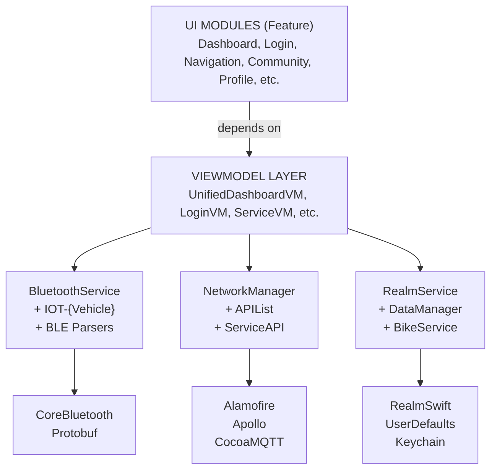

### 2.3 Feature Configuration (Per-Vehicle)

Instead of traditional feature flags, TVS Connect uses a **VehicleFeatureConfig** system:
- Config fetched from backend per vehicle `frameNo`
- Stored in Realm via `VehicleFeatureConfigRealmManager`
- Controls map provider, feature availability, UI variants
- Compile-time flags (`#if DEV_DEBUG`) for environment branching only

→ *Cross-reference: [LLD.md](./LLD.md) §9 for implementation details*

---

## 3. Folder Structure Explanation

> **Quick Reference:**  
> Always open `TVS.xcworkspace` (not .xcodeproj). All source lives under `SourceCode/`.

```
tvs-connect-ios-app/
├── SourceCode/                          # ← All development happens here
│   ├── TVS.xcworkspace                  # ← ALWAYS open this
│   ├── TVS.xcodeproj/                   # Xcode project (managed by workspace)
│   ├── Podfile                          # CocoaPods dependency manifest
│   │
│   ├── TVS/                             # ═══ MAIN APP TARGET ═══
│   │   ├── Application/                 # App lifecycle (AppDelegate, Migration)
│   │   │   WHY: Isolated app-level concerns from features
│   │   │
│   │   ├── AppConfig/                   # Build configs (xcconfig files)
│   │   │   WHY: Environment-specific settings without code changes
│   │   │
│   │   ├── Modules/                     # ═══ FEATURE MODULES (41) ═══
│   │   │   ├── IOT-{VehicleCode}/       # BLE modules per vehicle type
│   │   │   ├── Login/                   # Authentication flow
│   │   │   ├── Navigation/              # Maps & routing
│   │   │   ├── Community/               # Social features
│   │   │   └── ...                      # Each follows MVVM structure
│   │   │   WHY: Feature isolation enables parallel team development
│   │   │
│   │   ├── Services/                    # Shared business services (54 files)
│   │   │   WHY: Cross-feature logic (BikeService, RealmService, RideService)
│   │   │
│   │   ├── NewService/                  # Modern API pattern (protocol-based)
│   │   │   WHY: Newer code uses testable, injectable services
│   │   │
│   │   ├── UnifiedDashboard/            # New dashboard (replaces legacy)
│   │   │   WHY: Single dashboard for all vehicle types
│   │   │
│   │   ├── SupportingFiles/             # ═══ CORE INFRASTRUCTURE (303 files) ═══
│   │   │   ├── BluetoothService/        # BLE core + per-vehicle parsers/senders
│   │   │   ├── WebService/              # Network layer (NetworkManager, APIList)
│   │   │   ├── HelperClass/             # DataManager, CommonMethods, Extensions
│   │   │   ├── MapManager/              # Multi-provider map abstraction
│   │   │   ├── GA Analytics/            # Event tracking
│   │   │   ├── Charts/                  # Data visualization
│   │   │   └── WifiModule/              # Wi-Fi vehicle connectivity
│   │   │   WHY: Shared infrastructure used by all modules
│   │   │
│   │   ├── TVS_EV/                      # ═══ EV FEATURES (1,101 files) ═══
│   │   │   ├── U388/                    # iQube EV (main EV vehicle)
│   │   │   ├── U546/                    # Newer EV vehicle
│   │   │   ├── CommonModules/           # Shared EV utilities
│   │   │   └── VoiceAssist/             # EV voice assistant
│   │   │   WHY: EV has completely different BLE protocol, backend, features
│   │   │
│   │   ├── Onboarding flow Module/      # Vehicle/accessory pairing flows
│   │   ├── InAppNudge/                  # In-app messaging
│   │   ├── Referral/                    # Referral program
│   │   ├── Rewards/                     # Rewards/loyalty
│   │   ├── SideMenu/                    # Navigation drawer
│   │   ├── CODPSchema/                  # GraphQL schema definitions
│   │   ├── schema.graphqls              # Apollo GraphQL schema (9600+ lines)
│   │   └── *.xcassets                   # Vehicle-specific image assets
│   │
│   ├── TVS Watch App/                   # watchOS companion app
│   ├── TVSTests/                        # Unit tests
│   ├── TVSUITests/                      # UI tests
│   ├── Model/                           # Shared data models
│   ├── Frameworks/                      # Vendor xcframeworks
│   └── Pods/                            # CocoaPods output (gitignored)
│
├── Certificates/                        # Provisioning profiles & certs
├── docs/                                # Project documentation
└── .kiro/                               # AI automation (hooks, specs, steering)
```

### Where to Find Code (Developer Guide)

| Task | Start Here |
|------|-----------|
| Add a new vehicle type | `Modules/IOT-{NewCode}/` + `SupportingFiles/BluetoothService/{NewCode}BLEDataParser/` |
| Add a new API endpoint | `SupportingFiles/WebService/APIList.swift` + create in `NewService/` pattern |
| Modify BLE behavior | `SupportingFiles/BluetoothService/BluetoothService.swift` + vehicle-specific extension |
| Add a new feature module | `Modules/{NewFeature}/Controller/`, `/ViewModel/`, `/Model/`, `/View/` |
| Change environment URLs | `SupportingFiles/WebService/NetworkConfiguration.swift` |
| Add a new Realm object | Define class → add to `Migration.swift` → increment `schemaVersion` |
| Add EV feature | `TVS_EV/U388/Modules/` or `TVS_EV/U546/` |
| Modify dashboard | `UnifiedDashboard/UnifiedDashboardVM.swift` + vehicle-specific extension |

### Naming Conventions

| Element | Pattern | Example |
|---------|---------|---------|
| ViewController | `{Feature}VC` | `LoginVC`, `DashboardVC` |
| ViewModel | `{Feature}ViewModel` | `UnifiedDashboardViewModel` |
| Service | `{Domain}Service` | `BikeService`, `RideService` |
| API class | `{Feature}API` | `ServiceAPI` |
| Protocol | `{Name}Protocol` or `{Name}Delegate` | `ServiceAPIProtocol` |
| BLE Parser | `{VehicleCode}BLEDataParser` | `U399CBLEDataParser` |
| BLE Sender | `{VehicleCode}BLESender` | `U399CBLESender` |
| Realm extension | `RealmService{VehicleCode}` | `RealmServiceU399C` |
| Service extension | `BikeService+{Code}.swift` | `BikeService+N109.swift` |
| Asset catalog | `{VehicleCode}.xcassets` | `U399C.xcassets` |

---

## 4. Core Business Workflows

> **Quick Reference:**  
> Auth: OTP-based | BLE: per-vehicle UUID-based | API: Alamofire + JWT  
> Storage: Realm (structured) + UserDefaults (flags) + Keychain (secrets)

### 4.1 App Launch Initialization Sequence

```
AppDelegate.didFinishLaunchingWithOptions
    │
    ├─① Set country (.INDIA)
    ├─② settingEnvironment() — compiler flag → NetworkConfiguration.buildEnvironment
    ├─③ initSetup():
    │     ├─ Realm Migration (schema v52)
    │     ├─ IQKeyboard setup
    │     ├─ Mappls SDK key registration
    │     ├─ Google Maps SDK initialization
    │     ├─ DropDown appearance
    │     ├─ Push notification registration
    │     └─ LocationManager initialization
    ├─④ initEVSetup() — EV-specific initialization
    ├─⑤ Firebase.configure() (Release builds only)
    ├─⑥ Crashlytics setup
    ├─⑦ Audio session (ambient mode)
    ├─⑧ Garmin SDK registration
    ├─⑨ KogoAuto event logging setup
    ├─⑩ WatchApp login state manager
    └─⑪ Keychain encryption key setup
```

**Files:** `TVS/Application/AppDelegate.swift`, `TVS/Application/Migration.swift`

### 4.2 User Authentication

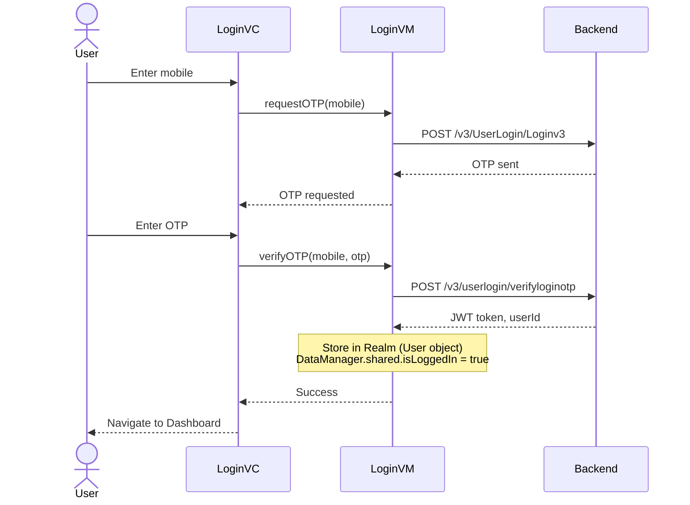

**Error/Fallback:**
- Invalid OTP → Show error toast, allow retry
- Network failure → Show offline message
- 401 on any subsequent call → `forceLogoutOutOnTokenExpire()` → redirect to Login

**Files:** `Modules/Login/Controller/LoginVC.swift`, `Modules/Login/ViewModel/LoginViewModel.swift`

### 4.3 Vehicle BLE Pairing & Connection

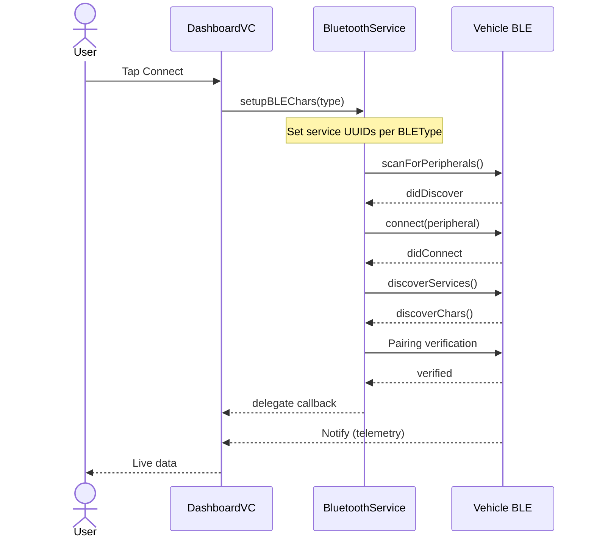

**Error/Fallback:**
- BLE off → `centralManagerStatus(isBleEnabled: false)` → show enable BLE prompt
- Connection failed → retry after 8 seconds (auto-reconnect timer)
- Disconnect during ride → notify user, continue GPS-only tracking
- Auto-connect: stored `peripheralUUID` in UserDefaults → reconnect on app launch

**Files:** `SupportingFiles/BluetoothService/BluetoothService.swift`, `SupportingFiles/BluetoothService/BLEType.swift`

### 4.4 Real-Time Telemetry Data Flow

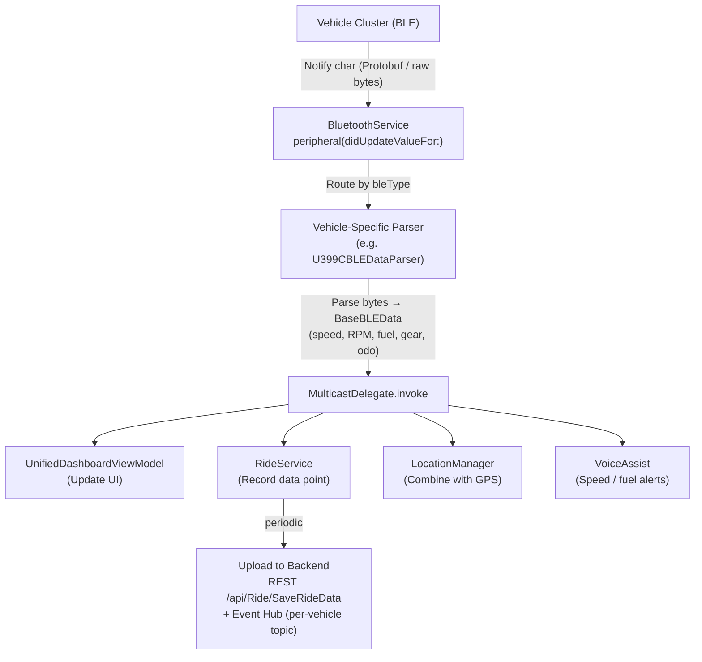

**Data Transformation:**
1. Raw bytes → Protobuf decode → Swift model
2. Swift model → Realm object (local storage)
3. Realm object → JSON → API upload

### 4.5 API Request Lifecycle

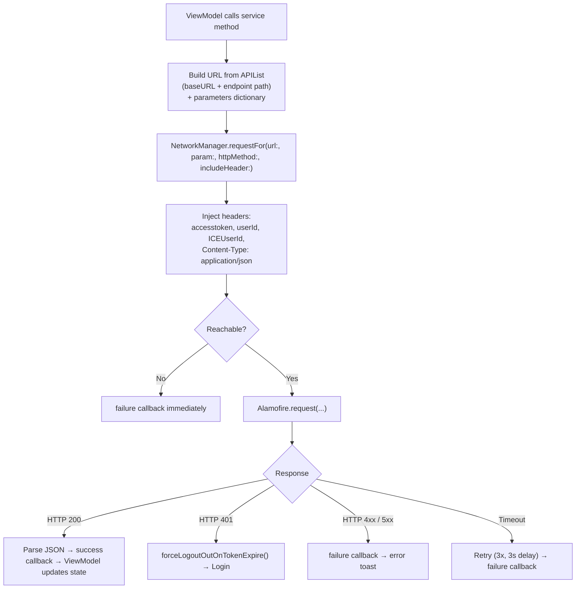

**Files:** `SupportingFiles/WebService/NetworkManager.swift`, `SupportingFiles/WebService/APIList.swift`

### 4.6 Push Notification Handling

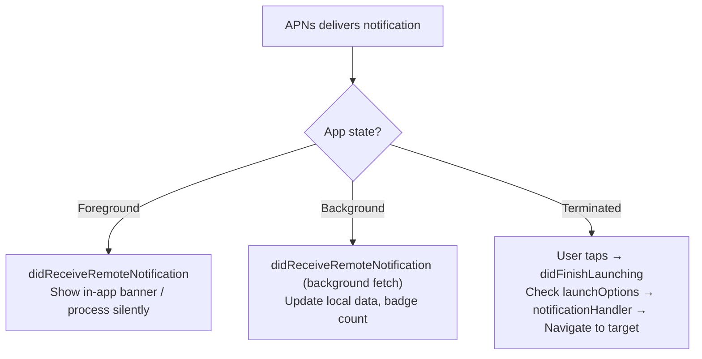

**Files:** `TVS/Application/AppDelegate.swift` (notification extension methods)

### 4.7 Ride/Tour Recording Lifecycle

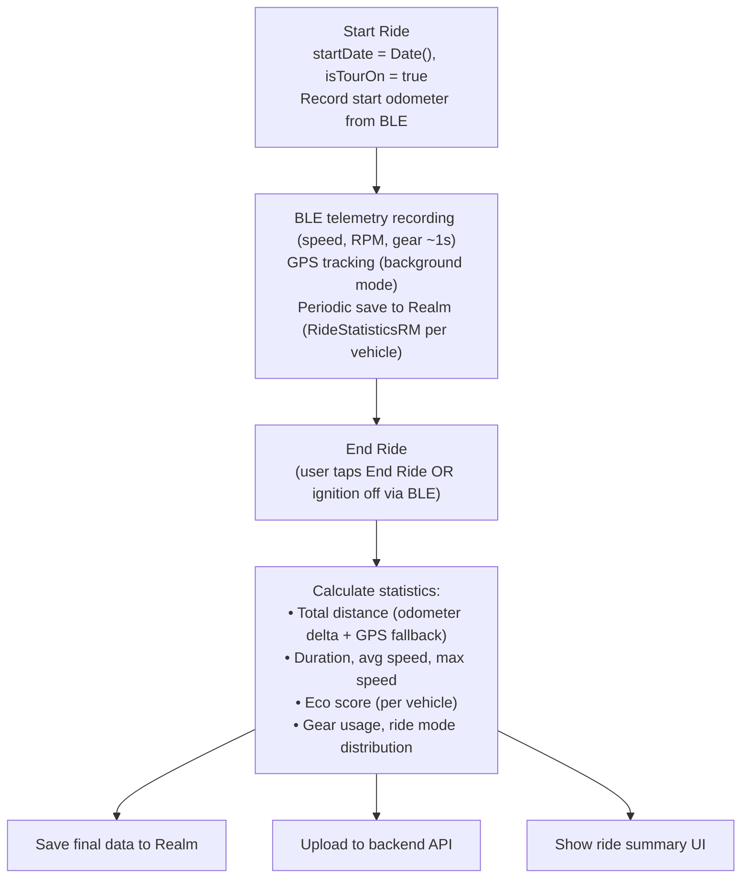

---

## 5. Key Services/Classes

> **Quick Reference:**  
> All core services are singletons. Newer services use protocol injection.  
> BluetoothService uses MulticastDelegate for event broadcasting.

### 5.1 BluetoothService

| Attribute | Detail |
|-----------|--------|
| **File** | `TVS/SupportingFiles/BluetoothService/BluetoothService.swift` |
| **Pattern** | Singleton (`BluetoothService.shared`) |
| **Thread Model** | CBCentralManager on nil queue (main thread callbacks) |
| **State** | `peripheralConnectionStatus: PeripheralStatus` |

**Key Interface:**
```swift
class BluetoothService {
    static let shared: BluetoothService
    var bleType: BLEType
    var peripheralConnectionStatus: PeripheralStatus
    
    func setupBLECharecteristics(_ bleType: BLEType)
    func scanForPeripherals()
    func connectBLE(peripheralUUID: String)
    func disconnectBLE()
    func sendData(_ data: Data)
    func add(delegate: BluetoothServiceDelegate?)
    func remove(delegate: BluetoothServiceDelegate?)
}
```

**Depends On:** CoreBluetooth, Protobuf, DataManager, AppKeys  
**Depended By:** All IOT modules, UnifiedDashboardVM, RideService, VoiceAssist

### 5.2 NetworkManager

| Attribute | Detail |
|-----------|--------|
| **File** | `TVS/SupportingFiles/WebService/NetworkManager.swift` |
| **Pattern** | Singleton (`NetworkManager.sharedInstance`) |
| **Thread Model** | Alamofire default (background response, main callback) |
| **State** | `isReachable: Bool`, retry state |

**Key Interface:**
```swift
class NetworkManager {
    class var sharedInstance: NetworkManager
    var isReachable: Bool
    
    func requestFor(url:, param:, httpMethod:, includeHeader:, 
                    encodingType:, success:, failure:)
    func multipartedRequestFor(url:, imageData:, success:, failure:)
    func forceLogoutOutOnTokenExpire()
}
```

**Depends On:** Alamofire, Reachability, NetworkConfiguration  
**Depended By:** All ViewModels, all API services

### 5.3 DataManager

| Attribute | Detail |
|-----------|--------|
| **File** | `TVS/SupportingFiles/HelperClass/DataManager.swift` |
| **Pattern** | Singleton (`DataManager.shared`) |
| **Thread Model** | Main thread (UserDefaults) |
| **State** | 30+ UserDefaults-backed properties |

**Key Interface:**
```swift
class DataManager {
    static let shared: DataManager
    
    var isLoggedIn: Bool
    var isTourOn: Bool
    var selectedBike: VehicleInfo?
    var startDate: Date?
    var isAutoConnectRideFlow: Bool
    var isUserMigratedToUnified: Bool
}
```

**Depends On:** UserDefaults, WatchAppLoginStateManager  
**Depended By:** Nearly everything (global state)

### 5.4 NetworkConfiguration

| Attribute | Detail |
|-----------|--------|
| **File** | `TVS/SupportingFiles/WebService/NetworkConfiguration.swift` |
| **Pattern** | Singleton (`NetworkConfiguration.shared`) |
| **State** | All API URLs, country, environment |

**Key Interface:**
```swift
class NetworkConfiguration {
    class var shared: NetworkConfiguration
    var buildEnvironment: DevelopmentEnvironment  // Set once at app launch
    var country: Countries
    var hostURL: String          // Computed from environment
    var serverURL: String        // hostURL + "/api"
    func setupAPIForIndia()
    func setupAPIForIBAsia()
}
```

### 5.5 RealmService

| Attribute | Detail |
|-----------|--------|
| **File** | `TVS/Services/RealmService*.swift` (multiple extensions) |
| **Pattern** | Static methods |
| **Thread Model** | Must be called on same thread as Realm instance |

**Per-vehicle extensions:** RealmServiceU399C, RealmServiceU368, RealmServiceU449, RealmServiceU400, RealmServiceN597, RealmServiceN109, RealmServiceN112, RealmServiceN251

### 5.6 BikeService

| Attribute | Detail |
|-----------|--------|
| **File** | `TVS/Services/BikeService.swift` + extensions |
| **Pattern** | Singleton (`BikeService.shared`) |

**Per-vehicle extensions:** BikeService+N109, BikeService+N251, BikeService+N360, BikeService+U408, BikeService+NonIOT

### 5.7 AppConnectivityViewModel (Watch Communication)

| Attribute | Detail |
|-----------|--------|
| **File** | `TVS_EV/U388/WatchConnectivityManager/AppConnectivityViewModel.swift` |
| **Pattern** | Singleton (`AppConnectivityViewModel.shared`) |
| **Protocol** | WCSessionDelegate |

Handles bidirectional communication with Apple Watch (auth state, remote control, vehicle status).

---

## 6. External Integrations

> **Quick Reference:**  
> 12+ external integrations | Maps: Mappls (India) + Google (secondary)  
> Analytics: Firebase + AppDynamics | Push: APNs via Firebase

### 6.1 Integration Inventory

| Integration | Purpose | Type | Protocol | Init Location |
|-------------|---------|------|----------|---------------|
| Firebase | Crash reporting, push notifications | SDK | FCM/Crashlytics | AppDelegate (Release only) |
| AppDynamics | APM, performance monitoring | SDK | Agent SDK | AppDelegate |
| Mappls (MapmyIndia) | Primary maps (India) | SDK | MapplsAPICore | AppDelegate.initSetup() |
| Google Maps | Secondary maps provider | SDK | GMSServices | AppDelegate.initSetup() |
| Google Navigation | Turn-by-turn navigation | SDK | GoogleNavigation | On navigation start |
| KogoAuto | Third-party ride integration | SDK | Kogo SDK | AppDelegate |
| BluArmor | Smart helmet BLE | SDK/BLE | CoreBluetooth | On accessory setup |
| Garmin Connect IQ | Watch integration | SDK | GarminSDK | AppDelegate |
| what3words | Location addressing | API | REST | On demand |
| LatLong.in | Dealer locator | API | REST + OAuth | On dealer search |
| Azure Event Hubs | Telemetry upload | API | HTTPS + SAS | During rides |
| MQTT Broker | Real-time vehicle state | MQTT | CocoaMQTT | Post-login |
| Apple Watch | Companion app | WCSession | WatchConnectivity | AppDelegate |

### 6.2 Country-Specific Integrations

| Integration | India | Sri Lanka | Nepal | Bangladesh |
|-------------|-------|-----------|-------|------------|
| Mappls Maps | ✅ Primary | ❌ | ❌ | ❌ |
| Google Maps | ✅ Secondary | ✅ Primary | ✅ Primary | ✅ Primary |
| LatLong.in Dealers | ✅ | ❌ | ❌ | ❌ |
| Event Hubs | ✅ | ❌ | ❌ | ❌ |

### 6.3 Failure Modes

| Integration | Failure Mode | Fallback |
|-------------|--------------|----------|
| Firebase | SDK init failure | App continues, no crash reporting |
| Mappls Maps | API key expired | Degrade to Google Maps |
| BLE | Bluetooth off | Show non-connected dashboard |
| Network | No connectivity | Serve from Realm cache |
| MQTT | Broker unreachable | Fallback to REST polling |
| Event Hub | Upload fails | Queue locally, retry later |

---

## 7. Major Dependencies

> **Quick Reference:**  
> 40+ CocoaPods | Custom source: Eyelights (private) | KogoAuto (private Bitbucket)

### 7.1 Categorized Dependency List

#### Networking (Critical — Deeply Coupled)
| Pod | Version | Replaceable? | Notes |
|-----|---------|--------------|-------|
| Alamofire | Latest | ❌ Deep | Used in 100+ files |
| Apollo + WebSocket | Latest | ❌ Deep | GraphQL schema tied |
| CocoaMQTT | 2.0.9 | ⚠️ Medium | Isolated to MQTT service |
| ReachabilitySwift | Latest | ✅ Easy | Wrapper, few usages |

#### UI (Medium Coupling)
| Pod | Version | Replaceable? | Notes |
|-----|---------|--------------|-------|
| IQKeyboardManagerSwift | ~6.5.13 | ✅ Easy | Drop-in replacement |
| SideMenu | 6.5.0 | ⚠️ Medium | UI coupled |
| FSPagerView | Latest | ⚠️ Medium | Custom carousel |
| DGCharts | Latest | ⚠️ Medium | Data viz throughout |
| Kingfisher | Latest | ✅ Easy | Image loading |
| SDWebImage | ~5.2.3 | ✅ Easy | Legacy image loading |
| Toast-Swift | 5.0.1 | ✅ Easy | Simple toast |
| DropDown | 2.3.13 | ✅ Easy | Dropdown menus |

#### Data & Storage (Critical)
| Pod | Version | Replaceable? | Notes |
|-----|---------|--------------|-------|
| RealmSwift | ~10.48.1 | ❌ Deep | 50+ object types, schema v52 |
| SwiftyJSON | Latest | ⚠️ Ongoing migration | Legacy parsing |
| Protobuf | Latest | ❌ Deep | BLE data format |
| CryptoSwift | ~1.6.0 | ⚠️ Medium | Encryption layer |

#### Analytics & Monitoring (Medium)
| Pod | Version | Replaceable? | Notes |
|-----|---------|--------------|-------|
| Firebase/Core | 10.24.0 | ⚠️ Medium | Push + crash |
| Firebase/Crashlytics | (from Core) | ⚠️ Medium | Crash reporting |
| FirebaseMessaging | Latest | ⚠️ Medium | Push notifications |
| AppDynamicsAgent | 2022.5.0 | ✅ Easy | APM only |

#### Maps (Region-Specific)
| Pod | Version | Replaceable? | Notes |
|-----|---------|--------------|-------|
| MapplsMap + APIKit + NavigationUI | Latest | ❌ Deep (India) | Primary maps |
| GoogleMaps + Navigation + Places | Latest | ❌ Deep | Secondary + international |

#### DI & Architecture
| Pod | Version | Replaceable? | Notes |
|-----|---------|--------------|-------|
| Swinject | ~2.7.1 | ⚠️ Medium | DI container |
| Cartography | ~4.0.0 | ✅ Easy | Auto layout DSL |

#### Private/Custom Sources
| Pod | Source | Notes |
|-----|--------|-------|
| KogoAuto | Private Bitbucket | Requires access credentials |
| EyeTVSSDK | Private GitHub (Eyelights) | Currently commented out |
| HyperWebView | 1.0.2 | Embedded web views |

---

## 8. Runtime Architecture

> **Quick Reference:**  
> 5 background modes | Watch app IPC via WCSession  
> BLE callbacks on main thread | Network responses on background → main

### 8.1 Thread/Queue Model

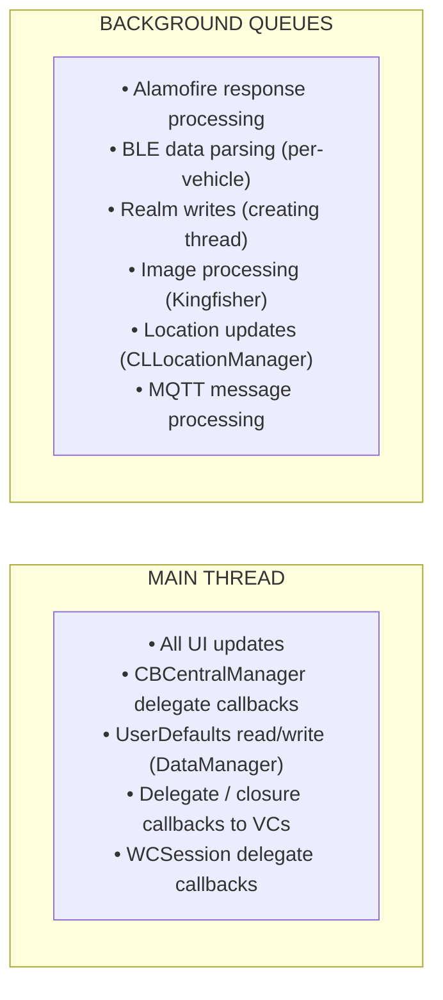

### 8.2 Memory Management Patterns

| Pattern | Usage | Example |
|---------|-------|---------|
| `weak` delegates | All delegate properties | `weak var delegate: DashboardViewDelegate?` |
| `[weak self]` in closures | Network callbacks, timers | `{ [weak self] result in ... }` |
| MulticastDelegate (weak) | BLE event broadcasting | WeakWrapper array in BluetoothService |
| NotificationCenter removal | `deinit` blocks | `NotificationCenter.default.removeObserver(self)` |

### 8.3 Background Execution Capabilities

| Mode | Info.plist Key | Purpose |
|------|---------------|---------|
| `bluetooth-central` | UIBackgroundModes | Continue BLE during rides |
| `location` | UIBackgroundModes | GPS tracking during rides/tours |
| `remote-notification` | UIBackgroundModes | Silent push processing |
| `fetch` | UIBackgroundModes | Background data refresh |
| `audio` | UIBackgroundModes | Navigation voice, music |

**Additional:**
- `BGTaskScheduler`: BluArmor background task
- `NSSupportsLiveActivities`: Live Activity widgets (ride status)
- Background task identifier: `UIBackgroundTaskIdentifier` for BLE/location

### 8.4 App State Handling

| State | Behavior |
|-------|----------|
| **Foreground** | Full BLE telemetry, UI updates, all features active |
| **Background** | BLE continues (background mode), GPS tracking, MQTT active |
| **Suspended** | BLE connection maintained, location updates paused |
| **Terminated** | BLE disconnects; on relaunch → auto-reconnect if enabled |
| **Low Memory** | Realm autorelease, image cache cleared |

### 8.5 Inter-Process Communication

| Channel | From | To | Data |
|---------|------|----|------|
| WCSession | iOS App | watchOS App | Auth state, vehicle status, ride data |
| WCSession | watchOS App | iOS App | Remote commands (lock/unlock/find/trunk) |
| App Groups | Main App | Widget Extension | Vehicle status for widgets |
| Keychain Sharing | Main App | Extensions | Auth tokens |
| URL Schemes | External Apps | TVS Connect | Deep links (tvsconnect://) |
| Universal Links | Web | TVS Connect | Deep links (domain-based) |

---

## 9. Important Entry Points

> **Quick Reference:**  
> App starts at AppDelegate → Login storyboard → UnifiedDashboard  
> BLE starts at BluetoothService.setupBLECharecteristics()

### 9.1 Entry Point Table

| Entry Point | File | When Relevant |
|-------------|------|---------------|
| App Launch | `Application/AppDelegate.swift` | App lifecycle, SDK init |
| Login Screen | `Modules/Login/Controller/LoginVC.swift` | Authentication |
| Main Dashboard | `UnifiedDashboard/UnifiedDashboardVC.swift` | Post-login home |
| BLE Connection | `SupportingFiles/BluetoothService/BluetoothService.swift` | Vehicle connectivity |
| API URLs | `SupportingFiles/WebService/NetworkConfiguration.swift` | Environment setup |
| All Endpoints | `SupportingFiles/WebService/APIList.swift` | API reference |
| Realm Schema | `Application/Migration.swift` | Database changes |
| EV Dashboard | `TVS_EV/U388/Modules/Dashboard/` | EV features |
| Watch Sync | `TVS_EV/U388/WatchConnectivityManager/` | Watch communication |
| Map Abstraction | `SupportingFiles/MapManager/` | Multi-provider maps |
| Vehicle Config | `Services/VehicleFeatureConfigRealmManager.swift` | Feature toggles |

### 9.2 "Start Here" Guide

#### "I need to add a new vehicle type"
1. Create `BLEType` case in `SupportingFiles/BluetoothService/BLEType.swift`
2. Add BLE UUIDs in `AppKeys` for the new type
3. Create parser: `SupportingFiles/BluetoothService/{Code}BLEDataParser/`
4. Create sender: `SupportingFiles/BluetoothService/{Code}BLESender.swift`
5. Create module: `Modules/IOT-{Code}/` (Controller, ViewModel, Model, View)
6. Add Realm objects for ride data
7. Update `UnifiedDashboardViewModel` with vehicle-specific handling
8. Add image assets: `{Code}.xcassets`
9. Register in `SelectedBike` helper

#### "I need to add a new API endpoint"
1. Add URL constant in `SupportingFiles/WebService/APIList.swift`
2. Create protocol in `NewService/Networking/{Feature}APIProtocol.swift`
3. Implement in `NewService/Networking/{Feature}API.swift`
4. Create response models in `NewService/Model/`
5. Call from ViewModel using injected protocol

#### "I need to modify BLE behavior"
1. Core logic: `SupportingFiles/BluetoothService/BluetoothService.swift`
2. Vehicle-specific: `SupportingFiles/BluetoothService/{Code}BLEDataParser/`
3. Data sending: `SupportingFiles/BluetoothService/{Code}BLESender.swift`
4. Connection extensions: `BluetoothService+{Code}.swift`

#### "I need to add a new feature module"
1. Create folder: `Modules/{FeatureName}/`
2. Add subfolders: `Controller/`, `ViewModel/`, `Model/`, `View/`
3. Create VC: `{Feature}VC.swift`
4. Create VM: `{Feature}ViewModel.swift`
5. Create storyboard/XIB in `View/`
6. Wire navigation from existing flow

---

## 10. High-Level Data Flow

> **Quick Reference:**  
> 3 data paths: BLE→Realm→API | API→Realm→UI | Push→Handler→UI  
> Persistence: Realm (structured), UserDefaults (flags), Keychain (secrets)

### 10.1 Vehicle → App → Backend (Telemetry)

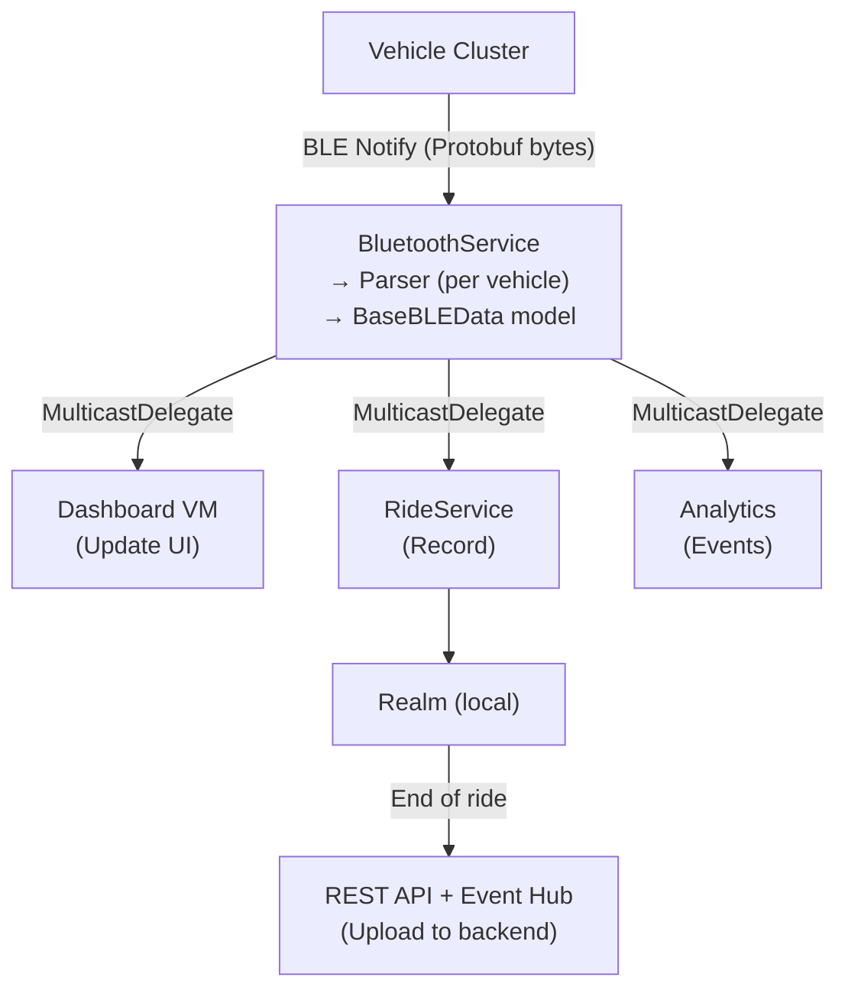

### 10.2 Backend → App → UI (Server-Pushed Data)

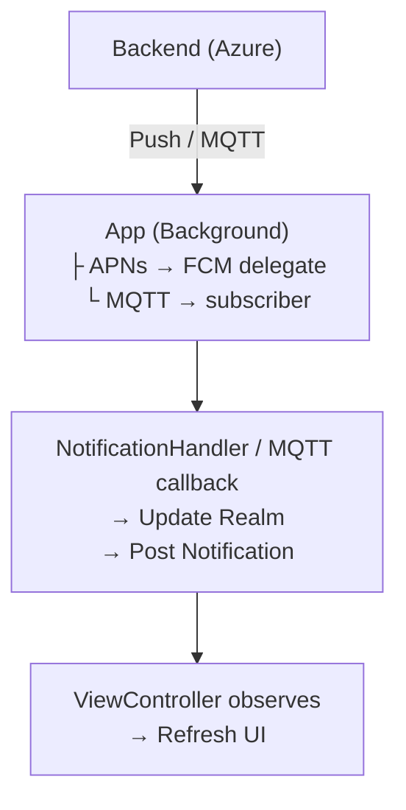

### 10.3 User Action → API → UI Update

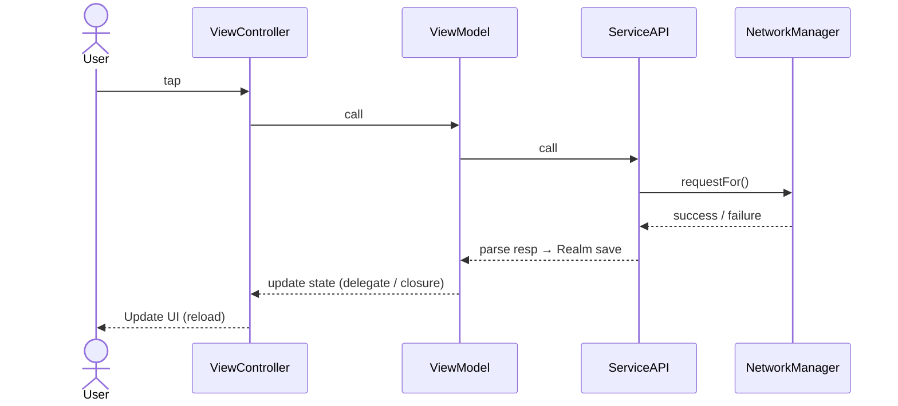

### 10.4 Data Persistence Strategy

| Store | What Goes Here | Lifecycle |
|-------|----------------|-----------|
| **Realm** | Vehicle data, ride history, user profile, settings, notifications, geofences, service bookings | Persistent across app launches; migrated on schema changes |
| **UserDefaults** | Flags (isLoggedIn, isTourOn), preferences, last connected peripheral UUID, timestamps | Persistent; lightweight key-value |
| **Keychain** | Encryption keys, RSA token generation secrets, shared credentials | Secure persistent; shared via app groups |
| **Memory** | Current BLE data (BaseBLEData), connection state, transient UI state | Lost on app terminate |
| **File System** | Downloaded assets, OTA firmware files, CSV exports | Managed per-session |

### 10.5 Offline Capability

| Feature | Offline Behavior |
|---------|-----------------|
| Dashboard | Shows last known data from Realm |
| Rides | BLE + GPS continues; data saved locally; uploads when online |
| Navigation | Requires network (no offline maps) |
| Profile | Cached in Realm |
| Service Booking | Requires network |
| Vehicle Control (EV) | Requires BLE (direct, no network needed) |

### 10.6 Cache Invalidation

| Data Type | Invalidation Strategy |
|-----------|----------------------|
| Vehicle list | Re-fetched on app foreground |
| Dashboard data | Overwritten on BLE connect |
| Ride history | Append-only; server sync on upload |
| User profile | Re-fetched on profile screen open |
| Feature config | Re-fetched per vehicle on selection change |
| Images | Kingfisher disk cache (default expiry) |

---

## Cross-References

| Topic | Document |
|-------|----------|
| System architecture diagrams | [HLD.md](./HLD.md) |
| Class-level implementation details | [LLD.md](./LLD.md) |
| API endpoint specifications | [API_SPEC.md](./API_SPEC.md) |
| Setup & development instructions | [README.md](./README.md) |
| Confluence (team docs) | [TVS Motor Confluence Space](https://tvsmotorcompany.atlassian.net/wiki/spaces/DE2/) |

---

> **Confidentiality:** This document excludes API keys, secrets, production URLs, and proprietary BLE protocol details. For sensitive configuration, refer to secure team documentation.


---

## Document Ownership

| Role | Person / Team | Contact |
|------|---------------|---------|
| **Project Manager** | Smaranika Tripathy | smaranika.tripathy@tvsmotor.com |
| **Product Owner** | ISSM Team / Malavika | malavika@tvsmotor.com |
| **Owner** | Sumit Prajapat | sumit.prajapat@tvsmotor.com |
