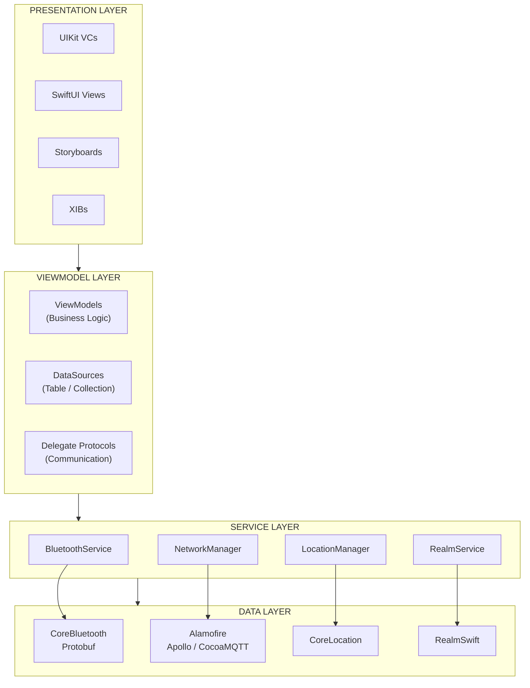
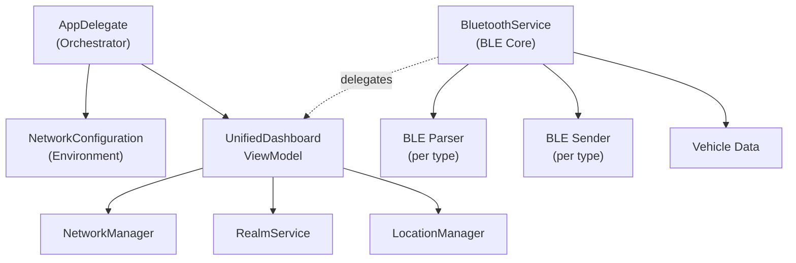
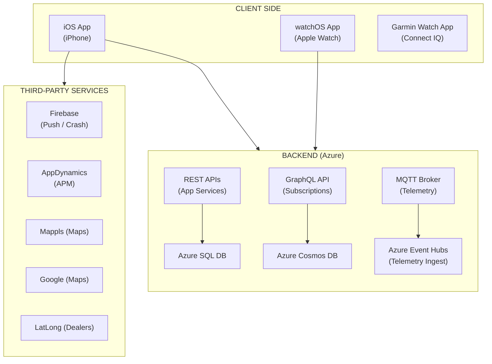
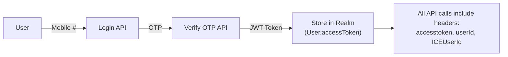
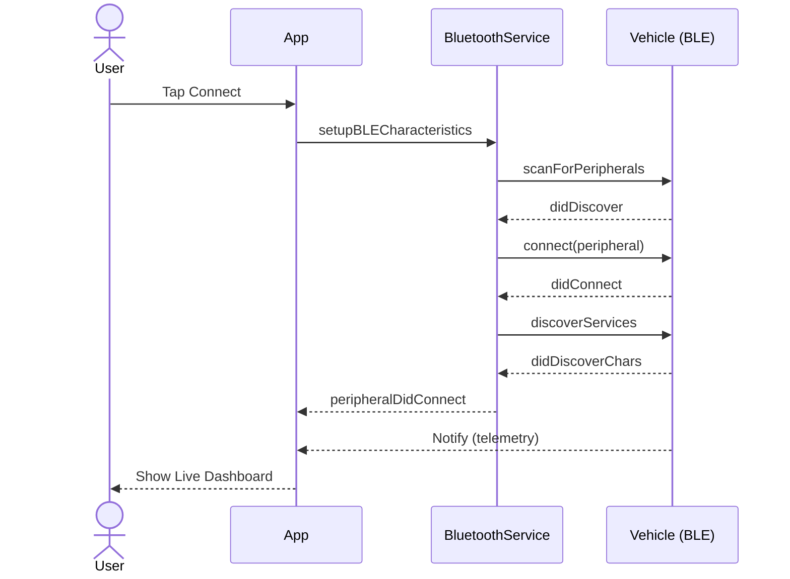
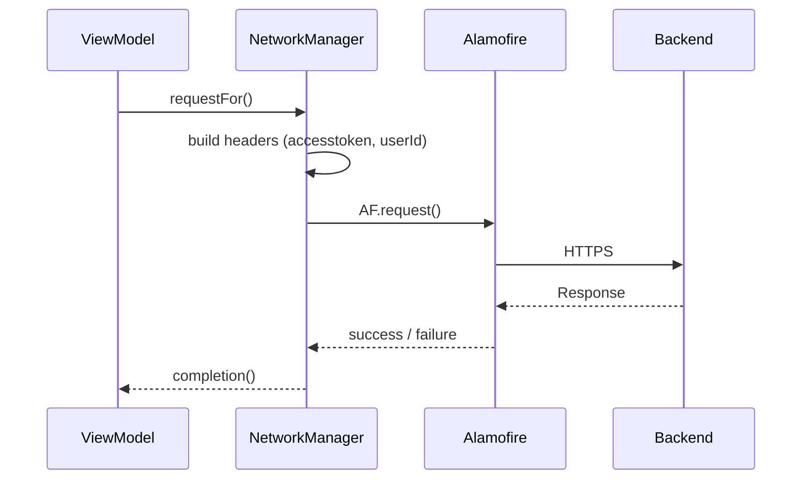
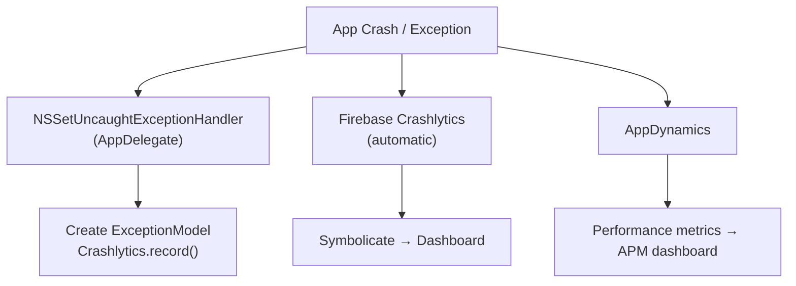
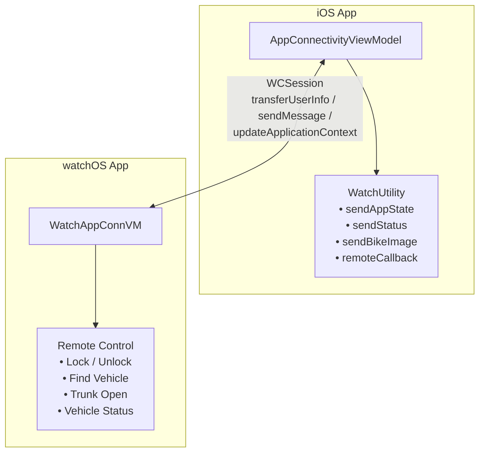

# High Level Design (HLD) — TVS Connect iOS App

> **Version:** 2.1 | **Last Updated:** June 7, 2026  
> **Template Reference:** TVS Motor Company HLD Template  
> **Purpose:** Architecture-level document for engineering.

| Version | Date | Changes |
|---------|------|---------|
| 2.1 | June 7, 2026 | Added Vehicle Feature Matrix (code/name reference + feature support) |
| 2.0 | June 2, 2026 | Added Security, Observability, Watch IPC, ADRs, Graceful Degradation |
| 1.0 | June 2, 2026 | Initial creation |

---

## 1. System Architecture

### 1.1 Architecture Overview

TVS Connect follows a **layered MVVM architecture** with protocol-oriented service injection, designed around vehicle-specific BLE communication and multi-backend integration.



### 1.2 Architecture Principles

1. **Vehicle-Type Isolation** — Each vehicle code (U399C, N251, U449, etc.) has isolated BLE parsers, senders, and UI modules
2. **Protocol-Oriented Services** — Newer code uses protocol contracts for testability and DI
3. **Singleton Services** — Shared state via well-defined singletons (BluetoothService, DataManager, NetworkManager)
4. **MulticastDelegate** — BLE events broadcast to multiple listeners without tight coupling
5. **Environment Compile-Time Switching** — No runtime environment checks; uses `#if` compiler flags

---

## 2. Major Components/Services

### 2.1 Component Interaction Diagram



### 2.2 Service Registry

| Service | Type | Scope | Responsibility |
|---------|------|-------|----------------|
| `BluetoothService.shared` | Singleton | App-wide | BLE central manager, connection lifecycle |
| `NetworkManager.sharedInstance` | Singleton | App-wide | HTTP request execution, retries, auth |
| `NetworkConfiguration.shared` | Singleton | App-wide | Environment URLs, country config |
| `DataManager.shared` | Singleton | App-wide | UserDefaults state management |
| `BikeService.shared` | Singleton | App-wide | Vehicle list, selection, capabilities |
| `LocationManager.shared` | Singleton | App-wide | GPS tracking, geofencing |
| `RealmService` | Static | App-wide | Database operations |
| `CommonMethods` | Static | App-wide | Utilities (analytics, formatters) |

---

## 3. Deployment Architecture

### 3.1 Infrastructure Topology



### 3.2 App Distribution

| Channel | Scheme | Environment |
|---------|--------|-------------|
| App Store | TVS | Production |
| TestFlight (QA) | TVS QA | Production-pointed |
| TestFlight (UAT) | TVS Staging | UAT |
| TestFlight (Customer) | TVS Cust | Production-pointed |
| Development | TVS DEV | Development |

---

## 4. Database Interactions

### 4.1 Local Database (Realm)

| Category | Objects | Purpose |
|----------|---------|---------|
| User | User, UserModel, EmergencyContact | Authentication, profile |
| Vehicle | VehicleInfo, ConnectedVehicle | Vehicle registration data |
| Rides | U399CRideStatisticsRM, U368RideStatisticsRM, U449RideStatisticsRM, U400RideStatisticsRM, N597RideStatisticsRM, etc. | Ride history per vehicle |
| Tours | U399CTourRM, U368TourRM, U400TourRM, ApacheTourRM | Long tour data |
| Settings | SettingModel, SettingsInfo, ExperienceSettings | User preferences |
| Notifications | NotificationModel, EVNotificationModel | Push notification storage |
| Geofencing | GeofenceData | Virtual boundary configs |
| EV | EVConnectedVehicle, EVSettingModel | EV-specific data |
| Service | SBRelamService, SBAddonRelamService | Service booking data |

**Schema Management:** Version 52, incremental migration via `Migration.swift`

### 4.2 Remote Databases (Backend)

- **Azure SQL** — User accounts, vehicle registration, ride history (server-side)
- **Azure Cosmos DB** — Telemetry data, real-time vehicle state
- **Azure Event Hubs** — Telemetry event ingestion pipeline

---

## 5. API Integrations

### 5.1 REST APIs (Primary)

| Domain | Base URL Pattern | Auth |
|--------|-----------------|------|
| Core APIs | `{env}-tvsconnectapi.tvsmotor.net/api` | JWT (accesstoken header) |
| EV APIs | `{env}-tvsconnectevapi.tvsmotor.net/api` | JWT (accesstoken header) |
| IBasia APIs | `tvs-ibasia.azurewebsites.net/api` | JWT |
| Community | SiteCore CMS endpoint | JWT |
| Dealers | `api.latlong.in/v2/brands/` | OAuth token |

### 5.2 GraphQL API (Apollo)

- **Schema:** 9600+ lines covering vehicle telemetry, charging, trips, geofencing, alerts, weather
- **Transport:** HTTPS + WebSocket (subscriptions)
- **Use Cases:** EV features, live location sharing, ride analytics, P360 platform vehicles

### 5.3 MQTT

- **Topic Pattern:** `{organizationId}/{vehicleId}`
- **Use Case:** Real-time vehicle state updates (ignition, location, alerts)
- **Library:** CocoaMQTT 2.0.9

### 5.4 Event Hubs (Telemetry Upload)

- Per-vehicle endpoints (U399C, N251, U324, U408, U368, U532)
- HTTPS POST with SAS token authentication
- Used for uploading app-collected telemetry to Azure pipeline

---

## 6. Authentication & Authorization

### 6.1 Auth Flow



### 6.2 Token Management

| Aspect | Implementation |
|--------|----------------|
| Token Type | JWT |
| Storage | Realm `User` object |
| Refresh | `/RegisterUser/RefreshJWTToken` endpoint |
| Expiry Handling | 401 → `forceLogoutOutOnTokenExpire()` → Re-login |
| Secure Keys | Keychain (via CryptoSwift encryption) |

### 6.3 Additional Auth Methods
- Apple Sign-In (iOS 13+)
- Device token for push notifications
- SAS tokens for Azure Event Hubs

---

## 7. External Systems

| System | Integration Type | Purpose |
|--------|-----------------|---------|
| TVS Vehicle Cluster | BLE (CoreBluetooth) | Real-time telemetry, commands |
| TVS Backend (Azure) | REST + GraphQL + MQTT | Business logic, data persistence |
| Azure Event Hubs | HTTPS | Telemetry ingestion |
| Firebase | SDK | Push notifications, crash reporting |
| AppDynamics | SDK | Performance monitoring |
| Mappls/MapmyIndia | SDK | Maps, navigation, geocoding (India) |
| Google Maps | SDK | Maps, navigation (non-India) |
| KogoAuto | SDK | Third-party ride integration |
| BluArmor | BLE | Smart helmet connectivity |
| Garmin Connect IQ | SDK | Watch integration |
| Apple Watch | WatchConnectivity | Companion app data sync |

---

## 8. Infrastructure Dependencies

| Dependency | Type | Criticality |
|------------|------|-------------|
| Azure App Service | Backend hosting | Critical |
| Azure Event Hubs | Telemetry pipeline | High |
| MQTT Broker | Real-time updates | High |
| Firebase Cloud Messaging | Push notifications | High |
| Mappls SDK License | Maps (India) | High |
| Google Maps License | Maps (International) | Medium |
| Apple Push Notification Service | iOS Push | Critical |
| CocoaPods CDN | Dependency resolution | Build-time |

---

## 9. High-Level Sequence Flows

### 9.1 Vehicle Connection Sequence



### 9.2 API Request Sequence



---

## 10. Scalability & Resiliency

### 10.1 Scalability Considerations

| Aspect | Approach |
|--------|----------|
| Vehicle Types | Modular IOT-{code} architecture; new vehicles = new module |
| Countries | Country-specific API config via `NetworkConfiguration` |
| Features | Feature modules are independent; can be added/removed |
| Data Growth | Realm with periodic cleanup; vehicle-specific DB objects |
| API Versioning | URL-based versioning (v3, etc.) |

### 10.2 Resiliency Patterns

| Pattern | Implementation |
|---------|----------------|
| Network Retry | 3 retries with 3s delay (NetworkManager) |
| BLE Reconnect | Auto-reconnect with 8s delay timer |
| Offline Support | Realm local storage; sync on connectivity |
| Token Refresh | Auto-refresh on 401; forced re-login as fallback |
| Crash Recovery | Firebase Crashlytics; schema migration guards |
| Graceful Degradation | Non-connected dashboard when BLE unavailable |
| Background Tasks | UIBackgroundTaskIdentifier for BLE/location |

### 10.3 Error Handling Strategy

```
Network Error → Retry (3x) → Show toast → Log to analytics
BLE Disconnect → Auto-reconnect timer → Notify user → Fallback UI
Realm Migration Fail → Schema version check → Incremental migration
Auth Expiry → 401 detection → Token refresh → Force logout
```

---

## 11. Security Considerations

| Area | Mechanism |
|------|-----------|
| Data at Rest | Realm encryption, Keychain for secrets |
| Data in Transit | HTTPS/TLS for all API calls |
| Authentication | JWT tokens with server-side validation |
| BLE Security | Pairing verification protocol per vehicle |
| Sensitive Storage | CryptoSwift encryption for keys |
| Certificate Pinning | Configured (currently disabled for dev) |
| Code Obfuscation | Release builds only |

---

> **Confidentiality Note:** This document is intended for authorized engineering partners. It excludes specific API keys, secrets, internal business logic details, and production credentials.


---

## 12. Security Architecture

### 12.1 Data Classification

| Classification | Examples | Protection |
|---------------|----------|------------|
| **Sensitive** | JWT tokens, encryption keys, RSA credentials | Keychain (encrypted) |
| **Personal** | Mobile number, name, email | Realm (app sandbox) |
| **Vehicle** | Frame number, telemetry, ride data | Realm + HTTPS in transit |
| **Public** | Vehicle images, help content | Standard file system |

### 12.2 Encryption

| Layer | Mechanism |
|-------|-----------|
| Data at Rest (secrets) | iOS Keychain with `kSecAttrAccessibleWhenUnlocked` |
| Data at Rest (Realm) | App sandbox protection (not Realm file-level encryption) |
| Data in Transit | HTTPS/TLS for all API calls |
| BLE Communication | Pairing verification protocol per vehicle type |
| Sensitive Keys | CryptoSwift AES encryption for specific data |
| RSA Token Generation | Stored in custom UserDefaults suite with Keychain backup |

### 12.3 Additional Security Measures

| Measure | Implementation |
|---------|----------------|
| Jailbreak Detection | Custom detection logic in helper classes |
| Certificate Pinning | Configured in NetworkManager (currently disabled for development) |
| Token Rotation | JWT with server-enforced expiry, auto-refresh on 401 |
| Secure Data Sharing | App Groups (`group.com.tvsm.tvsconnect`) for Watch/Widget |
| Keychain Groups | `com.connect.sharing` for shared credentials |
| Build-Time Secrets | xcconfig variables (${PASSWORD}, ${PasswordForRSATokenGeneration}) |
| Session Security | Forced logout on token expiry, clear all sensitive data |

---

## 13. Observability

### 13.1 Logging Strategy

| Level | Tool | When |
|-------|------|------|
| Debug | `Console.log()` (custom wrapper) | Development only |
| File Logger | `FileLogger` class | Captures logs for debugging |
| Crash | Firebase Crashlytics | Production (Release builds only) |
| APM | AppDynamics Agent | All environments |
| Analytics | Firebase Analytics + Custom GA | User behavior tracking |

### 13.2 Crash Reporting Flow



### 13.3 Analytics Event Taxonomy

```swift
// GA Event tracking pattern:
CommonMethods.firbaseAnalytics(eventName, param: params)
GAAnalyticsHandler.shared.sendGAEventsForScreenView(
    screen_name: GAPresentScreenName.dashboardScreen,
    screen_class: String(describing: type(of: self))
)

// Categories: screen_view, ble_connect, ride_start, ride_end, 
// service_booking, navigation_start, otp_verified, vehicle_switch
```

---

## 14. Watch App & Inter-Process Communication

### 14.1 Watch Communication Architecture



### 14.2 Message Types (iOS → Watch)

| Message | Payload | Trigger |
|---------|---------|---------|
| Auth State | `WatchAppUserState` (token, user info) | Login/Logout |
| Vehicle Status | `enableRemoteOperationReq`, `isVehicleOnRide` | BLE connect/disconnect |
| Remote Callback | `commandExecutedMsg`, operation result | After remote command |
| Bike Image | `vehicleImageUrl` | Vehicle switch |

### 14.3 Message Types (Watch → iOS)

| Message | Payload | Trigger |
|---------|---------|---------|
| Auth Request | `authorizationRequired: 1` | Watch app launch |
| Remote Control | `isEnableLock/Unlock/FindMe/Trunk: 1` | User taps on watch |
| Status Request | `requestForRemoteControl: 1` | Check BLE state |

---

## 15. Graceful Degradation Matrix

| Component Failure | Features Still Working | Degraded Experience |
|-------------------|----------------------|---------------------|
| **No Internet** | BLE telemetry, local ride recording, cached dashboard | No API calls, ride upload queued |
| **BLE Disconnected** | Non-connected dashboard, navigation, service booking | No live telemetry, GPS-only ride |
| **No GPS** | BLE dashboard, settings, profile | No rides, no navigation |
| **Backend Down** | BLE features, cached data, offline rides | No sync, no push notifications |
| **MQTT Unavailable** | REST API polling fallback | Delayed vehicle state updates |
| **Mappls SDK Fail** | Google Maps fallback | Different map provider |
| **Watch Unreachable** | All iOS features | No remote control from wrist |
| **Firebase Down** | All features except crash reporting | No analytics, no push |

---

## 16. Architecture Decision Records (ADRs)

### ADR-001: MVVM over VIPER
**Decision:** Use MVVM with delegate-based communication  
**Context:** Team familiarity, reduced boilerplate vs VIPER  
**Consequence:** Some ViewModels are large; mitigated by vehicle-specific extensions

### ADR-002: Singletons for Core Services
**Decision:** BluetoothService, NetworkManager, DataManager as singletons  
**Context:** BLE and network state must be globally accessible; single connection per app  
**Consequence:** Harder to unit test; mitigated by protocol injection in newer code

### ADR-003: Realm over Core Data
**Decision:** RealmSwift for local persistence  
**Context:** Simpler API, faster development, cross-platform sync potential  
**Consequence:** Thread safety requires care; no native CloudKit sync

### ADR-004: Vehicle-Code Isolation
**Decision:** Separate IOT module per vehicle type  
**Context:** Each vehicle has unique BLE protocol, UI, and features  
**Consequence:** Code duplication across modules; mitigated by IOT-Common shared utilities

### ADR-005: MulticastDelegate over NotificationCenter for BLE
**Decision:** Custom MulticastDelegate for BLE event broadcasting  
**Context:** Type-safe, automatic cleanup, avoids string-based notifications  
**Consequence:** Additional infrastructure code; worth it for safety

### ADR-006: Compile-Time Environment over Runtime
**Decision:** Use compiler flags (`#if DEV_DEBUG`) not runtime environment variables  
**Context:** Prevents accidental production API calls in dev; dead code elimination  
**Consequence:** Cannot switch environments without rebuild; acceptable for mobile

---

## 17. Vehicle Feature Matrix

This section maps **features to vehicle variants/types/names**. There is no single declarative
config table in code — feature support is resolved at runtime via `switch` statements over
`BLEType` (ICE) and `EVBLEType` (EV) inside the `SelectedBikeFeatureList` implementations
(`ICESelectedBike`, `EVSelectedBike`), combined with theme-based sub-variant helpers in
`SelectedBike` and (for EV) subscription gating via `SubscriptionRMService`.

**Authoritative sources:**
- `SourceCode/TVS/SupportingFiles/BluetoothService/BLEType.swift` — ICE vehicle codes (`vehicleTypeId == rawValue`)
- `SourceCode/TVS/TVS_EV/CommonModules/CommonHelperUtil/EVBLEType.swift` — EV vehicle codes & `iQubeVariantType`
- `SourceCode/TVS/SupportingFiles/HelperClass/SelectedBike.swift` — feature protocol + theme sub-variant helpers
- `SourceCode/TVS/SupportingFiles/HelperClass/ICESelectedBike.swift` / `EVSelectedBike.swift` — per-code feature switches
- `SourceCode/TVS/SupportingFiles/HelperClass/TVSConstant.swift` & `Modules/Profile/Model/BikeList.swift` — code → name mapping

### 17.1 ICE Vehicle Reference (`BLEType`)

| Code (vehicleTypeId) | Vehicle Name / Series | Variant notes (BLEType + theme) |
|---|---|---|
| U399C (23) | Apache RR 310 (RR Series) | theme0 = U399C, theme1 = U490, theme2 = U713 |
| U400 (33) | Apache RTR 310 | theme1 = U712 |
| U449 (31) | Apache RTR 160 (2V) | — |
| U469 (32) | Apache RTR 180 | — |
| U796 (35), U797 (36) | Apache | — |
| U408 (22) | Commuter platform | theme1 = U532, theme2 = U566 (Jupiter125), theme3 = U279, theme4 = U745 |
| N251 (9) / N251_new (43) | NTORQ | theme5 = U458, theme6 = U445B |
| U716 (34) | NTORQ | — |
| U577 (37) | NTORQ — Base (BLE only) | — |
| U577_Premium (38) | NTORQ — Premium (BT + WiFi, P360) | — |
| U812 (39), U458_new (44), U377 (45) | NTORQ (812 cluster) | grouped as "U812 bike" |
| U714 (40) | — | — |
| N360_IOT (29) | RAIDER | — |
| U368 (25) | RONIN | U368_NonIOT = 30 |
| N597 (42) | Apache (Google Maps) | — |
| N112 (3), N109 (6) | Legacy IOT | — |

### 17.2 EV Vehicle Reference — iQube series (`EVBLEType`)

| Code | Vehicle / Variant | iQubeVariantType |
|---|---|---|
| U347, U347UG, U347UGPlus, U347Gen3 | iQube | UG |
| U467, U467UG, U467SGen3, U710S | iQube S | S |
| U467PlusPlus, U467PPUG | iQube ST | ST |
| U702, U829A | iQube O9 | O9 |
| U388 | TVS X | X |
| U546, U546_V1 | Orbiter | iQube |
| U759, U829B | iQube | iQube |

### 17.3 Feature Support Matrix

| Feature | Supported on | Source |
|---|---|---|
| Share Live Location | EV: U388 (TVS X) only. ICE: none | `EVSelectedBike` / `ICESelectedBike.isShareLocationVisible` |
| Multi-stop navigation | U796, U797, U400, U399C | `ICESelectedBike.multiStopSupported` |
| Accessory support (helmet, etc.) | All ICE **except** U577, U577_Premium, N360_IOT | `ICESelectedBike.unSupportedAccessoryBLEtypes` |
| Wireless / WiFi | All ICE except U577 (base) | `ICESelectedBike.isWirelessSupported` |
| P360 platform | ICE: U577_Premium; EV: codes with `isP360Supported` | `isP360Supported` |
| Incoming / missed / disconnect call on cluster | N109, U408, N251, U577, U577_Premium, U716, N360_IOT, U812, U714, N251_new, U458_new, U377 | `BLEType.shouldSend*CallData()` |
| Cyclic mobile data to cluster | N251, U577, U577_Premium, U716, N109, U408, U399C, N360_IOT, U400, U812, U714, N597, N251_new, U458_new, U377 | `BLEType.shouldStartSendingMobileData()` |
| Image transfer (wallpaper) | EV: U467 family, U388, U710S | `EVBLEType.isImageTransferSupported` |
| Traffic-signal widgets (AQI / Weather / Cricket / Football / News) | U577, U577_Premium (AQI + Weather + Cricket); N360_IOT (all five) | `ICEAllDetailsHomeDashboard.trafficSignalSupport` |
| Commuter home dashboard UI | U577, U577_Premium, N360_IOT | `isCommuterBasePremium` |
| Last parked location (local) | U577, N360_IOT (ICE); EV: none | `showLastParkedLocationFromLocal` |
| Data source = CODP | EV: U388, U546, U546_V1 (and P360 iQube) | `EVSelectedBike.isFetchDataFromCODP` |
| Data source = MQTT | EV: iQube / S / ST / O9 family (non-P360) | `EVSelectedBike.isFetchDataFromMQTT` |
| Map provider | N597 → Google Maps; EV charging → Google Maps; all other ICE → Mappls | `mapProvider` / `chargingMapProvider` |
| Navigation (subscription-gated) | EV: requires `Feature.Navigation` + advance plan; ICE: always on | `isNavigationSubscribed` |
| Voice Assist on TBT | All ICE; EV only when not Google Maps | `showVoiceAssistOnTBTNewUI` |
| TPMS | Theme-gated (e.g. U399C theme 1/2) + N597 Apache | `*VHPageControlVC` / N597 parser |

### 17.4 Subscription-Based Features (EV — `Feature` enum)

Toggled per `userVehicleId` via `SubscriptionRMService`
(`SourceCode/TVS/TVS_EV/U388/Libraries/ServcieDiscovery/SubscriptionFeatureEnum.swift`):

Telematics, BLE, CoDP, Voice Assist, Geofence, Alerts & Notifications, Incognito Mode,
Emergency Information, Location, Navigation — each with sub-features such as BLE music control,
volume control, weather, wallpaper, phone notifications/DND, connected ride, TBT-on-cluster,
send-to-vehicle, ride history, charging history, odometer, and TPMS.

> **Caveats:** This matrix is reconstructed from `switch`/helper logic rather than a single product
> spec. Theme-based sub-variants (U490, U532, U566, etc.) share their parent's `BLEType` and inherit
> its feature flags unless a `theme`-specific helper overrides them. Some legacy codes (N112, N109,
> U368) carry little explicit feature-gating logic.

---

## Cross-References

| Topic | Document |
|-------|----------|
| Code-level implementation | [LLD.md](./LLD.md) |
| Module inventory & data flows | [HLC.md](./HLC.md) |
| API endpoints & payloads | [API_SPEC.md](./API_SPEC.md) |
| Setup & build instructions | [README.md](./README.md) |

---

> **Confidentiality Note:** This document is for authorized engineering partners. It excludes API keys, secrets, production credentials, and proprietary BLE protocol byte-level details.


---

## Document Ownership

| Role | Person / Team | Contact |
|------|---------------|---------|
| **Project Manager** | Smaranika Tripathy | smaranika.tripathy@tvsmotor.com |
| **Product Owner** | ISSM Team / Malavika | malavika@tvsmotor.com |
| **Owner** | Sumit Prajapat | sumit.prajapat@tvsmotor.com |
