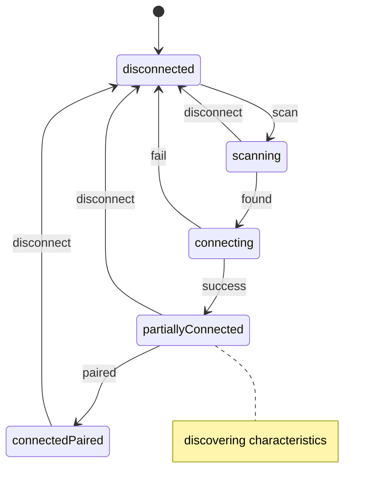
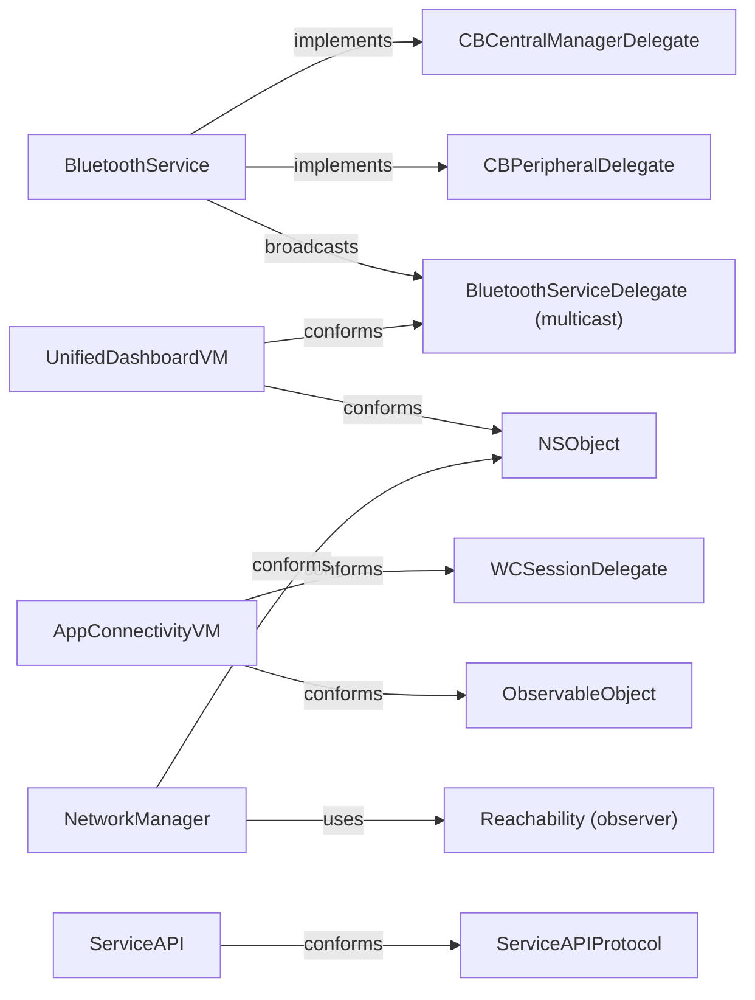

# Low Level Design (LLD) — TVS Connect iOS App

> **Version:** 2.0 | **Last Updated:** June 2, 2026  
> **Template Reference:** TVS Motor Company LLD Template  
> **Purpose:** Enable new engineering vendors to immediately start contributing code.

| Version | Date | Changes |
|---------|------|---------|
| 2.0 | June 2, 2026 | Enhanced with algorithms, concurrency, UI patterns, validation |
| 1.0 | June 2, 2026 | Initial creation |

---

## Table of Contents

- [1. Detailed Module Breakdown](#1-detailed-module-breakdown)
- [2. Class/Service Responsibilities](#2-classservice-responsibilities)
- [3. API Flow Details](#3-api-flow-details)
- [4. Internal Component Interactions](#4-internal-component-interactions)
- [5. Database Schema Usage](#5-database-schema-usage)
- [6. Request/Response Lifecycle](#6-requestresponse-lifecycle)
- [7. Validation Logic](#7-validation-logic)
- [8. Error Handling](#8-error-handling)
- [9. Key Algorithms/Business Rules](#9-key-algorithmsbusiness-rules)
- [10. Configuration Handling](#10-configuration-handling)
- [11. Concurrency Patterns](#11-concurrency-patterns)
- [12. UI Architecture Details](#12-ui-architecture-details)
- [13. Testing Patterns](#13-testing-patterns)
- [14. Code Generation](#14-code-generation)

---

## 1. Detailed Module Breakdown

### 1.1 Module Structure Convention (MVVM)

Every feature module follows this structure:
```
ModuleName/
├── Controller/         # UIViewControllers (*VC suffix)
├── ViewModel/          # Business logic, API calls, state
├── Model/              # Data structures (Codable/Realm)
├── View/               # XIBs, custom UIViews, cells
└── DataSource/         # UITableView/UICollectionView data sources
```

### 1.2 Module Creation Template

**Step-by-step to add a new feature module:**

```swift
// 1. Create folder: Modules/{FeatureName}/Controller/
// 2. Create VC with standard header:

//  FeatureNameVC.swift
//  TVS
//  Created by YourName on DD/MM/YY.
//  Copyright © 2026 TVS Motor Company. All rights reserved.

import UIKit

class FeatureNameVC: UIViewController {
    
    // MARK: - Properties
    private var viewModel = FeatureNameViewModel()
    
    // MARK: - Lifecycle
    override func viewDidLoad() {
        super.viewDidLoad()
        setupUI()
        bindViewModel()
    }
    
    // MARK: - Setup
    private func setupUI() { }
    private func bindViewModel() {
        viewModel.delegate = self
    }
}

// MARK: - FeatureNameViewModelDelegate
extension FeatureNameVC: FeatureNameViewModelDelegate {
    func didUpdateData() {
        // Reload UI
    }
    func didReceiveError(_ message: String) {
        CommonMethods.showToast(message)
    }
}

// 3. Create ViewModel:
protocol FeatureNameViewModelDelegate: AnyObject {
    func didUpdateData()
    func didReceiveError(_ message: String)
}

class FeatureNameViewModel {
    weak var delegate: FeatureNameViewModelDelegate?
    private let api: FeatureNameAPIProtocol
    
    init(api: FeatureNameAPIProtocol = FeatureNameAPI()) {
        self.api = api
    }
}

// 4. Create API protocol + implementation (NewService pattern):
protocol FeatureNameAPIProtocol {
    func fetchData(completion: @escaping (Result<FeatureModel, Error>) -> Void)
}

final class FeatureNameAPI: FeatureNameAPIProtocol {
    func fetchData(completion: @escaping (Result<FeatureModel, Error>) -> Void) {
        let url = NetworkConfiguration.shared.hostURL + "/api/FeatureName/GetData"
        NetworkManager.sharedInstance.requestFor(
            url: url, param: [:], httpMethod: .get, includeHeader: true,
            success: { response in /* parse */ },
            failure: { _ in /* error */ }
        )
    }
}
```

### 1.3 Key Module Details

<details>
<summary><strong>IOT Modules (17 vehicle-specific modules)</strong></summary>

Each IOT module contains:
- **BLEDataParser/** — Parses raw BLE bytes into typed Swift models
- **BLESender/** — Sends commands to vehicle cluster
- **LiveDashboard/** — Real-time telemetry UI during rides
- **Settings/** — Vehicle-specific settings screens
- **AlertHandling/** — Vehicle alerts (low fuel, overspeed, engine temp)

Key pattern: Each parser extends `BaseBLEData` and implements vehicle-specific byte parsing.

```swift
// Pattern for vehicle BLE data
class U399CBLEData: BaseBLEData {
    var speed: Int = 0
    var rpm: Int = 0
    var fuel: Int = 0
    var gear: Int = 0
    var odometer: Double = 0
    var engineTemperature: Int = 0
    // ... vehicle-specific properties
}
```
</details>

<details>
<summary><strong>UnifiedDashboard Module (32 files)</strong></summary>

**Public Interface:**
- `UnifiedDashboardVC` — Main dashboard controller
- `UnifiedDashboardViewModel` — All vehicle type handling

**Delegates:**
```swift
protocol UnifiedDashboardDelegate: NSObject {
    func syncAllRidesU449()
    func syncAllRidesAndTourU368()
    func syncAllRidesAndTourU339C()
    func syncAllRidesAndTourU400()
    func syncAllRidesAndTourN597()
    func didShowOngoingScreen()
    func loadLiveDashboardU399C(bleType: BLEType, isTour: Bool, bleResponse: BleResponse)
    func loadLiveDashboardU368(bleType: BLEType, isTour: Bool)
    func loadLiveDashboardU449(bleType: BLEType)
    func loadLiveDashboardU400(bleType: BLEType, isTour: Bool, bleResponse: BleResponse)
    func loadLiveDashboardN597(bleType: BLEType, isTour: Bool, response: BleResponse)
    func addPauseRideObserver()
    func showToastMessage(message: String)
}

protocol DashboardViewDelegate: NSObject {
    func setupBLEConnectView(isAutoConnect: Bool)
    func setupUI(serviceCall: Bool)
}

protocol DashboardVehicleConnectionDelegate: NSObject {
    func didVehicleConnectSuccessfully(response: BleResponse)
    func peripheralPairedSuccessfully()
    func peripheralDidConnect()
    func peripheralDidDisconnect(response: BleResponse)
    func peripheralCentralManagerStatus(isBleEnabled: Bool)
}
```
</details>

<details>
<summary><strong>NewService Module (Modern Pattern — 12 files)</strong></summary>

```
NewService/
├── Networking/
│   └── ServiceAPI.swift              # Protocol + Implementation
├── Model/
│   ├── ServiceHistoryModel.swift     # Codable response
│   ├── LatestAppointmentModel.swift
│   ├── MaintenanceDueModel.swift
│   └── UpdateAppointmentResponse.swift
├── Utils/
│   └── NewServiceConstants.swift     # Endpoint paths, keys
├── View/
│   ├── NewServiceVC.swift
│   └── Cells/
└── ViewModel/
    └── NewServiceViewModel.swift
```

**This is the reference pattern for all new development.**
</details>

---

## 2. Class/Service Responsibilities

### 2.1 BluetoothService (Stateful — State Machine)



**Properties:**
```swift
class BluetoothService: NSObject {
    // Access Level: Internal (module-wide)
    static let shared: BluetoothService                    // Singleton
    var bleType: BLEType = .N112                           // Current vehicle type
    var baseBLEData: BaseBLEData?                          // Latest parsed data
    var peripheralConnectionStatus: PeripheralStatus       // Connection state
    var settingsConnectionType: ConnectionType!            // Auto/Manual
    var peripheralUUID: String?                            // Last connected UUID (persisted)
    var lastPeripheralName: String?                        // Last connected name (persisted)
    var isAutoConnectRideFlow: Bool                        // Force stop flag
    var speedoDataReceived: Bool                           // Data reception flag
    var isVehicleOFF: Bool                                 // Ignition state
    
    // Private
    private var delegates: MulticastDelegate<BluetoothServiceDelegate>
    private var centralManager: CBCentralManager!
    private var writableCharacteristic: CBCharacteristic?
    private var notifyCharacteristic: CBCharacteristic?
    private var connectedPeripheral: CBPeripheral?
    private var reconnectTimer: Timer?
    private var transferServiceUUID: CBUUID
    private var sendCharacteristicUUID: CBUUID
    private var receiveCharacteristicUUID: CBUUID
}
```

**Thread Safety:** CBCentralManager initialized with `queue: nil` (main thread). All delegate callbacks fire on main thread. Access to `peripheralConnectionStatus` is not explicitly synchronized — always access from main thread.

**Memory:** Uses `MulticastDelegate` with weak wrappers to avoid retain cycles. Delegates are automatically cleaned up when deallocated.

### 2.2 NetworkManager

```swift
class NetworkManager: NSObject {
    // Singleton
    class var sharedInstance: NetworkManager
    
    // Properties
    var sessionManager: Session                // Alamofire session
    var isReachable: Bool                      // Network status
    var isReachableViaWiFi: Bool
    let retryLimit: Int = 3                    // Max retries
    let retryDelay: TimeInterval = 3           // Seconds between retries
    var isRetrying: Bool
    
    // Key Methods
    func requestFor(url: String,
                    param: [String: Any],
                    httpMethod: HTTPMethod,
                    includeHeader: Bool,
                    includeVehicleSpecificUserId: Bool = true,
                    encodingType: ParameterEncoding = URLEncoding.default,
                    success: @escaping ([String: Any]) -> Void,
                    failure: @escaping (Any) -> Void)
    
    func multipartedRequestFor(url: String,
                               imageData: Data,
                               success: @escaping ([String: Any]) -> Void,
                               failure: @escaping (Any) -> Void)
    
    func forceLogoutOutOnTokenExpire()         // Side effect: clears session, navigates to login
    private func configureServerTrustPolicies()
}
```

### 2.3 SelectedBike (Vehicle Resolution Engine)

```swift
class SelectedBike {
    static let shared: SelectedBike
    
    // Core resolution
    func updateCurrentSelectedBike()           // Resolves ICE vs EV bike
    func getCurrentSelectedBike() -> SelectedBikeFeatureList
    func getCurrentHomeDashBoard() -> CommuterHomeDashboard
    func getSelectedBikeShortInfo() -> VehicleShortInfo
    
    // Vehicle type checks (30+ convenience methods)
    func isU399CBike() -> Bool
    func isU400Bike() -> Bool
    func isNtorqBike() -> Bool
    func isRRSeries() -> Bool
    func isRTRSeries() -> Bool
    // ... etc
}

// Feature resolution protocol
protocol SelectedBikeFeatureList {
    var isShareLocationVisible: Bool { get }
    var isNavigationSubscribed: Bool { get }
    var mapProvider: MapProviders { get }
    var isP360Supported: Bool { get }
    var isWirelessSupported: Bool { get }
    var isAccessorySupported: Bool { get }
    var multiStopSupported: Bool { get }
    var isBluetoothConnected: Bool { get }
    // ... feature flags per vehicle
}
```

### 2.4 VehicleFeatureConfigRealmManager

```swift
final class VehicleFeatureConfigRealmManager {
    static let shared: VehicleFeatureConfigRealmManager
    
    func save(_ config: VehicleFeatureConfig)
    func save(_ configs: [VehicleFeatureConfig])
    func getAll() -> [VehicleFeatureConfig]
    func get(byFrameNo: String) -> VehicleFeatureConfig?
    func get(byMapProvider: String) -> [VehicleFeatureConfig]
    func updateMapProvider(frameNo: String, newProvider: String)
    func delete(byFrameNo: String)
    func deleteAll()
}
```

### 2.5 Protocol Conformance Map



---

## 3. API Flow Details

### 3.1 REST API Flow (Detailed)

```swift
// === STEP 1: ViewModel initiates ===
func fetchServiceHistory() {
    let frameNo = DataManager.shared.selectedBike?.frameNo ?? ""
    api.getServiceHistory(frameNo: frameNo) { [weak self] result in
        // [weak self] prevents retain cycle
        switch result {
        case .success(let models):
            self?.serviceHistory = models
            self?.delegate?.didUpdateData()
        case .failure(let error):
            self?.delegate?.didReceiveError(error.localizedDescription)
        }
    }
}

// === STEP 2: ServiceAPI builds request ===
func getServiceHistory(frameNo: String, completion: @escaping (Result<[ServiceHistoryModel], Error>) -> Void) {
    let url = baseURL + NewServiceConstants.getServiceHistoryEndpoint
    let params: [String: Any] = ["frameNo": frameNo]
    
    NetworkManager.sharedInstance.requestFor(
        url: url,
        param: params,
        httpMethod: .get,
        includeHeader: true,
        includeVehicleSpecificUserId: false,
        success: { response in
            // === STEP 3: Response validation ===
            guard response["StatusCode"] as? Int == 200 else {
                let message = response["Message"] as? String ?? "Error"
                completion(.failure(NSError(domain: "", code: 0,
                    userInfo: [NSLocalizedDescriptionKey: message])))
                return
            }
            // === STEP 4: Parse with JSONDecoder ===
            guard let dataArray = response["Data"] as? [[String: Any]] else {
                completion(.success([]))
                return
            }
            do {
                let jsonData = try JSONSerialization.data(withJSONObject: dataArray)
                let models = try JSONDecoder().decode([ServiceHistoryModel].self, from: jsonData)
                completion(.success(models))
            } catch {
                completion(.failure(error))
            }
        },
        failure: { _ in
            completion(.failure(NSError(domain: "", code: 0,
                userInfo: [NSLocalizedDescriptionKey: "Network error"])))
        }
    )
}

// === STEP 5: NetworkManager injects headers ===
// Headers added when includeHeader == true:
// "accesstoken": RealmService.getUser()?.accessToken
// "userId": RealmService.getUser()?.userId
// "ICEUserId": RealmService.getUser()?.iceUserId
// "Content-Type": "application/json"
```

### 3.2 GraphQL Flow (Apollo)

```swift
// Schema: TVS/schema.graphqls (9600+ lines)
// Config: TVS/apollo-codegen-config.json
// Queries: TVS/CODPSchema/ and TVS_EV/U546/GraphQL/

// Typical query execution:
let apollo = ApolloClient(url: graphqlEndpoint)
apollo.fetch(query: GetVehicleTelemetryQuery(vehicleId: id)) { result in
    switch result {
    case .success(let graphQLResult):
        if let data = graphQLResult.data?.vehicleTelemetry {
            // Use typed data
        }
    case .failure(let error):
        // Handle error
    }
}

// WebSocket subscription:
apollo.subscribe(subscription: VehicleStatusSubscription(vehicleId: id)) { result in
    // Real-time updates
}
```

### 3.3 MQTT Flow

```swift
// Topic: {organizationId}/{vehicleId}
// QoS: 1 (at least once)
// Library: CocoaMQTT

MQTTServiceData.shared.mqttService.subscribe(topic: topic)
// Message received via delegate:
func mqtt(_ mqtt: CocoaMQTT, didReceiveMessage message: CocoaMQTTMessage, id: UInt16) {
    guard let payload = message.string else { return }
    // Parse JSON payload → Update vehicle state
}
```

---

## 4. Internal Component Interactions

### 4.1 MulticastDelegate Pattern

```swift
// Implementation (BluetoothService uses this for event broadcasting)
class MulticastDelegate<T> {
    private var delegates: [WeakWrapper] = []
    
    func add(delegate: T) {
        let wrapper = WeakWrapper(value: delegate as AnyObject)
        delegates.append(wrapper)
    }
    
    func remove(delegate: T) {
        delegates = delegates.filter { $0.value !== (delegate as AnyObject) }
    }
    
    func invoke(_ invocation: (T) -> Void) {
        // Clean up nil references
        delegates = delegates.filter { $0.value != nil }
        delegates.forEach { wrapper in
            if let delegate = wrapper.value as? T {
                invocation(delegate)
            }
        }
    }
}

private class WeakWrapper {
    weak var value: AnyObject?
    init(value: AnyObject) { self.value = value }
}

// Usage:
BluetoothService.shared.add(delegate: self)  // In viewDidLoad
BluetoothService.shared.remove(delegate: self) // In deinit
```

### 4.2 NotificationCenter Inventory

| Notification Name | Posted By | Payload | Purpose |
|-------------------|-----------|---------|---------|
| `.didUserLogout` | LogoutService | nil | Clear all states on logout |
| `.didSwitchVehicle` | RealmService | nil | Vehicle changed in garage |
| `.IncomingCall` | PhoneCallObserver | nil | Send call info to cluster |
| `.DisconnectedCall` | PhoneCallObserver | nil | Clear call data on cluster |
| `.MissedCall` | PhoneCallObserver | nil | Send missed call count |
| `.LowFuelAlert` | LowFuelService | nil | Trigger low fuel UI |
| `.nearestFuelLocation` | LowFuelService | nil | Navigate to nearest pump |
| `.IgnitionOff` | BLEObserverService | nil | End ride trigger |
| `.EndRide` | Multiple | nil | Force end ride |
| `.PauseRide` | Multiple | nil | Pause ride recording |
| `.dismissNavigation` | LiveDashboard VCs | `["clearWaypoints": Bool]` | End navigation |
| `.closeVoiceAssist` | Alert handling | nil | Dismiss voice overlay |
| `.ResetSelectedIndex` | Vehicle settings | nil | Reset garage selection |
| `.otaUpdateCompleted` | OTA module | nil | Firmware update done |
| `.resumeNavigation` | Navigation | nil | Resume paused nav |
| `.stopAllVoiceAssistActivities` | LogoutService | nil | Cleanup voice assist |
| `BikeListChange` | BikeService | nil | Vehicle list updated |

### 4.3 Dependency Injection Patterns

```swift
// Pattern 1: Default parameter injection (primary pattern for newer code)
class NewServiceViewModel {
    private let api: ServiceAPIProtocol
    init(api: ServiceAPIProtocol = ServiceAPI()) {
        self.api = api
    }
}

// Pattern 2: Swinject container (used in some modules)
let container = Container()
container.register(ServiceAPIProtocol.self) { _ in ServiceAPI() }
let vm = container.resolve(ServiceAPIProtocol.self)!

// Pattern 3: Singleton access (legacy pattern, most common)
NetworkManager.sharedInstance.requestFor(...)
BluetoothService.shared.connectBLE(...)
DataManager.shared.isLoggedIn
```

---

## 5. Database Schema Usage

### 5.1 Core Realm Objects

```swift
// User authentication
class User: Object {
    @Persisted var userId: Int = 0           // Primary identifier
    @Persisted var accessToken: String = ""  // JWT for API auth
    @Persisted var name: String = ""
    @Persisted var mobileNumber: String = ""
    @Persisted var iceUserId: String = ""
}

// Vehicle registration
class VehicleInfo: Object {
    @Persisted(primaryKey: true) var userVehicleId: Int = 0
    @Persisted var vehicleTypeId: Int = 0    // Maps to BLEType
    @Persisted var frameNo: String = ""      // VIN/Chassis
    @Persisted var registrationNo: String = ""
    @Persisted var vehicleName: String = ""
    @Persisted var theme: Int = 0            // Vehicle variant
    @Persisted var brandDesc: String = ""
    @Persisted var nickName: String = ""
}

// Ride statistics (vehicle-specific)
class U399CRideStatisticsRM: Object {
    @Persisted(primaryKey: true) var rideId: String = ""
    @Persisted var distance: Double = 0
    @Persisted var duration: Double = 0
    @Persisted var avgSpeed: Double = 0
    @Persisted var maxSpeed: Double = 0
    @Persisted var startTime: Date = Date()
    @Persisted var endTime: Date = Date()
    @Persisted var isSynced: Bool = false
}

// Feature configuration (per vehicle)
class VehicleFeatureConfig: Object {
    @Persisted(primaryKey: true) var frameNo: String = ""
    @Persisted var featureConfig: FeatureConfig?
}

class FeatureConfig: EmbeddedObject {
    @Persisted var mapProvider: String = ""
}
```

### 5.2 Schema Migration Strategy

```swift
// Migration.swift — incremental migration blocks
migrationBlock: { migration, oldSchemaVersion in
    if oldSchemaVersion < 7 {
        // Update compound primary key for AssetsModel
        migration.enumerateObjects(ofType: "AssetsModel") { old, new in
            new!["compoundKey"] = "\(old!["vehicleTypeId"])_\(new?["theme"] ?? 0)_\(new?["resolution"] ?? "")"
        }
    }
    if oldSchemaVersion < 14 {
        // Add auto-increment IDs to VoiceActionsInfo
        var nextID = 0
        migration.enumerateObjects(ofType: "VoiceActionsInfo") { _, new in
            new!["voiceActionId"] = nextID
            nextID += 1
        }
    }
    if oldSchemaVersion < 27 {
        // Add redirection URL to NotificationModel
        migration.enumerateObjects(ofType: "NotificationModel") { _, new in
            new?["redirectionURL"] = ""
        }
    }
    // ... incremental per version
}
```

**Rule:** Always increment `schemaVersion` in AppDelegate when ANY Realm object property changes.

### 5.3 Realm Threading Rules

```swift
// ✅ CORRECT: Access Realm on same thread
DispatchQueue.main.async {
    let realm = try! Realm()
    let vehicles = realm.objects(VehicleInfo.self)
    // Use vehicles on main thread only
}

// ❌ WRONG: Passing Realm object across threads
let vehicle = realm.objects(VehicleInfo.self).first!
DispatchQueue.global().async {
    print(vehicle.name) // CRASH: accessed from wrong thread
}

// ✅ CORRECT: Use ThreadSafeReference for cross-thread access
let ref = ThreadSafeReference(to: vehicle)
DispatchQueue.global().async {
    let realm = try! Realm()
    guard let vehicle = realm.resolve(ref) else { return }
    // Safe to use
}
```

---

## 6. Request/Response Lifecycle

### 6.1 Complete HTTP Pipeline

```
ViewModel.method()
    │
    ├──① URL Construction:
    │     baseURL = NetworkConfiguration.shared.hostURL  (environment-specific)
    │     endpoint = NewServiceConstants.endpointPath
    │     fullURL = baseURL + endpoint
    │
    ├──② Parameter Building:
    │     params: [String: Any] dictionary
    │     Encoding: URLEncoding.default (GET) or JSONEncoding.default (POST)
    │
    ├──③ Header Injection (when includeHeader: true):
    │     "accesstoken": User.accessToken from Realm
    │     "userId": String(User.userId)
    │     "ICEUserId": User.iceUserId
    │     "EVUserId": EVUser.userId (if EV)
    │     "Content-Type": "application/json"
    │
    ├──④ Reachability Check:
    │     if !NetworkManager.sharedInstance.isReachable → failure immediately
    │
    ├──⑤ Alamofire Execution:
    │     AF.request(url, method:, parameters:, encoding:, headers:)
    │     .validate()
    │     .responseJSON { response in ... }
    │
    ├──⑥ Response Handling:
    │     HTTP 200 → Parse JSON → success callback
    │     HTTP 401 → forceLogoutOutOnTokenExpire()
    │     HTTP 4xx/5xx → failure callback
    │     Network error → Retry (3x, 3s interval) → failure
    │
    └──⑦ ViewModel Processing:
          Parse [String: Any] → Validate StatusCode → Decode model → Update state
```

### 6.2 Response Status Code Matrix

| Code | Meaning | App Behavior |
|------|---------|--------------|
| 200 | Success | Parse `Data` field, call success |
| 401 | Unauthorized | Token expired → force logout |
| 400 | Bad Request | Show error message from `Message` field |
| 404 | Not Found | Show empty state |
| 500 | Server Error | Show generic error, log to analytics |
| 0 (timeout) | Network timeout | Retry up to 3x |

### 6.3 JSON Parsing Strategies

```swift
// LEGACY pattern (SwiftyJSON) — still in 60%+ of codebase
let json = JSON(response)
let name = json["Data"]["name"].stringValue
let id = json["Data"]["id"].intValue

// MODERN pattern (Codable) — used in NewService and newer modules
struct ServiceHistoryModel: Codable {
    let serviceDate: String?
    let serviceType: String?
    let dealerName: String?
    let odometer: Int?
}

let jsonData = try JSONSerialization.data(withJSONObject: response["Data"])
let models = try JSONDecoder().decode([ServiceHistoryModel].self, from: jsonData)
```

---

## 7. Validation Logic

### 7.1 Input Validation Rules

| Field | Rule | Location |
|-------|------|----------|
| Mobile Number | Exactly 10 digits, numeric only | LoginVC |
| OTP | Exactly 6 digits, numeric only | VerifyOTPVC |
| Frame Number | Non-empty, ≥10 chars, alphanumeric | Vehicle onboarding |
| Registration Number | Non-empty, format: XX00XX0000 | Vehicle onboarding |
| Nickname | 1-20 characters | Profile/Vehicle settings |
| Speed Limit | 10-200 km/h (integer) | Vehicle settings |
| Geofence Radius | 100-5000 meters | Geofence setup |

### 7.2 BLE Data Validation

```swift
// Frame validity tracking (U368 example)
var isU368ValidFrame: [Int] = [0, 0]  // [consecutiveValid, consecutiveInvalid]

// Packet validation per vehicle type
func validatePacket(_ data: Data, bleType: BLEType) -> Bool {
    guard !data.isEmpty else { return false }
    switch bleType {
    case .U399C: return data.count >= 20
    case .N251:  return data.count >= 16
    case .U449:  return data.count >= 18
    default:     return data.count > 0
    }
}
```

### 7.3 API Response Validation

```swift
// Standard validation pattern
guard response["StatusCode"] as? Int == 200 else {
    let message = response["Message"] as? String ?? "Something went wrong"
    completion(.failure(NSError(domain: "", code: 0,
        userInfo: [NSLocalizedDescriptionKey: message])))
    return
}

guard let data = response["Data"] else {
    completion(.success(nil))  // Empty data is valid for some endpoints
    return
}
```

---

## 8. Error Handling

### 8.1 Error Taxonomy

| Category | Examples | Recovery |
|----------|----------|----------|
| **Network** | Timeout, no internet, DNS failure | Retry 3x, show offline state |
| **Auth** | 401, token expired, forced logout | Refresh token → re-login |
| **BLE** | Disconnect, pair failure, timeout | Auto-reconnect timer (8s) |
| **Realm** | Migration failure, write conflict | Increment schema, retry write |
| **Validation** | Invalid input, missing fields | Show inline error message |
| **Business** | Ride conditions not met, vehicle offline | Show toast with reason |

### 8.2 Error Propagation Patterns

```swift
// MODERN: Result<T, Error> (NewService pattern)
func fetchData(completion: @escaping (Result<Model, Error>) -> Void) {
    // Success: completion(.success(model))
    // Failure: completion(.failure(error))
}

// LEGACY: (Bool, [String: Any]?) callback
func fetchData(success: @escaping ([String: Any]) -> Void,
               failure: @escaping (Any) -> Void) {
    // Success: success(responseDict)
    // Failure: failure(error)
}

// DELEGATE: BluetoothServiceDelegate callbacks
func peripheralDidDisconnect(response: BleResponse) {
    // response.error, response.errorCode, response.errorMessage
}
```

### 8.3 Retry Policy

```swift
// NetworkManager retry configuration
let retryLimit = 3
let retryDelay: TimeInterval = 3  // seconds

// BLE reconnect
let kAutoConnectWait: Double = 120  // seconds max wait
// Reconnect attempt after 8 seconds on disconnect
DispatchQueue.main.asyncAfter(deadline: .now() + 8) {
    self.reconnectToPeripheral()
}
```

---

## 9. Key Algorithms/Business Rules

### 9.1 Vehicle Type Resolution

```swift
// Algorithm: vehicleTypeId → BLEType → Vehicle Capabilities
// Input: Int from backend (userVehicle.vehicleTypeId)
// Output: BLEType enum case → determines all vehicle behavior

let bleType = BLEType(rawValue: vehicleTypeId) ?? .none

// BLEType determines:
// 1. BLE Service/Characteristic UUIDs (AppKeys.getBLEKeys)
// 2. Data parser class (U399CBLEDataParser, N251BLEDataParse, etc.)
// 3. Data sender class (U399CBLESender, etc.)
// 4. Dashboard UI variant
// 5. Feature availability (navigation, voice assist, TPMS, etc.)
// 6. Ride recording behavior
// 7. Alert types supported
```

### 9.2 SelectedBike Resolution Algorithm

```swift
// Determines ICE vs EV and resolves feature set
func updateCurrentSelectedBike() {
    if CommonMethods.isiQubeSeries() {
        // EV vehicle path
        let vehicleShortInfo = VehicleShortInfo(
            evBleType: EVBLEType(rawValue: vehicleTypeId) ?? .none,
            ...
        )
        currentSelectedBike = EVSelectedBike(shortVehicleInfo: vehicleShortInfo)
    } else {
        // ICE vehicle path
        let vehicleShortInfo = VehicleShortInfo(
            iceBleType: BLEType(rawValue: vehicleTypeId) ?? .none,
            ...
        )
        currentSelectedBike = ICESelectedBike(shortVehicleInfo: vehicleShortInfo)
    }
    // Notify all listeners
    TVSNotification.postNotificationForVehicleSwitch()
}
```

### 9.3 Auto-Connect Logic

```swift
// State machine for BLE auto-connect:
// 1. App launch → check settingsConnectionType
// 2. If .Automatic AND peripheralUUID exists:
//    → scanForPeripherals()
//    → If found within kAutoConnectWait (120s) → connect
//    → If not found → stop scanning
// 3. On disconnect during ride:
//    → Wait 8 seconds → reconnectToPeripheral()
//    → If isAutoConnectRideFlow == false → don't reconnect
// 4. On force stop ride:
//    → Set isAutoConnectRideFlow = false
//    → Don't auto-connect until next manual connect or app restart
```

### 9.4 Map Provider Selection

```swift
// Resolution order:
// 1. Check VehicleFeatureConfig (from backend, per vehicle)
// 2. Check country (India → Mappls preferred, others → Google)
// 3. Check SelectedBike.mapProvider (protocol property)
// 4. Fallback to Google Maps

// CommuterHomeDashboard resolves per BLE type:
var mapProvider: MapProviders {
    // Resolved from VehicleFeatureConfigRealmManager
    // Falls back to country-based default
}
```

---

## 10. Configuration Handling

### 10.1 Info.plist Key Inventory

| Key | Value | Purpose |
|-----|-------|---------|
| `UIBackgroundModes` | audio, bluetooth-central, fetch, location, remote-notification | Background capabilities |
| `NSBluetoothAlwaysUsageDescription` | "..." | BLE permission prompt |
| `NSLocationAlwaysAndWhenInUseUsageDescription` | "..." | Location permission |
| `NSMicrophoneUsageDescription` | "..." | Voice assist |
| `NSMotionUsageDescription` | "..." | Crash detection, lean angle |
| `NSCameraUsageDescription` | "..." | Profile photo, ride sharing |
| `NSContactsUsageDescription` | "..." | Emergency contacts |
| `NSSpeechRecognitionUsageDescription` | "..." | Voice assist |
| `NSSiriUsageDescription` | "..." | Siri voice commands |
| `NSSupportsLiveActivities` | true | Ride status Live Activity |
| `UIUserInterfaceStyle` | Light | Force light mode |
| `CFBundleURLTypes` | [tvsconnect, Google, Facebook, Garmin] | Deep link schemes |
| `BGTaskSchedulerPermittedIdentifiers` | BluArmor task | Background task |
| `NSLocalNetworkUsageDescription` | "..." | Wi-Fi vehicle connectivity |

### 10.2 Entitlements

```xml
<!-- TVS.entitlements / TVSDebug.entitlements -->
aps-environment: development/production     <!-- Push notifications -->
com.apple.security.application-groups:
  - group.com.tvsm.tvsconnect              <!-- Shared data (Watch, Widget) -->
keychain-access-groups:
  - $(AppIdentifierPrefix)com.connect.sharing  <!-- Shared credentials -->
```

### 10.3 Environment Resolution

```swift
// Compile-time (AppDelegate.settingEnvironment())
#if DEV_DEBUG || DEV_RELEASE
    // Development: dev-tvsconnectapi.tvsmotor.net
    NetworkConfiguration.shared.buildEnvironment = .development(hostUrl: "...")
    EVNetworkConfiguration.shared.buildEnvironment = .development(hostUrl: "...")
#elseif DEBUG || RELEASE
    // UAT: uat-tvsconnectapi.tvsmotor.net
    NetworkConfiguration.shared.buildEnvironment = .uatEnv(hostUrl: "...")
    EVNetworkConfiguration.shared.buildEnvironment = .uatEnv(hostUrl: "...")
#else
    // Production (App Store)
    NetworkConfiguration.shared.buildEnvironment = .production
    EVNetworkConfiguration.shared.buildEnvironment = .production
#endif
```

---

## 11. Concurrency Patterns

### 11.1 RepeatingTimer (Safe DispatchSourceTimer)

```swift
// Used for: BLE cyclic data sending, ride duration, auto-connect timeout
class RepeatingTimer {
    let timeInterval: TimeInterval
    private lazy var timer: DispatchSourceTimer = {
        let t = DispatchSource.makeTimerSource()
        t.schedule(deadline: .now() + timeInterval, repeating: timeInterval)
        t.setEventHandler { [weak self] in self?.eventHandler?() }
        return t
    }()
    var eventHandler: (() -> Void)?
    private var state: State = .suspended  // Prevents double-resume crash
    
    func resume()   // Safe: checks state before resuming
    func suspend()  // Safe: checks state before suspending
    
    deinit {
        timer.setEventHandler { }
        timer.cancel()
        resume()  // Must resume before cancel (Apple requirement)
    }
}
```

### 11.2 Common GCD Patterns

```swift
// UI updates from background
DispatchQueue.main.async { [weak self] in
    self?.tableView.reloadData()
}

// Delayed execution (BLE reconnect)
DispatchQueue.main.asyncAfter(deadline: .now() + 8) { [weak self] in
    self?.reconnectToPeripheral()
}

// Background processing
DispatchQueue.global(qos: .userInitiated).async {
    // Parse BLE data
    let parsed = parser.parse(data)
    DispatchQueue.main.async {
        // Update UI
    }
}
```

### 11.3 Timer Management

```swift
// Ride duration timer
var durationTimer: Timer?
durationTimer = Timer.scheduledTimer(withTimeInterval: 1.0, repeats: true) { [weak self] _ in
    self?.updateRideDuration()
}

// Cleanup in deinit or viewWillDisappear
durationTimer?.invalidate()
durationTimer = nil

// Auto-connect timer
var autoConnectTimer: Timer?
autoConnectTimer = Timer.scheduledTimer(withTimeInterval: kAutoConnectWait, repeats: false) { [weak self] _ in
    self?.stopScanning()
}
```

---

## 12. UI Architecture Details

### 12.1 UI Technology Decisions

| Scenario | Technology | Reason |
|----------|-----------|--------|
| Feature screens | Storyboard + XIB | Visual layout, existing patterns |
| Complex cells | XIB | Reusable across screens |
| Simple views | Programmatic | Avoid merge conflicts |
| New SwiftUI screens | SwiftUI | Modern declarative UI |
| Watch app | SwiftUI | Required for watchOS |

### 12.2 Navigation Pattern

```swift
// Direct push/present (no coordinator pattern)
// From VC:
let vc = UIStoryboard(name: "Dashboard", bundle: nil)
    .instantiateViewController(withIdentifier: "FeatureVC") as! FeatureVC
vc.viewModel = FeatureViewModel()
navigationController?.pushViewController(vc, animated: true)

// From SideMenu:
SideMenuManager.default.leftMenuNavigationController?.dismiss(animated: true) {
    // Navigate to target
}

// Deep linking (from push notification):
AppDelegate.notificationHandler = { data in
    // Route to specific screen based on payload
}
```

### 12.3 Auto Layout Patterns

```swift
// Cartography (pod) — used in some views
constrain(view, superview) { view, superview in
    view.edges == superview.edges
}

// NSLayoutConstraint anchors (most common)
view.translatesAutoresizingMaskIntoConstraints = false
NSLayoutConstraint.activate([
    view.topAnchor.constraint(equalTo: superview.topAnchor, constant: 16),
    view.leadingAnchor.constraint(equalTo: superview.leadingAnchor, constant: 16),
    view.trailingAnchor.constraint(equalTo: superview.trailingAnchor, constant: -16)
])
```

---

## 13. Testing Patterns

### 13.1 Test Structure

```
TVSTests/
├── Apache/
│   └── LiveDashboard/
│       └── ApacheOnGoingRideViewModelTests.swift
├── Service/
│   └── (Service-specific tests)
└── ...
```

### 13.2 Mockable Protocol Pattern

```swift
// Production code (testable via protocol)
protocol ServiceAPIProtocol {
    func getServiceHistory(frameNo: String, completion: @escaping (Result<[ServiceHistoryModel], Error>) -> Void)
}

// Test mock
class MockServiceAPI: ServiceAPIProtocol {
    var mockResult: Result<[ServiceHistoryModel], Error> = .success([])
    
    func getServiceHistory(frameNo: String, completion: @escaping (Result<[ServiceHistoryModel], Error>) -> Void) {
        completion(mockResult)
    }
}

// Test usage
func testFetchServiceHistory() {
    let mockAPI = MockServiceAPI()
    mockAPI.mockResult = .success([ServiceHistoryModel(...)])
    let viewModel = NewServiceViewModel(api: mockAPI)
    
    viewModel.fetchServiceHistory()
    
    XCTAssertEqual(viewModel.serviceHistory.count, 1)
}
```

---

## 14. Code Generation

### 14.1 Apollo GraphQL

```bash
# Config: TVS/apollo-codegen-config.json
# Schema: TVS/schema.graphqls
# Queries: .graphql files in CODPSchema/ and TVS_EV/

# Generate typed Swift code from GraphQL:
./apollo-ios-cli generate
# Output: Type-safe query/mutation/subscription classes
```

### 14.2 Protobuf

```bash
# .proto files define BLE message formats
# protoc generates Swift structs
# Used for: BLE data serialization/deserialization
# Pod: Protobuf (Google)
```

---

## Quick Fix Recipes

| Problem | Solution |
|---------|----------|
| Realm migration crash | Increment `schemaVersion` in AppDelegate, add migration block |
| BLE not connecting | Check `BLEType` UUIDs in `AppKeys`, verify `setupBLECharecteristics` |
| API 401 errors | Token expired — check token refresh flow, `forceLogoutOutOnTokenExpire` |
| Watch not receiving data | Verify `WCSession.isReachable`, use `transferUserInfo` over `sendMessage` |
| Vehicle features missing | Check `VehicleFeatureConfigRealmManager.get(byFrameNo:)` |
| Storyboard merge conflicts | Prefer XIBs, resolve storyboard XML carefully |
| Pod install fails | `rm -rf Pods Podfile.lock && pod install` |

---

## Cross-References

| Topic | Document |
|-------|----------|
| System architecture overview | [HLD.md](./HLD.md) |
| Module inventory & data flows | [HLC.md](./HLC.md) |
| API endpoints & payloads | [API_SPEC.md](./API_SPEC.md) |
| Setup & build instructions | [README.md](./README.md) |

---

> **Note:** This document excludes secrets, API keys, production URLs, and proprietary BLE byte-level protocol details.


---

## Document Ownership

| Role | Person / Team | Contact |
|------|---------------|---------|
| **Project Manager** | Smaranika Tripathy | smaranika.tripathy@tvsmotor.com |
| **Product Owner** | ISSM Team / Malavika | malavika@tvsmotor.com |
| **Owner** | Sumit Prajapat | sumit.prajapat@tvsmotor.com |
