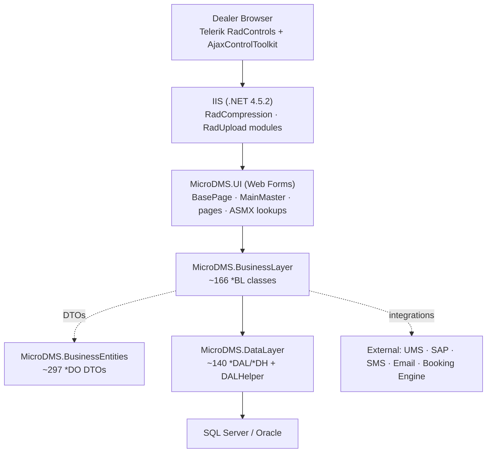
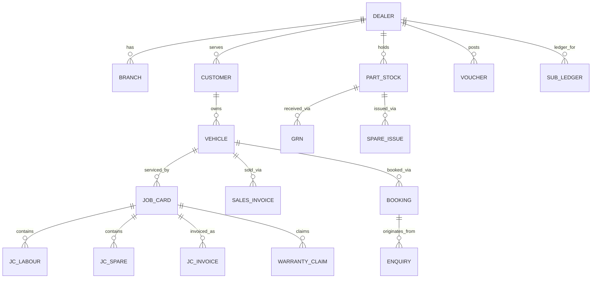
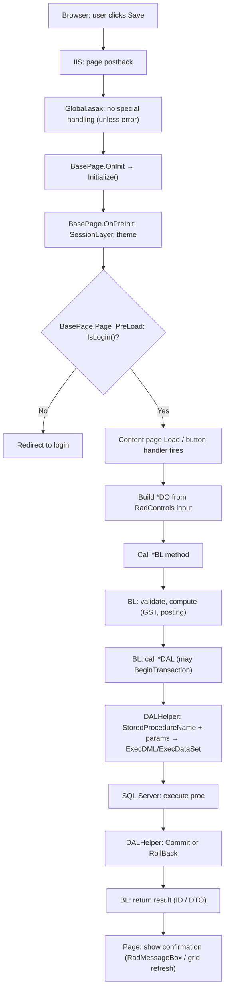
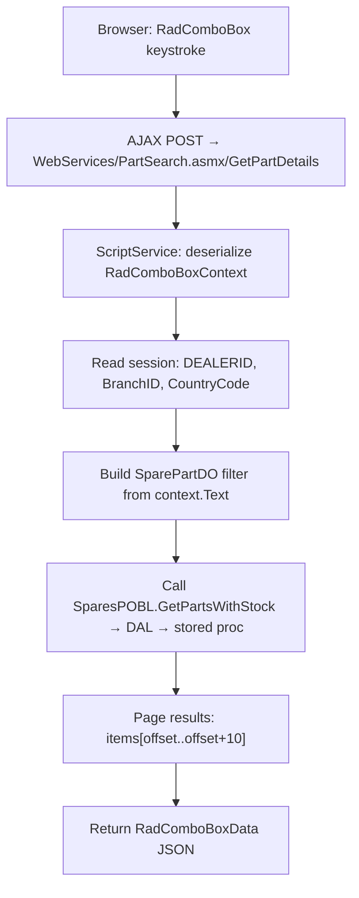
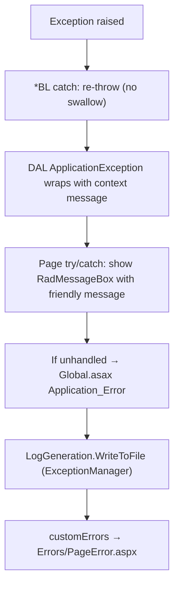

# MicroDMS.Web (DMS Domestic Web) — Low Level Design (LLD)

> Authored against the [TVS LLD Template](https://tvsmotorcompany.atlassian.net/wiki/spaces/DE2/pages/4209606912/Low+Level+Design+Template).
> Scope: **MicroDMS.Web** (assembly `MicroDMS.UI`) — the ASP.NET Web Forms UI and its referenced class libraries.
> Audience: New engineering vendors onboarding to DMS Domestic Web. This document focuses on *implementation detail* — how the layers are wired, what each class does, how a request flows end to end, and where the business rules live.
> Secrets, connection strings, tokens and credentials are deliberately excluded (referenced by key name only).

---

## Table of Contents

1. [Detailed Module Breakdown](#1-detailed-module-breakdown)
2. [Class / Service Responsibilities](#2-class--service-responsibilities)
3. [API Flow Details (ASMX)](#3-api-flow-details-asmx)
4. [Internal Component Interactions](#4-internal-component-interactions)
5. [Database Schema Usage](#5-database-schema-usage)
6. [Request / Response Lifecycle](#6-request--response-lifecycle)
7. [Validation Logic](#7-validation-logic)
8. [Error Handling](#8-error-handling)
9. [Key Algorithms / Business Rules](#9-key-algorithms--business-rules)
10. [Configuration Handling](#10-configuration-handling)

---

## 1. Detailed Module Breakdown

### Layering



### UI modules (folders in `MicroDMS.Web`)

| Folder | Domain | Key screens |
|---|---|---|
| `Sales/` | Vehicle sales | Enquiry, Quotation, Booking, Sales Invoice, Vehicle Return, Stock Transfer |
| `Parts/` | Spare parts | GRN (TVS/AD/APS/Other Vendor), Direct Invoice, Issue, Purchase Return, Physical Inventory |
| `Service/` (via `Controls/`) | After-sales | Job Card (New, Search), Service Appointment, Warranty Claim, FSC Claim, AMC |
| `Accounts/` | Finance | Receipt Voucher, Payment Voucher, Journal Voucher, HP Voucher, Ledger, Tally Extract |
| `Masters/` | Master data | Customer, Vehicle, Employee, Dealer/Branch, RTO, Tax, Vendor, Area, Bank, Rack |
| `WebAdmin/` | Administration | Change Password, Permissions, Mobile JC APK |
| `DashBoard/` · `Reports/` | Reporting | Telerik ReportViewer dashboards |
| `DataMigration/` | Bulk import | Excel-based master/stock uploads |
| `DealerTvsManage/` | TVS-side ops | Dealer management by TVS HO |
| `Webhook/` · `SMShelper/` | Integration | Inbound webhooks, SMS dispatch helpers |
| `WebServices/` | AJAX | ASMX endpoints for RadComboBox type-ahead lookups |
| `Controls/` | Reusable UI | `.ascx` user controls (search, grid, receipt, claim panels) |

### Supporting libraries

| Project | Classes | Role |
|---|---|---|
| `MicroDMS.BusinessLayer` | ~166 `*BL`/`*Fun` | Business rules, GST, posting, orchestration |
| `MicroDMS.BusinessEntities` | ~297 `*DO` | DTO contract between layers |
| `MicroDMS.DataLayer` | ~140 `*DAL`/`*DH` + `DALHelper` | ADO.NET stored-procedure execution + DTO mapping |
| `MicroDMS.EntityObjects` | typed entities | Entity definitions |
| `MicroDMS.CacheLibrary` | cache helpers | Master/lookup in-process caching |
| `MicroDMS.ConfigHelper` | `SessionLayer`, `ApplicationLayer`, `ConfigSettings` | Typed session + config accessors |
| `MicroDMS.ExceptionManager` | `LogGeneration` | Centralized file/event logging (Enterprise Library) |
| `MicroDMS.Utilities` | helpers | Date, string, file, validation helpers |
| `MicroDMS.RadMessageBox` (VB) | UI helper | Telerik alert/confirm wrapper |

---

## 2. Class / Service Responsibilities

### Presentation layer — core classes

| Class | Responsibility |
|---|---|
| `BasePage` | Base class for **all** Web Forms pages. `OnInit` → `Initialize()` wires culture + event handlers; `OnPreInit` initializes `SessionLayer` and applies the user's theme. `Page_PreLoad` calls `IsLogin()` — if session is not authenticated, redirects to `ConfigSettings.LoginPage`. Exposes `UserSession` (SessionLayer), `AppLayer` (ApplicationLayer), `AppConfigLayer` (ConfigSettings). |
| `BasePageAdmin` | Variant of `BasePage` for TVS admin pages (different login check). |
| `BaseUserControl` | Base for `.ascx` user controls — gives access to session/config. |
| `MainMaster.master` | UI shell (menu, header, footer, RadScriptManager, content placeholder). |
| `ProjectConstants` | Static constants (string/int defaults, UI messages, button/label names, redirect URLs, country codes). `DataBindingUtilities` class (helper to fill `DropDownList`/`RadComboBox`/`CheckBoxList`/`RadioButtonList` uniformly). `EnumToList` (generic enum → `List<EnumToList>` converter). |
| `UMSDMSLogin.aspx.cs` | UMS sign-in entry. `Page_Load`: acquires access key via RestSharp POST to `{UMS_token_auth}/UMSIntegration/UMSUserGetToken` with client credentials; stores in session. `btnNewLogin_Click`: redirects browser to UMS auth URL. `btnOldLogin_Click`: redirects to legacy `Login.aspx`. |
| `Login.aspx.cs` | Legacy session login (username/password against DB). |
| `Global.asax(.cs)` | `Application_Error`: logs via `LogGeneration.WriteToFile`; `Session_End`: logs session end with UserID. |

### Business layer — patterns

Every `*BL` class wraps a domain use case:

```csharp
public class JobCardBL
{
    public Int64 SaveJobCard(JobCardDO _JobCard)
    {
        try { return JobCardDAL.SaveJobCard(_JobCard); }
        catch (Exception ex) { throw ex; }
    }
    // ... ModifyJobCard, SaveJobCardEstimation, etc.
}
```

Pattern: receive a `*DO`, optionally apply validation/computation, delegate to `*DAL`, return a result (ID/list/DataSet). Multi-step orchestration (e.g. `SalesVehicleInvoiceBL`) may call multiple DALs inside a shared transaction handle.

### Data layer — DALHelper

`DALHelper` is the central data-access engine (implements `IDisposable`):

| Member | Behaviour |
|---|---|
| Constructor | Picks connection string by `SQLConnectionType` (`SqlOnlineDMS` → `DMSConnection`, `SqlOraclePortal` → `OracleSQLPortal`). Creates `SqlConnection` + `SqlCommand` (timeout = 40000). |
| `StoredProcedureName` | Sets `CommandText` + `CommandType = StoredProcedure`; clears params. |
| `AddParameterToSQLCommand` | Typed `SqlParameter` add (name, type, value, direction). |
| `ExecDataSet()` / `ExecDataTable()` | Open → `SqlDataAdapter.Fill` → Close → return. |
| `ExecDML()` | Open → `ExecuteNonQuery` → Close → return affected rows. |
| `ExecScalar()` | Open → `ExecuteScalar` → Close. |
| `RetrieveDataIntoCollection<T>` | Open → `ExecuteReader` → for each row, create `T` via `Activator.CreateInstance`, reflect-map columns to properties by name (case-insensitive, DBNull → null) → return `List<T>`. |
| `ReturnSingleDataObject<T>` | Same as above but returns a single `T` (first row). |
| `BeginTransaction()` | Opens + begins a **Serializable** transaction. |
| `Commit()` / `RollBack()` | Commits/rolls back, then closes. |
| `ExecDataSetPagewise` | Like `ExecDataSet` but reads `@totalRows` output param for paging. |

Supporting helpers: `DeadLockRetryHelper` (retry up to 3× on SQL error 1205 with back-off), `OracleHelper` (Oracle equivalent), `DataRecordExtensions.HasColumn` (column-existence check on `IDataReader`).

### ASMX services — pattern

`WebServices/*.asmx` (`[ScriptService]`, `[WebMethod(EnableSession=true)]`):

1. Read dealer context from `HttpContext.Current.Session` (DEALERID, BranchID, CountryCode, etc.).
2. Build a `*DO` filter from the `RadComboBoxContext.Text` input.
3. Call a `*BL` method → `*DAL` → stored proc.
4. Page the result (10 items per chunk) and return a `RadComboBoxData` (items + message + `EndOfItems` flag).

---

## 3. API Flow Details (ASMX)

The Web Forms tier exposes **ASMX ScriptService** endpoints — not REST APIs — consumed by Telerik RadComboBox controls via AJAX (JSON over HTTP POST).

### Endpoint list

| Service | Method(s) | Domain |
|---|---|---|
| `CustomerSearch.asmx` | `GetCustomerName` | Customer type-ahead |
| `PartSearch.asmx` | `GetPartDetailsWithLocation`, `GetPartDetailsNew`, `GetPartDetails`, `GetPOPartDetails`, `GetPartDetailsWithLocationForTVSParts` | Spare-part lookup |
| `PartrSearch.asmx` | `GetSparesList` | Parts list for PO |
| `LabourSearch.asmx` | `GetLabourCodes` | Labour code type-ahead |
| `ComplaintSearch.asmx` | `GetComplaintGroup` | Complaint group lookup |
| `FrameNoCheck.asmx` | (check frame validity) | Frame number validation |
| `FramenoAvailability.asmx` | `FrameNoAvailCheck` | Frame availability |
| `JobCarddetails.asmx` | `IndJobCardDetails` | Job card data for external consumers |
| `GetCustVehByVehInvDate.asmx` | `CustomerVehDataByVehicleInvoiceDate` | Vehicle data by invoice date |
| `GetCustVehByVehModifyDate.asmx` | `CustomerVehDataByVehicleModifyDate` | Vehicle data by modify date |

### Request/response contract

- **Request:** HTTP POST to `/<service>.asmx/<method>` with JSON body (or query params for some). `RadComboBoxContext` carries `Text` (search term) and `NumberOfItems` (offset for paging).
- **Response:** JSON-serialized `RadComboBoxData` `{ Items: [{Text, Value}...], Message: "Items 1-10 out of 45", EndOfItems: false }`.
- **Auth:** session-based (`EnableSession = true`); unauthenticated calls will get no session context and return empty results.

---

## 4. Internal Component Interactions

```mermaid
sequenceDiagram
    autonumber
    participant B as Browser (RadControls)
    participant IIS as IIS / MicroDMS.UI
    participant BP as BasePage
    participant PG as Content Page
    participant ASMX as WebService .asmx
    participant BL as *BL (BusinessLayer)
    participant DAL as *DAL / DALHelper
    participant DB as SQL Server
    participant EXT as External (UMS/SAP/SMS)

    B->>IIS: HTTPS postback or AJAX (.asmx)
    IIS->>BP: page lifecycle starts (OnInit → Initialize)
    BP->>BP: check session (IsLogin); redirect if not auth
    BP->>PG: page event fires (Load / button click)
    PG->>BL: build *DO DTO, call *BL method
    BL->>DAL: call *DAL (optionally in transaction)
    DAL->>DB: StoredProcedureName + typed params → ExecuteReader/NonQuery
    DB-->>DAL: rows / affected count
    DAL-->>BL: List<T> / single T (reflection-mapped)
    BL-->>PG: result DTO
    PG-->>B: RadGrid/RadComboBox data-bound; RadMessageBox confirmation

    Note over B,ASMX: AJAX lookup path
    B->>ASMX: RadComboBox keystroke → POST .asmx/method
    ASMX->>BL: build *DO from session + context.Text
    BL->>DAL: call *DAL
    DAL->>DB: stored proc
    DB-->>DAL: rows
    DAL-->>BL: List<*DO>
    BL-->>ASMX: paged result
    ASMX-->>B: RadComboBoxData JSON

    Note over BL,EXT: Integration side-leg
    BL->>EXT: RestSharp/SOAP/SMTP (UMS token, SAP link, SMS, Email)
```

---

## 5. Database Schema Usage

### Access model

- **All** SQL execution goes through `DALHelper` (or the `DataAccessLayer` abstraction in some flows).
- Only **stored procedures** are used for DML; column names in result sets match `*DO` property names (reflection mapping).
- Connection selection via `SQLConnectionType` enum: `SqlOnlineDMS` (primary), `SqlOraclePortal` (Oracle reads).
- Transactions: `DALHelper.BeginTransaction()` → Serializable isolation → `Commit()`/`RollBack()`.
- Command timeout: **40000** (≈11 hours — effectively no timeout).
- Complex writes pass XML payloads built by `*DH` helpers (e.g. `JobCardDH` builds XML for `pr_Save_JobCard`).

### Logical entity groups



### Stored-proc conventions

- Prefix: `Pr_` or `pr_` (e.g. `Pr_Get_BanksMaster`, `pr_Save_ASCWarranty`).
- Params: `@UPPER_SNAKE` (e.g. `@DEALER_ID`, `@BRANCH_ID`, `@FRAME_NO`).
- Output params: `@RESULT` (status), `@totalRows` (paging).
- XML params: `@IN_*_DATA` for bulk/complex inserts.

---

## 6. Request / Response Lifecycle

### Page postback (write)



### ASMX lookup (read)



---

## 7. Validation Logic

Validation happens at **two levels**:

### Presentation-level (page / control)

- Telerik validators (`RadInputManager`, `RequiredFieldValidator`, `RegularExpressionValidator`) on controls.
- Client-side JavaScript validation in `js/` scripts.
- `ProjectConstants` messages used for `RadMessageBox` alerts (e.g. `msgSelectFreameNo`, `msgPlzSelectCustomer`, `msgBestPriceZero`).

### Business-layer-level

- Guard checks in `*BL` before DAL calls (e.g. empty-frame check in `JobCardBL`, duplicate-line check, warranty eligibility based on `WarrantyValidDays`/`FSCValidDays` settings).
- Tax-related: `TaxProcessor`/`GSTTaxProcessor` validates tax group applicability.
- Accounting: `*AccountPosting` validates GL codes, amounts, and period before posting.
- Country-code gating: `ProjectConstants.sCountryCodeIN`/`sCountryCode3W`/etc. drives feature flags per country.

### Data-layer-level

- Stored procedures enforce constraints (FK, unique, check) and return status codes (`@RESULT`) read by DAL.
- `DeadLockRetryHelper` transparently retries on error 1205 (deadlock victim).

---

## 8. Error Handling



- **Pattern:** `*BL` and `*DAL` catch and re-throw (sometimes wrapping in `ApplicationException` with a context message). Pages catch at the handler level, log, and show a `RadMessageBox` alert.
- **Unhandled path:** `Global.asax` `Application_Error` catches everything missed; logs via `ExceptionManager` (`LogGeneration.WriteToFile`); `customErrors mode="Off"` (dev) or redirects to `~/Errors/PageError.aspx` (prod).
- **Session end:** `Session_End` logs UserID + timestamp via `LogGeneration.WriteToFile`.
- **Logging destination:** flat file under `LogFiles/` folder; Enterprise Library categories (`Tracing`, `Fatal`, `Audit`).
- **Transaction rollback:** any exception inside a `DALHelper` transaction triggers `RollBack()` (in the `finally`/`catch` of the calling BL).

---

## 9. Key Algorithms / Business Rules

| Rule area | Implementation | Location |
|---|---|---|
| **GST computation** | `TaxProcessor` / `GSTTaxProcessor` with strategy helpers (`TaxGroupFinder`, `TaxMapFinder`, `TaxCodeHolder`, `TaxProcedureHolder`, `GSTTaxGroupFinder`, `GSTTaxMapFinder`, `GSTTaxCodeHolder`, `GSTTaxProcedureHolder`) | `MicroDMS.BusinessLayer` |
| **Central Tax (TCS)** | `CentralTaxProcessor` — applies TCS rates (`TCSWithPAN` / `TCSWithoutPAN` from config) after `TCSDate` | `MicroDMS.BusinessLayer` |
| **Accounting document posting** | `SaleInvoiceAccountPosting`, `ServiceInvoiceAccountPosting`, `SparesInvoiceAccountPosting`, `RegistrationInvoiceAccountPosting` → `DocumentPoster` → `PostManagerDAL` | `MicroDMS.BusinessLayer` / `DataLayer` |
| **Spare price pickup** | `SparesPricePickupBL` (implements `ISparePricePickupManager`) → `SparePricePickUpManagerDAL`/`DH` — selects NDP/MRP/dealer price based on `SparePricePickup` session flag | BL + DAL |
| **Warranty eligibility** | `WarrantyValidDays` (-90) / `FSCValidDays` (-490) from config; BL checks JC date vs sale date + valid-day window | `ASCWarrantyClaimBL`, `FSCClaimBL` |
| **Issue-mode determination** | Based on warranty coverage, KM range, job type, model category — determines Free/Paid/PostWarranty for each spare/labour line | `JobCardBL` + inline rules in page code |
| **Number to words** | `DataBindingUtilities.NumberToWords(int)` — Indian-style (million / thousand / hundred) | `ProjectConstants.cs` |
| **Deadlock retry** | `DeadLockRetryHelper`: retry ≤3× on SQL error 1205, incremental back-off, file-logged | `MicroDMS.DataLayer` |
| **Enum to list** | `EnumToList.ConvertEnumToList<T>()` — generic, for binding enums to dropdowns | `ProjectConstants.cs` |

---

## 10. Configuration Handling

### Mechanism

- All runtime config is in `Web.config` (`appSettings` + `connectionStrings`), with per-environment overrides via `Web.Debug.config` / `Web.Release.config` (XDT transforms).
- `ConfigSettings` (in `MicroDMS.ConfigHelper`) provides **strongly-typed static properties** — one per `appSettings` key (e.g. `ConfigSettings.LoginPage`, `ConfigSettings.DealerHomePage`, `ConfigSettings.JobCardPage`).
- `SessionLayer` wraps `HttpContext.Current.Session` with typed properties (`DEALERID`, `DEALERNAME`, `BranchID`, `CountryCode`, `LoginStatus`, `ThemeName`, `UMS_USER_ID`, etc.).
- `ApplicationLayer` wraps `Application`-scope values.

### Key config categories (key names only — values redacted)

| Category | Keys (examples) |
|---|---|
| Session state | `sessionState mode="InProc" timeout="90"` |
| Auth / UMS | `UMS_token_auth`, `UMS_Auth_Base_URL`, `UMS_AppId`, `ums_callback_URL`, `ClientID_UMS`, `ClientSecret_UMS`, `UMS_logout` |
| Database | `DMSConnection`, `DMSConnReport`, `DMSSecConnReport`, `OracleConnection`, `FSCOTPConnection`, `CENTRALPORTALCONN`, etc. |
| Email (SendGrid) | `SMTPUserID`, `SMTPPwd`, `SMTPPort`, `SMTPHost`, `EmailFrom` |
| SMS | `isAirtelOTP`, `AirtelSms.*`, `InfobipBaseURL`, `Infobip_API_KEY`, `IsInfobip` |
| Booking Engine | `BEDMSClientID`, `BEDMSClientSecret`, `BEScope`, `BookingEngineApiBaseUrl` |
| SAP portals | `SAPConn`, `DealerLedgerLink`, `PartPackingLink`, `OnlineWarrantyApprLink`, etc. |
| Tax / business | `TCSWithPAN`, `TCSWithoutPAN`, `GSTVehicleTaxPerc`, `WarrantyValidDays`, `FSCValidDays`, `AMCAmount` |
| Page routing | `LoginURL`, `DealerHomePage`, `JobCardPage`, `BookingPage`, `SearchJobCardPage`, many `*.aspx` keys |
| File paths | `OnlineImagePath`, `NewsFileUploadPath`, `ExcelUploadPath`, `WarrantyImages`, `PQFImage*` |

### Security note

The live `Web.config` contains **real secrets** (DB passwords, SendGrid key, SMS auth tokens, UMS client secret, `APIKEY`). These must be:
- **Encrypted** per environment with `aspnet_regiis -pe connectionStrings` / `aspnet_regiis -pe appSettings`.
- **Never committed** to source control.
- Migrated to Azure Key Vault or a secret manager as a modernization step.

---

_Source: MICRO_DMS / MicroDMS / MicroDMS.Web (MicroDMS.UI) and referenced libraries. Secrets redacted; class/file counts approximate._
