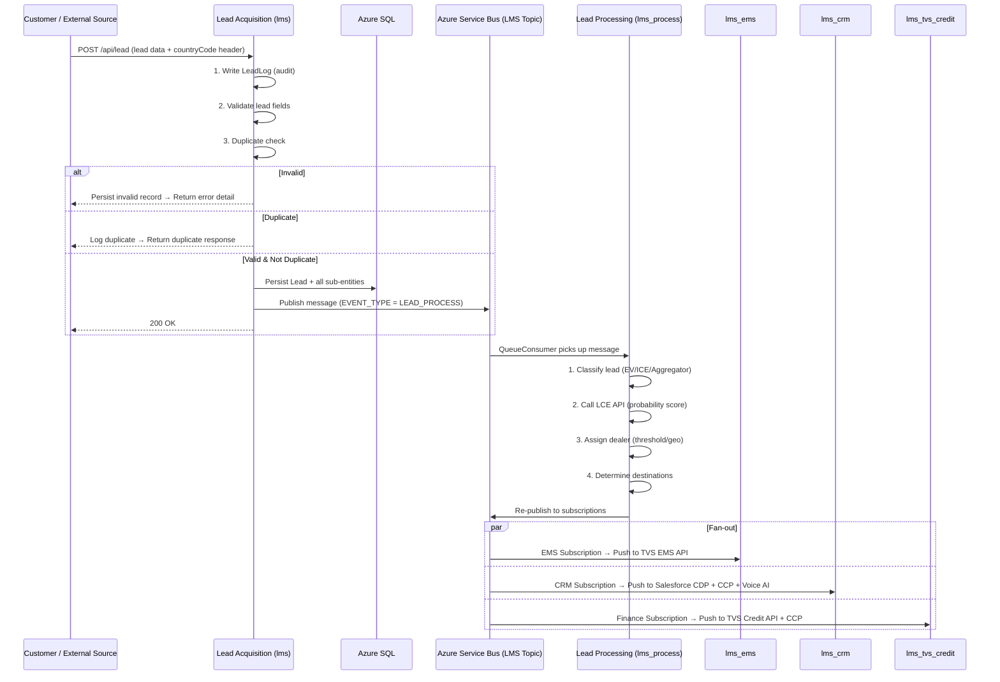
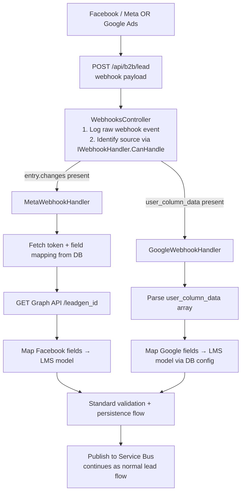
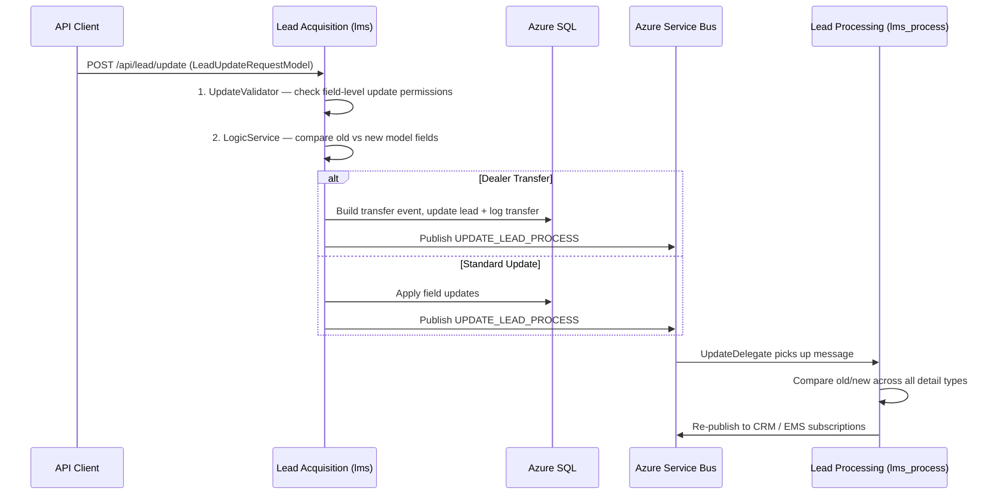
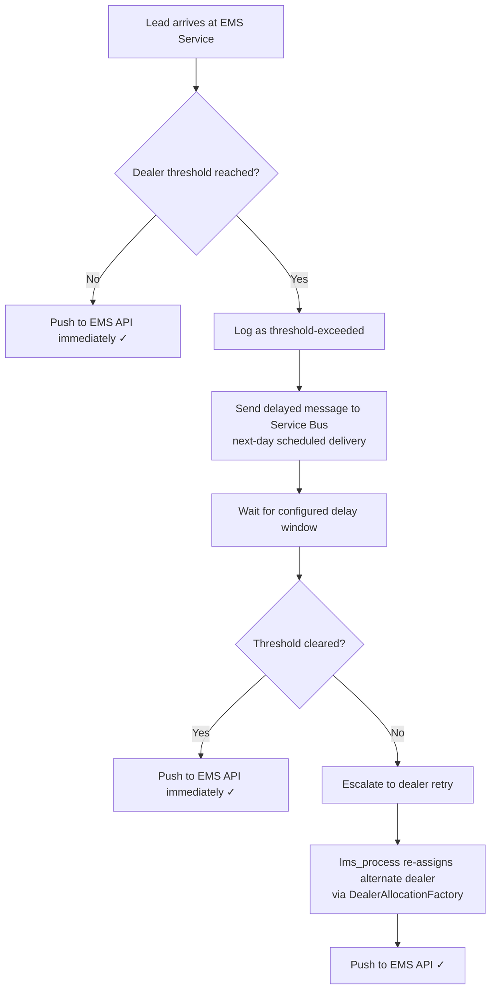
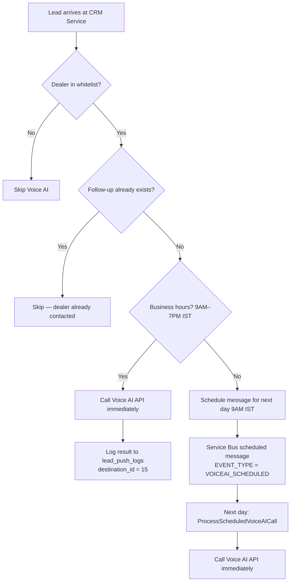
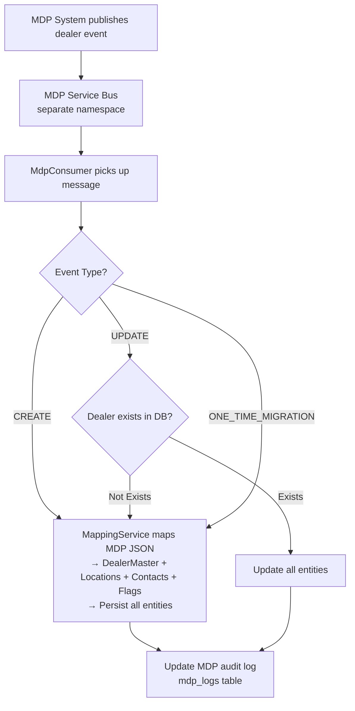
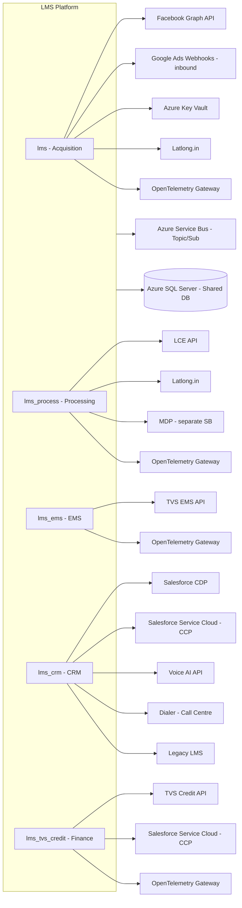
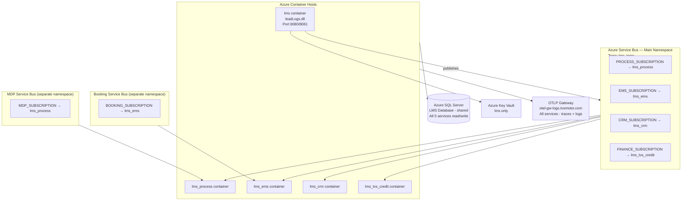
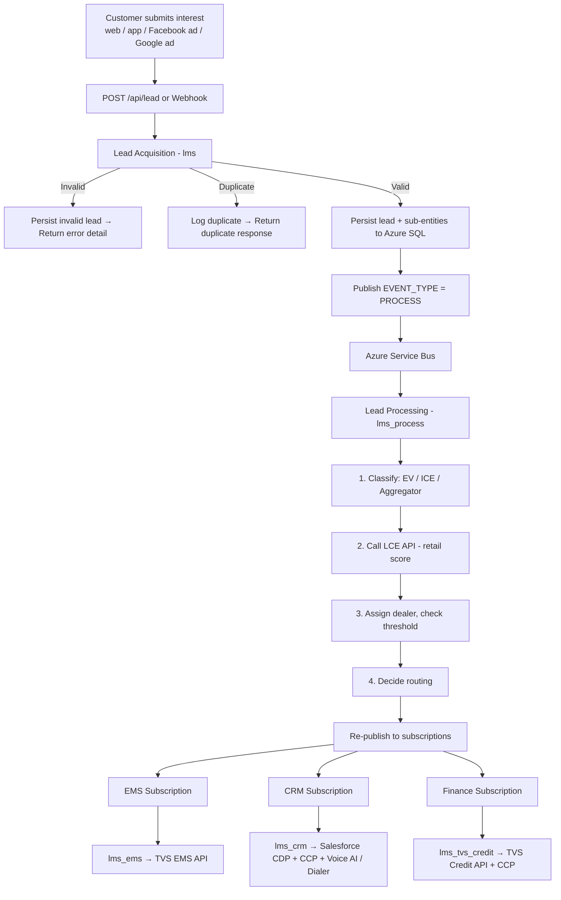

# TVSM Lead Service (LS) — High Level Code Document (HLC)

**Document Version:** 2.0  
**Date:** July 2026  
**Audience:** Technical Developers · Business Stakeholders · Integration Partners

---

## Table of Contents

1. [Application Overview](#1-application-overview)
2. [Major Modules & Components](#2-major-modules--components)
3. [Folder Structure Explanation](#3-folder-structure-explanation)
4. [Core Business Workflows](#4-core-business-workflows)
5. [Key Services & Classes](#5-key-services--classes)
6. [External Integrations](#6-external-integrations)
7. [Major Dependencies](#7-major-dependencies)
8. [Runtime Architecture](#8-runtime-architecture)
9. [Important Entry Points](#9-important-entry-points)
10. [High-Level Data Flow](#10-high-level-data-flow)
11. [Glossary](#glossary)

---

## 1. Application Overview

The **TVS Motor Lead Management System (LMS)** , also known as **Lead Service** is a cloud-native platform that manages the complete lifecycle of two-wheeler sales leads — from the moment a potential customer expresses interest, all the way through dealer assignment, processing, CRM registration, finance eligibility, and marketing engagement.

**In plain terms:** When a customer fills out a form online (on the TVS website, a third-party auto portal, a Facebook ad, or a Google Ads lead form), this platform receives that lead, validates it, assigns it to the right dealer, and simultaneously sends it to multiple downstream systems — the dealer's management software (EMS), Salesforce CRM, the TVS Credit finance team, Voice AI calling, and communication engines — all within seconds.

### Key Characteristics

| Attribute | Detail |
|---|---|
| **Architecture Style** | Cloud-native microservices |
| **Technology Stack** | .NET 8 / ASP.NET Core Web API |
| **Deployment** | Docker containers on Azure |
| **Database** | Azure SQL Server (shared across all services) |
| **Messaging** | Azure Service Bus (topic/subscription pub-sub model) |
| **CI/CD** | Azure DevOps Pipelines |
| **Observability** | OpenTelemetry (traces + logs → TVS OTLP gateway) — enabled across all services |

### The Platform at a Glance

The system is split into **five independent microservices**, each with a dedicated responsibility:

| Service | Repository | Role |
|---|---|---|
| Lead Acquisition | `lms` | Receives, validates, and stores all incoming leads (including Google and Meta webhooks) |
| Lead Processing | `lms_process` | Applies business rules, scores leads, manages dealer master data (MDP), routes to destinations |
| EMS Integration | `lms_ems` | Pushes leads to the dealer's EMS (Extended Marketing Suite) |
| CRM Integration | `lms_crm` | Pushes leads to Salesforce (CDP + Service Cloud), Voice AI, Dialer, and Rezo |
| Finance Integration | `lms_tvs_credit` | Pushes finance-eligible leads to TVS Credit and Salesforce |

---

## 2. Major Modules & Components

### 2.1 Lead Acquisition Service (`lms`)

This is the **front door of the platform**. It exposes public-facing HTTP APIs and handles both Facebook and Google Webhooks. Every lead that enters the system passes through this service first.

**Key modules within this service:**

- **Lead Receipt** — Accepts HTTP POST requests for new leads from web, app, and aggregator sources
- **Lead Validation** — Checks mobile numbers, brand/model combinations, dealer codes, pincodes, dates, and business rules
- **Duplicate Detection** — Identifies leads from the same mobile number for the same dealer within a configurable window
- **Lead Update** — Handles updates to existing leads (stage progression, dealer transfer, field edits)
- **Webhook Handlers (Strategy Pattern)** — A pluggable handler architecture supporting multiple ad platforms:
  - `MetaWebhookHandler` — Handles Facebook/Meta Lead Ads webhook events, fetches data from Graph API, and maps fields using DB-stored configuration
  - `GoogleWebhookHandler` — Handles Google Ads lead form webhook events, parses `user_column_data` payload, and maps to LMS lead model
- **Dealer Allocation (Latlong)** — Geo-based dealer discovery using the Latlong.in API with a factory pattern:
  - `DealerAllocationFactory` — Selects allocation strategy by brand rank
  - `EvDealerAllocationService` — Distance-limited allocation for EV brands (within 15km)
  - `GeneralDealerAllocationService` — Index-based allocation for ICE brands
- **Communications** — Triggers SMS and email events for lead lifecycle notifications
- **Dealer Lookup** — Criteria-based dealer discovery (MDP)
- **One-View** — Provides a full event timeline for any individual lead
- **Master Data Management** — CRUD APIs for configuring brands, models/parts, lead sources, lead flow configurations, and event configurators via an admin portal
- **Service Bus Publisher** — Dispatches validated leads as messages to the Azure Service Bus topic for downstream processing

---

### 2.2 Lead Processing Service (`lms_process`)

This service is the **central brain** that decides what happens to a lead after it is received. It runs entirely in the background and is never called directly by external clients.

**Key modules:**

- **Queue Consumer** — Listens to the Service Bus for new lead messages (PROCESS subscription)
- **MDP Consumer** — Listens on a separate Service Bus for Master Data Platform dealer create/update events
- **Lead Routing** — Inspects the event type (new lead, update, retry) and routes accordingly
- **LCE Integration** — Calls the external Lead Classification Engine (LCE) API to determine the retail probability score of a lead
- **Dealer Allocation (Latlong)** — Same factory-based strategy pattern as Lead Acquisition:
  - `LatlongService` — Resolves brand-specific OAuth2 credentials and queries the Latlong.in dealer API
  - `DealerAllocationFactory` → `EvDealerAllocationService` / `GeneralDealerAllocationService`
- **MDP Service (Master Data Platform)** — Processes dealer master data events:
  - `MdpDealerService` — Creates, updates, or migrates dealer records from MDP payloads
  - `MappingService` — Maps MDP JSON structures to DealerMaster, DealerLocation, DealerContact, and DealerFlag entities (including flags for ThreeWheeler, TVSX, iQube, Ronin, RR310, RTR310, U400, BikeDekho, BikeWale, 91Wheels, Amazon, Flipkart)
- **Threshold Management** — Enforces daily lead caps per dealer
- **Lead Classification** — Tags leads as EV, ICE, or Aggregator for correct downstream routing
- **Update Delegate** — Compares old vs new lead states across all detail types (brand, invoice, follow-up, test ride, referral, finance, enquiry tags, extra attributes) and persists event differences for the lead timeline
- **Dispatch** — Re-publishes enriched leads to the appropriate Service Bus subscriptions (EMS, CRM, Finance, Comms)
- **Three-Wheeler Interface** — `IThreeWheelerService` defined for future three-wheeler lead processing (implementation planned)

---

### 2.3 EMS Integration Service (`lms_ems`)

This service pushes leads to the **EMS (Extended Marketing Suite)** — the dealer-facing system that TVS Motor dealers use to manage leads from their end.

**Key modules:**

- **EMS Listener** — Subscribes to the Service Bus EMS subscription
- **EMS Routing** — Determines the correct EMS API endpoint and request format based on lead source type
- **Source-type Handling** — Builds four distinct request formats: Head Office leads, Aggregator leads, EV leads, EV Test Ride leads
- **Threshold & Retry** — Holds back leads when a dealer's daily quota is full; re-dispatches when capacity is available
- **Booking Listener** — A completely separate subscription for booking lifecycle events (pre-booked → booked → invoiced)
- **Booking Service** — Updates lead status based on booking stage

---

### 2.4 CRM Integration Service (`lms_crm`)

This service handles all Salesforce integrations, Voice AI outbound calling, and additional CRM-adjacent push destinations.

**Key modules:**

- **CRM Listener** — Subscribes to the Service Bus CRM subscription
- **Salesforce CDP** — Pushes lead data to the Salesforce Customer Data Platform for unified customer 360 profiles
- **Salesforce Service Cloud (CCP)** — Creates and updates Lead records in Salesforce Service Cloud; also upserts Test Ride records
- **Voice AI Integration (NEW)** — Automated outbound voice calling for lead qualification:
  - `VoiceAIService` — Calls customers via a Voice AI API with business-hours awareness (9AM–7PM IST)
  - After-hours leads are scheduled via Service Bus delayed messages for next-day 9:XX AM delivery
  - Dealer whitelist filtering ensures only specific dealers' leads are voice-called
  - Follow-up check prevents duplicate calls when dealer has already contacted the customer
  - Retry logic with exponential backoff (3 attempts) for transient failures
- **Rezo Integration** — Distributes premium-brand leads to the Rezo partner platform
- **Dialer Integration** — Sends leads to the call centre dialer system with token-based authentication
- **Legacy LMS Bridge** — `LeadExchangeService` posts lead data to the legacy LMS system for backward compatibility

---

### 2.5 TVS Credit Integration Service (`lms_tvs_credit`)

This service handles **finance lead distribution** to the TVS Credit partner and secondary CRM flows.

**Key modules:**

- **Credit Listener** — Subscribes to the Service Bus Finance subscription
- **TVS Credit Push** — Maps dealer, city, and state codes to TVS Credit's internal identifiers and submits leads to their API
- **Salesforce CCP Push** — Pushes EV leads from this service to Salesforce Service Cloud (mirrors the `lms_crm` CCP flow for finance context)
- **Code Mapping** — Maintains lookup tables that translate LMS dealer IDs and geography codes into TVS Credit-specific codes

---

## 3. Folder Structure Explanation

Each repository follows the same layered pattern, making it easy to navigate across services.

```
<service_name>/
├── Controllers/          → HTTP endpoints (minimal — mostly health checks except in lms)
├── Services/             → Business logic — the "what should we do" layer
├── Repository/           → Database access — the "how do we read/write data" layer
├── Entities/             → EF Core database entity classes (map directly to DB tables)
├── Models/               → DTOs — data shapes used for API requests, responses, and messaging
├── AutoMappings/         → AutoMapper profiles — defines how entities convert to/from DTOs
├── ExchangeService/      → HTTP client wrappers for calling external APIs
├── Extensions/           → Dependency Injection registration (MvcExtensions.cs)
├── ListenerService/      → Azure Service Bus consumer classes (for processing services)
├── Latlong/              → Dealer geo-allocation services (factory + strategy pattern)
├── LMSContext/           → Entity Framework Core DbContext (database session manager)
├── Const/                → Constants and the AppSettingsService (typed config wrapper)
├── Startup.cs/Program.cs → Application bootstrap and service wiring
└── appsettings.json      → Non-sensitive configuration (secrets via environment variables)
```

The `lms` repository additionally contains:
- `lms.config/` — A shared class library with all core entities, models, and the central `LMSDbContext`. Referenced directly by both `lms` and `lms_process`.
- `LMSUnitTest/` — Comprehensive xUnit test suite covering all major services.

The `lms_process` repository additionally contains:
- `LeadQualification/` — Lead Classification Engine (LCE) integration service
- `MdpService/` — Master Data Platform dealer data management (create/update/migrate dealer records)


---

## 4. Core Business Workflows

### 4.1 New Lead Submission

This is the most critical path in the platform. It starts when a customer submits their interest.



---

### 4.2 Webhook Lead Flow (Facebook and Google)

TVS Motor runs ad campaigns on both Facebook and Google with built-in lead forms. When someone fills out an ad form, the ad platform sends a webhook notification. The system uses a **strategy pattern** to route payloads to the correct handler.



---

### 4.3 Lead Update Flow

Leads can be updated as they progress through the sales cycle (e.g., stage change, dealer transfer, test ride booked).



---

### 4.4 Booking Lifecycle Flow

When a customer progresses from lead to booking to invoice, a separate booking event stream handles these status transitions.

```
Lead Received → EMS Pushed → Pre-Booked → Booked → Invoiced
```

The `lms_ems` BookingListenerService consumes these events from a dedicated booking topic on Azure Service Bus (separate connection string) and updates the lead status in the database accordingly.

---

### 4.5 Dealer Threshold & Retry Flow

To prevent any single dealer from being overwhelmed with leads, the platform enforces daily lead caps.



---

### 4.6 Voice AI Outbound Call Flow

When a lead qualifies for automated voice follow-up, the CRM service routes it through the Voice AI integration.


                                                              │
                                                              ↓
                                                     Call Voice AI API immediately
```

---

### 4.7 MDP Dealer Master Data Flow

The Master Data Platform (MDP) sends dealer create/update events via a separate Service Bus, which the Process Lead Service consumes to keep dealer records current.



---

## 5. Key Services & Classes

### 5.1 Lead Acquisition Service — Core Services

| Service | Business Role | What It Does |
|---|---|---|
| `LeadLogService` | Lead Submission Coordinator | The master orchestrator for new lead submissions — calls validation, duplicate check, persistence, and dispatch in the correct sequence |
| `LeadValidator` | Lead Quality Gatekeeper | Comprehensive rule engine — checks every field of an incoming lead against business rules and master data |
| `LeadDelegate` | Lead Intake Handler | Creates the initial audit record the moment a lead arrives; resolves the brand, source, and lead flow configuration |
| `ProcessValidLeadService` | Lead Persistence Writer | Writes a validated lead and all related records (brand details, test rides, follow-ups, extra attributes) to the database |
| `LeadDispatchService` | Downstream Message Publisher | Sends a message to the Azure Service Bus topic to trigger downstream processing; runs as a singleton for connection efficiency |
| `UpdateLeadService` | Lead Update Handler | Handles the update path — applies changes to existing leads and triggers downstream update events |
| `WebhookService` | Webhook Shared Logic | Common logic for webhook processing — token management, Graph API calls, field mapping, and lead URL construction |
| `MetaWebhookHandler` | Facebook Lead Connector | Strategy handler for Meta/Facebook webhooks — fetches data from Graph API, maps fields, handles token exchange |
| `GoogleWebhookHandler` | Google Ads Lead Connector | Strategy handler for Google Ads webhooks — parses `user_column_data` payload and maps to LMS model |
| `TokenService` | Token Lifecycle Manager | Handles Facebook/Meta access token refresh, expiry detection, and debug validation |
| `LatlongService` | Dealer Geo-Finder | Calls Latlong.in API with per-brand OAuth2 credentials to discover the nearest dealer for a given pincode |
| `DealerAllocationFactory` | Allocation Strategy Selector | Returns `EvDealerAllocationService` (EV, distance-limited) or `GeneralDealerAllocationService` (ICE, index-based) |
| `LogicService` | Field Update Rule Engine | A reflection-based comparison engine that determines which fields are allowed to be updated per the lead flow configuration |
| `AppSettingsService` | Configuration Provider | A singleton wrapper that provides strongly typed access to all environment variables and configuration values |
| `MasterService` | Master Data Manager | Orchestrates create/update/get operations for brands, models, lead sources, lead flow configurations, and event configurators — used by the admin portal |

---

### 5.2 Lead Processing Service — Core Services

| Service | Business Role | What It Does |
|---|---|---|
| `LeadService` | Processing Traffic Controller | Routes incoming Service Bus messages to the correct handler based on event type (new lead, update, or retry) |
| `TwoWheelerService` | 2-Wheeler Lead Processor | The core processing logic for two-wheeler leads — calls the LCE API, calculates retail probability, determines which downstream systems should receive the lead |
| `LeadDelegate` *(process)* | Processing Context Builder | Loads the lead flow configuration, calls LCE for classification, evaluates LCE threshold for EMS eligibility, and optionally allocates dealer via Latlong |
| `LeadClassifyService` | Lead Category Classifier | Classifies every lead into a category (EV, ICE, Aggregator) to determine the correct EMS format and routing rules |
| `UpdateDelegate` | Lead Change Tracker | Compares old vs new lead states across all detail types (brand, invoice, follow-up, test ride, referral, finance, enquiry tags, extra attributes) and persists granular event differences to the timeline |
| `MdpDealerService` | Dealer Master Data Manager | Processes MDP dealer events (create/update/migrate) — persists dealer records with locations, contacts, and 20+ feature flags |
| `MappingService` | MDP Data Mapper | Transforms raw MDP JSON payloads into EF Core entities (DealerMaster, DealerLocation, DealerContact, DealerFlag) |
| `LatlongService` | Geo-Dealer Resolver | Resolves brand-specific OAuth2 credentials (Ronin/RTR/Common/3W/EV), fetches token, queries the Latlong dealer discovery API |
| `DealerAllocationFactory` | Dealer Assignment Selector | Factory pattern that selects the appropriate dealer assignment strategy (EV-specific or general) |
| `ThresholdService` | Dealer Quota Manager | Checks and updates the per-dealer daily lead counter; blocks leads when the cap is reached |
| `DispatchService` | Routed Message Publisher | Re-publishes enriched and routed leads to the correct Service Bus subscriptions; supports next-day scheduled dispatch |

---

### 5.3 EMS Integration Service — Core Services

| Service | Business Role | What It Does |
|---|---|---|
| `EmsRoutingService` | EMS Flow Decision Maker | The entry point from the listener; decides between a normal EMS push or a repush (retry) flow |
| `EmsService` | Dealer System Lead Sender | Builds the correct EMS request model based on lead source type and calls the EMS API |
| `EmsDelegate` | EMS Pre-processor | Loads lead flow config and dealer threshold state before processing begins |
| `RepushService` | Lead Retry Handler | Handles leads that need to be retried after threshold delay |
| `BookingService` | Booking Status Updater | Receives booking lifecycle events and updates the lead's booking status in the database |
| `DispatchService` | Message Publisher | Supports 4 dispatch modes: immediate, 30-min delay, next-day delay, and dealer retry back to PROCESS |

---

### 5.4 CRM Integration Service — Core Services

| Service | Business Role | What It Does |
|---|---|---|
| `CrmService` | CRM Dispatch Coordinator | Top-level orchestrator: receives the Service Bus message and routes to CDP, Voice AI, or update path based on event type |
| `CdpService` | Customer 360 Profile Sender | Handles the Salesforce CDP integration — OAuth2 authentication, token exchange, and lead submission to the TVS Motor Customer 360 platform |
| `CcpService` | Salesforce Lead Manager | Handles the Salesforce Service Cloud integration — creates/updates Lead records and upserts Test Ride records using the Salesforce REST API |
| `VoiceAIService` | Automated Voice Caller | Pushes leads to Voice AI API for automated outbound calls with business-hours scheduling, dealer whitelisting, follow-up checks, and retry logic |
| `RezoService` | Premium Brand Lead Distributor | Sends leads for select premium vehicle brands to the Rezo partner platform |
| `DialerService` | Call Centre Lead Sender | Sends leads to the call centre dialer system with its own token management |
| `LeadExchangeService` | Legacy LMS Bridge | Posts lead data to the legacy LMS system for backward compatibility (fire and forget) |

---

### 5.5 TVS Credit Integration Service — Core Services

| Service | Business Role | What It Does |
|---|---|---|
| `CommonService` | Finance Flow Router | Routes incoming finance messages to either the TVS Credit push flow or the CCP (Salesforce) flow |
| `TvscreditService` | Finance Lead Submitter | Looks up TVS Credit's internal dealer, city, and state codes from the LMS database, builds the finance lead payload, and submits to the TVS Credit API |
| `CcpService` *(credit)* | EV Salesforce Lead Sender | Same Salesforce Service Cloud integration as in `lms_crm`, but operating within the finance context; skips EV sources configured to bypass CCP |


---

## 6. External Integrations

The platform connects to a number of external systems. Here is a summary of each:



### Integration Details

| System | Used By | Protocol | Purpose |
|---|---|---|---|
| **Facebook Graph API** | `lms` | HTTPS REST | Fetch lead field data submitted via Meta Lead Ads |
| **Google Ads Webhooks** | `lms` | HTTPS POST (inbound) | Receive lead form submissions from Google Ads campaigns |
| **Azure Key Vault** | `lms` | Azure SDK | Retrieve application secrets securely at runtime |
| **LCE (Lead Check Engine)** | `lms_process` | HTTPS REST (POST + OAuth2) | Score each lead with a retail probability percentage |
| **Latlong.in** | `lms`, `lms_process` | HTTPS REST (OAuth2 per brand) | Geo-based dealer discovery by customer pincode |
| **MDP (Master Data Platform)** | `lms_process` | Azure Service Bus (separate) | Dealer master data create/update/migration events |
| **TVS EMS API** | `lms_ems` | HTTPS REST (POST + API Key) | Push leads to the dealer-facing EMS system |
| **Salesforce CDP** | `lms_crm` | HTTPS REST (OAuth2 chained) | Unified customer profile creation and update |
| **Salesforce Service Cloud** | `lms_crm`, `lms_tvs_credit` | HTTPS REST (OAuth2 client_credentials) | Lead + test ride record management in Salesforce |
| **Voice AI API** | `lms_crm` | HTTPS REST (POST) | Automated outbound voice calls for lead qualification |
| **Rezo** | `lms_crm` | HTTPS REST (API key) | Premium vehicle lead distribution |
| **Dialer** | `lms_crm` | HTTPS REST (OAuth2 Token) | Call centre lead assignment |
| **TVS Credit API** | `lms_tvs_credit` | HTTPS REST (POST) | Finance lead submission to TVS Credit |
| **Azure Service Bus** | All services | AMQP/WebSockets | Async message passing between all microservices |
| **OpenTelemetry Gateway** | All services | OTLP/HTTP Protobuf | Distributed tracing and centralised log export |
| **Legacy LMS** | `lms_crm` | HTTPS POST (fire and forget) | Backward-compatible callback to legacy system |

---

## 7. Major Dependencies

### 7.1 NuGet Packages (by category)

| Category | Package | Purpose |
|---|---|---|
| **Database** | `Microsoft.EntityFrameworkCore.SqlServer` | ORM for Azure SQL Server |
| **Messaging** | `Azure.Messaging.ServiceBus` | Azure Service Bus client (current SDK) |
| **Messaging** | `Microsoft.Azure.ServiceBus` | Azure Service Bus (legacy, used for specific patterns) |
| **Security** | `Azure.Security.KeyVault.Secrets` | Azure Key Vault secret retrieval |
| **Mapping** | `AutoMapper.Extensions.Microsoft.DependencyInjection` | Object-to-object mapping between entities and DTOs |
| **Validation** | `FluentValidation.AspNetCore` | Declarative model validation (used in `lms`) |
| **Serialization** | `Newtonsoft.Json` | JSON serialization/deserialization |
| **API Docs** | `Swashbuckle.AspNetCore` | Swagger/OpenAPI documentation UI |
| **Observability** | `OpenTelemetry` + OTLP exporters + ASP.NET/SQL/HTTP instrumentation | Distributed tracing and log export (all services) |
| **Configuration** | `Microsoft.Extensions.Azure` | Azure SDK DI integration |
| **Testing** | `xUnit`, `Moq`, `NSubstitute`, `FluentAssertions`, `coverlet` | Unit testing and code coverage |
| **Reporting** | `EPPlus` | Excel file generation (used in `lms_process`) |
| **Caching** | `Microsoft.Extensions.Caching.Memory` | In-memory caching (used in `lms_crm`) |

### 7.2 Infrastructure Dependencies

| Dependency | Required By | Purpose |
|---|---|---|
| Azure SQL Server | All services | Primary data store |
| Azure Service Bus (Main) | All services | Inter-service async messaging |
| Azure Service Bus (MDP) | `lms_process` | Dealer master data events (separate namespace) |
| Azure Service Bus (Booking) | `lms_ems` | Booking lifecycle events (separate namespace) |
| Azure Key Vault | `lms` | Secrets management |
| Azure Container Registry | All services | Docker image storage |
| Azure DevOps | All services | CI/CD pipeline execution |
| OTLP Gateway (`otel-gw-logs.tvsmotor.com`) | All services | Centralised telemetry collection |

---

## 8. Runtime Architecture

### 8.1 Deployment Topology

All five services are deployed as **independent Docker containers** on Azure. Each service runs as a standalone ASP.NET Core Web API, exposing ports 8080 (HTTP) and 8081 (HTTPS).



### 8.2 Startup Behaviour by Service Type

The five services fall into two behavioural patterns at startup:

**Publisher (lms):**
- Starts the HTTP server and begins listening for REST API calls
- Creates a Service Bus client at startup (singleton) ready to publish
- Registers webhook handlers via DI (MetaWebhookHandler, GoogleWebhookHandler)
- No background consumers are registered

**Consumer Services (lms_process, lms_ems, lms_crm, lms_tvs_credit):**
- Starts the HTTP server (minimal — health check only)
- On startup, registers Service Bus processors that begin consuming messages immediately
- `lms_process` registers both QueueConsumer AND MdpConsumer in parallel
- `lms_ems` registers both EmsListenerService AND BookingListenerService in parallel
- All business logic runs in background consumer callbacks rather than HTTP handlers

### 8.3 Concurrency & Connection Management

- `ServiceBusClient` is registered as a **singleton** in all services to ensure efficient connection pooling over a single AMQP/WebSockets connection
- All services use the AMQP transport mode **over WebSockets** (port 443), which allows operation in network environments that restrict non-standard ports
- `AppSettingsService` is a singleton — configuration is read once at startup and reused
- `LeadDispatchService` is a singleton — ensures a single publisher connection shared across all HTTP requests
- `LMSDbContext` is scoped per request (default EF Core behaviour)
- The `lms_ems` booking listener uses **session-based processing** on the Service Bus, allowing ordered processing of booking events per session
- The `lms_crm` VoiceAIService uses `IHttpClientFactory` for pooled HTTP connections and `ServiceBusSender` (lazy-initialized) for scheduled messages

---

## 9. Important Entry Points

### 9.1 HTTP Entry Points (lms — Lead Acquisition)

| Endpoint | Method | Called By | Purpose |
|---|---|---|---|
| `GET /` | GET | Load balancer / monitoring | Health check — returns service version |
| `POST /api/lead` | POST | External clients (web, app, aggregators) | Submit a new lead |
| `POST /api/lead/update` | POST | Internal / partner systems | Update an existing lead |
| `POST /api/b2b/lead/update` | POST | B2B partner systems | B2B lead update |
| `GET /api/b2b/lead` | GET | Facebook / Meta | Webhook verification handshake |
| `POST /api/b2b/lead` | POST | Facebook / Meta / Google Ads | Receive webhook events (auto-routed to correct handler) |
| `POST /api/lead/comms` | POST | Internal comms trigger | Process lead communication events |
| `POST /dealers` | POST | Dealer lookup clients | Find eligible dealers by criteria |
| `POST /api/leads/Count` | POST | Dashboard / reporting | Count leads matching a filter |
| `POST /api/leads/getDetails` | POST | Dashboard / CRM | Retrieve a single lead's details |
| `POST /api/leads/all` | POST | Dashboard / reporting | Paginated lead list with filters |
| `POST /api/leads/filter` | POST | Referral management | Filtered referral lead list |
| `POST /api/leads/one-view` | POST | CRM / support tools | Full event timeline for a lead |

### 9.2 Service Bus Entry Points (background consumers)

| Service | Subscription | Event Types Handled |
|---|---|---|
| `lms_process` — QueueConsumer | `PROCESS_SUBSCRIPTION` | `LEAD_PROCESS`, `UPDATE_LEAD_PROCESS`, `RETRY_PROCESS` |
| `lms_process` — MdpConsumer | `MDP_SUBSCRIPTION` (separate Service Bus) | MDP dealer create/update/migration events |
| `lms_ems` — EmsListenerService | `EMS_SUBSCRIPTION` | EMS lead push events, threshold events |
| `lms_ems` — BookingListenerService | `BOOKING_SUBSCRIPTION` (separate Service Bus) | Booking lifecycle events (session-based) |
| `lms_crm` — CrmListenerService | `CRM_SUBSCRIPTION` | CRM lead push events, update events, `VOICEAI_SCHEDULED` events |
| `lms_tvs_credit` — TvscreditListenerService | `FINANCE_SUBSCRIPTION` (configured) | Finance and EV CRM events |

### 9.3 Application Bootstrap

Each service starts from `Program.cs`, which:
1. Loads configuration from `appsettings.json` and environment variables
2. Configures the dependency injection container via `Startup.cs`
3. Configures OpenTelemetry tracing and logging (OTLP export to TVS gateway)
4. Builds and starts the web host (Kestrel)
5. For consumer services: after the host is started, calls `RegisterConsumersAsync()` to begin Service Bus processing (multiple consumers registered in parallel)


---

## 10. High-Level Data Flow

### 10.1 End-to-End Lead Journey



### 10.2 Key Database Tables and Their Role

The platform uses a single shared Azure SQL database with over 55 tables. The most important ones:

| Table | Friendly Business Name | Business Meaning |
|---|---|---|
| `leads` | Master Lead Record | The master lead record — one row per unique lead |
| `lead_logs` | Lead Submission Log | Every submission attempt, including invalid and duplicate ones |
| `lead_acquisition_logs` | Submission Status Log | Status codes recorded per submission attempt |
| `lead_push_logs` | Downstream Delivery Log | Tracks every downstream push attempt (EMS, CRM, Finance, Voice AI, etc.) with timestamps and HTTP response status |
| `lead_flow_configuration` | Source Rules Config | Rules per lead source — which fields are mandatory, which systems to push to, daily threshold settings |
| `lead_sources` | Lead Source Registry | Registry of all valid lead sources and their types |
| `dealer_master` | Dealer Directory | All registered TVS dealers (managed by MDP integration) |
| `dealer_locations` | Dealer Geography | Addresses, pincodes, coordinates for each dealer outlet |
| `dealer_contacts` | Dealer Contact Info | Phone numbers and email per dealer |
| `dealer_flags` | Dealer Feature Flags | 20+ boolean flags per dealer (EV, 3W, TVSX, DTR, HTR, BikeWale, etc.) |
| `dealer_mediation_controls` | Dealer Daily Quota Tracker | Daily lead count per dealer (used for threshold enforcement) |
| `brand_master` | Vehicle Brand Catalogue | TVS vehicle brands |
| `model_id_part_id_master` | Vehicle Model & Variant Catalogue | Vehicle model and variant catalogue |
| `lead_event_logs` | Lead Event Timeline | Complete event timeline for every lead (enables One-View) |
| `classified_leads` | Lead Classification Results | Lead classification results from `lms_process` |
| `form_configurations` | Webhook Form Field Map | Meta/Google Lead Ads field mapping per form |
| `tvscredit_dealer_master` | TVS Credit Dealer Code Map | Mapping of LMS dealer IDs to TVS Credit dealer codes |
| `tvscredit_state_master` / `tvscredit_city_master` | TVS Credit Geography Codes | Geography code mappings for TVS Credit API |
| `mdp_logs` | MDP Audit Trail | Every MDP dealer event processed (create/update/migrate) |

### 10.3 Message Envelope Structure

When a lead is published to the Azure Service Bus, it carries both a message body and a set of message properties that act as routing metadata:

| Property | Example Value | Used By |
|---|---|---|
| `EVENT_TYPE` | `LEAD_PROCESS`, `UPDATE_LEAD_PROCESS`, `VOICEAI_SCHEDULED` | All consumers — determines which handler to invoke |
| `EVENT_TARGET` | `EMS,CRM,FINANCE`, `PROCESS` | All consumers — comma-separated list of target subscriptions |
| `EVENT_SOURCE` | `LEAD_ACQUISITION`, `PROCESS` | Consumers — for logging and routing decisions |
| `CREATED_AT` | UTC timestamp | Audit trail |
| `VERSION` | `1.0` | Schema versioning |
| Message body | Serialised `LeadConsumeModel` or `LeadDispatchModel` (JSON) | All consumers — contains the full lead payload |

### 10.4 Destination Tracking

Every push to a downstream system is recorded in `lead_push_logs` with a destination ID. This allows full auditability of where each lead was sent:

| Destination ID | System |
|---|---|
| 1 | TVS EMS API |
| 3 | CRM (legacy path) |
| 4 | TVS Credit Finance API |
| 5 | LCE Classification API |
| 6 | Dialer (Call Centre) |
| 7 | Salesforce Service Cloud — Create |
| 8 | Rezo |
| 9 | Salesforce CDP — Create |
| 10 | Latlong.in (dealer geo-lookup) |
| 13 | Salesforce CDP — Update |
| 14 | Salesforce Service Cloud — Test Ride Upsert |
| 15 | Voice AI |

---

## Appendix A — Service Dependency Matrix

| Service | Depends On (Runtime) |
|---|---|
| `lms` | Azure SQL, Azure Service Bus (publish), Azure Key Vault, Facebook Graph API, Latlong.in API, OpenTelemetry Gateway |
| `lms_process` | Azure SQL, Azure Service Bus (consume + publish), Azure Service Bus MDP (consume), LCE API, Latlong.in API, OpenTelemetry Gateway |
| `lms_ems` | Azure SQL, Azure Service Bus (consume + publish), Azure Service Bus Booking (consume), TVS EMS API, OpenTelemetry Gateway |
| `lms_crm` | Azure SQL, Azure Service Bus (consume + publish), Salesforce CDP, Salesforce CCP, Rezo API, Dialer API, Voice AI API, Legacy LMS |
| `lms_tvs_credit` | Azure SQL, Azure Service Bus (consume), TVS Credit API, Salesforce CCP, OpenTelemetry Gateway |

---

## Appendix B — CI/CD Pipeline Summary

All five services use **Azure DevOps Pipelines** with a shared central template repository (`TVSM-Common-Support/tvsm-norton-pipelines`). This means the actual pipeline logic is maintained centrally and extended per service.

```
Developer pushes code to feature branch
        │
        ↓
CI Pipeline triggered (Azure DevOps)
        │
        ↓  NuGet restore → Build → Run unit tests + code coverage
        │
        ↓  Publish build artifacts
        │
CD Pipeline triggered (after CI succeeds)
        │
        ↓  Build Docker image
        │
        ↓  Push to Azure Container Registry
        │
        ↓  Deploy to Azure Container host
```

---

## Glossary

Key technical terms used throughout this document, explained for both developers and business readers.

| Term | Plain English Meaning | Technical Detail |
|---|---|---|
| **Microservice** | A small, independently deployable application that does one specific job | A self-contained service with its own codebase, deployment unit, and runtime. The LMS platform has 5 microservices, each focused on a single domain. |
| **API** | A way for two software systems to talk to each other over the internet | Application Programming Interface — a defined set of HTTP endpoints that accept requests and return structured responses (typically JSON). |
| **Service Bus** | A post office for software — services put messages in a queue and others pick them up | Azure Service Bus is a cloud messaging service. The LMS uses a Topic/Subscription model: one message is published to a topic and can be consumed by multiple subscribers simultaneously. |
| **Strategy Pattern** | A design approach where the system picks the right algorithm at runtime | Used in webhook handling (MetaWebhookHandler vs GoogleWebhookHandler) and dealer allocation (EV vs General). The factory decides which implementation to use based on the input data. |
| **EMS** | The software system that TVS dealers use to manage leads from their side | Extended Marketing Suite — an internal TVS Motor dealer management platform. The `lms_ems` service pushes leads to EMS so dealers can see and act on them. |
| **LCE** | An intelligent scoring engine that predicts how likely a lead is to convert into a sale | Lead Check Engine — an external API called by `lms_process` that returns a retail probability score for each lead, helping prioritise and route leads appropriately. |
| **MDP** | The central system that manages dealer master data across TVS | Master Data Platform — publishes dealer create/update events via a separate Service Bus, consumed by `lms_process` to keep the LMS dealer database current. |
| **Voice AI** | An automated system that calls customers by phone using AI-generated voice | Used in `lms_crm` to initiate outbound qualification calls. Respects business hours (9AM–7PM IST) and schedules after-hours leads for next-day calling. |
| **CRM** | Software used to manage customer relationships and sales interactions | Customer Relationship Management system. In LMS, this refers to Salesforce (including CDP and Service Cloud) where lead and customer data is stored and managed by the sales team. |
| **CDP** | A central customer database that unifies data from multiple touchpoints | Customer Data Platform — Salesforce CDP aggregates all customer interactions into a single Customer 360 profile for TVS Motor. |
| **CCP** | The Salesforce tool used by the sales and service teams to manage individual leads | Connected Customer Platform — refers to Salesforce Service Cloud in the LMS context. Used to create and update Lead records and Test Ride bookings. |
| **Docker** | A technology that packages an application and everything it needs to run into a single portable unit | A container platform. Each LMS microservice is packaged as a Docker image and run as a container on Azure, ensuring consistent behaviour across environments. |
| **Azure SQL** | Microsoft's cloud-based relational database service | A fully managed SQL Server database hosted on Azure. All five LMS services share a single Azure SQL database, with EF Core as the data access layer. |
| **Key Vault** | A secure digital safe for storing application secrets and credentials | Azure Key Vault is a cloud service for securely storing and accessing secrets (API keys, connection strings, tokens). The `lms` service retrieves secrets from Key Vault at runtime so they are never stored in code. |
| **OpenTelemetry** | A monitoring system that tracks how the application is performing and logs what it is doing | An open-source observability framework. All services use it to send distributed traces (request paths) and structured logs to the TVS OTLP gateway at `otel-gw-logs.tvsmotor.com`. |
| **AMQP** | The communication protocol used to send messages between services over the network | Advanced Message Queuing Protocol — the standard protocol for Azure Service Bus messaging. The LMS uses AMQP over WebSockets (port 443) for compatibility with restricted network environments. |
| **OAuth2** | A secure login method that lets one system obtain a temporary access token to call another system | An industry-standard authorisation framework. Used by multiple services to authenticate with Salesforce, LCE, and Latlong.in APIs without embedding long-lived credentials. |
| **EF Core** | The library that translates C# code into database queries automatically | Entity Framework Core — a .NET ORM (Object-Relational Mapper) that allows developers to interact with SQL database tables using C# classes and LINQ, without writing raw SQL. |
| **AutoMapper** | A tool that automatically converts data from one format to another | A .NET library that maps between database entities and data transfer objects (DTOs), reducing repetitive manual mapping code across all services. |
| **Webhook** | A way for an external system (like Facebook or Google) to automatically notify LMS when something happens | A reverse API call — instead of LMS polling the ad platform, the platform pushes a notification to `POST /api/b2b/lead` the moment a lead form is submitted. |
| **Singleton** | A component that is created once and shared across the entire application | A dependency injection lifetime where a single instance is shared for the lifetime of the application. Used for `ServiceBusClient` and `AppSettingsService` to avoid creating costly connections on every request. |
| **Threshold** | The maximum number of leads a dealer can receive in a day | A configurable daily cap per dealer stored in `dealer_mediation_controls`. When reached, the EMS service holds back further leads until the next day or until an alternate dealer is found. |
| **Latlong.in** | A third-party geolocation service for finding nearby dealers | Accepts a customer pincode and vehicle brand, returns a ranked list of nearest authorised dealers with distance information. Each brand has separate OAuth2 credentials. |

---

*This document was generated from source analysis of the TVS Motor LMS platform (v2.0 — July 2026). It is intended as a living document and should be updated as the platform evolves.*
