# TVSM Lead Service (LS) — High Level Design (HLD)

**Document Version:** 2.0  
**Date:** July 2026    
**Audience:** Technical Teams, Business Stakeholders, Vendors, Integration Partners  

---

## Table of Contents

1. [Introduction](#1-introduction)
2. [System Overview](#2-system-overview)
3. [Architecture Overview](#3-architecture-overview)
4. [Major Components and Services](#4-major-components-and-services)
5. [Database Design](#5-database-design)
6. [API Integrations](#6-api-integrations)
7. [Authentication and Authorization](#7-authentication-and-authorization)
8. [Deployment Architecture](#8-deployment-architecture)
9. [High-Level Sequence Flows](#9-high-level-sequence-flows)
10. [External Systems](#10-external-systems)
11. [Infrastructure Dependencies](#11-infrastructure-dependencies)
12. [Scalability and Resiliency](#12-scalability-and-resiliency)
13. [Glossary](#13-glossary)

---

## 1. Introduction

### 1.1 Purpose

This document describes the High-Level Design of the **TVS Motor Company Lead Management System (LMS)**, also known as **Lead Service**. It covers the system's architecture, major service components, data flows, integrations, and infrastructure — written to be readable both by software engineers and by business or vendor stakeholders who need to understand what the platform does without needing to read source code.

### 1.2 Background

TVS Motor Company receives vehicle purchase enquiries (called "leads") from many digital channels: the TVS website, Facebook / Meta Lead Ads, third-party aggregators (BikeWale, BikeDekho, 91Wheels), and direct API submissions from partners. Before the LMS, leads were handled by a single legacy system. The LMS replaces and extends that with a modern microservices platform that can scale independently, recover from failures gracefully, and push leads in real time to every downstream sales, CRM, finance, and dialing system.

### 1.3 Scope

This document covers the five microservices that together form the complete lead processing pipeline:

| Service | Repository | Plain English Role |
|---|---|---|
| Lead Acquisition Service | `lms` | Receives, validates, and queues incoming leads; provides master data management APIs |
| Process Lead Service | `lms_process` | Classifies leads and assigns them to dealers |
| EMS Service | `lms_ems` | Pushes leads into the TVS Enquiry Management System |
| CRM Service | `lms_crm` | Pushes leads to CDP, CCP (Salesforce), Voice AI, Dialer, and CMP |
| TVS Credit Service | `lms_tvs_credit` | Pushes finance-eligible leads to TVS Credit and Salesforce CCP |

### 1.4 Out of Scope

- Internal source code implementation details
- Database schema DDL scripts
- Security credentials or secrets
- Third-party vendor APIs internal implementation

---

## 2. System Overview

The LMS is a **cloud-native, event-driven microservices platform** built on Microsoft Azure. At a high level, it does the following:

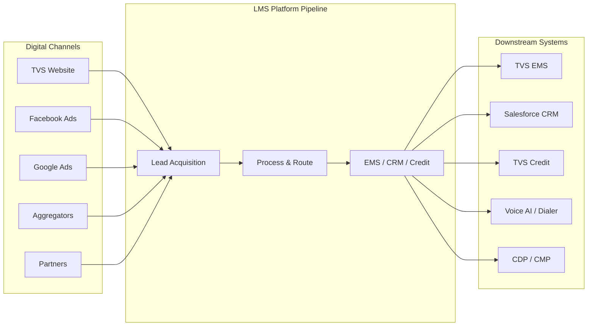

A lead enters through the Lead Acquisition Service, is validated, and placed on a message queue. The Process Lead Service picks it up, enriches it with dealer assignment data, and fans it out to three parallel downstream services — EMS, CRM, and TVS Credit — each of which independently pushes the lead to its target external system.

This design means that if one downstream system is temporarily unavailable (say, the Dialer), the other pushes (EMS, CRM, Finance) are not affected. Each service retries independently.

---

## 3. Architecture Overview

### 3.1 Architecture Style

The platform follows an **event-driven microservices** pattern. Services do not call each other directly over HTTP (except for a few lookups described below). Instead, they communicate by publishing and consuming messages on **Azure Service Bus topics and subscriptions**. This is analogous to a postal system: the sender drops a letter in a post box (publishes to a topic), and every subscriber independently picks up their own copy and acts on it.

### 3.2 High-Level Architecture Diagram

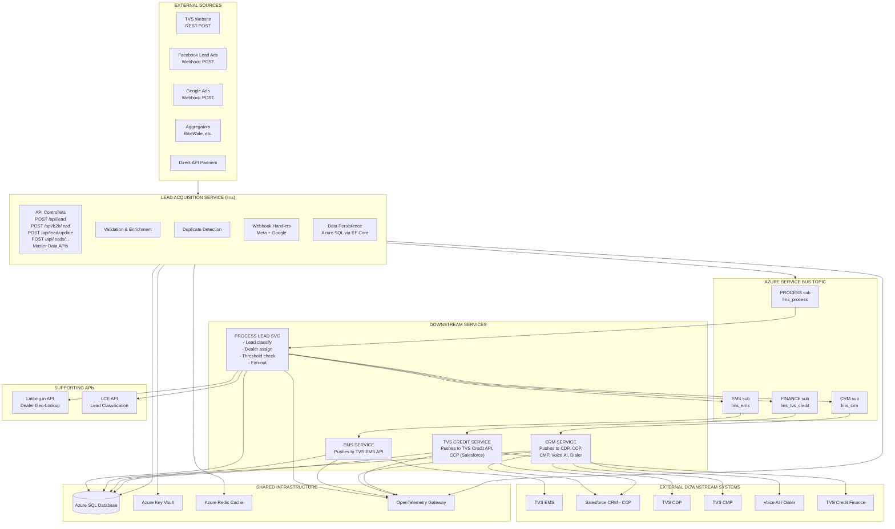

### 3.3 Key Architectural Decisions

- **Asynchronous by default.** Once a lead is persisted and placed on the Service Bus, the acquisition service returns a response to the caller immediately. All downstream processing happens asynchronously, ensuring the caller never waits for EMS, CRM, or Finance to respond.
- **Single shared database.** All five services read from and write to the same Azure SQL database, each using only the tables relevant to their function. This avoids data synchronization complexity while keeping services independently deployable.
- **Shared configuration library.** A common class library (`lms.config`) is embedded in each service's codebase, providing shared database entity definitions and shared data transfer models.
- **Retry via scheduled messages.** When a downstream push fails (e.g., EMS API is down), the service schedules a new Service Bus message with a future delivery time (30 minutes, or next day for threshold exceeded). There is no dead-letter queue processing — retries are handled as new messages.

---

## 4. Major Components and Services

### 4.1 Lead Acquisition Service (`lms`)

**Plain English:** The front door of the system. It receives lead submissions from websites, Facebook, and aggregators, checks whether the lead is valid and not a duplicate, saves it to the database, and sends it forward for processing.

**Technical Name:** `leadReceiptService`  
**Framework:** ASP.NET Core 8, REST API  
**Runs as:** Containerized HTTP server (Docker → Kubernetes)

#### 4.1.1 Responsibilities

- Accept incoming HTTP POST requests carrying lead data (name, phone, model of interest, source, location)
- Validate the lead using defined business rules (FluentValidation)
- Detect duplicate leads by checking if the same phone number has submitted for the same brand recently
- Persist the lead to the `leads` and `lead_logs` database tables
- Publish a message to the Azure Service Bus for downstream processing
- Handle the Facebook/Meta and Google Ads webhook lifecycle (verify webhook URL and process incoming lead events)
- Provide query endpoints for fetching lead details and a lead's full event history (one-view)
- Provide master data management APIs for brands, models/parts, lead sources, lead flow configuration, and event configurators

#### 4.1.2 Key API Endpoints

| Endpoint | Method | Purpose |
|---|---|---|
| `/api/lead` | POST | Primary lead intake — used by websites and partners |
| `/api/b2b/lead` | POST / GET | Facebook / Meta and Google Ads webhook receiver |
| `/api/lead/update` | POST | Update an existing lead's status or details |
| `/api/b2b/lead/update` | POST | B2B-specific lead update |
| `/api/leads/all` | POST | Retrieve paginated list of leads |
| `/api/leads/one-view` | POST | Full lead timeline with all events |
| `/api/leads/Count` | POST | Lead count with filters |
| `/dealers` | POST | Look up dealers by criteria |
| `/api/brand`, `/api/brand/{code}` | POST / GET / PUT | Brand master CRUD |
| `/api/model`, `/api/model/{id}` | POST / GET / PUT | Model/Part master CRUD |
| `/api/lead-source`, `/api/lead-source/{id}` | POST / GET / PUT | Lead source master CRUD |
| `/api/lead-flow`, `/api/lead-flow/{id}` | POST / GET / PUT | Lead flow configuration CRUD |
| `/api/event-configurator`, `/api/event-configurator/{id}` | POST / GET / PUT | Event configurator CRUD |

#### 4.1.3 Internal Processing Steps

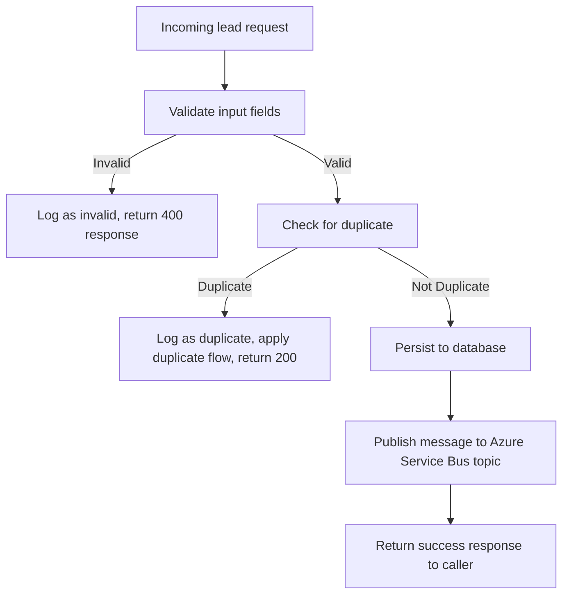

#### 4.1.4 Facebook / Meta and Google Ads Integration Flow

When a lead is submitted through Facebook Lead Ads or Google Ads lead forms, the respective platform sends lead data to a registered webhook URL on this service. The service uses a **strategy pattern** to route payloads to the correct handler:

- **MetaWebhookHandler** — Fetches an access token from the Meta Graph API, calls the Graph API to retrieve the full lead data, and maps Facebook field names to the LMS lead model using DB-stored field mapping configuration.
- **GoogleWebhookHandler** — Parses the `user_column_data` array from the Google Ads payload and maps fields to the LMS lead model using DB-stored field mapping configuration.

Both handlers converge into the standard validation and persistence pipeline.

---

### 4.2 Process Lead Service (`lms_process`)

**Plain English:** The brain of the system. It reads leads from the queue, figures out which category they fall into (regular dealership, aggregator, or EV), finds the nearest suitable dealer, checks whether that dealer has not already hit their daily lead cap, and then sends the lead forward to EMS, CRM, and Finance simultaneously.

**Technical Name:** `processLeadService`  
**Framework:** ASP.NET Core 8, background worker with no public API  
**Runs as:** Containerized background service (Docker → Kubernetes)

#### 4.2.1 Responsibilities

- Consume messages from the `PROCESS` subscription on the Service Bus topic
- Classify each lead (standard HO lead, aggregator-sourced lead, or EV segment lead)
- Query the Latlong.in geolocation API to find the nearest authorized dealer for the customer's pincode and vehicle brand
- Check the dealer's daily lead threshold (daily lead cap). If the dealer has received too many leads today, delay the lead to the next day
- Dispatch messages to the EMS, CRM, Finance, and CMP subscriptions so all downstream services process simultaneously
- Handle lead update events (e.g., status updates from dealers)
- Consume Master Data Platform (MDP) messages for dealer assignment changes

#### 4.2.2 Lead Classification Logic

The Lead Classification Engine (LCE) is an external REST API that this service calls. Based on the lead source, the lead is classified as:

- **HO Lead** — lead originated from TVS's own website or direct channels
- **Aggregator Lead** — lead came from a third-party aggregator (BikeWale, BikeDekho, 91Wheels)
- **EV Lead** — lead is for an electric vehicle (routed through a different dealer allocation path)

Different classification types may have different EMS endpoints, CRM rules, and CMP notification templates.

#### 4.2.3 Dealer Allocation Flow

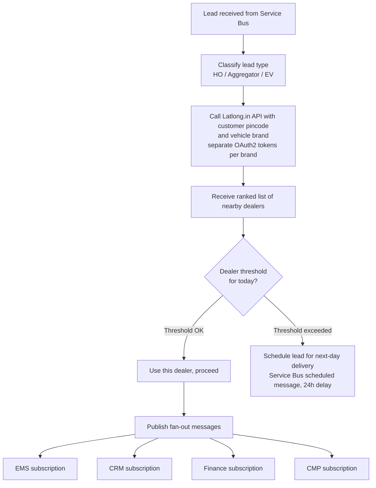

---

### 4.3 EMS Service (`lms_ems`)

**Plain English:** Receives the lead and pushes it into TVS's Enquiry Management System (EMS), which is the internal sales force management tool used by dealer sales staff.

**Technical Name:** `emsService`  
**Framework:** ASP.NET Core 8, background worker  
**Runs as:** Containerized background service (Docker → Kubernetes)

#### 4.3.1 Responsibilities

- Consume messages from the `EMS` subscription
- Route the lead to the appropriate EMS API endpoint based on lead type (HO leads, aggregator leads, EV leads, EV test ride leads)
- Handle the response from EMS — log success or failure
- On failure, schedule a retry message (30-minute delay) back to the Service Bus
- If a dealer is flagged as needing retry or is unavailable, route the message back to the PROCESS subscription for dealer reassignment
- Push booking confirmation events through a separate booking queue
- Update the threshold tracking record in the database when a dealer has reached their daily cap

#### 4.3.2 EMS Push Logic

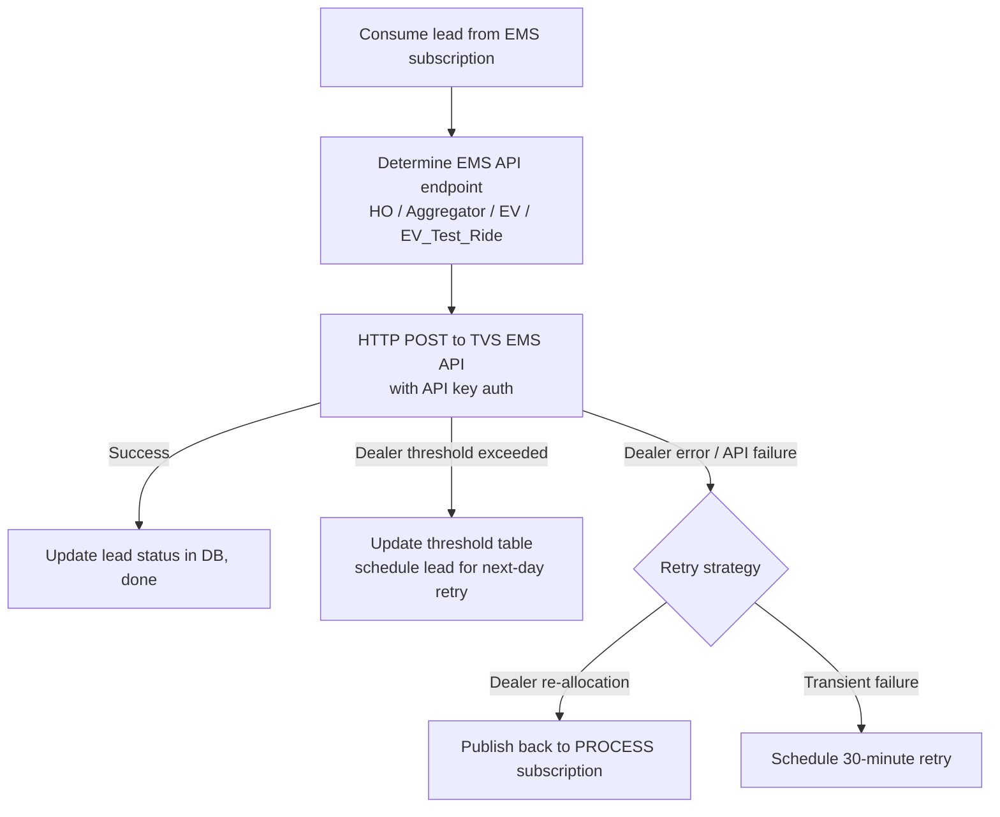

---

### 4.4 CRM Service (`lms_crm`)

**Plain English:** Pushes leads to multiple customer engagement systems — the customer data platform, Salesforce CRM, push notification platform, Voice AI calling, and an auto-dialing service.

**Technical Name:** `crmService`  
**Framework:** ASP.NET Core 8, background worker  
**Runs as:** Containerized background service (Docker → Kubernetes)

#### 4.4.1 Responsibilities

- Consume messages from the `CRM` subscription
- Push lead data to multiple external systems (described below)
- Handle lead update events separately (status changes, test ride bookings, invoice updates)
- Handle scheduled Voice AI events (after-hours leads re-delivered at business hours)
- Manage OAuth2 token lifecycle for each external system independently

#### 4.4.2 External System Integrations

| System | Plain English | Technical Integration |
|---|---|---|
| CDP (Customer Data Platform) | Central TVS customer database — updates or creates the customer's profile | HTTP POST with OAuth2 bearer token (chained auth) |
| CCP (Salesforce) | TVS's Salesforce CRM — creates or updates a lead record | HTTP POST/PATCH with OAuth2 client_credentials (token cached for 23 hours) |
| CMP (Communication Platform) | Triggers push notifications to TVS mobile app users | HTTP POST with OAuth2 client_credentials; separate configuration for iQube (EV) |
| Voice AI | Automated outbound voice calling for lead qualification with business-hours scheduling (9AM–7PM IST) | HTTP POST; after-hours leads scheduled via Service Bus delayed messages |
| Dialer | Auto-dialing service that calls the customer | HTTP POST with OAuth2 bearer token |

---

### 4.5 TVS Credit Service (`lms_tvs_credit`)

**Plain English:** Takes finance-eligible leads and submits them to the TVS Credit team so their loan or financing officers can follow up with the customer.

**Technical Name:** `lms_tvs_credit`  
**Framework:** ASP.NET Core 8, background worker  
**Runs as:** Containerized background service (Docker → Kubernetes)

#### 4.5.1 Responsibilities

- Consume messages from the `FINANCE` subscription
- Evaluate if the lead is eligible for finance (based on lead source and configuration)
- Resolve the customer's state and city to codes recognized by the TVS Credit API
- Resolve the dealer to a TVS Credit dealer code
- HTTP POST to TVS Credit API with required channel, product, and agency codes
- Also push EV leads to Salesforce CCP (same integration as CRM service)

---

## 5. Database Design

### 5.1 Overview

All five services share a **single Azure SQL Server database**. Each service accesses only the tables relevant to its own responsibilities, using Entity Framework Core as the data access layer (an ORM — a library that translates between C# objects and SQL tables automatically).

The database holds three broad categories of data:
1. **Lead data** — the leads themselves, their attributes, their processing status
2. **Reference / Master data** — dealers, brands, models, sources, pincodes, states
3. **Operational / Log data** — audit trails of every push attempt, every retry, every API call

### 5.2 Core Lead Tables

| Table | Plain English Purpose |
|---|---|
| `leads` | One row per unique lead. Contains status for each downstream system (EMS status, CRM status, DMS status). |
| `lead_logs` | Every incoming request logged with full payload |
| `lead_log_response` | The response sent back to every caller |
| `lead_acquisition_logs` | Detailed acquisition attempt log with HTTP status codes |
| `lead_process_logs` | Processing outcome per lead |
| `lead_push_logs` | Every outgoing push attempt — EMS, CRM, Finance — with result |
| `lead_brand_details` | Which vehicle brands the customer is interested in |
| `lead_catalogue_details` | Which specific models the customer is interested in |
| `lead_extra_attributes` | Flexible key-value attributes added per lead (form-specific fields) |
| `lead_followups` | Follow-up activity records |
| `lead_test_rides` | Test ride booking records |
| `lead_invoice_details` | Invoice / billing information attached to a lead |
| `lead_event_logs` | Complete timeline of every event that happened to a lead |
| `lead_enquiry_tags` | Tags/labels applied to leads for categorization |
| `duplicate_leads` | Records identified as duplicates |
| `classified_leads` | Output of the lead classification engine |
| `finance_details` | Finance eligibility and submitted finance data |

### 5.3 Communications and Comms Tables

| Table | Purpose |
|---|---|
| `lead_comms` | Communication records associated with leads |
| `comms_link_details` | Links between communications and leads |
| `comms_brand_details` | Brand context for communications |
| `leads_comms_mapping` | Many-to-many mapping of leads to communications |

### 5.4 Reference / Master Data Tables

| Table | Purpose |
|---|---|
| `dealer_master` | All TVS authorized dealers |
| `dealer_locations` | Geographic information for each dealer outlet |
| `dealer_contacts` | Contact details per dealer |
| `dealer_flags` | Feature flags/configuration per dealer |
| `dealer_mediation_controls` | Daily lead count per dealer (threshold tracking, keyed by date bucket) |
| `brand_master` | TVS vehicle brands (Apache, Jupiter, iQube, etc.) |
| `model_id_part_id_master` | Mapping between model names and internal part/model IDs |
| `lead_sources` | All valid lead sources with associated EMS event type |
| `lead_flow_configuration` | Per-source configuration: which downstream systems to push to, which flags are enabled |
| `event_configurator` | Event type routing rules |
| `threshold_master` | Threshold definitions and caps |
| `lce_threshold` | LCE-specific threshold configurations |
| `pincode_master` | Pincode-to-geography mapping |
| `country_master` | Supported countries (multi-country deployment support) |
| `account_master` | Multi-tenant client account definitions |
| `status_codes` | Enumerated status codes and their descriptions |

### 5.5 Integration and Audit Tables

| Table | Purpose |
|---|---|
| `latlong_push_logs` | Log of every call made to the Latlong.in geolocation API |
| `mdp_logs` | Log of every call from the Master Data Platform |
| `webhook_logs` | Raw Facebook/Meta webhook payloads stored for audit |
| `meta_logs` | Log of every call made to the Facebook Graph API |
| `update_logs` / `updated_leads` | Lead update event tracking |
| `lead_booking_details` | Booking records (EMS service) |
| `form_master` / `form_configurations` / `form_brand_mapping` | Facebook Lead Ads form-to-brand mapping configuration |
| `page_master` | Facebook page metadata |
| `referral_customer_details` | Referral lead data |
| `lead_quotation` | Quotation data attached to leads |
| `additional_details` | Additional lead attributes |

---

## 6. API Integrations

### 6.1 Inbound APIs (APIs consumed by external callers sending data IN to LMS)

| Caller | Endpoint | What It Does |
|---|---|---|
| TVS Website / Partners | `POST /api/lead` | Submit a new lead with customer and vehicle interest data |
| Facebook / Meta | `POST /api/b2b/lead` | Webhook — Facebook sends lead notification here |
| Google Ads | `POST /api/b2b/lead` | Webhook — Google Ads sends lead form submissions here |
| Facebook / Meta | `GET /api/b2b/lead` | Webhook verification — Facebook challenges this URL to confirm it is valid |
| CRM / Internal Tools | `POST /api/lead/update` | Update an existing lead |
| Internal Dashboards | `POST /api/leads/all`, `/api/leads/filter`, `/api/leads/one-view` | Query leads for reporting |
| Internal / Admin Tools | `POST/GET/PUT /api/brand`, `/api/model`, `/api/lead-source`, `/api/lead-flow`, `/api/event-configurator` | Master data management |

### 6.2 Outbound APIs (External APIs that LMS calls)

| External System | Authentication | What LMS Sends |
|---|---|---|
| **Meta / Facebook Graph API** | App access token (OAuth2) | Fetches full lead form data using the lead ID from the webhook |
| **Google Ads Webhooks** | Inbound HTTPS POST (no outbound call) | Receives lead form submissions from Google Ads campaigns |
| **Latlong.in** | OAuth2 client_credentials (separate token per vehicle brand) | Sends customer pincode + vehicle brand → receives nearest dealer list |
| **LCE (Lead Classification Engine)** | OAuth2 client_credentials | Sends lead source and attributes → receives lead classification result |
| **TVS EMS API** | API key header | Sends full lead payload → receives EMS reference ID |
| **TVS EMS Aggregator API** | API key header | Same as above, separate endpoint for aggregator-sourced leads |
| **TVS CCP (Salesforce)** | OAuth2 client_credentials (Bearer token, 23h cache) | Creates or updates Salesforce lead/contact record |
| **TVS CDP** | OAuth2 bearer token (chained auth) | Creates or updates customer profile |
| **TVS CMP** | OAuth2 client_credentials | Triggers push notification (separate config for iQube EV) |
| **Dialer** | OAuth2 bearer token | Submits lead for auto-dialing call queue |
| **Voice AI** | HTTP POST (direct) | Submits lead for automated outbound voice calling with business-hours scheduling |
| **TVS Credit API** | No auth (parameters in body) | Submits finance-eligible lead with channel, product, agency codes |
| **MDP (Master Data Platform)** | Azure Service Bus SAS | Dealer assignment update messages consumed from separate Service Bus |
| **Legacy LMS** | HTTP (fire and forget) | Callback to legacy system for backward compatibility |

---

## 7. Authentication and Authorization

### 7.1 Inbound Request Security

**API Key Authentication** — The Lead Acquisition Service (`lms`) expects an API key to be provided with every incoming lead submission request. This key is configured per environment and is shared with integration partners and internal systems. Any request without a valid API key is rejected.

### 7.2 Service-to-Service Security

Services communicate exclusively via Azure Service Bus, which uses **SAS (Shared Access Signature)** connection strings. Only services that hold the correct connection string can send or receive messages on a given topic or subscription. There are no direct HTTP calls between LMS microservices.

### 7.3 External API Authentication Methods

LMS uses several authentication patterns when calling external APIs:

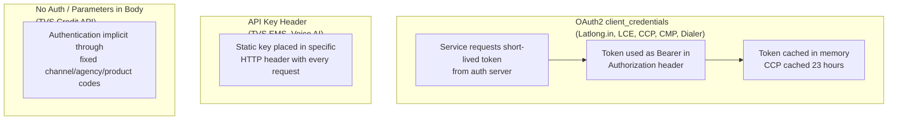

### 7.4 Azure Infrastructure Security

- **Azure Key Vault** — The Lead Acquisition Service (`lms`) retrieves secrets (connection strings, API keys, client secrets) at startup from Azure Key Vault rather than storing them in configuration files. This prevents secrets from being visible in deployment artifacts.
- **Azure Active Directory Service Principal** — Used for authenticating to Azure SQL Server and Azure Key Vault without embedding credentials in connection strings.
- **CORS Policy** — All services are currently configured to allow requests from any origin. This is suitable for backend services sitting behind an API gateway or load balancer.

---

## 8. Deployment Architecture

### 8.1 Container and Orchestration Strategy

Every service is containerized using **Docker** with multi-stage builds based on the official Microsoft .NET 8 runtime image. The containers are deployed to **Azure Kubernetes Service (AKS)** — a managed container orchestration platform. Kubernetes manages starting, stopping, scaling, and health-checking the containers automatically.

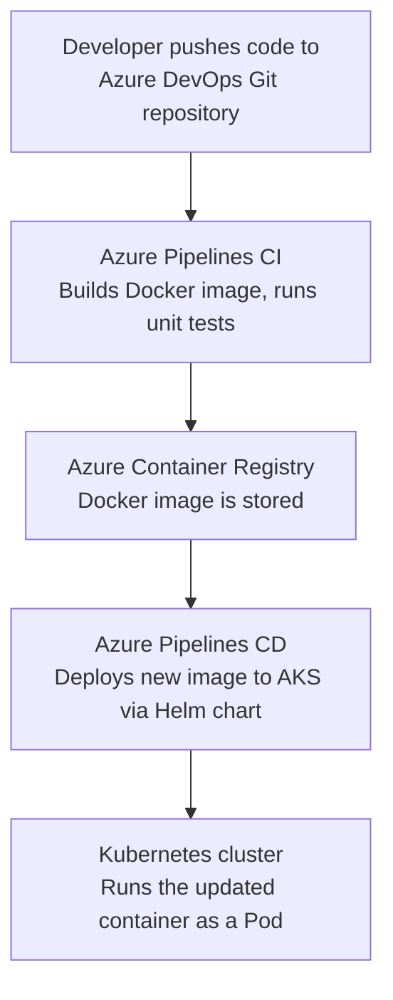

### 8.2 Environment Strategy

| Environment | Branch | Purpose |
|---|---|---|
| Development (Dev) | `ls_dev` | Active development and integration testing |
| UAT | `ls_uat` | User acceptance testing — manual approval gate required for deployment |
| Production | `ls_release` / `main` | Live production traffic |

The EMS service pipeline shows explicit UAT stage configuration with a manual approval gate, meaning a human must approve before code is promoted from Dev to UAT.

### 8.3 CI/CD Pipeline Structure

All pipelines (except CRM) are built on a shared template stored in a central Azure DevOps repository (`Devops_ISSM_pipelines`). The CRM service uses a separate Norton pipeline template. This shared template approach ensures consistent build and deploy steps across all services without duplicating pipeline configuration.

The CRM service uses a separate Norton pipeline maintained by a platform team (`tvsm-norton-pipelines`).

### 8.4 Port Configuration

| Service | Exposed Ports |
|---|---|
| Lead Acquisition (lms) | 8080 (HTTP), 8081 (HTTPS) |
| Process Lead (lms_process) | 8080 (HTTP), 8081 (HTTPS) |
| EMS (lms_ems) | 8080 |
| CRM (lms_crm) | Via Norton pipeline / load balancer |
| TVS Credit (lms_tvs_credit) | Standard .NET defaults |

### 8.5 Multi-Country and Multi-Brand Support

The platform has been designed to support multi-country deployment, evidenced by `country_master` database table, `countryCode` HTTP header support on the lead intake endpoint, and dedicated deployment branches (`multi-country-deployment`, `CP-NORTON-DEV/UAT`). International brand variants (e.g., Norton motorcycles) have separate pipeline templates.

---

## 9. High-Level Sequence Flows

### 9.1 Standard Lead Submission Flow

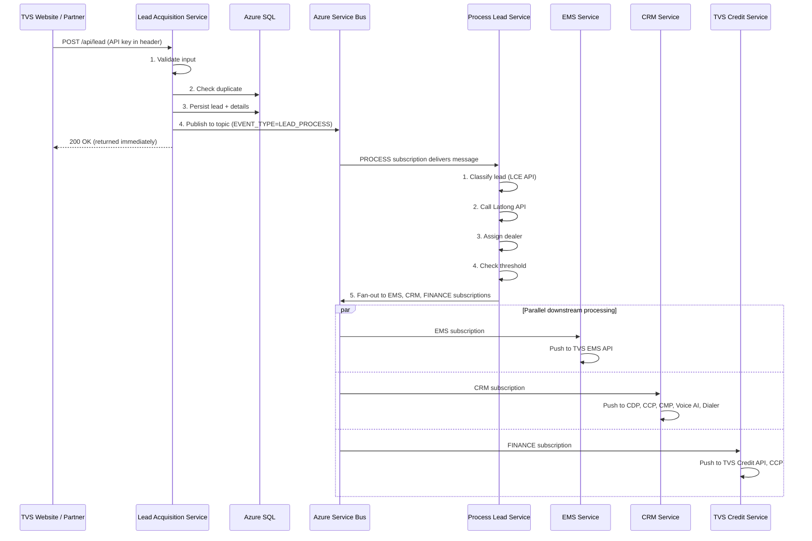

### 9.2 Facebook / Meta Lead Flow

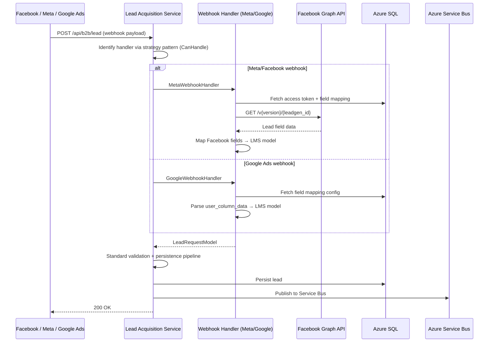

### 9.3 Dealer Threshold Exceeded Flow

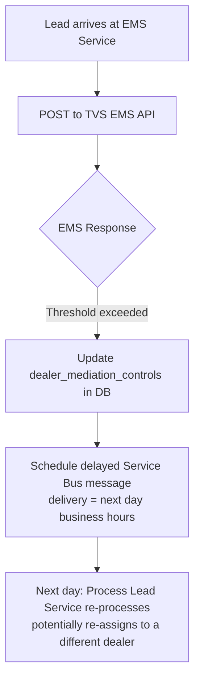

### 9.4 Lead Update Flow

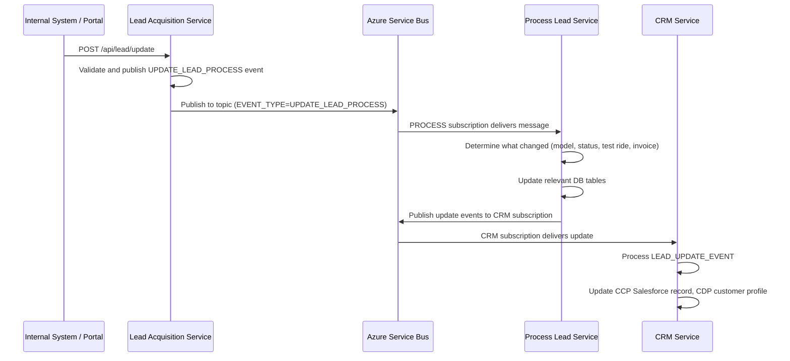

### 9.5 EMS Retry on Dealer API Error Flow

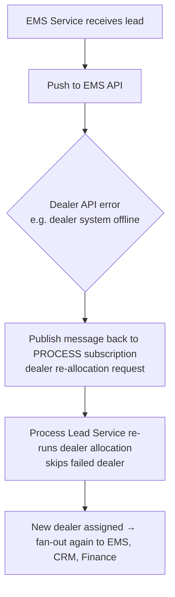

---

## 10. External Systems

### 10.1 Lead Source Systems (Inbound)

| System | Type | Integration Method |
|---|---|---|
| TVS Website | TVS internal | HTTPS REST POST to `/api/lead` |
| Facebook / Meta Lead Ads | Social media platform | Webhook callback + Graph API fetch |
| Google Ads Lead Forms | Search/display platform | Webhook callback with `user_column_data` payload |
| BikeWale | Third-party aggregator | HTTPS REST POST to `/api/lead` |
| BikeDekho | Third-party aggregator | HTTPS REST POST to `/api/lead` |
| 91Wheels | Third-party aggregator | HTTPS REST POST to `/api/lead` |
| Direct API Partners | Various | HTTPS REST POST to `/api/lead` |

### 10.2 Lead Destination Systems (Outbound)

| System | Owner | Purpose | Data Sent |
|---|---|---|---|
| TVS EMS (Enquiry Management System) | TVS Motor Company | Dealer-facing sales management tool | Full lead details for dealer follow-up |
| TVS CCP (Salesforce CRM) | TVS Motor Company on Salesforce | Customer relationship management | Lead and customer data |
| TVS CDP (Customer Data Platform) | TVS Motor Company | Central customer profile store | Customer identity and interest data |
| TVS CMP (Communication Platform) | TVS Motor Company | Push notifications to TVS app users | Notification trigger with lead context |
| Voice AI | TVS / Partner | Automated outbound voice calling for lead qualification | Customer phone, name, vehicle interest, dealer context |
| Dialer | TVS / Partner | Auto-call customer from call center | Customer phone number and lead reference |
| TVS Credit | TVS Credit Services Ltd | Finance / loan follow-up | Customer details, dealer code, vehicle info |
| Legacy LMS | TVS Motor Company | Backward-compatible callback to old system | Full lead payload (fire and forget) |

### 10.3 Supporting Services (Data/Enrichment)

| System | Owner | Purpose |
|---|---|---|
| Latlong.in | Third-party geolocation | Dealer discovery by customer pincode and brand |
| LCE (Lead Classification Engine) | TVS / Internal | Classifies lead type (HO / Aggregator / EV) |
| MDP (Master Data Platform) | TVS / Internal | Dealer master data updates via Service Bus |
| Meta / Facebook Graph API | Meta | Retrieve full lead form data from Facebook ads |

---

## 11. Infrastructure Dependencies

### 11.1 Azure Services Used

| Azure Service | Used By | Purpose |
|---|---|---|
| **Azure SQL Server** | All 5 services | Primary relational database for all lead and reference data |
| **Azure Service Bus** (Topics + Subscriptions) | All 5 services | Asynchronous message broker — core inter-service communication |
| **Azure Service Bus** (Separate — Booking) | lms_ems | Separate queue for booking/booking confirmation events |
| **Azure Service Bus** (Separate — MDP) | lms_process | Separate queue for Master Data Platform dealer updates |
| **Azure Redis Cache** | lms (acquisition) | In-memory caching to reduce database and API call load |
| **Azure Key Vault** | lms (acquisition) | Secure secrets management — stores connection strings, API keys, client secrets |
| **Azure Kubernetes Service (AKS)** | All 5 services | Container orchestration — runs and scales all Docker containers |
| **Azure Container Registry (ACR)** | All 5 services | Docker image registry — stores built container images |
| **Azure DevOps (Pipelines + Repos)** | All 5 services | CI/CD automation and source code hosting |
| **Azure Active Directory** | lms, Azure SQL | Service principal auth for Key Vault and SQL |
| **OpenTelemetry Collector** | All 5 services | Telemetry pipeline — traces and logs forwarded to `otel-gw-logs.tvsmotor.com` |

### 11.2 Network and Connectivity Requirements

- All services require outbound internet access to reach external APIs (Latlong.in, Meta Graph API, TVS Credit API, Rezo AI)
- Service Bus connections use AMQP over WebSockets (AMQP-WebSockets), which uses port 443 — standard HTTPS port, no special firewall rules needed
- Azure SQL connectivity may require private endpoint or VNet integration depending on the environment (standard for production AKS deployments)
- OpenTelemetry log forwarding goes to `otel-gw-logs.tvsmotor.com` — this domain must be reachable from the AKS cluster

### 11.3 Technology Stack Summary

| Category | Technology | Version |
|---|---|---|
| Application framework | ASP.NET Core | 8.0 |
| Language | C# | 12 |
| ORM (database access) | Entity Framework Core | SQL Server provider |
| Message broker client | Azure.Messaging.ServiceBus SDK | Latest stable |
| Object mapping | AutoMapper | Latest stable |
| Input validation | FluentValidation | lms acquisition only |
| JSON serialization | Newtonsoft.Json | Latest stable |
| HTTP client | System.Net.Http.HttpClient (typed clients) | Built-in .NET |
| Observability | OpenTelemetry (traces + logs, OTLP exporter) | All 5 services |
| Unit testing | xUnit + Moq + NSubstitute + FluentAssertions | All services |
| Containerization | Docker (multi-stage .NET 8 build) | All services |
| Orchestration | Kubernetes (AKS) via Helm charts | All services |
| CI/CD | Azure Pipelines | YAML-based, shared template |
| Cache | StackExchange.Redis | lms acquisition only |
| Excel generation | EPPlus | lms_process |

---

## 12. Scalability and Resiliency

### 12.1 Scalability Design

**Horizontal scaling** — because all five services are stateless (they do not hold session state in memory), Kubernetes can run multiple identical copies (replicas) of each service. If lead volume increases, more copies of any individual service can be added without changing the code.

**Independent scaling** — each service scales independently. For example, if EMS pushes are the bottleneck, only the EMS service needs more replicas. Other services remain at their current scale.

**Azure Service Bus buffering** — the message broker acts as a shock absorber. If lead volume spikes and downstream services cannot keep up immediately, messages queue up on the Service Bus and are processed as fast as the downstream service can handle them. No leads are lost.

**Message concurrency** — Service Bus consumers in `lms_process` are configured with `MaxConcurrentCalls=1` per instance, meaning each service instance processes one message at a time. More concurrency can be achieved by running more replicas. The EMS service has a configurable `MAX_SESSIONS` setting.

### 12.2 Resiliency Mechanisms

| Mechanism | Where Used | What It Does |
|---|---|---|
| **Scheduled message retry** | lms_ems | If EMS API fails, schedules a new message with 30-minute future delivery. No messages are dropped on transient failure. |
| **Next-day threshold delay** | lms_process, lms_ems | If a dealer has hit their daily cap, the lead is held and delivered the next business day automatically |
| **Dealer re-allocation retry** | lms_ems → lms_process | If the assigned dealer's EMS API is down, the lead is returned to Process Lead Service to pick a different dealer |
| **Database-level deduplication** | lms (acquisition) | A unique database constraint prevents the same lead (same phone + brand) from being inserted twice, even under concurrent requests |
| **Token caching** | lms_crm, lms_tvs_credit | OAuth2 tokens for CCP (Salesforce) are cached for 23 hours, preventing unnecessary re-authentication under high load |
| **SemaphoreSlim concurrency control** | lms_process | A semaphore limits concurrent HTTP calls to the legacy LMS system to 3, preventing it from being overwhelmed |
| **Independent service failure isolation** | Architecture-level | If the CRM service is down, EMS and Finance pushes continue unaffected. Each downstream service has its own subscription and processes independently. |
| **Separate booking queue** | lms_ems | Booking events are on a separate Service Bus connection. A booking queue failure cannot affect the lead queue. |

### 12.3 Observability

- **OpenTelemetry** is fully implemented across all five services, sending distributed traces and logs to the TVS telemetry gateway (`otel-gw-logs.tvsmotor.com`). This allows engineers to trace a single lead's journey end-to-end from intake through processing to downstream pushes.
- All services use ASP.NET Core's built-in `ILogger` for structured logging to the container standard output, which Kubernetes collects and forwards to the central logging system.
- **Comprehensive audit tables** — every API call in and out is logged to the database (lead_acquisition_logs, lead_push_logs, latlong_push_logs, mdp_logs, webhook_logs, meta_logs). This means any lead can be fully traced through its journey without needing to search through log files.

### 12.4 Known Constraints and Considerations

- The `lms.config` class library is duplicated into each service repo rather than shared via NuGet package. This means database entity changes must be manually synchronized across all five repositories.
- Azure Key Vault integration is fully implemented only in the Lead Acquisition Service. Other services read secrets from environment variables or Kubernetes secrets directly.
- The CORS policy (`AllowAnyOrigin`) is appropriate for services running behind a gateway or load balancer but should be reviewed if any service is exposed directly to the internet.

---

## 13. Glossary

| Term | Plain English Explanation | Technical Detail |
|---|---|---|
| **Microservices** | An application built as a collection of small, independent programs that each handle one specific job | Each service runs in its own container, has its own codebase, and communicates with others via messages |
| **Azure Service Bus** | A cloud message relay system — like a post office for software | A Microsoft Azure managed messaging service using the AMQP protocol; supports topics (one-to-many) and queues (one-to-one) |
| **Topic / Subscription** | A topic is a message channel. A subscription is a named filter on that channel that gives each service its own copy of relevant messages | Azure Service Bus publish-subscribe model where publishers send to a topic and subscribers each receive messages matching their filter rules |
| **EMS (Enquiry Management System)** | TVS's internal sales tool used by dealer staff to manage customer enquiries and test rides | A REST API-based system; LMS pushes lead data to it via HTTP POST |
| **CRM (Customer Relationship Management)** | Software that tracks all interactions between TVS and its customers | In this context, refers to TVS's Salesforce-based CCP system |
| **CCP (Salesforce)** | TVS's branded name for their Salesforce CRM installation | OAuth2-authenticated REST API; LMS uses client_credentials grant to get bearer tokens |
| **CDP (Customer Data Platform)** | A central store that builds a single unified profile of each TVS customer across all touch points | REST API that receives customer identity and event data |
| **CMP (Communication Platform)** | TVS's system for sending push notifications to customers via the TVS mobile app | REST API with OAuth2 authentication; separate configuration for iQube EV customers |
| **Dialer** | An auto-dialing system that automatically calls customers from a call center | REST API integration; LMS submits the customer's phone number and lead reference |
| **Voice AI** | An automated system that calls customers by phone using AI-generated voice for lead qualification | HTTP POST integration from `lms_crm`; respects business hours (9AM–7PM IST), schedules after-hours leads for next-day delivery via Service Bus delayed messages |
| **TVS Credit** | TVS's finance arm that offers vehicle loans and financing | External REST API; LMS submits finance-eligible leads with channel/product/agency codes |
| **Latlong.in** | A third-party geolocation service | Provides dealer discovery API — accepts a pincode and vehicle brand, returns nearest authorized dealers |
| **LCE (Lead Classification Engine)** | An internal API that classifies leads into categories (HO, Aggregator, EV) | REST API with OAuth2 client_credentials auth |
| **MDP (Master Data Platform)** | TVS's internal master data system for dealer and product information | Publishes updates to a separate Azure Service Bus; lms_process consumes these to refresh dealer data |
| **OAuth2 client_credentials** | A secure way for one program to identify itself to another without a human user logging in | Machine-to-machine grant type where client ID and secret are exchanged for a short-lived bearer token |
| **Bearer Token** | A temporary password-like string used to prove identity when calling an API | Placed in the Authorization HTTP header as "Bearer <token>" |
| **API Key** | A permanent secret code shared between systems to control access | A static string placed in an HTTP header; simpler but less granular than OAuth2 |
| **Entity Framework Core (EF Core)** | A library that lets developers work with database tables as if they were C# objects | An Object-Relational Mapper (ORM) for .NET; handles SQL query generation automatically |
| **Docker / Container** | A self-contained package that includes the application and everything it needs to run | Builds from a Dockerfile; runs identically on any machine that has Docker installed |
| **Kubernetes (AKS)** | A platform that manages, scales, and restarts containers automatically | Azure Kubernetes Service; orchestrates container deployment via Helm charts |
| **Helm Chart** | A configuration template for deploying an application to Kubernetes | Packages all Kubernetes resource definitions (deployment, service, config) into a versioned, reusable chart |
| **CI/CD Pipeline** | Automated steps that build, test, and deploy code every time a developer pushes changes | Azure Pipelines YAML definitions that trigger on Git branch events |
| **Azure Key Vault** | A secure vault in the cloud for storing application secrets | Microsoft Azure managed HSM/secrets service; applications authenticate via AAD and retrieve secrets at runtime |
| **OpenTelemetry** | A standard for collecting performance and tracing data from software | OTLP-based traces and logs exported to TVS's telemetry gateway |
| **Redis Cache** | An in-memory database used for fast, temporary data storage | Used in Lead Acquisition Service to cache frequently read data and reduce SQL load |
| **FluentValidation** | A library for writing readable validation rules in C# | Used in the Lead Acquisition Service to validate incoming lead request fields |
| **AutoMapper** | A library that automatically copies data between different object types | Maps database entity objects to API response models and vice versa |
| **Webhook** | A way for one system to automatically notify another when something happens | An HTTP POST sent by Facebook/Meta to the LMS endpoint when a customer submits a Facebook lead ad |
| **Duplicate Detection** | The process of identifying if a lead from the same customer has already been received | Implemented via a unique database constraint on mobile number + brand, plus application-level checks |
| **Dealer Threshold** | A daily limit on how many leads a single dealer outlet receives | Tracked in the `dealer_mediation_controls` table with a date-bucket key; exceeded leads are delayed to the next day |
| **Fan-out** | Sending the same message to multiple destinations at once | After classification, lms_process publishes to multiple Service Bus subscriptions (EMS, CRM, Finance) simultaneously |
| **SAS (Shared Access Signature)** | A time-limited, permission-scoped security token for Azure services | Used in Azure Service Bus connection strings to grant send/receive permission without full account access |
| **AMQP** | A communication protocol used by Azure Service Bus | Advanced Message Queuing Protocol; used over WebSockets (port 443) in this platform |
| **Aggregator** | A third-party website that collects vehicle enquiries across multiple brands and sells the leads | Examples: BikeWale, BikeDekho, 91Wheels; their leads are classified and routed differently than direct leads |
| **HO Lead** | Head Office lead — a lead submitted directly through TVS's own digital properties | Opposed to aggregator leads; typically higher quality and routed directly to dealers |
| **EV Lead** | A lead for an electric vehicle (e.g., TVS iQube) | Routed through a separate Latlong.in API call and may use different EMS/CRM endpoints and CMP templates |

---

*End of Document*

*This HLD is generated from analysis of the live codebase as of July 2026. It should be reviewed and updated whenever significant architectural changes are made to any of the five services.*
