# TVSM Lead Service (LS) — Low Level Design (LLD)

**Document Version:** 2.0  
**Date:** July 2026  
**Audience:** Engineering Teams, Vendor Developers, Technical Architects  

---

## Table of Contents

1. [Code Structure (Folder Layout, Key Modules)](#1-code-structure-folder-layout-key-modules)
2. [Class and Service Responsibilities](#2-class-and-service-responsibilities)
3. [API Flow Details](#3-api-flow-details)
4. [Internal Component Interactions](#4-internal-component-interactions)
5. [Database Schema (Tables, Relationships)](#5-database-schema-tables-relationships)
6. [Request / Response Lifecycle](#6-request--response-lifecycle)
7. [Validation Logic](#7-validation-logic)
8. [Error Handling](#8-error-handling)
9. [Key Algorithms and Business Rules](#9-key-algorithms-and-business-rules)
10. [Configuration Handling](#10-configuration-handling)
11. [Testing Strategy](#11-testing-strategy)
12. [Glossary](#12-glossary)

---

## 1. Code Structure (Folder Layout, Key Modules)

### 1.1 Platform Module Map

The TVSM Lead Service platform comprises five independently deployable microservices. Each service is organized into consistent internal layers (Controller → Service → Repository → Database). Below is how they relate:

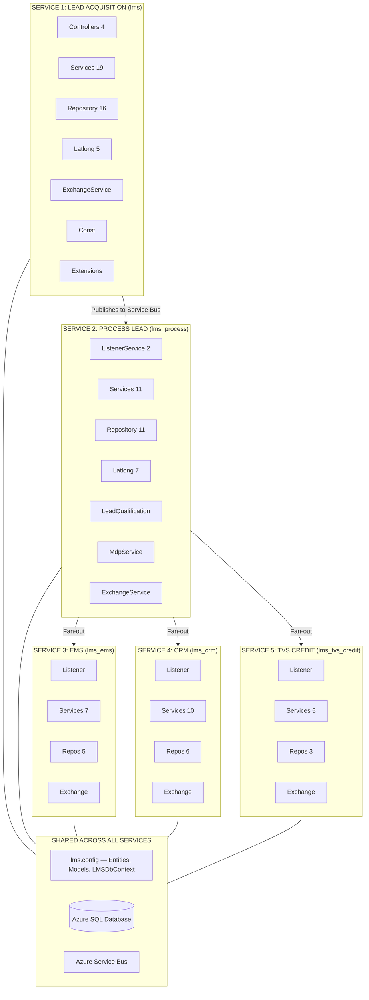


### 1.2 Service 1 — Lead Acquisition (`lms/leadLogs`)

| Module | Files | Plain English Role |
|--------|-------|--------------------|
| **Controllers** | `LeadAcquisitionController`, `WebhooksController`, `LeadGetController`, `LeadCommsController`, `MasterController` | HTTP entry points — receives REST requests from websites, Facebook, Google Ads, internal tools, and admin portal |
| **Services** | `LeadLogService`, `LeadValidator`, `LeadDelegate`, `ProcessValidLeadService`, `ProcessInvalidLeadService`, `ProcessDuplicateLeadService`, `LeadDispatchService`, `WebhookService`, `MetaWebhookHandler`, `GoogleWebhookHandler`, `TokenService`, `CommsService`, `CommsValidator`, `UpdateLeadService`, `UpdateValidator`, `LeadGetService`, `LeadOneViewService`, `MdpService`, `LatlongService`, `DtoService`, `DealerTransferService`, `LogicService`, `MasterService`, `BrandValidator`, `ModelValidator`, `LeadSourceValidator`, `LeadFlowConfigurationValidator`, `EventConfiguratorValidator` | Business logic — validation, duplicate check, persistence, dispatch, webhook handling, master data management |
| **Repository** | `LeadLogRepository`, `LeadRepository`, `LeadSourceRepository`, `BrandRepository`, `ModelPartRepository`, `MasterRepository`, `MdpRepository`, `DuplicateLeadRepository`, `CommsRepository`, `LeadGetRepository`, `LeadOneViewRepository`, `LeadMasterRepository`, `UpdateLeadRepository`, `WebhookRepository`, `LatlongRepository`, `LeadFlowConfigurationRepository`, `EventConfiguratorRepository`, `ContextFactory` | Database access — CRUD operations via Entity Framework Core |
| **Latlong** | `DealerAllocationFactory`, `EvDealerAllocationService`, `GeneralDealerAllocationService` | Strategy pattern for allocating dealers using geolocation (EV vs General brands) |
| **ExchangeService** | `ApiExchangeService` | HTTP client wrapper for calling external APIs (Legacy LMS, EMS search) |
| **Const** | `AppSettingsService`, `Constants` | Configuration loading and constant definitions |
| **Extensions** | `MvcExtensions` | Dependency injection registration of all services and repositories |

### 1.3 Service 2 — Process Lead (`lms_process/processLeadService`)

| Module | Files | Plain English Role |
|--------|-------|--------------------|
| **ListenerService** | `QueueConsumer`, `MdpConsumer` | Background consumers that read messages from Azure Service Bus |
| **Services** | `LeadService` (router), `TwoWheelerService` (main processing), `ThresholdService`, `DispatchService`, `LeadDelegate`, `ModelMasterService`, `ModelComparer`, `RetryService`, `UpdateLeadService`, `UpdateDelegate` | Classification, dealer allocation, threshold check, fan-out dispatch |
| **LeadQualification** | `LeadClassifyService` | Calls the external Lead Classification Engine (LCE) API to categorize leads as HOT/WARM/COLD |
| **Latlong** | `LatlongService`, `DealerAllocationFactory`, `EvDealerAllocationService`, `GeneralDealerAllocationService` | Calls Latlong.in API for geolocation-based dealer discovery |
| **MdpService** | `MdpDealerService`, `MappingService` | Processes Master Data Platform dealer assignment updates |
| **Repository** | `LeadRepository`, `LeadFlowRepository`, `BrandRepository`, `ClassifyRepository`, `EventLogRepository`, `LatlongRepository`, `ThresholdRepository`, `UpdateLeadRepository`, `UpdateLogRepository`, `LeadMasterRepository`, `MdpRepository` | Database access for lead processing operations |
| **ExchangeService** | `ApiExchangeService` | HTTP calls to LCE, Latlong.in, and Legacy LMS (with SemaphoreSlim for concurrency control) |

### 1.4 Service 3 — EMS (`lms_ems/emsService`)

| Module | Files | Plain English Role |
|--------|-------|--------------------|
| **ListenerService** | `EmsListenerService`, `BookingListenerService` | Consumes from EMS subscription and a separate booking queue |
| **Services** | `EmsRoutingService` (router), `EmsService` (push logic), `EmsDelegate`, `DispatchService`, `BookingService`, `ProcessBookingService`, `RepushService` | Pushes leads to TVS EMS API, handles retries, threshold delays, and dealer re-allocation |
| **Repository** | `EmsRepository`, `LeadRepository`, `BrandRepository`, `ThresholdRepository`, `BookingRepository` | Database operations for EMS push logs and threshold tracking |
| **ExchangeService** | `ApiExchangeService` | HTTP client for EMS API calls with API key authentication |

### 1.5 Service 4 — CRM (`lms_crm`)

| Module | Files | Plain English Role |
|--------|-------|--------------------|
| **ListenerService** | `CrmListenerService` | Consumes from CRM subscription |
| **Services** | `CrmService` (router), `CcpService` (Salesforce), `CdpService` (Customer Data Platform), `CmpService` (Push Notifications), `DialerService` (Auto-dial), `DialerTokenService`, `VoiceAIService` (Voice AI calling), `ApiExchangeService`, `ModelService`, `DispatchService` | Pushes leads to multiple downstream systems — CDP, CCP, CMP, Voice AI, Dialer |
| **Repository** | `CrmRepository`, `LeadRepository`, `BrandRepository`, `DealerRepository`, `ThresholdRepository`, `DialerRepository` | Database operations for CRM push logs and lead data retrieval |
| **ExchangeService** | `LeadExchangeService` | HTTP client for Legacy LMS callback |

### 1.6 Service 5 — TVS Credit (`lms_tvs_credit`)

| Module | Files | Plain English Role |
|--------|-------|--------------------|
| **ListenerService** | `TvscreditListenerService` | Consumes from FINANCE subscription |
| **Services** | `CommonService` (router), `TvscreditService` (finance push), `CcpService` (Salesforce), `ModelService`, `AppSettingsService`, `StateSettings` | Routes leads to TVS Credit API and/or Salesforce CCP based on event type |
| **Repository** | `TvsCreditRepository`, `CrmRepository`, `LeadRepository` | Database operations for finance logs, state/city code resolution, dealer code mapping |
| **ExchangeService** | `ApiExchangeService` | HTTP client for TVS Credit API and Salesforce CCP with OAuth2 token management |


---

## 2. Class and Service Responsibilities

### 2.1 Lead Acquisition Service — Key Classes

| Class | Lifecycle | Responsibility |
|-------|-----------|----------------|
| `LeadLogService` | Scoped (one instance per request) | **Main orchestrator.** Receives a lead request, delegates to validator, then routes to valid/duplicate/invalid processing paths. Handles both new leads and updates. |
| `LeadValidator` | Scoped | **Validation engine.** Performs 15+ validation checks (source, mobile, brand, model, pincode, dates, dealer) in priority order. Also runs duplicate detection. |
| `LeadDelegate` | Scoped | **Setup delegate.** Logs the incoming request, fetches the lead source configuration, and returns a `DelegateResponse` containing source metadata and flow configuration. |
| `ProcessValidLeadService` | Scoped | **Persistence and dispatch.** Creates the lead record in the database, inserts brand/catalogue details, and publishes a message to Azure Service Bus. |
| `ProcessDuplicateLeadService` | Scoped | **Duplicate handler.** When a duplicate is detected at dealer level, logs it differently but still returns a success response to the caller. |
| `ProcessInvalidLeadService` | Scoped | **Invalid handler.** Logs rejected leads with their error codes for audit. |
| `LeadDispatchService` | Singleton | **Service Bus publisher.** Creates and sends messages to the Azure Service Bus topic with application properties (EventType, EventTarget, EventSource, CreatedAt, Version). |
| `WebhookService` | Scoped | **Facebook integration.** Fetches access tokens, calls the Graph API, parses field_data from webhook payloads, maps Facebook fields to LMS model using database-stored mapping configuration. |
| `TokenService` | Scoped | **Token manager.** Handles Facebook/Meta access token refresh lifecycle. |
| `LatlongService` | Scoped | **Dealer finder.** Calls Latlong.in API with per-brand OAuth2 credentials to discover the nearest dealer for a given pincode. |
| `DealerAllocationFactory` | Scoped | **Strategy factory.** Returns either `EvDealerAllocationService` (for EV brands, range-limited to 15km) or `GeneralDealerAllocationService` (for ICE brands). |
| `CommsService` | Scoped | **Communications handler.** Processes follow-up, test ride, and comms-related updates. |
| `UpdateValidator` | Scoped | **Update validation.** Validates lead update requests — checks if the lead exists, is active, and event codes are valid. |
| `DealerTransferService` | Scoped | **Transfer handler.** Manages inter-dealer lead transfers by creating a new lead record with the new dealer while marking the old one. |
| `LeadGetService` | Scoped | **Query handler.** Builds and executes filtered queries for the lead retrieval endpoints (all leads, single lead, count). |
| `LeadOneViewService` | Scoped | **Timeline builder.** Assembles a complete event history for a single lead across all event log tables. |
| `AppSettingsService` | Singleton | **Configuration provider.** Reads all config keys from `appsettings.json` and environment variables at startup. Exposes typed properties. |
| `MasterService` | Scoped | **Master data orchestrator.** Handles create/update/get operations for brands, models, lead sources, lead flow configurations, and event configurators. |
| `MetaWebhookHandler` | Scoped | **Facebook webhook strategy.** Fetches lead data from Meta Graph API, maps Facebook fields to LMS model using DB-stored field mapping. |
| `GoogleWebhookHandler` | Scoped | **Google Ads webhook strategy.** Parses `user_column_data` payload from Google Ads and maps fields to LMS model via DB config. |
| `BrandValidator` | Scoped | **Brand validation.** Validates brand create/update — required fields, max lengths, uniqueness of BrandCode and CrmBrandCode. |
| `ModelValidator` | Scoped | **Model validation.** Validates model create/update — brand existence, model+part uniqueness per brand, max lengths. |
| `LeadSourceValidator` | Scoped | **Lead source validation.** Validates source create/update — ID uniqueness, source name uniqueness, field max lengths. |
| `LeadFlowConfigurationValidator` | Scoped | **Lead flow config validation.** Validates config create/update — source existence, regex compilation check for MobileValidation, URL format for LceApiUrl, field max lengths. |
| `EventConfiguratorValidator` | Scoped | **Event configurator validation.** Validates event create/update — event name uniqueness, JSON syntax for EventRules, max lengths. |

### 2.2 Process Lead Service — Key Classes

| Class | Lifecycle | Responsibility |
|-------|-----------|----------------|
| `QueueConsumer` | Singleton (background) | **Message consumer.** Registers an Azure Service Bus processor on the PROCESS subscription. Deserializes messages and routes to `LeadService` based on EventType. |
| `MdpConsumer` | Singleton (background) | **MDP consumer.** Listens on a separate Service Bus for Master Data Platform dealer updates. |
| `LeadService` | Scoped | **Router.** Reads EventType and dispatches to: `TwoWheelerService` (new lead), `UpdateLeadService` (update), or `RetryService` (retry). |
| `TwoWheelerService` | Scoped | **Core processor.** Fetches lead flow config, applies LCE classification, determines destination subscriptions, dispatches fan-out messages. |
| `LeadDelegate` | Scoped | **Check engine.** Calls LCE for classification, evaluates LCE threshold for EMS push eligibility, and optionally allocates a dealer via Latlong. |
| `LeadClassifyService` | Scoped | **LCE integration.** Builds the classification request, calls the LCE API with OAuth2 Bearer token, parses the probability response, and persists the result. |
| `LatlongService` | Scoped | **Geo-dealer service.** Resolves brand-specific OAuth2 credentials (Ronin/RTR/Common/3W/EV), fetches token, queries the Latlong dealer discovery API. |
| `ThresholdService` | Scoped | **Threshold reader.** Reads the LCE threshold probability from the database to determine if a lead qualifies for EMS push. |
| `DispatchService` | Singleton | **Fan-out publisher.** Publishes messages with comma-separated EVENT_TARGET destinations. Supports immediate dispatch and next-day scheduled dispatch. |
| `RetryService` | Scoped | **Retry handler.** Processes leads that were sent back for re-allocation (dealer retry from EMS service). |

### 2.3 EMS Service — Key Classes

| Class | Lifecycle | Responsibility |
|-------|-----------|----------------|
| `EmsListenerService` | Singleton (background) | **Consumer.** Reads from EMS subscription, deserializes `LeadConsumeModel`, passes to `EmsRoutingService`. |
| `EmsRoutingService` | Scoped | **Router.** Fetches lead flow config, checks threshold, routes to either `EmsService.PushEmsLeads()` (direct API call) or `PushEmsLeadsToServiceBus()` (event-based dispatch). Also handles threshold-exceeded leads via `RepushService`. |
| `EmsService` | Scoped | **Push engine.** Builds EMS request model based on source type (HO/Aggregator/EV/EV_Test_Ride), calls EMS API, handles 4 response scenarios: success, threshold exceeded, dealer error (triggers retry), and server error (30-min delayed retry). |
| `EmsDelegate` | Scoped | **Threshold updater.** Increments the dealer's daily mediation count in the `dealer_mediation_controls` table. |
| `DispatchService` | Singleton | **Message publisher.** Supports 4 dispatch modes: immediate, 30-min delay, next-day delay, and dealer retry (back to PROCESS subscription). |
| `RepushService` | Scoped | **Threshold repush.** Processes leads that were delayed to next-day due to threshold, re-checks if the dealer now has capacity. |
| `BookingListenerService` | Singleton (background) | **Booking consumer.** Listens on a separate Service Bus for booking confirmation events. |

### 2.4 CRM Service — Key Classes

| Class | Lifecycle | Responsibility |
|-------|-----------|----------------|
| `CrmListenerService` | Singleton (background) | **Consumer.** Reads from CRM subscription, routes to `CrmService.PushCrmLeads()`. |
| `CrmService` | Scoped | **Router and CRM pusher.** Routes by EventType: new leads go to CDP push; updates go to CDP update push. Also contains legacy CRM push logic. |
| `CdpService` | Scoped | **CDP integration.** Builds CDP payload, obtains a chained OAuth2 token (Salesforce login → CDP token exchange), posts to CDP REST API. Caches access token in static memory. |
| `CcpService` | Scoped | **Salesforce CCP integration.** Creates/updates Salesforce lead records via OAuth2 client_credentials. Handles test ride upserts. Token cached for 23 hours. |
| `CmpService` | Scoped | **Push notification integration.** Generates OAuth2 token (client_credentials), posts to CMP API. Separate configuration for iQube EV notifications. Token cached with expiry tracking. |
| `DialerService` | Scoped | **Auto-dialer integration.** Builds dialer request from lead data, sends via HTTP POST with OAuth2 bearer token. |
| `DialerTokenService` | Scoped | **Dialer token manager.** Handles OAuth2 token lifecycle for the Dialer service. |
| `RezoService` | Scoped | **Premium brand distribution.** Posts leads to Rezo partner platform for premium brands only (brand code filter). Uses API key auth header. |
| `VoiceAIService` | Scoped | **Automated voice calling.** Pushes leads to Voice AI API for outbound calls with business-hours scheduling (9AM–7PM IST), dealer whitelisting, follow-up checks, and retry logic. After-hours leads scheduled via Service Bus delayed messages. |
| `ModelService` | Scoped | **Model resolver.** Looks up model/variant display names from the `model_id_part_id_master` table for CRM field enrichment. |

### 2.5 TVS Credit Service — Key Classes

| Class | Lifecycle | Responsibility |
|-------|-----------|----------------|
| `TvscreditListenerService` | Singleton (background) | **Consumer.** Reads from FINANCE subscription, routes to `CommonService.ProcessLead()`. |
| `CommonService` | Scoped | **Router.** Checks EVENT_TARGET: if contains "CRM" → `CcpService`; if contains "FINANCE" → `TvscreditService`. |
| `TvscreditService` | Scoped | **Finance push.** Resolves state/city codes and dealer codes from lookup tables, builds the finance request with configured product/channel/agency codes, posts to TVS Credit API. |
| `CcpService` | Scoped | **Salesforce CCP integration.** Same pattern as CRM service — OAuth2 client_credentials, create/update Salesforce records. Filters EV leads by configured source IDs. |
| `AppSettingsService` | Singleton | **Configuration provider.** Exposes all config keys (TVS Credit URL, CCP credentials, product codes, EV source filters). |


---

## 3. API Flow Details

### 3.1 POST /api/lead — Standard Lead Submission

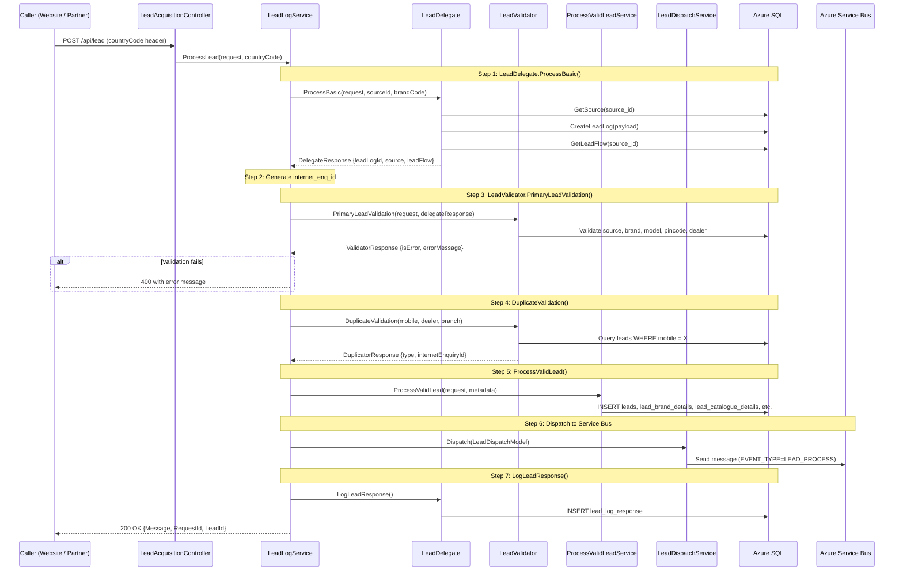

### 3.2 POST /api/b2b/lead — Facebook Webhook

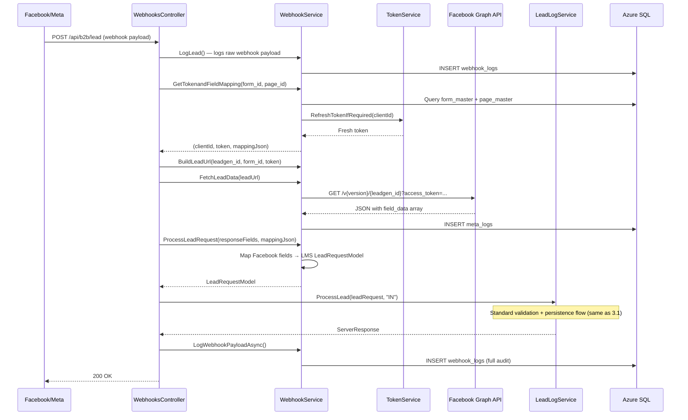

### 3.3 POST /api/lead/update — Lead Update

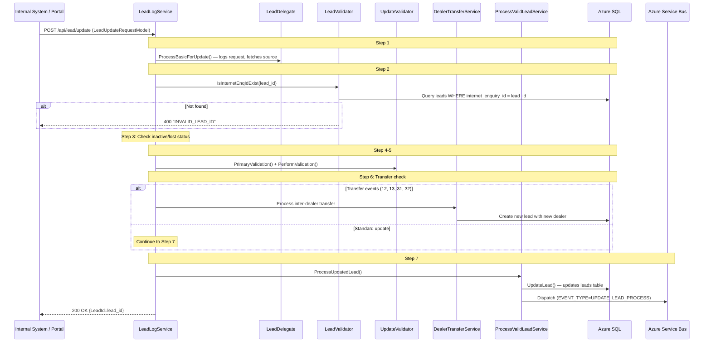

### 3.4 POST /api/leads/all — Lead Retrieval

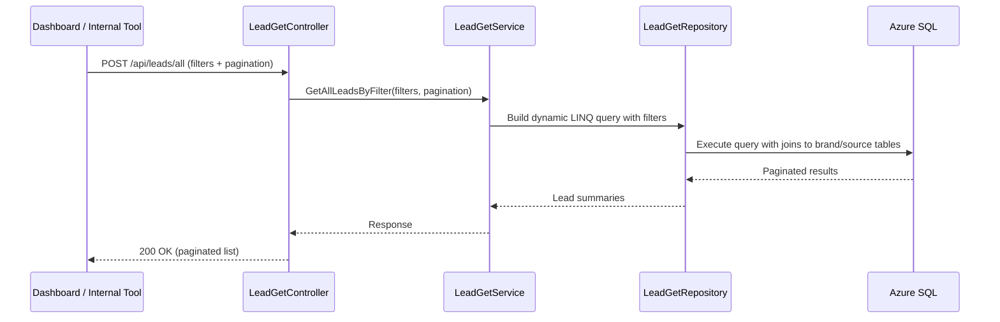


---

## 4. Internal Component Interactions

### 4.1 Dependency Injection Registration

Each service registers its dependencies in an `MvcExtensions.Register()` method called from `Startup.ConfigureServices()`. The pattern across all services:

| Registration Type | Used For | Why |
|-------------------|----------|-----|
| **Singleton** | `AppSettingsService`, `LeadDispatchService`, `ServiceBusClient`, `ContextFactory` | These are stateless and thread-safe; a single instance serves all requests, saving memory and initialization time |
| **Scoped** | All service classes, all repository classes | One instance per incoming request (or per Service Bus message processing scope). Ensures each message gets its own database context and clean state |
| **Transient** | Not used in this platform | — |

### 4.2 Service Bus Message Flow Between Services

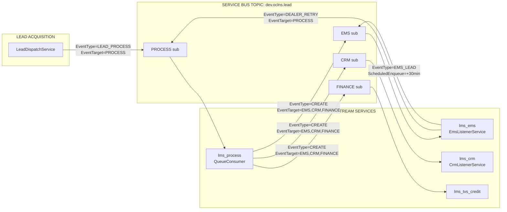

### 4.3 Scoped Service Resolution in Message Consumers

All Service Bus consumers follow the same pattern for handling messages:

1. Message arrives → consumer's `ProcessMessagesAsync` callback fires
2. Message is immediately completed (acknowledged) on the bus: `args.CompleteMessageAsync()`
3. A new DI scope is created: `_serviceProvider.CreateScope()`
4. The scoped service is resolved: `scope.ServiceProvider.GetRequiredService<ILeadService>()`
5. The business method is called with the deserialized message body
6. The scope is disposed (cleans up DbContext and other scoped resources)

This ensures each message gets its own fresh database context, preventing state leakage between messages.

### 4.4 Inter-Service Data Contract (LeadConsumeModel)

All downstream services receive the same core message structure:

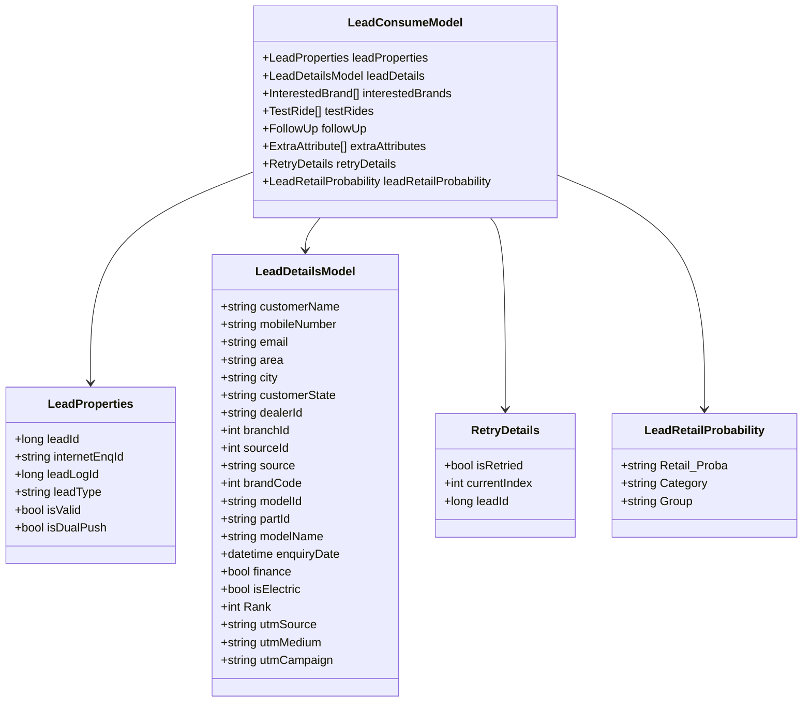


---

## 5. Database Schema (Tables, Relationships)

### 5.1 Write Operations by Service

| Service | Tables Written To | Operation |
|---------|-------------------|-----------|
| **Lead Acquisition** | `lead_logs` | INSERT — every incoming request (full JSON payload) |
| | `lead_log_response` | INSERT — response sent back to caller |
| | `leads` | INSERT — one row per valid unique lead |
| | `lead_brand_details` | INSERT — interested brands (1:N from leads) |
| | `lead_catalogue_details` | INSERT — model/variant selections |
| | `lead_extra_attributes` | INSERT — dynamic key-value fields |
| | `lead_test_rides` | INSERT — test ride bookings |
| | `lead_followups` | INSERT — follow-up records |
| | `lead_enquiry_tags` | INSERT — tags/labels |
| | `finance_details` | INSERT — finance eligibility |
| | `referral_customer_details` | INSERT — referral info |
| | `additional_details` | INSERT — extra customer data |
| | `duplicate_leads` | INSERT — duplicate detection records |
| | `lead_acquisition_logs` | INSERT — per-attempt status codes |
| | `latlong_push_logs` | INSERT — Latlong API call audit |
| | `webhook_logs` | INSERT — Facebook webhook payloads |
| | `meta_logs` | INSERT — Graph API request/response audit |
| | `lead_comms`, `comms_link_details` | INSERT — communications records |
| **Process Lead** | `classified_leads` | INSERT — LCE classification results |
| | `lead_push_logs` | INSERT — LCE API call audit |
| | `lead_event_logs` | INSERT — processing timeline events |
| | `lead_process_logs` | INSERT — processing outcome |
| | `leads` | UPDATE — dealer_id, branch_id (after Latlong allocation) |
| | `latlong_push_logs` | INSERT — Latlong API call audit |
| **EMS** | `lead_push_logs` | INSERT — every EMS API call attempt |
| | `leads` | UPDATE — ems_status field (1=success, -1=fail) |
| | `dealer_mediation_controls` | UPSERT — daily threshold count per dealer |
| | `lead_booking_details` | INSERT — booking records |
| **CRM** | `lead_push_logs` | INSERT — every CRM/CDP/CMP/Dialer/Rezo call |
| | `leads` | UPDATE — crm_status field |
| | `dealer_mediation_controls` | UPSERT — threshold tracking |
| **TVS Credit** | `lead_push_logs` | INSERT — TVS Credit API + CCP call logs |

### 5.2 Read Operations by Service

| Service | Tables Read From | Purpose |
|---------|------------------|---------|
| **Lead Acquisition** | `lead_sources` | Validate source_id and fetch source metadata |
| | `lead_flow_configuration` | Determine which validations and features are enabled per source |
| | `brand_master` | Validate brand_code and get default model/part |
| | `model_id_part_id_master` | Validate model_id + part_id combinations |
| | `pincode_master` | Validate Indian pincodes |
| | `country_master` | Validate country codes |
| | `dealer_master` + `dealer_locations` | Validate dealer_id is active |
| | `leads` | Duplicate detection (query by mobile + brand) |
| | `form_master`, `form_configurations`, `form_brand_mapping`, `page_master` | Facebook form → brand/source mapping |
| | `account_master` | Facebook account token management |
| **Process Lead** | `lead_flow_configuration` | Determine destination subscriptions |
| | `lce_threshold` | LCE probability threshold for EMS eligibility |
| **EMS** | `lead_sources` | Determine EMS event type (HO_LEADS, AGGREGATOR, EV) |
| | `lead_flow_configuration` | Check threshold, aggregator, retry, dual-push flags |
| | `dealer_mediation_controls` | Check if dealer has hit daily cap |
| **CRM** | `leads` | Fetch full lead data for update pushes |
| | `brand_master` | Get brand/variant display names |
| | `model_id_part_id_master` | Get model display names |
| | `dealer_master` | Get dealer display name |
| **TVS Credit** | `tvscredit_state_master` | Map state name → TVS Credit state code |
| | `tvscredit_city_master` | Map city name → TVS Credit city code |
| | `tvscredit_dealer_master` | Map LMS dealer_id → TVS Credit dealer code |

### 5.3 Key Database Constraints

| Constraint | Table | Purpose |
|------------|-------|---------|
| `UQ_DealerBranchActiveMobile` | `leads` | Prevents duplicate leads for same mobile + dealer + branch + active status. This is the database-level safety net for concurrent duplicate submissions. |
| Primary keys | All tables | Auto-incrementing `bigint` identity columns |
| Foreign keys | `lead_brand_details` → `leads` | Cascading relationship from lead to child detail tables |

### 5.4 Entity Relationship Diagram

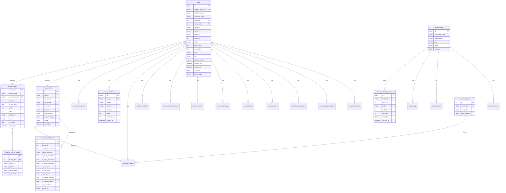

### 5.5 Core Table Definitions

#### leads (Master Lead Record)

| Column | Type | Constraints | Description |
|--------|------|-------------|-------------|
| `id` | `bigint` | PK, Identity | Auto-increment primary key |
| `internet_enquiry_id` | `varchar(50)` | Unique | Human-readable lead ID (e.g., "IEQ000012345") |
| `mobile_number` | `varchar(15)` | — | Customer phone number (10 digits for India) |
| `customer_name` | `nvarchar(100)` | — | Customer full name |
| `source_id` | `int` | FK → `lead_sources.id` | Lead source identifier |
| `brand_code` | `int` | FK → `brand_master.brand_code` | Vehicle brand |
| `model_id` | `varchar(255)` | — | Vehicle model identifier |
| `part_id` | `varchar(255)` | — | Vehicle variant/part identifier |
| `dealer_id` | `varchar(50)` | — | Assigned dealer SAP code |
| `branch_id` | `int` | — | Dealer branch number |
| `status` | `varchar(50)` | — | Lead lifecycle status |
| `ems_status` | `int` | — | EMS push result (1=success, -1=fail, 0=pending) |
| `crm_status` | `int` | — | CRM push result |
| `area` | `varchar(10)` | — | Customer pincode |
| `city` | `varchar(100)` | — | Customer city |
| `customer_state` | `varchar(100)` | — | Customer state |
| `enquiry_date` | `datetime` | — | When customer expressed interest |
| `created_at` | `datetime` | Default: UTC now | Record creation timestamp |
| `is_active` | `bit` | Default: 1 | Soft delete / active flag |
| `parent_lead` | `varchar(50)` | — | Parent lead's internet_enquiry_id (for duplicate families) |

#### brand_master

| Column | Type | Constraints | Description |
|--------|------|-------------|-------------|
| `brand_code` | `int` | PK | User-assigned brand identifier |
| `model_name` | `varchar(50)` | — | Brand display name (e.g., "Jupiter", "Apache") |
| `crm_brand_code` | `varchar(20)` | Not null, Unique | CRM system identifier |
| `crm_team` | `int` | — | CRM team assignment code |
| `is_dual_push` | `bit` | — | Whether both EMS and CRM receive leads |
| `visible` | `bit` | Default: 1 | UI visibility flag |
| `rank` | `int` | — | Brand rank for Latlong credential selection |
| `model_id` | `varchar(50)` | — | Default model ID |
| `part_id` | `varchar(50)` | — | Default part ID |
| `is_electric` | `bit` | — | EV flag |
| `created_on` | `datetime` | — | Record creation timestamp |

#### model_id_part_id_master

| Column | Type | Constraints | Description |
|--------|------|-------------|-------------|
| `id` | `int` | PK | Application-generated (MAX+1 strategy) |
| `brand_code` | `int` | FK → `brand_master.brand_code` | Parent brand |
| `model_id` | `varchar(255)` | — | Model identifier (e.g., "IQUBE") |
| `part_id` | `varchar(255)` | — | Variant identifier (e.g., "IQUBE_ST") |
| `model_name` | `varchar(255)` | — | Display name |
| `is_enabled` | `bit` | — | Active/inactive toggle |

#### lead_sources

| Column | Type | Constraints | Description |
|--------|------|-------------|-------------|
| `id` | `int` | PK | User-assigned source identifier |
| `source` | `varchar(max)` | — | Source name (e.g., "TVS Website", "BikeWale") |
| `ems_source` | `nvarchar(100)` | — | EMS system source label |
| `lce_source` | `nvarchar(100)` | — | LCE classification source label |
| `crm_source` | `nvarchar(100)` | — | CRM source label |
| `l1_source` | `varchar(100)` | — | L1 reporting category |
| `enq_mode_id` | `varchar(100)` | — | Enquiry mode identifier |
| `ems_event_type` | `nvarchar(50)` | — | Determines EMS endpoint (HO_LEADS, AGGREGATOR, EV) |
| `active` | `bit` | — | Active flag |
| `created_on` | `datetime` | — | Record creation timestamp |

#### event_configurator

| Column | Type | Constraints | Description |
|--------|------|-------------|-------------|
| `id` | `int` | PK, Identity | Auto-increment |
| `event_name` | `varchar(100)` | Unique | Event identifier (e.g., "LEAD_PROCESS") |
| `event_rules` | `nvarchar(max)` | — | JSON rules configuration |
| `event_attribute` | `varchar(100)` | — | Event attribute label |

### 5.6 Dealer Mediation Controls Table Structure

| Column | Type | Description |
|--------|------|-------------|
| `id` | `bigint` | PK, auto-increment |
| `dealer_id` | `varchar` | Dealer SAP code |
| `branch_id` | `int` | Branch number |
| `bucket` | `varchar` | Date bucket formatted as "yyyyMMdd" (e.g., "20260617") |
| `pushed_count` | `int` | Number of leads pushed to this dealer today |
| `threshold` | `int` | Maximum allowed leads per day |
| `created_at` | `datetime` | Record creation timestamp |
| `updated_at` | `datetime` | Last update timestamp |

Usage: On each successful EMS push, `pushed_count` is incremented. When `pushed_count >= threshold`, subsequent leads are delayed to next day.


---

## 6. Request / Response Lifecycle

### 6.1 Successful New Lead — Complete Lifecycle

```
TIME    COMPONENT               ACTION                              DATABASE WRITES
─────   ─────────               ──────                              ───────────────
T+0ms   Controller              Receives POST /api/lead             —
T+5ms   LeadDelegate            Fetches source config               SELECT lead_sources, lead_flow_configuration
T+10ms  LeadDelegate            Logs incoming request               INSERT lead_logs → returns leadLogId
T+12ms  Util                    Generates internetEnqId             — (pure computation: "IEQ" + padded ID)
T+20ms  LeadValidator           Runs 15+ validation checks          SELECT brand_master, model_id_part_id_master, pincode_master
T+50ms  LeadValidator           Duplicate check                     SELECT leads WHERE mobile = X
T+55ms  ProcessValidLeadService Creates lead record                 INSERT leads → returns leadId
T+60ms  ProcessValidLeadService Inserts detail records              INSERT lead_brand_details, lead_catalogue_details, etc.
T+70ms  LeadDispatchService     Publishes to Service Bus            — (Azure SDK call)
T+75ms  LeadDelegate            Logs response                       INSERT lead_log_response
T+80ms  Controller              Returns 200 OK to caller            —

TOTAL: ~80ms from receipt to response (asynchronous processing begins after this)

T+100ms   QueueConsumer (lms_process) picks up message from PROCESS subscription
T+150ms   LeadClassifyService calls LCE API                         INSERT classified_leads, lead_push_logs
T+300ms   LatlongService calls dealer API (if needed)               INSERT latlong_push_logs, UPDATE leads
T+400ms   DispatchService publishes to EMS, CRM, FINANCE            INSERT lead_process_logs, lead_event_logs
T+500ms   EmsListenerService picks up from EMS subscription
T+600ms   EmsService calls TVS EMS API                              INSERT lead_push_logs, UPDATE leads (ems_status)
T+500ms   CrmListenerService picks up from CRM subscription
T+700ms   CdpService calls CDP API                                  INSERT lead_push_logs
T+500ms   TvscreditListener picks up from FINANCE subscription
T+800ms   TvscreditService calls TVS Credit API                     INSERT lead_push_logs
```

### 6.2 Response Model Structure

All lead endpoints return a `ServerResponse<long>`:

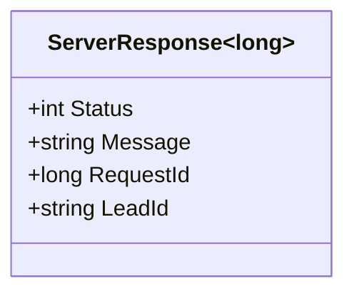

### 6.3 Error Response Examples

| Scenario | Status | Message | RequestId | LeadId |
|----------|--------|---------|-----------|--------|
| Valid new lead | 200 | "Success" | 12345 | "IEQ000012345" |
| Duplicate (same dealer) | 200 | "DUPLICATE_LEAD" | 12346 | "IEQ000009999" (original) |
| Duplicate (different dealer) | 200 | "DUPLICATE_LEAD" | 12347 | "IEQ000012347" (new child) |
| Invalid mobile number | 400 | "Invalid mobile number" | 12348 | "" |
| Invalid brand code | 400 | "Invalid brand code" | 12349 | "" |
| Invalid source | 400 | "Invalid source" | 12350 | "" |
| Parallel duplicate (DB constraint) | 400 | "Parallel Requests Received" | 12351 | "" |
| Server error | 500 | "Server Error" | 12352 | "" |


---

## 7. Validation Logic

### 7.1 Primary Lead Validation (LeadValidator.PrimaryLeadValidation)

Validations are executed in strict sequential order. The first failure short-circuits and returns immediately.

| # | Check | Condition for Failure | Error Code | Error Message |
|---|-------|----------------------|------------|---------------|
| 1 | Source exists | `source_id` not found in `lead_sources` table | 3 | "Invalid source" |
| 2 | Lead flow configured | No row in `lead_flow_configuration` for this source | 13 | "Lead flow is not configured for the source" |
| 3 | Country code | Flow requires country code AND code not in `country_master` | 11 | "INVALID_COUNTRY_CODE" |
| 4 | Mobile number | Flow requires mobile AND (null OR length ≠ 10 OR fails regex) | 2 | "Invalid mobile number" |
| 5 | Enquiry date format | Cannot parse with format `yyyy-MM-dd HH:mm:ss.fff` | 4 | "Invalid/missing Enquiry Date" |
| 6 | Enquiry date future | Parsed date > UTC now | 4 | "Enquiry date cannot be in future" |
| 7 | Brand code required | Flow requires brand AND brand_code = 0 | 1 | "Brand code should be greater than 0" |
| 8 | Brand code valid | brand_code not found in `brand_master` | 1 | "Invalid brand code" |
| 9 | Model ID required | Flow requires model AND model_id is null | 6 | "Model Id is missing" |
| 10 | Part ID required | Flow requires model AND part_id is null | 6 | "Part_id is missing" |
| 11 | Model+Part valid | Combination not found in `model_id_part_id_master` | 6 | "Invalid model or part id" |
| 12 | Follow-up dates | next_follow_up_date fails format or is in the past | 4 | "Invalid/missing next follow up date" |
| 13 | Alternate mobile | additional_details.alternative_mobile fails validation | 2 | "Invalid mobile number" |
| 14 | Consent date | consent_date fails format or is in future | 4 | "Invalid/missing consent date" |
| 15 | Pincode valid | Flow requires pincode AND pincode not in `pincode_master` (6 digits, numeric) | 12 | "INVALID_PINCODE" |
| 16 | Test rides valid | Test ride brand/model/dates fail validation | varies | varies |
| 17 | Interested brands | Brand/model combinations invalid | varies | varies |
| 18 | Latlong allocation | Flow enables Latlong AND no dealer could be assigned | 8 | "Failed to allocate dealer for the area" |
| 19 | Dealer mandatory | Flow requires dealer AND dealer_id is empty | 8 | "Dealer Id is missing" |
| 20 | Dealer active | dealer_id + branch_id not found as active in `dealer_master` | 8 | "Invalid/Inactive Dealer or Branch" |
| 21 | Customer name | Flow requires name AND (name empty OR length > 100) | 7 | "Missing customer name" / "Customer Name cannot exceed 100 characters" |
| 22 | Referral details | Referral mobile number fails validation | 19/20 | "Invalid/Missing referral mobile number" |
| 23 | Extra attributes | Any attribute has null key or null value | 22 | "Extra attribute name/value cannot be null" |

### 7.2 Mobile Number Validation Rules

The mobile number validation uses a configurable regex stored in `lead_flow_configuration.MobileValidation`:

- Must be exactly 10 characters long
- Must match the per-source regex pattern (if configured)
- Regex is executed with a 100ms timeout to prevent ReDoS attacks

### 7.3 Duplicate Detection Algorithm (LeadValidator.DuplicateValidation)

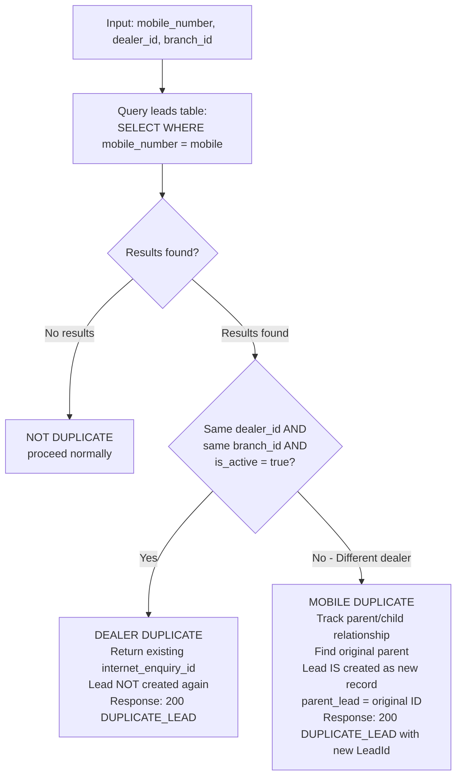

### 7.4 Flow Configuration Flags

The `lead_flow_configuration` table controls behavior per source:

| Flag | When TRUE | When FALSE |
|------|-----------|------------|
| `IsMobileMandatory` | Mobile number is validated | Mobile can be null |
| `IsBrandMandatory` | Brand code must be provided | Brand is optional |
| `IsModelMandatory` | Model + Part IDs must be provided | Model is optional (defaults assigned) |
| `IsDealerMandatory` | Dealer must be specified in request | Dealer is optional/auto-assigned |
| `IsNameMandatory` | Customer name is required | Name is optional |
| `IsPincodeMandatory` | Pincode must be valid 6-digit Indian pincode | Pincode is optional |
| `IsLatlongEnabled` | System calls Latlong.in to auto-assign nearest dealer | Dealer must be provided by caller |
| `IsCountryCodeMandatory` | countryCode header must match country_master | Country code ignored |
| `IsEmsPush` | Lead is pushed to EMS | EMS is skipped |
| `IsCrmPush` | Lead is pushed to CRM | CRM is skipped |
| `IsCmpPush` | Push notification is triggered | No notification |
| `IsFinanceEnabled` | Finance-eligible leads go to TVS Credit | Finance skipped |
| `IsDualPush` | Both EMS and CRM receive the lead | Only one receives |
| `IsLceEnabled` | Lead Classification Engine is called | Default classification used |
| `IsLceThresholdEnabled` | LCE probability checked against threshold | All leads go to EMS |
| `IsThresholdEnabled` | Dealer daily cap is enforced | No cap |
| `IsRetryEnabled` | Failed EMS pushes trigger dealer re-allocation | Failures are terminal |
| `IsTestRideMandatory` | Test ride details required | Test ride optional |
| `IsAggregator` | Uses aggregator EMS endpoint | Uses HO endpoint |


---

## 8. Error Handling

### 8.1 Lead Acquisition Service Error Handling

| Error Scenario | Handling Strategy | User Impact |
|----------------|-------------------|-------------|
| Validation failure | Logged in `lead_log_response` with error code and message | Caller receives 400 with specific error message |
| Database unique constraint violation (`UQ_DealerBranchActiveMobile`) | Caught specifically by checking `InnerException.Message.Contains(...)` | Returns 400 "Parallel Requests Received" — not a 500 error |
| Unhandled exception in ProcessLead | Caught in outer try/catch, logged via `ILogger.LogError` | Returns 500 "Server Error" (generic message, details not exposed) |
| Facebook webhook — token not found | Returns 400 "Token not found" | Facebook receives error, will retry webhook delivery |
| Facebook webhook — Graph API fails | `HandleExceptionAsync` logs to `meta_logs`, returns 500 | Facebook retries |
| Service Bus publish failure | Exception propagates to caller | Caller receives 500 (lead is already persisted in DB, can be re-dispatched manually) |

### 8.2 Process Lead Service Error Handling

| Error Scenario | Handling Strategy | Recovery |
|----------------|-------------------|----------|
| LCE API failure | Returns default classification (e.g., "HOT" category) | Lead still processes with default classification — no data loss |
| LCE API returns non-success status | Same as above — uses `config.DefaultClassification` value | Graceful degradation |
| Latlong API failure | Returns null → `config.IsEmsPush` set to false | Lead skips EMS but still goes to CRM/Finance |
| Latlong token request fails | Returns null → no dealer allocated | Lead processed without dealer assignment |
| Service Bus dispatch failure | Exception caught and logged | Message is already completed (acknowledged) — lead data is in DB but won't reach downstream (requires manual intervention) |
| Any unhandled exception in TwoWheelerService | Caught in outer try/catch, logged | Message is lost from queue but lead exists in DB |

### 8.3 EMS Service Error Handling

| Error Scenario | Handling Strategy | Recovery |
|----------------|-------------------|----------|
| EMS API returns success + "threshold exceeded" | `EmsDelegate.UpdateThreshold()` updates daily count, `DispatchThresholdDelay()` schedules next-day delivery | Lead auto-retries next day at 18:40 UTC (next day midnight IST - 5h20m) |
| EMS API returns 400 with dealer/branch error | `HandleDealerRetry()` publishes back to PROCESS subscription with `isRetried=true` and incremented `currentIndex` | Process Lead Service re-runs dealer allocation, skipping the failed dealer |
| EMS API returns 400 with dealer error AND currentIndex ≥ 5 | Stops retrying, calls `HandleCrmPush()` to push to CRM as fallback | Lead reaches CRM even though EMS failed after 5 dealer attempts |
| EMS API returns 500 / timeout | `HandleInternalServerErrorResponse()` schedules 30-minute delayed retry | Lead auto-retries after 30 minutes |
| EMS API throws WebException | Status code extracted from response, logged, then 30-minute retry | Same as above |
| Dual push triggered | If `IsDualPush=true` AND CRM hasn't received the lead yet | CRM subscription also gets the lead |

### 8.4 CRM Service Error Handling

| Error Scenario | Handling Strategy | Recovery |
|----------------|-------------------|----------|
| CDP token fetch fails | `cachedAccessToken` set to null, exception thrown | Next message will re-attempt token fetch |
| CDP push fails (non-200) | `cachedAccessToken` cleared, status=-1 logged to `lead_push_logs` | No automatic retry — logged for manual review |
| CCP token fetch fails | Exception thrown, logged | Token will be re-fetched on next message |
| CCP push fails | Status=-1 logged, no retry | Manual review via push logs |
| CMP token expired | Checks `tokenExpirationTime`; if expired, requests new token (with 120s buffer before actual expiry) | Automatic refresh |
| Dialer push fails | Exception caught, status=-1 logged | No automatic retry |
| Rezo push — non-premium brand | Immediately returns (brand code filter: `REZO_PREMIUM_BRAND`) | Lead simply skips Rezo — not an error |

### 8.5 TVS Credit Service Error Handling

| Error Scenario | Handling Strategy | Recovery |
|----------------|-------------------|----------|
| State/city code not found | `statecityInfoModel` is null → CityCode/StateCode left empty in request | TVS Credit API receives incomplete data |
| Dealer code not found | Empty string sent as dealer code | TVS Credit API may reject |
| TVS Credit API returns LeadId = "-1" | Status set to -1, statusCode=400, logged | No automatic retry |
| TVS Credit API throws WebException | Status code extracted, logged | No automatic retry |
| EV source filtering | If `isElectric=true` AND source NOT in `EV_CCP_SOURCES` config → skips CCP push | By design — not an error |

### 8.6 Service Bus Consumer Error Handling (All Services)

All consumers follow the same pattern:

1. **Message is completed BEFORE processing** — this means the message is removed from the queue immediately upon receipt
2. **Errors during processing do NOT cause message redelivery** — if processing fails, the message is gone from the queue
3. **Recovery relies on database state** — since leads are persisted before dispatch, any failed downstream processing can be identified by querying `lead_push_logs` for missing or failed entries
4. **ProcessErrorAsync callback** — logs Service Bus infrastructure errors (connection issues, serialization failures) but does not attempt recovery


---

## 9. Key Algorithms and Business Rules

### 9.1 Internet Enquiry ID Generation

The `internet_enquiry_id` is a human-readable unique identifier for each lead:

```
Format: "IEQ" + zero-padded leadLogId (padded to ensure consistent length)
Example: leadLogId = 12345 → "IEQ000012345"

Generated by: Util.GenerateInternetEnqId(delegateResponse.leadLogId)
Timing: Generated AFTER the lead_logs insert (which provides the auto-increment ID)
```

### 9.2 Latlong.in Dealer Allocation Algorithm

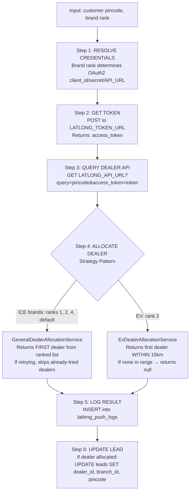

### 9.3 Lead Classification Engine (LCE) Algorithm

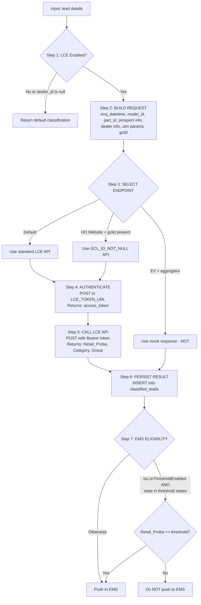

### 9.4 Destination Routing Algorithm (TwoWheelerService.GetDestinations)

This algorithm determines which downstream services receive the lead:

```
Inputs: leadConsumeModel, delegateResponse (contains classification + config)

Rules (applied in order, destinations accumulate):

1. IF lead is DUPLICATE type → destinations = [EMS only] → RETURN

2. IF source is in ICE_COMMS_SOURCES → ADD "COMMS" subscription

3. IF source is in EV_COMMS_SOURCES → ADD "COMMS" subscription

4. IF source is EV_OTHER_CITY_SOURCE AND brand in NEW_BRAND_CODES → ADD "COMMS"

5. IF (IsFinanceEnabled AND customer wants finance)
   OR (state in CREDIT_PUSH_STATES AND non-digital source excluded AND ICE brand):
   → ADD "FINANCE" subscription

6. IF lead is NOT valid (partial lead):
   → IF IsCrmPush OR IsDualPush → ADD "CRM"
   → RETURN (no EMS for invalid leads)

7. IF IsEmsPush AND LCE verified AND NOT a booking-change lead type:
   → ADD "EMS" subscription

8. IF IsCrmPush OR isDualPush OR (CMB offline source AND rank=4):
   → ADD "CRM" subscription

9. IF IsCmpPush AND source is aggregator → ADD "CMP_AGGREGATOR" subscription
   ELSE IF IsCmpPush → ADD "CMP" subscription
```

### 9.5 Dealer Threshold Algorithm

```
Purpose: Prevent any single dealer outlet from being overwhelmed with leads in one day.

TRACKING:
- Table: dealer_mediation_controls
- Key: dealer_id + branch_id + bucket (formatted as "yyyyMMdd")
- Value: pushed_count (incremented on each successful EMS push)

ENFORCEMENT (in EMS Service):
- Before pushing to EMS API, EmsDelegate checks:
  IF pushed_count >= threshold → isThresholdExceeded = true
  
WHEN THRESHOLD EXCEEDED:
- Lead is NOT pushed to EMS today
- A scheduled Service Bus message is created:
  - EventType = "THRESHOLD_LEAD_EVENT"
  - ScheduledEnqueueTime = next day at 18:40 UTC (which is ~00:10 IST next day)
- Next day, the message is picked up and re-processed with a fresh threshold count

NEXT-DAY SCHEDULING FORMULA:
  DateTimeOffset.Now.AddDays(1).Date.AddHours(-5).AddMinutes(-20)
  → This targets approximately midnight IST (UTC+5:30) minus a buffer
```

### 9.6 EMS Request Model Selection

The EMS service selects different request payloads based on the lead source's `EmsEventType` field:

| EmsEventType | Model Class | Description |
|--------------|-------------|-------------|
| `HO_LEADS` | `EmsHoModel` | Standard head-office lead format |
| `AGGREGATOR_LEADS` | `EmsAggregatorModel` | Aggregator-specific format with different field names |
| `EV_LEADS` | `EmsEvModel` | Electric vehicle lead format |
| `EV_TEST_RIDE` | `EmsEvTestRideModel` | EV test ride booking format |
| (default) | `EmsHoModel` | Falls back to HO format |

### 9.7 CRM Dual Push Logic

The "dual push" feature ensures both EMS and CRM receive a lead under certain conditions:

```
A lead gets pushed to CRM (in addition to EMS) when:
1. lead_flow_configuration.IsDualPush = true AND
   (LCE says don't push to EMS → CRM gets it as compensation)
   OR (lead was marked as isDualPush at acquisition time)
   OR (customer state = "Maharashtra" AND brand in BRAND_CODE list)
   OR (customer state in COMMUTER_DUAL_PUSH_STATES)

2. EMS push fails with dealer error → CRM receives as fallback
   (only if IsDualPush=true AND IsCrmPush=false AND lead hasn't already gone to CRM)
```

### 9.8 Token Caching Strategies

| Service | External System | Cache Type | Duration | Refresh Trigger |
|---------|----------------|------------|----------|-----------------|
| CRM | CCP (Salesforce) | Static variable + cached response | 23 hours (via `InvokeCCPToken` implementation) | On token expiry or null |
| CRM | CDP (Salesforce) | Static `cachedAccessToken` | Until API returns non-success (then cleared) | Set to null on any failure |
| CRM | CMP | Static `cachedAccessToken` + `tokenExpirationTime` | `ExpiresIn - 120` seconds | Checked before each call |
| TVS Credit | CCP | Same pattern as CRM CCP | 23 hours | On expiry |
| Process Lead | LCE | No caching (fresh token per request) | — | Every classification call |
| Process Lead | Latlong.in | No caching (fresh token per request) | — | Every dealer lookup call |


---

## 10. Configuration Handling

### 10.1 Configuration Loading Pattern

All five services use the same configuration loading pattern:

```
1. Startup constructor builds configuration:
   ConfigurationBuilder
     .AddJsonFile("appsettings.json")                    ← base config (defaults)
     .AddJsonFile($"appsettings.{Environment}.json")     ← environment-specific overrides
     .AddEnvironmentVariables()                          ← runtime overrides (highest priority)

2. AppSettingsService (registered as Singleton):
   - Reads the same configuration stack in its constructor
   - Exposes each key as a typed C# property
   - All service classes receive AppSettingsService via constructor injection

3. Priority (highest to lowest):
   Environment Variables > appsettings.{env}.json > appsettings.json
```

### 10.2 Lead Acquisition Service Configuration Keys

| Category | Key | Purpose |
|----------|-----|---------|
| **Database** | `DB_CONNECTION` | Azure SQL Server connection string |
| **Service Bus** | `SERVICE_BUS_CONNECTION_STRING` | Azure Service Bus connection |
| | `TOPIC_NAME` | Target topic name (e.g., "dev.oclns.lead") |
| **Event Labels** | `EVENT_TARGET_VALUE` | Target for dispatch messages ("PROCESS") |
| | `EVENT_SOURCE_VALUE` | Source identifier ("LEAD_ACQUISITION") |
| | `LEAD_PROCESS` | Event type for new leads |
| | `PARTIAL_LEAD_PROCESS` | Event type for partial leads |
| | `UPDATE_LEAD_PROCESS` | Event type for updates |
| **External APIs** | `OLD_LMS_URL` | Legacy LMS callback URL |
| | `EMS_SEARCH_API_URL` | EMS search endpoint |
| | `API_KEY_VALUE` | API key for inbound auth |
| **Latlong.in** | `LATLONG_TOKEN_URL` | OAuth2 token endpoint |
| | `LATLONG_RONIN_CLIENT_ID/SECRET` | Ronin brand credentials |
| | `LATLONG_RTR_CLIENT_ID/SECRET` | RTR brand credentials |
| | `LATLONG_COMMON_CLIENT_ID/SECRET` | Common brand credentials |
| | `LATLONG_3W_CLIENT_ID/SECRET` | Three-wheeler credentials |
| | `LATLONG_EV_CLIENT_ID/SECRET` | EV brand credentials |
| | `LATLONG_*_API_URL` | Per-brand API endpoints |
| **Facebook** | `FacebookSettings:version` | Graph API version |
| **Cache** | `REDIS_CONNECTION` | Azure Redis connection |
| **Secrets** | `KeyVault` (section) | Azure Key Vault configuration |
| **Observability** | `OpenTelemetry_ServiceName` | Service name for traces |
| | `OpenTelemetry_Endpoint` | OTLP collector URL |
| | `OpenTelemetry_*_MaxQueueSize` | Batch processor tuning |

### 10.3 Process Lead Service Configuration Keys

| Category | Key | Purpose |
|----------|-----|---------|
| **Service Bus** | `TOPIC_NAME`, `PROCESS_SUBSCRIPTION` | Main consumer configuration |
| | `EMS_SUBSCRIPTION`, `CRM_SUBSCRIPTION`, `FINANCE_SUBSCRIPTION` | Fan-out destination labels |
| | `CMP_SUBSCRIPTION`, `CMP_AGGREGATOR_SUBSCRIPTION`, `COMMS_SUBSCRIPTION` | Notification targets |
| | `EVENT_SOURCE_VALUE` | Source label for dispatched messages |
| | `THRESHOLD_EVENT_TYPE` | Event type for threshold-delayed messages |
| **MDP** | `MDP_TOPIC_NAME`, `MDP_LMS_SUBSCRIPTION`, `MDP_CONNECTION_STRING` | Separate Service Bus for MDP |
| **LCE** | `LCE_URL` | Default LCE API URL |
| | `LCE_TOKEN_URL` | OAuth2 token endpoint for LCE |
| | `LCE_CLIENT_ID`, `LCE_CLIENT_SECRET` | LCE OAuth2 credentials |
| | `LCE_HO_WEBSITE_API` | Alternative LCE URL for HO leads with GCLID |
| | `LCE_AGGREGATOR_EV_API` | LCE URL for aggregator EV leads |
| **Latlong.in** | Same structure as Lead Acquisition | Per-brand OAuth2 credentials |
| **Legacy** | `OLD_LMS_URL` | Legacy system callback |

### 10.4 EMS Service Configuration Keys

| Category | Key | Purpose |
|----------|-----|---------|
| **Service Bus** | `TOPIC_NAME`, `EMS_SUBSCRIPTION` | Consumer configuration |
| | `BOOKING_TOPIC_NAME`, `BOOKING_SUBSCRIPTION`, `BOOKING_SERVICE_BUS_CONNECTION_STRING` | Separate booking queue |
| | `PROCESS_SUBSCRIPTION` | Target for dealer retry messages |
| | `CRM_SUBSCRIPTION` | Target for CRM fallback push |
| | `EMS_TARGET` | Target label for threshold-delayed messages |
| **EMS API** | `EMS_API_URL` | TVS EMS HO endpoint |
| | `EMS_API_AGGREGATOR_URL` | TVS EMS aggregator endpoint |
| | `API_KEY_VALUE` | API key for EMS auth header |
| **Tuning** | `MAX_SESSIONS` | Concurrency limit |

### 10.5 CRM Service Configuration Keys

| Category | Key | Purpose |
|----------|-----|---------|
| **Service Bus** | `TOPIC_NAME`, `CRM_SUBSCRIPTION` | Consumer configuration |
| **CRM API** | `CRM_URL`, `CRM_KEY` | Legacy CRM API |
| **CCP (Salesforce)** | `CCP_URL`, `CCP_TOKEN_URL`, `CCP_CLIENT_ID`, `CCP_CLIENT_SECRET`, `CCP_RECORD_TYPE_ID` | Salesforce OAuth2 + record type |
| **CMP** | `CMP_URL`, `CMP_TOKEN_URL`, `CMP_CLIENT_ID`, `CMP_CLIENT_SECRET` | Push notification OAuth2 |
| | `CMP_EV_URL`, `CMP_CLIENT_ID_EV`, `CMP_CLIENT_SECRET_EV` | EV-specific CMP |
| | `CMP_ENDPOINT` | CMP API path suffix |
| **CDP** | `CDP_URL` | Customer Data Platform endpoint |
| **Dialer** | `DIALER_URL`, `DIALER_TOKEN_URL` | Auto-dialer API + OAuth2 |
| **Rezo** | `REZO_API_URL`, `REZO_AUTH_KEY` | AI voice API + API key |
| **Legacy** | `OLD_LMS_URL` | Legacy LMS callback |
| **State Validation** | `StateSettings:StateSource` (JSON array) | Valid Indian state names for CRM mapping |

### 10.6 TVS Credit Service Configuration Keys

| Category | Key | Purpose |
|----------|-----|---------|
| **Service Bus** | `TOPIC_NAME`, `SUBSCRIPTION_NAME` | Consumer configuration |
| **TVS Credit API** | `TVS_CREDIT_LEAD_PUSH_URL` | Finance lead submission endpoint |
| | `TVS_CREDIT_DEALER_URL` | Dealer code lookup endpoint |
| | `PRODUCT_CODE`, `CHANNEL_CODE`, `AGENCY_CODE` | Fixed codes for TVS Credit requests |
| **CCP (Salesforce)** | Same keys as CRM service | Salesforce OAuth2 |
| **Filtering** | `EV_CCP_SOURCES` | Comma-separated source IDs for EV CCP routing |

### 10.7 Startup and Middleware Pipeline

All services share a consistent middleware pipeline configuration:

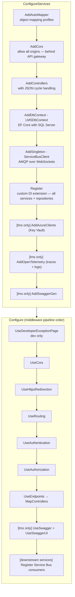


---

## 11. Testing Strategy

### 11.1 Overview

| Aspect | Detail |
|--------|--------|
| Framework | xUnit |
| Mocking | Moq, NSubstitute |
| Assertions | FluentAssertions, xUnit Assert |
| Coverage Tool | Coverlet (Cobertura XML output) |
| Test Project | `LMSUnitTest` (in `lms` repo) |

### 11.2 Test Coverage by Service

| Service | Test Project | Scope |
|---------|-------------|-------|
| Lead Acquisition (`lms`) | `LMSUnitTest` | Validators, Services, Controllers, Delegates |
| Process Lead (`lms_process`) | `ProcessLeadTest` | Lead routing, classification, dispatch |
| EMS (`lms_ems`) | — | No dedicated test project |
| CRM (`lms_crm`) | — | No dedicated test project |
| TVS Credit (`lms_tvs_credit`) | — | No dedicated test project |

### 11.3 Test Approach

- **Unit tests only** — all tests mock dependencies (repositories, external services) via Moq/NSubstitute. No integration or end-to-end tests.
- **Service layer focus** — validators and business logic services are the primary test targets.
- **Repository layer not tested** — repositories interact with EF Core DbContext and are excluded from unit tests.
- **Controller tests** — verify route parameter binding, HTTP status code forwarding, and exception handling.

### 11.4 Running Tests

```bash
# Run all tests
dotnet test LMSUnitTest/LMSUnitTest.csproj

# Run with code coverage
dotnet test LMSUnitTest/LMSUnitTest.csproj --collect:"XPlat Code Coverage"
```

### 11.5 Key Test Categories

| Category | Example Test Files | What They Validate |
|----------|-------------------|-------------------|
| Validation | `BrandValidatorTests`, `ModelValidatorTests`, `LeadSourceValidatorTests`, `LeadFlowConfigurationValidatorTests`, `EventConfiguratorValidatorTests` | Field-level validation rules, uniqueness checks, max length enforcement |
| Lead Processing | `LeadAcquisitionTests`, `LeadLogUnitTests`, `DelegateUnitTests` | End-to-end lead submission orchestration |
| Duplicate Detection | `ProcessDuplicateLeadServiceTests` | Dealer-level and mobile-level duplicate handling |
| Updates | `UpdateLeadServiceTests`, `UpdateValidatorTests` | Lead update validation and processing |
| Webhooks | `WebhookServiceTests`, `TokenServiceUnitTests` | Facebook/Google webhook handling and token lifecycle |
| Master APIs | `MasterControllerTests`, `MasterServiceTests` | Master data CRUD operations |
| Dispatch | `LeadDispatchServiceTests` | Service Bus message publishing |

---

## 12. Glossary

| Term | Plain English | Technical Detail |
|------|---------------|-----------------|
| **Scoped Lifetime** | A fresh instance created for each incoming request or message | In ASP.NET Core DI, `AddScoped<T>()` creates one instance per HTTP request or per `IServiceScope`. Used for services that hold request-specific state (like DbContext). |
| **Singleton Lifetime** | A single instance shared across the entire application lifetime | `AddSingleton<T>()` — used for stateless, thread-safe services like configuration providers and Service Bus clients. |
| **DI (Dependency Injection)** | A technique where classes receive their dependencies from outside rather than creating them internally | The framework's IoC container provides instances to constructors. Registered in `MvcExtensions.Register()`. |
| **DbContext** | The bridge between C# code and the database | Entity Framework Core's `LMSDbContext` — represents a session with the database, tracks changes, and generates SQL. |
| **Entity** | A C# class that maps to a database table | Each property maps to a column. Decorated with data annotations (`[Table]`, `[Column]`, `[Key]`). |
| **DTO (Data Transfer Object)** | A simple object used to move data between layers without business logic | Examples: `LeadRequestModel` (incoming API data), `LeadDispatchModel` (Service Bus message body). |
| **LeadConsumeModel** | The standard message format consumed by all downstream services | Contains `leadProperties`, `leadDetails`, `interestedBrands[]`, `testRides[]`, `retryDetails`. |
| **LeadDispatchModel** | The message format published by Lead Acquisition and Process Lead services | Extended version of LeadConsumeModel with additional metadata. |
| **ServiceBusMessage** | A message sent via Azure Service Bus | Contains a body (JSON string) and ApplicationProperties (EventType, EventTarget, etc.). |
| **ApplicationProperties** | Metadata attached to a Service Bus message for routing/filtering | Used to route messages to the correct subscription without deserializing the body. |
| **MaxConcurrentCalls** | How many messages a consumer processes simultaneously | Set to 1 in all services — means sequential processing per instance. Scale via replicas. |
| **AutoCompleteMessages** | Whether the SDK automatically acknowledges messages | Set to `false` — messages are manually completed before processing begins. |
| **ScheduleMessageAsync** | Sends a message that becomes visible only after a specified time | Used for 30-minute EMS retries and next-day threshold delays. |
| **DelegateResponse** | An internal model returned by the setup/delegate step | Contains: `leadLogId`, `source` metadata, `leadFlow` configuration, `brand` details. |
| **ValidatorResponse** | The result of a validation check | Contains: `isError` (bool), `errorMessage` (string), `errorCode` (int). |
| **DuplicatorResponse** | The result of duplicate detection | Contains: `isError`, `type` ("dealer"/"mobile"), `internetEnquiryId` of original, `leadId`, `children`. |
| **LeadFlowConfig** | Per-source configuration that controls the entire lead processing pipeline | Loaded from `lead_flow_configuration` table. Contains 20+ boolean flags. |
| **LCE (Lead Classification Engine)** | An ML-based API that predicts how likely a lead is to convert to a sale | Returns probability score + category (HOT/WARM/COLD). |
| **Retail_Proba** | The numeric probability score from LCE | Compared against `lce_threshold` table value to determine EMS eligibility. |
| **Latlong.in** | Third-party geolocation-based dealer discovery service | Accepts a pincode, returns ranked list of nearby authorized dealers with distance. |
| **Brand Rank** | A numeric identifier for the vehicle brand family | 1=Ronin, 2=RTR (Apache), 3=EV (iQube), 4=Three-Wheeler, default=Common (Jupiter, etc.). Determines which Latlong API credentials to use. |
| **internet_enquiry_id** | The public-facing unique identifier for a lead | Format: "IEQ" + zero-padded numeric ID. Used in all external API calls and customer-facing systems. |
| **lead_logs** | The audit table recording every incoming request | One row per API call, regardless of whether the lead was valid. Contains the full JSON payload. |
| **lead_push_logs** | The audit table recording every outgoing API call | One row per push attempt to any external system. Contains request JSON, response, status code. |
| **dealer_mediation_controls** | The threshold tracking table | Tracks how many leads each dealer has received today. Prevents overwhelming dealers. |
| **Fan-out** | Publishing one message that reaches multiple subscribers | Process Lead Service sends one message with `EventTarget="EMS,CRM,FINANCE"` — each subscription picks it up independently. |
| **Dual Push** | A business rule that sends a lead to both EMS and CRM | Normally only one receives it; dual push ensures both systems have the lead for certain states/brands. |
| **Event-driven** | Services react to events (messages) rather than being called directly | No service makes HTTP calls to another service. All communication is via Azure Service Bus. |
| **AMQP over WebSockets** | The protocol used for Service Bus connections | Uses port 443 (standard HTTPS port), avoiding firewall issues in corporate networks. |
| **SemaphoreSlim** | A concurrency limiter | Used in Process Lead's `ApiExchangeService` to limit concurrent calls to Legacy LMS to 3. |
| **AutoMapper** | A library that automatically maps properties between objects | Maps entity objects ↔ DTOs. Configured in `AutoMapping.cs` profile classes. |
| **FluentValidation** | A library for building validation rules in a readable chain syntax | Referenced in `lms` project but actual validation is implemented manually in `LeadValidator`. |
| **Strategy Pattern** | A design pattern where an algorithm is selected at runtime | Used in `DealerAllocationFactory` — returns `EvDealerAllocationService` or `GeneralDealerAllocationService` based on brand rank. |

---

*End of Document*

*This LLD reflects the codebase as analyzed in July 2026. Update this document when significant implementation changes are made to any of the five services.*
