# Low Level Design Document
# Employee Referral and Loyalty Portal

**Version:** 1.0  
**Last Updated:** 2025  
**Application:** TVS Motor Employee Referral & Loyalty Portal  
**Platform:** ASP.NET MVC 4 / .NET Framework 4.8  
**Architecture:** Layered Monolithic Application

---

## Table of Contents

1. [System Overview](#1-system-overview)
2. [Solution Structure](#2-solution-structure)
3. [Module Breakdown](#3-module-breakdown)
4. [Class Diagrams and Responsibilities](#4-class-diagrams-and-responsibilities)
5. [Database Schema](#5-database-schema)
6. [Stored Procedures](#6-stored-procedures)
7. [API Flow Details](#7-api-flow-details)
8. [External API Integrations](#8-external-api-integrations)
9. [Authentication and Authorization](#9-authentication-and-authorization)
10. [Validation Logic](#10-validation-logic)
11. [Notification Module](#11-notification-module)
12. [Error Handling and Logging](#12-error-handling-and-logging)
13. [Security Implementation](#13-security-implementation)
14. [Configuration](#14-configuration)
15. [Routing](#15-routing)
16. [Deployment Architecture](#16-deployment-architecture)

---

## 1. System Overview

The Employee Referral and Loyalty Portal is an internal web application for TVS Motor Company that enables employees to:
- Refer friends/family for vehicle purchases with discount codes
- Generate self-purchase discount codes
- Generate accessories purchase codes
- Calculate EMI for vehicle loans
- Track referral status and redemptions
- File and track complaints

The system integrates with SAP HR systems, Azure Active Directory, SMS gateways, email services, and dealer management systems.

### 1.1 Architecture Diagram

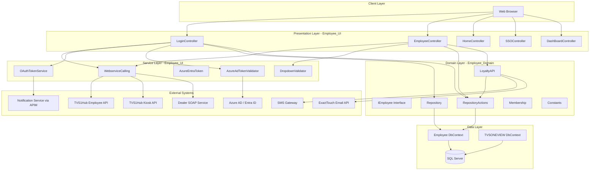

---

## 2. Solution Structure

```
EmployeeReferralPortal/
+-- Employee_Domain/              (Class Library - .NET Framework 4.8)
|   +-- Abstract/
|   |   +-- IEmployee.cs          (Repository interface contract)
|   +-- Concrete/
|   |   +-- Constants.cs          (Static configuration values)
|   |   +-- Employee.cs           (EF6 DbContext - primary database)
|   |   +-- LoyaltyAPI.cs         (SMS and Email dispatch)
|   |   +-- Membership.cs         (Base64 encryption/decryption)
|   |   +-- MyPolicy.cs           (Certificate policy)
|   |   +-- Repository.cs         (IEmployee implementation)
|   |   +-- RepositoryActions.cs  (ADO.NET stored procedure calls)
|   |   +-- TVSONEVIEW.cs         (EF6 DbContext - secondary database)
|   +-- Entity/                   (EF6 entity classes with Table/Column mappings)
|       +-- Login.cs, UserMaster.cs, UserRole.cs, Dealer.cs,
|       +-- State.cs, City.cs, ModelMaster.cs, Complaints.cs,
|       +-- RepurchaseModel.cs, LoanRequirement.cs, TenurePeriod.cs,
|       +-- MenuMaster.cs, EmployeeMaster.cs, EmployeeBrand.cs,
|       +-- TVSAPPDomainMaster.cs, TVSGroupCompany.cs, etc.
|
+-- Employee_UI/                  (ASP.NET MVC 4 Web Application)
    +-- App_Start/
    |   +-- BundleConfig.cs       (CSS/JS bundling)
    |   +-- FilterConfig.cs       (Global MVC filters)
    |   +-- RouteConfig.cs        (URL routing)
    |   +-- WebApiConfig.cs       (Web API routing)
    +-- CallingWebservices/
    |   +-- WebserviceCalling.cs   (External API integration)
    |   +-- EmployeeJsonClass.cs   (Employee API response model)
    |   +-- DealerJson.cs          (Dealer API response model)
    +-- Controllers/
    |   +-- LoginController.cs     (Authentication - KIOS, SSO, OTP)
    |   +-- EmployeeController.cs  (Employee operations)
    |   +-- HomeController.cs      (Static pages, error pages)
    |   +-- SSOController.cs       (Azure AD SSO callback)
    |   +-- DashBoardController.cs (Admin dashboard)
    +-- Helpers/
    |   +-- AzureAdTokenValidator.cs (JWT token validation)
    |   +-- DropdownValidator.cs     (Server-side dropdown validation)
    +-- Models/
    |   +-- AzureEntraToken.cs     (JWT generation/validation)
    |   +-- OAuthTokenService.cs   (OAuth 2.0 client credentials)
    |   +-- ElmahHandleErrorAttribute.cs (ELMAH integration)
    |   +-- Series.cs, Relations.cs, MenuModel.cs, etc.
    +-- Views/
    |   +-- Login/, Employee/, Home/, SSO/, DashBoard/, Shared/
    +-- Web.config                 (Application configuration)
    +-- Global.asax.cs             (Application lifecycle events)
    +-- GenericError.htm           (Generic error page)
```

---

## 3. Module Breakdown

### 3.1 Authentication Module

| Component | Responsibility |
|-----------|---------------|
| LoginController | Handles all authentication paths (KIOS, SSO, OTP) |
| WebserviceCalling.Login() | Kiosk authentication via TVS1Hub API |
| AzureAdTokenValidator | Server-side Azure AD ID token validation |
| OAuthTokenService | OAuth 2.0 client credentials for notification service |
| AzureEntraToken | JWT token generation and validation for internal auth |
| LoginController.SendOtp() | OTP generation and dispatch for sister company login |
| LoginController.ValidateOtp() | OTP verification with rate limiting |
| LoginController.CheckDomainAccess() | Email domain validation |

**Authentication Paths:**
1. **KIOS Login** - Employee number + password via TVS1Hub Kiosk API
2. **SSO Login** - Microsoft Entra ID (Azure AD) for @tvsmotor.com non-workmen employees
3. **Sister Company OTP Login** - Email domain validation + OTP via notification service

### 3.2 Employee Management Module

| Component | Responsibility |
|-----------|---------------|
| EmployeeController | Profile CRUD operations |
| WebserviceCalling.GetEmployeeList() | SAP employee data sync |
| WebserviceCalling.GetEmployeeListByEmail() | Employee lookup by email |
| EmployeeDetail (Model) | Profile insert/update via stored procedures |
| PROC_INSERT_UPDATE_EMPLOYEE_PROFILE | Database profile management |

### 3.3 Referral Module

| Component | Responsibility |
|-----------|---------------|
| EmployeeController.EmployeeReferral() | Referral code generation flow |
| RepositoryActions.PROC_ReferAFriendValidate() | Block validation for TVS employees |
| RepositoryActions.PROC_ReferAFriendSisterCompanyValidate() | Block validation for sister company |
| RepositoryActions.PROC_EMP_SEND_VELIDATION_CODE() | OTP for referral verification |
| RepositoryActions.PROC_EMP_PRE_REFERRAL_CHECK() | Pre-referral eligibility check |
| RepositoryActions.PROC_EMP_PRE_REFERRAL_NOTIFICATION() | Pre-referral notification |
| RepositoryActions.DELETE_REFERRAL() | Referral cancellation |
| RepositoryActions.PROC_REFERRAL_RESEND() | Resend referral SMS |
| LoyaltyAPI.SMSAPI() | SMS notifications (Refere, Referred, Refere_First) |
| LoyaltyAPI.EMAILAPI_REFERRAL_Refere() | Email notifications for referrals |

### 3.4 Self-Purchase Module

| Component | Responsibility |
|-----------|---------------|
| EmployeeController.EmployeeRepurchase() | Self-purchase code generation |
| RepositoryActions.PROC_SelfPurchaseValidate() | Block validation for TVS employees |
| RepositoryActions.PROC_SelfPurchaseSisterCompanyValidate() | Block validation for sister company |
| RepositoryActions.PROC_GetDiscountBalance() | Remaining discount balance check |
| LoyaltyAPI.SMSAPI() | SMS (self_purchase_self_buy, self_purchase_others_sms_to_employee/customer) |

### 3.5 Accessories Module

| Component | Responsibility |
|-----------|---------------|
| EmployeeController (Accessories action) | Accessories purchase code generation |
| RepositoryActions.PROC_AccessoriesValidate() | Block validation |
| LoyaltyAPI.SMSAPI() | SMS (accessories_code_generation) |

### 3.6 Redemption Module

| Component | Responsibility |
|-----------|---------------|
| EmployeeController (Redemption action) | Dealer-level redemption processing |
| RepositoryActions.PRO_EMP_REDEMPTION_DTL() | Redemption record insertion |

### 3.7 EMI Calculator Module

| Component | Responsibility |
|-----------|---------------|
| EmployeeController (EMI action) | EMI calculation and storage |
| RepositoryActions.PRO_EMP_EMI_INSERT_DTL() | EMI detail insertion |
| Repository.LoanRequirement() | Loan amount options |
| Repository.TenurePeriod() | Tenure and interest rate lookup |

### 3.8 Complaint Management Module

| Component | Responsibility |
|-----------|---------------|
| EmployeeController (Complaints action) | Complaint submission |
| RepositoryActions.ComplaintsSave() | EF-based complaint insert/update |
| LoyaltyAPI.SMSAPI() | SMS alert (Complain_alert_sms) |

### 3.9 Notification Module

| Component | Responsibility |
|-----------|---------------|
| LoyaltyAPI.SMSAPI() | Template-based SMS via HTTP gateway |
| LoyaltyAPI.EMAILAPI() | Email via ExactTouch API |
| LoyaltyAPI.EMAILAPI_REFERRAL_Refere() | Referral-specific email |
| LoyaltyAPI.EMAILAPI_REPURCHASE() | Repurchase-specific email |
| OAuthTokenService | OAuth token for notification service |
| RepositoryActions.PRO_INSERT_SMS_EMAIL_HISTORY() | Audit trail |
| RepositoryActions.PROC_GET_SMS_EMAIL_TEMPLATE() | Template retrieval |
| RepositoryActions.PROC_GET_SMS_EMAIL_TEMPLATEID() | DLT Template ID retrieval |

### 3.10 Error Logging (ELMAH)

| Component | Responsibility |
|-----------|---------------|
| ElmahHandleErrorAttribute | Custom ELMAH filter with error sequence tracking |
| Elmah.SqlErrorLog | SQL Server-based error persistence |
| Global.asax Application_Error | Global exception handler |

---
## 4. Class Diagrams and Responsibilities

### 4.1 IEmployee Interface

```csharp
namespace Employee_Domain.Abstract
{
    public interface IEmployee
    {
        IQueryable<Login> GetAllLogin();
        IQueryable<Dealer> Dealer();
        IQueryable<UserRole> UserRoles();
        IQueryable<State> State();
        IQueryable<EmployeeBrand> EmployeeBrand();
        IQueryable<LoanRequirement> LoanRequirement();
        IQueryable<TenurePeriod> TenurePeriod();
        IQueryable<TVSAPPDomainMaster> GetTVSAPPDomainMaster();
        bool IsDomainAllowed(string email);
        string TestDatabaseConnection();
    }
}
```

**Purpose:** Defines the repository contract for data access. Provides IQueryable access to all major entities and domain validation methods.

### 4.2 Employee (DbContext) - Primary Database

```csharp
public class Employee : DbContext
{
    public Employee() : base("DBLOYALTY_Employee") { }

    public DbSet<Login> Login { get; set; }
    public DbSet<UserMaster> Users { get; set; }
    public DbSet<MenuMaster> Menumaster { get; set; }
    public DbSet<ErrorLogRef> ErrorLogRef { get; set; }
    public DbSet<Dealer> Dealer { get; set; }
    public DbSet<ActivityPermission> ActivityPermission { get; set; }
    public DbSet<UserRole> UserRoles { get; set; }
    public DbSet<ModelMaster> ModelMaster { get; set; }
    public DbSet<APDCompanyList> APDCompanyList { get; set; }
    public DbSet<State> State { get; set; }
    public DbSet<EmployeeBrand> EmployeeBrand { get; set; }
    public DbSet<LoanRequirement> LoanRequirement { get; set; }
    public DbSet<TenurePeriod> TenurePeriod { get; set; }
    public DbSet<City> City { get; set; }
    public DbSet<ComplaintTypeMasterLinkage> ComplaintTypeMasterLinkage { get; set; }
    public DbSet<Complaints> Complaints { get; set; }
    public DbSet<TVSAPPDomainMaster> TVSAPPDomainMaster { get; set; }
    public DbSet<TVSGroupCompany> TVSGroupCompany { get; set; }
}
```

**Connection String:** `DBLOYALTY_Employee`  
**Database:** TVS_MOTOR_EMP_REF (SQL Server)

### 4.3 TVSONEVIEW (DbContext) - Secondary Database

```csharp
public class TVSONEVIEW : DbContext
{
    public TVSONEVIEW() : base("DBLOYALTY_TVS_ONE_VIEW") { }
    public DbSet<RepurchaseModel> RepurchaseModel { get; set; }
}
```

**Connection String:** `DBLOYALTY_TVS_ONE_VIEW`  
**Purpose:** Read-only access to repurchase/vehicle ownership data for customer lookup.

### 4.4 Repository

**Namespace:** `Employee_Domain.Concrete`  
**Implements:** `IEmployee`

| Method | Returns | Description |
|--------|---------|-------------|
| GetAllLogin() | IQueryable<Login> | All login records |
| GetAllMenumaster() | IQueryable<MenuMaster> | Menu structure |
| GetAllUsermaster() | IQueryable<UserMaster> | User master records |
| GetAllActivitypermission() | IQueryable<ActivityPermission> | Activity permissions |
| GetErrorLogRef() | IQueryable<ErrorLogRef> | Error log references |
| UserRoles() | IQueryable<UserRole> | User role mappings |
| Dealer() | IQueryable<Dealer> | Dealer records |
| State() | IQueryable<State> | State master |
| City() | IQueryable<City> | City master |
| EmployeeBrand() | IQueryable<EmployeeBrand> | Brand master |
| LoanRequirement() | IQueryable<LoanRequirement> | Loan options |
| TenurePeriod() | IQueryable<TenurePeriod> | Tenure/interest rates |
| GetModelMaster() | IQueryable<ModelMaster> | Vehicle models |
| GetAPDCompanyList() | IQueryable<APDCompanyList> | APD company list |
| ComplaintTypeMasterLinkage() | IQueryable<ComplaintTypeMasterLinkage> | Complaint types |
| GetTVSAPPDomainMaster() | IQueryable<TVSAPPDomainMaster> | Allowed domains |
| GetTVSGroupCompany() | IQueryable<TVSGroupCompany> | Group companies |
| IsDomainAllowed(email) | bool | Domain validation check |
| GetGroupCompaniesByDomain(email) | List<string> | Companies for a domain |
| TestDatabaseConnection() | string | Connection health check |

**Domain Validation Logic (IsDomainAllowed):**
1. Extract domain from email (after @)
2. Query TVSAPP_DOMAIN_MASTER table
3. Case-insensitive match on domain_name
4. Check is_active flag
5. Return true if active domain found

### 4.5 RepositoryActions

**Namespace:** `Employee_Domain.Concrete`  
**Pattern:** Direct ADO.NET with SqlParameter for stored procedure execution  
**Connection:** Uses Employee DbContext's underlying connection

All methods follow this pattern:
1. Open connection via `context.Database.Connection.Open()`
2. Create DbCommand with stored procedure name
3. Add input SqlParameters
4. Add output SqlParameters with Direction = ParameterDirection.Output
5. ExecuteNonQuery()
6. Read output parameter values into string array
7. Close connection
8. Return string array response

### 4.6 LoyaltyAPI

**Namespace:** `Employee_Domain.Concrete`  
**Purpose:** SMS and Email dispatch service

| Method | Description |
|--------|-------------|
| SMSAPI(Dictionary<string,string>) | Template-based SMS via HTTP gateway |
| EMAILAPI(Dictionary<string,string>) | Email via ExactTouch list management + campaign scheduling |
| EMAILAPI_REFERRAL_Refere(Dictionary<string,string>) | Referral-specific email dispatch |
| EMAILAPI_REPURCHASE(Dictionary<string,string>) | Repurchase-specific email dispatch |

**SMS Flow:**
1. Retrieve message template from DB via PROC_GET_SMS_EMAIL_TEMPLATE
2. Replace placeholders (@@CODE, @@CustomerName, @@EmployeeName, etc.)
3. Retrieve DLT Template ID via PROC_GET_SMS_EMAIL_TEMPLATEID
4. Construct HTTP GET URL with parameters (user, pswd, sender, recipient, msg, PE_ID, Template_ID)
5. Execute HTTP request to SMS gateway
6. Log result via PRO_INSERT_SMS_EMAIL_HISTORY

### 4.7 Membership

**Namespace:** `Employee_Domain.Concrete`  
**Purpose:** Base64 encoding/decoding for password storage

| Method | Description |
|--------|-------------|
| EncryptData(string) | UTF8 to Base64 encoding |
| Decryptdata(string) | Base64 to UTF8 decoding |

**Password Storage Pattern:** `Base64(salt + plaintext_password + salt)`

### 4.8 WebserviceCalling

**Namespace:** `Employee_UI.CallingWebservices`  
**Purpose:** External API integration layer

| Method | Description |
|--------|-------------|
| Login(username, password) | Kiosk authentication + employee category check |
| GetEmployeeList(EmployeeID) | Employee details from SAP via TVS1Hub |
| GetEmployeeListByEmail(email) | Employee lookup by email via TVS1Hub |
| GetDealerDropdown(City, State) | Dealer list via SOAP service |

### 4.9 OAuthTokenService

**Namespace:** `Employee_UI.Models`  
**Purpose:** OAuth 2.0 client credentials flow for notification service

```csharp
public static async Task<string> GetAccessTokenAsync()
```

**Flow:**
1. Read OAuthTenantId, OAuthClientId, OAuthClientSecret, OAuthScope from AppSettings
2. POST to `https://login.microsoftonline.com/{tenantId}/oauth2/v2.0/token`
3. Form body: grant_type=client_credentials, client_id, client_secret, scope
4. Parse access_token from JSON response
5. Return token string

### 4.10 AzureEntraToken

**Namespace:** `Employee_UI.Models`  
**Purpose:** Internal JWT token generation and validation

| Method | Description |
|--------|-------------|
| GetAccessTokenAsync() | Generate self-signed JWT with HMAC-SHA256 |
| ValidateTokenAsync(token) | Validate JWT against Azure AD JWKS keys |
| GetSigningKeysAsync() | Fetch RSA signing keys from Azure AD discovery endpoint |

### 4.11 AzureAdTokenValidator

**Namespace:** `Employee_UI.Helpers`  
**Purpose:** Server-side Azure AD ID token validation for SSO

| Method | Description |
|--------|-------------|
| ValidateTokenAndGetEmail(idToken) | Full JWT validation returning (isValid, email) |
| ValidateAndGetEmail(idToken) | Simplified wrapper returning email or null |

**Validation Steps:**
1. Fetch OpenID Connect configuration from Azure AD metadata endpoint
2. Fetch app-specific signing keys from `keys?appid={clientId}` endpoint
3. Validate token with parameters: issuer, audience, lifetime, signing keys
4. Extract email from claims: preferred_username > upn > email > unique_name
5. Multi-issuer support: v2.0 endpoint, v2.0 with trailing slash, STS endpoint

### 4.12 DropdownValidator

**Namespace:** `Employee_UI.Helpers`  
**Purpose:** Server-side validation for model dropdown values

```csharp
public static bool IsValidModel(string value, List<string> validModels)
```

Prevents injection of invalid model values by checking against database-sourced list.

### 4.13 Constants

**Namespace:** `Employee_Domain.Concrete`  
**Purpose:** Static configuration values used across the application

```csharp
public static class Roles
{
    public static int ADMINISTRATION = 999;
    public static int DEALERROLE = 1;
    public static int CUSTOMERROLE = 2;
    public static int EMPLOYEEROLE = 3;
    public static int KIOS = 9;
}
```

---
## 5. Database Schema

### 5.1 Entity-to-Table Mapping

| Entity Class | Table Name | Primary Key | Description |
|-------------|------------|-------------|-------------|
| Login | t_base_login_details | Id (Int64) | User credentials storage |
| UserMaster | t_base_user_master | Id (Int64) | User profile master |
| UserRole | t_base_user_role | ID (Int64) | User-role assignments |
| MenuMaster | t_base_menu_master | Id (Int64) | Navigation menu structure |
| Dealer | T_LOYALTY_DP_DEALER | Id (Int64) | Dealer master data |
| State | T_LOYALTY_DP_STATE | Id (Int64) | State master |
| City | T_LOYALTY_DP_CITY | Id (Int64) | City master |
| ModelMaster | T_LOYALTY_DP_MODEL_PART | ID (Int64) | Vehicle model/part catalog |
| Complaints | T_LOYALTY_COMPLAINTS | ID (Int64) | Complaint records |
| TVSAPPDomainMaster | TVSAPP_DOMAIN_MASTER | Id (Int64) | Allowed email domains |
| TVSGroupCompany | TVS_GROUP_COMPANY | Id (int) | TVS group company list |
| LoanRequirement | T_LOYALTY_LOAN_REQUIREMENT | Id (Int32) | Loan amount options |
| TenurePeriod | T_LOYALTY_EMP_TENURE_PERIOD | Id (Int32) | Tenure and interest rates |
| EmployeeBrand | T_LOYALTY_BRAND | id (Int64) | Vehicle brand master |
| EmployeeMaster | T_LOYALTY_EMP_MASTER | id (Int64) | Employee name master |
| RepurchaseModel | REPURCHASE_MODEL_1207 | frame_no (string) | Vehicle ownership data (secondary DB) |

### 5.2 Detailed Column Mappings

#### t_base_login_details

| Column | Type | Description |
|--------|------|-------------|
| Id | bigint (PK) | Auto-increment identifier |
| encr_user_id | varchar | Base64-encoded username |
| encr_password | varchar | Base64-encoded (salt+password+salt) |
| salt | bigint | Random numeric salt value |
| __track | varchar | Audit tracking field |

#### t_base_user_master

| Column | Type | Description |
|--------|------|-------------|
| Id | bigint (PK) | Auto-increment identifier |
| organisation_id | int | Organization reference |
| user_id | varchar | User identifier |
| user_no | bigint | User number |
| location_id | int | Location reference |
| user_status | int | Active/inactive status |
| role_id | int | Role assignment |
| __track | varchar | Audit tracking |

#### t_base_user_role

| Column | Type | Description |
|--------|------|-------------|
| ID | bigint (PK) | Auto-increment identifier |
| Login_id | bigint | FK to t_base_login_details |
| User_Mst_id | bigint | FK to t_base_user_master |
| Role_id | int | Role identifier |
| Customer_Dealer_id | int (nullable) | Associated dealer/customer |
| __track | varchar | Audit tracking |

#### t_base_menu_master

| Column | Type | Description |
|--------|------|-------------|
| Id | bigint (PK) | Auto-increment identifier |
| menu_id | int | Menu item identifier |
| parent_menu_id | int | Parent menu for hierarchy |
| activity_id | int | Activity permission reference |
| menu_name | varchar | Display name |
| position | int | Sort order |
| organisation_id | int | Organization scope |
| url | varchar | Navigation URL |

#### T_LOYALTY_DP_DEALER

| Column | Type | Description |
|--------|------|-------------|
| Id | bigint (PK) | Auto-increment identifier |
| DEALER_ID | int | Business dealer ID |
| DEALER_NAME | varchar | Dealer contact name |
| DEALERSHIP_NAME | varchar | Dealership business name |
| STATE_ID | varchar | State reference |
| CITY | varchar | City name |
| MOBILE_NO | varchar | Contact mobile |
| LAT | varchar | Latitude coordinate |
| LAG | varchar | Longitude coordinate |
| EMAIL_ID | varchar | Email address |
| ADDRESS_LINE_1/2/3 | varchar | Address fields |
| PIN_CODE | varchar | Postal code |
| ACTIVE | varchar | Active status flag |
| TERRITORY | varchar | Sales territory |

#### T_LOYALTY_DP_STATE

| Column | Type | Description |
|--------|------|-------------|
| Id | bigint (PK) | Auto-increment identifier |
| STATE_ID | varchar | State code |
| STATE_NAME | varchar | State display name |
| ACTIVE | varchar | Active flag |
| SEQ_NO | decimal | Display sequence |
| COUNTRY_CODE | varchar | Country reference |

#### T_LOYALTY_DP_CITY

| Column | Type | Description |
|--------|------|-------------|
| Id | bigint (PK) | Auto-increment identifier |
| CITY | varchar | City name |
| STATE_ID | bigint | FK to state |

#### T_LOYALTY_DP_MODEL_PART

| Column | Type | Description |
|--------|------|-------------|
| ID | bigint (PK) | Auto-increment identifier |
| MODEL_ID | varchar | Model code |
| DESCRIPTION | varchar | Model description |
| PART_ID | varchar | Part identifier |
| SERIES | varchar | Vehicle series |
| ACTIVE | varchar | Active flag |

#### T_LOYALTY_COMPLAINTS

| Column | Type | Description |
|--------|------|-------------|
| ID | bigint (PK) | Auto-increment identifier |
| TYPE | int | Complaint type |
| ABOUT | int | Complaint subject |
| DEALER_SERVICE_STN | int | Related dealer/service station |
| CUSTOMER_ID | int | Customer reference |
| DETAILS | varchar | Complaint description |
| COMPLAINT_TYPE_MASTER_ID | bigint (nullable) | Complaint category |
| EMP_ID | varchar | Employee who filed |
| EMP_PHONE | varchar | Employee phone |
| Status | int (nullable) | Open/Closed status |
| OPENDATE | datetime | Filing date |
| CLOSEDATE | datetime (nullable) | Resolution date |

#### TVSAPP_DOMAIN_MASTER

| Column | Type | Description |
|--------|------|-------------|
| Id | bigint (PK) | Auto-increment identifier |
| domain_name | varchar | Email domain (e.g., tvsmotor.com) |
| is_active | bit | Whether domain is currently allowed |
| created_on | datetime (nullable) | Record creation date |
| group_company_id | int (nullable) | FK to TVS_GROUP_COMPANY |

#### TVS_GROUP_COMPANY

| Column | Type | Description |
|--------|------|-------------|
| Id | int (PK) | Auto-increment identifier |
| GroupCompanyName | varchar | Company display name |
| Sequence | int (nullable) | Display order |

#### T_LOYALTY_LOAN_REQUIREMENT

| Column | Type | Description |
|--------|------|-------------|
| Id | int (PK) | Identifier |
| Loan_Requirement | decimal | Loan amount option |

#### T_LOYALTY_EMP_TENURE_PERIOD

| Column | Type | Description |
|--------|------|-------------|
| Id | int (PK) | Identifier |
| Tenure_Period | decimal | Tenure in months |
| Interest_Rate | decimal | Annual interest rate |

#### REPURCHASE_MODEL_1207 (Secondary Database)

| Column | Type | Description |
|--------|------|-------------|
| frame_no | varchar (PK) | Vehicle frame number |
| customer_name | varchar | Owner name |
| series | varchar | Vehicle series |
| CONTACT_NO_1/2/3 | varchar | Contact numbers |
| Sale_date | datetime (nullable) | Purchase date |
| dealer_purchase | varchar | Selling dealer |
| Dealership_name_purchase | varchar | Dealership name |
| Purchase_dealer_area | varchar | Dealer area |
| Last_dealer_serviced | varchar | Last service dealer |
| Last_service_dealer_name | varchar | Service dealer name |
| last_service_date | datetime (nullable) | Last service date |

### 5.3 Entity Relationship Diagram

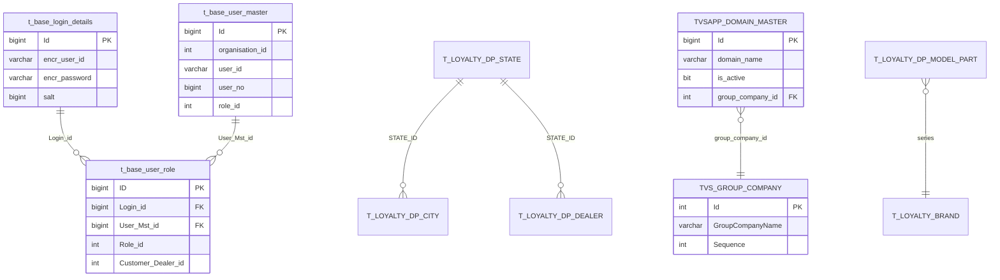

---
## 6. Stored Procedures

### 6.1 Complete Stored Procedure Reference

#### Authentication Procedures

| Procedure | Parameters (IN) | Parameters (OUT) | Purpose |
|-----------|----------------|-------------------|---------|
| PRO_LOGIN_CREDENTIALS | @USERID, @PASSWORD, @ENCRYPTEDUSERID, @ENCRYPTEDPASSWORD, @CHECKPASSWORD | @RESPONSE, @ROLEID, @USERINTERNALID, @USERNUMBER, @SALT, @PROUDMEMBER | Credential validation and role retrieval |
| PROC_FORGET_PASSWORD | @USERNAME, @USERNAMEECPRYTED, @PASSWORDENCP, @SALTVALUE | @MOBILENUMBER, @RESPONSE | Password reset with new encrypted password |
| PROC_INSERT_LOGIN_USER_DTL | @EMPLOYEE_CODE, @ENCRYPTEDUSERID, @ENCRYPTEDPASSWORD, @SALT | @RESPONSE | First-time login user creation |
| PROC_KIOS_OUTSIDER_LOGIN | @USERNAME, @USERENCRYPTED, @ENCRYPTEDPASSWORD, @SALT | @EMPLOYEEINTERNALID, @EMPLOYEECODE, @EMPLOYEENAME, @EMPLOYEEMOBILE, @USERNUMBER, @USERINERNALID, @RESPONSE | KIOS user registration/login |
| PROC_LOGIN_CHECK_AZUREAD (LoginCheckAzureAD) | @EMPLOYEE_EMAIL | @RESPONSE, @EMPLOYEE_CODE | Azure AD SSO employee lookup |
| PROC_EMP_KIOS_LOGIN_VERIFACTION | @EMPLOYEE_ID, @ACTION, @ENTERED_MOBILE_NO | @RESPONSE, @MESSAGE | KIOS login mobile verification |

#### Validation/Block Check Procedures

| Procedure | Parameters (IN) | Parameters (OUT) | Purpose |
|-----------|----------------|-------------------|---------|
| proc_emp_repurchase_block (PROC_SelfPurchaseValidate) | @employeecode | @RESPONSE | Self-purchase eligibility for TVS employees |
| proc_emp_repurchase_block_new (PROC_SelfPurchaseSisterCompanyValidate) | @employeecode, @emailid | @RESPONSE | Self-purchase eligibility for sister company |
| PROC_EMP_REFERRAL_BLOCK (PROC_ReferAFriendValidate) | @employeecode | @RESPONSE | Referral eligibility for TVS employees |
| PROC_EMP_REFERRAL_BLOCK_New (PROC_ReferAFriendSisterCompanyValidate) | @employeecode, @emailid | @RESPONSE | Referral eligibility for sister company |
| PROC_ADD_EMP_ACCESSORIES_BLOCK (PROC_AccessoriesValidate) | @employeecode | @RESPONSE | Accessories purchase eligibility |
| PROC_CHECK_IS_FIELD_INSENTIVE (isfield_incentive) | @EMPLOYEE_CODE | @RESPONSE | Field incentive eligibility check |

#### OTP and Verification Procedures

| Procedure | Parameters (IN) | Parameters (OUT) | Purpose |
|-----------|----------------|-------------------|---------|
| PROC_EMP_SEND_VELIDATION_CODE | @Employee_Code, @Action_Type, @OTP_Action, @referral_Contact_no | @Responce, @Message, @Validation_Code, @OTP_SEND_COUNT | OTP generation with count tracking |
| proc_store_sistercompany_otp (PROC_Store_SisterCompany_OTP) | @emailid, @otp | @RESPONSE | Store sister company OTP in database |
| PROC_EMP_PRE_REFERRAL_CHECK | @EMP_NO, @EMP_Mobile, @CUST_MOBILENO | @RESPONSE, @MESSAGE | Pre-referral duplicate/eligibility check |
| PROC_EMP_PRE_REFERRAL_NOTIFICATION | @EMP_NO, @CUST_MOBILENO, @EMP_MOBILENO | @RESPONSE, @MESSAGE | Pre-referral notification trigger |

#### Transaction Procedures

| Procedure | Parameters (IN) | Parameters (OUT) | Purpose |
|-----------|----------------|-------------------|---------|
| PRO_EMP_EMI_INSERT_DTL | @EMP_ID, @SCHEME, @BRAND_ID, @PART_ID, @LOAN_AMT, @TENURE, @INTREST_RATE, @EMI_VALUE | @RESPONSE | EMI calculation record storage |
| PRO_EMP_REDEMPTION_DTL | @EMP_ID, @DEALER_ID, @REFERRAL_CODE, @PART_ID, @REDEMPTION_CODE, @SHOW_ROOM_PRICE, @DISCOUNT_PER, @DISCOUNT_VALUE | @RESPONSE | Redemption transaction recording |
| SPUPDATE_REFERRAL_CODE_STATUS (DELETE_REFERRAL) | @REFERRALCODE, @EMPLOYEE_CODE | @RESPONSE | Referral code cancellation |
| PROC_REFERRAL_RESEND | @EMPLOYEE_NO, @REFERRALCODE | @EMPLOYEE_NAME, @EMPLOYEEMOBILENUMBER, @REFEREE_NAME, @REFEREE_MOBILE_NO | Referral SMS resend data retrieval |

#### Lookup/Utility Procedures

| Procedure | Parameters (IN) | Parameters (OUT) | Purpose |
|-----------|----------------|-------------------|---------|
| PRO_GET_USER_DTL | @ROLE, @USERID | @ID, @EMPLOYEENAME, @MOBILENUMBER, @EMPLOYEE_CODE | Employee detail retrieval |
| PROC_GET_EMP_REMEANING_DISCOUNT_DET (PROC_GetDiscountBalance) | @emp_code | DataTable (REMAINING_AMT) | Remaining discount balance |
| GET_PANEL_DETAILS | @TYPE | @PANEL_URL, @FEED_ID, @USER_NAME, @PASSWORD, @SENDER_ID | SMS/Email gateway configuration |
| PROC_GET_SMS_EMAIL_TEMPLATE | @TOUCH_CODE | @MESSAGE_TEXT | Message template text retrieval |
| PROC_GET_SMS_EMAIL_TEMPLATE_ID (PROC_GET_SMS_EMAIL_TEMPLATEID) | @TOUCH_CODE | @TEMPLATE_ID | DLT template ID retrieval |
| PROC_GET_DOCUMENT_SIZE_FORMATS | @TYPE | @SIZE, @DOCUMENT_FORMAT, @IMAGE_PATH, @PROFILEPICMSG, @EXTENSIONMSG, @PORT, @USER_NAME, @PASSOWRD | File upload configuration |
| PROC_GET_SERIES | @TYPE | Result set (SERIES) | Vehicle series lookup |
| proc_get_relation_name | (none) | Result set (Relation) | Relationship types |
| PROC_GET_DEALER_LIST | @OPERATION, @STATE_ID, @CITY_ID | Result set | Dealer list by location |

#### Audit/History Procedures

| Procedure | Parameters (IN) | Parameters (OUT) | Purpose |
|-----------|----------------|-------------------|---------|
| PRO_INSERT_SMS_EMAIL_HISTORY | @SUBJECT, @TYPE, @MOBILENO, @EMAILID, @MESSAGE, @ERROR_MSG, @REQUESTSTRING, @RESPONSESTRING, @REFERRAL_REPURCHASE_ID | (none) | SMS/Email audit trail |
| PRO_INSERT_SMS_EMAIL_HISTORY_EMAIL | @OPERATION, @UPDATEDID, @SUBJECT, @TYPE, @MOBILENO, @EMAILID, @MESSAGE, @ERROR_MSG, @REQUESTSTRING, @RESPONSESTRING, @REFERRAL_REPURCHASE_ID | @MAXIDFETCH | Email audit with ID tracking |

#### Document Management Procedures

| Procedure | Parameters (IN) | Parameters (OUT) | Purpose |
|-----------|----------------|-------------------|---------|
| PROC_DOCUMENT_UPLOAD | @OPERATION, @ID, @APPLICATION_ID, @APPLICATION_TYPE, @GUI, @USER_ID, @EXTENSION, @SIZE, @CREATED_BY, @UPDATED_BY, @BUSINESS_ID, @NAME | (none) | Document/image upload record |

#### EF-Based Operations (ComplaintsSave)

```csharp
public Int64 ComplaintsSave(Complaints complaints)
{
    // If new: context.Complaints.Add(complaints)
    // If existing: Update TYPE, ABOUT, DEALER_SERVICE_STN, DETAILS, COMPLAINT_TYPE_MASTER_ID
    // context.SaveChanges()
    // Returns: complaints.Id
}
```

---
## 7. API Flow Details

### 7.1 Login Flow - KIOS Authentication

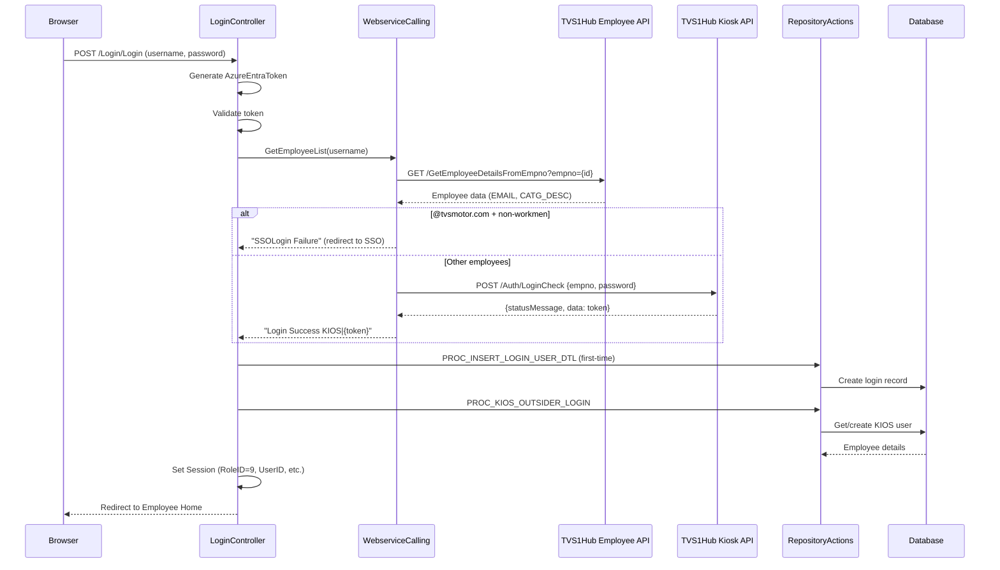

### 7.2 Login Flow - SSO (Azure AD)

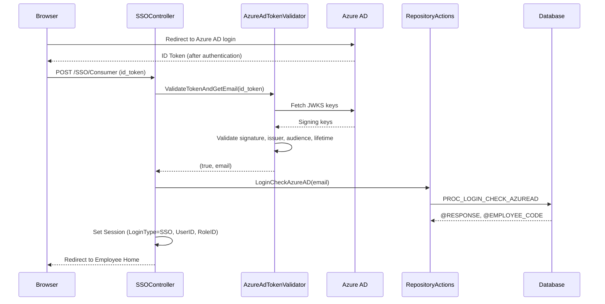

### 7.3 Login Flow - Sister Company OTP

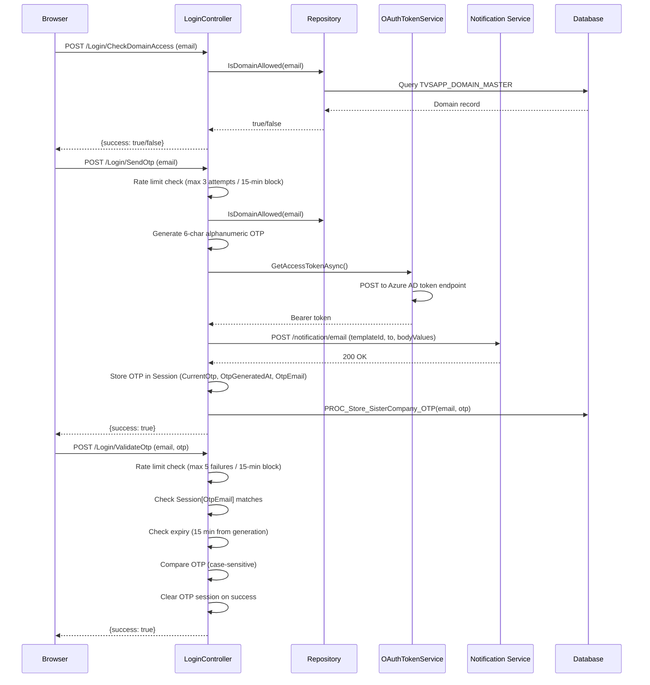

### 7.4 Employee Referral Flow

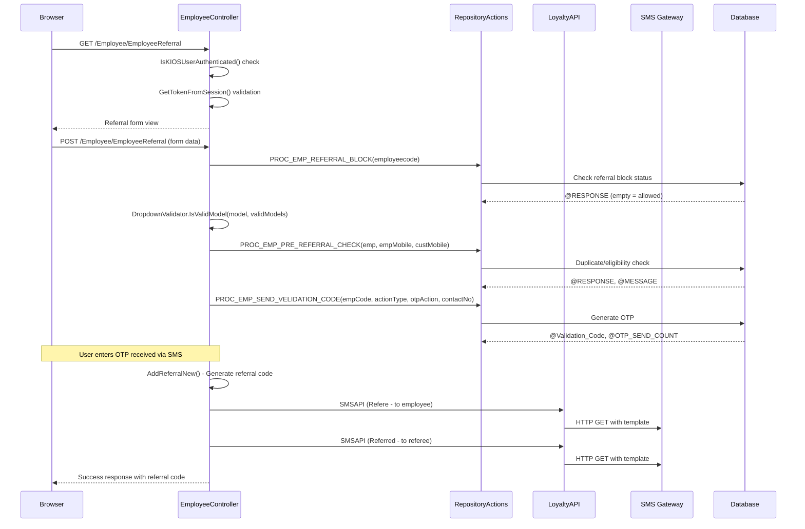

### 7.5 Self-Purchase Flow

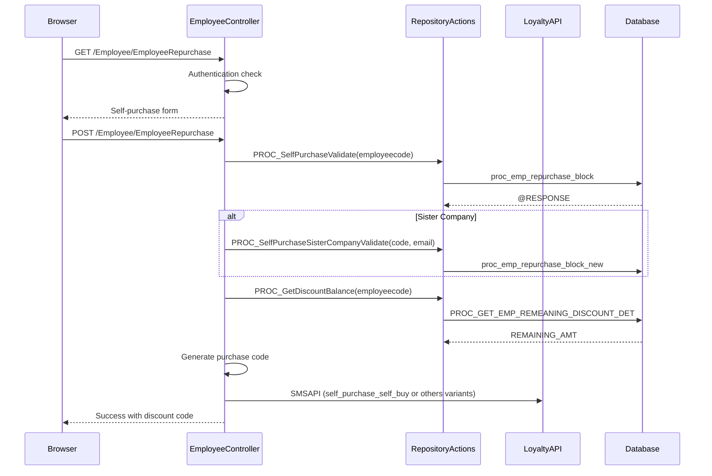

---
## 8. External API Integrations

### 8.1 TVS1Hub Employee API

| Property | Value |
|----------|-------|
| Base URL | `https://tvs1hub.tvsmotor.com/TVSApi/api/TVSM/` |
| Protocol | HTTPS (TLS 1.2) |
| Auth | APIKey header: `[CONFIGURED_VALUE]` |
| Format | JSON |

**Endpoints:**

| Method | Endpoint | Purpose |
|--------|----------|---------|
| GET | `/GetEmployeeDetailsFromEmpno?empno={id}` | Employee details by employee number |
| GET | `/GetEmployeeDetailsFromEmailID?emailID={email}` | Employee details by email |

**Response Structure:**
```json
{
  "data": [
    {
      "EMPNAME": "string",
      "EMP_FNAME": "string",
      "DOJ": "string",
      "MOBILE": "string",
      "email_id": "string",
      "EMP_DESIG": "string",
      "LOC": "string",
      "GRADE": "string",
      "GENDER": "string",
      "CATG_DESC": "string",
      "DISTRICT": "string",
      "DEPT": "string",
      "EMAIL": "string"
    }
  ]
}
```

### 8.2 TVS1Hub Kiosk Authentication API

| Property | Value |
|----------|-------|
| URL | `https://tvs1hub.tvsmotor.com/KioskAPI/api/Auth/LoginCheck` |
| Method | POST |
| Content-Type | application/json |

**Request:**
```json
{
  "empno": "string",
  "password": "string"
}
```

**Response:**
```json
{
  "statusMessage": "login Sucess",
  "data": "jwt_token_string"
}
```

### 8.3 Notification Service (Azure APIM)

| Property | Value |
|----------|-------|
| URL | `[CONFIGURED_VALUE]` (via OAuthNotificationAPI AppSetting) |
| Method | POST |
| Auth | OAuth 2.0 Bearer token (client credentials flow) |
| Content-Type | application/json |

**Token Acquisition:**
- Endpoint: `https://login.microsoftonline.com/{tenantId}/oauth2/v2.0/token`
- Grant Type: client_credentials
- Scope: `[CONFIGURED_VALUE]` (via OAuthScope AppSetting)

**Request Payload:**
```json
{
  "priority": "HIGH",
  "email": {
    "templateId": "200000000195649",
    "sender": "notify",
    "to": ["recipient@domain.com"],
    "sameThread": false,
    "bodyValues": { "otp": "ABC123" },
    "subjectValues": {}
  }
}
```

### 8.4 SMS Gateway

| Property | Value |
|----------|-------|
| Protocol | HTTP GET |
| URL Pattern | `{PanelURL}user={username}&pswd={password}&sender={senderId}&recipient={mobile}&msg={text}&PE_ID=1601100000000004424&Template_ID={templateId}` |
| Configuration | Retrieved from GET_PANEL_DETAILS stored procedure |
| DLT Compliance | PE_ID and Template_ID included for regulatory compliance |

**Gateway credentials are stored encrypted in the database and decrypted at runtime using Membership.Decryptdata().**

### 8.5 ExactTouch Email API

| Property | Value |
|----------|-------|
| Base URL | `https://api.exacttouch.com/API/mailing/` |
| Auth | ApiKey in XML payload: `[CONFIGURED_VALUE]` |
| Format | XML via URL parameters |

**Operations:**

1. **Create List:** `?type=list&activity=Add&data=<DATASET>...</DATASET>`
2. **Batch Upload:** `?type=list&activity=BatchUpload&data=<DATASET>...</DATASET>`
3. **Schedule Campaign:** `?type=message&activity=Schedule&data=<DATASET>...</DATASET>`

**Email Lists:**
- Employee_E_18032016 (general employee emails)
- RefereList (referral emails)
- RepurchaseList (repurchase emails)

### 8.6 Dealer SOAP Service

| Property | Value |
|----------|-------|
| URL | `https://www.advantagetvs.com/DealerWS/WSDealersinfo.asmx` |
| Protocol | SOAP 1.2 over HTTPS |
| Binding | customBinding (WSDealersInfoSoap12) |
| Auth | Username/password in method parameters |

**Method:** `getDealerInfo(username, password, City, State)`  
**Returns:** Array of dealer objects (DealerID, DealerName, Address1, Address2)

### 8.7 SAP Intranet Service (Legacy)

| Property | Value |
|----------|-------|
| URL | `http://10.121.2.50/webservices_intranet/intranetService.asmx` |
| Protocol | SOAP |
| Status | Partially deprecated (replaced by TVS1Hub APIs) |

---
## 9. Authentication and Authorization

### 9.1 Authentication Paths

```mermaid
flowchart TD
    A[User Access] --> B{Login Type?}
    B -->|Employee Number + Password| C[KIOS Login]
    B -->|@tvsmotor.com non-workmen| D[SSO - Azure AD]
    B -->|Sister Company Email| E[OTP Login]
    
    C --> C1[TVS1Hub Employee API - Category Check]
    C1 -->|@tvsmotor.com + non-workmen| D
    C1 -->|Others| C2[TVS1Hub Kiosk API Auth]
    C2 --> C3[PROC_KIOS_OUTSIDER_LOGIN]
    C3 --> C4[Session: RoleID=9, LoginType=KIOS]
    
    D --> D1[Azure AD Login Page]
    D1 --> D2[ID Token Returned]
    D2 --> D3[AzureAdTokenValidator]
    D3 --> D4[PROC_LOGIN_CHECK_AZUREAD]
    D4 --> D5[Session: LoginType=SSO]
    
    E --> E1[CheckDomainAccess - TVSAPP_DOMAIN_MASTER]
    E1 --> E2[SendOtp - 6-char alphanumeric]
    E2 --> E3[ValidateOtp - 15 min expiry]
    E3 --> E4[Session: LoginType=SisterCompany]
```

### 9.2 Session Variables

| Session Key | Type | Description |
|-------------|------|-------------|
| UserID | string | Internal user ID |
| RoleID | int | User role (1,2,3,9,999) |
| LoginType | string | "Normal", "KIOS", "SSO", "SisterCompany" |
| UserNo | string | User number |
| AttemptKios | string | KIOS attempt flag ("STOP" = authenticated) |
| KIOS_DOJ_Validated | string | Date of joining validation flag |
| ActualUserName | string | Original username |
| ProudMembers | string | Proud member flag |
| AzureEntraToken | string | Bearer token for API calls |
| Menu | List<MenuModel> | User menu items |
| Image | string | Profile picture path |
| FULLIMAGEPATH | string | Full image path |
| IMAGEPATHFORHTML | string | HTML-relative image path |
| isfieldinsentive | string | Field incentive flag |
| CurrentOtp | string | Active OTP value |
| OtpGeneratedAt | DateTime | OTP generation timestamp (UTC) |
| OtpEmail | string | Email associated with OTP |
| OTP_Generate_{email}_Count | int | OTP generation attempt counter |
| OTP_Generate_{email}_BlockedUntil | DateTime? | Generation block expiry |
| OTP_Verify_{email}_FailedCount | int | Verification failure counter |
| OTP_Verify_{email}_BlockedUntil | DateTime? | Verification block expiry |

### 9.3 Authorization Configuration

**Forms Authentication:**
```xml
<authentication mode="Forms">
    <forms name="401kAppemployee" loginUrl="~/Login/Login" timeout="110" />
</authentication>
<authorization>
    <deny users="?" />
</authorization>
```

**Anonymous Access Paths:**
- `/Login/*` - Login pages
- `/SSO/*` - SSO callback
- `/Content/*` - Static assets
- `/Home/AboutTheProgram` - Public info page
- `/Home/Err` - Error page
- `/GenericError.htm` - Generic error

### 9.4 KIOS Authentication Check

```csharp
// IsKIOSUserAuthenticated - checks multiple session values
bool IsKIOSUserAuthenticated()
{
    return Session["UserID"] != null
        && Session["LoginType"] != null
        && Session["RoleID"] != null
        && Session["AttemptKios"] != null
        && Session["KIOS_DOJ_Validated"] != null;
}
```

### 9.5 Token Validation (GetTokenFromSession)

```csharp
// Used in EmployeeController for API-style operations
string GetTokenFromSession()
{
    string token = Session["AzureEntraToken"]?.ToString();
    // Validate token is present and valid
    // Returns token or null
}
```

### 9.6 Role-Based Access

| Role ID | Role Name | Access Level |
|---------|-----------|--------------|
| 999 | ADMINISTRATION | Full admin dashboard |
| 1 | DEALERROLE | Dealer operations |
| 2 | CUSTOMERROLE | Customer view |
| 3 | EMPLOYEEROLE | Employee portal (standard login) |
| 9 | KIOS | Employee portal (kiosk login) |

---

## 10. Validation Logic

### 10.1 Domain Validation

```csharp
public bool IsDomainAllowed(string email)
{
    // 1. Null/empty check
    // 2. Extract domain (after @)
    // 3. Query TVSAPP_DOMAIN_MASTER
    // 4. Case-insensitive match on domain_name
    // 5. Check is_active == true
    // Returns: true if active domain found
}
```

**Behavior:**
- Case-insensitive domain comparison
- Only active domains (is_active = true) are allowed
- Returns false on any exception (fail-closed)

### 10.2 OTP Rate Limiting

**Generation Rate Limiting:**
| Parameter | Value | Source |
|-----------|-------|--------|
| Max Attempts | 3 | AppSettings["OTP_MaxAttempts"] |
| Block Duration | 15 minutes | AppSettings["OTP_BlockDurationMinutes"] |
| Storage | Session-based | Per email address |

**Verification Rate Limiting:**
| Parameter | Value | Source |
|-----------|-------|--------|
| Max Failed Attempts | 5 | Hardcoded |
| Block Duration | 15 minutes | Hardcoded |
| Storage | Session-based | Per email address |

**OTP Characteristics:**
- Length: 6 characters
- Character set: A-Z, a-z, 0-9 (alphanumeric)
- Expiry: 15 minutes from generation (UTC)
- Comparison: Case-sensitive (StringComparison.Ordinal)

### 10.3 Mobile Number Validation

- First digit cannot be zero
- Validated at form submission level

### 10.4 Model Dropdown Validation (Server-Side)

```csharp
public static bool IsValidModel(string value, List<string> validModels)
{
    if (string.IsNullOrWhiteSpace(value)) return false;
    if (validModels == null || !validModels.Any()) return false;
    return validModels.Contains(value, StringComparer.OrdinalIgnoreCase);
}
```

Valid models are fetched from `PROC_GET_SERIES` stored procedure and compared server-side to prevent injection of arbitrary values.

### 10.5 Employee Category Check (SSO Redirect)

```csharp
// In WebserviceCalling.Login():
if (email.EndsWith("@tvsmotor.com", StringComparison.OrdinalIgnoreCase)
    && !catgDesc.Equals("workmen", StringComparison.OrdinalIgnoreCase))
{
    return "SSOLogin Failure"; // Triggers SSO redirect
}
```

**Logic:** TVS Motor employees who are NOT in the "workmen" category must use SSO (Azure AD) instead of KIOS login.

### 10.6 File Upload Validation

- Allowed formats: JPG, PDF (for ID proof)
- Profile pictures: JPG/PNG only
- Size limit: Retrieved from PROC_GET_DOCUMENT_SIZE_FORMATS
- Configuration stored in database (not hardcoded)

---
## 11. Notification Module

### 11.1 SMS Template Types

| RequestFrom Value | Job Name | Template Placeholders | Recipient |
|-------------------|----------|----------------------|-----------|
| First_Time | api_First_Time_employee_portal | (none - static) | New employee |
| self_purchase_self_buy | api_employee_portal_Repurchase | @@CODE, @@EmployeeName, @@MOBILENO | Employee (self) |
| self_purchase_others_sms_to_employee | api_employee_portal_Repurchase | @@CODE, @@EmployeeName | Employee |
| self_purchase_others_sms_to_customer | api_employee_portal_Repurchase | @@CODE, @@MOBILENO | Customer |
| RepurchaseSecondMsg | api_RepurchaseSecondMsg | @@CODE | Customer |
| Refere_First | api_employee_portal_Refere_First | @@CustomerName, @@Code (=ReferredName) | Employee |
| accessories_code_generation | api_employee_portal_Accessories | @@Code (=ReferredName) | Employee |
| Refere | api_employee_portal_Refere | @@CustomerName, @@Code | Employee |
| Referred | api_employee_portal_Referred | @@CustomerName, @@MobileNo, @@Code, @@ReferredName | Referee |
| Updated Customer Profile | api_Updated_Customer_Profile | @@CODE | Customer |
| Updated Customer Profile from Repurchase | (none) | @@CODE | Customer |
| Updated Dealer Profile | (none) | (static text) | Dealer |
| Forget Password | api_Forget_Password | @@CODE | Employee |
| Reject_Referal_Request | Reject_Referal_Request | @@EmployeeName | Employee |
| Approval_Referal_Request | Approval_Referal_Request | @@EmployeeName | Employee |
| Complain_alert_sms | Complain_alert_sms | @@ComplaintID, @@EmployeeName | Employee |

### 11.2 SMS Dispatch Flow

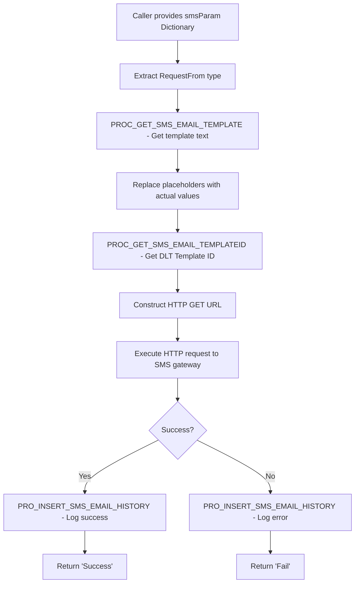

**Required smsParam Keys:**
- MobileNo (recipient)
- RequestFrom (template type)
- PanelURL (gateway base URL)
- FeedId (gateway feed ID)
- PanleUserName (gateway username - encrypted)
- PanlePassword (gateway password - encrypted)
- PanelSenderId (sender ID)
- Code (optional - discount/referral code)
- CustomerName (optional - recipient name)
- ReferredName (optional - referred person name)
- RefreeMobile (optional - referrer mobile)

### 11.3 Email Dispatch Flow (ExactTouch)

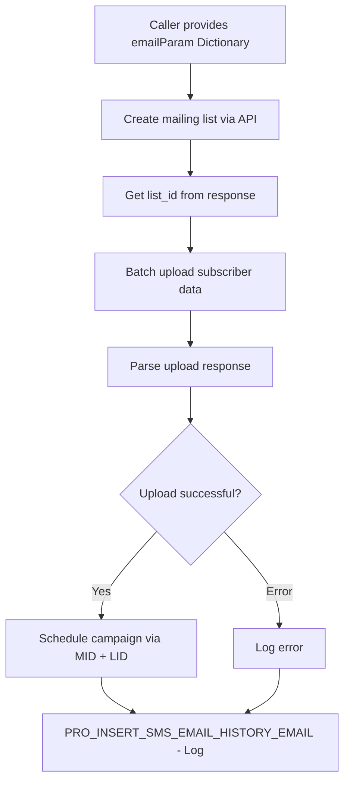

### 11.4 OTP Email via Notification Service

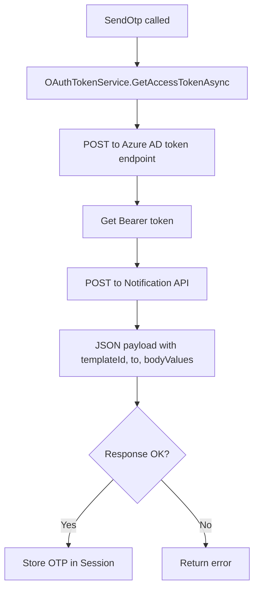

---

## 12. Error Handling and Logging

### 12.1 Error Handling Layers

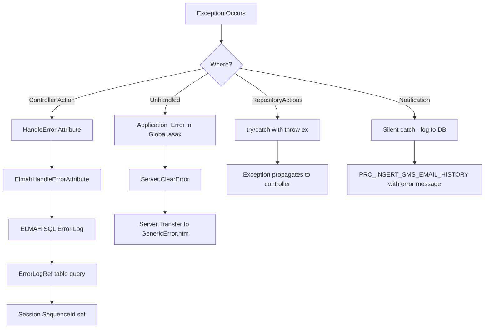

### 12.2 ELMAH Configuration

```xml
<elmah>
    <errorLog type="Elmah.SqlErrorLog, Elmah" 
              connectionStringName="Elmah.Sql_Employee" />
    <security allowRemoteAccess="1" />
</elmah>
```

- **Storage:** SQL Server (same database as application)
- **Access:** `/elmah.axd` endpoint
- **Integration:** ElmahHandleErrorAttribute registered as global filter

### 12.3 ElmahHandleErrorAttribute

Custom implementation that:
1. Calls base.OnException()
2. Signals ELMAH via ErrorSignal
3. Queries ErrorLogDataSourceAdapter for latest error
4. Looks up ErrorLogRef for sequence ID
5. Stores sequence ID in Session for user-facing error reference

### 12.4 Global Error Handler (Global.asax.cs)

```csharp
protected void Application_Error(object sender, EventArgs e)
{
    var exception = Server.GetLastError();
    if (exception == null) return;
    Server.ClearError();
    Response.Clear();
    Response.StatusCode = 500;
    Response.TrySkipIisCustomErrors = true;
    Server.Transfer("~/GenericError.htm");
}
```

### 12.5 Custom Error Pages

```xml
<customErrors mode="On" defaultRedirect="~/Home/Err">
    <error statusCode="404" redirect="~/Home/Err" />
    <error statusCode="403" redirect="~/Home/Err" />
    <error statusCode="500" redirect="~/Home/Err" />
</customErrors>
```

IIS-level errors also redirect to GenericError.htm via httpErrors configuration.

### 12.6 Notification Error Handling

SMS and Email failures are silently caught and logged:
```csharp
catch (Exception ex)
{
    obj.PRO_INSERT_SMS_EMAIL_HISTORY(RequestFrom, "S", MobileNo, "", text, 
        ex.Message.ToString(), Requeststr, data, 0);
    return "Fail";
}
```

This ensures notification failures never break the main business flow.

---

## 13. Security Implementation

### 13.1 HTTP Security Headers

| Header | Value | Purpose |
|--------|-------|---------|
| X-Frame-Options | SAMEORIGIN | Clickjacking prevention |
| X-Content-Type-Options | nosniff | MIME sniffing prevention |
| X-XSS-Protection | 1; mode=block | XSS filter |
| Server | (removed) | Hide IIS version |
| X-AspNet-Version | (removed) | Hide .NET version |
| X-AspNetMvc-Version | (removed) | Hide MVC version |
| X-Powered-By | (removed) | Hide technology stack |

### 13.2 Header Removal Implementation

**Web.config (IIS level):**
```xml
<httpProtocol>
    <customHeaders>
        <remove name="X-Powered-By" />
        <remove name="X-AspNet-Version" />
        <remove name="X-AspNetMvc-Version" />
    </customHeaders>
</httpProtocol>
<security>
    <requestFiltering removeServerHeader="true" />
</security>
```

**Global.asax.cs (Application level):**
```csharp
// Application_Start
MvcHandler.DisableMvcResponseHeader = true;

// Application_PreSendRequestHeaders
HttpContext.Current.Response.Headers.Remove("Server");
HttpContext.Current.Response.Headers.Remove("X-AspNet-Version");
HttpContext.Current.Response.Headers.Remove("X-AspNetMvc-Version");

// httpRuntime
<httpRuntime enableVersionHeader="false" />
```

### 13.3 Cache Control

```csharp
// Application_BeginRequest
Response.Cache.SetCacheability(HttpCacheability.NoCache);
Response.Cache.SetExpires(DateTime.UtcNow.AddHours(-1));
Response.Cache.SetNoStore();
```

All responses include no-cache, no-store directives to prevent sensitive data caching.

### 13.4 HTTP Parameter Pollution Prevention

```csharp
// Application_BeginRequest
var queryParams = HttpContext.Current.Request.QueryString;
var duplicateKeys = queryParams.AllKeys.GroupBy(k => k)
    .Where(g => g.Count() > 1)
    .Select(g => g.Key);

if (duplicateKeys.Any())
{
    HttpContext.Current.Response.StatusCode = 400;
    HttpContext.Current.Response.End();
}
```

Duplicate query string parameters result in immediate 400 Bad Request.

### 13.5 Password Encoding

**Pattern:** `Base64(salt + plaintext + salt)`

```csharp
// Encryption
string salt = randomNum.Next(1, 100000).ToString();
string encrypted = objMembership.EncryptData(salt + password + salt);

// Storage
// Salt stored separately in t_base_login_details.salt column
// Encrypted password stored in encr_password column
```

**Note:** This is Base64 encoding, not cryptographic hashing. The salt provides uniqueness but Base64 is reversible.

### 13.6 Token-Based Authentication

**AzureEntraToken (Internal):**
- Algorithm: HMAC-SHA256
- Signing key: EntraClientSecret from AppSettings
- Expiry: 30 minutes
- Claims: NameIdentifier (ClientId), scope

**AzureAdTokenValidator (SSO):**
- Algorithm: RS256 (RSA with SHA-256)
- Keys: Fetched from Azure AD JWKS endpoint
- Validation: Issuer, Audience, Lifetime, Signature
- Clock skew: 5 minutes tolerance
- Multi-issuer: v2.0, v2.0/, STS endpoints

### 13.7 Custom 404 Handling

```csharp
// Catch-all route prevents default ASP.NET 404 page (which exposes version info)
routes.MapRoute(
    name: "NotFound",
    url: "{*url}",
    defaults: new { controller = "Home", action = "NotFound" }
);
```

### 13.8 Session Security

- Session timeout: 120 minutes
- Forms authentication timeout: 110 minutes
- Session-based rate limiting for OTP operations
- Session cleared on logout

---
## 14. Configuration

### 14.1 AppSettings (Web.config)

| Key | Purpose | Example/Default |
|-----|---------|-----------------|
| ImagePathForHtml | Profile picture display path | /ProfilePicture/ |
| ClientId | Azure AD Client ID (SSO) | [CONFIGURED_VALUE] |
| Tenant | Azure AD Tenant ID (SSO) | [CONFIGURED_VALUE] |
| Authority | Azure AD Authority URL pattern | https://login.microsoftonline.com/{0}/v2.0 |
| RedirectUri | SSO callback URL | [CONFIGURED_VALUE] |
| EntraClientId | Azure Entra Client ID (internal token) | [CONFIGURED_VALUE] |
| EntraTenantId | Azure Entra Tenant ID | [CONFIGURED_VALUE] |
| EntraClientSecret | Azure Entra Client Secret | [CONFIGURED_VALUE] |
| EntraAudience | Azure Entra Token Audience | [CONFIGURED_VALUE] |
| OAuthClientId | OAuth Client ID (notification service) | [CONFIGURED_VALUE] |
| OAuthClientSecret | OAuth Client Secret | [CONFIGURED_VALUE] |
| OAuthScope | OAuth Scope | [CONFIGURED_VALUE] |
| OAuthTenantId | OAuth Tenant ID | [CONFIGURED_VALUE] |
| OAuthNotificationAPI | Notification service endpoint | [CONFIGURED_VALUE] |
| OTP_MaxAttempts | Max OTP generation attempts before block | 3 |
| OTP_BlockDurationMinutes | Block duration after max attempts | 15 |
| MaxOtpAttempts | Alternative OTP max attempts config | 4 |
| OtpBlockDurationMinutes | Alternative block duration config | 2 |
| ClientValidationEnabled | Enable client-side validation | true |
| UnobtrusiveJavaScriptEnabled | Enable unobtrusive JS | true |

### 14.2 Connection Strings

| Name | Purpose | Database |
|------|---------|----------|
| DBLOYALTY_Employee | Primary application database | TVS_MOTOR_EMP_REF |
| Elmah.Sql_Employee | ELMAH error logging | TVS_MOTOR_EMP_REF (same DB) |
| DBLOYALTY_TVS_ONE_VIEW | Secondary read-only database | (Vehicle ownership data) |

**Connection String Format:**
```
Data Source=[SERVER];Initial Catalog=[DATABASE];User ID=[USER];Password=[PASSWORD]
Provider: System.Data.SqlClient
```

### 14.3 Service Endpoints (WCF Bindings)

| Endpoint | Binding | Address |
|----------|---------|---------|
| IntranetServiceSoap1 | basicHttpBinding | http://10.121.2.50/webservices_intranet/intranetService.asmx |
| WSDealersInfoSoap | basicHttpBinding (Transport security) | https://www.advantagetvs.com/DealerWS/WSDealersinfo.asmx |
| WSDealersInfoSoap12 | customBinding (SOAP 1.2 + HTTPS) | https://www.advantagetvs.com/DealerWS/WSDealersinfo.asmx |

### 14.4 Entity Framework Configuration

```xml
<entityFramework>
    <providers>
        <provider invariantName="System.Data.SqlClient" 
                  type="System.Data.Entity.SqlServer.SqlProviderServices, EntityFramework.SqlServer" />
    </providers>
</entityFramework>
```

- EF Version: 6.x
- Provider: SQL Server
- Code-First with Data Annotations (Table/Column attributes)
- No migrations (database-first schema)

### 14.5 Session Configuration

```xml
<sessionState timeout="120" />
```

- Session timeout: 120 minutes (2 hours)
- Forms auth timeout: 110 minutes
- In-process session state (default)

---

## 15. Routing

### 15.1 MVC Routes

| Route Name | URL Pattern | Defaults | Purpose |
|------------|-------------|----------|---------|
| Default | {controller}/{action}/{id} | Login/Login | Standard MVC routing |
| NotFound | {*url} | Home/NotFound | Catch-all 404 handler |

### 15.2 Web API Routes

| Route Name | URL Pattern | Defaults |
|------------|-------------|----------|
| DefaultApi | api/{controller}/{id} | id = optional |

### 15.3 Controller Actions Summary

#### LoginController

| Action | HTTP Method | URL | Purpose |
|--------|-------------|-----|---------|
| Login | GET | /Login/Login | Login page (Login_1 view) |
| Login_2 | GET | /Login/Login_2 | Alternative login page |
| Login_Creat | GET | /Login/Login_Creat | Login creation page |
| KIOS_Login | GET | /Login/KIOS_Login | KIOS login page |
| Admin_Login_Creat | GET | /Login/Admin_Login_Creat | Admin login page |
| LoginNew | GET | /Login/LoginNew | New login with OAuth config |
| SisterCompanyLogin | GET | /Login/SisterCompanyLogin | Sister company login page |
| CheckDomainAccess | POST | /Login/CheckDomainAccess | Domain validation AJAX |
| SendOtp | POST | /Login/SendOtp | OTP generation AJAX |
| ValidateOtp | POST | /Login/ValidateOtp | OTP verification AJAX |
| TestDatabase | GET | /Login/TestDatabase | DB connection test |

#### EmployeeController

| Action | HTTP Method | URL | Purpose |
|--------|-------------|-----|---------|
| EmployeeReferral | GET/POST | /Employee/EmployeeReferral | Referral management |
| EmployeeRepurchase | GET/POST | /Employee/EmployeeRepurchase | Self-purchase |
| UpdateProfile | POST | /Employee/UpdateProfile | Profile update |
| (EMI actions) | GET/POST | /Employee/EMI* | EMI calculator |
| (Complaint actions) | GET/POST | /Employee/Complaint* | Complaints |
| (Accessories actions) | GET/POST | /Employee/Accessories* | Accessories codes |

#### HomeController

| Action | HTTP Method | URL | Purpose |
|--------|-------------|-----|---------|
| NotFound | GET | /Home/NotFound | Custom 404 page |
| Err | GET | /Home/Err | Error display page |
| AboutTheProgram | GET | /Home/AboutTheProgram | Public info page |

#### SSOController

| Action | HTTP Method | URL | Purpose |
|--------|-------------|-----|---------|
| Consumer | POST | /SSO/Consumer | Azure AD callback |

### 15.4 Ignored Routes

```csharp
routes.IgnoreRoute("{resource}.axd/{*pathInfo}");
```

This allows ELMAH's elmah.axd handler to function without MVC routing interference.

---

## 16. Deployment Architecture

### 16.1 Infrastructure

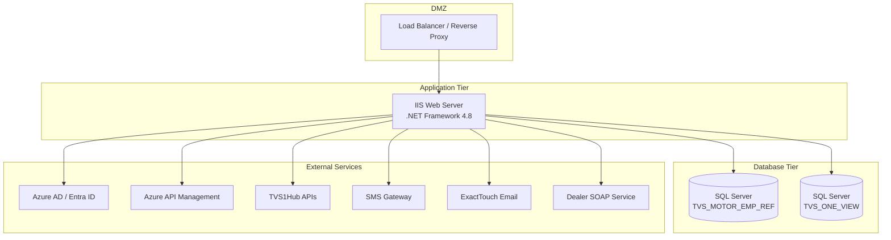

### 16.2 Runtime Requirements

| Component | Version/Requirement |
|-----------|-------------------|
| .NET Framework | 4.8 |
| ASP.NET MVC | 4 |
| Entity Framework | 6.x |
| IIS | 7.5+ (Integrated Mode) |
| SQL Server | 2012+ |
| TLS | 1.2 (enforced for external APIs) |

### 16.3 Key NuGet Packages

| Package | Purpose |
|---------|---------|
| EntityFramework | ORM for database access |
| Elmah | Error logging and management |
| Newtonsoft.Json | JSON serialization |
| Microsoft.IdentityModel.Tokens | JWT token handling |
| System.IdentityModel.Tokens.Jwt | JWT creation/validation |
| Microsoft.IdentityModel.Protocols.OpenIdConnect | OIDC configuration |
| Microsoft.Identity.Client (MSAL) | Azure AD authentication |
| Microsoft.Owin.Security | OWIN security middleware |

### 16.4 Build Configuration

- Target Framework: .NET Framework 4.8
- Debug: Compilation debug="true"
- Output: Two assemblies (Employee_Domain.dll, Employee_UI web application)
- Static content: WebP MIME type registered

### 16.5 Maintenance Mode

A maintenance page template exists at:
```
Employee_UI/MaintancePage/app_offline.htm.sample
```

To enable maintenance mode, rename to `app_offline.htm` in the application root. IIS will serve this page for all requests.

---

## Appendix A: Data Flow Summary

### A.1 Complete Request Lifecycle

```
Browser Request
    -> IIS Pipeline (Request Filtering, Security Headers)
    -> Application_BeginRequest (HPP check, Cache headers)
    -> MVC Routing (RouteConfig)
    -> Forms Authentication Check
    -> Controller Action
        -> Token/Session Validation
        -> Business Logic (Repository/RepositoryActions)
        -> Database Operations (EF6 / ADO.NET)
        -> External API Calls (if needed)
        -> Notification Dispatch (if needed)
    -> View Rendering
    -> Application_PreSendRequestHeaders (Header removal)
    -> Response to Browser
```

### A.2 Error Lifecycle

```
Exception Thrown
    -> Controller try/catch (if present)
    -> [HandleError] Attribute
    -> ElmahHandleErrorAttribute.OnException()
        -> ELMAH ErrorSignal
        -> SQL Error Log
        -> ErrorLogRef lookup
        -> Session[SequenceId] set
    -> Application_Error (if unhandled)
        -> Server.Transfer("~/GenericError.htm")
```

---

## Appendix B: SMS Gateway URL Format

```
{PanelURL}user={username}&pswd={password}&sender={senderId}&recipient={mobileNo}&msg={messageText}&PE_ID=1601100000000004424&Template_ID={templateId}
```

**Parameters:**
- PanelURL: Base gateway URL (from GET_PANEL_DETAILS)
- user: Decrypted username
- pswd: Decrypted password
- sender: Sender ID
- recipient: Mobile number with country code
- msg: URL-encoded message text
- PE_ID: Principal Entity ID (DLT regulatory)
- Template_ID: DLT registered template ID

---

## Appendix C: Session State Diagram

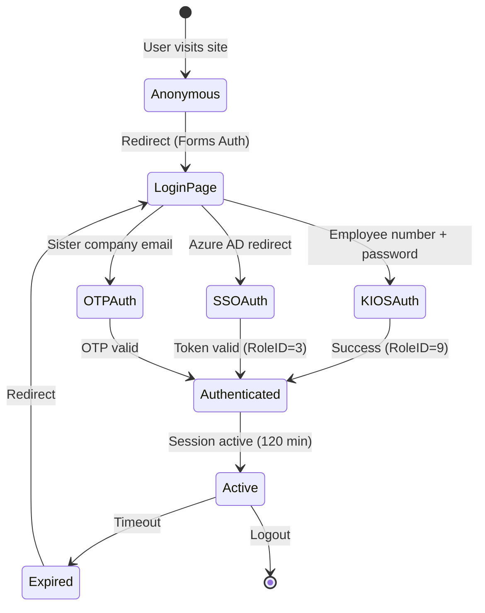

---

## Appendix D: Key Design Decisions

| Decision | Rationale |
|----------|-----------|
| ADO.NET for stored procedures | Complex output parameters not well-supported by EF6 |
| EF6 for CRUD operations | Simpler entity management (Complaints, lookups) |
| Session-based rate limiting | No distributed cache; single-server deployment |
| Base64 password encoding | Legacy design; not cryptographically secure |
| Template-based SMS | DLT compliance requires pre-registered templates |
| Multiple auth paths | Different employee categories have different access methods |
| Silent notification failures | Business operations should not fail due to SMS/email issues |
| Catch-all 404 route | Prevents ASP.NET default error pages from exposing version info |

---

*End of Low Level Design Document*