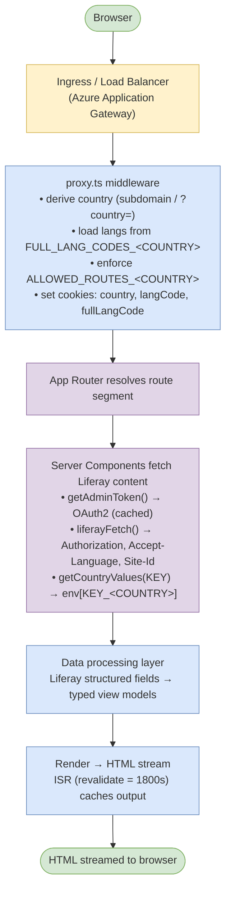
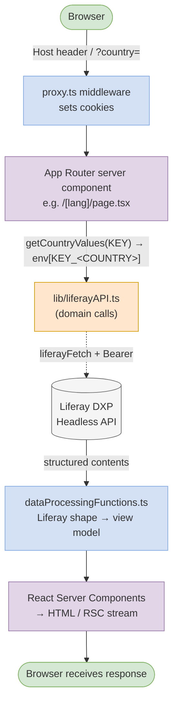
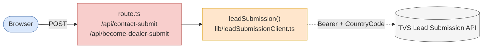

# High Level Code Document — TVSM IB Next.js Website

> Audience: vendor / partner engineers onboarding to the TVS Motor International Business (IB) website platform.
> Scope: code-level overview of the `TVSM-IB-NextJS` repository. No secrets, credentials, or proprietary business rules are included. Configuration values are referenced by environment variable name only.

---

## 1. Application Overview

The repository hosts a **multi-country, multi-language marketing and lead-capture website** built on **Next.js 16 (App Router) with React 19** and rendered server-side. A single codebase serves multiple country sites (e.g. Italy, Malta, Spain, Portugal, Nepal, Bangladesh) — each country is selected at request time from the incoming domain (or a `?country=` query parameter on localhost) and each country has its own configuration, localization, navigation, and content delivered from a headless **Liferay DXP** CMS.

Primary capabilities:

- Country- and language-aware page rendering (`/[lang]/...` routes) with Incremental Static Regeneration.
- Headless content fetched from Liferay (pages, banners, products, promotions, news, navigation menus, legal docs, forms).
- Lead capture forms (Contact Us, Become a Dealer) that POST to an internal Lead Submission API.
- Cookie consent, Google Analytics deferred loading, SEO metadata, sitemap and robots generation.
- Health-check endpoints for container orchestration.

The application is packaged as a Next.js **standalone** Docker image and deployed via Kubernetes (manifests under `devops/k8s`).

---

## 2. Module Summary

### 2.1 Folder Structure

```
TVSM-IB-NextJS/
├── app/                       # Next.js App Router
│   ├── api/                   # Server route handlers
│   │   ├── become-dealer-submit/route.ts
│   │   ├── contact-submit/route.ts
│   │   └── health/route.ts
│   ├── health_check/data_source/route.ts
│   ├── robots.txt/route.ts
│   ├── sitemap.xml/route.ts
│   ├── layout.tsx             # Root layout (header, footer, GA, cookie banner)
│   ├── not-found.tsx
│   └── [lang]/                # Localized pages
│       ├── page.tsx           # Home
│       ├── our-products/      # Product listing + [slug]
│       ├── products/          # Alternate product route + [slug]
│       ├── promotions/[slug]
│       ├── news/[slug]
│       ├── press-room/
│       ├── contact-us/
│       ├── become-dealer/
│       ├── dealer-locator/
│       ├── history/
│       ├── services/
│       ├── who-we-are/
│       ├── cookie-policy/
│       └── privacy-policy/
├── components/                # Presentational + composed UI components
│   ├── Header/, Footer/
│   ├── Home/                  # Home page sections
│   ├── Product-detail/        # Product banner, specs, gallery, features, FAQ
│   ├── Forms/, Form-elements/ # Forms and reusable inputs
│   ├── CookieConsent/
│   ├── Press-room/, History/, Legal-docs/, Who-we-are/
│   ├── ImageBaseUrlProvider.tsx
│   └── GAListener.tsx
├── lib/
│   ├── liferayClient.ts       # Authenticated Liferay HTTP client
│   ├── liferayAPI.ts          # Domain-specific Liferay endpoints
│   ├── leadSubmissionClient.ts# Lead API client
│   ├── hooks/                 # Client-side React hooks
│   └── utils/
│       ├── adminToken.ts          # OAuth2 client_credentials token cache
│       ├── manageCountry.server.ts# Country resolution from cookies/env
│       ├── manageCountry.client.ts
│       ├── manageLocalization.server.ts
│       ├── seoMetadata.server.ts
│       ├── dataProcessingFunctions.ts # Liferay structure → view models
│       ├── cookieConsent.ts / cookieConsentContent.server.ts
│       ├── imageBaseUrl.server.ts / assetBaseUrl.client.ts
│       ├── imageValidation.ts
│       ├── formSubmission.ts
│       └── utilFuctions.ts
├── types/                     # TypeScript types
│   ├── liferay.type.ts        # Raw Liferay structured-content shapes
│   ├── types.type.ts          # Domain view models
│   ├── formInput.type.ts, formPayload.type.ts
│   ├── cookieConsent.ts
│   └── global.d.ts
├── public/                    # Static assets
├── styles/                    # Tailwind/CSS + local fonts
├── proxy.ts                   # Next.js middleware (routing, country, lang)
├── next.config.ts             # Next config (standalone, image domains, ISR)
├── Dockerfile                 # Multi-stage build → standalone runtime
├── devops/k8s, devops/pipelines
└── __tests__/, __mocks__/, jest.config.js, jest.setup.tsx
```

### 2.2 Major Modules / Components

| Module | Responsibility |
| --- | --- |
| `app/layout.tsx` | Root server component — loads fonts, renders `Header`, `Footer`, cookie banner, deferred Google Analytics injector, and provides `ImageBaseUrlProvider`. |
| `app/[lang]/page.tsx` (and other route segments) | Server components per page; orchestrate Liferay fetches and pass view models to UI components. |
| `proxy.ts` (middleware) | Resolves country from host (or query param on localhost), validates language prefix, enforces `ALLOWED_ROUTES_<COUNTRY>`, redirects root to default language, sets cookies (`country`, `langCode`, `fullLangCode`). |
| `components/Header`, `components/Footer` | Site chrome, driven by Liferay structured content and navigation menus. |
| `components/Home/*` | Banner, product tabs, about, promotions, news, story / dealer CTA filler sections. |
| `components/Product-detail/*` | Product banner, display, features, gallery, FAQ. |
| `components/Forms/*` and `Form-elements/*` | Contact and Become-Dealer forms; reusable inputs (text, textarea, select, multi-checkbox, phone with `intl-tel-input`). |
| `components/CookieConsent/*` | Cookie banner, settings dialog, preferences re-open button. |
| `lib/liferayClient.ts` | Single low-level Liferay fetch wrapper (auth + locale + site headers). |
| `lib/liferayAPI.ts` | Higher-level Liferay domain calls (structured content, navigation menus, products, categories, options, list-type definitions, OpenSearch, etc.). |
| `lib/leadSubmissionClient.ts` | POSTs lead payloads to the configured TVS Lead API. |
| `lib/utils/dataProcessingFunctions.ts` | Translates Liferay `ContentField`/`ContentStructure` shapes into typed view models used by components. |
| `lib/utils/manageCountry.server.ts` | Resolves country from cookie and reads `<KEY>_<COUNTRY>` env values. |
| `lib/utils/manageLocalization.server.ts` | Loads supported languages and full language codes from `FULL_LANG_CODES_<COUNTRY>`. |
| `lib/utils/seoMetadata.server.ts` | Builds Next.js `Metadata` from per-page Liferay SEO settings. |
| `app/api/*` route handlers | Server-only HTTP endpoints for forms and health. |

---

## 3. Dependency Overview

### 3.1 Runtime dependencies (from `package.json`)

| Package | Purpose |
| --- | --- |
| `next` (16.0.10) | App Router framework, SSR, ISR, middleware, image optimization. |
| `react`, `react-dom` (19.2.x) | UI library. |
| `@next/third-parties` | Optimised loaders for third-party scripts. |
| `swiper` | Carousels (product gallery, banners, listings). |
| `photoswipe` | Lightbox for product gallery images. |
| `intl-tel-input` | International phone input with country dial codes. |
| `cheerio` | HTML parsing for content sanitisation/transforms on the server. |
| `sanitize-html` | HTML sanitisation before rendering Liferay-authored HTML. |
| `clsx` | Conditional className helper. |
| `graphql-request` | Reserved for GraphQL calls (Liferay GraphQL endpoint, where applicable). |

### 3.2 Build and test tooling (dev)

- **TypeScript 5.9** as the primary language.
- **Jest 30** + `@testing-library/react`, `jest-environment-jsdom` for unit tests; tests live in `__tests__/` with mocks in `__mocks__/`.
- **Playwright** for end-to-end checks (`@playwright/test`).
- **Babel** presets (`@babel/preset-env`, `@babel/preset-typescript`) for Jest transforms.
- **PostCSS** (`postcss.config.mjs`) for CSS pipeline.

### 3.3 Platform / external systems

- **Liferay DXP (headless)** — primary content source via OAuth2 Bearer tokens.
- **TVS Lead Submission API** — receives form leads.
- **Google Analytics / Tag Manager** — loaded lazily on user interaction.
- **Image hosts** — whitelisted in `next.config.ts` `images.remotePatterns` (per-country CMS domains).

---

## 4. Runtime Flow

### 4.1 Process model

- The Next.js app runs as a single Node.js process (Next standalone server, `node server.js`) inside an Alpine container.
- Dockerfile is multi-stage: builder → runner. Runner ships only the standalone server, `.next/static`, and `public/`.
- Kubernetes deployment artefacts and pipelines live under `devops/`.

### 4.2 Request lifecycle



### 4.3 Caching and rendering

- Pages declare `export const dynamic = 'auto'` and `revalidate = 1800` (30 minutes) where appropriate, enabling **ISR**.
- The OAuth2 admin token is cached in module scope with expiry tracking, refreshed on demand.
- `next/image` is configured with explicit device/image sizes, AVIF/WebP formats, and a 1-year `minimumCacheTTL`.

---

## 5. Key Services

### 5.1 Liferay Client (`lib/liferayClient.ts`)
- Single function `liferayFetch(endpoint)` that constructs the absolute URL from `API_BASE_URL`, attaches a Bearer token from `getAdminToken()`, and adds `Accept-Language` (from cookie) and `Site-Id` (from `LIFERAY_SITE_ID_<COUNTRY>`).
- Throws on non-2xx, parses JSON, and is the only place HTTP requests to Liferay originate.

### 5.2 Liferay Domain API (`lib/liferayAPI.ts`)
- Wraps the headless-delivery, headless-admin-list-type, and TVS catalog endpoints. Examples:
  - `getStructureContent(id)` — structured-content items for a content structure.
  - `getNavigationMenu(id)` — navigation menu with `link` and `name`.
  - `getAllProducts(category)`, `getProductCategories()`, `getProductOptions(ids)`.
  - `getListTypeDefinitionByERC(...)` — for form dropdown options.
- Each call has try/catch around `liferayFetch` and returns a safe empty value with structured logging.

### 5.3 Admin Token Service (`lib/utils/adminToken.ts`)
- Implements OAuth2 `client_credentials` against `<API_BASE_URL>/o/oauth2/token`.
- Caches the access token and expiry in module scope; refreshes on expiry.
- Reads `LIFERAY_CLIENT_ID` and `LIFERAY_CLIENT_SECRET` from env (never logged or echoed).

### 5.4 Country and Localization Services
- `manageCountry.server.ts`
  - `getCountryOnServer()` → reads `country` cookie (set by middleware).
  - `getCountryValues(key)` → reads `process.env[<key>_<COUNTRY>]`. This is the single convention for country-scoped configuration (e.g. `LIFERAY_SITE_ID_ITALY`, `IMAGE_BASE_URL_NEPAL`, `FOOTER_STRUCTURE_ID_MALTA`).
- `manageLocalization.server.ts`
  - `getLangCodeServer('langCode' | 'fullLangCode')` → from cookie, defaults to `en` / `en_US`.
  - `getLangUtils(country?)` → parses `FULL_LANG_CODES_<COUNTRY>` (JSON map) into `supportedLangs` and `fullLangCodes`.

### 5.5 Lead Submission Client (`lib/leadSubmissionClient.ts`)
- POSTs JSON to `TVS_LEAD_URL_<COUNTRY>` with `Authorization: Bearer <TVS_LEAD_TOKEN>` and `CountryCode: <ALPHA2_CODE_<COUNTRY>>`.
- Returns a `NextResponse` JSON envelope that bubbles upstream status and body.

### 5.6 Data Processing Functions (`lib/utils/dataProcessingFunctions.ts`)
- A library of pure helpers translating raw Liferay structures into domain view models:
  - `getTextField`, `getAssetField`, `getButton` — field accessors.
  - `processPromotionData`, `processNewsData`, `processButtonFiller`, `processFormContentData` — section/page processors.
  - `processPageStructure(name)` — resolves a page configuration (which structures to render, friendly URL) from a parent `PAGE_STRUCTURE_ID_<COUNTRY>` definition.
  - Product helpers: `getProductSummaries`, `getCatViseProductSummary`, `getListingContent`, `getProductBannerImage`.

### 5.7 SEO and Static Routes
- `seoMetadata.server.ts` builds `Metadata` (title, description, robots, canonical) from Liferay page settings.
- `app/sitemap.xml/route.ts` and `app/robots.txt/route.ts` produce dynamic SEO files.

### 5.8 API Route Handlers
- `POST /api/contact-submit` → maps `ContactUsNextPayload` → lead payload → `leadSubmission`.
- `POST /api/become-dealer-submit` → maps `BecomeDealerNextPayload` → lead payload → `leadSubmission`.
- `GET /api/health` → returns `OK` / 200 (Kubernetes liveness/readiness).
- `GET /health_check/data_source` → datasource availability probe.

---

## 6. Integration Summary

### 6.1 Liferay DXP (Headless)
- **Auth:** OAuth2 client credentials via `o/oauth2/token`.
- **Endpoints used:**
  - `o/headless-delivery/v1.0/content-structures/{id}/structured-contents` (page sections, banners, promotions, news, footer, header, etc.)
  - `o/headless-delivery/v1.0/navigation-menus/{id}` (header/footer menus)
  - List-type definitions (form option lists)
  - TVS catalog endpoints under `o/tvs/...` (products, categories, options)
- **Per-country config:** `LIFERAY_SITE_ID_<COUNTRY>`, `PAGE_STRUCTURE_ID_<COUNTRY>`, `FOOTER_STRUCTURE_ID_<COUNTRY>`, etc.

### 6.2 TVS Lead Submission API
- Receives Contact Us and Become Dealer leads from server route handlers.
- Per-country URL (`TVS_LEAD_URL_<COUNTRY>`) with shared bearer token (`TVS_LEAD_TOKEN`) and country code (`ALPHA2_CODE_<COUNTRY>`).

### 6.3 Google Analytics
- Loaded lazily in `app/layout.tsx` via a `next/script` tag that injects `gtag.js` only after the first user interaction (scroll/pointer) or a 4-second timeout. ID is taken from `GAEVENTID`.
- `components/GAListener.tsx` performs route-change page-view events client-side.

### 6.4 Image / Asset Hosts
- Production and pre-prod CMS hosts whitelisted in `next.config.ts > images.remotePatterns`.
- `IMAGE_BASE_URL_<COUNTRY>` is prepended to relative asset URLs returned by Liferay.

### 6.5 Cookie Consent
- Banner and preferences UI under `components/CookieConsent`. Configuration is fetched from Liferay (`cookieConsentContent.server.ts`) and respected by `GAListener` and other tracking components before firing events.

---

## 7. Important Entry Points

| Path | Type | Purpose |
| --- | --- | --- |
| `proxy.ts` | Edge middleware | Country/locale routing; first to run on every request. |
| `app/layout.tsx` | Root server layout | Page shell, GA injection, cookie banner, providers. |
| `app/[lang]/page.tsx` | Page (server) | Country home page composition. |
| `app/[lang]/our-products/page.tsx` and `[slug]/page.tsx` | Page (server) | Product listing and product detail. |
| `app/[lang]/contact-us/page.tsx`, `become-dealer/page.tsx` | Page (server) | Lead-capture forms. |
| `app/api/contact-submit/route.ts` | Route handler | Contact Us submission endpoint. |
| `app/api/become-dealer-submit/route.ts` | Route handler | Dealer enrolment submission endpoint. |
| `app/api/health/route.ts` | Route handler | Container health probe. |
| `app/sitemap.xml/route.ts`, `app/robots.txt/route.ts` | Route handler | SEO files. |
| `Dockerfile`, `devops/k8s/*` | Build/Deploy | Container image and Kubernetes deployment. |

---

## 8. Configuration Convention

All country-specific configuration follows the pattern **`<KEY>_<COUNTRY>`** as environment variables (e.g. `API_BASE_URL`, `LIFERAY_SITE_ID_<COUNTRY>`, `IMAGE_BASE_URL_<COUNTRY>`, `FULL_LANG_CODES_<COUNTRY>`, `ALLOWED_ROUTES_<COUNTRY>`, `DEFAULT_LANGUAGE_<COUNTRY>`, `TVS_LEAD_URL_<COUNTRY>`, `ALPHA2_CODE_<COUNTRY>`, `FOOTER_STRUCTURE_ID_<COUNTRY>`, `PAGE_STRUCTURE_ID_<COUNTRY>`).

Country is resolved at request time:
- In production: from the host subdomain (e.g. `nepal.tvsmotor.com` → country `NEPAL`; `uat-malta.tvsmotor.net` → country `MALTA`).
- On localhost: from the `?country=` query param, defaulting to `MALTA`.

This single convention is what makes the codebase a true multi-tenant, multi-country site.

---

## 9. High-Level Data Flow Diagram

**Page render flow**



**Form submission flow (separate)**



---

## 10. Notes for Vendor Onboarding

1. Start by reading `proxy.ts`, then `lib/liferayClient.ts`, then `lib/utils/dataProcessingFunctions.ts` — these three together explain ~80% of how the app composes a page.
2. Country onboarding is a **configuration exercise**, not a code change: add the `<KEY>_<COUNTRY>` env vars, configure DNS / subdomain to route to the same deployment, and ensure the Liferay site/structures exist for that country.
3. Adding a new page generally means: create a route segment under `app/[lang]/<route>/page.tsx`, define a corresponding entry in the `PAGE_STRUCTURE_ID_<COUNTRY>` Liferay structure, and reuse `processPageStructure(name)` + section components.
4. Treat all Liferay-authored HTML as untrusted; render via `sanitize-html` (`sanitize`) before passing to `dangerouslySetInnerHTML`.
5. Secrets (`LIFERAY_CLIENT_SECRET`, `TVS_LEAD_TOKEN`) are read **only** from environment variables and never logged. Keep that contract.
