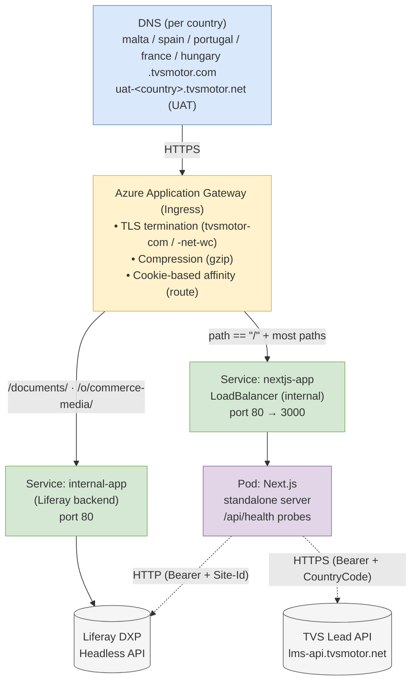

# High Level Design — TVSM IB Next.js Website

> Audience: external engineering partners and internal SREs.
> Scope: architecture, deployment, integrations, and resiliency for the `TVSM-IB-NextJS` service.
> Notes: secrets and confidential business rules are intentionally omitted. Configuration is referenced by environment variable name only; country values use the placeholder `<COUNTRY>`.
> Template reference: TVS Motor Confluence — *D&AI Engineering / High Level Design Template*.

---

## 1. Overview

The TVSM IB Next.js website is a multi-country, multi-language marketing and lead-capture platform that serves several international TVS markets (e.g. Italy, Malta, Spain, Portugal, Nepal, Bangladesh) from a single application image. It is built on **Next.js 16 (App Router) with React 19**, runs server-side as a Node.js standalone server, and renders content sourced from a **headless Liferay DXP** CMS. Form submissions are forwarded to the **TVS Lead Submission API**.

Tier-1 functionality (public marketing site, brand presence) is a **Tier 2 — Business Critical** workload: revenue-impacting and reputation-sensitive but not life-or-death.

---

## 2. Tier Classification

| Aspect | Value |
| --- | --- |
| Tier | **Tier 2 — Business Critical** |
| Rationale | Public-facing brand and lead-generation site. Outage impacts marketing campaigns, dealer onboarding, and customer enquiries, but does not affect rider safety or financial transactions. |

---

## 3. Background

The IB websites previously existed as country-specific Liferay-themed properties. As the number of markets grew, theme-level customization, divergence between sites, and content vs. presentation entanglement created tech-debt and slowed feature delivery. The Next.js project was introduced to:

- Decouple presentation from the CMS while keeping Liferay as the system of record.
- Standardize a single codebase that scales horizontally with country onboarding through configuration only.
- Adopt modern frontend performance defaults (RSC, ISR, image optimization, deferred analytics).

---

## 4. Requirements

### 4.1 Functional
- Render localized pages per country and per language (`/[lang]/...`).
- Resolve country at request time from the host name (subdomain) or `?country=` on localhost.
- Serve home, products, product-detail, promotions, news, press-room, history, services, who-we-are, dealer-locator, contact-us, become-dealer, privacy-policy, cookie-policy.
- Capture leads (Contact Us, Become a Dealer) and forward to the Lead Submission API.
- Generate per-page SEO metadata, sitemap, and robots from CMS data.
- Honor cookie consent before activating analytics.

### 4.2 Non-functional
- **Availability:** ≥ 99.9% per market during business hours; degraded read paths must continue serving cached pages when CMS is briefly unavailable.
- **Performance:** TTFB ≤ 600 ms (warm, ISR cache hit); LCP ≤ 2.5s on 4G.
- **Scalability:** horizontal scaling via Kubernetes replicas; one image, many countries.
- **Security:** OAuth2 client-credentials for CMS, secrets only via Kubernetes secrets, no secrets logged, sanitization of CMS-authored HTML.
- **Observability:** structured logs, k8s liveness/readiness probes, Pod identity in response headers (`Server-Name`).
- **Compliance:** cookie-consent enforcement before tracking; PII redacted from logs.

---

## 5. Current Architecture (HLD)

Browsers reach country-specific subdomains (e.g. `malta.tvsmotor.com`) via Azure Application Gateway. The gateway terminates TLS and routes by host and path:

- `/documents/*` and `/o/commerce-media/*` → Liferay backend (assets and media).
- All other paths → the Next.js Service.

The Next.js pod renders pages, calling Liferay over the in-cluster `internal-app` service for content, and the public Lead API for form submissions.



Dependency call-out (per template guidance, dependent services should be visualized distinctly):
- **Liferay DXP** and **Lead Submission API** are upstream dependencies whose availability and response times directly affect this service.

---

## 6. Proposed Architecture / Component Boundaries

The system retains the same architecture; the HLD documents and codifies it. Components and boundaries:

### 6.1 Edge / Ingress
- Azure Application Gateway with the AKS Application Gateway Ingress Controller.
- TLS certs: `tvsmotor-com` (prod) and `tvsmotor-net-wc` (UAT wildcard).
- Cookie-based affinity (`route`) for session stickiness during a request lifecycle.
- Path routing keeps `/documents/*` and `/o/commerce-media/*` on Liferay, the rest on Next.js.

### 6.2 Application — Next.js standalone server (`tvsm-ib-nextjs`)
- Container image hosted in Azure Container Registry: `tvsmazlrwebacr<env>01ib.azurecr.io/tvsm-cx/tvsm-ib-nextjs.<env>`.
- Pod listens on `:3000`, exposed as a Service on port 80.
- Reads non-secret config from `nextjs-config` ConfigMap and secrets from `nextjs-secrets`.
- Runs middleware (`proxy.ts`) that resolves country/language from host and cookies before route matching.
- Server Components fetch CMS content using `lib/liferayClient.ts` and translate it to view models via `lib/utils/dataProcessingFunctions.ts`.
- Form route handlers (`/api/contact-submit`, `/api/become-dealer-submit`) build payloads and call `lib/leadSubmissionClient.ts`.
- Health endpoint `/api/health` powers Kubernetes probes.

### 6.3 Backend — Liferay DXP (dependency)
- Reached in-cluster via the `internal-app` Service.
- Provides headless content APIs (`/o/headless-delivery/v1.0/...`), commerce/catalog endpoints (`/o/tvs/...`), OAuth2 token (`/o/oauth2/token`), assets (`/documents/*`), and commerce media.
- Owns content authoring, structures, navigation menus, list-type definitions, and SEO settings.

### 6.4 Lead Submission API (dependency)
- Public HTTPS endpoint (`https://lms-api.tvsmotor.com/...`).
- Accepts JSON lead payloads with bearer token and country code.

### 6.5 Analytics / Tracking
- Google Tag Manager / GA loaded lazily from the browser after first interaction or 4-second timeout.
- Cookie consent gating performed by `components/CookieConsent` and respected by `GAListener`.

### 6.6 Pros
- One codebase serves many countries; new market = config-only.
- Tight separation: Liferay owns content; Next.js owns presentation and integration.
- ISR + standalone server delivers fast TTFB without persistent state in the app.
- Per-pod ingress affinity keeps client → pod paths predictable for the request duration.

### 6.7 Cons
- Build-time environment coupling: a single image with shared runtime config means a per-country config error can affect that country's pages.
- Strong dependency on Liferay availability for cold caches.
- Module-level token cache means each pod warms its own OAuth2 token.

---

## 7. Service Interaction (Sequence Flows)

### 7.1 Page render (happy path)
```
Browser ─► AppGw ─► nextjs-app Service ─► Pod (proxy.ts)
   1. proxy.ts derives country from Host, validates lang, sets cookies
   2. App Router invokes the page server component
   3. Component calls lib/liferayAPI → liferayClient.liferayFetch
       3a. getAdminToken() ─► Liferay /o/oauth2/token (cached by pod)
       3b. liferayFetch ─► Liferay /o/headless-delivery/v1.0/... (Bearer)
   4. dataProcessingFunctions translates the raw structures
   5. RSC renders HTML; ISR caches the result for `revalidate` seconds
   6. HTML streamed to browser
```

### 7.2 Lead submission
```
Browser (form) ─POST ─► /api/contact-submit (route handler)
   1. Parse & validate payload
   2. Build extra_attributes + payload (country/lang derived from cookies)
   3. leadSubmissionClient ─POST─► TVS_LEAD_URL_<COUNTRY>
       Headers: Authorization: Bearer <TVS_LEAD_TOKEN>, CountryCode: <ALPHA2_CODE_<COUNTRY>>
   4. Return JSON envelope { success, apiStatus, apiData } to the browser
```

### 7.3 Retry, error handling, failover
- **Liferay token failure:** `getAdminToken` raises with descriptive context. Server component catches via try/catch in `lib/liferayAPI` and returns safe empty data so the page still renders skeletons.
- **Liferay content failure (single section):** `Promise.allSettled` is used for parallel section fetches on the home page; partial failures are logged and the page renders without the failed section.
- **All sections fail:** the page throws and Next.js returns the not-found / error route.
- **ISR window:** if Liferay is briefly unavailable, the previously rendered cached page continues to serve until the next successful revalidation.
- **Lead API failure:** `leadSubmission` returns `{ success: false }` with HTTP 500; the form UI shows a generic error message.
- **Unsupported route per country:** middleware redirects to `/not-found` based on `ALLOWED_ROUTES_<COUNTRY>`.

### 7.4 Worked example (Malta home page)
1. User opens `https://malta.tvsmotor.com/`.
2. AppGw routes `/` to `nextjs-app`.
3. Middleware sets `country=malta`, redirects to `/en` (`DEFAULT_LANGUAGE_MALTA=en`).
4. Browser hits `/en`; layout fetches `IMAGE_BASE_URL_MALTA` and cookie-consent content; `app/[lang]/page.tsx` runs.
5. Page calls `processPageStructure('HOME')` against `PAGE_STRUCTURE_ID_MALTA`, then fetches all sections with `Promise.allSettled`.
6. View models are passed to `HomePageBanner`, `HomeProductSectionWrapper`, etc.
7. ISR caches the page (`revalidate=1800s`).

---

## 8. Database Interactions

The Next.js application is **stateless** and does not own any database. All persistence is delegated to Liferay (its underlying RDBMS) and to the Lead Submission API (its internal datastore). Read interactions:

| Source | Mode | Purpose |
| --- | --- | --- |
| Liferay Headless Delivery API | HTTP, Bearer auth | Read structured content, navigation, list types, taxonomies. |
| Liferay Commerce / TVS catalog endpoints | HTTP, Bearer auth | Read products, categories, options, prices. |
| Liferay OAuth2 endpoint | HTTP, Form POST | Issue access tokens. |
| Lead Submission API | HTTPS | Write-only — POST lead payloads. |

Caching layers used by Next.js:
- **In-memory** OAuth2 token cache (per pod, `lib/utils/adminToken.ts`).
- **Next.js ISR cache** for rendered pages (`revalidate=1800s` typical).
- **HTTP image cache** (1-year `minimumCacheTTL` with AVIF/WebP).

---

## 9. API Integrations

| API | Direction | Auth | Notes |
| --- | --- | --- | --- |
| Liferay `/o/oauth2/token` | Outbound | `client_credentials` (`LIFERAY_CLIENT_ID` + `LIFERAY_CLIENT_SECRET`) | Token cached per pod, refreshed on expiry. |
| Liferay `/o/headless-delivery/v1.0/*` | Outbound | Bearer | Content structures, structured content, navigation menus. |
| Liferay `/o/tvs/*` (custom) | Outbound | Bearer | Products, categories, options, OpenSearch product search. |
| TVS Lead Submission API | Outbound | Bearer (`TVS_LEAD_TOKEN`) + `CountryCode` header | Per-country URL `TVS_LEAD_URL_<COUNTRY>`. |
| Google Tag Manager / GA | Outbound (browser) | None | Lazy-loaded; respects cookie consent. |
| `/api/health` | Inbound | None | k8s probe. |
| `/api/contact-submit` | Inbound | None (CSRF mitigated by same-origin only) | Calls Lead API. |
| `/api/become-dealer-submit` | Inbound | None | Calls Lead API. |
| `/sitemap.xml`, `/robots.txt` | Inbound | None | Generated dynamically from Liferay metadata. |

---

## 10. Authentication and Authorization Flow

The IB website is a **public, unauthenticated** site for end users. Authentication exists only between services.

### 10.1 Service-to-service (Next.js → Liferay)
1. On first call, the pod posts `client_id`, `client_secret`, `grant_type=client_credentials` to `<API_BASE_URL>/o/oauth2/token`.
2. Liferay returns `{ access_token, expires_in }`.
3. The pod caches the token and its expiry minus a safety margin.
4. Subsequent requests attach `Authorization: Bearer <token>`, `Site-Id: <LIFERAY_SITE_ID_<COUNTRY>>`, `Accept-Language` (from cookie).
5. On `401/403`, the next call refreshes the token.

### 10.2 Service-to-service (Next.js → Lead API)
- Static bearer token from Kubernetes secret `nextjs-secrets/tvs-lead-token`, sent as `Authorization: Bearer <token>` on each POST. Country code is sent as the `CountryCode` header.

### 10.3 Authorization (route allow-listing)
- `proxy.ts` enforces a per-country allowlist via `ALLOWED_ROUTES_<COUNTRY>`. Wildcard support (`/products/*`) and `*` for "all routes" are supported. Disallowed paths redirect to `/not-found`.
- Country-scoped variables (`<KEY>_<COUNTRY>`) are the only data partitioning mechanism in the app — mis-targeted requests cannot leak content from another country.

### 10.4 Secrets handling
- Secrets live in `nextjs-secrets` (Kubernetes Secret), mounted as env vars (`TVS_LEAD_TOKEN`, `LIFERAY_CLIENT_SECRET`).
- Secrets are never logged, never echoed to clients, and never embedded in code.

---

## 11. External Systems

| System | Type | Owner | Criticality |
| --- | --- | --- | --- |
| Liferay DXP | CMS / commerce backend | Internal (Liferay team) | High — required for content reads. |
| TVS Lead Submission API | Lead capture | Internal (CRM/CX) | Medium — required for form submissions. |
| Azure Application Gateway | Ingress + WAF | Internal (Cloud / Platform) | High — required for TLS and routing. |
| Azure Container Registry | Image registry | Internal (DevOps) | Build-time. |
| Google Tag Manager / Analytics | Analytics | Marketing | Low — degrades gracefully. |
| Cookie consent (CMS-driven) | Configuration | Internal (Legal / Marketing) | Required for compliance regions. |

---

## 12. Infrastructure Topology

### 12.1 Environments
- **UAT (primary + DR):** `uat-<country>.tvsmotor.net` (Application Gateway with `tvsmotor-net-wc` cert). Two clusters — primary and DR — share image and config layout.
- **Production:** `<country>.tvsmotor.com` (Application Gateway with `tvsmotor-com` cert). Single primary cluster.

### 12.2 Kubernetes resources (per environment)
| Resource | Name / Notes |
| --- | --- |
| `Deployment` | `nextjs-deployment`, `replicas: 1`, `RollingUpdate` (`maxSurge: 1`, `maxUnavailable: 0`). |
| Container | `nextjs`, image from ACR `tvsmazlrwebacr<env>01ib.azurecr.io/tvsm-cx/tvsm-ib-nextjs.<env>`, port `3000`, `imagePullPolicy: Always`. |
| Probes | `readinessProbe` and `livenessProbe` → `GET /api/health` on port 3000. |
| Resources | requests `cpu=1`, `memory=256Mi`; limits `cpu=1`, `memory=1Gi`. |
| Node selector | prod: `agentpool=userpool01`; UAT primary: `agentpool=custompool01`. |
| `Service` | `nextjs-app`, type `LoadBalancer`, `azure-load-balancer-internal: true`, `port 80 → 3000`. |
| `Ingress` | `nextjs-prod-ingress` / `nextjs-uat-ingress` with Application Gateway annotations. |
| `ConfigMap` | `nextjs-config` (per-env, per-country variables). |
| `Secret` | `nextjs-secrets` (`tvs-lead-token`, `liferay-client-secret`). |
| Liferay backend | reachable in-cluster via Service `internal-app` on port 80. |

### 12.3 Container image
- Multi-stage `Dockerfile`:
  - Builder: `node:22-alpine`, `npm ci --omit=dev`, `npm run build`.
  - Runner: `node:22-alpine`, copies `.next/standalone`, `.next/static`, `public/`. Exposes 3000, runs `node server.js`.

---

## 13. Deployment Flow

```mermaid
flowchart TD
    Dev([Developer merges → release (prod) / uat (uat)])
    AzDevOps["Azure DevOps pipeline triggered"]
    Build["build-prod.yml / build.yml<br/>• Extends frontend/build-frontend.yml<br/>• Uses ACR_SC_PROD_Liferay (prod) connection<br/>• Build Docker image, tag for env"]
    ACR[("Azure Container Registry")]
    Deploy["deploy-prod.yml / deploy.yml<br/>• Triggered by successful build<br/>• Extends frontend/deploy-frontend.yml<br/>• Applies ConfigMap · Secret · Deployment · Service · Ingress<br/>• Rolling update: maxSurge=1, maxUnavailable=0"]
    EnvD{"Target environment?"}
    Prod["Prod → Liferay-prod-sea + new-dr-conn (DR)<br/>configPath: devops/k8s/prod"]
    Uat["UAT → primary + DR endpoints<br/>configPath: devops/k8s/uat/{primary,dr}"]
    K8s["Kubernetes pulls image, starts pod, runs health probes"]
    Live([New version live])

    Dev --> AzDevOps --> Build
    Build -. "docker push" .-> ACR
    Build --> Deploy --> EnvD
    EnvD -- "Prod" --> Prod --> K8s
    EnvD -- "UAT" --> Uat --> K8s
    ACR -. "image pull (imagePullPolicy: Always)" .-> K8s
    K8s --> Live

    classDef term fill:#D5E8D4,stroke:#82B366;
    classDef proc fill:#DAE8FC,stroke:#6C8EBF;
    classDef mod fill:#E1D5E7,stroke:#9673A6;
    classDef dec fill:#FFF2CC,stroke:#D6B656;
    classDef ext fill:#F5F5F5,stroke:#666666;
    class Dev,Live term;
    class AzDevOps,K8s proc;
    class Build,Deploy,Prod,Uat mod;
    class EnvD dec;
    class ACR ext;
```

Code-quality pipelines (`sonar.yml`, `sonar-pr.yml`) run SonarQube checks on PRs and prior to UAT builds; a failed quality gate blocks the build.

---

## 14. Scalability and Resiliency

### 14.1 Scalability
- **Horizontal scaling:** increase `Deployment.replicas` as country traffic grows. Pods are stateless apart from per-pod ISR cache and OAuth2 token; safe to scale.
- **CPU-bound workloads:** SSR rendering and HTML processing are CPU-bound; the 1 CPU / 1 GiB envelope is sized for one pod handling baseline traffic. HPA can be added with CPU target ~70%.
- **Per-country isolation:** country onboarding is config-only (`<KEY>_<COUNTRY>` env), no schema migrations or new image required.
- **Cache amplification:** ISR (`revalidate=1800s`) reduces Liferay load by orders of magnitude during traffic spikes.

### 14.2 Resiliency
- **Probes:** `/api/health` for both readiness and liveness; failed pods are replaced automatically.
- **Rolling updates:** `maxUnavailable=0` prevents in-flight requests from hitting an unhealthy version.
- **Affinity:** AppGw cookie affinity (`route`) keeps a user's requests on a single pod within a session window (172800s).
- **Graceful degradation:**
  - Liferay token errors → page falls back to safe empty values per call.
  - Section-level failures on home page handled with `Promise.allSettled`.
  - ISR-cached page continues to serve during Liferay outages.
  - GA failures are silent; cookie consent stays enforced.
- **DR (UAT):** parallel `primary` and `dr` clusters with mirrored manifests; production currently runs a single cluster.
- **Image immutability:** `imagePullPolicy: Always` against an immutable image tag per release.

### 14.3 Recommended improvements (for future iterations)
- Introduce an HPA based on CPU and request concurrency.
- Move OAuth2 token to a shared cache (Redis) to avoid N tokens with N pods at scale.
- Add a circuit breaker around Liferay calls to fail fast on prolonged outages.
- Add a production DR cluster mirroring UAT.

---

## 15. Metrics to Track

| Category | Metric | Source |
| --- | --- | --- |
| Availability | Pod restart count, readiness probe failures | Kubernetes / Azure Monitor |
| Latency | TTFB per route, RSC render time | App logs / APM |
| Errors | 5xx rate per route, Liferay error rate, Lead API error rate | App logs / APM |
| ISR | Revalidation rate, cache hit ratio | Next.js telemetry |
| Auth | OAuth2 token refresh count, 401/403 rate | App logs |
| Business | Lead submissions per country, form-error rate | Lead API + GA |
| User experience | LCP, CLS, INP per country | GA / Lighthouse / RUM |

Alerts (suggested): pod crash loop, p95 latency > 1.5s for 10 minutes, Liferay 5xx rate > 5%, Lead API 5xx rate > 5%, ISR revalidation failure rate > 1%.

---

## 16. Data Analytics / Data Engineering

The application does not write to a data lake directly. Analytics signals flow via:

- **GA / GTM:** page views and form events.
- **Lead Submission API:** the canonical leads pipeline; downstream data lake ingestion is owned by the CRM/CX team.
- **Server logs:** structured JSON via the `logger` utility; aggregated by the platform's central logging.

No new data lake tables are introduced by this service.

---

## 17. Alternatives Considered

### Option A — Continue with country-specific Liferay themes
- Pros: no new technology; tight coupling with CMS.
- Cons: duplicated implementation per country, slow iteration, hard-to-test, theme upgrades risk regressions.
- **Rejected** due to cost-of-change and inability to share components.

### Option B — Static site generator (full SSG, no SSR)
- Pros: simplest possible runtime, lowest cost.
- Cons: per-country builds explode, content updates require redeploys, dynamic country resolution at the edge becomes complex.
- **Rejected**: ISR with country-aware middleware gives most of the SSG benefit while preserving fast content turnaround.

### Option C — Edge-rendered Next.js on a managed CDN
- Pros: lowest latency, less infra to run.
- Cons: tight coupling to a specific vendor; in-cluster Liferay calls require additional networking; existing Azure/AppGw posture must be replicated.
- **Deferred**: revisit when traffic justifies the migration.

---

## 18. Risks

| Risk | Mitigation |
| --- | --- |
| Single-replica deployment in prod | Increase replicas; add HPA before high-traffic events. |
| Single primary cluster in prod | Build a prod DR (UAT already has primary + DR). |
| In-pod token cache duplication | Introduce shared token cache (Redis) when pod count grows. |
| CMS-authored HTML XSS | All HTML rendered via `sanitize-html`; review every `dangerouslySetInnerHTML` use. |
| Per-country config drift | Treat ConfigMap as code; require PR review and a smoke test per country in CI. |
| Token / secret exposure | Secrets only via Kubernetes Secret refs; no logging; secret scanners on the repo. |
| CSP regressions on injected CMS scripts | Curate `script-src` at the AppGw / Liferay layer; review CMS authors' ability to add `<script>` tags. |

---

## 19. Appendix

### 19.1 Glossary
- **AKS:** Azure Kubernetes Service.
- **AppGw:** Azure Application Gateway, the L7 ingress used here.
- **ACR:** Azure Container Registry.
- **DXP:** Digital Experience Platform (Liferay's product line).
- **ISR:** Incremental Static Regeneration — Next.js cache strategy with timed revalidation.
- **RSC:** React Server Components.
- **TTFB:** Time to First Byte.

### 19.2 Configuration convention
All country-scoped values follow the pattern `<KEY>_<COUNTRY>`, e.g. `LIFERAY_SITE_ID_<COUNTRY>`, `IMAGE_BASE_URL_<COUNTRY>`, `FOOTER_STRUCTURE_ID_<COUNTRY>`, `TVS_LEAD_URL_<COUNTRY>`, `ALLOWED_ROUTES_<COUNTRY>`, `DEFAULT_LANGUAGE_<COUNTRY>`, `FULL_LANG_CODES_<COUNTRY>`, `ALPHA2_CODE_<COUNTRY>`, `DEALER_LOCATOR_URL_<COUNTRY>`. Adding a new country is a config-only change.

### 19.3 Repository layout (selected)
```
TVSM-IB-NextJS/
├── app/                       # App Router pages & route handlers
├── components/                # UI components
├── lib/                       # Liferay, Lead, utils
├── proxy.ts                   # Middleware (country/lang/route guard)
├── next.config.ts             # Image patterns, standalone output
├── Dockerfile                 # Multi-stage build → standalone runner
└── devops/
    ├── pipelines/             # build/deploy/sonar pipelines
    └── k8s/{prod,uat/primary,uat/dr}/  # Kubernetes manifests
```

### 19.4 Known operational notes
- Production currently runs `replicas: 1`. Capacity planning should be revisited per market traffic profile.
- The CSP for the production sites is set outside this repo (Liferay / AppGw layer); changes there can affect script loads in the rendered pages.
