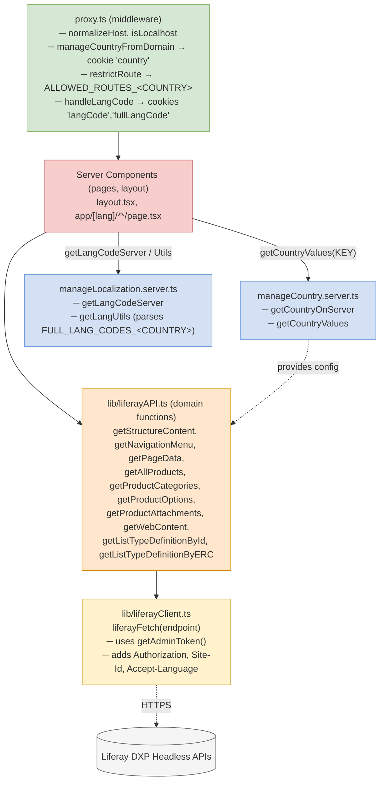
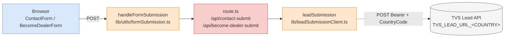

# Low Level Design — TVSM IB Next.js Website

> Audience: vendor / partner engineers picking up implementation work on the `TVSM-IB-NextJS` repository.
> Scope: implementation-level details — module breakdown, classes/services, API contracts, request lifecycle, validation, error handling, configuration.
> No secrets, tokens, or proprietary business rules are reproduced here. Configuration values are referenced by environment variable name only.
> Template reference: TVS Motor Confluence — *D&AI Engineering / Low Level Design Template*.

---

## 1. Overview

The TVSM IB Next.js website renders a multi-country (e.g. Italy, Malta, Spain, Portugal, Nepal, Bangladesh) marketing and lead-capture site from a single Next.js 16 / React 19 codebase. Country and language are resolved at the edge from the request host (or `?country=` on localhost), and per-country configuration is supplied via environment variables. Content is fetched from Liferay DXP using OAuth2 client-credentials, transformed into typed view models, and rendered as React Server Components. Forms POST to internal route handlers that forward to the TVS Lead Submission API.

This LLD documents the implementation-level details that engineers need to extend, debug, and operate the system.

---

## 2. High Level Design — Quick Recap

Reference doc: `docs/HLD.md`.

Summary:
- Edge: Azure Application Gateway with country-specific hosts.
- App: Next.js standalone server in AKS, single `nextjs-deployment`.
- Backend: Liferay DXP (in-cluster `internal-app`) for content; TVS Lead API for form submissions.
- Tier 2 — Business Critical.

---

## 3. Assumptions

- Liferay DXP is reachable in-cluster on `http://internal-app:80/` (`API_BASE_URL_<COUNTRY>` resolves to this).
- OAuth2 client-credentials flow is supported on Liferay (`/o/oauth2/token`).
- ConfigMap (`nextjs-config`) holds non-sensitive values; Secret (`nextjs-secrets`) holds `tvs-lead-token` and `liferay-client-secret`.
- Each country has its own Liferay site, page structures, header/footer structures, and navigation menus.
- Cookie consent state is read on the client; analytics scripts are deferred until consent is granted.
- The TVS Lead API expects a fixed payload schema with `extra_attributes` for additional fields.
- Pods are stateless apart from per-pod Next.js ISR cache and OAuth2 token cache.

---

## 4. Components

### 4.1 Module breakdown

| Layer | Module | Files | Responsibility |
| --- | --- | --- | --- |
| Edge | Middleware | `proxy.ts` | Country/language resolution; route allow-listing; cookie writes. |
| App shell | Root layout | `app/layout.tsx` | Fonts, header, footer, GA injector, cookie banner, image-base provider. |
| Pages | Localized pages | `app/[lang]/**/*` | Server components composing CMS-driven sections. |
| API | Route handlers | `app/api/**/*`, `app/health_check/data_source/route.ts`, `app/sitemap.xml/route.ts`, `app/robots.txt/route.ts` | Form submissions, health, SEO files. |
| Integration | Liferay client | `lib/liferayClient.ts` | Authenticated HTTP wrapper to Liferay. |
| Integration | Liferay domain API | `lib/liferayAPI.ts` | Content / catalog / list-type fetches. |
| Integration | Lead submission | `lib/leadSubmissionClient.ts` | Outbound POST to TVS Lead API. |
| Integration | Admin token | `lib/utils/adminToken.ts` | OAuth2 client-credentials token cache. |
| Domain transform | Data processing | `lib/utils/dataProcessingFunctions.ts` | Liferay structures → typed view models. |
| Cross-cutting | Country | `lib/utils/manageCountry.{server,client}.ts` | Resolve country and per-country values. |
| Cross-cutting | Localization | `lib/utils/manageLocalization.server.ts` | Languages, full lang codes per country. |
| Cross-cutting | SEO | `lib/utils/seoMetadata.server.ts` | Build Next.js Metadata from Liferay SEO settings. |
| Cross-cutting | Image base | `lib/utils/imageBaseUrl.server.ts`, `assetBaseUrl.client.ts` | Per-country asset URL prefixes. |
| Cross-cutting | Cookie consent | `lib/utils/cookieConsent.ts`, `cookieConsentContent.server.ts` | Consent state and CMS-driven copy. |
| Cross-cutting | Logger | `lib/utils/utilFuctions.ts:logger` | Structured colored logs with severity. |
| UI | Header / Footer | `components/Header/*`, `components/Footer/*` | Navigation chrome from Liferay structure. |
| UI | Home | `components/Home/*` | Banner, products, about, promotions, news, fillers. |
| UI | Product detail | `components/Product-detail/*` | Banner, display, features, gallery (Photoswipe), FAQ. |
| UI | Forms | `components/Forms/{ContactForm,BecomeDealerForm}.tsx` | Contact and dealer forms. |
| UI | Form elements | `components/Form-elements/*` | Reusable inputs (text, textarea, select, multi-checkbox, phone). |
| UI | Cookie consent | `components/CookieConsent/*` | Banner, preferences, settings. |

### 4.2 Folder layout (selected)

```
TVSM-IB-NextJS/
├── app/
│   ├── api/{become-dealer-submit,contact-submit,health}/route.ts
│   ├── health_check/data_source/route.ts
│   ├── robots.txt/route.ts, sitemap.xml/route.ts
│   ├── layout.tsx, not-found.tsx, not-found/page.tsx
│   └── [lang]/{page.tsx, our-products/[slug]/page.tsx, ...}
├── components/{Header,Footer,Home,Product-detail,Forms,Form-elements,CookieConsent,...}
├── lib/{liferayClient.ts, liferayAPI.ts, leadSubmissionClient.ts, hooks, utils}
├── types/{types.type.ts, liferay.type.ts, formInput.type.ts, formPayload.type.ts, ...}
├── proxy.ts
├── next.config.ts
├── Dockerfile
└── devops/{pipelines, k8s/{prod,uat/{primary,dr}}}
```

---

## 5. API Design

### 5.1 Inbound APIs (Next.js route handlers)

#### 5.1.1 `POST /api/contact-submit`

- **Purpose:** Submit Contact Us form leads.
- **Headers:**
  - `Content-Type: application/json` (required).
- **Cookies:** `country`, `langCode`, `fullLangCode` (set by middleware; used to derive `country_code` and `language_code`).
- **Request body** (`ContactUsNextPayload` from `types/formPayload.type.ts`):

```jsonc
{
  "firstName": "string",
  "lastName": "string",
  "email": "string",
  "phone": "string",
  "city": "string",
  "typeRequested": "string",
  "message": "string",
  "termsAndConditions": true,
  "communicationConsent": true,
  "dialCode": 39,
  "mandatoryFields": ["firstName", "email", "phone", "city", "termsAndConditions"]
}
```

- **Response** (200):

```jsonc
{
  "success": true,
  "apiStatus": 200,
  "apiData": { /* upstream Lead API response */ }
}
```

- **Status codes:**
  - `200` — request processed (check `success` field for upstream status).
  - `400` — invalid JSON or missing required input.
  - `500` — upstream error (network or non-2xx Lead API).

- **Idempotency:** Not idempotent. Each submission creates a new lead. Client should disable submit while in-flight.

#### 5.1.2 `POST /api/become-dealer-submit`

- **Purpose:** Submit Become Dealer form leads.
- **Headers / cookies:** Same as Contact Us.
- **Request body** (`BecomeDealerNextPayload`):

```jsonc
{
  "firstName": "string",
  "lastName": "string",
  "role": "string",
  "email": "string",
  "phone": "string",
  "individualDialCode": 39,
  "companyName": "string",
  "companyAddress": "string",
  "companyCity": "string",
  "companyZipCode": "string",
  "companyProvince": "string",
  "companyNation": "string",
  "companyPhone": "string",
  "companyDialCode": 39,
  "companyWebsite": "string",
  "numberOfEmployees": "string",
  "yearsOfActivity": "string",
  "operateIn": "string",
  "additionInformation": "string",
  "termsAndConditions": true,
  "communicationConsent": true,
  "mandatoryFields": ["firstName", "email", "phone", "..."]
}
```

- **Response / status codes:** Same envelope as Contact Us; `400` on bad input, `500` on upstream error.

#### 5.1.3 `GET /api/health`

- **Purpose:** Kubernetes readiness/liveness probe.
- **Response:** `200 OK` with body `OK` (plain text).

#### 5.1.4 `GET /health_check/data_source`

- **Purpose:** Datasource availability probe (Liferay reachability).
- Returns 200 on success; 5xx on failure.

#### 5.1.5 `GET /sitemap.xml`, `GET /robots.txt`

- **Purpose:** Dynamic SEO files generated from Liferay SEO settings; per-country output.

### 5.2 Outbound APIs (Liferay)

All outbound calls go through `liferayFetch(endpoint)` which prepends `API_BASE_URL` and adds `Authorization: Bearer <token>`, `Content-Type: application/json`, `Accept-Language: <fullLangCode>`, and `Site-Id: <LIFERAY_SITE_ID_<COUNTRY>>`.

| Endpoint | Method | Purpose | Wrapper |
| --- | --- | --- | --- |
| `o/oauth2/token` | POST (form-urlencoded) | Issue access token | `getAdminToken()` |
| `o/headless-delivery/v1.0/content-structures/{id}/structured-contents?fields=...` | GET | Fetch structured contents for a content structure | `getStructureContent(id)` |
| `o/headless-delivery/v1.0/navigation-menus/{id}?fields=id,navigationMenuItems.link,navigationMenuItems.name` | GET | Navigation menu items | `getNavigationMenu(id)` |
| `o/headless-delivery/v1.0/sites/{siteId}/site-pages/{friendlyUrl}?fields=pageSettings.seoSettings,title,uuid` | GET | Page SEO settings | `getPageData(friendlyUrl)` |
| `o/headless-admin-list-type/v1.0/list-type-definitions/{id}` | GET | List type by ID | `getListTypeDefinitionById(id)` |
| `o/headless-admin-list-type/v1.0/list-type-definitions/by-external-reference-code/{erc}?fields=listTypeEntries.key,listTypeEntries.name,listTypeEntries.name_i18n` | GET | List type by ERC | `getListTypeDefinitionByERC(erc)` |
| `o/tvs/getProducts?searchCategory=<cat>` | GET | Product list | `getAllProducts(category)` |
| `o/tvs/getAllProductsCategories` | GET | Product categories | `getProductCategories()` |
| `o/tvs/product-options/batch?productIds=<ids>` | GET | Product options batch | `getProductOptions(ids[])` |
| `o/tvs/product-options/{id}/options` | GET | Product options single | `getProductOptions(id)` |
| `o/tvs/getProductAttachments/{id}` | GET | Product attachments | `getProductAttachments(id)` |
| `o/tvs/webcontent/{siteId}/{id}` | GET | Web content by ID | `getWebContent(id)` |

### 5.3 Outbound API (Lead Submission)

- **Endpoint:** `TVS_LEAD_URL_<COUNTRY>` (e.g. `https://lms-api.tvsmotor.com/weu/api/lead`).
- **Method:** `POST`.
- **Headers:** `Authorization: Bearer <TVS_LEAD_TOKEN>`, `CountryCode: <ALPHA2_CODE_<COUNTRY>>`, `Content-Type: application/json`.
- **Body:** see Section 5.4 for payload mappings.
- **Status codes:** Forwarded as `apiStatus`. The Next.js route always returns `200` unless the network call fails (then `500`).

### 5.4 Payload mapping (form to Lead API)

| Lead API field | Source | Notes |
| --- | --- | --- |
| `customer_name` | `firstName + " " + lastName` | concatenation |
| `mobile_number` | `phone` | as entered |
| `email_id` | `email` | |
| `enquiry_date` | `new Date().toISOString().replace('T',' ').substring(0,23)` | `YYYY-MM-DD HH:mm:ss.sss` |
| `country_code` | `ALPHA2_CODE_<COUNTRY>` (Contact Us) or `'IT'` (Become Dealer; legacy) | cookie/env-derived |
| `language_code` | `langCode` cookie, uppercased | |
| `source_id` | `2` | constant |
| `brand_code` | `0` (Contact Us only) | constant |
| `customer_voice` | `message` (Contact Us) / `additionInformation` (Become Dealer) | |
| `extra_attributes` | per-form list of `{attribute_name, attribute_description, attribute_value}` | see route handlers for the exact list |
| `additional_details.enquiry_type` | `'Contact Us Enquiry'` / `'Dealer Enquiry'` | |
| `additional_details.marketing_consent` | `communicationConsent ? 1 : 0` | |
| `additional_details.user_consent` | `termsAndConditions ? 1 : 0` | |

### 5.5 Status codes & error codes (inbound)

| HTTP | When |
| --- | --- |
| 200 | Lead submission accepted (check `success`) |
| 400 | Invalid JSON or required input missing |
| 500 | Upstream Lead API failure or unhandled exception |

---

## 6. Data Model / Schema Usage

The Next.js application owns no database. It consumes Liferay's content shape and produces domain view models.

### 6.1 Liferay content shape (raw)

`types/liferay.type.ts`:

| Type | Purpose |
| --- | --- |
| `ContentStructure` | A structured-content item (with `id`, `key`, `title`, `friendlyUrlPath`, `contentFields`). |
| `ContentField` | A field with `name`, `label`, `dataType`, `inputControl`, `repeatable`, and either a `ContentValueAsset` or `ContentValueString` value, plus `nestedContentFields` (recursive). |
| `ContentValueAsset` | `{ image \| document: { contentUrl, description, ... } }`. |
| `ContentValueString` | `{ data: string }`. |
| `ListTypeEntry` | `{ key, name, name_i18n }` for select/checkbox option lists. |

### 6.2 Domain view models

`types/types.type.ts` (selected):

| Type | Purpose |
| --- | --- |
| `MenuType`, `MenuItemType` | Footer/Header navigation. |
| `HomeBannerData`, `Button`, `HomeAboutSectionData`, `ButtonFillerSectionData` | Home sections. |
| `Promotion`, `NewsItem`, `PressRoomDocument`, `HistoryItem` | Card-based content. |
| `Product`, `ProductCustomFields`, `ProductImage`, `ProductSku`, `ProductSpecification`, `ProductOption`, `ProductOffering`, `ProductAttachment`, `ProductSummary` | Product entities. |
| `FormField`, `FormFieldOption`, `FieldMap<T>`, `FormProps<T>`, `FormContentData<T>` | Form rendering. |
| `LegalDocsData`, `SeoSettings`, `PageData` | Legal pages and SEO. |
| `StructureInfo`, `StructureInfoMap` | Per-page section configuration. |

### 6.3 Liferay content structure conventions

- Every page has a corresponding `PageStructure` definition (parent ID `PAGE_STRUCTURE_ID_<COUNTRY>`) with `PageFriendlyUrl` and a list of `StructureSection` entries (`StructureName`, `StructureId`, `show`, `WebContentKey`).
- Footer is driven by a structure (`FOOTER_STRUCTURE_ID_<COUNTRY>`) containing `FooterTvsLogo`, `FooterCompanyName`, `FooterCompanyAddress`, `FooterCompanyEmail`, `FooterSocialIconFieldset[]`, `FooterNavigationMenuFieldset[] { FooterNavigationMenuText, FooterNavigationMenuId }`, `FooterCopyright`.
- Header is driven by `HEADER_STRUCTURE_ID_<COUNTRY>` (parallel structure).
- Cookie consent strings come from `COOKIE_CONSENT_STRUCTURE_ID_<COUNTRY>`.
- Forms come from form-content structures with `FormSection[] { FormSubHeading, FormFields[] { FormFieldLabel, FormFieldName, FormFieldOptionsId, FormFieldPlaceholder, FormFieldRegex, FormFieldError, FieldMandatory } }`.

---

## 7. Class & Interface Design

The codebase is functional rather than class-based. The "service layer" maps to module-level functions. The diagram below shows responsibilities and call relations.



**Forms flow**



### 7.1 Key module responsibilities

| Module / function | Responsibility |
| --- | --- |
| `liferayClient.liferayFetch(endpoint)` | Construct absolute URL, attach auth + locale + site headers, parse JSON, throw on non-2xx with status text & body. |
| `adminToken.getAdminToken()` | Return cached token; refresh when missing or near expiry. Reads `LIFERAY_CLIENT_ID`/`LIFERAY_CLIENT_SECRET` from env; never logs them. |
| `liferayAPI.*` | One function per logical Liferay domain operation; each catches errors via try/catch and returns a safe fallback (`[]` or empty object) while logging. |
| `manageCountry.server.getCountryValues(key)` | Returns `process.env[key + '_' + countryCookie.toUpperCase()]` — the single mechanism for per-country config. |
| `manageLocalization.server.getLangUtils(country?)` | Parses `FULL_LANG_CODES_<COUNTRY>` JSON. Returns `{ supportedLangs, fullLangCodes }`. |
| `dataProcessingFunctions.*` | Pure transformers for Liferay → view models. Functions are name-prefixed by intent (`getTextField`, `getAssetField`, `processPromotionData`, `processFormContentData`, `processPageStructure`, `getProductSummaries`, etc.). |
| `seoMetadata.server.buildSeoMetadata(name)` | Build Next.js `Metadata` from the page's Liferay SEO settings. |
| `leadSubmissionClient.leadSubmission(payload)` | POST to `TVS_LEAD_URL_<COUNTRY>` with `Authorization` + `CountryCode`. Wraps response in a `NextResponse.json` envelope. |
| `formSubmission.handleFormSubmission` | Browser-side helper to POST a form; toggles loader state, sets `success`/`error`, resets the form on success. |
| `utilFuctions.logger(message, meta?, level?)` | Colored, timestamped, severity-aware console logger. Supports `info`, `warn`, `error`, `debug`. |
| `utilFuctions.validateField` / `validateAllFields` / `getFieldError` | Per-field and whole-form validation against `FieldMap<T>`. |

---

## 8. UI Changes

UI is composed entirely of React Server / Client Components under `components/`. Notable patterns:

- **Server components** for data-bound sections (Header, Footer, Home sections, Product detail).
- **Client components** (`'use client'`) for interactive UI: all form components, `IntlTelInput` phone, `Swiper`/`Photoswipe` galleries, cookie banner, `GAListener`.
- **Tailwind utility-first styling** with global CSS in `styles/main.css`. Form-specific styles in `styles/form-theme.css`.
- **Local font** (`next/font/local`) for the `Albert Sans` font family with `variable: --font-myfont`.
- **Image optimization** via `next/image` with whitelisted remote patterns from `next.config.ts`. `IMAGE_BASE_URL_<COUNTRY>` is prefixed to relative Liferay asset paths.
- **HTML sanitization** for any CMS-authored HTML rendered via `dangerouslySetInnerHTML` (e.g. footer company address).

### 8.1 Component composition example (Home page)

```
<HomePageBanner />          // Liferay HOME-BANNER-STRUCTURE
<HomeProductSectionWrapper> // wraps tabs, content
  <HomeProductSectonTabs />
  <HomeProductsSectionContent />
</HomeProductSectionWrapper>
<HomeAboutSection />        // Liferay HOME-TVS-MOTOR-SECTION
<ButtonFillerSection />     // STORY-BUTTON-SECTION
<HomePromotionSection />    // PROMOTION-STRUCTURE
<HomeNewsSection />         // NEWS-STRUCTURE
<ButtonFillerSection />     // DEALER-LOCATOR-BUTTON-SECTION
```

Each section is rendered conditionally based on the `show` flag for its Liferay `StructureSection`.

---

## 9. Request / Response Lifecycle

### 9.1 Page render

1. Browser → AppGw → `nextjs-app` Service → Pod.
2. **`proxy.ts`** runs:
   - Reads `Host` header; on localhost reads `?country=`; otherwise extracts `<country>` from the subdomain (`<env>-<country>.<domain>` or `<country>.<domain>`).
   - Sets cookie `country` (lowercase) on the response.
   - Loads `FULL_LANG_CODES_<COUNTRY>` and computes `supportedLangs`.
   - If pathname not allowed by `ALLOWED_ROUTES_<COUNTRY>`, redirects to `/not-found`.
   - Redirects `/` to `/<DEFAULT_LANGUAGE_<COUNTRY>>`.
   - Writes `langCode` and `fullLangCode` cookies (1-year TTL).
3. **App Router** matches the route segment.
4. **Server component** runs:
   - `processPageStructure(name)` → reads page structure from Liferay, returns `friendlyUrl` and `StructureInfoMap`.
   - For each section: `getRelevantContent(structureInfo[section])` (in parallel with `Promise.allSettled`) → calls `getStructureContent(id)`.
   - `dataProcessingFunctions` map raw structures into view models.
5. Component returns JSX → Next.js streams HTML.
6. ISR caches the rendered output (`revalidate=1800s` typical).

### 9.2 Lead submission

1. Client form: validates fields locally via `validateAllFields` → shows errors or proceeds.
2. `handleFormSubmission` POSTs the payload to `/api/contact-submit` (or `/api/become-dealer-submit`).
3. Route handler reads cookies (`langCode`, `country`), maps payload to Lead API schema, calls `leadSubmission(payload)`.
4. `leadSubmission` POSTs to `TVS_LEAD_URL_<COUNTRY>` with `Authorization: Bearer <TVS_LEAD_TOKEN>` and `CountryCode: <ALPHA2_CODE_<COUNTRY>>`.
5. Returns JSON envelope; client toggles `success`/`error` UI; success resets the form.

---

## 10. Validation Logic

Validation is rule-driven via the form's `FieldMap<T>`. Each field carries:

```ts
{
  label: string;
  name: string;
  options: FormFieldOption[];
  placeholder: string;
  validationRegex: string[];   // 0..N regexes parsed from FormFieldRegex
  errorMsgs: string[];         // semicolon-separated error messages
  mandatory: boolean;
}
```

`getFieldError(value, name, fields)` algorithm:

1. If field is `mandatory` and `value` is falsy → return `errorMsgs[0]` (or generic).
2. If `value` present and `validationRegex` exists → iterate:
   - Build `new RegExp(regex)`.
   - Pick error message: when mandatory, use `errorMsgs[i + 1]`; otherwise `errorMsgs[i]`. (The first message is reserved for the "required" case.)
   - If regex fails, return that message.
3. Otherwise return empty string.

`validateField(value, name, fields, setErrors)` updates the React error state; returns `true` if valid.

`validateAllFields(form, fields, setErrors)` walks the form and sets the full error map atomically; returns the errors object (callers treat non-empty as failure).

The regex string from Liferay (`FormFieldRegex`) is split with the regex `/,(?= ?\/)/` (so commas inside `/.../` regexes don't split fields) and the leading/trailing `/` are stripped per entry.

### 10.1 Server-side guards

- Route handlers parse JSON inside try/catch and return `400` with a generic error on parse/validation failure.
- The `mandatoryFields` array passed in the payload is currently informational; route handlers do not re-derive or re-enforce mandatory checks beyond JSON parsing. Strengthening this is a recommended improvement (see Open Questions).

---

## 11. Error Handling & Retries

### 11.1 Categories

| Category | Source | Example | Handling |
| --- | --- | --- | --- |
| Client validation | Form fields | empty mandatory field | inline errors via `setErrors`; `submissionStatus = 'error'` |
| Bad request | API route | malformed JSON | `400` with `{ error: 'Invalid input' }` |
| Auth | Liferay token | expired or invalid credentials | `getAdminToken` re-fetches on next call; rethrows with descriptive message |
| Upstream content | Liferay 5xx / network | Liferay outage | `liferayAPI.*` catches, logs via `logger`, returns safe empty value |
| Upstream lead | Lead API failure | timeout / 5xx | route returns `500` with `{ success: false, error }` |
| Page-level | All sections fail | total Liferay outage with cold cache | page throws → Next.js renders error/not-found |

### 11.2 Retries / backoff
- **Token:** lazy refresh on next call after expiry; no explicit backoff.
- **Liferay reads:** no in-process retries; ISR cache acts as a buffer.
- **Lead submissions:** no retry; client-side only allows a single submission per session before reset.

### 11.3 Timeout thresholds
- HTTP fetches use Node defaults; no explicit timeouts. Add timeouts via `AbortController` if needed.
- Kubernetes probes: readiness `timeoutSeconds: 5`, `failureThreshold: 3`, `periodSeconds: 10`. Liveness `timeoutSeconds: 5`, `failureThreshold: 3`, `periodSeconds: 15`, `initialDelaySeconds: 60`.

### 11.4 Fallbacks
- ISR-cached page is served while Liferay is unavailable.
- Section-level `Promise.allSettled` allows partial home-page rendering.
- `dataProcessingFunctions` defensively use optional chaining and provide string defaults (e.g. `'Promotion Heading'`).
- Image fields default to `{ contentUrl: '', description: '' }` via `cleanAssetField`.

### 11.5 Logging contract

`logger(message, meta?, level?)` produces:
```
[YYYY-MM-DD HH:mm:ss.sss] [LEVEL] [domain?] [path?] message {restMeta}
```
- ANSI-colored output by level (`info`, `warn`, `error`, `debug`).
- `meta` is JSON-stringified except for `domain` and `path`, which are shown as bracketed prefixes.

---

## 12. Security and Compliance

### 12.1 Encryption
- **In transit:** TLS terminated at Application Gateway (`tvsmotor-com` / `tvsmotor-net-wc`). In-cluster traffic uses internal service network.
- **At rest:** Application stores no PII. Liferay and Lead API own their respective at-rest encryption.

### 12.2 Authentication / authorization
- **Liferay:** OAuth2 client-credentials (`LIFERAY_CLIENT_ID`, `LIFERAY_CLIENT_SECRET`), Bearer access token with `expires_in`.
- **Lead API:** Static Bearer token (`TVS_LEAD_TOKEN`).
- **Public site:** anonymous; no end-user auth.

### 12.3 Token management
- Token cached per-pod with expiry safety margin.
- Refreshed lazily; no explicit revocation.

### 12.4 PII / GDPR
- Cookie consent gates analytics; only first-party functional cookies (`country`, `langCode`, `fullLangCode`) are written by middleware (1-year TTL).
- Form submissions transit PII (name, email, phone) over HTTPS; payload is logged at `console.log` for traceability — `console.log` calls in `route.ts` should be reviewed against GDPR posture and tightened where needed.
- HTML from Liferay is sanitized with `sanitize-html` before insertion via `dangerouslySetInnerHTML`.

### 12.5 Secrets
- `nextjs-secrets` Kubernetes Secret holds `tvs-lead-token` and `liferay-client-secret`; mounted as env vars.
- Code never reads files or stores secrets on disk; never logs secret values.

---

## 13. RBAC

Not applicable to the public-facing site. The application has a single anonymous role for end users. Service-to-service authorization is governed by the OAuth2 client and bearer tokens above.

---

## 14. Configuration Rules & Feature Flags

### 14.1 Convention

All country-scoped configuration uses `<KEY>_<COUNTRY>` env vars. Country is uppercase and matches the host subdomain.

### 14.2 Catalog of variables

| Variable | Source | Purpose |
| --- | --- | --- |
| `API_BASE_URL` and `API_BASE_URL_<COUNTRY>` | ConfigMap | Liferay base URL (in-cluster service). |
| `LIFERAY_CLIENT_ID` | ConfigMap | OAuth2 client id (non-secret). |
| `LIFERAY_CLIENT_SECRET` | Secret | OAuth2 client secret. |
| `LIFERAY_SITE_ID_<COUNTRY>` | ConfigMap | Liferay site id used in `Site-Id` header. |
| `IMAGE_BASE_URL_<COUNTRY>`, `NEXT_PUBLIC_IMAGE_BASE_URL_<COUNTRY>` | ConfigMap | Asset URL prefix (server / client). |
| `HEADER_STRUCTURE_ID_<COUNTRY>`, `FOOTER_STRUCTURE_ID_<COUNTRY>` | ConfigMap | Structure IDs for site chrome. |
| `COOKIE_CONSENT_STRUCTURE_ID_<COUNTRY>` | ConfigMap | Structure for cookie banner copy. |
| `PAGE_STRUCTURE_ID_<COUNTRY>` | ConfigMap | Parent structure listing page configurations. |
| `ALLOWED_ROUTES_<COUNTRY>` | ConfigMap | Comma-separated allowlist (`*` to allow all; `/path/*` for prefix). |
| `DEFAULT_LANGUAGE_<COUNTRY>` | ConfigMap | Default language for `/` redirect. |
| `FULL_LANG_CODES_<COUNTRY>` | ConfigMap | JSON map `{ "<lang>": "<full_lang>" }`. |
| `ALPHA2_CODE_<COUNTRY>` | ConfigMap | ISO 3166-1 alpha-2 country code. |
| `TVS_LEAD_URL_<COUNTRY>` | ConfigMap | Lead Submission API URL. |
| `TVS_LEAD_TOKEN` | Secret | Bearer token for Lead API. |
| `DEALER_LOCATOR_URL_<COUNTRY>` | ConfigMap | External dealer locator URL. |
| `GRAPHQL_API_URL_<COUNTRY>` | ConfigMap | (Reserved) GraphQL endpoint. |
| `GAEVENTID` | ConfigMap | GA / GTM container id. |

### 14.3 Feature flags
- The `show` flag on each Liferay `StructureSection` acts as a per-section, per-country feature flag (decided in CMS, not in code).
- `cookieConsentEnabled` is computed from the cookie-consent structure presence.
- No runtime feature flag service is currently integrated.

---

## 15. Dependencies

### 15.1 Internal
- Liferay DXP (content APIs, OAuth2).
- TVS Lead Submission API.

### 15.2 External (npm)

| Package | Version | Use |
| --- | --- | --- |
| `next` | 16.0.10 | Framework, ISR, middleware. |
| `react`, `react-dom` | 19.2.x | UI runtime. |
| `@next/third-parties` | 16.0.10 | Optimized third-party scripts. |
| `swiper` | ^11 | Carousels. |
| `photoswipe` | ^5 | Lightbox. |
| `intl-tel-input` | ^25 | Phone input. |
| `cheerio` | ^1 | HTML parsing on server. |
| `sanitize-html` | ^2 | HTML sanitization. |
| `clsx` | ^2 | className helper. |
| `graphql-request` | ^7 | Reserved for GraphQL calls. |

### 15.3 Build & test
- TypeScript 5.9.
- Jest 30 + Testing Library.
- Playwright 1.57.
- Babel preset-env / preset-typescript for Jest.

### 15.4 Guarantees
- Pods are stateless aside from in-memory caches; safe to horizontally scale.
- All upstream calls return safe fallbacks on error so the page can still render.
- Secrets are read only from environment variables; no on-disk storage.

---

## 16. Trade-offs & Alternatives Considered

| Decision | Alternative considered | Reason for choice |
| --- | --- | --- |
| Functional modules + module caches | Class-based services + DI | Smaller surface area; idiomatic for Next.js / React Server Components. |
| Per-pod in-memory token cache | Shared Redis token cache | Simplicity; revisit at higher pod counts. |
| Field metadata sourced from CMS | Hard-coded form schemas | Lets non-engineers change validation/labels per country. |
| ISR with `revalidate=1800s` | Full SSG or fully dynamic | Balances freshness with throughput; tolerates CMS hiccups. |
| `Promise.allSettled` per home section | Fail-fast `Promise.all` | Partial degradation preferred over a blank page. |
| Static bearer token for Lead API | Per-request signed payload / mTLS | Simplicity matches current Lead API contract; improvement candidate. |

---

## 17. Open Questions

- Should server-side route handlers re-validate `mandatoryFields` (currently informational)?
- Should `console.log(payload)` calls in form route handlers be removed or scrubbed for PII?
- Should the OAuth2 token be moved to a shared cache (Redis) to avoid N tokens at scale?
- Should we add explicit `AbortController` timeouts on outbound fetches (Liferay and Lead API)?
- Is a per-country DR cluster needed in production (UAT already has primary + DR)?
- Should `Become Dealer` route hard-code `country_code: 'IT'` or derive from the cookie like Contact Us?
- Should we migrate Lead submissions to a queue (e.g. Service Bus) to absorb upstream outages?

---

## Appendix A — Algorithm references

### A.1 Country resolution (`proxy.ts`)
```
host = request.headers.host  (lowercased, port stripped)
if (isLocalhost(host)) {
   if (?country=) country = upper(?country) and set cookie
   else country = 'MALTA' (default)
}
else if (host matches /^(uat|dev)-/) {
   subdomain = host.split('.')[0].split('-')[1]
}
else {
   subdomain = host.split('.')[0]
}
country = subdomain.toUpperCase()
cookie 'country' = subdomain
```

### A.2 Language gate (`proxy.ts`)
```
matched = supportedLangs.find(loc => path == /loc || path.startsWith(/loc/))
if (matched) set cookies langCode, fullLangCode → continue
else redirect to /not-found
```

### A.3 Route allow-listing (`proxy.ts`)
```
allowed = env[ALLOWED_ROUTES_<country>].split(',').trim()
if (allowed.includes('*')) → permit
strip leading /<lang>/ from path → normalizedPath
if (allowed.includes(normalizedPath)) → permit
for each route in allowed:
   if route ends with '/*' and (normalizedPath == base or starts with base + '/') → permit
otherwise → deny → redirect /not-found
```

### A.4 Validation (`utilFuctions.getFieldError`)
- Mandatory empty → `errorMsgs[0]`.
- Otherwise iterate `validationRegex` and pick `errorMsgs[i+1]` when mandatory or `errorMsgs[i]` when optional.

### A.5 Price formatting (`utilFuctions.formatPrice`)
- Right-fill the `CurrencyFormat` template (e.g. `# ###.##`) with digits of `price` from right to left, then trim leading non-digit characters and prepend `CurrencySymbol`.

---

## Appendix B — File-by-file responsibility map (selected)

| File | Responsibility |
| --- | --- |
| `proxy.ts` | Edge middleware: country, lang, route allow-list, cookies. |
| `app/layout.tsx` | Root layout: fonts, header/footer, GA, cookie banner. |
| `app/[lang]/page.tsx` | Home page composition. |
| `app/[lang]/our-products/page.tsx`, `[slug]/page.tsx` | Product listing & detail. |
| `app/[lang]/contact-us/page.tsx`, `become-dealer/page.tsx` | Form pages. |
| `app/api/contact-submit/route.ts`, `become-dealer-submit/route.ts` | Lead submission handlers. |
| `app/api/health/route.ts` | Probe endpoint. |
| `app/health_check/data_source/route.ts` | Datasource probe. |
| `app/sitemap.xml/route.ts`, `app/robots.txt/route.ts` | SEO files. |
| `lib/liferayClient.ts` | Authenticated Liferay HTTP client. |
| `lib/liferayAPI.ts` | Domain calls to Liferay headless / catalog. |
| `lib/leadSubmissionClient.ts` | Lead API client. |
| `lib/utils/adminToken.ts` | OAuth2 client_credentials token cache. |
| `lib/utils/dataProcessingFunctions.ts` | Liferay → view model transforms. |
| `lib/utils/manageCountry.{server,client}.ts` | Country resolution. |
| `lib/utils/manageLocalization.server.ts` | Language utilities. |
| `lib/utils/seoMetadata.server.ts` | SEO metadata builder. |
| `lib/utils/cookieConsent.ts`, `cookieConsentContent.server.ts` | Consent state and copy. |
| `lib/utils/imageBaseUrl.server.ts`, `assetBaseUrl.client.ts` | Asset URL prefix helpers. |
| `lib/utils/formSubmission.ts` | Browser form POST helper. |
| `lib/utils/utilFuctions.ts` | Logger, validation, format helpers. |
| `components/Forms/ContactForm.tsx`, `BecomeDealerForm.tsx` | Form components. |
| `components/Form-elements/*` | Reusable inputs. |
| `components/Header/*`, `components/Footer/*` | Site chrome. |
| `components/Home/*`, `Product-detail/*`, `Press-room/*`, `Legal-docs/*`, `History/*`, `Who-we-are/*` | Page sections. |
| `components/CookieConsent/*` | Cookie banner & preferences. |
| `components/GAListener.tsx` | GA page-view events on route change. |
| `components/ImageBaseUrlProvider.tsx` | React context for asset base URL. |
| `next.config.ts`, `Dockerfile`, `devops/k8s/**`, `devops/pipelines/**` | Build / deploy. |

---

End of LLD.
