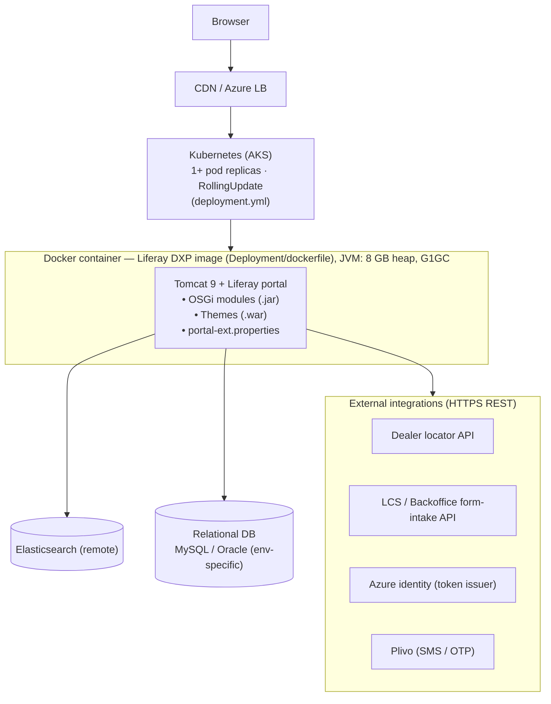
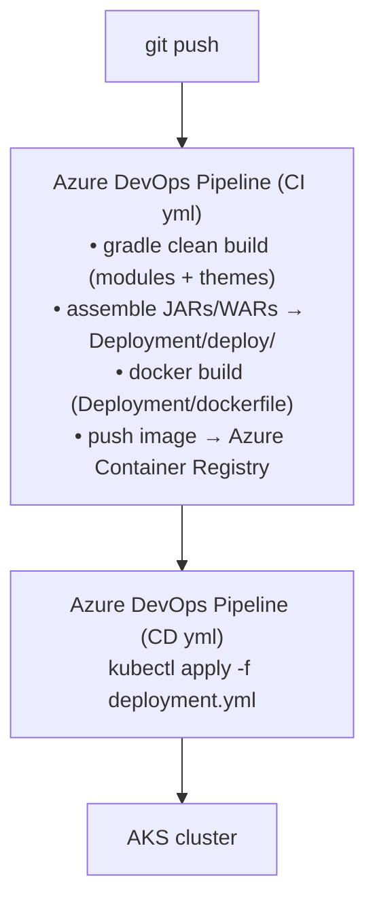
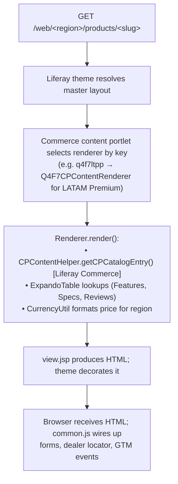
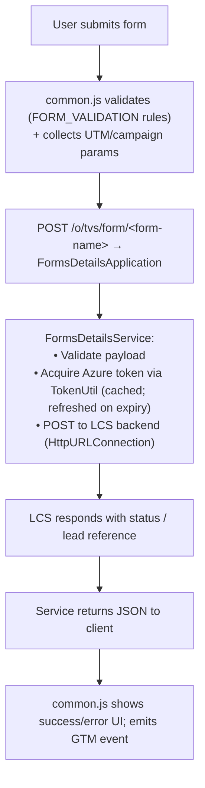
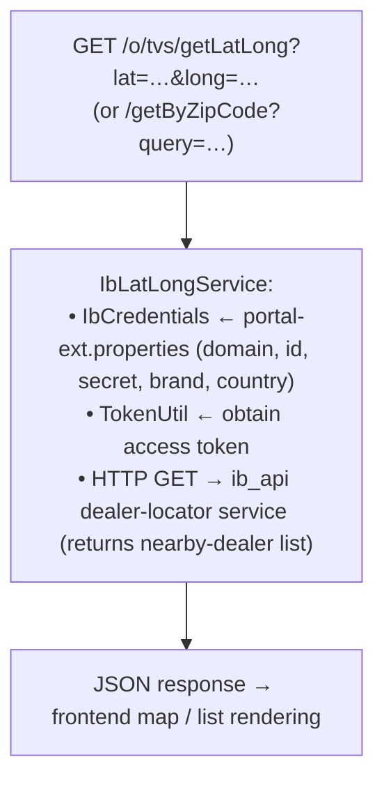

# High Level Code Document — TVS-Website-Nepal

**Document Type:** High Level Code (HLC) — Vendor Onboarding Reference
**Repository:** `TVS-Website-Nepal`
**Platform:** Liferay DXP 7.4 (Update 62 / 7.4.13.u102)
**Last Reviewed:** May 2026
**Audience:** Onboarding engineers, partner vendors, integration teams

> Sensitive values (database connection strings, API keys, tokens, third-party credentials, internal hostnames) are intentionally referenced by location only. Never copy actual values from the configuration files into shared documentation.

---

## 1. Application Overview

TVS-Website-Nepal is a multi-region corporate and product website built on Liferay DXP 7.4. Despite the repository name, it serves as the codebase for several international markets — **LATAM** (Mexico, Brazil, Colombia, etc.), **Europe** (Germany, Turkey, generic EU), and additional locales — through region-specific themes, product renderers, and portlet variants.

The platform handles:

- Two-wheeler product catalog (Premium motorcycles, Mopeds, Electric vehicles)
- Product detail pages with images, video, specifications, pricing, reviews
- Product comparison via React widgets
- Dealer locator (geolocation and zip-code lookup)
- Lead capture forms (sales, finance, feedback, customer queries)
- OTP-based phone verification
- Region-aware currency formatting and localization

**Not in scope of this codebase:** Order capture / commerce checkout, payment gateway, ERP, CRM master data — these live in downstream systems integrated via REST.

---

## 2. Module Summary

The codebase is split into **OSGi modules** (Java backend, JAX-RS APIs, product renderers) and **themes** (Liferay theme WARs containing FreeMarker templates, SCSS, JS).

### 2.1 Module Categories

| Category | Modules | Purpose |
|----------|---------|---------|
| **Product renderers** | `latam-premium-product-detail-renderer`, `latam-non-premium-product-detail-render`, `premium-renderer`, `premium-renderer_europe`, `moped-renderer`, `moped-renderer-europe`, `ev_detail_europe`, `global-eu-product-detail-renderer`, `ev-renderer` | Implement Liferay Commerce `CommerceProductContentRenderer` to render the Product Detail Page (PDP) for a specific market × product-type combination. Each renderer is registered with a unique key (e.g. `q4f7ltpp` = LATAM Premium) and renders a corresponding `view.jsp`. |
| **REST APIs** | `Controller`, `LatamApis`, `FormsDetails` | JAX-RS applications exposing endpoints under `/o/tvs/*` and `/o/list/*` for geolocation, dealer lookup, city/dealer reference data, and form submissions. |
| **React widgets** | `product-comparison-react`, `our-products-react-widget-with-rtl` | Client-side rich UI bundled and exposed as Liferay portlets. Comparison includes mobile and web views, currency formatting, brochure download, and GTM tracking. |
| **HTTP filter / middleware** | `servlet-filter` | Sets Content-Security-Policy headers and request hardening for the entire portal. |
| **Form/services support** | `FormsDetails` (and contained `LmsFormsService`, `RateLimitFilter`, Azure token classes) | Server-side form orchestration: validation, Azure token acquisition, downstream LCS/Backoffice submission, OTP rate limiting. |
| **Context contributor** | `context-contributor` | Page/template context enrichment (theme variables and portal-level objects). |

### 2.2 Theme Summary

| Theme | Region |
|-------|--------|
| `tvs-latam-theme` | Latin America master |
| `tvs-mexico-theme` | Mexico |
| `tvs-eu-master-theme` | EU master / shared |
| `tvs-europe-theme` | EU general |
| `tvs-germany-theme` | Germany |
| `tvs-turkey-theme` | Turkey |

Themes share a common pattern: FreeMarker layout templates, SCSS based on Liferay `frontend-theme-styled`, Gulp 4 build, multi-locale `Language_*.properties`, and a shared `common.js` for form validation, OTP flows, and dealer-locator UI.

### 2.3 Folder Structure (top 2 levels)

```
TVS-Website-Nepal/
├── azure-pipelines/      # Azure DevOps CI/CD YAML for Dev, UAT, Prod and Sitecore-integrated pipelines
├── configs/              # Environment-scoped config (common, local, dev, uat, prod, docker)
│   └── <env>/
│       ├── portal-ext.properties
│       └── osgi/configs/  # OSGi component .config files (e.g. Elasticsearch)
├── Deployment/           # Container & K8s artifacts
│   ├── deploy/           # Pre-built JAR/WAR drops + Liferay license activation key
│   ├── tvs_liferay/      # Bundle reference data (HSQLDB, license, tomcat conf)
│   ├── patching/         # Liferay DXP hotfix zips (LFS-tracked)
│   ├── dockerfile        # Container image build
│   └── deployment.yml    # Kubernetes manifest
├── modules/              # OSGi source modules (one folder per module)
├── themes/               # Liferay themes (one folder per region)
├── gradle/, gradlew*     # Gradle wrapper
├── build.gradle, gradle.properties, .blade.properties  # Workspace build config
└── GETTING_STARTED.markdown
```

---

## 3. Dependency Overview

### 3.1 Platform & Runtime

| Component | Version |
|-----------|---------|
| Liferay DXP | 7.4.13 U102 (workspace product `dxp-7.4-u62`) |
| Liferay Commerce | 3.0.0 |
| Apache Tomcat | 9.0.40 (bundled by Liferay) |
| Java | 11 (Liferay 7.4 baseline) |
| Elasticsearch | 7 (remote mode, prod/UAT) |
| Database | HSQLDB (local), MySQL/Oracle (UAT/prod — defined in `portal-ext.properties`) |
| Build | Gradle wrapper, Blade CLI, Liferay Workspace |

### 3.2 Java Library Dependencies (selected)

| Library | Version | Used By |
|---------|---------|---------|
| Jackson | 2.0.1 | JSON serialization (modules) |
| Gson | 2.3.1 | JSON parsing |
| Apache HttpClient | 4.5.1 | External REST calls |
| Jersey (JAX-RS) | 2.35 | Optional alternative client |
| Plivo Java SDK | 5.18.0 | SMS / OTP delivery |
| Lombok | 1.18.30 | Boilerplate reduction |
| SLF4J / Logback | 1.7.32 / 1.2.6 | Logging |
| JUnit 5 | 5.7.0 | Tests |
| Mockito | 3.11.2 | Tests |
| PowerMock | 2.0.9 | Tests (static/constructor mocking) |
| AssertJ | 3.24.2 | Tests |
| `org.json` | 20240303 | JSON utilities |

### 3.3 Frontend / Theme Dependencies

| Library | Version | Purpose |
|---------|---------|---------|
| Gulp | 4.0.2 | Theme build pipeline |
| Liferay Theme Tasks | 11.5.6 | Liferay-specific Gulp tasks |
| Liferay Frontend CSS Common | 6.0.8 | Shared CSS resets/utilities |
| Liferay Frontend Theme Styled | 6.0.54 | Base styled theme |
| Compass Mixins | 0.12.10 | SCSS mixins |
| FontAwesome | 3.5.2 | Icons (Germany theme) |

---

## 4. Runtime Flow

### 4.1 Deployment Topology



### 4.2 Build & Release Path



CI/CD definitions live in `azure-pipelines/`: `ci_dev_yml`, `CI_UAT_YAML`, `CI_PROD_YAML`, and the matching `cd_*` files. A separate Sitecore-integrated UAT pipeline coexists for content migration scenarios.

### 4.3 Request Flow — Product Detail Page



### 4.4 Request Flow — Form Submission



### 4.5 Request Flow — Dealer Locator



---

## 5. Key Services

### 5.1 `Controller` module — `com.tvs.controller`

| Class | Responsibility |
|-------|----------------|
| `IbLatLongService` | Geolocation and dealer lookup against the external dealer-locator API. |
| `IbCredentials` | Strongly-typed holder for dealer-locator credentials sourced from portal properties. |
| `LanguageResource` / `LanguageService` | REST-exposed language and translation lookups. |
| `CurrencyUtil` | Region-aware currency formatting — symbol, pattern, fraction digits, parsed from a Liferay XML config. |
| `TokenUtil` | OAuth-style token acquisition for downstream APIs. |
| `ConnectionProvider` / `ConnectionProviderImpl` | HTTP connection abstraction (testability). |
| `CategoryTranslations` | Category-name translation helper. |

### 5.2 `FormsDetails` module — `lcsforms.application`

| Class | Responsibility |
|-------|----------------|
| `FormsDetailsApplication` | JAX-RS application class; declares all `/o/tvs/form/*` endpoints. |
| `FormsDetailsService` | Form processing pipeline → token acquisition → LCS backend POST → response normalization. |
| `LmsFormsService` | Specialized LMS form path (subset of forms). |
| `RateLimitFilter` | OTP / SMS endpoint rate limiting (5-minute retry window) using a scheduled executor. |
| `AzureTokenInfo` / `AzureTokenResponse` | Token cache & response model for Azure auth. |
| `FormConstants` | Centralized enum of endpoint paths, error codes, and messages. |

### 5.3 `LatamApis` module

| Class | Responsibility |
|-------|----------------|
| `LatamApisApplication` | JAX-RS app exposing `/o/list/cities` and `/o/list/dealers`. |
| `LatamApisService` | Backing logic for LATAM city/dealer reference data. |
| `LatamCities`, `LatamDealers` | Response DTOs. |

### 5.4 Product renderers

Every renderer module follows the same pattern:

- `*CPContentRenderer` class implements `com.liferay.commerce.product.content.render.CommerceProductContentRenderer`, registered as an OSGi `@Component` with a unique `commerce.product.content.renderer.key`.
- `view.jsp` under `src/main/resources/META-INF/resources/` contains the actual markup, with calls to `CPContentHelper`, `ExpandoTableLocalServiceUtil`, and JSP tags for theming.

### 5.5 Important entry points (cheat-sheet)

| Layer | Entry point |
|-------|-------------|
| Theme markup | `themes/<theme>/src/templates/` (FreeMarker) |
| Theme behavior | `themes/<theme>/src/js/common.js` |
| PDP markup | `modules/<renderer>/src/main/resources/META-INF/resources/view.jsp` |
| PDP wiring | `modules/<renderer>/.../*CPContentRenderer.java` |
| Geolocation REST | `Controller` module → `/o/tvs/getLatLong`, `/o/tvs/getByZipCode`, `/o/tvs/getProducts`, `/o/tvs/getProductDetails/{id}` |
| Form REST | `FormsDetails` module → `/o/tvs/form/{owners-group, sale-institutional, vehicle-feedback, dealer-feedback, service-feedback, vehicle-customer, general-customer, finance, form-token}` |
| Reference data REST | `LatamApis` module → `/o/list/cities`, `/o/list/dealers` |
| HTTP hardening | `servlet-filter` module |

---

## 6. Integration Summary

### 6.1 External Systems

| Integration | Direction | Auth | Purpose | Touchpoint |
|-------------|-----------|------|---------|-----------|
| Dealer locator API | Outbound | Token (TokenUtil) + credentials | Find dealers by lat/long or zip | `IbLatLongService` |
| LCS / Backoffice form intake | Outbound | Azure-issued bearer token | Persist leads, feedback, finance enquiries | `FormsDetailsService` |
| Azure identity | Outbound | Client credentials (portal props) | Issue / refresh service tokens | `TokenUtil`, `AzureTokenInfo` |
| Plivo SMS | Outbound | API key (portal props) | Send OTPs to phone numbers | Plivo Java SDK in `FormsDetails` module |
| Elasticsearch | Outbound | Network only | Liferay search indexing & query | `configs/<env>/osgi/configs/com.liferay.portal.search.elasticsearch.configuration.ElasticsearchConfiguration.config` |
| Liferay Commerce APIs | Internal | OSGi service | Product, SKU, pricing, expando data | All product renderer modules |

### 6.2 Embedded Third-Party Frontend Services

These are loaded by the browser, gated by the CSP set in `servlet-filter`. They do not appear in server-side code paths beyond CSP whitelisting.

- Google Tag Manager / Google Analytics
- Facebook Pixel
- Microsoft Clarity
- Criteo
- Google DoubleClick / Ads
- YouTube embeds

### 6.3 Where to Find Configuration

- **Per-environment portal config:** `configs/<env>/portal-ext.properties`
- **Elasticsearch:** `configs/<env>/osgi/configs/com.liferay.portal.search.elasticsearch.configuration.ElasticsearchConfiguration.config`
- **Container build args / env:** `Deployment/dockerfile`
- **Kubernetes runtime env vars / secrets:** `Deployment/deployment.yml` (referenced from K8s `Secret` objects)
- **CI/CD variables:** Azure DevOps variable groups (referenced in `azure-pipelines/*.yml`)

> All credential values (DB passwords, API keys, tokens, secrets) live exclusively in the above files or in Azure DevOps / Kubernetes secret stores. Do not commit real values; use placeholders during local development.

---

## 7. Operational Notes for Vendor Onboarding

- **Local bring-up:** Use `blade gw initBundle` then `blade gw deploy` (see `GETTING_STARTED.markdown`). HSQLDB is fine for local; never enable it for shared environments.
- **Adding a new region renderer:** Clone an existing module under `modules/`, change the OSGi component key (`commerce.product.content.renderer.key`), update the artifact name in `bnd.bnd` and `build.gradle`, and produce a new `view.jsp`.
- **Adding a new form endpoint:** Define the path in `FormsDetailsApplication`, add a constant in `FormConstants`, and route to `FormsDetailsService`. Reuse `RateLimitFilter` for any phone-bearing endpoint.
- **Theme updates:** Each theme is independently buildable via Gulp; the build outputs a WAR placed under `Deployment/deploy/` for promotion through the pipeline.
- **Patching:** Liferay DXP hotfix zips live in `Deployment/patching/` (Git LFS). They are applied during Docker image build.
- **Logs:** Liferay logs from Tomcat under the container's `/opt/liferay/tomcat-*/logs/`; surfaced via Kubernetes log aggregation.

---

## 8. Glossary

| Term | Meaning |
|------|---------|
| **DXP** | Liferay Digital Experience Platform |
| **OSGi module** | Hot-deployable Java bundle (`.jar`) consumed by Liferay |
| **Theme** | Liferay-deployable WAR providing layout, CSS, JS for a site |
| **Portlet / renderer** | Server-side component producing HTML for a page region |
| **PDP** | Product Detail Page |
| **LCS** | Lead Capture System (downstream backoffice; receives form submissions) |
| **LATAM** | Latin America |
| **Expando** | Liferay's per-entity custom-field mechanism |
| **JAX-RS** | Java REST API specification used by Liferay for `/o/*` endpoints |
| **GTM / GA** | Google Tag Manager / Google Analytics |
| **CSP** | Content-Security-Policy HTTP header |

---

*End of HLC document. Next document in this series: `HLD.md` (High Level Design).*
