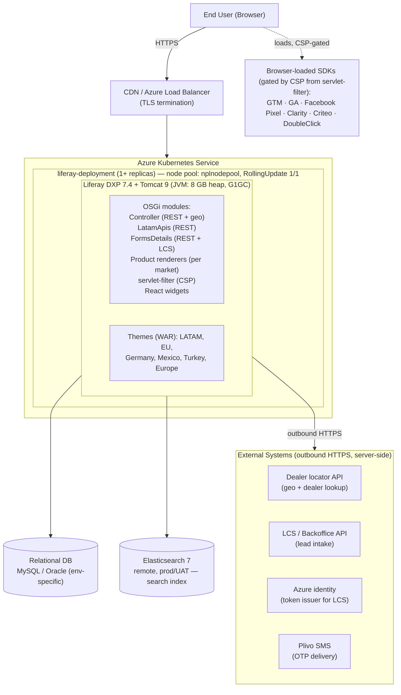
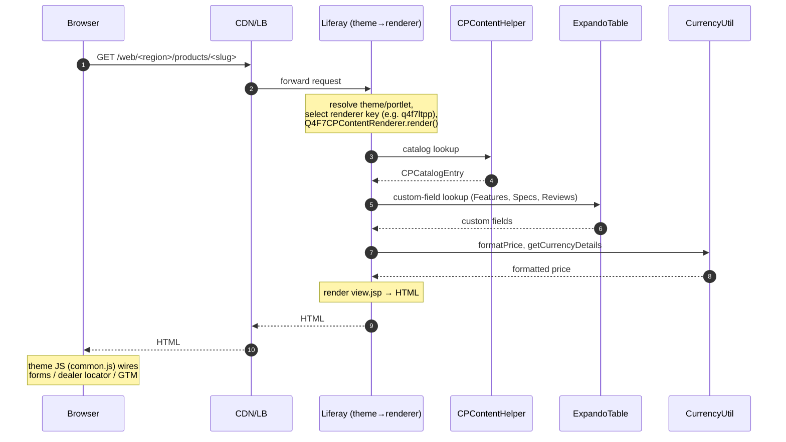
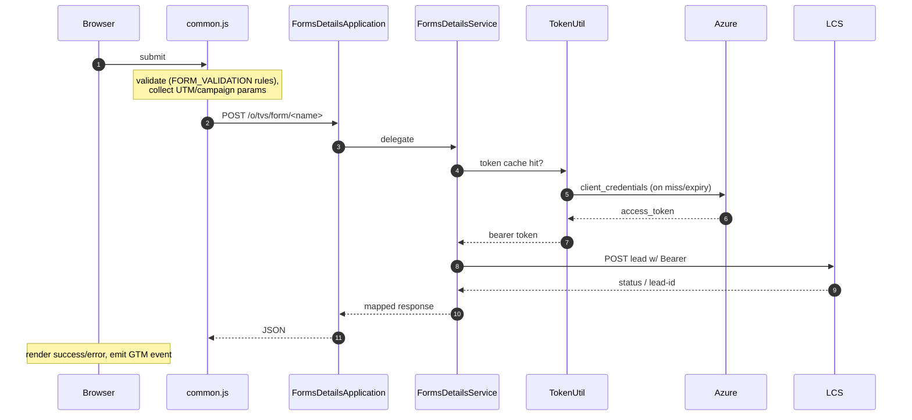
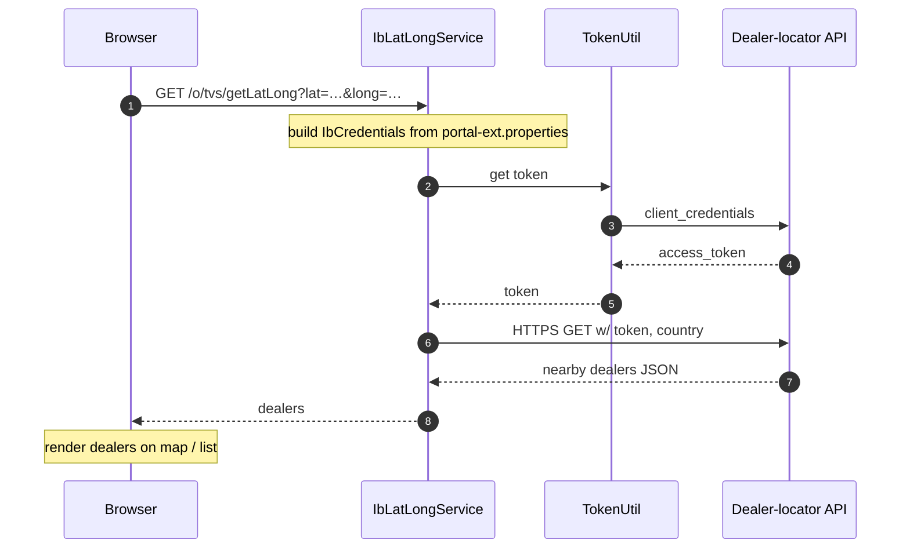
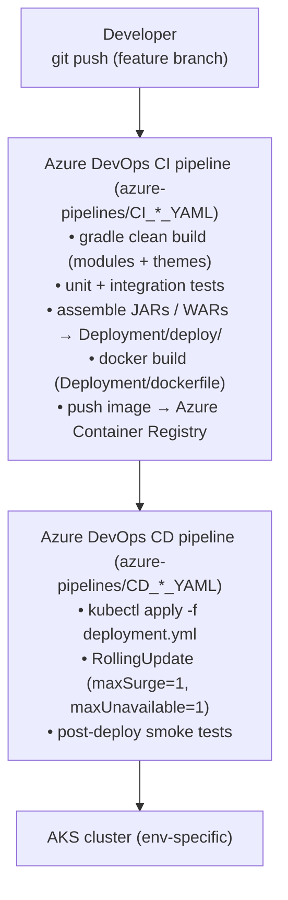

# High Level Design — TVS-Website-Nepal

**Document Type:** High Level Design (HLD) — Architecture Document
**Repository:** `TVS-Website-Nepal`
**Platform:** Liferay DXP 7.4 (`dxp-7.4-u62` / 7.4.13.u102) on Azure Kubernetes Service
**Audience:** External engineering partners, vendor architects, integration teams
**Template Reference:** [D&AI Engineering — High Level Design Template](https://tvsmotorcompany.atlassian.net/wiki/spaces/DE2/pages/4209508450)
**Last Reviewed:** May 2026

> This document follows the D2C Engineering HLD template. All sensitive configuration (database credentials, third-party tokens, internal hostnames, integration secrets) is referenced by file location only and is never embedded in this document. Where a section calls out an integration, the actual endpoint URLs and credentials live in the per-environment `portal-ext.properties` files, the Kubernetes Secret store, and the Azure DevOps variable groups.

---

## Overview

The TVS-Website-Nepal platform is a multi-region corporate and product website that serves Latin America (LATAM) and European markets from a single Liferay DXP 7.4 codebase. It powers product discovery, dealer locator, lead capture (sales, finance, feedback, customer queries), and OTP-verified contact flows.

**What we are building / maintaining:** A region-aware, content + commerce hybrid web platform built on Liferay DXP, deployed to Azure Kubernetes Service (AKS), integrated with downstream lead-capture, identity, and SMS systems.

**Why:** A unified codebase reduces region-specific drift, lets product engineering ship to multiple markets through one CI/CD pipeline, and standardizes data capture into the central downstream lead-capture system (LCS) that feeds CRM.

---

## Tier Classification

**Tier 2 — Business Critical but not Life-or-Death.**

Justification:

- Public-facing brand and product surface for LATAM/EU markets; customer-facing degradation harms brand perception and lead acquisition.
- Lead capture is revenue-influencing but not transactional (no payments are taken on this platform).
- Outages are recoverable through redeploy / replica scaling without data loss in the platform itself; the source-of-truth for leads sits in downstream LCS/CRM.

A Tier 1 classification would require the platform to be life-critical, transaction-processing, or hold the source-of-truth for revenue events — none of which apply.

---

## Background

- TVS Motor operates multiple international websites historically built on heterogeneous CMS stacks (including Sitecore migrations).
- Consolidation onto Liferay DXP 7.4 standardizes the build, deployment, and integration model and reuses Liferay Commerce for catalog/PDP rendering.
- The platform runs against a packaged Liferay DXP image (`liferay/dxp:2023.q4.0`) layered with custom modules, themes, and DXP hotfixes.
- Region differentiation is achieved through theme variants and renderer modules rather than separate codebases, allowing one engineering team to maintain LATAM, Mexico, EU, Germany, and Turkey experiences in parallel.

---

## Requirements

### Functional

| # | Requirement |
|---|-------------|
| F-1 | Render product detail pages for Premium, Non-Premium, Moped, and EV product types in LATAM and EU regions, each with region-specific layout and currency formatting. |
| F-2 | Provide product comparison via React widget with up to N products side-by-side. |
| F-3 | Locate dealers by latitude/longitude or by zip code via the external dealer-locator API. |
| F-4 | Capture leads through forms: vehicle inquiry, finance, owners group, institutional sales, dealer/service/website/vehicle feedback. |
| F-5 | Verify customer phone numbers via SMS OTP with retry rate limiting. |
| F-6 | Forward submitted forms to the downstream Lead Capture System (LCS) over authenticated REST. |
| F-7 | Serve all pages with localized content, currency, and language across LATAM and EU markets. |
| F-8 | Emit GTM/GA events for product views, comparisons, form submissions, downloads. |

### Non-Functional

| # | Requirement | Target |
|---|-------------|--------|
| NF-1 | Availability | ≥ 99.5% monthly uptime per region |
| NF-2 | PDP server-side latency (P95) | ≤ 800 ms |
| NF-3 | Form-submit round-trip (P95) | ≤ 2 s end-to-end including LCS |
| NF-4 | Scalability | Horizontally scalable Liferay pods; stateless on session via cluster-aware Liferay |
| NF-5 | Security | TLS for all external traffic; CSP, HSTS, secure-by-default cookies; OWASP-aligned input validation |
| NF-6 | Observability | Centralized logs, JVM metrics (Glowroot enabled), pipeline-driven smoke tests post-deploy |
| NF-7 | Localization | Full language pack support for at minimum: en_US, es_ES, de_DE, fr_FR, it_IT, tr_TR, ar_SA, ar_LB, ka_GE, az_AZ, bn_BD, ne_NP |
| NF-8 | Patchability | Liferay DXP hotfixes apply during image build; no runtime patching |
| NF-9 | Rate-limited surfaces | OTP endpoint enforces 5-minute retry window |

---

## Current Architecture (HLD)

> The "current" architecture refers to the system as it exists in this repository today. This is the baseline that any future change will be measured against.

### Architecture Diagram Description



### Service Interaction (in-process)

Within a pod, all components communicate through Liferay's OSGi service registry. There is no internal RPC, no service mesh, no service-to-service network call inside the platform itself.

| Caller | Callee | Mechanism |
|--------|--------|-----------|
| Theme (FreeMarker) | Product renderer portlet | Liferay portlet container |
| Product renderer | `CPContentHelper`, `ExpandoTableLocalServiceUtil` | OSGi `@Reference` |
| REST endpoint (`Controller`, `FormsDetails`, `LatamApis`) | Service classes in same module | Direct injection / `@Reference` |
| `FormsDetailsService` | `TokenUtil`, Plivo SDK, `HttpURLConnection` | Direct call / SDK |
| `IbLatLongService` | `TokenUtil`, `HttpURLConnection` | Direct call |

### Pros (current architecture)

- **Single deployable** simplifies CI/CD; one image covers all regions.
- **Liferay as the platform** gives us multi-site, multi-locale, role-based permissions, search, and content authoring out of the box.
- **OSGi modularity** lets one team ship region-specific renderers/themes independently.
- **Stateless pods** allow horizontal scaling under load.

### Cons (current architecture)

- **Single bundle, large JVM** — 8 GB heap means cold-start cost and per-pod resource overhead are non-trivial. Scaling out is coarser-grained than a microservice fleet.
- **Build coupling** — all modules build and deploy together; a fix in one renderer requires re-deploying the whole bundle.
- **External integrations are synchronous** — form submission blocks on LCS response; no fronting queue isolates the platform from LCS unavailability.
- **Single replica default in `deployment.yml`** means no in-region HA unless replicas are scaled up by environment overlay.
- **Database choice** is environment-driven (HSQLDB local, MySQL/Oracle higher) which works but adds a porting risk if local-only behaviors leak.

> **Dependency callout:** The boxes for *Dealer locator API*, *LCS / Backoffice API*, *Azure identity*, *Plivo SMS*, *Elasticsearch*, and *Relational DB* are external dependencies. In a rendered diagram these should be drawn in a distinct color (per template guidance) since the platform's availability is bounded by theirs.

---

## Proposed Architecture (HLD)

This section is intentionally a **maintenance-and-improvement** view rather than a rewrite, because the current platform is in production and the asks in scope are incremental. Items here are recommendations for the next planning cycle and are not yet implemented in this repo.

### Proposed Improvements

1. **Two replicas as the default** in `deployment.yml` for prod and UAT. Single replica is acceptable only for dev. This removes a single point of failure and lets RollingUpdate deploy with `maxUnavailable: 0`.
2. **Async LCS submission** — write each lead to a durable queue (Azure Service Bus or Storage Queue) inside the request, and have a worker consume and POST to LCS. Failure of LCS no longer fails the user-facing form.
3. **Token cache externalization** — Azure tokens are currently cached in JVM memory. Moving the cache to Liferay's clustered cache (or to Redis) avoids re-issuance per pod after restart and prevents hitting Azure rate limits during pod churn.
4. **Pin image tag** — `image: …:latest` is anti-pattern for prod K8s. Use the Git SHA tag emitted by the CI pipeline. This makes rollback deterministic.
5. **Remove embedded credentials from properties files** — drive all secrets through Kubernetes `Secret` mounted as env vars, referenced from `portal-ext.properties` via `${env:VAR}` placeholders.
6. **Health and readiness probes** — add `/c/portal/layout` HTTP probes to the Deployment so K8s doesn't route to pods still warming up.
7. **Application Performance Monitoring** — Glowroot is enabled at the JVM level (`GLOWROOT_ENABLED=true`); export its metrics into Azure Monitor / Application Insights for dashboards and alerting.

### Pros

- Higher availability (2+ replicas, predictable rollouts).
- Decouples platform liveness from LCS liveness.
- Deterministic rollbacks via pinned image tags.
- Stronger secret hygiene; aligns with internal compliance.

### Cons

- Adds an async queue dependency to the operations footprint.
- Mild added complexity for local dev (need a stub queue or in-memory mode).
- Extra cost: doubling pod replicas and adding APM both have a budget impact.

---

## Data Flow / Sequence Diagrams

### Sequence 1 — Product Detail Page (PDP)



### Sequence 2 — Form Submission with Azure-token-protected LCS



### Sequence 3 — Dealer Locator (geo lookup)



### Sequence 4 — OTP send + verify (rate-limited)

```mermaid
sequenceDiagram
    autonumber
    participant B as Browser
    participant JS as common.js
    participant App as FormsDetailsApplication
    participant RL as RateLimitFilter
    participant P as Plivo

    B->>JS: request OTP
    JS->>App: POST /o/tvs/form/form-token
    App->>RL: check window (5 min)
    RL-->>App: 200 / 429
    alt allowed
        App->>P: Plivo.send()
        P-->>App: message-id
    end
    Note over B: enter OTP, submit form;<br/>subsequent /o/tvs/form/<n> includes OTP,<br/>validated server-side
```

### Retry / error handling

| Failure | Behavior |
|---------|----------|
| Azure token endpoint unreachable | Service surfaces 5xx; client UI shows generic error; cached token used until expiry. |
| LCS endpoint 5xx | FormsDetailsService surfaces error response to client. *Proposed:* enqueue and retry async. |
| Dealer-locator API timeout | IbLatLongService returns empty list; UI shows "no dealers found near you" message. |
| Plivo failure | RateLimitFilter still consumes the window slot to prevent thrash; UI shows a retry-after message. |
| Elasticsearch unreachable (search) | Liferay surfaces site-search degradation; PDP/forms unaffected. |

### Illustrative example

A LATAM customer browses TVS Apache RTR 160 → PDP renders via `q4f7ltpp` renderer with MXN currency formatting → user clicks "Find a dealer" → enters their pincode → frontend hits `/o/tvs/getByZipCode` → service returns three nearest dealers → user picks one and submits a "Test ride" inquiry → form submits to `/o/tvs/form/vehicle-customer` → FormsDetailsService acquires/uses cached Azure token → posts to LCS → returns lead-id → frontend shows success and emits GTM `form_submit_success` event.

---

## Deployment & Rollout Plan

### Deployment Flow



### Environments

| Environment | Source pipeline | Notes |
|-------------|-----------------|-------|
| Local | none (Blade CLI) | HSQLDB, embedded ES |
| Dev | `cd_dev.yml` / `ci_dev_yml` | Single replica acceptable |
| UAT | `CI_UAT_YAML` / `CD_UAT_YAML` | Remote ES; integration testing |
| Prod | `CI_PROD_YAML` / `CD_PROD_YAML` | Remote ES; full load profile |
| Sitecore migration UAT | `AST_Websites_IB_Sitecore_Liferay_TVS_Website_Nepal_UAT_Pipeline.yml` | Content migration scenarios |

### Launch strategy

- **Phased per region** — release artifacts can be scoped to specific themes/renderers; non-released markets remain on the previous artifacts simply by not redirecting their sites to the new layout/renderer.
- **Feature flags** — Liferay's expando fields and group-level configuration toggle GTM, finance forms, and OTP-required forms per market. New flows ship behind a flag and are flipped on per market.
- **Smoke tests** — post-deploy probes hit `/web/<region>/`, a known PDP, and a no-op form-token endpoint.

### Rollback / hotfix strategy

| Scenario | Action |
|----------|--------|
| Bad image rollout | `kubectl rollout undo deployment/liferay-deployment` reverts to previous ReplicaSet. Pinning the image to a SHA (proposed) makes this deterministic. |
| Bad config change | Re-apply prior `deployment.yml` / `portal-ext.properties` from Git history; rerun CD pipeline. |
| Liferay DXP hotfix needed | Drop hotfix zip into `Deployment/patching/` (Git LFS), rebuild image, redeploy. |
| Module-only fix | Re-publish single JAR to Liferay's `deploy/` folder via image rebuild — OSGi hot-swap on next pod cycle. |
| External API outage | Operate in degraded mode (forms surface user-friendly errors); no rollback needed; investigate dependency. |

---

## Metrics to be Tracked

### Application metrics

| Metric | Purpose | Alarm threshold |
|--------|---------|-----------------|
| HTTP 5xx rate | Service health | > 1% over 5 min |
| PDP P95 latency | UX SLO | > 1.2 s for 10 min |
| Form-submit success rate | Business KPI + SLO | < 98% over 15 min |
| OTP delivery success rate | UX + cost | < 95% over 15 min |
| LCS submission success rate | Lead pipeline integrity | < 99% over 15 min |
| Dealer-locator P95 latency | UX | > 2 s for 10 min |
| Pod restart count | Stability | > 3 in 30 min |

### Platform metrics

| Metric | Source | Purpose |
|--------|--------|---------|
| JVM heap usage, GC pause | Glowroot / JMX | Tune memory headroom |
| Tomcat thread pool utilization | JMX | Spot saturation |
| Liferay search query latency | Liferay logs / ES | Index health |
| ES cluster health | Elasticsearch | Search availability |
| DB connection pool waits | Liferay / DB | Pool sizing |

### Business metrics (already emitted via GTM)

PDP views per market, comparison initiations, brochure downloads, form starts vs completions, CTA clicks, dealer-locator usage.

---

## Data Analytics / Data Engineering Metrics & Tables

The platform itself is **not the source-of-truth for analytical data**. Two layers feed downstream analytics:

1. **Client-side telemetry via GTM** — page views, form interactions, comparisons, downloads, CTA events. These flow into the corporate GA / DataLayer pipeline. Data lake tables for these events are owned by the analytics team and are out of scope for this repo.
2. **Lead data via LCS** — every successful form submission becomes a lead record in the LCS / CRM. The lake/warehouse representation of leads (e.g. `leads_raw`, `leads_curated`) is owned by LCS data engineering, again out of scope for this repo.

This document does not enable any new data lake tables. If a future change introduces direct platform-side analytical events, that change should add a section here.

---

## Alternatives Considered

### Option A — Per-region microservice fleet

Split each region (LATAM, EU, etc.) into independent services with its own database and CI/CD pipeline.

- **Pros:** Blast-radius isolation; per-region deploy cadence; smaller per-service heap.
- **Cons:** Multiplies operational footprint (N pods, N pipelines, N DBs, N theme builds). Loses Liferay's shared multi-site, multi-locale, and content-author ergonomics. Higher run cost. *Rejected* for this generation; revisit if regional teams diverge significantly.

### Option B — Headless CMS + JAMstack frontends

Use Liferay (or another headless CMS) only as a content API and build static/SSG frontends per market.

- **Pros:** Fast page loads; cheap CDN-only delivery; clean separation.
- **Cons:** Loses Liferay Commerce server-rendering, role-based authoring previews, and the existing renderer ecosystem. Significant rebuild cost for forms, OTP, and dealer locator. *Rejected* for current planning horizon; not aligned with the in-flight Sitecore-to-Liferay migration goal.

### Option C — Direct browser-to-LCS form submission

Skip the platform's REST layer for forms; let the browser POST directly to LCS.

- **Pros:** Removes a hop; reduces Liferay-side surface.
- **Cons:** Exposes LCS endpoints to the public internet, complicates auth (the Azure token issuer is server-only), removes server-side validation/rate limiting/UTM enrichment, and tightly couples the browser to LCS contract changes. *Rejected* for security and contract-stability reasons.

---

## Risks (If Any)

| # | Risk | Likelihood | Impact | Mitigation |
|---|------|------------|--------|------------|
| R-1 | LCS outage blocks form submission user flows | Medium | High | Async queue + retry (proposed); meanwhile clear UX error and alerting on form-submit success rate. |
| R-2 | Single replica default in `deployment.yml` causes downtime during rollout in any env that hasn't overridden it | Medium | Medium | Override replicas in env-specific manifest; treat 2+ replicas as the prod default. |
| R-3 | `:latest` image tag in K8s manifest makes rollback non-deterministic | Medium | High | Switch CD to push and apply a Git-SHA tag. |
| R-4 | Secrets stored in `portal-ext.properties` files | Medium | High | Move to K8s `Secret` + env-var indirection; remove from Git history if any real values are present. |
| R-5 | Plivo SMS quota exhaustion or carrier filtering | Low | Medium | RateLimitFilter blunts abuse; monitor delivery rate; failover SMS provider as a roadmap item. |
| R-6 | Azure token issuer rate-limit during mass pod restarts | Low | Medium | Externalize token cache (Redis) so all pods share. |
| R-7 | Dealer-locator API change breaks LATAM/EU dealer flows | Low | Medium | Wrap responses in tolerant DTOs; contract tests in CI; monitor 5xx from `IbLatLongService`. |
| R-8 | Liferay DXP hotfix regression | Low | Medium | Stage every hotfix in UAT under realistic load before prod. |
| R-9 | CSP whitelist drift as marketing adds tags | Medium | Low | CSP changes go through the same CI; review checklist for any addition to `servlet-filter`. |
| R-10 | Local-only HSQLDB behaviors leak into prod (MySQL/Oracle) | Low | Medium | Run integration tests against the prod DB engine in UAT. |

---

## Appendix

### Infra Topology summary

| Layer | Component | Notes |
|-------|-----------|-------|
| Edge | Azure Front Door / CDN + Load Balancer | TLS termination |
| Compute | Azure Kubernetes Service, node pool `nplnodepool` | Single Deployment object today |
| Image | Azure Container Registry `tvsmaznplacrdev01.azurecr.io` | Pulled with `imagePullSecrets: acr-secret` |
| App container | `liferay/dxp:2023.q4.0` + custom modules + themes + DXP hotfixes | 8 GB heap, G1GC, Glowroot enabled |
| Persistence | Relational DB (HSQLDB local, MySQL/Oracle env-specific) | Configured in `configs/<env>/portal-ext.properties` |
| Search | Elasticsearch 7 (remote in UAT/prod, embedded local) | Configured via `…ElasticsearchConfiguration.config` |
| CI/CD | Azure DevOps pipelines | `azure-pipelines/` |
| Secrets | Kubernetes `Secret`, Azure DevOps variable groups | Never in Git |

### External Integrations summary

| Integration | Direction | Auth | Module |
|-------------|-----------|------|--------|
| Dealer locator API | Outbound | Token + IB credentials | `Controller` (`IbLatLongService`) |
| LCS / Backoffice form intake | Outbound | Azure-issued bearer | `FormsDetails` (`FormsDetailsService`) |
| Azure identity | Outbound | Client credentials | `Controller` (`TokenUtil`), `FormsDetails` |
| Plivo SMS | Outbound | API key | `FormsDetails` (Plivo SDK) |
| Elasticsearch | Outbound | Network | Liferay search subsystem |
| Liferay Commerce APIs | Internal | OSGi service | All product renderer modules |
| Browser SDKs (GTM, GA, FB Pixel, Clarity, Criteo, DoubleClick, YouTube) | Browser-only | n/a | `servlet-filter` CSP whitelist |

### Glossary / Acronyms

| Term | Meaning |
|------|---------|
| **AKS** | Azure Kubernetes Service |
| **ACR** | Azure Container Registry |
| **CSP** | Content-Security-Policy |
| **DXP** | Liferay Digital Experience Platform |
| **HLD** | High Level Design |
| **LATAM** | Latin America |
| **LCS** | Lead Capture System (downstream lead/CRM intake) |
| **OSGi** | Modular Java runtime model used by Liferay |
| **PDP** | Product Detail Page |
| **SLO** | Service Level Objective |
| **GTM / GA** | Google Tag Manager / Google Analytics |
| **OTP** | One-Time Password (SMS-based phone verification) |

### Reference Files in Repo

- Build & workspace: `gradle.properties`, `build.gradle`, `.blade.properties`
- Container: `Deployment/dockerfile`
- Kubernetes: `Deployment/deployment.yml`
- CI/CD: `azure-pipelines/*`
- Per-environment config: `configs/<env>/portal-ext.properties`
- Search config: `configs/<env>/osgi/configs/com.liferay.portal.search.elasticsearch.configuration.ElasticsearchConfiguration.config`
- Renderer entry point: `modules/<renderer>/src/main/resources/META-INF/resources/view.jsp`
- REST entry points: `modules/Controller/`, `modules/LatamApis/`, `modules/FormsDetails/`
- Theme entry points: `themes/<theme>/src/templates/`, `themes/<theme>/src/js/common.js`
- HTTP filter: `modules/servlet-filter/`

---

*End of HLD document. Next document in this series: `LLD.md` (Low Level Design).*
