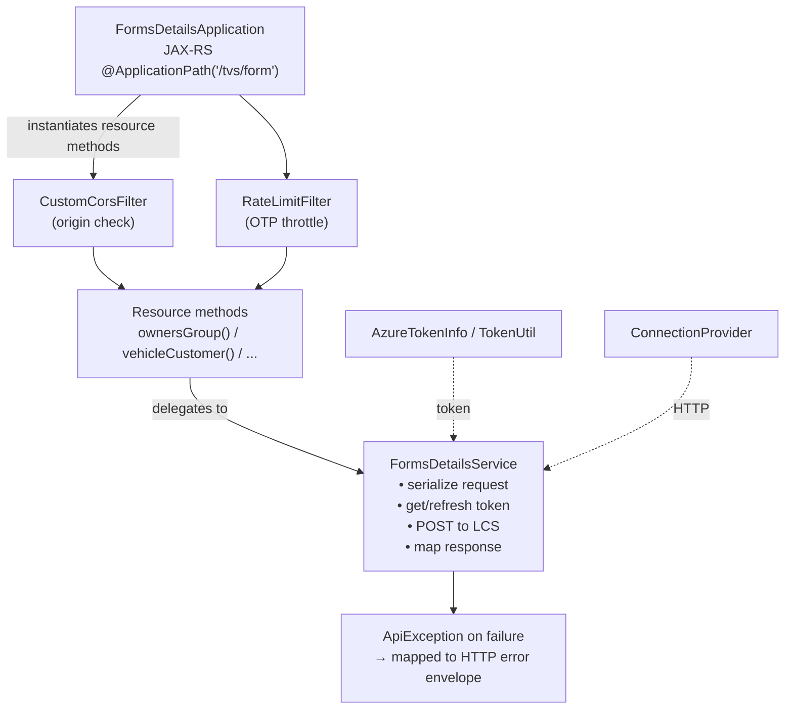
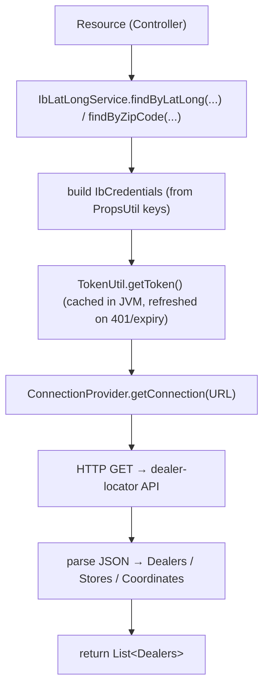
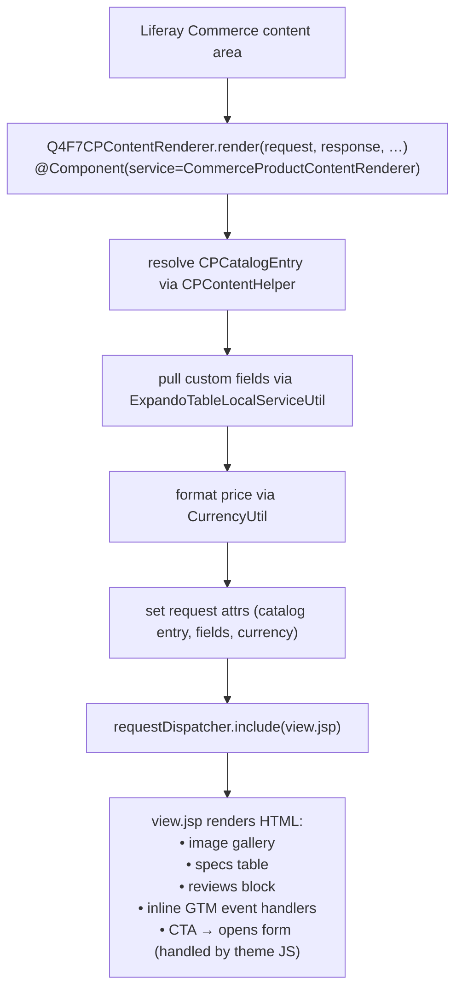
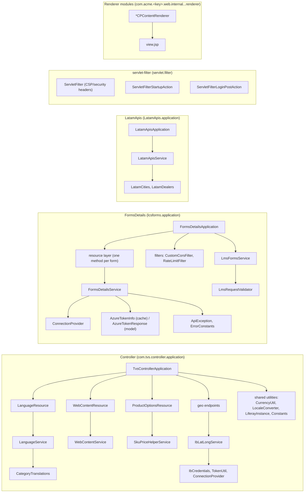

# Low Level Design — TVS-Website-Nepal

**Document Type:** Low Level Design (LLD) — Implementation Detail Reference
**Repository:** `TVS-Website-Nepal`
**Audience:** New engineering vendors, integration partners, code reviewers
**Template Reference:** [D&AI Engineering — Low Level Design Template](https://tvsmotorcompany.atlassian.net/wiki/spaces/DE2/pages/4209606912)
**Last Reviewed:** May 2026

> No tokens, passwords, hostnames, connection strings, or third-party API URLs are embedded in this document. Where a class consumes a credential, the credential's location (e.g. `configs/<env>/portal-ext.properties` key name) is referenced by name only.

---

## Overview

This LLD describes the implementation of TVS-Website-Nepal — a Liferay DXP 7.4 based multi-region website serving LATAM and EU markets. It explains how the OSGi modules in `TVS-Website-Nepal/modules/` are organized, how the JAX-RS endpoints are wired, how forms are validated and forwarded to the downstream Lead Capture System (LCS), how the dealer-locator integration works, and how the product detail renderers compose data and JSP output for the browser.

The intent is operational: a vendor engineer should be able to read this document and a handful of source files, and either (a) safely add a new endpoint or renderer, or (b) diagnose a production incident.

---

## High Level Design — Quick Recap

- High-level design: see `docs/HLD.md` (in this same folder).
- High-level code map: see `docs/HLC.md`.
- Confluence template references: HLD `4209508450`, LLD `4209606912`.

The HLD covers system shape (AKS pod with Liferay + modules + themes, downstream LCS/Azure/Plivo/dealer-locator integrations). This LLD zooms into the modules, classes, request lifecycles, and validation rules.

---

## Assumptions

| # | Assumption |
|---|------------|
| A-1 | Liferay DXP 7.4 (`dxp-7.4-u62`) provides the OSGi runtime, JAX-RS Whiteboard, Commerce APIs, ExpandoTable, search via Elasticsearch 7. |
| A-2 | All public traffic enters through Azure CDN/LB → AKS Service → Liferay Tomcat on port `8080`. |
| A-3 | Each pod runs the full bundle (Liferay portal + modules + themes); no microservice split inside the platform. |
| A-4 | Form submissions are forwarded to the Lead Capture System (LCS) over HTTPS using an Azure-issued bearer token. |
| A-5 | OTP delivery uses Plivo's Java SDK from inside the JVM. |
| A-6 | Dealer-locator API is reached over HTTPS using a token obtained via a client-credentials flow. |
| A-7 | Secrets are sourced from `portal-ext.properties` (per environment) and ultimately from K8s `Secret` / Azure DevOps variable groups in higher environments. |
| A-8 | Liferay clustering is enabled in prod (multi-replica capable), even if the default `deployment.yml` ships with `replicas: 1`. |
| A-9 | Search indices are owned by Liferay (Elasticsearch); they are not mutated by custom modules. |
| A-10 | Product catalog data lives in Liferay Commerce; no separate product DB is owned by these modules. |

---

## Components

### Module map

```
TVS-Website-Nepal/modules/
├── Controller/                        # JAX-RS app: geo, dealer-locator, language,
│   └── src/main/java/com/tvs/        #   currency, web content, product options
│       ├── controller/application/   # services, REST classes, helpers
│       └── pojos/                    # DTOs for catalog, dealers, locations
│
├── FormsDetails/                      # JAX-RS app: form intake → LCS forwarding
│   └── src/main/java/
│       ├── lcsforms/application/     # REST app, services, filters, constants
│       ├── lcsforms/pojos/           # request/response DTOs (one per form)
│       └── lmsforms/pojos/           # LMS-side variants
│
├── LatamApis/                         # JAX-RS app: LATAM city/dealer reference
│   └── src/main/java/LatamApis/
│       ├── application/              # REST app + service
│       └── Pojos/                    # LatamCities, LatamDealers
│
├── servlet-filter/                    # Liferay hook setting CSP and security headers
│   └── src/main/java/servlet/filter/
│
├── (renderer modules — one per market × product type combination)
│   • premium-renderer            (q4f7-web)        — global premium
│   • premium-renderer_europe     (q4f7eu-web)      — EU premium
│   • latam-premium-product-detail-renderer (q4f7ltpp-web)
│   • latam-non-premium-product-detail-render (q4f7ltnp-web)
│   • global-eu-product-detail-renderer (q4f7gleupp-web)
│   • moped-renderer              (q4f7-web)        — moped
│   • moped-renderer-europe       (q4f7eu-web)      — EU moped
│   • ev-renderer                 (q4f7-web)
│   • ev_detail_europe            (q4f7ev-web)
│
├── product-comparison-react/          # React widget (npmbundlerrc) for compare UI
├── context-contributor/               # Theme/page context enrichment
└── Product/, Product-Europe/          # Legacy product modules (binaries only)
```

### 3.1 Controller module — `com.tvs.controller`

**Purpose:** Exposes the catalog/geo/language/web-content REST surface under `/o/tvs/*`.

| Class | Responsibility |
|-------|----------------|
| `TvsControllerApplication` | JAX-RS `Application`. Registers all resources; declared with `osgi.jaxrs.application.base = /tvs`. |
| `IbLatLongService` | Dealer locator service. Reads `IbCredentials`, gets a token from `TokenUtil`, calls the dealer-locator API, parses results into `Dealers`/`Stores` POJOs. |
| `IbCredentials` | Holder for the dealer-locator credential set (domain, id, secret, brand, country, language). Sourced from portal properties. |
| `TokenUtil` | OAuth-style token acquisition with simple in-memory cache (per JVM). |
| `LanguageResource` | REST resource exposing language/translation lookups. |
| `LanguageService` | Backing logic for `LanguageResource`. |
| `LocaleConverter` | Maps Liferay locale strings ↔ language codes used by external APIs. |
| `CategoryTranslations` | Reads `resources/translations.json` for vehicle category labels. |
| `CurrencyUtil` | Reads currency XML config, returns symbol/pattern/fraction-digits per region. |
| `WebContentResource` / `WebContentService` | REST layer over Liferay Web Content for the SPA/frontends. |
| `ProductOptionsResource` | REST endpoints for product option lookups. |
| `SkuPriceHelperService` | SKU + pricing helper for renderers. |
| `LiferayInstance` | Lazy holder for Liferay-side service references (avoids static coupling). |
| `Location` (application package) | Reusable location DTO. |
| `Constants` | Endpoint paths, header names, error codes. |
| `ConnectionProvider`, `ConnectionProviderImpl` | HTTP connection abstraction (testability seam). |
| `MockProps` | Test-only stand-in for portal properties. |

**POJOs** (`com.tvs.pojos`): `Coordinates`, `Dealers`, `Stores`, `Location`, `LocationService`, `Items`, `Data`, `SingleProduct`, `Product`, `ProductsResponse`, `SkusResponse`, `SpecificationData`, `SpecificationResponse`, `ProductSpecificationsResponse`, `ImagesResponse`, `Category`, `CategoriesResponse`, `OptionCategoryResponse`, `VehiclesCategories`, `CustomFields`, `LatLongRequest`, `RideDetailsPojo`, `AuthResponseGeo`, `PartnerPortalBusinessPojo`.

### 3.2 FormsDetails module — `lcsforms`

**Purpose:** Receives all form submissions, validates them, acquires an Azure token, and forwards each as a typed request to the LCS endpoint that matches the form. Also handles OTP send + verify (via Plivo) with rate limiting.

| Class | Responsibility |
|-------|----------------|
| `FormsDetailsApplication` | JAX-RS `Application` registering all `/o/tvs/form/*` resources. |
| `FormsDetailsService` | Core orchestration: serialize request POJO → acquire/refresh Azure token → POST to LCS → map response. Reused across every form endpoint. |
| `LmsFormsService` | LMS-specific form path; works with `lmsforms.pojos.LmsRequestBody`/`LmsResponseBody`. |
| `LmsRequestValidator` | Validates LMS request bodies (required fields, format checks). |
| `RateLimitFilter` | Servlet/JAX-RS filter throttling OTP-issuing endpoints (5-minute retry window). |
| `CustomCorsFilter` | CORS handling for browser-origin form submissions; reads `resources/allowed-origins.txt`. |
| `ConnectionProvider`, `ConnectionProviderImpl` | HTTP client abstraction shared across services. |
| `ApiException` | Typed runtime exception thrown on integration failures; carries error code + HTTP status. |
| `FormConstants` | Single source of truth for form names, endpoint suffixes, header names. |
| `ErrorConstants` | Error codes + user-facing messages (localized keys). |
| `MockProps` | Test-only stand-in. |
| `AzureTokenInfo`, `AzureTokenResponse` | Token cache + token-endpoint response model. |

**POJOs** (`lcsforms.pojos`): a per-form request DTO and corresponding response DTO. The roster:

| Form | Request | Response |
|------|---------|----------|
| Owners group | `OwnersGroupRequest` | `OwnersGroupResponse` |
| Institutional sale | `InstitutionalSaleRequest` (+ `InstitutionalData`) | `InstitutionalResponse` |
| Vehicle feedback | `FeedbackVehicleRequest` (+ `FeedbackData`) | `FeedbackResponse` |
| Dealer feedback | `FeedbackDealerRequest` | `FeedbackResponse` |
| Service feedback | `FeedbackServiceRequest` | `ServiceFormResponse` |
| Website feedback | `WebsiteFeedbackRequest` | `WebsiteFeedbackResponse` |
| Vehicle customer | `CustomerVehicleRequest` (+ `CustomerDetails`) | `CustomerEnquiryResponse` (+ `CustomerEnquiryData`) |
| General customer | `CustomerGeneralRequest` | `CustomerEnquiryResponse` |
| Service form | `ServiceFormRequest` | `ServiceFormResponse` |
| Customer call | `CustomerCallRequest` | (see `CustomerEnquiryResponse`) |
| Finance | `FinanceRequest` | `FinanceResponse` |
| Partner interest | `PartnerInterestRequest` | `PartnerResponse` |
| Partner feedback | `PartnerFeedbackRequest` | `PartnerResponse` |
| Potential dealer | `PotentialDealerRequest` | `PotentialDealerResponse` |
| Users right (privacy) | `UsersRightRequest` | `UsersRightResponse` |
| Subscribe email | `SubscribeEmailRequest` | (`ResponseWithCode`) |
| OTP send | `SendOtpRequest` | `SendOtpResponse` |
| Campaign | `CampaignRequest` (+ `CampaignFields`) | `CampaignResponse` |
| Generic fallback | `GenericRequest` | `ResponseWithCode` |

**Cross-cutting fields (mixed via `BasePartnerRequest`):** UTM/source fields, partner identifier, locale, brand/country.
**Reusable nested POJOs:** `DealerDetails`, `VehicleList`, `LegalIssues`.

**LMS variants (`lmsforms.pojos`):** `LmsRequestBody`, `LmsResponseBody`, `OtpDto`, `OtpResponse` — used when the form path targets the LMS upstream.

### 3.3 LatamApis module

**Purpose:** Region-specific reference-data endpoints exposed under `/o/list/*` (cities, dealers).

| Class | Responsibility |
|-------|----------------|
| `LatamApisApplication` | JAX-RS `Application`; declares paths. |
| `LatamApisService` | Backing service for cities and dealers lookup; caches reference data per locale. |
| `MockPortalProperties` | Test-only stand-in. |
| `LatamCities` (POJO) | DTO for `/o/list/cities`. |
| `LatamDealers` (POJO) | DTO for `/o/list/dealers`. |

### 3.4 servlet-filter module

**Purpose:** A Liferay hook (deployed as a WAR) installing a portal servlet filter and login post-action.

| Class | Responsibility |
|-------|----------------|
| `ServletFilter` | Sets `Content-Security-Policy`, `X-Content-Type-Options`, `X-Frame-Options`, `Strict-Transport-Security` and a server-identification header. CSP whitelists are configured in `portal.properties`. |
| `ServletFilterStartupAction` | Liferay startup action that registers the filter. |
| `ServletFilterLoginPostAction` | Post-login hook hook (audit/log). |

Resources: `WEB-INF/liferay-hook.xml`, `WEB-INF/liferay-plugin-package.properties`, `WEB-INF/web.xml`, `portal.properties`.

### 3.5 Product detail renderer modules

All renderer modules follow an identical structure. Using `latam-premium-product-detail-renderer` (Bundle-SymbolicName `com.acme.q4f7ltpp.web`) as the canonical example:

```
q4f7ltpp-web/
├── bnd.bnd                          # Bundle metadata, exports
├── build.gradle                     # Module deps
└── src/main/
    ├── java/com/acme/q4f7ltpp/web/internal/commerce/product/content/renderer/
    │   └── Q4F7CPContentRenderer.java
    └── resources/
        ├── content/Language*.properties
        └── META-INF/resources/
            └── view.jsp
```

**Renderer wiring pattern:**

```java
@Component(
    immediate = true,
    property = {
        "commerce.product.content.renderer.key=q4f7ltpp",
        "commerce.product.content.renderer.type=cpType-name"
    },
    service = CommerceProductContentRenderer.class
)
public class Q4F7CPContentRenderer implements CommerceProductContentRenderer {
    @Override
    public void render(...) { /* dispatches to view.jsp */ }
}
```

The `commerce.product.content.renderer.key` is the unique selector Liferay Commerce uses to choose the renderer for a given product type / market combination. Keys observed: `q4f7`, `q4f7eu`, `q4f7ev`, `q4f7ltpp`, `q4f7ltnp`, `q4f7gleupp`, plus moped variants. The view JSP fetches catalog data via `CPContentHelper`, custom fields via `ExpandoTableLocalServiceUtil`, and emits markup with theme-friendly classes plus inline GTM event hooks.

### 3.6 product-comparison-react module

A Liferay JS portlet bundle:

- `package.json`, `.npmbundlerrc`, `.babelrc` — Liferay JS bundler v3 build.
- `src/index.js`, `src/App.js` — entry + root component.
- `src/components/` — `MobileView`, `WebView`, `ProductAddModal`.
- `src/utils/` — currency formatting, brochure download, GTM data layer wrappers.
- `features/configuration.json` + `features/localization/` — portlet preferences and i18n.

### 3.7 context-contributor module

A `TemplateContextContributor` that injects portal-/page-level keys into themes (e.g. resolved currency, market identifier, brand). Pure Liferay extension; no external integrations.

---

## API Design

All endpoints are JAX-RS resources mounted by Liferay's JAX-RS Whiteboard. The application paths surface under `/o/<applicationBase>/...`.

### 4.1 Common conventions

| Aspect | Convention |
|--------|------------|
| Content type | `application/json; charset=utf-8` for both request and response, except OTP token endpoint which may also return `text/plain`. |
| Auth (browser) | None at the HTTP layer; same-origin enforced via `CustomCorsFilter` (FormsDetails) and Liferay session cookies. |
| Auth (downstream) | Server-side; Azure-issued bearer attached by `FormsDetailsService`/`IbLatLongService`. |
| Headers | Standard browser headers + `Site-Id` / `Company-Id` when needed for multi-tenant context. |
| Error envelope | `{ "code": "<errorCode>", "message": "<localized message>", "status": <httpStatus> }` (see `ErrorConstants`). |
| Idempotency | GET endpoints are idempotent. POST form endpoints are **not** strictly idempotent; clients should debounce on the UI side. OTP send is rate-limited (see `RateLimitFilter`). |

### 4.2 Status & error code catalog

Maintained in `lcsforms.application.ErrorConstants` and `com.tvs.controller.application.Constants`. Examples:

| HTTP | App code (illustrative) | Meaning |
|------|-------------------------|---------|
| 200  | `OK`                    | Success |
| 400  | `INVALID_INPUT`         | Required fields missing or malformed |
| 401  | `TOKEN_EXPIRED`         | Downstream auth failed; client should retry once |
| 403  | `FORBIDDEN_ORIGIN`      | Origin not in `allowed-origins.txt` |
| 404  | `NOT_FOUND`             | Resource not found |
| 409  | `DUPLICATE_SUBMISSION`  | LCS rejected as duplicate |
| 415  | `UNSUPPORTED_MEDIA`     | Wrong content-type |
| 429  | `RATE_LIMITED`          | OTP retry window not yet expired |
| 500  | `INTEGRATION_FAILED`    | LCS / dealer-locator / Plivo failure |
| 502  | `BAD_GATEWAY`           | Upstream returned non-success and is non-retryable |
| 503  | `UPSTREAM_UNAVAILABLE`  | Upstream timed out |

> Exact code strings live in source; the names above are representative. Treat `lcsforms.application.ErrorConstants` and `com.tvs.controller.application.Constants` as the source-of-truth.

### 4.3 Endpoint catalog

#### Controller module (`/o/tvs/...`)

| Method | Path | Backed by | Purpose |
|--------|------|-----------|---------|
| GET | `/o/tvs/getProducts` | (catalog resource) | List products for a category |
| GET | `/o/tvs/getProductDetails/{id}` | (catalog resource) | Product detail by ID |
| GET | `/o/tvs/getLatLong` | `IbLatLongService` | Find nearby dealers by lat/long |
| GET | `/o/tvs/getByZipCode` | `IbLatLongService` | Find dealers by zip code |
| GET | `/o/tvs/language` | `LanguageResource` | Translation lookups |
| GET | `/o/tvs/web-content/...` | `WebContentResource` | Web content as JSON |
| GET | `/o/tvs/product-options/...` | `ProductOptionsResource` | Product option enumeration |

#### LatamApis module (`/o/list/...`)

| Method | Path | Backed by | Purpose |
|--------|------|-----------|---------|
| GET | `/o/list/cities` | `LatamApisService` | Cities for a country |
| GET | `/o/list/dealers` | `LatamApisService` | Dealers for a city |

#### FormsDetails module (`/o/tvs/form/...`)

| Method | Path | Request POJO | Response POJO |
|--------|------|--------------|---------------|
| POST | `/o/tvs/form/owners-group` | `OwnersGroupRequest` | `OwnersGroupResponse` |
| POST | `/o/tvs/form/sale-institutional` | `InstitutionalSaleRequest` | `InstitutionalResponse` |
| POST | `/o/tvs/form/vehicle-feedback` | `FeedbackVehicleRequest` | `FeedbackResponse` |
| POST | `/o/tvs/form/dealer-feedback` | `FeedbackDealerRequest` | `FeedbackResponse` |
| POST | `/o/tvs/form/service-feedback` | `FeedbackServiceRequest` | `ServiceFormResponse` |
| POST | `/o/tvs/form/website-feedback` | `WebsiteFeedbackRequest` | `WebsiteFeedbackResponse` |
| POST | `/o/tvs/form/vehicle-customer` | `CustomerVehicleRequest` | `CustomerEnquiryResponse` |
| POST | `/o/tvs/form/general-customer` | `CustomerGeneralRequest` | `CustomerEnquiryResponse` |
| POST | `/o/tvs/form/service-form` | `ServiceFormRequest` | `ServiceFormResponse` |
| POST | `/o/tvs/form/customer-call` | `CustomerCallRequest` | `CustomerEnquiryResponse` |
| POST | `/o/tvs/form/finance` | `FinanceRequest` | `FinanceResponse` |
| POST | `/o/tvs/form/partner-interest` | `PartnerInterestRequest` | `PartnerResponse` |
| POST | `/o/tvs/form/partner-feedback` | `PartnerFeedbackRequest` | `PartnerResponse` |
| POST | `/o/tvs/form/potential-dealer` | `PotentialDealerRequest` | `PotentialDealerResponse` |
| POST | `/o/tvs/form/users-right` | `UsersRightRequest` | `UsersRightResponse` |
| POST | `/o/tvs/form/subscribe-email` | `SubscribeEmailRequest` | `ResponseWithCode` |
| POST | `/o/tvs/form/send-otp` | `SendOtpRequest` | `SendOtpResponse` |
| POST | `/o/tvs/form/campaign` | `CampaignRequest` | `CampaignResponse` |
| POST | `/o/tvs/form/form-token` | (none) | OTP/Azure token bootstrap |

> The authoritative endpoint string for each is in `lcsforms.application.FormConstants`. New forms must add to that enum and to `FormsDetailsApplication`.

### 4.4 Sample request / response

**Request — `POST /o/tvs/form/vehicle-customer`** *(illustrative)*

```jsonc
{
  "customerDetails": {
    "firstName": "Maria",
    "lastName": "Lopez",
    "email": "maria@example.com",
    "mobile": "+52-55-12345678",
    "city": "Mexico City",
    "state": "CDMX",
    "country": "MX",
    "preferredLanguage": "es"
  },
  "vehicleList": [
    { "model": "Apache RTR 160", "variant": "Race Edition" }
  ],
  "campaignFields": {
    "utmSource": "google",
    "utmMedium": "cpc",
    "utmCampaign": "apache_q3",
    "formId": "pdp-test-ride",
    "pageUrl": "https://.../products/apache-rtr-160"
  },
  "consent": { "marketing": true, "tnc": true },
  "otpToken": "<short-lived token from /form-token>"
}
```

**Success response — `200 OK`**

```jsonc
{
  "status": "SUCCESS",
  "code": "OK",
  "leadId": "LCS-2026-00123456",
  "message": "Lead captured successfully"
}
```

**Validation failure — `400 Bad Request`**

```jsonc
{
  "status": "ERROR",
  "code": "INVALID_INPUT",
  "message": "Mobile number is not valid for the selected country.",
  "fields": ["customerDetails.mobile"]
}
```

### 4.5 Headers (request)

| Header | Required | Notes |
|--------|----------|-------|
| `Content-Type` | yes | `application/json` |
| `Origin` | (browser sets) | Validated by `CustomCorsFilter` against `allowed-origins.txt` |
| `Site-Id` | when applicable | Liferay site identifier (multi-site context) |
| `Company-Id` | when applicable | Liferay company identifier |
| `Accept-Language` | optional | Used to localize error messages |
| `X-Captcha-Token` | optional | Reserved if reCAPTCHA is later enabled |

### 4.6 Idempotency

- **GET endpoints:** safe and idempotent.
- **POST form endpoints:** *not* idempotent at the platform layer. LCS itself may de-duplicate based on email + mobile + form-id within a window; on duplicate the response returns `409 DUPLICATE_SUBMISSION`. UI should debounce the submit button to prevent accidental double-submit.
- **`/form-token`:** rate-limited to one issuance per OTP target per 5 minutes (`RateLimitFilter`).

---

## Data Model / Schema Changes

This codebase **does not own a relational schema**. Data lives in:

1. **Liferay portal database** (MySQL/Oracle in higher envs, HSQLDB local). Liferay's standard tables: `User_`, `Group_`, `Layout`, `JournalArticle`, `ExpandoColumn`, `ExpandoRow`, `ExpandoValue`, `CommerceCatalog`, `CPDefinition`, `CPInstance`, `CommercePrice*`, etc. These are managed by Liferay's upgrade processes; no custom DDL is added by this repo.
2. **Liferay Commerce catalog** for products and SKUs.
3. **Expando tables** for product custom fields. The renderer modules read keys including (illustrative):

    | Expando key | Used by | Purpose |
    |-------------|---------|---------|
    | `Features` | All renderers | Feature bullet list |
    | `Overview` | All renderers | Hero copy |
    | `Specifications` | All renderers | Tech spec table |
    | `Reviews` | All renderers | User reviews HTML |
    | `Variants` | Premium / EV | Variant chip data |
    | `Brochure` | All renderers | Brochure URL |

4. **Elasticsearch** as Liferay's search backend (no custom mapping authored here).

### Typed payloads (LCS contract surface)

The LCS contract is a JSON-over-HTTPS surface. Each form has a request DTO and a response DTO under `lcsforms.pojos`. There is **no shared schema repository**; the two sides agree on field names. Any contract change must:

1. Update the POJO in this repo.
2. Update LCS's matching DTO in the LCS repo.
3. Roll out LCS first (additive fields), then update this repo.

### Data-model flexibility notes

- New form fields can be added without altering Liferay tables — the JSON simply carries the new field, and LCS persists it.
- Extending product attributes is done by adding an Expando column in Liferay; renderer JSP must be updated to read it.
- Locale/currency configurations are declarative XML pulled by `CurrencyUtil`; no DDL is needed when adding a new market.

---

## Class & Interface Design

### 6.1 Forms pipeline



`LmsFormsService` follows the same shape but binds to LMS-specific request/response classes and uses `LmsRequestValidator`.

### 6.2 Dealer locator



### 6.3 PDP renderer



### 6.4 Class arrangement (high level)



---

## UI Changes

### 7.1 Theme JavaScript — `themes/<theme>/src/js/common.js`

The theme-level `common.js` is the shared client. Concerns:

- **`FORM_VALIDATION` rules** — per-locale regex/length rules for name, email, mobile (per country code), pincode/zip (per country), aadhaar/document IDs where applicable.
- **AJAX submit helper** — wraps `fetch()` with site/company headers, JSON body, generic error handling.
- **Dealer locator widget** — geolocation prompt → calls `/o/tvs/getLatLong` or `/o/tvs/getByZipCode` → renders a list/map.
- **OTP flow** — disabled-button countdown (5 min), retry-after handling, calls `/o/tvs/form/form-token` then `/o/tvs/form/send-otp`.
- **GTM data layer** — pushes `form_start`, `form_submit_success`, `form_submit_error`, `pdp_view`, `compare_open`, `download_brochure` events.
- **Locale toggling** — theme-level locale switcher integration.

### 7.2 Product detail view — `view.jsp`

JSP per renderer. Reads request attributes set by the renderer class, emits semantic HTML, includes inline GTM event hooks. Style classes follow theme conventions (`product-detail__hero`, `product-detail__specs`, etc.). Lazy-loads non-critical assets.

### 7.3 React widgets

Bundled with Liferay JS bundler v3:

- **product-comparison-react** — table view (web) + accordion view (mobile). Pulls comparison data from `/o/tvs/getProducts` and `/o/tvs/getProductDetails/{id}`. GTM events on add/remove and download.
- **our-products-react-widget-with-rtl** — listing widget that supports RTL languages.

### 7.4 CSS / SCSS

Each theme has its own SCSS under `themes/<theme>/src/css/`. Shared base is `liferay-frontend-theme-styled`. Themes override variables, typography, brand colors. Themes build via Gulp 4 to a deployable WAR.

---

## Error Handling & Retries

### 8.1 Error categories

| Category | Source | Handler |
|----------|--------|---------|
| Client (4xx) | Validation, CORS, rate-limit, missing fields | Resource methods → JSON envelope |
| Server (5xx) | LCS unreachable, Plivo failure, Azure token issuance failure, dealer-locator timeout | `ApiException` thrown → mapped by JAX-RS exception mapper to envelope |
| Platform | Liferay errors (e.g. JSP failure, missing service) | Liferay default handlers; logged centrally |
| Frontend | Network/timeout | `common.js` shows generic error + retry CTA |

### 8.2 Retry strategy

| Layer | Retry? | Notes |
|-------|--------|-------|
| `TokenUtil` (Azure) | one retry on 401/expired | Refreshes cached token; subsequent failure surfaces 502 |
| `IbLatLongService` (dealer locator) | no automatic retry | Fail-fast; UI shows "no dealers found" |
| `FormsDetailsService` (LCS) | no server-side retry today | Fails forward to user; retry is a UX decision. *Roadmap:* async queue + retry. |
| Plivo (OTP) | no retry inside server | RateLimitFilter still consumes the slot to prevent abuse |
| Frontend AJAX | one transparent retry on `5xx` (defensive) | Otherwise prompts user |

### 8.3 Timeouts

Defined inside `ConnectionProvider`/`ConnectionProviderImpl`. Recommended baselines:

| Call | Connect | Read |
|------|---------|------|
| Azure token endpoint | 3 s | 5 s |
| LCS endpoint | 3 s | 8 s |
| Dealer-locator | 3 s | 5 s |
| Plivo SMS | 3 s | 5 s |

### 8.4 Fallback

- **LCS down →** form returns 502 with localized "we couldn't submit your request" message; user gets a "try again" CTA. Lead is **not lost in steady state because no retry exists today**; this is a known gap (see HLD R-1).
- **Dealer-locator down →** UI hides the locator and shows a "use the contact form" link.
- **Azure token issuer down →** every form 502; widely visible, alarms fire.
- **Search down →** Liferay search degrades; PDP/forms unaffected.

---

## Security & Compliance

| Concern | Implementation |
|---------|----------------|
| Transport | TLS terminates at Azure edge; pod-internal is plaintext within K8s. |
| CSP / security headers | `servlet-filter` sets CSP, HSTS, X-Frame-Options, X-Content-Type-Options. |
| Input validation | Server-side per-form: required fields, length, regex, country-specific phone/zip. Client-side mirrors via `FORM_VALIDATION` for UX. |
| CORS | `CustomCorsFilter` reads `lcsforms/resources/allowed-origins.txt`. Origin allowlist by environment. |
| Rate limiting | `RateLimitFilter` for OTP-issuing endpoints (5 minutes). |
| Authentication (system → LCS) | Azure-issued bearer (client-credentials). |
| Authentication (system → dealer locator) | Token via `TokenUtil` against the dealer-locator's identity flow. |
| Secret storage | `portal-ext.properties` (env-specific) → ultimately Kubernetes `Secret` / Azure DevOps variable groups. **Do not commit real values.** |
| PII at rest | The platform does not persist PII; submitted form data is forwarded to LCS and not stored locally beyond ephemeral logs. |
| PII in logs | Logging of customer-identifiable fields (mobile, email, name) is **prohibited**. Log only `formName`, `leadId`, status. Audit logs should hash or omit identifiers. |
| GDPR / consent | Forms include explicit consent checkboxes (`consent.marketing`, `consent.tnc`). The `users-right` endpoint exposes the GDPR data-subject-rights flow. |
| Token storage | Azure tokens cached only in-process (`AzureTokenInfo`). Not persisted, not shared. |
| Captcha | Header reserved (`X-Captcha-Token`); enable per environment if/when reCAPTCHA is wired in. |

---

## RBAC

The codebase is mostly a public-facing site; RBAC mostly applies to Liferay's own admin surface, not to custom REST endpoints. Mapping for vendor reference:

| Role | Permissions |
|------|-------------|
| Anonymous (public) | Browse pages, hit `/o/tvs/getProducts`, `/o/tvs/getProductDetails/*`, `/o/tvs/getLatLong`, `/o/tvs/getByZipCode`, `/o/list/*`. POST to `/o/tvs/form/*` (subject to CORS + rate limits). |
| Authenticated user | Above + Liferay user portlets (account, watch list, etc., where enabled). |
| Site Member | Per-site pages exposed only to members. |
| Content Editor | Liferay's authoring UI (Web Content, Pages, Documents). |
| Site Administrator | Liferay site config, theme selection, page hierarchy. |
| Portal Administrator | Liferay global config, OSGi configs, instance settings. |

Custom endpoints do not implement an additional role check beyond what's listed above. Any new sensitive endpoint should add a role/permission check via Liferay's `PermissionChecker`.

---

## Configuration Rules & Feature Flags

### 11.1 Where configuration lives

| Layer | File / mechanism |
|-------|------------------|
| Per-environment portal config | `configs/<env>/portal-ext.properties` |
| OSGi component config (Elasticsearch) | `configs/<env>/osgi/configs/com.liferay.portal.search.elasticsearch.configuration.ElasticsearchConfiguration.config` |
| Container build-time | `Deployment/dockerfile` (`LIFERAY_JVM_OPTS`, `GLOWROOT_ENABLED`, `LIFERAY_DISABLE_TRIAL_LICENSE`) |
| Kubernetes deploy-time | `Deployment/deployment.yml` (image, replicas, node pool) |
| Pipeline-time | Azure DevOps variable groups consumed by `azure-pipelines/*.yml` |
| Module-level | `bnd.bnd` (bundle metadata, exports) per module |
| Theme | Theme `package.json`, Gulp config, Liferay theme tasks |

### 11.2 Property keys consumed (representative)

The exact key names live in `portal-ext.properties`. Roughly grouped:

| Group | Used by |
|-------|---------|
| Database connection | Liferay core |
| Search (Elasticsearch) | Liferay core |
| Dealer-locator credentials (domain, id, secret, brand, country, language) | `IbCredentials` / `IbLatLongService` |
| Azure token endpoint + client id/secret + scope | `TokenUtil`, `FormsDetailsService` |
| LCS base URL + path templates | `FormsDetailsService` |
| Plivo API auth + sender id | OTP path inside FormsDetails |
| Allowed origins | `lcsforms/resources/allowed-origins.txt` (file, env-tunable via overlay) |
| Rate-limit window | `RateLimitFilter` |
| GTM container ID per market | exposed via `context-contributor` to themes |

### 11.3 Feature flags

| Flag | Mechanism | Effect |
|------|-----------|--------|
| GTM enabled per market | Liferay group-level Expando | Theme conditionally renders GTM snippet |
| OTP-required on form X | Group-level config (Expando) | `common.js` switches submit flow |
| Captcha enabled | Reserved property | When set, `X-Captcha-Token` becomes mandatory |
| Region renderer key | Liferay Commerce renderer key on the catalog/product type | Selects which `*CPContentRenderer` runs |
| Async LCS submission | Roadmap | Switch synchronous to queue-backed when introduced |

---

## Dependencies

### 12.1 Internal (within repo)

| Consumer | Provider | Notes |
|----------|----------|-------|
| All renderer modules | Liferay Commerce APIs (`CPContentHelper`, etc.) | OSGi service references |
| Themes | `context-contributor` | Provides currency, market, GTM context to FreeMarker |
| FormsDetails / Controller | `ConnectionProvider` (each module has its own copy) | HTTP abstraction; intentional duplication for isolation |

### 12.2 External (runtime)

| Service | Used by | Auth | Failure mode |
|---------|---------|------|--------------|
| LCS lead-intake API | `FormsDetailsService` | Azure bearer | Form submit returns 502 |
| Azure identity | `TokenUtil`, `FormsDetailsService` | Client credentials | Token-dependent calls fail |
| Dealer-locator API | `IbLatLongService` | Token via TokenUtil | Locator returns empty list |
| Plivo SMS | OTP path | Plivo SDK auth | OTP send returns 502 |
| Elasticsearch | Liferay search | Network | Search degraded |
| Relational DB | Liferay core | JDBC | Pod fails readiness |

### 12.3 Build / Library

Liferay BOM (`com.liferay.portal:release.dxp.api`), Jackson 2.x, Gson, Apache HttpClient 4.5, Plivo Java SDK 5.18, Lombok 1.18, JUnit 5, Mockito 3, PowerMock 2, AssertJ 3, SLF4J/Logback, `org.json` 20240303. Theme builds use Gulp 4, Liferay theme tasks 11.x.

---

## Trade-offs & Alternatives Considered

| Decision | Chosen | Alternative | Rationale |
|----------|--------|-------------|-----------|
| One renderer module per market × type | Yes | Single parameterized renderer | Independent deploy and easier ownership outweigh duplication. |
| Synchronous LCS submission | Yes (today) | Queue-backed async | Async deferred until queue infra is in scope; surfaced in HLD as roadmap item. |
| Each module ships its own `ConnectionProvider` | Yes | Shared utility module | Avoids inter-module compile-time coupling and OSGi version-pinning headaches. |
| In-JVM token cache | Yes | Redis-backed cluster cache | In-JVM is simpler; Redis is recommended once replicas > 1 (HLD R-6). |
| `view.jsp` + Java renderer per market | Yes | Pure React PDP | JSP integrates natively with Liferay Commerce and theme decoration; React is reserved for compare/listing. |
| `FORM_VALIDATION` mirrored in JS and Java | Yes | Single source of truth | Duplication is intentional — server validation is authoritative; JS is for UX. |
| `:latest` image tag in K8s | Today | Git-SHA tag | Should be Git-SHA for prod; called out in HLD R-3. |

---

## Open Questions

1. Should we move LCS submission to an async queue (Azure Service Bus) to insulate the user-facing flow from LCS outages?
2. Should the Azure token cache be externalized to Redis to avoid token churn on pod restarts and across replicas?
3. Should `RateLimitFilter` be backed by a distributed store (e.g. Redis) so that limits hold across replicas, instead of per-JVM?
4. Should we collapse the per-market renderer modules into a single configurable renderer to reduce module sprawl?
5. Should we adopt OpenAPI specs as the contract for `/o/tvs/form/*`, generated from POJOs, to make the LCS-side and platform-side stay in sync?
6. Should `CustomCorsFilter` move to a Liferay-wide hook so other modules benefit from the same allowlist?
7. Should `:latest` be replaced with a Git SHA tag in `Deployment/deployment.yml` as an immediate hardening change?
8. PII-redaction in logs — is there a centralized `Marker`/filter we should adopt rather than relying on per-class discipline?

---

## Appendix — File-level cheat sheet

| Concern | File |
|---------|------|
| All form endpoint paths | `modules/FormsDetails/src/main/java/lcsforms/application/FormConstants.java` |
| All form error codes | `modules/FormsDetails/src/main/java/lcsforms/application/ErrorConstants.java` |
| Azure token cache | `modules/FormsDetails/src/main/java/lcsforms/pojos/AzureTokenInfo.java` |
| LCS forwarder logic | `modules/FormsDetails/src/main/java/lcsforms/application/FormsDetailsService.java` |
| OTP rate limiting | `modules/FormsDetails/src/main/java/lcsforms/application/RateLimitFilter.java` |
| CORS allowlist | `modules/FormsDetails/src/main/resources/allowed-origins.txt` |
| Dealer locator client | `modules/Controller/src/main/java/com/tvs/controller/application/IbLatLongService.java` |
| Currency formatting | `modules/Controller/src/main/java/com/tvs/controller/application/CurrencyUtil.java` |
| Vehicle category translations | `modules/Controller/src/main/resources/translations.json` |
| LATAM cities/dealers | `modules/LatamApis/src/main/java/LatamApis/application/LatamApisService.java` |
| CSP / security headers | `modules/servlet-filter/src/main/java/servlet/filter/ServletFilter.java` |
| LATAM Premium PDP renderer | `modules/latam-premium-product-detail-renderer/q4f7ltpp-web/src/main/java/com/acme/q4f7ltpp/web/internal/commerce/product/content/renderer/Q4F7CPContentRenderer.java` |
| LATAM Premium PDP markup | `modules/latam-premium-product-detail-renderer/q4f7ltpp-web/src/main/resources/META-INF/resources/view.jsp` |
| Theme client logic | `themes/<theme>/src/js/common.js` |
| Comparison widget root | `modules/product-comparison-react/src/App.js` |
| Container build | `Deployment/dockerfile` |
| K8s manifest | `Deployment/deployment.yml` |
| Per-env portal config | `configs/<env>/portal-ext.properties` |
| Per-env Elasticsearch config | `configs/<env>/osgi/configs/com.liferay.portal.search.elasticsearch.configuration.ElasticsearchConfiguration.config` |

---

*End of LLD document. Next document in this series: `API_SPEC.md`.*
