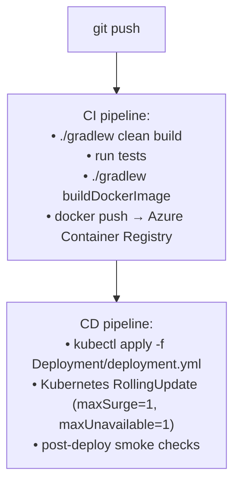

# TVS-Website-Nepal

Liferay DXP 7.4 multi-region website powering TVS Motor's customer-facing sites for LATAM (Mexico, Colombia, etc.) and EU (Germany, Turkey, France, Italy, etc.) markets, plus Nepal, Bangladesh, Saudi, Lebanon, Georgia, and others. Single codebase, region-specific themes and product renderers, deployed as a single container to Azure Kubernetes Service.

> Documentation index — this folder also contains:
> [`HLC.md`](./HLC.md) (high-level code map) ·
> [`HLD.md`](./HLD.md) (high-level design) ·
> [`LLD.md`](./LLD.md) (low-level design) ·
> [`API_SPEC.md`](./API_SPEC.md) (API reference + OpenAPI skeleton)

---

## 1. Overview

| | |
|---|---|
| **Platform** | Liferay DXP 7.4 (`dxp-7.4-u62` / 7.4.13.u102) |
| **Languages** | Java 11, JavaScript (React + plain), FreeMarker, SCSS |
| **Build** | Gradle (Liferay Workspace), Blade CLI, Gulp 4 (themes), Liferay JS Bundler v3 (React widgets) |
| **Search** | Elasticsearch 7 (remote in UAT/prod, embedded in local) |
| **Database** | HSQLDB (local), MySQL/Oracle (UAT/prod — env-specific) |
| **Container** | `liferay/dxp:2023.q4.0` (see `Deployment/dockerfile`) |
| **Orchestration** | Azure Kubernetes Service (AKS), Azure Container Registry |
| **CI/CD** | Azure DevOps pipelines under `azure-pipelines/` |

The platform serves product detail pages, dealer locator, product comparison, and lead-capture forms. Forms are forwarded to the downstream Lead Capture System (LCS) over authenticated REST. OTP delivery is via Plivo. Geolocation/dealer lookup uses the `ib_api.latlong.in` service. See [`HLD.md`](./HLD.md) for the architecture details.

---

## 2. Prerequisites

| Tool | Version | Notes |
|------|---------|-------|
| **JDK** | 11 (Liferay DXP 7.4 baseline) | OpenJDK or Liberica recommended |
| **Blade CLI** | latest | `curl -L https://releases.liferay.com/tools/blade-cli/latest/blade.jar -o blade.jar` (or `brew install blade-cli`) |
| **Gradle** | use the wrapper (`./gradlew`) | No system install required |
| **Node.js** | 16+ (for theme builds) | npm or yarn |
| **Docker** | 20+ | For local container runs and image builds |
| **Git LFS** | latest | Required — `Deployment/patching/*.zip` are LFS-tracked |
| **OS** | Windows / macOS / Linux | Windows uses Git Bash or WSL for `blade`/`gradlew` |

> **Heads-up:** Cloning may fail with a Git LFS smudge error on `Deployment/patching/2023.q4.0_liferay-dxp-2023.q4.0-hotfix-458.zip` if the LFS object isn't available. Workaround: `git lfs install --skip-smudge && git reset --hard HEAD`. The hotfix can be obtained directly from Liferay's customer portal.

---

## 3. Setup

```bash
# 1. Clone the repo
git clone https://github.com/D2C-Website/TVS-Website-Nepal.git
cd TVS-Website-Nepal

# 2. (Optional) skip the LFS hotfix if it fails
git lfs install --skip-smudge
git reset --hard HEAD

# 3. Initialize the Liferay bundle (downloads DXP 7.4 + dependencies)
./gradlew initBundle
# or:    blade gw initBundle

# 4. Build modules and themes once, deploying to bundles/deploy
./gradlew deploy
# or:    blade gw deploy
```

`initBundle` populates `bundles/` (Liferay home) by downloading the DXP archive defined by `liferay.workspace.product` in `gradle.properties`. The first run takes several minutes.

---

## 4. Local Development

### 4.1 Run Liferay locally

```bash
blade server run        # foreground
# or
blade server start      # background
blade server stop
```

Liferay starts at `http://localhost:8080` (Tomcat). Default admin credentials are managed by `Deployment/tvs_liferay/portal-setup-wizard.properties` for fresh local bundles — change them on first login.

### 4.2 Hot-deploy a single module

```bash
# from a module folder
cd modules/Controller
../../gradlew deploy

# or via blade from anywhere in the workspace
blade gw -p modules/Controller deploy
```

Liferay watches `bundles/deploy/` and hot-installs the new JAR. Watch the server log in `bundles/tomcat-*/logs/` for `STARTED` confirmation.

### 4.3 Build a theme

```bash
cd themes/tvs-latam-theme
npm install        # first time only
npm run build      # produces a deployable WAR under build/
```

Then drop the WAR into `bundles/deploy/` (or run `gradle deploy` from the theme folder).

### 4.4 React widget development

```bash
cd modules/product-comparison-react
npm install
npm run build      # produces the Liferay JS bundle
```

### 4.5 Run with Docker (Liferay-only)

```bash
blade gw createDockerContainer
blade gw startDockerContainer
```

This uses the Liferay-provided image with the workspace's `configs/docker/` overlay applied.

---

## 5. Environment Variables / Configuration

Environment values live in **two places**: portal config files at build/deploy time, and runtime environment variables surfaced by Kubernetes.

### 5.1 Per-environment portal config

```
configs/
  ├── common/        applied to every environment
  ├── local/         portal-ext.properties for local dev
  ├── dev/           portal-ext.properties for dev
  ├── uat/           portal-ext.properties + osgi/configs/* for UAT
  ├── prod/          portal-ext.properties + osgi/configs/* for prod
  └── docker/        applied when running via Docker
```

The folder used at build time is selected by the `liferay.workspace.environment` Gradle property (default `local`). `dist*` and `buildDockerImage` tasks bake the selected overlay into the artifact.

### 5.2 Required portal property keys (placeholders — values come from secret store)

| Property key (in `portal-ext.properties`) | Used by | Purpose |
|-------------------------------------------|---------|---------|
| `<companyId>.domain.name` | `Controller` | Liferay base URL per company |
| `<companyId>.client.id` / `<companyId>.client.secret` | `Controller` | Liferay OAuth client for headless calls |
| `<siteId>` | `Controller`, `FormsDetails`, `LatamApis` | Maps Liferay site → country code |
| `<siteName>` | `Controller` | Maps site → channel id (Commerce) |
| `ib.domain` | `Controller` | Dealer-locator base URL |
| `<country>.ib.cc` / `.ib.brand` / `.ib.id` / `.ib.secret` | `Controller` | Dealer-locator credentials per country |
| `<region>.azure.id` / `.azure.secret` / `.azure.resource` | `FormsDetails`, `LatamApis` | Azure client-credentials for LCS auth |
| `azure.endpoint` | `FormsDetails`, `LatamApis` | Azure token endpoint |
| `<region>.lcs.url` | `FormsDetails`, `LatamApis` | Lead Capture System base URL |
| Plivo API keys | `FormsDetails` (OTP) | SMS delivery |
| Database keys (`jdbc.default.*`) | Liferay core | DB connection |
| Search keys | Liferay core | Elasticsearch settings (also in `osgi/configs/`) |

> **Never commit real values.** Local dev uses placeholders; higher environments source values from Kubernetes `Secret` objects mounted as environment variables and Azure DevOps variable groups consumed by the CD pipeline. The full list of property keys consumed by code is in [`LLD.md` §11](./LLD.md).

### 5.3 Container build-time env (in `Deployment/dockerfile`)

| Variable | Default |
|----------|---------|
| `LIFERAY_JVM_OPTS` | `-Xms8192m -Xmx8192m -Xss512k -XX:+UseG1GC ...` |
| `GLOWROOT_ENABLED` | `true` |
| `LIFERAY_DISABLE_TRIAL_LICENSE` | `true` |

### 5.4 Kubernetes runtime env

Defined in `Deployment/deployment.yml`. Production secrets are mounted via `imagePullSecrets: acr-secret` and Kubernetes `Secret` objects (referenced by the team's ops repo, not stored here).

---

## 6. Build

### 6.1 Build everything

```bash
./gradlew build           # compile + test (no deploy)
./gradlew assemble        # compile + package (no test)
./gradlew clean build     # clean rebuild
```

### 6.2 Build a deployable bundle

```bash
./gradlew distBundleZip          # zip
./gradlew distBundleTar          # tar
./gradlew distBundleZipAll       # multi-env distros
```

Output lands under `dist/` at the workspace root.

### 6.3 Build the Docker image

```bash
./gradlew buildDockerImage
```

This produces an image named per `liferay.workspace.docker.image.liferay`. To tag and push to Azure Container Registry:

```bash
docker tag <local-image> tvsmaznplacrdev01.azurecr.io/tvs-motor/tvs-website-nepal:<git-sha>
docker push      tvsmaznplacrdev01.azurecr.io/tvs-motor/tvs-website-nepal:<git-sha>
```

> **Recommendation:** prefer Git-SHA tags over `:latest` for prod deploys. The current `Deployment/deployment.yml` uses `:latest`, which is acceptable for dev but not for deterministic rollbacks.

---

## 7. Deployment

CI/CD is driven by Azure DevOps pipelines:

| Environment | CI pipeline | CD pipeline |
|-------------|-------------|-------------|
| Dev | `azure-pipelines/ci_dev_yml` | `azure-pipelines/cd_dev.yml` |
| UAT | `azure-pipelines/CI_UAT_YAML` | `azure-pipelines/CD_UAT_YAML` |
| Prod | `azure-pipelines/CI_PROD_YAML` | `azure-pipelines/CD_PROD_YAML` |
| Sitecore-integrated UAT | `azure-pipelines/AST_Websites_IB_Sitecore_Liferay_TVS_Website_Nepal_UAT_Pipeline.yml` | — |

### Pipeline flow (per environment)



### Manual rollback

```bash
kubectl rollout undo deployment/liferay-deployment   # K8s rolls to previous ReplicaSet
```

For a config-only revert, re-apply the prior `deployment.yml` / `portal-ext.properties` from Git history and rerun the CD pipeline.

### Liferay DXP hotfixes

Drop hotfix zips into `Deployment/patching/` (LFS-tracked), rebuild the image, redeploy. The Dockerfile copies the patching directory into `/mnt/liferay/patching` where the base image picks them up at start.

---

## 8. Testing

### 8.1 Unit / integration tests

```bash
./gradlew test                              # all tests
./gradlew :modules:FormsDetails:test        # one module
./gradlew :modules:Controller:test --info   # verbose
```

Test stack: JUnit 5, Mockito, PowerMock, AssertJ. Code coverage via Jacoco.

### 8.2 OSGi resolve check (no runtime needed)

```bash
./gradlew resolve
```

Validates that every module can be resolved against the target Liferay platform. Failures point to missing imports/exports.

### 8.3 Manual API smoke tests

After local server is up, hit a few endpoints. The full surface is documented in [`API_SPEC.md`](./API_SPEC.md).

```bash
# Liferay health
curl http://localhost:8080/c/portal/layout

# Sample catalog endpoint
curl 'http://localhost:8080/o/tvs/getProducts?pageSize=5' \
     -H 'Site-Id: 44180' -H 'Company-Id: 20097'

# Sample form (will be rate-limited and CORS-checked in real use)
curl -X POST http://localhost:8080/o/tvs/form/owners-group \
     -H 'Content-Type: application/json' -H 'Site-Id: 44180' \
     -H 'Origin: http://localhost:8080' \
     -H 'X-Azure-ClientIP: 127.0.0.1' \
     -d '{"customerName":"Test","customerMobileNumber":"+919999999999","ownersGroup":"NIN","dealerId":"D1"}'
```

---

## 9. Folder Structure

```
TVS-Website-Nepal/
├── azure-pipelines/        # Azure DevOps CI/CD definitions (dev / uat / prod / sitecore)
├── configs/                # Per-environment portal config (common, local, dev, uat, prod, docker)
├── Deployment/             # Container + K8s + LFS-tracked DXP patches
│   ├── deploy/             # Pre-built JARs/WARs + license activation key
│   ├── tvs_liferay/        # Bundle reference data (HSQLDB, license, tomcat conf)
│   ├── patching/           # Liferay DXP hotfix zips (Git LFS)
│   ├── dockerfile          # Container image definition
│   └── deployment.yml      # Kubernetes Deployment manifest
├── gradle/                 # Gradle wrapper
├── modules/                # OSGi source modules
│   ├── Controller/             # /o/tvs/* JAX-RS app (catalog, geo, language, web content)
│   ├── FormsDetails/           # /o/tvs/form/* JAX-RS app (LCS lead intake, OTP, forms)
│   ├── LatamApis/              # /o/list/* JAX-RS app (LATAM city/dealer reference)
│   ├── servlet-filter/         # CSP & security headers (Liferay hook)
│   ├── product-comparison-react/  # React widget for product comparison
│   ├── context-contributor/    # Theme context enrichment
│   ├── premium-renderer/, premium-renderer_europe/,
│   │   latam-premium-product-detail-renderer/,
│   │   latam-non-premium-product-detail-render/,
│   │   global-eu-product-detail-renderer/,
│   │   moped-renderer/, moped-renderer-europe/,
│   │   ev-renderer/, ev_detail_europe/    # Liferay Commerce product detail renderers
│   └── Product*, ...           # Legacy / pre-built artifacts
├── themes/                 # Liferay themes (one per region)
│   ├── tvs-latam-theme/    │   tvs-mexico-theme/
│   ├── tvs-eu-master-theme/│   tvs-europe-theme/
│   ├── tvs-germany-theme/  └── tvs-turkey-theme/
├── build.gradle, gradle.properties, .blade.properties
├── gradlew, gradlew.bat
└── GETTING_STARTED.markdown   # Liferay Workspace defaults

docs/                       # (this folder, outside the repo)
├── HLC.md   ├── HLD.md   ├── LLD.md   ├── API_SPEC.md   └── README.md
```

---

## 10. Troubleshooting

| Symptom | Likely cause | Fix |
|---------|--------------|-----|
| `git lfs filter-process: smudge filter lfs failed` during clone | LFS object for `Deployment/patching/*.zip` is missing or quota-exhausted | `git lfs install --skip-smudge` then `git reset --hard HEAD` |
| `./gradlew initBundle` hangs or fails to download | Corporate proxy or expired CDN token | Configure proxy via `gradle.properties`, retry; or pre-populate `~/.liferay/bundles/` manually |
| Module redeploys but JSP changes don't show | JSP precompile caching | Clear `bundles/osgi/state/` and `work/` under Tomcat, redeploy |
| Theme changes not visible after rebuild | Browser cache or theme not redeployed | Hard-refresh (Ctrl-Shift-R), confirm WAR landed in `bundles/deploy/` and Liferay log shows `STARTED` |
| `403 Forbidden: Invalid Origin` on form POST | Caller's domain not in `modules/FormsDetails/src/main/resources/allowed-origins.txt` | Add the domain, redeploy `FormsDetails` |
| `403 Access denied. Invalid request source.` on form POST | Missing `X-Azure-ClientIP` header | Set the header upstream (Azure Front Door normally injects it) |
| `429 Too many requests` | More than 20 POSTs to the same `/o/tvs/form/*` path from one IP within 5 min | Wait the `Retry-After` window; for synthetic tests, vary IP or path |
| `500` from `/o/tvs/form/*` with no further info | LCS upstream failure or Azure token-endpoint failure | Check pod logs for `FormsDetailsService` exceptions; verify Azure & LCS endpoint reachability and credentials |
| `Cannot find PropsUtil` / OSGi resolve errors in IDE | Liferay BOM not yet fetched | Run `./gradlew initBundle` and reimport the project |
| Local Elasticsearch fails to start | Embedded ES port collision | Kill stray Java processes on 9200/9300 or switch to remote ES via `osgi/configs/...ElasticsearchConfiguration.config` |
| Admin login fails on fresh local bundle | Setup-wizard credentials not applied | Check `Deployment/tvs_liferay/portal-setup-wizard.properties`; reset by deleting `bundles/data/hypersonic/` and rerunning |
| Liferay container OOM in K8s | JVM heap too low for traffic | Raise pod memory request/limit; tune `LIFERAY_JVM_OPTS` in `Deployment/dockerfile` |

For deeper diagnostics:

- Server logs: `bundles/tomcat-*/logs/catalina.out` (local) or `kubectl logs -f deployment/liferay-deployment` (cluster).
- OSGi state: `bundles/osgi/state/` or via Gogo shell `lb` / `inspect cap *`.
- JVM metrics: Glowroot is enabled at the JVM level; expose its port if not already wired to APM.

---

## 11. Maintainers / Contact

> Replace these placeholders before publishing.

| Role | Name / Team | Contact |
|------|-------------|---------|
| **Tech lead** | _TBD_ | _email@example.com_ |
| **Product owner** | _TBD_ | _email@example.com_ |
| **Platform / DevOps** | _TBD (D&AI Engineering)_ | _email@example.com_ |
| **Liferay vendor / partner** | _TBD_ | _email@example.com_ |
| **On-call rotation** | _PagerDuty / Opsgenie schedule URL_ | — |
| **Slack** | `#tvs-website-nepal-eng`, `#tvs-website-nepal-ops` | _TBD_ |
| **Issue tracker** | Atlassian Jira project `D2C` | https://tvsmotorcompany.atlassian.net |
| **Wiki / specs** | Confluence space `DE2` | https://tvsmotorcompany.atlassian.net/wiki/spaces/DE2 |

---

## 12. License & Compliance

- Liferay DXP is used under TVS Motor Company's commercial subscription. The activation key lives at `Deployment/deploy/activation-key-*.xml` and is not redistributable.
- Third-party SDKs (Plivo, Apache HttpClient, Jackson, etc.) retain their respective licenses — see each module's `build.gradle` for declarations.
- Customer PII handled by this platform (form submissions) is forwarded to LCS and is not persisted locally beyond ephemeral logs. Review GDPR/data-residency obligations with the privacy team before adding new data fields.

---

*Last updated: May 2026. See `docs/HLD.md` for architecture context, `docs/LLD.md` for implementation detail, `docs/API_SPEC.md` for the API contract.*
